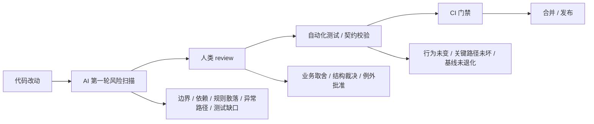

我现在更愿意把 AI code review 看成一种“第一轮风险扫描”，而不是一种“最终裁决”。
这句话听起来不新，但它其实决定了 AI 在流程里的位置。

如果你把 AI 当成最终 reviewer，它很容易去做两件低价值的事：

- 盯格式、盯命名、盯表面一致性
- 对真正需要上下文判断的改动给出看似完整、实际很飘的结论

但如果你把 AI 放在第一轮，它就可以做一件更值钱的事：

`先把这次改动里最容易埋雷的地方挑出来，再把真正需要人判断的部分留给 reviewer。`

## AI 该先看什么

我会把 AI review 的优先级排成这样：

1. 先看边界和依赖有没有被打穿
2. 再看业务规则有没有重复散落
3. 再看临时补丁有没有混进长期层
4. 再看接口语义、异常路径、回滚路径清不清楚
5. 最后才看命名、格式、注释这些表层问题

这个顺序很重要，因为它对应的是风险成本，不是阅读舒适度。

### 1. 边界被打穿

AI 最应该先抓的，是这次改动有没有把系统边界打穿。

典型信号包括：

- 某个模块突然开始直接依赖不该依赖的实现
- 某层职责被悄悄跨过去了
- 数据流开始绕过原本清楚的 ownership
- 一段本来应该独立的逻辑被顺手塞进了别的层

这种问题 reviewer 有时也能看到，但 AI 很适合先扫一遍，因为它很擅长从 diff 里把“有没有越界”这种结构风险挑出来。

### 2. 规则重复散落

AI 也应该优先抓“同一条规则开始在多个地方各写一份”。

这类问题表面上看不大，实际会把后续维护成本拉高得很快。
今天在 UI 里改一次，明天在业务层补一次，后天在资源或网络回调里再补一次，表面上每次都能跑，实际上规则已经没有单一真相了。

AI 的作用，不是替你证明它现在还能跑，而是提醒你：

`这条规则已经开始散了，后面会越来越难改。`

### 3. 临时补丁混进长期层

临时补丁本身不是坏事，坏的是它被放进了最稳定、最难改的地方。

AI 很适合扫这类信号：

- 为了赶版本，直接在核心层塞了应急分支
- 为了兼容旧场景，给新逻辑加了没有边界的例外
- 为了省事，把本来应该局部化的修复写成了长期结构

这类东西 reviewer 往往也会看见，但 AI 先扫出来很有价值，因为它会逼你先问一句：

`这是局部止血，还是在制造长期债务。`

### 4. 接口语义不清

AI 也应该重点看接口语义清不清楚。

这里的接口不只是 API，还包括：

- 参数到底表示条件、开关、策略还是兼容位
- 返回值到底代表成功、失败还是部分完成
- 异常路径和回滚路径到底怎么走
- 调用方是不是得靠猜才能用

很多问题不是“能不能调用”，而是“调用方能不能准确预期行为”。这种含糊一旦放过去，后面就会变成多人协作里的慢性 bug。

### 5. 异常和回滚路径

AI 也很适合盯异常路径和回滚路径。

正常路径写得再顺，如果失败时发生什么说不清，系统还是不稳。
AI 应该优先问这些问题：

- 出错后是直接失败、局部失败，还是继续降级
- 回滚会不会留下半完成状态
- 默认值会不会掩盖真实错误
- 某个异常分支是不是只有作者脑子里存在

这类东西表面上不抢眼，但它们通常才是真正决定系统可靠性的地方。

### 6. 缺少必要测试

最后，AI 应该主动提醒这次改动有没有缺必要测试。

但这里的测试，不是“多写点单测”这种口号，而是看这次改动的关键行为有没有被钉住：

- 关键分支有没有覆盖
- 边界条件有没有覆盖
- 回滚路径有没有覆盖
- 这次最不敢撞的旧行为有没有被保护住

AI 不一定能直接判断测试该怎么写，但它应该能看出来：

`这次改动如果不补验证，后面很可能连问题出在哪都说不清。`

## AI 不该抓什么

AI review 不是万能的。它有几类东西不该过度介入。

### 1. 纯格式问题

命名、缩进、空行、import 排序，这些当然可以提，但它们不该占主位置。

原因很简单：

- 这些问题适合自动化工具
- 它们的风险成本最低
- 它们最不值得消耗 reviewer 和 AI 的注意力

如果 AI 把大量精力放在这类问题上，通常意味着它还没进入真正的工程判断层。

### 2. 设计取舍的终判

AI 不能做架构取舍的最终裁决。

因为架构判断依赖很多它不稳定掌握的东西：

- 项目当前阶段
- 团队历史包袱
- 版本压力
- 既有约束
- 哪条路径更适合当前的人力

这些东西不是靠“读 diff”就能完全得到的。AI 可以提问，可以提醒风险，但不能替你决定“这次到底值不值得改”。

### 3. 需要上下文的例外判断

有些改动本质上是例外处理，不是通用规则。

如果 AI 没有足够上下文，很容易把这种例外误判成坏味道，或者把真正的坏味道误看成合理妥协。

这类问题必须交给人，因为它们依赖的是：

- 业务目标
- 阶段目标
- 历史原因
- 方案取舍

AI 可以辅助看见例外，但不能替你批准例外。

## 一张图

这张图想表达的不是“AI 不重要”，而是它有边界。
AI 适合先把风险挑出来，人负责做最终判断，自动化测试负责证明行为没坏，CI 负责把确定好的门槛硬拦下来。

## 真正该拦的

我现在越来越相信，AI review 最有价值的地方，不是指出更多“看起来不对”的东西，而是尽早拦住那些会不断制造利息的结构问题。

如果一份 PR 让边界更糊、规则更散、异常更不清、测试更少，那它就该被拦。
反过来，如果它只是局部命名还能再磨一磨，或者某个格式还能再顺一下，但整体风险已经收住了，那 AI 和 reviewer 都不该在细枝末节上耗太久。

`AI code review 真正该保护的，不是代码长得像不像样，而是团队未来还能不能低成本、低风险地继续改。`

如果你愿意继续往下看，下一篇更适合讲的是：AI review、人类 review、自动化测试和 CI 到底怎么分工。
