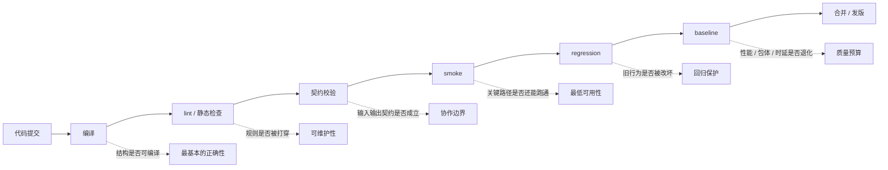

很多团队一说自动化测试，脑子里先浮出来的还是“多写几个单测”“把某个类补到 80% 覆盖率”。这当然有价值，但它离真正的工程质量还差一截。

我现在更愿意把自动化测试理解成一件更具体的事：

`它不是单点技巧，而是一条分层验证链。`

这条链的目标也不是“证明代码写得优雅”，而是把那些本来应该在更早阶段发现的问题，前移到编译、导入、构建、合并和发布之前。换句话说，自动化测试真正有价值的地方，不在于它能不能帮你“多测一点”，而在于它能不能把质量变成门禁。

## 先把门禁讲清楚

如果把一个改动从写代码到上线画成一条线，最稳的做法不是只在最后看一次结果，而是让每一层都承担自己该承担的责任。

这张图想表达的不是“流程越长越高级”，而是每一层都在处理不同类型的问题。

编译负责的是“代码能不能被机器理解”。
lint 和静态检查负责的是“你有没有明显打穿规则”。
契约校验负责的是“输入输出、资源、配置、依赖关系是不是还成立”。
smoke 负责的是“最关键的路径还能不能跑起来”。
regression 负责的是“旧真相有没有被新改动悄悄改坏”。
baseline 负责的是“看起来能跑的东西，有没有在性能、包体、加载时间上继续变差”。

## 每一层到底保什么

**编译保的是下限。**  
它不告诉你代码写得好不好，只告诉你最基本的结构是不是成立。很多团队把编译当成理所当然，但一旦有动态加载、脚本生成、跨平台差异、条件编译，这一层的价值就会突然变得很高。编译不过，说明不是“还有待优化”，而是“系统结构已经断了”。

**lint 保的是重复判断。**  
命名、空值、未使用变量、危险写法、明显的风格冲突，这些问题不值得让人一遍遍看。lint 的价值不在于它多高级，而在于它把那些“每次都得重新判断一遍”的事，变成了稳定、低成本、可重复的规则。

**静态检查保的是工程边界。**  
它比 lint 更像“组织纪律”。比如某一层不该直接依赖另一层，某种 API 不该在某个模块里出现，某类对象只能从特定入口生成，某些配置字段必须成对出现。真正高价值的静态检查，通常不是检查语法，而是检查你有没有把系统边界打穿。

**契约校验保的是协作语义。**  
表字段、资源路径、事件参数、配置开关、返回值语义，这些东西一旦散到多个团队手里，就会从“技术细节”变成“协作契约”。契约一旦不自动检查，review 往往只能看到“这个字段写没写”，看不到“这个字段进来以后会不会把系统边界撞坏”。

**smoke 保的是最低可用性。**  
它不是全量回归，也不是重型集成测试，而是确认关键入口、关键资源、关键配置、关键渲染链路、关键功能最起码还活着。它的职责很简单：让你在更早的时候知道“这次改动已经不是局部小修，而是把最核心的路径撞坏了”。

**regression 保的是已知真相。**  
只要系统里有“以前就是这样工作的”东西，就该有对应的回归保护。很多团队口头上说“我们有测试”，但如果测试只覆盖新功能，没覆盖旧真相，那自动化测试其实只是在帮你确认“新代码能跑”，并没有帮你确认“旧东西没坏”。

**baseline 保的是预算。**  
性能、包体、加载时间、首帧、Crash 率、关键资源数量，这些都不是“感觉差不多就行”的问题。它们需要有明确阈值，因为它们代表的是长期成本。一旦没有阈值，团队最后就会退化成“好像慢了一点，但还能发”“好像大了一点，但还没炸”的状态。

## 为什么很多团队“有测试”但还是不稳

最常见的问题，不是团队完全没测试，而是测试和门禁没接上。

第一种情况是，测试只在局部存在。  
某个类有单测，某个系统有回归，但它们之间没有形成一条连续的验证链。结果就是代码表面上“测了不少”，真正出问题的边界却没人盯。

第二种情况是，测试只证明“没挂”，没有证明“没退化”。  
这类测试看起来是绿的，但它只是在告诉你当前样本没有炸，并不告诉你这次改动有没有把性能、包体、加载时间或者关键路径的稳定性悄悄拖差。

第三种情况是，测试结果不参与决策。  
如果测试只是跑完生成一份报告，但不影响合并、不影响构建、不影响发版，那它就只是一个观察工具，不是门禁。真正的门禁，必须能在该拦的时候拦住。

第四种情况是，测试和人工判断的边界混了。  
有些团队习惯把“测试没报错”当成“可以放心合并”，把“review 看过了”当成“质量足够了”。这两件事都不够。review 负责判断结构和取舍，测试负责证明行为和真相，两者不能互相替代。

## 什么叫把测试接进门禁

“接进门禁”不是说测试名字起得更正式，也不是说 CI 里多跑了几个命令。它的意思很简单：

`测试结果开始决定一件改动能不能继续往前走。`

这意味着几件事：

- 本地提交前，最基础的规则就应该能拦住最明显的问题。
- PR 阶段，关键测试结果应该直接影响能不能合并。
- 构建阶段，资源、配置、产物和基线问题应该能把不合格版本挡下来。
- 发版前，回归、烟测和预算检查应该能把高风险版本再拦一次。

门禁的核心不是“测试越多越好”，而是“高频、明确、可重复的规则要尽早拦住”。如果一条检查能被清楚地写成规则、能稳定复现、能在足够早的时候发现问题，它就不该继续依赖人记忆。

## 为什么测试不能替代 review

测试和 review 解决的问题不一样。

测试回答的是：这次改动把什么行为改了，旧行为是不是还成立。

review 回答的是：这次改动的边界是不是合理，依赖方向有没有被打穿，临时补丁是不是已经长进长期层。

所以测试不能替代 review，review 也不能替代测试。前者擅长证明，后者擅长判断。

如果只靠测试，很多结构性问题会被拖到很后面才爆出来。  
如果只靠 review，很多重复、明确、可枚举的问题又会变成纯人工消耗。

真正稳定的做法，是把两者放在不同层里：

- review 负责判断这次改动值不值得、边界有没有被打穿。
- 自动化测试负责证明改动没有悄悄改坏已知行为。
- CI 负责把明确的规则硬拦下来。

## 更稳的落地顺序

如果一个团队现在还没有一套很完整的验证链，我建议按这个顺序补：

1. 先补编译、lint、静态检查这类最稳定的硬规则。
2. 再补配置契约、资源引用、关键路径这类最容易出事故的约束。
3. 再补 smoke，把最关键的入口和链路先守住。
4. 再补 regression，把旧真相保护起来。
5. 最后补 baseline，把性能、包体和加载这类长期成本接进来。

这个顺序的目的，不是让你“先做少一点”，而是先做最值得拦的东西。  
因为一旦自动化测试开始和团队流程绑在一起，它就不只是一个工具，而会变成制度。

## 结尾

所以我现在更愿意把自动化测试理解成一条很朴素的工程路径：

`先用编译和静态规则兜住下限，再用契约、smoke、regression 和 baseline 挡住回归，最后把这些检查接进门禁。`

它真正保护的，不是测试本身，而是团队还能不能在下一轮需求、下一次版本压力、下一次重构里继续低成本地修改系统。
