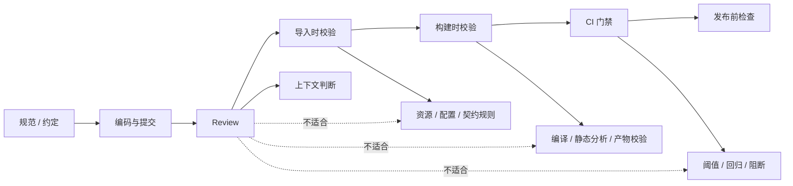

我现在越来越不信一种做法：把很多本来应该机械判断的问题，最后都交给人来盯。

因为 review 再认真，也只能解决一小部分问题。人擅长判断上下文，擅长在两种方案之间做取舍，擅长在信息不完整的时候补齐意思；但人不擅长长期稳定地记住规则，更不擅长在几十个 PR、几百次改动里，一遍不漏地重复同一类检查。

真正可靠的工程质量，往往不是“大家都很负责”，而是这些东西已经被拆开了：

- 该人看的一部分，留给人看
- 该机器拦的一部分，提前拦掉
- 该在导入时发现的，别等到构建才发现
- 该在构建时发现的，别等到线上才知道

如果把这件事压成一句话，我更愿意这么说：

`review 负责判断“这次改动是不是合理”，自动检查负责判断“这次改动有没有违反已知规则”。`

## 先把几种护栏放到同一张图里

这张图想表达的不是“review 不重要”，而是它有边界。

review 适合看的是：这次改动有没有把设计意图改坏、有没有把边界打穿、有没有把长期维护成本偷偷抬高。它不适合承担的，是那些只要规则定下来就能机械判断的事。

只要某个问题满足下面三个条件，就应该尽量自动化：

- 输入清楚
- 输出明确
- 判断标准可枚举

满足这三条的，就别再把希望寄托在“某个资深同学记得提醒一下”上。

## 哪些问题必须自动检查

### 编译、静态检查、格式化

这类检查最容易被误解成“太基础了，没必要单独说”。

但基础不等于可省。相反，越基础的规则，越应该让机器处理，因为它们最适合机械判断。

编译错误不该靠 review 发现。静态分析不该靠经验发现。格式化不该靠“看起来差不多”发现。

它们的价值不在于多高级，而在于三个词：

- 稳定
- 低成本
- 可重复

如果一个问题每次都只需要同样的判断逻辑，那就不该让人一遍遍重复。

### 资源规则

资源类问题特别适合自动化，因为它们有大量固定契约。

比如：

- 命名规则
- 路径规则
- 分组边界
- 引用关系
- 重复资源
- 缺失引用
- 首载资源
- 版本兼容

这类问题最怕“默认大家都知道”。只要项目一大，团队一多，所谓“知道”就会迅速变成“记不清、说不全、各说各话”。

资源规则不自动化，后面通常会变成两种后果：

1. 出问题时靠人肉排查
2. review 时只能凭感觉提醒，提醒完也没有硬约束

这不是质量管理，这是把质量放在了记忆力上。

### 配置契约

配置最容易出问题，因为它看起来像数据，实际上常常是契约。

一份配置可能同时影响：

- 业务逻辑
- UI 表现
- 资源加载
- 网络请求
- 平台差异
- 灰度开关

如果这些契约不做自动校验，review 很容易只看到“字段写没写”，看不到“这个字段写进去以后，整个系统会不会被撞坏”。

配置契约类检查，应该尽量在最早的地方出现：

- 编辑器导入时
- 构建前
- CI
- 发布前

越早发现，回滚成本越低。

### 基线阈值

基线阈值是工程质量里最容易被口头化的一类问题。

比如性能、包体、加载时间、崩溃率、首帧时间、关键资源数量，这些都不是“感觉差不多就行”的东西。

它们必须被量化成规则，不然团队最后会变成这种状态：

- 这次好像慢一点，但不明显
- 包体大一点，但还能发
- 崩溃率高一点，但先观察

这些判断单独看都合理，叠在一起就会把系统慢慢拖垮。

基线的意义，不是追求绝对值永远不变，而是让变化有边界、超出边界有动作。

### 构建产物校验

真正危险的变化，很多不是在源码层面看出来的，而是在产物层面才暴露。

构建产物校验应该检查的是：

- 该进包的东西有没有进
- 不该进包的东西有没有混进去
- 关键路径的文件是否完整
- 资源版本是否一致
- 生成物是否可复现
- 产物大小是否超阈值

这类问题只靠 review 基本不够，因为 review 看的是“你改了什么”，而构建产物校验看的是“最后到底产出了什么”。

两者不是替代关系，是不同层面的护栏。

## 为什么“靠经验记住”不可靠

团队一开始小的时候，很多东西都能靠人记。

但“能记住”不等于“值得继续记住”。一旦项目开始增长，规则就会膨胀到这种程度：

- 一个模块有自己的约定
- 一个资源目录有自己的边界
- 一个配置表有自己的校验逻辑
- 一个发布流程有自己的阈值
- 一个老问题有自己的规避方式

这时如果还靠人记，质量就会变成概率问题。

问题不在于“人会不会忘”，而在于“人一定会忘，而且忘的不是同一个地方”。

所以自动化不是为了替代负责的人，而是为了把人最不擅长的那部分，从系统里拿掉：

- 重复判断
- 固定规则
- 机械比对
- 大量回归
- 低价值但必须做的确认

人应该去看更值钱的东西：

- 这次改动的意图是什么
- 设计边界有没有被改坏
- 规则本身要不要更新
- 有没有更好的拆分方式
- 这次是不是在制造未来的维护成本

## 什么不该自动化

自动化不是越多越好。

有些东西如果硬做成机器检查，反而会把团队拖进新的麻烦里。

### 上下文判断

比如：

- 这次改动是否符合业务方向
- 两个方案哪个更适合当前阶段
- 这个重构是不是值得
- 这个接口是该抽象还是该保留简单

这些问题都需要上下文，不适合变成纯规则。

### 方案取舍

自动检查很适合告诉你“你违反了规则”，但不擅长告诉你“规则本身要不要改”。

如果一个问题本质上是取舍，强行自动化只会把讨论提前冻结成僵硬规则。

### 一次性事件

如果某个问题只会出现一次，或者修复成本远高于再次发生的概率，那就不值得为了它单独做一套自动化系统。

工程上需要的是克制，不是把所有痛点都做成大系统。

### 试验性变化

当方案还在探索期，规则经常变，自动化太早上，很容易让团队把时间花在维护检查器上，而不是验证方向。

这时候更适合先用人工 review 和小范围验证，等规则稳定了，再把高频部分自动化。

## 更稳的落地顺序

如果你想把“自动检查”真正接进团队流程，我建议按这个顺序想：

1. 先把最稳定、最明确、最容易重复的问题自动化
2. 再把高频回归、资源规则、配置契约接进去
3. 再把基线阈值和构建产物校验接进 CI
4. 最后才去补更细的门禁和更强的发布前检查

这个顺序的核心，不是“先做少一点”，而是“先做最不容易争议的部分”。

因为自动化一旦和团队流程绑定，它就不只是工具了，它会变成制度。

## 最后怎么判断

我现在判断一个问题值不值得自动化，常用的是这句：

`如果这条检查能被清楚地写成规则、能被稳定复现、能在足够早的时候发现问题，那就不该继续依赖人盯。`

反过来，如果它必须依赖业务背景、设计意图、阶段目标和方案取舍，那它就更适合留给人。

这才是我理解里的工程质量：

- review 负责判断
- 规范负责约束
- 自动检查负责兜底
- CI 负责门禁
- 导入时校验负责提前发现
- 构建时校验负责把最后一道硬问题挡住

把这些层次分清，团队才不会一直在“大家都要认真一点”这种空话里打转。
