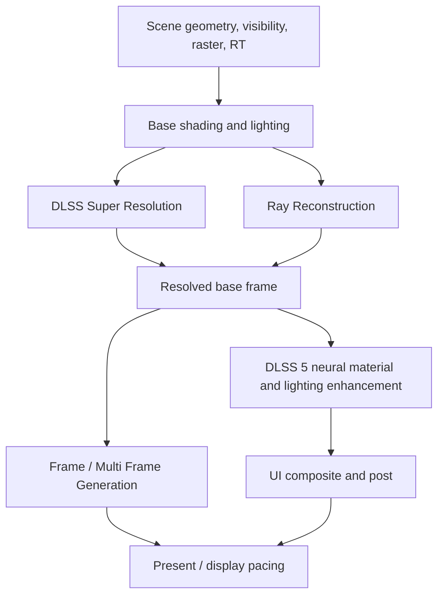

---
title: "DLSS 进化论 07｜DLSS 5：从重建像素，走向实时神经着色"
description: "基于 NVIDIA 2026 年 3 月 16 日官方公告，从渲染流水线、硬件边界和驱动运行时角度解释 DLSS 5 到底意味着什么。"
slug: "dlss-evolution-07-dlss5-visual-fidelity"
weight: 110
featured: false
tags:
  - DLSS
  - Neural Rendering
  - Visual Fidelity
  - RTX
  - GPU Architecture
series: "DLSS 进化论"
---

## 这篇要回答什么

`2026-03-16`，NVIDIA 正式公布 DLSS 5。官方对它的定义已经不是 super resolution、frame generation 或 ray reconstruction 这类单点功能，而是一个 **real-time neural rendering model**，目标是为游戏画面注入 **photoreal lighting and materials**。[NVIDIA DLSS 5，2026-03-16](https://www.nvidia.com/en-us/geforce/news/dlss5-breakthrough-in-visual-fidelity-for-games/)

这意味着 DLSS 的问题定义又变了。

- `DLSS 2` 的问题是：怎样把低分辨率帧重建成高分辨率帧。  
- `DLSS 3/4` 的问题是：怎样把帧生成、光线重建和时域稳定性组织成一条可交付链路。  
- `DLSS 5` 的问题则更激进：**在仍然受实时预算、3D 世界和美术约束的前提下，模型能否直接参与“材质与光照应该看起来多真实”这件事。**

这篇文章不只复述 NVIDIA 的宣传语，而是拆解三个更硬核的问题：

1. 官方给出的 `color + motion vectors` 输入契约，在工程上到底意味着什么。  
2. DLSS 5 更像插在渲染流水线的哪一段，它和 DLSS 4.5 的边界到底怎么分。  
3. 如果它真的要在 `up to 4K` 实时运行，对硬件、驱动、运行时和开发者接入会提出什么新约束。  

## 一、先把 NVIDIA 官方表述翻译成工程语言

DLSS 5 官方页里最关键的几句，压缩起来是这组信息：

- NVIDIA officially unveiled `DLSS 5`。  
- 它是一个 `real-time neural rendering model`。  
- 输入是每帧的 `color and motion vectors`。  
- 输出目标是 `photoreal lighting and materials`。  
- 输出必须 `deterministic`、`temporally stable`、`anchored to the game’s content`。  
- 它仍通过 `NVIDIA Streamline` 接入，并给开发者提供 `intensity, color grading and masking` 控制。  
- 它可在 `up to 4K resolution` 实时运行，并计划 `this Fall` 落地游戏。  
  [NVIDIA DLSS 5，2026-03-16](https://www.nvidia.com/en-us/geforce/news/dlss5-breakthrough-in-visual-fidelity-for-games/)

这几句话如果按工程含义拆开，可以得到三个结论。

### 1. 它不是纯生成视频模型

NVIDIA 在公告里专门强调，现有 video AI models 往往离线、难控制、不可预测；而游戏像素必须 deterministic、实时、紧贴开发者的 3D 世界和 artistic intent。这个表述等于在主动划清边界：

- DLSS 5 不是 prompt 驱动的自由生成。  
- 它不能每次运行都给出不同答案。  
- 它必须对同一输入在同一条件下给出稳定结果。  
- 它必须尊重游戏已有几何、材质分层、镜头语言和美术风格。  

也就是说，DLSS 5 更接近 **受约束的实时神经着色器**，而不是“把游戏帧丢给一个视频生成模型，让它自由发挥”。

### 2. 它也不是传统意义上的后处理滤镜

如果一个系统的目标只是给现有画面加 bloom、tone mapping 或锐化，它不需要理解 hair、fabric、translucent skin、front-lit、back-lit、overcast 这些语义。可 NVIDIA 官方明确写到，DLSS 5 的 end-to-end 模型要理解这些复杂 scene semantics 与 lighting conditions，并据此处理 subsurface scattering、fabric sheen、hair 的 light-material interaction。[NVIDIA DLSS 5，2026-03-16](https://www.nvidia.com/en-us/geforce/news/dlss5-breakthrough-in-visual-fidelity-for-games/)

这说明它的目标不是“把一张图修得更讨喜”，而是：

- 从当前帧中识别出哪些区域属于皮肤、头发、织物、半透明材质。  
- 识别光线环境属于背光、顺光、阴天还是其他照明条件。  
- 按语义和光照上下文，重建更像电影级 shading 的局部结果。  

这比传统 post-process 的复杂度高得多，也更接近一种 **神经材质/神经光照增强器**。

### 3. 它从一开始就被设计成受美术控制

DLSS 5 页面里有一个很容易被忽略、但非常重要的细节：它为开发者提供 `intensity, color grading and masking`。这意味着 NVIDIA 已经默认承认两件事：

- 模型输出不是天然就“等于正确美术风格”。  
- 游戏开发者必须能控制它的作用强度、色彩倾向和作用区域。  

从工程角度看，这很像在告诉开发者：**DLSS 5 不是替代引擎的最终审美权，而是被纳入 art direction pipeline 的一个新节点。**

## 二、`color + motion vectors` 这个输入契约，到底在暗示什么

DLSS 5 官方公开写出来的显式输入只有两项：`color` 与 `motion vectors`。这个信息非常值得细想。

### 1. 这说明 NVIDIA 想尽量复用现有 DLSS 接入面

如果官方一上来要求一长串新 G-buffer，比如 normals、roughness、material ID、albedo、reactive mask、transparency classification、per-object lighting tags，那就意味着接入层将大幅膨胀，很多老集成也很难平滑升级。

但现在官方写得很克制，这更像是在传递一个信号：

- 至少在公开契约层，NVIDIA 希望 DLSS 5 继续站在已有 DLSS / Streamline 管线之上。  
- 对开发者来说，它看上去不想先变成“重写整套 render graph 才能接”的特性。  
- 对运行时来说，它可能仍然主要依赖已有帧输出和运动信息，再在内部叠加更复杂的模型推理。  

这也是为什么 NVIDIA 特别强调接入仍然通过同一套 Streamline framework。[NVIDIA DLSS 5，2026-03-16](https://www.nvidia.com/en-us/geforce/news/dlss5-breakthrough-in-visual-fidelity-for-games/)；[NVIDIA Streamline](https://developer.nvidia.com/rtx/streamline)

### 2. 但这并不等于它真的只需要两个 buffer

这里要做一个明确区分：**官方公开表述的输入**，不等于 **运行时内部真正只看两个张量**。

基于 DLSS 2、3、RR 和 NGX 既有设计，比较稳妥的推断是：

- `color + motion vectors` 是它对外最核心、最容易理解的输入抽象。  
- 运行时内部很可能仍然利用历史帧、曝光、分辨率比例、裁剪信息、可能的深度或额外 metadata。  
- 但在 DLSS 5 的首发宣传里，NVIDIA 刻意没有把它包装成“再喂更多 G-buffer 才能工作”的 feature。  

这里我是在做**基于现有 DLSS 接入模式的推断**，不是直接引用 NVIDIA 明文声明。之所以这么推断，是因为：

- DLSS 2 明确依赖 temporal feedback、motion vectors 与游戏数据。[NVIDIA DLSS 2.0，2020-03-23](https://www.nvidia.com/en-us/geforce/news/nvidia-dlss-2-0-a-big-leap-in-ai-rendering/)  
- DLSS 3 的 Frame Generation 明确依赖图像、optical flow、motion vectors 与深度等信号。[Introducing NVIDIA DLSS 3](https://www.nvidia.com/en-my/geforce/news/dlss3-ai-powered-neural-graphics-innovations/)  
- NGX 编程指南从更底层说明，evaluate feature 时可向 feature 传入多种缓冲与参数，而不是只有一张颜色图。[NVIDIA NGX Programming Guide](https://docs.nvidia.com/ngx/programming-guide/index.html)

所以，更合理的理解是：`color + motion vectors` 是 DLSS 5 的核心输入概念，但不必把这句话机械理解成“模型在任何实现里都严格只读两个输入”。

### 3. 只公开 `color + motion vectors`，也意味着它必须非常重视错误约束

输入越少，模型自由度越大；自由度越大，输出越容易偏离真实内容。所以 NVIDIA 才会在同一段里高密度强调：

- anchored to source 3D content  
- deterministic  
- consistent from frame to frame  
- temporally stable  

从建模角度讲，这些词几乎都在描述 **如何抑制模型幻觉**。

也就是说，DLSS 5 的难点不是“能不能生成更像电影的像素”，而是：

- 如何在有限输入下推断出更高级的材质与光照特征。  
- 同时不把角色脸、衣服纹理、边缘结构和美术意图改坏。  
- 并且在镜头运动时不闪、不漂、不变形。  

这和一般 AI 视频增强的目标完全不是一回事。它要求的是 **强约束下的可控增强**，不是开放式生成。

## 三、DLSS 5 更像插在渲染流水线的哪个位置

这里必须先说结论：从 NVIDIA 公开信息看，DLSS 5 最像一个 **位于传统渲染结果之后、显示输出之前的神经材质/神经光照增强阶段**。它不太像在替代引擎前端的几何或光栅化，也不太像单纯接在最后一层做色彩滤镜。

可以把现阶段的 DLSS 家族粗略理解成这样：

```text
Geometry / Visibility / Raster / Ray Tracing
  -> Base shading and lighting
  -> DLSS Super Resolution
  -> Ray Reconstruction
  -> Frame / Multi Frame Generation
  -> DLSS 5 neural visual fidelity pass
  -> UI composite / post / present
```

上面这个顺序不是 NVIDIA 官方公开的标准流水线图，而是基于现有公开资料做的**结构性推断**。它的理由是：

- DLSS 5 以每帧 color 为核心输入，说明它至少发生在基础着色结果已经形成之后。  
- 它又要对 lighting 和 materials 做语义级增强，说明它不能只是传统 tone mapping 之后的一层锐化。  
- 它还要求 temporally stable 和 consistent from frame to frame，说明它很可能要利用历史上下文，而不是纯单帧滤镜。  
- 它继续通过 Streamline 接入，说明它更像现有 DLSS 插件栈的新增 pass，而不是要求引擎把材质系统整体替换成神经网络。  

如果再压成一句更技术的话：

> DLSS 5 更像是在“可见表面已经确定、基础画面已经生成”之后，对局部材质响应和光照外观做一次受约束的神经重着色。

## 推测版流水线

下面这张图不是 NVIDIA 官方图，而是基于现有公开材料给出的 **工程化推测图**。它的作用不是下结论，而是帮助读者把 DLSS 5 放进已经熟悉的 SR / RR / FG / Present 流程里。



如果把它翻成更接近代码的形式，大致会像这样：

```cpp
BaseFrame = RenderAndShade(scene, internalResolution);
Upscaled = DLSSSuperResolution(BaseFrame, history, motionVectors, depth);
Lighting = RayReconstruction(rayBuffers, history, motionVectors);
Resolved = Composite(Upscaled, Lighting);

Enhanced = DLSS5AppearanceEnhancement(
    Resolved,
    motionVectors,
    history,
    artistControls,
    masks
);

if (frameGenerationEnabled) {
    Output = FrameGeneration(previousDisplayedFrame, Enhanced, opticalFlow, motionVectors);
} else {
    Output = Enhanced;
}

Present(Output);
```

这段伪代码同样不是 SDK 示例，只是用来说明一件事：**DLSS 5 更像发生在“基础画面已经可被显示”之后，但又早于最终呈现的一层神经重着色/视觉增强 pass。**
## 四、它和 DLSS 4.5 的本质差别，不是“更强一点”

DLSS 4.5 的能力边界仍然基本属于这些方向：

- Super Resolution：把少量原生像素重建成目标分辨率输出。  
- Dynamic Multi Frame Generation：根据性能和显示条件动态决定生成帧策略。  
- Ray Reconstruction：替代多个传统 denoisers，重建更干净稳定的光追结果。  
- Transformer models：提升时域稳定性、细节保持和 ghosting 控制。  
  [NVIDIA DLSS 4.5，2026-01-06](https://www.nvidia.com/en-us/geforce/news/dlss-4-5-dynamic-multi-frame-gen-6x-2nd-gen-transformer-super-res/)；[NVIDIA GDC 2026 更新，2026-03-10](https://www.nvidia.com/en-us/geforce/news/gdc-2026-nvidia-geforce-rtx-announcements/)

这些能力的共同点是：**它们主要处理“已有渲染结果如何更高效、更稳定、更连续地呈现”**。

而 DLSS 5 的公开目标已经明显更前一步：

- 它不是先问“这张图怎么更像原生 4K”。  
- 也不是先问“怎样多插几帧更顺滑”。  
- 它直接问“怎样让实时画面更像 photoreal VFX”。  

从目标函数上看，DLSS 4.5 仍然是 `quality-per-cost optimization`，DLSS 5 则开始带有明显的 `appearance optimization` 色彩。

也因此，DLSS 5 更像是 DLSS 家族第一次把“视觉真实感本身”当成主产品卖点，而不是把它作为 SR、RR、FG 的副产物。

## 五、如果它真要在 4K 实时跑，硬件边界会被推到哪里

这里 NVIDIA 官方没有公开完整硬件实现细节，所以接下来这部分属于**结合公开架构资料做的工程推断**。

### 1. 它对 Tensor Core 的压力会比 DLSS 4.5 更像“持续在线的重着色”

DLSS 4/4.5 已经让 Blackwell 的 5th-gen Tensor Cores 承担 SR、RR、MFG 等多项任务，并通过 hardware Flip Metering 与 display engine 协同保证节奏稳定。[NVIDIA DLSS 4 技术文章，2025-01-06](https://www.nvidia.com/en-us/geforce/news/gfecnt/20251/dlss4-multi-frame-generation-ai-innovations/)；[NVIDIA Blackwell GeForce RTX 50 发布，2025-01-06](https://nvidianews.nvidia.com/news/nvidia-blackwell-geforce-rtx-50-series-opens-new-world-of-ai-computer-graphics)

DLSS 5 如果还要在同一帧预算中额外做语义级 lighting/material enhancement，那么它带来的压力很可能不是一次性的高峰，而是：

- 每帧都要运行一段新的神经视觉 pass。  
- 这个 pass 不能像纯离线 enhancement 那样慢，也不能像纯末端锐化那样简单。  
- 它还必须和 SR、RR、FG/MFG 共享 Tensor 预算。  

因此，一个很稳妥的判断是：**DLSS 5 的真正落地规模，会高度依赖 Blackwell 级别甚至后续世代 Tensor 吞吐与内存带宽调度能力。**

### 2. 它对显示链的压力，不像 Frame Generation 那么直接，但对时域稳定的要求同样严苛

DLSS 5 公开没有说自己在“生成额外帧”，所以它对 display engine 的直接依赖，应该不像 MFG 那样主要体现在 flip metering 和 present pacing 上。

但它仍然强调：

- deterministic  
- temporally stable  
- consistent from frame to frame  

这说明它对历史一致性的约束非常重。换句话说，它未必主要吃显示引擎，但它一定会吃：

- 历史帧缓存管理  
- 时域反馈稳定性  
- 动态场景下的局部一致性约束  

从现有 DLSS 路线看，这类问题通常不只是模型问题，也会牵涉运行时参数、驱动调度与 per-game profile。

### 3. 它可能会把“哪些像素值得增强”变成新的遮罩系统

官方公开提到 masking，这个词值得重视。因为一旦一个模型会主动改变 lighting 与 materials，开发者一定会问：

- 哪些区域允许它增强？  
- 哪些 UI、字幕、准星、面部关键细节不允许它碰？  
- 哪些材质或特定镜头需要更弱或更强的增强？  

这意味着 DLSS 5 很可能会催生比过去 DLSS 时代更重要的 **区域级控制和遮罩约定**。这件事在引擎接入层的复杂度，可能比“再加一个模型文件”大得多。

## 六、驱动和运行时可能更新什么，不能更新什么

这一点需要和 `06｜硬件与驱动` 那篇配合看。DLSS 从来不是纯静态 SDK，而是建在 NGX runtime 与驱动分发机制上的系统。[NVIDIA NGX Programming Guide](https://docs.nvidia.com/ngx/programming-guide/index.html)

### 驱动和运行时大概率可以更新的东西

- DLSS 5 的模型权重、preset 和版本选择逻辑。  
- 不同 GPU 上的调度策略和 Tensor 预算分配。  
- 一部分 per-game compatibility profile。  
- 某些开发者没有显式手工调优过的默认参数。  

这也是为什么 NVIDIA 才敢不断强调 backward compatible、override、runtime upgrade 这类路线。

### 但驱动补不了这些东西

- 一个完全没接入 Streamline / NGX / DLSS 5 hook 的游戏。  
- 脏的 motion vectors。  
- 不合理的曝光和 post-process 链。  
- 错误的 HUD 合成顺序。  
- 缺失的区域遮罩或开发者艺术控制。  

换句话说，DLSS 5 再强，也不可能替开发者凭空造出“正确约束”。

这一点非常重要，因为 DLSS 5 和普通提升清晰度的算法不同。它一旦开始主动影响 lighting/material appearance，输入和遮罩如果不干净，副作用就会比传统 SR 更明显。

## 七、为什么我更愿意把它叫“实时神经着色”，而不只是新一代 DLSS

如果只沿用过去的语言，我们很容易把 DLSS 5 叫成“下一代 DLSS 画质增强”。这个说法没有错，但明显不够锋利。

更接近事实的说法应该是：

- DLSS 2 是时域超分。  
- DLSS 3/4 是超分、光线重建、帧生成与显示调度的神经化。  
- DLSS 5 则开始把材质外观和光照观感本身纳入神经推理链。  

也就是说，DLSS 5 最接近的历史角色，可能不是“更强的 upscaler”，而是 **第一个被大规模消费图形平台公开推向市场的实时神经着色阶段**。

这和传统 shader 有本质区别。传统 shader 是显式规则系统：开发者写清每一步怎么算。DLSS 5 则更像开发者给出输入信号、约束和可控参数，由模型在这些边界内给出更真实的 appearance reconstruction。

## 常见误解

### 误解一：DLSS 5 就是把视频生成模型塞进游戏

不是。NVIDIA 公开强调的是 deterministic、anchored to source 3D content、grounded in artistic intent。这些词都在说明它是强约束、可控、与游戏内容绑定的神经渲染，不是自由视频生成。[NVIDIA DLSS 5，2026-03-16](https://www.nvidia.com/en-us/geforce/news/dlss5-breakthrough-in-visual-fidelity-for-games/)

### 误解二：既然只写了 `color + motion vectors`，接入一定很轻

这也不一定。公开输入抽象很轻，不等于落到实际项目里就没有遮罩、艺术控制、HUD 保护、时域稳定和兼容性成本。真正复杂的地方，很可能恰恰在这些“非公开宣传词”上。

### 误解三：DLSS 5 只是 DLSS 4.5 再把 SR 画质提高一点

不是。它的产品定位已经从 `performance + reconstruction` 明显推向 `visual fidelity + neural appearance enhancement`。目标函数变了，技术边界也就变了。

## 我的结论

如果必须把 DLSS 5 压成一句硬核判断，我会这样写：

> DLSS 5 不是下一代“提帧与超分”插件，而是 NVIDIA 第一次把受控的实时神经着色能力，作为消费级游戏图形的正式产品能力推出。

它真正重要的地方，不是“画面更真一点”，而是它重新定义了模型在图形流水线里的职责：

- 过去模型主要负责重建原本没来得及原生算完的内容。  
- 现在模型开始直接负责“哪些材质和光照外观值得被重塑得更接近真实”。  

如果这条路线走通，DLSS 的下一阶段竞争，就不再只是“谁超分更清楚、补帧更稳”，而会变成：

- 谁能在毫秒级预算内做更可信的神经着色。  
- 谁能把这种着色牢牢约束在游戏内容和美术控制之下。  
- 谁能让驱动、运行时、硬件和引擎共同支撑这种高约束的实时视觉增强。  

## 参考资料

- [NVIDIA DLSS 5，2026-03-16](https://www.nvidia.com/en-us/geforce/news/dlss5-breakthrough-in-visual-fidelity-for-games/)
- [NVIDIA DLSS 4.5，2026-01-06](https://www.nvidia.com/en-us/geforce/news/dlss-4-5-dynamic-multi-frame-gen-6x-2nd-gen-transformer-super-res/)
- [NVIDIA GDC 2026 更新，2026-03-10](https://www.nvidia.com/en-us/geforce/news/gdc-2026-nvidia-geforce-rtx-announcements/)
- [NVIDIA DLSS 4 技术文章，2025-01-06](https://www.nvidia.com/en-us/geforce/news/gfecnt/20251/dlss4-multi-frame-generation-ai-innovations/)
- [NVIDIA Blackwell GeForce RTX 50 发布，2025-01-06](https://nvidianews.nvidia.com/news/nvidia-blackwell-geforce-rtx-50-series-opens-new-world-of-ai-computer-graphics)
- [NVIDIA DLSS 2.0，2020-03-23](https://www.nvidia.com/en-us/geforce/news/nvidia-dlss-2-0-a-big-leap-in-ai-rendering/)
- [Introducing NVIDIA DLSS 3](https://www.nvidia.com/en-my/geforce/news/dlss3-ai-powered-neural-graphics-innovations/)
- [NVIDIA Streamline](https://developer.nvidia.com/rtx/streamline)
- [NVIDIA NGX Programming Guide](https://docs.nvidia.com/ngx/programming-guide/index.html)

