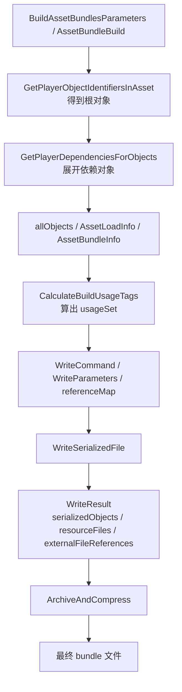

如果说 `Player build` 这条链最容易被说成“就是场景和材质”，那 `AssetBundle build` 更容易被说成另一种过度简化的话：

`不就是把选中的资源打进 Bundle 吗？`

这句话比前一句更危险。  
因为在 Shader Variant 话题里，`AssetBundle` 不只是“打包容器”，它还牵涉：

- 根资源集合是什么
- 资源对象和依赖对象怎样枚举
- usage 是按哪些对象算出来的
- 最终写出的到底是 serialized file、resource file，还是外部引用
- 为什么同一个 shader 在 `Player` 路径和 `Bundle` 路径里，交付责任会分叉

这篇文章只做一件事：

`按 Unity 源码，把 Shader Variant 在 AssetBundle 构建阶段的输入、处理中间态和输出，单独封成一条账。`

这次主要对照的源码入口是：

- `Editor/Mono/BuildPipeline.bindings.cs`
- `Editor/Src/BuildPipeline/BuildAssetBundle.cpp`
- `Editor/Src/BuildPipeline/AssetBundleBuilder.cpp`
- `Modules/BuildPipeline/Editor/Managed/ContentBuildInterface.bindings.cs`
- `Modules/BuildPipeline/Editor/Managed/WriteCommand.cs`
- `Modules/BuildPipeline/Editor/Public/ContentBuildInterface.cpp`

---

## 一、先给一句总判断

如果把 `AssetBundle build` 压成一句话，我会这样描述：

`AssetBundle 构建不是“把资源文件塞进一个包”，而是先用 AssetBundleBuild 和对象标识枚举出根对象及其依赖，再把这些对象转换成 BuildUsageTag 和写出命令，生成 serialized file / resource file / external reference，最后再归档压缩成 bundle。`

这条链比 `Player build` 更像：

`根资源定义 -> ObjectIdentifier 集 -> 依赖闭包 -> BuildUsageTagSet -> WriteParameters -> WriteResult -> ArchiveAndCompress`

---

## 二、AssetBundle build 的最上层输入，源码里长什么样

最上层入口还是 `Editor/Mono/BuildPipeline.bindings.cs`。

### 1. `BuildAssetBundlesParameters`

源码里的字段是：

- `outputPath`
- `bundleDefinitions`
- `options`
- `targetPlatform`
- `subtarget`

这已经比“选几个资源打包”具体很多了。

这里最关键的不是 `outputPath`，而是：

- 这次到底有哪些 `bundleDefinitions`
- 目标平台和子目标是什么
- 打包选项是什么

因为这些决定了：

- 哪些资源会成为 bundle 根输入
- 后续依赖收集和 usage 计算按哪个平台口径走
- 最终构建产物用哪套写出和压缩策略

### 2. `AssetBundleBuild`

每个 bundle 定义的字段是：

- `assetBundleName`
- `assetBundleVariant`
- `assetNames`
- `addressableNames`

这组字段决定的只是：

`谁是这次 bundle 的显式根资产`

它还不是最终会写进 bundle 的完整对象集合。

### 3. 增量判断和重建判断还会额外吃一套 hash 输入

如果继续顺着 `BuildAssetBundle.cpp` 看，还会看到 bundle 构建在决定“要不要重建”前，会先收集一套 hash 相关输入，例如：

- `targetFolder`
- `targetPlatform`
- `buildOptions`
- `transferFlags`
- `assetBundleFullName`
- `sourceAssets`
- `allAssetsInSameAssetBundle`
- `dependentBundleIndices`
- `dependentBundleAssets`
- `assetsToAssetBundles`
- `postProcessSceneVersionHash`
- `overrideNames`

这套东西不直接等于 variant 名单，但它影响：

`这次 bundle 是不是会真正重跑那条对象收集、usage、写出链`

---

## 三、往下一层，Unity 不再处理“资源路径”，而是处理 `ObjectIdentifier`

到了 `ContentBuildInterface` 这一层，构建链已经开始从“资产路径”切换到“对象标识”。

这一步最关键。

## 1. `GetPlayerObjectIdentifiersInAsset`

在 `ContentBuildInterface.cpp` 里，`GetPlayerObjectIdentifiersInAsset(...)` 会：

- 根据 `GUID` 找到 asset path 和 meta path
- 枚举文件里的 `fileID + type`
- 过滤 `ObjectIsSupportedInBuild(...)`
- 把结果装成 `ObjectIdentifier`

这说明 Bundle build 真正往下传的，不是“资源路径字符串”，而是：

`GUID + localIdentifierInFile + fileType + filePath`

这类对象级标识。

还有一个很重要的细节：

`GetPlayerObjectIdentifiersInAsset(...)` 明确不接受 scene asset。  
源码里如果传 scene，会报：

`Scene assets can not be used with GetPlayerObjectIdentifiersInAsset API. Please use ProcessScene API instead.`

这也说明：

- 普通 asset bundle
- scene bundle

在更底层就是两条不同的写出链。

## 2. `GetPlayerDependenciesForObjects`

拿到根对象标识后，Bundle 链还会继续调：

`GetPlayerDependenciesForObjects(...)`

这一步把根对象扩成依赖闭包。  
在 Unity 提供的 `BundleBuildUtil.cs` 测试工具里，源码演示得非常直接：

- 先拿 `objectsInAsset`
- 再拿 `dependenciesInAsset`
- 再把二者合成 `allObjects`

所以以后再说“Bundle 的输入是什么”，更准确的说法应该是：

`显式根资产 -> 根对象标识 -> 依赖对象标识 -> allObjects`

---

## 四、真正的 bundle builder 会维护哪些对象集合

如果继续顺着 `BuildAssetBundle.cpp` 和 `AssetBundleBuilder.cpp` 看，Bundle 构建阶段还会把这些对象逐步整理成更明确的内部集合。

比较关键的几套包括：

- `m_IncludedObjects`
- `m_IncludedObjectIDs`
- `m_IncludedAssets`
- `m_InstanceIDToAssetBundleIndex`
- `m_BuildAssets`

这几组名字很重要，因为它们解释了：

- “显式属于这个 bundle 的对象”是哪一批
- “对象 id 视角”是什么
- “资产视角”是什么
- “对象归属到哪个 bundle”怎么记
- “最终写出表”怎么长出来

其中 `m_BuildAssets` 的每个 `BuildAsset` 还会带着：

- `temporaryPathName`
- `temporaryObjectIdentifier`
- `buildUsage`

这说明 bundle 写出阶段不是只拿一份对象列表，而是已经把对象和“写到哪”“如何使用”的信息绑在一起了。

---

## 五、Bundle build 真正喂给 usage / variant 链的输入具体有哪些

如果顺着 `AssetBundleBuilder.cpp`、`BundleBuildUtil.cs` 和 `WriteCommand.cs` 看，Bundle 构建阶段真正喂给 usage / variant 相关逻辑的输入，可以拆成下面几类。

## 1. `allObjects` 或其等价对象集

在 `BundleBuildUtil.cs` 里最直接的集合是：

`HashSet<ObjectIdentifier> allObjects`

它来自：

- `includedObjects`
- 如果需要带依赖，再加上 `referencedObjects`

而在真正的 bundle builder 源码里，非场景 bundle 更接近的等价集合是：

`m_IncludedObjectIDs`

对 scene 写出路径，则还能看到精确的：

- `std::set<InstanceID> allObjects`
- `WriteDataArray allSceneObjects`

所以以后再说“Bundle 的 allObjects 是什么”，最好顺手加一句：

- 非场景 bundle 更接近 `m_IncludedObjectIDs`
- 场景 bundle 会同时存在 `allObjects` 和 `allSceneObjects`

## 2. `AssetLoadInfo`

每个显式资产都会被描述成一份 `AssetLoadInfo`，字段是：

- `asset`
- `address`
- `includedObjects`
- `referencedObjects`

这一步的价值在于：

`把“哪个 bundle 显式包含了哪个资产，以及这个资产展开成了哪些对象”明确记账。`

## 3. `AssetBundleInfo`

然后这些 `AssetLoadInfo` 会继续装进：

- `bundleName`
- `bundleAssets`

组成 `AssetBundleInfo`

这说明 bundle 写出阶段不是只拿一个名字，而是带着“显式资产账单”一起往后传。

## 4. `WriteCommand`

`Modules/BuildPipeline/Editor/Managed/WriteCommand.cs` 里，`WriteCommand` 的字段是：

- `fileName`
- `internalName`
- `serializeObjects`

`serializeObjects` 又是一组 `SerializationInfo`：

- `serializationObject`
- `serializationIndex`

也就是说，到了写出阶段，Unity 已经把“要写哪些对象”变成了一个明确的对象序列清单。

## 5. `WriteParameters`

这是真正把 usage、引用和写出拼起来的结构。

`WriteParameters` 的字段是：

- `writeCommand`
- `settings`
- `globalUsage`
- `usageSet`
- `referenceMap`
- `bundleInfo`
- `preloadInfo`

这组字段很重要，因为它把几个过去常被单独讨论的话题放进了同一次写出调用：

- 这次写哪些对象
- 按哪个平台和 build flag 写
- 已经算出来的全局 usage
- 已经算出来的对象 usage 集
- 引用映射
- bundle 显式资产信息
- 预加载信息

这才是源码层真正的“Bundle 构建输入单”。

---

## 六、`BuildUsageTag` 在 Bundle 构建里是怎样算的

在 `ContentBuildInterface.cpp` 里，`CalculateBuildUsageTags(...)` 的逻辑比口头描述清楚得多。

它会创建 `BuildTagCalculator`，然后：

- `AddObjectsByObjectIdentifiers(objectIDs, true)`
- `AddObjectsByObjectIdentifiers(dependentObjectIDs, false)`
- `Calculate(usageCache)`

这说明两件事。

### 1. Bundle build 的 usage 是对象级，不是资产级

这里喂进去的是 `ObjectIdentifier[]`，不是资源路径、不是材质名、也不是“一个 shader 的全部理论 variant”。

### 2. 根对象和依赖对象在语义上是分开的

源码显式把：

- `objectIDs`
- `dependentObjectIDs`

分成了两组，再交给 `BuildTagCalculator`。

更进一步地看，这里还有一个很容易忽略的细节：

`dependentObjectIDs` 主要作为计算上下文参与遍历，不是和根对象完全等价地落表。`

这也是为什么在一些 shader bundle / material bundle 的测试构造里，往往要把另一个 bundle 的对象 id 当成 dependent objects 传进去，才能算出对的 usage。

## 3. usage 数据分两层

从 `BuildUsageTags.h` 看，variant 真正依赖的 usage 分成两层：

全局层 `BuildUsageTagGlobal`，例如：

- `m_LightmapModesUsed`
- `m_FogModesUsed`
- `m_ForceInstancingStrip`
- `m_ForceInstancingKeep`
- `m_BuildForServer`

对象层 `BuildUsageTag`，例如：

- `shaderUsageKeywordNames`
- `shaderIncludeInstancingVariants`
- `meshUsageFlags`
- `meshSupportedChannels`
- `forceTextureReadable`

所以以后再说“Bundle build 会不会把 variant 留下来”，更准确的说法是：

`这批对象有没有先被正确换算成 BuildUsageTagGlobal + BuildUsageTag。`

---

## 七、`ComputeBuildUsageTagOnObjects` 在 Bundle 链里是怎么介入的

如果继续往下看 `AssetBundleBuilder.cpp`、`BuildSerialization.cpp` 和 `ContentBuildInterface.cpp`，会发现 `ComputeBuildUsageTagOnObjects(...)` 不只在 Player scene 那条链里用。

它在 bundle 相关链路里同样承担：

`把对象闭包转换成 per-object shader usage`

的职责。

处理顺序也和 Player 那边一致，关键分支仍然是：

- `Material`
- `ShaderVariantCollection`
- `Terrain`
- `Renderer`
- `TerrainData`
- `ParticleSystem`
- `ParticleSystemRenderer`
- `VisualEffectAsset`
- `VisualEffect`

而真正的中间缓存则放在 `BuildUsageCache` 里，例如：

- `m_VisitedShaderUsages`
- `m_ShaderUsageMap`
- `m_ShaderVertexComponentsCache`
- `m_VisualEffectAssetExposableMeshCache`

这说明 bundle build 也不是“每个对象来一次就现算一次”。  
它会缓存 `<shader, keywordString>` 级别的 usage 结果，避免重复计算 closest variant 和 mesh channel。

---

## 八、Bundle build 是怎样把这些输入真正写成构建产物的

往下看 `ContentBuildInterface.cpp` 的 `WriteSerializedFile(...)` 和 `WriteSceneSerializedFile(...)`，就能看到 Bundle 构建真正的写出链。

### 1. 普通 asset bundle 路径

普通 bundle 写出可以压成下面这条链：

### 2. `WriteSerializedFile` 里到底干了什么

从源码看，`WriteSerializedFile` 这段不是“单次文件输出”这么简单，它至少会做这些事：

- 校验 `writeCommand`
- 校验 `referenceMap`
- 使用 `settings.typeDB`
- 创建 `preloadData`
- 创建 `assetBundle`
- 把 `referenceMap` 转成 `buildAssets`
- 对 `buildAssets` 应用 `usageSet`
- 把 preload / assetBundle 对象也加进 `buildAssets`
- 构造 `pptrRemap`
- 抽取 `sharedObjects`
- 调 `WriteSerializedFile_Internal(...)`
- 收集 `resourceFiles`
- 生成 `serializedObjects`
- 生成 `externalFileReferences`

这说明 Bundle build 的“处理中间态”至少包括：

- `buildAssets`
- `referenceMap`
- `pptrRemap`
- `sharedObjects`
- `sharedResourceFiles`
- `WriteInformation`

而不是一句简单的“打包”。

### 3. Scene bundle 是另一条写出分支

`WriteSceneSerializedFile(...)` 还会额外吃：

- `scenePath`
- `sceneBundleInfo`

并且自己去：

- `OpenSceneForBuild`
- `ProcessSceneBeforeExport`
- `CalculateAllLevelManagersAndUsedSceneObjects`
- `ComputeBuildUsageTagOnObjects(sceneObjectIDs, usedClassTypes, globalUsage, &buildAssets, NULL, &sceneObjects)`

这说明 scene bundle 虽然也是 bundle，但它在写出前会重新走一遍更接近 Player scene 的对象收集和 usage 计算流程。

所以以后团队里如果只用一句“Bundle 构建输入是哪些资源”来概括所有 bundle 类型，基本注定会说错层。

---

## 九、stripping 在 Bundle build 里也不是一个点，而是几层

顺着 `ShaderWriter.cpp`、`ShaderSnippet.cpp` 和 `BuildPipelineInterfaces.cpp` 往下看，graphics shader 在 bundle 构建里的过滤 / stripping 也至少包括：

1. 资源合法性过滤
2. settings filtering
3. built-in stripping
4. scriptable stripping

再往细一点拆，还会看到：

- `SettingsFilteredShaderVariantEnumeration`
- `ShouldShaderKeywordVariantBeStripped`
- `ShaderCompilerShouldSkipVariant`
- `OnPreprocessShaderVariants`
- `OnPreprocessComputeShaderVariants`

也就是说，Bundle 构建里“最后没了”并不自动等于“打包时没带上”。  
它也可能早死在 usage 条件、settings filtering 或 built-in stripping。

---

## 十、Bundle build 这一段真正的输出，具体是什么

最容易被说空的一步，就是“最后输出了啥”。

源码里其实写得很具体。

## 1. `WriteResult`

`Modules/BuildPipeline/Editor/Managed/BuildOutput.cs` 里，`WriteResult` 的字段是：

- `serializedObjects`
- `resourceFiles`
- `includedTypes`
- `includedSerializeReferenceFQN`
- `externalFileReferences`

这张结构表其实非常重要。

它告诉你：

`Bundle 写出阶段的输出，不只是一个压缩包文件名，而是一组已经区分过 serialized object、resource file、included type 和外部引用的构建结果。`

## 2. `resourceFiles`

`WriteSerializedFile(...)` 和 `WriteSceneSerializedFile(...)` 都会把：

- shared serialized file
- shared resource files
- scene serialized file
- scene resource files

加入 `resourceFiles`

然后 `ArchiveAndCompress(...)` 再把这些资源文件归档压缩成最终 bundle。

所以最终 bundle 的直接上游产物，其实是一组 `BuildResourceFile`，而不是一个抽象“包内状态”。

## 3. `externalFileReferences`

这一项尤其值得记住。

它说明：

`Bundle 写出结果本身就允许存在“外部文件引用”这种输出形态。`

也就是说，讨论 shader 或 variant 是否“真的写进 bundle”时，不能只看“它逻辑上属于这个 bundle”，还要看写出结果究竟是：

- 写成了本 bundle 的 serialized / resource 数据
- 还是只留下了外部引用关系

这也是为什么 `Always Included`、Player 兜底和 bundle 交付边界的话题，总会在 Shader 问题上缠在一起。

## 4. 最终归档文件

最后 `ArchiveAndCompress(...)` 会把 `resourceFiles` 归档压缩成目标 bundle 文件。  
也就是说，“最终 bundle 文件”是最后一步的归档结果，不是前面所有写出逻辑的唯一形态。

---

## 十一、你以后应该怎么更准确地描述 Bundle build 的输入 / 处理 / 输出

很多项目现场喜欢这样说：

`Bundle 构建的输入就是 assetNames，输出就是一个 bundle 文件。`

这句话太短了，短到会误导排查。

更接近源码的说法应该是：

### 输入

- `BuildAssetBundlesParameters`
- `AssetBundleBuild[]`
- 每个根资产展开后的 `ObjectIdentifier[]`
- 依赖对象标识
- `BuildSettings`
- `BuildUsageTagGlobal`
- `WriteCommand`
- `WriteParameters`
- `referenceMap`
- `bundleInfo`

### 处理中间态

- `allObjects` 或 `m_IncludedObjectIDs`
- `AssetLoadInfo`
- `AssetBundleInfo`
- `usageSet`
- `buildAssets`
- `pptrRemap`
- `sharedObjects`
- `sharedResourceFiles`
- `WriteInformation`

### 输出

- `WriteResult.serializedObjects`
- `WriteResult.resourceFiles`
- `WriteResult.includedTypes`
- `WriteResult.includedSerializeReferenceFQN`
- `WriteResult.externalFileReferences`
- 归档压缩后的最终 bundle 文件

---

## 十二、最容易误判的 5 件事

### 1. `assetNames` 不是最终对象清单

它只是 bundle 的显式根资产输入。  
真正进入 usage / 写出链的是对象标识和依赖闭包。

### 2. “Bundle 里有 shader”不等于“它以实体方式完整写在这个 bundle 里”

源码里明确存在 `externalFileReferences` 这种输出。

### 3. 普通 asset bundle 和 scene bundle 不该混着讲

`GetPlayerObjectIdentifiersInAsset(...)` 明确排除 scene asset；scene bundle 有自己单独的写出链。

### 4. usage 计算不是在最终归档时才发生

`CalculateBuildUsageTags(...)` 在写出前就已经把对象 usage 算好了。

### 5. `WriteSerializedFile` 不是“最后一步胶水代码”

它其实是把：

- usage
- 引用映射
- preload
- bundle 对象
- shared objects
- resource files

全部接到一起的关键枢纽。

---

## 十三、如果你只想记一张“Bundle build 输入 / 处理 / 输出”表

| 阶段 | 具体内容 | 典型源码位置 |
| --- | --- | --- |
| 顶层输入 | `BuildAssetBundlesParameters.outputPath / bundleDefinitions / options / targetPlatform / subtarget` | `Editor/Mono/BuildPipeline.bindings.cs` |
| bundle 根定义 | `AssetBundleBuild.assetBundleName / assetBundleVariant / assetNames / addressableNames` | `Editor/Mono/BuildPipeline.bindings.cs` |
| 对象枚举 | `GetPlayerObjectIdentifiersInAsset` 产出根 `ObjectIdentifier` | `ContentBuildInterface.cpp` |
| 依赖展开 | `GetPlayerDependenciesForObjects` 产出依赖对象 | `ContentBuildInterface.bindings.cs`、`BundleBuildUtil.cs` |
| usage 计算 | `CalculateBuildUsageTags(objectIDs, dependentObjectIDs, globalUsage, usageSet)` | `ContentBuildInterface.cpp` |
| 写出输入 | `WriteCommand`、`WriteParameters`、`referenceMap`、`bundleInfo` | `WriteCommand.cs` |
| 写出中间态 | `buildAssets`、`pptrRemap`、`sharedObjects`、`resourceFiles` | `ContentBuildInterface.cpp`、`AssetBundleBuilder.cpp` |
| 构建输出 | `WriteResult` + `ArchiveAndCompress` 后的 bundle 文件 | `BuildOutput.cs`、`ContentBuildInterface.cpp` |

---

## 十四、这篇文章真正想帮你立住什么判断

以后项目里再有人说：

`AssetBundle build 不就是一组资源路径进去，一个 bundle 文件出来吗？`

你可以把它改写成更接近源码的版本：

`不是。AssetBundle build 先从 AssetBundleBuild 定义出根资产，再把资产展开成 ObjectIdentifier 和依赖对象，用 BuildUsageTag 计算 usage，把 WriteCommand / WriteParameters / referenceMap / bundleInfo 拼成写出任务，生成 serializedObjects、resourceFiles 和 externalFileReferences，最后才归档压缩成 bundle。`

只有把这句话说到这个粒度，后面去讨论：

- 为什么 shader 在 Player 和 Bundle 的交付边界不一样
- 为什么有时 bundle 只留下引用
- 为什么有时 variant 明明写了 SVC 但 bundle 里还是缺

才不会继续混层。

如果你还没看 `Player build` 那条基线链，可以回看：

- [Unity Shader Variant 在 Player 构建里到底吃了哪些输入：从 BuildPlayerOptions、场景对象、UsageTag 到写入产物]()
