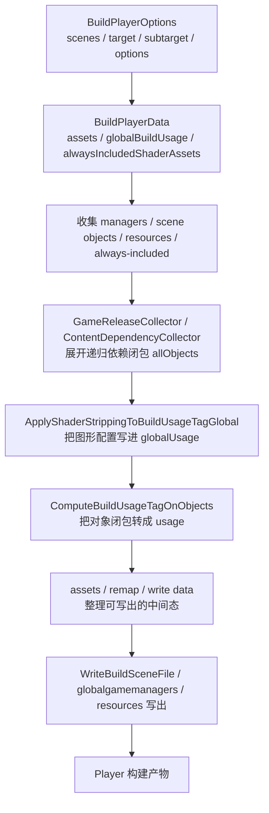

前面几篇已经把 `Shader Variant` 的总链路、保留依据、剔除层级和运行时命中拆过了。  
但项目现场一到细节处，大家还是很容易把 Player 构建阶段的输入压成一句过度简化的话：

`Scene / Material / SVC 会影响 variant。`

这句话不能说错，但它离源码里的真实输入结构还差得很远。  
如果你真的要回答：

- `Player build` 到底吃了哪些输入
- 哪一步开始把这些输入变成 `BuildUsageTag`
- 哪一步真正把相关数据写进构建产物
- 为什么有些东西明明“项目里存在”，却没资格影响这次 Player 构建

那就必须往源码里看，而不是只看编辑器面板。

这篇文章只做一件事：

`按 Unity 源码，把 Shader Variant 在 Player 构建阶段的输入、处理中间态和输出，一条线收成账。`

这次主要对照的源码入口有 5 组：

- `Editor/Mono/BuildPipeline.bindings.cs`
- `Editor/Src/BuildPipeline/BuildPlayer.cpp`
- `Modules/BuildPipeline/Editor/Managed/ContentBuildInterface.bindings.cs`
- `Editor/Src/BuildPipeline/BuildSerialization.cpp`
- `Editor/Src/BuildPipeline/ComputeBuildUsageTagOnObjects.cpp`

---

## 一、先给一句总判断

如果把 Player 构建阶段压成一句话，我会这样描述：

`Player 构建不是拿“Scene 和 Material”两个松散概念去猜 variant，而是先收集本次 build 的场景对象、全局管理器、Resources 对象、Always Included 相关资产和图形配置，再把这些对象转换成 BuildUsageTag，最后写进场景文件、共享资源文件和 Player 交付物。`

所以更准确的链路不是：

`Scene / Material -> stripping -> Player`

而是：

`BuildPlayerOptions -> BuildPlayerData -> 场景和全局管理器收集 -> 递归依赖闭包 -> BuildUsageTagGlobal / BuildUsageTagSet -> ComputeBuildUsageTagOnObjects -> 场景/共享文件写出 -> Player 交付物`

---

## 二、Player 构建阶段最上层的输入，不是“场景”两个字就能概括

最上层入口在 `Editor/Mono/BuildPipeline.bindings.cs`。

`BuildPlayerOptions` 里真正声明的字段是：

- `scenes`
- `locationPathName`
- `assetBundleManifestPath`
- `targetGroup`
- `target`
- `subtarget`
- `options`
- `extraScriptingDefines`

这组字段有几个常被忽略的点。

### 1. `scenes` 只是内容根，不是完整输入集合

`scenes` 决定了本次 Player build 从哪些场景开始往外收集对象和依赖。  
但 Unity 后面真正处理的，不是“场景路径字符串”，而是：

- 场景里的 manager 对象
- 场景里的普通对象
- 这些对象递归引用到的持久化资源
- 构建过程中额外带入的全局管理器、Resources 对象和图形配置

### 2. `target / subtarget / options` 不是附属参数，它们会改变 variant 命运

这些字段不只是构建产物平台信息。  
它们会影响：

- `BuildTargetSelection`
- 图形能力和子目标
- 某些全局 build flag
- 后面 `BuildUsageTagGlobal` 怎样被图形设置修剪

也就是说，`Android`、`Windows`、`Server`、不同 `subtarget`，不是最后才影响平台编译，它们从 usage 阶段就已经开始影响 variant 了。

### 3. `assetBundleManifestPath` 说明 Player build 也可能和 Bundle 依赖边界发生关系

这个字段不会直接变成 variant 名单，但它说明 Player 构建入口并不完全孤立。  
当项目把部分内容交给 `AssetBundle` / 热更新链时，Player build 仍然可能需要知道和包体交付边界相关的 manifest 信息。

---

## 三、`BuildPlayerData` 这一层，Unity 已经把输入拆成了几组具体结构

如果再往下追到 `Editor/Src/BuildPipeline/BuildPlayer.cpp`，会看到 Player build 不是直接拿 `BuildPlayerOptions` 工作，而是整理出一批核心中间结构。

这一层至少包括：

- `BuildTargetSelection`
- `BuildUsageTagGlobal globalBuildUsage`
- `InstanceIDToBuildAsset assets`
- `dynamic_array<PreloadData*> preloadDataArray`
- `InstanceIDToBuildAsset alwaysIncludedShaderAssets`

这几样东西很关键，因为它们已经比“构建参数”更接近后续真正影响 variant 的链路了。

### 1. `assets`

这是一张 `InstanceID -> BuildAsset` 映射。  
它不是普通缓存表，而是后续 usage 计算、对象 remap、文件写出的核心中间态。

### 2. `alwaysIncludedShaderAssets`

这说明 `Always Included Shaders` 在 Player build 里不是最后才想起的兜底按钮。  
它会先被整理成一张单独的资产映射表，然后作为显式输入参与后面的 usage 和写出链。

### 3. `globalBuildUsage`

它不是“某篇分析报告里的概念变量”，而是 Player build 主链路里的正式输入。  
后面真正传给 `ComputeBuildUsageTagOnObjects(...)` 的，就是这一份全局 usage 条件。

---

## 四、Player build 真正从哪里收对象，不是只看场景

顺着 `BuildPlayer.cpp` 和 `BuildSerialization.cpp` 往下看，Player build 至少会从 4 组来源收集对象。

## 1. 全局 managers

`CompileGlobalGameManagerDependencies(...)` 会：

- 遍历 `ManagerContext::kGlobalManagerCount`
- 用 `ShouldWriteManagerForBuildTarget(...)` 判断当前目标平台是否应该写出这个 manager
- 对允许带资产依赖的 manager 调 `collector.GenerateInstanceID(...)`
- 把类型放进 `usedClassTypes`

也就是说，Player build 的输入从来不只有场景内容。  
全局管理器本身及其依赖，就是 variant 决策链的一部分。

## 2. 场景里的 managers 和普通对象

`CompileGameScene(...)` 会先调用：

`CalculateAllLevelManagersAndUsedSceneObjects(scene, allSceneObjects, ...)`

这一步拿到的不是“场景路径”，而是一份 `WriteDataArray allSceneObjects`。  
也就是后续真要参与写出和 usage 计算的对象集合。

然后还会：

- `std::stable_sort(allSceneObjects, CompareAssetLoadOrderForBuildingScene)`
- `LinearizeLocalIdentifierInFile(allSceneObjects)`

这说明在写出前，Unity 已经把场景对象往“可稳定写入 serialized file”的方向整理了。

## 3. `Assets/Resources` 对象

`BuildSerialization.cpp` 里还有一条经常被忽略的链：

`CollectPlayerOnlyResourceList(...)`

也就是说，Player build 还会单独去收集 `Resources` 路径下的对象依赖。  
所以以后再说“Player build 的输入就是场景”，基本肯定少说了一块。

## 4. `Always Included Shaders` 及其 shader 依赖

`BuildPlayer.cpp` 这边还会通过 `GraphicsSettings::GetReferencedShaders()` 等路径，把 `Always Included Shaders` 及其相关依赖整理出来。

所以从源码口径看，Player build 真正影响 shader variant 的对象输入，更接近：

- 全局 managers
- 场景 managers
- 场景对象
- `Resources` 对象
- `Always Included Shaders` 及其依赖

---

## 五、Player build 真正喂给 variant 系统的输入，具体有哪些

如果顺着 `BuildSerialization.cpp` 看，Player build 真正喂给 usage / variant 相关逻辑的输入，可以拆成下面几类。

## 1. 递归依赖闭包 `allObjects`

这一层非常关键。

`CompileGameScene(...)` 里并不会直接拿 `allSceneObjects` 去做 variant 计算，而是先用 `GameReleaseCollector` 把它们展开成：

`std::set<InstanceID> allObjects`

也就是：

`场景对象 + 它们递归引用到的持久化对象`

这个集合才更接近“本次场景真正影响 usage 的对象闭包”。

这也是为什么项目里常说“场景里有这个材质”其实不够准确。  
更准确的说法是：

`这次 Player build 收集出来的 allObjects 里，有没有这条路径相关的对象。`

## 2. `InstanceIDToBuildAsset assets`

源码里不是只传一堆对象 id。  
`BuildSerialization.cpp` 还会维护一张 `InstanceIDToBuildAsset` 映射。

单个 `BuildAsset` 不仅有：

- `instanceID`
- `type`

还会带着：

- `temporaryPathName`
- `temporaryObjectIdentifier`
- 每对象自己的 `BuildUsageTag`

这张表后面会被用于：

- usage 应用到资产映射
- remap
- 真正写文件

所以这不是“逻辑分析用的附属表”，而是构建产物落盘时的关键中间态。

## 3. `alwaysIncludedShaderAssets`

`CompileGameScene(...)` 对 `ComputeBuildUsageTagOnObjects(...)` 的调用长这样：

`ComputeBuildUsageTagOnObjects(allObjects, usedClassTypes, globalUsage, &assets, &alwaysIncludedShaderAssets, &allSceneObjects)`

这意味着 `Always Included Shaders` 不是最后一个和 variant 无关的全局兜底按钮。  
在 Player 写场景这条链上，它已经作为显式输入参与到了 usage 计算阶段。

## 4. `BuildUsageTagGlobal globalUsage`

在 `CompileGlobalGameManagerDependencies(...)`、`CompileGlobalDependencies(...)` 和 `CompileGameScene(...)` 里，都会先做这一步：

`GetGraphicsSettings().EditorOnly().ApplyShaderStrippingToBuildUsageTagGlobal(globalUsage);`

这句话很关键。

它说明：

- 图形设置不是只在“最后 stripping”才生效
- 它会先把全局 usage 条件写进 `BuildUsageTagGlobal`
- 后面的对象 usage 计算，是带着这个全局裁剪前提一起做的

从 `BuildUsageTags.h` 的字段定义看，这份全局 usage 里至少包括：

- `m_LightmapModesUsed`
- `m_LegacyLightmapModesUsed`
- `m_DynamicLightmapsUsed`
- `m_FogModesUsed`
- `m_ForceInstancingStrip`
- `m_ForceInstancingKeep`
- `m_BrgShaderStripModeMask`
- `m_HybridRendererPackageUsed`
- `m_BuildForLivelink`
- `m_BuildForServer`
- `m_ShadowMasksUsed`
- `m_SubtractiveUsed`

很多现场误以为 variant 是“先完整收集，再统一 stripping”。  
源码告诉你，至少在这一步，图形配置已经提前改写了 usage 条件。

## 5. 对象级 `BuildUsageTag`

和 `BuildUsageTagGlobal` 对应的，是每对象的 `BuildUsageTag`。  
从 `BuildUsageTags.h` 看，跟 shader variant 最相关的字段包括：

- `shaderUsageKeywordNames`
- `shaderIncludeInstancingVariants`
- `meshUsageFlags`
- `meshSupportedChannels`
- `maxBonesPerVertex`
- `forceTextureReadable`

这说明“本次 build 里这个 shader 需要哪些 feature / keyword”并不是挂在一个抽象 variant 管理器上，而是落实在对象级 usage tag 上。

---

## 六、`ComputeBuildUsageTagOnObjects` 到底吃了哪些对象类型

如果你只是停在“allObjects 影响 variant”这句话，还是太粗。  
真正把对象转成 usage 的核心在：

`Editor/Src/BuildPipeline/ComputeBuildUsageTagOnObjects.cpp`

这份源码里可以直接看到 Unity 会对哪些对象类型计算特殊 usage。

当前能明确看到的分支包括：

- `Material`
- `ShaderVariantCollection`
- `Terrain`
- `Renderer`
- `TerrainData`
- `ParticleSystem`
- `ParticleSystemRenderer`
- `VisualEffectAsset`
- `VisualEffect`

对应函数包括：

- `ComputeMaterialShaderUsageFlags`
- `ComputeShaderVariantCollectionShaderUsageFlags`
- `ComputeTerrainShaderUsageFlags`
- `ComputeRendererSupportedMeshChannelsAndReadable`
- `ComputeTerrainUsageFlags`
- `ComputeParticleSystemUsageFlags`
- `ComputeParticleSystemRendererUsageFlags`
- `ComputeVisualEffectAssetUsageFlags`
- `ComputeVisualEffectUsageFlags`

而且处理顺序不是随便排的。  
源码明确先做：

`Material -> ShaderVariantCollection -> Terrain`

先把 shader 使用情况写进 `BuildUsageTag.shaderUsageKeywordNames`，之后才继续算 renderer mesh channels、粒子、VFX、terrain 相关 usage。

这几件事合起来说明了一个很重要的结论：

`Player build 里的 shader usage 输入，根本不是“材质关键字列表”这么简单，而是由材质、渲染器、地形、粒子、VFX、SVC 等多类对象共同推出来的。`

所以以后再说“这次构建的输入是什么”，更准确的表达应该是：

`参与本次 build 的对象闭包 + 全局图形 usage 条件 + Always Included 资产映射`

而不是只说：

`Scene / Material`

---

## 七、Player build 在源码里是怎样处理这些输入的

如果把 `Shader Variant` 相关链路按处理顺序压成一条源码流程，大概是这样。

再展开一点看：

### 1. 收集对象

先从：

- 全局 manager
- 当前场景的 manager
- 当前场景的普通对象
- `Resources` 对象
- `Always Included Shaders`

开始。

### 2. 展开依赖

再通过 `GameReleaseCollector` / `ContentDependencyCollector`，把依赖闭包展开成真正的 `allObjects`。

### 3. 应用全局 usage 条件

图形设置通过 `ApplyShaderStrippingToBuildUsageTagGlobal(...)` 把本次 build 根本不该考虑的图形路径先写进 `globalUsage`。

### 4. 计算对象 usage

`ComputeBuildUsageTagOnObjects(...)` 再把：

- `allObjects`
- `usedClassTypes`
- `globalUsage`
- `assets`
- `alwaysIncludedShaderAssets`
- `sceneObjects`

综合起来，算出对象级 usage。

### 5. 进入 shader transfer / writer 链

对 graphics shader 来说，后面会继续进入：

- `Shader::Transfer`
- `ShaderWriter`

这一段才是真正把导入期留下来的 shader snippet / variant 数据，结合 usage 和 stripping 规则，转成最终平台程序数据的地方。

对 compute shader 来说则是另一条链：

- 不走 `ComputeBuildUsageTagOnObjects`
- 直接在 `ComputeShader::Transfer` 里做 variant stripping 和 compile

所以以后如果你在项目里统一说“shader variant build 流程”，最好顺手注明你说的是：

- graphics shader
- 还是 compute shader

---

## 八、graphics shader 在 Player build 里到底会经过哪些过滤 / stripping

从 Player build 主链往后追到 `ShaderWriter.cpp`、`Shader.cpp`、`ShaderSnippet.cpp`，graphics shader 至少会经过下面几层：

1. `ShaderKeywordFilterUtilProxy::GetKeywordFilterVariants` 的 settings filtering
2. `ShaderVariantEnumerationUsage` 的 usage-based filtering
3. `ShouldShaderKeywordVariantBeStripped` 的 built-in 剥离
4. `ShouldPassBeIncludedIntoBuild` 的 pass 级过滤
5. `ShaderCompilerShouldSkipVariant` 的平台过滤
6. `OnPreprocessShaderVariants` 的脚本剥离

而 `Always Included Shaders` 还是一条特殊分支。  
从 `BuildPlayer.cpp` 相关逻辑看，它们会被识别成 `IsAlwaysIncludedShaderOrDependency`，然后走更偏全局保留的策略，而不是完全按场景 material usage 做 full stripping。

这也是为什么项目里会出现这种现象：

- 场景里没直接打到
- 但放进 `Always Included` 就活了

因为它已经不完全走普通场景 usage 收缩那条线了。

---

## 九、Player build 这一段真正的输出，具体是什么

说“最后进了 Player”还是太虚。  
从源码看，这一段最少会产出下面几类结果。

## 1. 依赖信息输出

在 `ContentBuildInterface` 这边，会产出：

- `SceneDependencyInfo`
- `GameManagerDependencyInfo`

它们分别带着：

- `referencedObjects`
- `includedTypes`
- `globalUsage` 或 `managerObjects`

这更像“构建前/构建中依赖分析结果”。

## 2. 写文件中间产物

在 `BuildSerialization.cpp` 里，会产出：

- `WriteDataArray`
- `InstanceIDToBuildAsset`
- `InstanceIDBuildRemap`
- `generatedBinaryBlobFiles`

这些是内容写出前后的关键中间态。

## 3. Player 资源文件

从 Player build 主链可以明确追到几类文件承载：

- `globalgamemanagers`
- `globalgamemanagers.assets`
- `sharedassetsN.assets`
- `resources.assets`
- split `Resources` 文件
- `Resources/unity_builtin_extra`

如果后面还要继续打包压缩，这些中间文件还会再并入更上层的 player data archive。

## 4. 对象载荷层面的 shader 程序数据

对 `Shader Variant` 来说，最终真正有意义的不是“这个 keyword 名字还在不在”，而是：

`相关路径有没有在 Player 交付链里留下可用的平台程序结果。`

graphics shader 最终会以 shader parsed form、各平台 blob 和相关元数据的形式进入对象载荷；compute shader 则以自己的平台 variant 数据结构进入输出。

---

## 十、最容易误判的 5 件事

### 1. “项目里有这个材质”不等于“它进了这次 Player build 的对象闭包”

源码真正关心的是：

`allObjects` 里有没有它，以及它的 usage 有没有被算进去。

### 2. “我没在自定义 stripping 里删”不等于“它之前没死”

`ApplyShaderStrippingToBuildUsageTagGlobal(...)` 和 shader writer 前面的多层 filtering，都会比你的 `IPreprocessShaders` 更早介入。

### 3. `Always Included` 不是只在最后兜底

它在 Player build 的主链里已经以 `alwaysIncludedShaderAssets` 的形式参与 usage 和写出。

### 4. `SVC` 不是完全脱离对象闭包的魔法名单

`ComputeBuildUsageTagOnObjects.cpp` 明确有 `ShaderVariantCollection` 分支。  
也就是说，它仍然要进入这套对象到 usage 的转换链。

### 5. compute shader 和 graphics shader 不能完全混着讲

前者不走 scene usage 主链，后者要走 `BuildUsageTag`、`Shader::Transfer` 和 `ShaderWriter`。

---

## 十一、如果你只想记一张“Player build 输入 / 处理 / 输出”表

| 阶段 | 具体内容 | 典型源码位置 |
| --- | --- | --- |
| 顶层输入 | `BuildPlayerOptions.scenes / target / subtarget / options / extraScriptingDefines / assetBundleManifestPath` | `Editor/Mono/BuildPipeline.bindings.cs` |
| 构建主数据 | `BuildTargetSelection`、`globalBuildUsage`、`assets`、`alwaysIncludedShaderAssets` | `BuildPlayer.cpp` |
| 对象收集 | 全局 manager、场景 manager、场景对象、`Resources`、`Always Included` | `BuildPlayer.cpp`、`BuildSerialization.cpp` |
| 依赖展开 | `GameReleaseCollector` / `ContentDependencyCollector` 收集 `allObjects` | `BuildSerialization.cpp`、`ContentBuildInterface.cpp` |
| 全局 usage 条件 | `ApplyShaderStrippingToBuildUsageTagGlobal(globalUsage)` | `BuildSerialization.cpp`、`EditorOnlyGraphicsSettings.cpp` |
| 对象 usage 计算 | `Material / SVC / Terrain / Renderer / Particle / VFX` 等对象转 usage | `ComputeBuildUsageTagOnObjects.cpp` |
| shader 过滤与编译 | settings filtering、usage filtering、built-in stripping、平台过滤、脚本剥离 | `ShaderWriter.cpp`、`Shader.cpp`、`ShaderSnippet.cpp` |
| 构建输出 | `globalgamemanagers`、`sharedassets`、`resources`、`unity_builtin_extra` 及其平台程序数据 | `BuildSerialization.cpp`、`Shader.cpp` |

---

## 十二、这篇文章真正想帮你建立什么判断

以后项目里再有人说：

`Player build 的 shader variant 输入不就是 Scene 和 Material 吗？`

你可以直接把它改写成更接近源码的说法：

`不是。Player build 真正处理的是 BuildPlayerOptions、BuildPlayerData、全局管理器、场景对象、Resources、Always Included Shader 依赖、递归依赖闭包、BuildUsageTagGlobal，以及这些对象被 ComputeBuildUsageTagOnObjects 转出来的对象级 BuildUsageTag，最后再经过 Shader::Transfer / ShaderWriter 写进 Player 交付物。`

这句话虽然长，但它至少不会把问题说错层。

如果你接下来要继续往下看 `AssetBundle` 这条分叉链，可以接着读：

- [Unity Shader Variant 在 AssetBundle 构建里到底吃了哪些输入：从 AssetBundleBuild、ObjectIdentifier、WriteParameters 到归档输出]()
