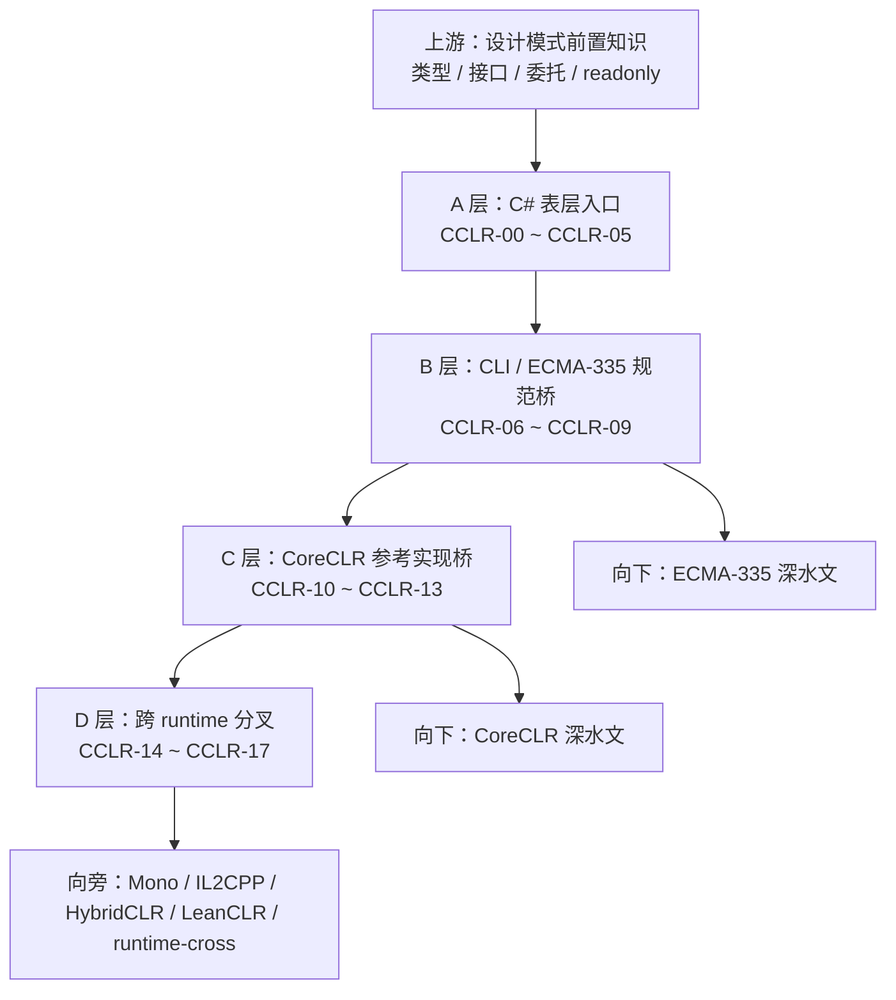

> `class`、`interface`、`virtual`、`async` 不是一组语法词，而是一组 runtime 入口标签。你写下它们的那一刻，就已经把问题分别送进了对象模型、调用分派、状态机和执行模型。

这是 `从 C# 到 CLR` 系列的第 0 篇。它不负责把任何一个点讲透，它只负责把阅读路线立起来：先把 C# 表层概念分清，再看这些概念怎样落到 CLI 和 runtime，最后再回头看为什么同样一段 C# 会在不同 runtime 里表现出不同工程约束。

> **本文明确不展开的内容：**
> - `MethodTable`、对象头、GC、JIT、AOT 的实现细节（在 [CoreCLR 系列索引]() 和后续 `CCLR-10 ~ 13` 展开）
> - `设计模式前置知识` 里的概念定义（在 [设计模式前置知识索引]() 展开）
> - 多 runtime 的横向总比较（在 [runtime-cross 系列索引]() 展开）

## 一、为什么这篇必须单独存在

多数 C# 工程师卡住的地方，不是不会写语法，而是写下语法之后，不知道运行时到底接管了什么。

你知道 `class` 会生成对象，知道 `interface` 可以做多态，知道 `async/await` 能把异步代码写得像同步。但这些知道，很多时候还停留在“会用”的层面。真正难的是：这些词在 runtime 里到底对应什么结构、什么约束、什么代价。

这个系列就是为这一步服务的。

你可以把它理解成一条中间坡道：上游是概念层，下游是深水层，CCLR 站在中间，解决“C# 表层写法到底怎样映射到规范和实现”。

如果没有这条坡道，读者往往会出现两种错觉。

一种错觉是：我已经会写 C#，所以我应该直接去看 `CoreCLR` 源码。结果一打开 `methodtable.h` 或 JIT 管线，很快就被结构、术语和实现细节淹没。

另一种错觉是：这些 runtime 文章太底层，和我平时写业务或 Unity 没什么关系。结果又会把很多关键语义误当成“只是语法风格”。

CCLR 要打掉的，就是这两种错觉。

在继续往下读之前，先记住 4 个会反复出现的词：

- `对象模型`：对象怎么分配、字段怎么挂到实例上
- `metadata`：编译后怎样描述类型、方法、字段和签名
- `调用分派`：一行方法调用怎样找到真正目标
- `执行模型`：JIT、AOT、解释器分别在什么时候接管代码

后面整条系列，基本都围着这 4 个词打转。

## 二、先看 3 个极小样例

下面这三个样例都很短。短不是为了偷懒，而是为了让你只看见“表层写法”和“runtime 落点”之间那条最短的连线。

### 样例 1：对象 + 实例方法

```csharp
public sealed class Counter
{
    private int _value;

    public Counter(int start) => _value = start;

    public int Increment() => ++_value;
}
```

你表面上看到的是一个类型、一个字段和一个实例方法。

runtime 真正接到的问题是：这个对象怎么分配、这个字段怎么布局、这个方法怎么和对象实例绑定、GC 什么时候需要扫描它。

### 样例 2：接口调用 + 多态分派

```csharp
public interface IDiscountRule
{
    decimal Apply(decimal amount);
}

public sealed class VipDiscountRule : IDiscountRule
{
    public decimal Apply(decimal amount) => amount * 0.8m;
}
```

表面上你看到的是一行 `rule.Apply(...)`。

你先把它记成一件事：同样是一行方法调用，写成接口后，运行时要先决定“到底调谁”。

runtime 接到的问题则是：这是不是接口分派、有没有方法槽位、JIT 能不能去虚拟化、AOT 能不能把目标提前固定下来。

### 样例 3：委托 + 闭包

```csharp
using System;

static Func<int, int> MakeAdder(int baseValue)
{
    return x => x + baseValue;
}
```

表面上你看到的是“一个 lambda”。
这类写法看起来像一行表达式，但运行时往往已经不再只有“一个函数”，而是连同捕获变量一起变成了对象。


runtime 接到的问题是：这里会不会产生委托对象、会不会产生闭包对象、捕获变量的生命周期怎么延长、JIT 或 AOT 会怎么处理这层额外结构。

这 3 个样例放在一起，已经足够说明一件事：C# 写法从来不只是“写法”，它会直接决定 runtime 后面要接什么活。

## 三、把这条阅读线分成三层

这条系列的核心不是“多讲一点”，而是把同一个问题拆成三层。

### 1. C# 表层概念层

这一层关心的是：你到底在写什么。

比如：

- `class`、`struct`、`record` 的边界是什么
- `string` 和 `object` 为什么要单独看
- 值类型、引用类型、对象为什么不能混着叫
- `const`、`readonly`、`static readonly` 锁住的到底是什么

这部分不会讲深层实现，但它决定你后面看规范和 runtime 时，脑子里的词是不是干净的。

### 2. CLI / ECMA-335 规范层

这一层关心的是：C# 这些概念在公共标准里怎么表达。

入口页不需要把标准讲完，只需要先知道它大致可以粗分成三块：

- 概念和执行语义
- metadata、签名、程序集与文件格式
- `CIL` 指令集

你现在不用记住这三块各自有哪些指令或元数据表，只要先把它当成“C# 语法要先经过的标准中转层”就够了。

`ECMA-335` 只是把这些共同语义写成了标准形式。它的作用不是替你写程序，而是告诉不同 runtime：同一组语言概念至少该怎样被理解。

所以这个系列后面会让你看到：

- 值类型和引用类型在规范里怎样定义
- 方法、字段、属性、事件在 metadata 里各长什么样
- 泛型、约束、签名怎样被编码进 CLI 体系

### 3. runtime 实现层

这一层关心的是：同一组语义，运行时到底怎么把它做出来。

这里默认先以 `CoreCLR` 作为主要参考实现，因为它最适合拿来做“对象模型、调用分派、JIT、GC”这些问题的第一落点。

这里先不用把这几个 runtime 看成同一层难度的阅读任务。对入口页来说，它们只是同一组语义在不同工程约束下的几种落地答案。

接着你会看到，进入不同 runtime 后，同一组语义会因为约束不同而长成不同工程答案：

- `Mono` 更能帮助你理解 Unity 历史上的托管运行时路线
- `IL2CPP` 代表 AOT 路线
- `HybridCLR` 代表在 `IL2CPP` 约束上补热更新能力
- `LeanCLR` 代表从零实现一套轻量 CLR 的另一条路线

CCLR 在这里做的事情很简单：先把这些名字立成坐标，不在入口页里直接替它们做横向总比较。

这张图把整条阅读线压成一张地图：



图里最重要的是方向：**不是从 C# 一步跳到源码，而是先过表层概念，再过规范层，最后进入具体 runtime。**
## 四、直觉 vs 真相

### 直觉一：这些只是语法写法差异

- 你以为：`new` 只是“创建对象”，`interface` 只是“更抽象”，lambda 只是“更短的函数写法”。
- 实际上：`new` 牵出对象分配和生命周期，`interface` 牵出调用分派和优化边界，lambda 常常牵出委托对象、闭包对象和额外生命周期。
- 原因是：C# 语法不是终点，每个表层概念都会落到 metadata、对象布局、调用规则和执行模型上。

### 直觉二：我应该直接去看深水实现

- 你以为：只要我够努力，就应该直接啃 `CoreCLR` 源码或 `runtime-cross` 对比文。
- 实际上：没有中间这层坐标，读源文只会不断遇到“每个词都认识，合起来不知道在说什么”的情况。
- 原因是：深水文默认你已经知道 `class`、`virtual`、`async` 在概念层和规范层分别是什么角色。

## 五、从这里往下怎么走

如果你准备继续读，这里有三条最稳的路线。它们不是要你现在立刻选赛道，而是帮你判断：你今天卡在概念、规范还是实现层，就分别往哪边走。

### 1. 先把 C# 表层概念分清

- [CCLR-01｜值类型、引用类型、对象：先把 3 个最容易混的词讲清楚]()
- [设计模式前置知识索引]()

### 2. 往规范层走

如果你更关心“C# 最终是怎么落到 CLI 的”，接下来应该去：

- [ECMA-335 系列索引]()
- [CCLR-06｜从 C# 到 CLI：语言前端、CTS、CLS 到底怎么对应]()

### 3. 往实现层走

如果你想尽快建立 runtime 直觉，后面最关键的入口是：

- [CoreCLR 系列索引]()
- [CCLR-10｜对象在 CoreCLR 里怎么存在：对象头、MethodTable、字段布局]()
- [runtime-cross 系列索引]()

## 六、小结

这篇只做了一件事：把路牌立起来。

- C# 表层概念不是语法名词列表，而是 runtime 入口标签
- 读这条线时，要先分清概念层，再走到 CLI 规范层，最后落到 runtime 实现层
- `CoreCLR` 是主要参考实现，但 `Mono / IL2CPP / HybridCLR / LeanCLR` 会提醒你：同一组语义进入不同约束后，会长成不同工程答案
- 如果你直接从深水文开始读，最容易丢掉的是“概念到实现”的那条映射线
- CCLR 的职责不是替代深水文，而是让你知道每个词下一步该去哪篇

## 系列位置

- 上一篇：[设计模式前置知识索引]()
- 下一篇：[CCLR-01｜值类型、引用类型、对象：先把 3 个最容易混的词讲清楚]()
- 向下追深：[ECMA-335 系列索引]()
- 向旁对照：[runtime-cross 系列索引]()

> 本文是入口页。继续写正文前，请本地运行一次 `hugo`，确认 `ERROR` 为零。


