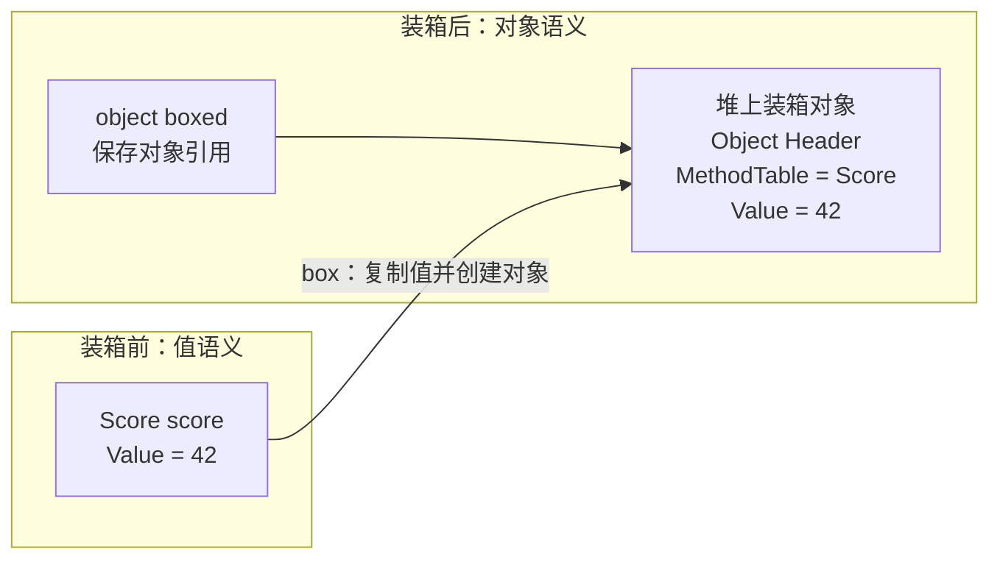

> 装箱不是“值类型换了个写法”，而是“值类型为了进入对象世界，真的多活出了一层对象身份”。

这是 `从 C# 到 CLR` 系列的第 5 篇。前面我们已经把 `class / struct / record` 的边界立住了；这一篇继续往下，把值类型跨进 `object`、接口或异构容器之后到底发生了什么讲清楚。

> **本文明确不展开的内容：**
> - 对象头、`MethodTable`、字段布局和 GC 细节（在 [CCLR-10]() 和 [ECMA-335 内存模型]() 继续追）
> - AOT / IL2CPP / LeanCLR 对装箱的更深优化策略（在后续跨 runtime 文里展开）
> - 反射、表达式树、动态代理里的间接装箱（不在这篇入口文里展开）

## 一、为什么这篇单独存在

装箱和拆箱是很多工程师“概念知道，但成本判断常常失真”的地方。

原因很简单：从语法看，它像一次普通转换；从 runtime 看，它经常意味着语义边界被跨过去了。

值类型原本按值活着。它可以作为局部变量、字段、数组元素存在，可以被复制、传参、返回。

但一旦你要求它进入 `object` 语义，或者让它通过某些接口入口被统一对待，runtime 就必须回答一个问题：

**这份本来按值存在的数据，现在要不要长成一个对象？**

装箱就是对这个问题的肯定回答。

## 二、最小可运行示例

```csharp
using System;
using System.Collections.Generic;

public readonly struct Score
{
    public int Value { get; }

    public Score(int value) => Value = value;

    public override string ToString() => Value.ToString();
}

public static class Demo
{
    private static void DumpObject(object value)
    {
        Console.WriteLine($"object: {value} ({value.GetType().Name})");
    }

    private static void DumpGeneric<T>(T value)
    {
        Console.WriteLine($"generic: {value} ({typeof(T).Name})");
    }

    public static void Main()
    {
        Score score = new Score(42);

        object boxed = score;
        var bag = new List<object> { score };

        DumpObject(score);
        DumpGeneric(score);
        Console.WriteLine(((Score)boxed).Value);
        Console.WriteLine(bag.Count);
    }
}
```

这段代码里，最关键的不是“成功输出了什么”，而是有三条路径被故意摆在一起：

- `object boxed = score;`
- `List<object>` 里放入 `score`
- 泛型方法 `DumpGeneric(score)`

前两条很容易触发装箱语义；第三条则提醒你：不是所有“看起来把值传出去”的场景都会装箱。

这正是理解装箱最重要的一步：**不要把它和“转换”画等号，要看它有没有跨入对象语义边界。**

用图看，装箱前后不是“同一个值换个类型名”，而是值被复制进一个新对象：



这张图故意强调两个动作：**复制值**和**创建对象身份**。只要少看其中一个，你就会低估装箱的语义成本。
## 三、把核心概念分清

### 1. 装箱先是语义跨边界，不是语法换皮

TL;DR：值类型进入 `object` 语义时，runtime 往往要创建一个真正的对象承接它。

你在 C# 里看到的 `object boxed = score;` 很短，短到像一次无害赋值。

但 runtime 需要做的不是“改一下标签”，而是把原本按值存在的数据包装成一个对象，使它能参与对象世界里的统一规则：类型身份、对象引用、虚调用入口、统一容器存储。

这才是装箱真正昂贵的地方。

### 2. 拆箱不是“反向恢复原对象”

TL;DR：拆箱拿回的是值，不是那个对象的持续身份。

当你把 `object` 再转回值类型时，拿回来的通常是值语义本身。你不是重新得到“原来那个活着的值类型实例”，而是重新得到一份值。

所以“先装箱，再拆箱”看起来像来回穿梭，实际上已经跨过一次对象边界。

### 3. 泛型是理解装箱的关键对照组

TL;DR：泛型之所以重要，是因为它能在很多情况下避免把值类型抬进 `object` 语义。

这也是为什么很多 C# 性能讨论最后都会回到泛型：它不只是“更类型安全”，也常常意味着“不给 runtime 平白创造对象”。

所以你看装箱时，一定要有一个对照组：

- 是不是因为我把值放进了 `object`
- 是不是因为我通过非泛型抽象统一了它
- 有没有更自然的泛型路径能保住值语义

## 四、直觉 vs 真相

- 你以为：装箱只是一次类型转换。  
  实际上：装箱通常意味着值类型跨进对象语义边界，runtime 要为它准备一层真实对象。  
  原因是：对象世界和纯值世界遵守的规则不同。  
  要看细节，去：[CCLR-10｜对象在 CoreCLR 里怎么存在]()

- 你以为：拆箱就是把那个对象重新变回原值。  
  实际上：拆箱恢复的是值语义，不是保留对象身份后的“回切”。  
  原因是：值和对象之间不是同一个层面的存在。  
  要看细节，去：[ECMA-335 类型系统：值类型、引用类型、泛型、接口]()

- 你以为：只要代码里没写 `object`，就不会有装箱。  
  实际上：接口、非泛型容器、某些统一抽象入口也可能把值类型推过对象边界。  
  原因是：你最终要看的是 runtime 接收这份值时要求的语义，不只是字面类型。  
  要看细节，去：[CCLR-12｜virtual、interface、override：多态分派到底怎么跑]()

## 五、在 Mono / CoreCLR / IL2CPP / HybridCLR / LeanCLR 里分别怎么落地

### 1. CoreCLR

CoreCLR 会把装箱视为一次明确的对象化边界：值类型一旦进入 `object` 语义，后续就会牵涉对象布局、分派和 GC 追踪。

这也是为什么装箱问题最后总会接到对象模型和泛型共享上。

继续追：[CoreCLR 泛型共享、特化与 `System.__Canon`]()

### 2. Mono

Mono 同样要处理值类型跨进对象语义的成本，只是它会在不同执行路径里体现出不同表现。

所以在 Mono 里理解装箱，重点仍然不是“语法”，而是“这份值最终落到了哪条执行路径”。

继续追：[Mono Mini JIT：IL -> SSA -> Native]()

### 3. IL2CPP

IL2CPP 不会取消装箱语义，它只是把相关决策更多前移到构建链路和原生代码层。

对你来说，重点仍然一样：一旦设计上频繁把值抬到对象边界，AOT 世界里这笔账也跑不掉。

继续追：[IL2CPP 总管线：C# -> IL -> C++ -> Native]()

### 4. HybridCLR

HybridCLR 站在 IL2CPP 之上，因此装箱问题会进一步影响桥接、泛型共享和热更新边界。

这也是为什么理解装箱，不只是性能小题，而是理解热更新 runtime 边界的基础题。

继续追：[HybridCLR 与 IL2CPP 泛型共享规则桥接]()

### 5. LeanCLR

LeanCLR 如果自己定义对象模型，同样要自己回答“值什么时候必须长成对象”。

这说明装箱不是某个现成 runtime 的偶然实现，而是整套类型语义进入对象系统时都会遇到的根问题。

继续追：[CCLR-16｜从零到 CLR：LeanCLR 为什么选择另一条路]()

## 六、小结

- 装箱的关键词不是“转换”，而是“值进入对象边界”。
- 拆箱恢复的是值语义，不是保留对象身份后的回退。
- 想降低装箱，不要只盯语法写法，先看自己是不是不必要地把值推过了对象边界。

## 系列位置

- 上一篇：[CCLR-04｜class、struct、record：三种边界，不是三种写法]()
- 下一篇：[CCLR-06｜从 C# 到 CLI：语言前端、CTS、CLS 到底怎么对应]()
- 向下追深：[CoreCLR 泛型共享、特化与 `System.__Canon`]()
- 向旁对照：[HybridCLR 与 IL2CPP 泛型共享规则桥接]()

> 本文是入口页。继续提交前，请本地运行一次 `hugo`，确认 `ERROR` 为零。
