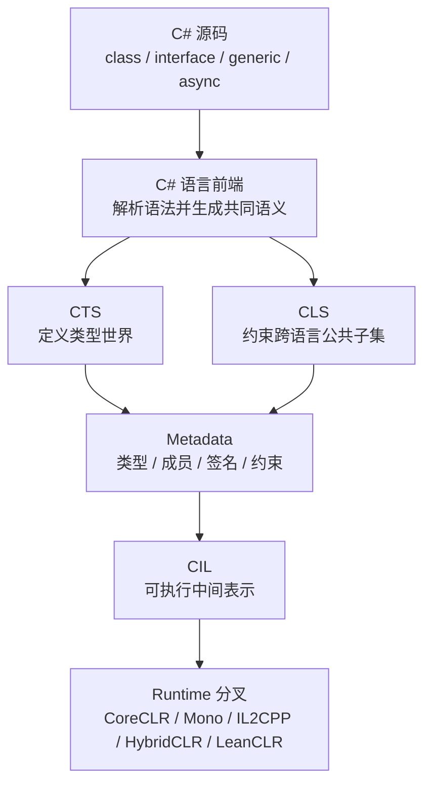

> 你写下的 `class`、`interface`、`generic` 不会直接变成 runtime 结构；它们先要经过 CTS、CLS、metadata 和 CIL 这几层共同语义，runtime 才能接手执行。

这是 `从 C# 到 CLR` 系列的第 6 篇。它开始从“C# 表层概念”正式进入“CLI 规范层”。前面几篇是在帮你把词分清，这一篇则是在回答：**这些词进入标准之后，分别落到了哪一层**。

先把这层桥搭稳，后面你再去看 `ECMA-335`、`CoreCLR`、`Mono`、`IL2CPP`、`HybridCLR`，就不是横着跳到实现细节，而是顺着同一条链往下走。

> **本文明确不展开的内容：**
> - `MethodTable`、对象布局、GC、JIT 的实现细节（在后续 CoreCLR 入口篇展开）
> - 具体 runtime 的对象模型对比（在 `runtime-cross` 和 `Mono / IL2CPP / HybridCLR / LeanCLR` 入口篇展开）
> - `CIL` 指令集的逐条深挖（在 ECMA-335 深水文里展开）

## 一、为什么这篇单独存在

很多人学 C# 时，脑子里默认的世界是“语言就是语言，运行时就是运行时”。但实际上，C# 语言设计者不是凭空发明了一套私有语义，它必须和 CLI 这套共同标准对齐。

`ECMA-335` 不是背景板，它就是这条桥的制度来源。它把“语言怎么写”翻译成“共同平台怎么理解”。如果这一层不先讲清楚，后面就会有两个典型误区：

- 误区一：把 C# 语法当成 runtime 的最终定义，觉得“代码写出来就是它自己说了算”
- 误区二：把 `ECMA-335` 当成纯理论规范，觉得它和自己写代码之间隔着一堵墙

这篇的作用，就是把这堵墙拆成一条可走的桥。你先把 `C# language front-end`、`CTS`、`CLS`、`CLI / CIL` 四个词放稳，后面很多 runtime 文章就会突然顺很多，因为你知道自己正在从哪一层走到哪一层。

## 二、最小可运行示例

先看一个极小例子：同样一段 C#，你可以从语言层看，也可以从 CLI 语义层看。

```csharp
using System;

public interface IPrinter
{
    void Print(string text);
}

public sealed class ConsolePrinter : IPrinter
{
    public void Print(string text)
    {
        Console.WriteLine(text);
    }
}

public static class Program
{
    public static void Main()
    {
        IPrinter printer = new ConsolePrinter();
        printer.Print("hello cli");
    }
}
```

表层上，这只是一个接口、多态实现和一次调用。

但如果把它放进 CLI 视角里，你会立刻多问三件事：

- `IPrinter` 在 metadata 里怎么被记录
- `ConsolePrinter.Print` 在方法签名、调用约定和可见性上怎么表达
- `printer.Print(...)` 在运行时为什么会进入接口分派路径

这就是 C# 到 CLI 的意义：它不是换个名字，而是把表层写法翻译成共同标准可理解的结构。

这一层桥可以先画成这样：



这张图的重点不是背名词，而是看清责任交接：**C# 前端先把语义交给 CLI 共同层，runtime 再接手执行。**
## 三、把四层关系拆开

### 1. C# 语言前端

C# 前端负责的是“你写什么”。它把语法、关键字、泛型、属性、事件、lambda 这些写法，转换成可以被标准和 runtime 继续理解的形式。

它不负责替你决定：

- 这个类型最后怎么分配
- 这个方法到底怎么分派
- 这个对象头长什么样
- 这段代码最后是 JIT、AOT 还是解释执行

前端只做第一步翻译。

### 2. CTS

CTS 是 CLI 里的“类型世界”。它关心的是：

- 类型系统有哪些基本构件
- 值类型和引用类型怎么区分
- 接口、数组、枚举、泛型、委托在标准里怎么定位

所以你可以把 CTS 理解成：

`它规定“类型是什么”。`

### 3. CLS

CLS 是“跨语言共同子集”的规则。它不是想把一切都管死，而是想让不同 CLI 语言之间有一个更稳的互操作边界。

你可以把它理解成：

`它规定“哪些语言特性能跨语言稳定互通”。`

### 4. CLI / CIL

CLI 是整个公共语言基础设施的总称，CIL 是其中被执行的中间语言部分。

所以当 C# 编译过去，你并不是直接得到某个 runtime 的私有表示，而是先得到可以被 CLI 体系理解的中间产物，再由 runtime 去做后续工作。

## 四、直觉 vs 真相

### 直觉一：C# 就是 runtime

- 你以为：C# 写法本身就定义了所有行为。
- 实际上：C# 只是前端，真正的共同边界要落到 CTS、CLS、metadata 和 CIL 上。
- 原因是：同一份 C# 代码会被不同 runtime 接走，而这些 runtime 都要先理解同一套共同语义。

### 直觉二：CLI 只是历史包袱

- 你以为：.NET 早期的标准已经过时，没必要单独看。
- 实际上：你现在读 `CoreCLR`、`Mono`、`IL2CPP`、`HybridCLR`，仍然绕不开 CLI 提供的共同坐标。
- 原因是：runtime 可以各自实现，但共同语义需要先被定义清楚。

### 直觉三：CLS 和 CTS 没必要分开

- 你以为：反正都是类型系统，知道大概就行。
- 实际上：CTS 是基础类型世界，CLS 是跨语言共同子集，它们承担的层级不同。
- 原因是：如果不分开，你会很难理解“为什么某些语法在某些语言里能互操作，在另一些场景里却不该强行使用”。

## 五、CLI 里到底在做什么

这一篇不展开所有规范细节，只先建立一张地图。

### 1. 类型和成员先被标准化

C# 中的 `class`、`struct`、`interface`、`enum`、`delegate`、`field`、`method` 都会先落到 CLI 可描述的类型和成员结构里。

### 2. 签名和可见性先被编码

方法参数、返回值、泛型参数、约束、可见性、静态/实例区分，这些都必须先进入标准化描述，runtime 才能继续做加载和分派。

### 3. 执行模型再接管

到了 runtime 阶段，JIT、AOT 或解释器才开始决定代码怎么跑。

所以这一篇你要记住的是：

`C# 先被翻译成 CLI 能理解的东西，然后 runtime 才接手执行。`

这一句其实就是本篇的中心桥梁：先有共同语义，再有具体运行时。后面你看 `CoreCLR`、`Mono`、`IL2CPP` 时，很多争论就不再是“语言语义不一样”，而是“同一套 CLI 语义在不同执行模型里怎么落地”。

## 六、最容易混的地方

### 1. C# 前端和 CLI 不是一回事

C# 是语言，CLI 是共同基础设施。前者负责表达，后者负责承接。

### 2. CTS 和 CLS 不是同义词

CTS 管类型世界的基础结构，CLS 管跨语言共同子集。它们相关，但职责不同。

### 3. metadata 不是“编译后的附带说明”那么简单

它不是边角料，而是 runtime 读取类型、方法、签名和属性的重要入口。

### 4. CIL 不是“中间废料”

CIL 是语义和执行之间的重要中转层。没有它，很多 runtime 根本没法在共同标准上继续工作。

## 七、放进 runtime 里怎么看

### 1. 为什么这一步对 CoreCLR 重要

因为 CoreCLR 的很多行为，都依赖 CLI 已经把类型、签名和成员关系说清楚了。先有这层共同语义，后面的加载、分派、反射和执行才有稳定底座。

### 2. 为什么这一步对 IL2CPP 重要

因为 IL2CPP 先把共同语义转换成 C++ / native 可处理的形式，前面的标准化定义就是它能不能稳定翻译的前提。

### 3. 为什么这一步对 HybridCLR 重要

因为 HybridCLR 要在 IL2CPP 的边界上继续补运行时行为，前面的 CLI 共同语义就是它做 bridge 和补 metadata 的基础。

### 4. 为什么这一步对 LeanCLR 重要

因为 LeanCLR 作为新 runtime，同样要先理解这套共同语义，再决定哪些部分自己实现、哪些部分简化。

## 八、读完这篇接着看哪些文章

- [CCLR-04｜class、struct、record：三种边界，不是三种写法]()
- [CCLR-05｜装箱与拆箱：什么时候只是转换，什么时候真的产生对象]()
- [CCLR-07｜ECMA-335 里的值类型和引用类型：先把类型分类对上号]()
- [ECMA-335 系列索引]()
- [CLI Metadata 基础：TypeDef、MethodDef、Token、Stream]()

## 九、小结

- C# 是语言前端，CLI 是共同落点，runtime 负责执行
- CTS 管类型世界，CLS 管跨语言共同子集，CIL 是执行中间层
- 先把这层桥搭好，后面看 CoreCLR、Mono、IL2CPP、HybridCLR、LeanCLR 才不会串层

## 系列位置

- 上一篇：[CCLR-05｜装箱与拆箱：什么时候只是转换，什么时候真的产生对象]()
- 下一篇：[CCLR-07｜ECMA-335 里的值类型和引用类型：先把类型分类对上号]()
- 向下追深：[ECMA-335 系列索引]()
- 向旁对照：[CLI Metadata 基础：TypeDef、MethodDef、Token、Stream]()

> 本文是入口页。继续写正文前，请本地运行一次 `hugo`，确认 `ERROR` 为零。
