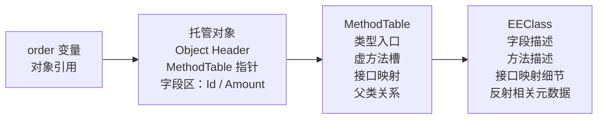

> `class` 进入 runtime 以后，不再只是类型声明，而是对象头、类型指针和字段布局共同组成的运行时实体。

这是 `从 C# 到 CLR` 系列的第 10 篇。它不负责把 `MethodTable`、`EEClass`、`TypeHandle` 的内部结构完整展开，只负责先回答一个入口问题：**对象在 CoreCLR 里到底由哪几层组成**。

如果你还没把“类、对象、实例、静态”分开，建议先看 [CCLR-00｜从 C# 到 CLR：这条线到底在讲什么]() 和 [CCLR-01｜值类型、引用类型、对象：先把 3 个最容易混的词讲清楚]()。

> **本文明确不展开的内容：**
> - `MethodTable` / `EEClass` 的完整字段表和对象模型源码细节
> - `TypeHandle` 在不同 runtime 中的编码差异
> - `GC`、`JIT`、`AOT` 的整条执行链路
> - `CoreCLR` 系列后续深水文中的类型系统、加载和布局实现

## 一、为什么这篇必须单独存在

很多人学 `class` 时，先记住的是语法，后丢掉的是运行时视角。

于是就容易出现几个误解：

- 以为 `class` 只是“能 new 出来的东西”
- 以为对象就是“变量里那个名字”
- 以为只要知道字段和方法，就已经理解对象了

这些说法在入门阶段能帮你过关，但它们都太薄了。真正进入 runtime 后，`class` 会立刻变成一组更具体的问题：对象怎么分配、字段怎么排、类型怎么找、方法怎么分派、GC 怎么识别它。

这篇的作用，就是把这组问题先摆平。先把坐标立住，后面再去读 `CoreCLR`、`Mono`、`IL2CPP`、`HybridCLR`、`LeanCLR`，你就知道自己在看哪一层。

## 二、先看一个最小例子

```csharp
using System;

public sealed class Order
{
    public int Id { get; }
    public decimal Amount { get; }

    public Order(int id, decimal amount)
    {
        Id = id;
        Amount = amount;
    }

    public virtual decimal FinalAmount() => Amount;
}

public static class Program
{
    public static void Main()
    {
        Order order = new Order(1001, 128.5m);
        Console.WriteLine($"{order.GetType().Name}: {order.FinalAmount()}");
    }
}
```

这段代码看起来平平无奇，但 runtime 接到的是一整套对象模型问题。

- `order` 不是“类定义”，而是一个已经分配好的对象实例
- `Amount` 不是单独漂浮的值，而是对象布局里的一个字段
- `FinalAmount()` 不是“写在类里就完了”，而是 runtime 要知道如何找到这个调用入口

本篇先不展开方法分派和 JIT 优化，只先把这件事钉住：**`class` 进入 runtime 后，是对象身份、类型信息和字段布局的组合。**

把对象拆开看，最小结构可以先画成两条链：对象本体负责“这一个实例”，类型结构负责“这一类对象怎么被识别和分派”。



这不是 CoreCLR 的完整内存布局，只是一张入口图。你先知道引用、对象、`MethodTable`、`EEClass` 的关系，后面再去读 B3 深水文才不会迷路。
## 三、把对象拆成三层看

### 1. 对象头：runtime 先认人

对象进入内存后，runtime 需要先知道它是谁、归谁管、能不能被同步和扫描。

对象头就是这层入口。它不负责业务数据，负责的是身份、类型和运行时管理信息。

你可以把它理解成“身份证 + 管理卡”。没有这层，GC、反射和虚拟调用都没法稳定工作。

### 2. MethodTable：热路径上的类型骨架

`MethodTable` 是对象模型里最常被访问的热结构之一。它保存类型相关的关键入口：虚方法信息、接口映射、类型描述、父类关系等。

入口文不需要把它拆到字段级别，只要先知道一件事：**对象不只是数据，还是一份可分派、可识别、可扫描的运行时结构。**

### 3. EEClass：冷数据不等于无关数据

`EEClass` 更像类型的冷区，它承载不常走热路径、但又不能丢的数据，例如字段与方法的详细描述、接口映射、反射信息等类型元数据。

这也是 CoreCLR 做冷热分离的理由：把真正频繁访问的东西留在热路径，把不常用但重要的东西移到冷区。

## 四、直觉 vs 真相

### 直觉一：`class` 就是对象本身

真相是：`class` 先是类型声明，对象才是运行时实例。

你写下 `class Order`，只是给 runtime 一份结构说明。真正 `new Order(...)` 之后，runtime 才会把对象头、字段和类型入口拼成一个活体对象。

### 直觉二：反射只是慢一点的普通调用

真相是：反射常常更容易碰到 `EEClass` 一侧的冷数据，而普通虚调/调用更偏向 `MethodTable` 一侧的热数据。

这不是“快慢差一点”那么简单，而是访问路径本身就不同。

### 直觉三：所有 runtime 的对象都差不多

真相是：它们都在解决同一件事，但布局和取舍不同。

有的偏热冷分离，有的偏单结构，有的把一部分决定前置到构建期，有的追求最小化结构。目标场景不同，对象模型就会长成不同样子。

## 五、Mono / CoreCLR / IL2CPP / HybridCLR / LeanCLR 分别怎么落地

这一节只做横向标记，不把内部结构展开到底。

### CoreCLR

CoreCLR 把对象布局、类型入口和运行时管理拆得比较清楚。它适合拿来理解“对象模型应该怎么分层”，也是后续深水文的主要参照。

### Mono

Mono 的对象模型更强调可维护性和跨平台落地。它帮你看到：同样是托管对象，不同 runtime 也可以用不同的结构承载。

### IL2CPP

IL2CPP 的关键是把托管语义提前翻译成原生代码可理解的形式。它依然要承认对象、引用和字段布局，只是很多决定会更早发生。

### HybridCLR

HybridCLR 的问题不是“对象是什么”，而是“在 AOT 约束下，怎么补齐动态能力”。所以它仍然必须依赖统一的对象和类型语义。

### LeanCLR

LeanCLR 更像另一条轻量实现路线。它提醒读者：对象模型不是只有一条标准答案，约束不同，结构就会变。

## 六、放进设计模式里怎么想

这篇和设计模式前置知识是能接上的。

- **Builder**：构造过程可以分步，但最终还是要收口成稳定对象
- **Prototype**：复制的不是源代码，而是已经进入运行时的对象形态
- **Flyweight**：共享能不能成立，先看对象里哪些数据是热的、哪些能拆出去
- **Template Method**：对象一旦稳定下来，后续入口点才有机会被复用

所以这篇不是在讲“一个 class 怎么写”，而是在讲：**一个 class 进 runtime 后，为什么还能被稳定识别、调用和扫描。**

## 七、读完这篇接着看哪些文章

- [CCLR-11｜值类型到底在哪里：栈、堆、寄存器和装箱的误解]()
- [CCLR-12｜virtual、interface、override：运行时到底怎么分派方法]()
- [CoreCLR 类型系统深水文：MethodTable、EEClass、TypeHandle]()
- [多 runtime 横向对照：MethodTable vs Il2CppClass vs RtClass]()
- [CCLR-00｜从 C# 到 CLR：这条线到底在讲什么]()

## 八、小结

- `class` 进入 runtime 以后，不只是类型声明，而是对象、类型和字段布局的组合
- `MethodTable`、`EEClass`、对象头分别负责不同层次的信息，不能混成一个词
- 这篇只负责立住坐标，不展开 B3 / G2 / G3 的深水细节

## 系列位置

- 上一篇：[CCLR-09｜泛型约束和签名：不是更难写，而是更早把边界说清楚]()
- 下一篇：[CCLR-11｜值类型到底在哪里：栈、堆、寄存器和装箱的误解]()
- 向下追深：[CoreCLR 类型系统深水文]()
- 向旁对照：[多 runtime 横向对照]()
