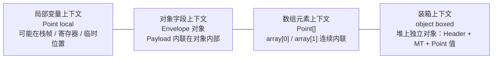

> 值类型的关键不是“天生住在栈上”，而是它以值语义参与复制、传递和嵌入。

这是 `从 C# 到 CLR` 系列的第 11 篇。它不负责把 `GC` 逃逸分析、寄存器分配、`ref struct` 限制和 `Span<T>` 的全部边界展开，只负责先回答一个经常被讲错的问题：**值类型到底在哪里**。

如果你还没把 `值类型`、`引用类型`、`对象` 的关系拆开，建议先看 [CCLR-01｜值类型、引用类型、对象：先把 3 个最容易混的词讲清楚]() 和 [CCLR-10｜对象在 CoreCLR 里怎么存在：对象头、MethodTable、字段布局]()。

> **本文明确不展开的内容：**
> - `GC` 逃逸分析和寄存器分配的完整实现
> - `async` / iterator 状态机如何搬运局部变量
> - `ref struct`、`Span<T>`、`stackalloc` 的全部限制
> - `CoreCLR` 内部值类型布局的源码级细节

## 一、为什么这篇必须单独存在

值类型最容易被讲歪的地方，就是它常常被一句“在栈上”草草打发掉。

这句话能帮你记住一部分现象，但也会误导你在三个地方做错判断：

- 看到局部变量就以为它一定在栈上
- 看到 `new` 就以为一定发生堆分配
- 看到 `struct` 就以为它一定更快

这三句话都太粗了。

runtime 真正关心的不是“它长什么名字”，而是：这份值是怎么被复制的、谁持有它、它会不会被嵌入别的对象里、它会不会被装箱成对象。

所以这篇要做的事情很简单：把“位置”从“语义”里拆出来。

## 二、先看一个最小例子

```csharp
using System;

public struct Point
{
    public int X;
    public int Y;

    public override string ToString() => $"({X}, {Y})";
}

public sealed class Envelope
{
    public Point Payload;
    public object? Boxed;
}

public static class Program
{
    public static object Box(Point point) => point;

    public static void Main()
    {
        Point local = new Point { X = 3, Y = 4 };
        Envelope envelope = new Envelope { Payload = local };
        Point[] array = { local };
        object boxed = Box(local);

        Console.WriteLine($"local   = {local}");
        Console.WriteLine($"field   = {envelope.Payload}");
        Console.WriteLine($"array   = {array[0]}");
        Console.WriteLine($"boxed   = {boxed.GetType().Name}");
    }
}
```

这段程序只是在演示一件事：**同一个 `Point`，会因为上下文不同，落到完全不同的承载形态里。**

- 作为局部变量，它可能出现在栈帧、寄存器或者被优化后的临时位置里
- 作为对象字段，它会嵌在宿主对象内部
- 作为数组元素，它会内联在数组对象里
- 作为 `object`，它会被装箱成一个独立对象

你要先把这四种形态分开，后面再谈 `struct` 才不会乱。

这四种承载形态可以并排看：



这张图把“值类型在哪里”改写成一个更准确的问题：**它现在被哪个上下文承载？**
## 三、把“在哪里”拆成四种上下文

### 1. 局部变量：位置可能被 runtime 自由安排

局部变量是最容易被误解的地方。

你写的是一个 `Point local`，但 runtime 并不承诺它永远固定在某个物理位置。它可能在栈帧里，也可能被放进寄存器，甚至在优化后被短暂重排。

所以“值类型在栈上”只是一种常见现象，不是语义本身。

### 2. 对象字段：值类型可以嵌在引用类型里

当 `Point` 作为 `Envelope.Payload` 这样的字段出现时，它就不再是“独立住址”的概念，而是宿主对象的一部分。

这时你要问的不是“它是不是值类型”，而是“它是不是被内联进别的对象里了”。

### 3. 数组元素：值类型会在数组对象里连续内联

数组的元素如果是值类型，元素本身通常会连着放在数组对象内部。

这就是为什么值类型有时能带来更紧凑的内存布局：它们不是每个都单独分配，而是直接作为连续内容出现。

### 4. 装箱结果：值类型会变成独立对象

一旦你把值类型放进 `object`、接口或某些需要引用语义的场景里，它就可能发生装箱。

装箱之后，运行时看到的不再只是“一个值”，而是一个独立对象。这个对象有自己的身份和管理开销。

## 四、直觉 vs 真相

### 直觉一：`struct` 就等于“在栈上”

真相是：`struct` 的本质是值语义，不是栈语义。

它可能在栈上，也可能嵌在对象里，也可能躺在数组里，也可能被装箱成对象。决定因素是上下文，不是名字。

### 直觉二：`new` 就一定分配堆对象

真相是：对值类型来说，`new` 常常只是初始化一个值，而不是一定触发独立堆分配。

这也是为什么“看见 `new` 就判定堆分配”这种判断方式很危险。

### 直觉三：值类型一定更快

真相是：如果值太大、拷贝太频繁、装箱太多，值类型反而会拖慢程序。

值类型的优势通常来自：语义清楚、布局紧凑、可批量搬运。它不是免费午餐。

### 直觉四：装箱只是类型转换

真相是：装箱会产生对象。

这意味着它有分配、复制、额外头部和生命周期管理成本。把它看成普通转换，往往就是性能和语义同时踩坑的开始。

## 五、Mono / CoreCLR / IL2CPP / HybridCLR / LeanCLR 分别怎么落地

这一节只先把差异定住，不展开实现细节。

### CoreCLR

CoreCLR 会根据上下文决定值类型是如何被承载的：局部变量、字段、数组和装箱路径都不是同一种形态。

### Mono

Mono 也遵守同样的值语义，但在结构组织和优化路径上和 CoreCLR 不完全一样。它提醒你：值语义一致，承载方式可以不同。

### IL2CPP

IL2CPP 会把很多布局决定提前固化到生成代码里。值类型仍然是值类型，但它的承载和复制方式会被更早地翻译成原生代码。

### HybridCLR

HybridCLR 仍然必须在 IL2CPP 的约束上解释值语义。它的关键不是重新定义值类型，而是让值类型在热更新和解释执行场景下仍然可用。

### LeanCLR

LeanCLR 走的是更轻量的路线。它会让你看到：值类型的语义并不依赖某一套巨大实现，关键是约束和承载模型要说清楚。

## 六、放进设计模式里怎么想

值类型的承载方式，会直接影响你怎么理解一些设计模式。

- **Prototype**：复制语义天然接近值类型，但只在成员都可安全复制时才成立
- **Flyweight**：共享和内联是相反方向，先想清楚哪些数据应该拆出去
- **Builder**：构造阶段可以暂时变化，但最终常常希望收口成稳定值
- **Memento**：快照之所以自然，正是因为值语义更容易复制出稳定副本

所以这篇不是在讲“值类型到底放哪块内存”，而是在讲：**同样一个值，runtime 为什么会把它放进不同承载形态。**

## 七、读完这篇接着看哪些文章

- [CCLR-10｜对象在 CoreCLR 里怎么存在：对象头、MethodTable、字段布局]()
- [CCLR-12｜virtual、interface、override：运行时到底怎么分派方法]()
- [CCLR-05｜装箱与拆箱：什么时候只是转换，什么时候真的产生对象]()
- [CCLR-07｜ECMA-335 里的值类型和引用类型：先把类型分类对上号]()
- [CoreCLR 类型系统深水文：MethodTable、EEClass、TypeHandle]()

## 八、小结

- 值类型的本质是值语义，不是栈语义
- 同一个值类型会因为上下文不同，落到局部变量、字段、数组或装箱对象里
- 这篇只负责把“在哪里”说清楚，不展开 GC、寄存器分配和状态机搬运的深水细节

## 系列位置

- 上一篇：[CCLR-10｜对象在 CoreCLR 里怎么存在：对象头、MethodTable、字段布局]()
- 下一篇：[CCLR-12｜virtual、interface、override：运行时到底怎么分派方法]()
- 向下追深：[CoreCLR 类型系统深水文]()
- 向旁对照：[多 runtime 横向对照]()
