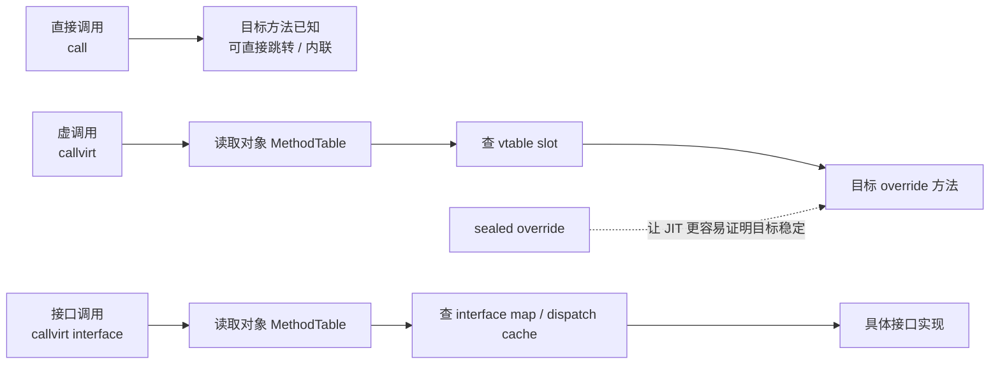

> `virtual`、`interface`、`override` 不是三种“都能多态”的同义词，而是三条不同的运行时分派路径。

这是 `从 C# 到 CLR` 系列的第 12 篇。它不负责把 `MethodTable`、`EEClass`、`DispatchMap`、`VSD` stub 的生成细节完整展开，只负责回答一个最关键的问题：**方法调用到底是怎么被 runtime 找到的**。

如果你还没把 `class`、`对象`、`值类型` 的边界整理好，建议先看 [CCLR-10｜对象在 CoreCLR 里怎么存在：对象头、MethodTable、字段布局]() 和 [CCLR-11｜值类型到底在哪里：栈、堆、寄存器和装箱的误解]()。

> **本文明确不展开的内容：**
> - `MethodTable` / `EEClass` 的完整对象模型布局
> - `DispatchMap`、`VSD` stub 的生成流程
> - `RyuJIT` 的去虚拟化、内联和 tiered compilation 的完整策略
> - Mono / IL2CPP / HybridCLR / LeanCLR 的源码级实现差异

## 一、为什么这篇必须单独存在

`virtual`、`interface`、`override` 经常被放在一起教，但它们解决的不是同一个问题。

- `virtual` 先声明“这里可以被替换”
- `override` 负责“把基类留下的槽位接过去”
- `interface` 负责“先把能力契约说清楚，再让 runtime 去找实现”

如果把这三件事混成一锅，你就会在设计上误判：到底是在预留流程钩子、还是在约束能力契约、还是在复用同一个虚槽位。

这篇的作用，就是把这三条路径分开。你先知道 runtime 是怎么找方法的，再去谈性能、架构和多态，才不会把“语义不同”硬说成“只是一种写法”。

## 二、先看一个最小例子

```csharp
using System;

public interface IAmountFormatter
{
    string Format(decimal amount);
}

public abstract class PriceRule
{
    public virtual decimal Apply(decimal amount) => amount;
}

public sealed class VipRule : PriceRule
{
    public override decimal Apply(decimal amount) => amount * 0.8m;
}

public sealed class MoneyFormatter : IAmountFormatter
{
    public string Format(decimal amount) => amount.ToString("0.00");
}

public static class Program
{
    public static void Main()
    {
        PriceRule rule = new VipRule();
        IAmountFormatter formatter = new MoneyFormatter();

        decimal discounted = rule.Apply(100m);
        Console.WriteLine(formatter.Format(discounted));
    }
}
```

这段代码的业务味道很轻，但 runtime 看到的是两条完全不同的调用路径：

- `rule.Apply(100m)` 走的是虚方法槽位
- `formatter.Format(...)` 走的是接口映射路径

而 `override` 做的事情，只是接管基类预留出来的那个槽位。

所以这篇的核心不是“多态有多强”，而是：**runtime 到底是怎么找到真正目标方法的。**

## 三、先把三个词放回它们的位置

### 1. `virtual`：先留槽位

`virtual` 的重点不是“动态”，而是“这里有一个以后可能被替换的入口”。

基类声明 `virtual`，runtime 就知道这里不是普通静态调用点，而是一条要经过分派的入口。

### 2. `override`：接管同一个槽位

`override` 不是新开一个入口，而是占用基类预留的那个入口。

这意味着子类并没有另起炉灶，而是接手了同一条虚调用路径。

### 3. `interface`：先立契约，再找实现

`interface` 先规定“你必须提供什么能力”，然后 runtime 再把这个契约映射到具体实现。

它不是另一种 `virtual`，而是另外一条查找路径。

## 四、把一次调用拆成三条路

| 调用形态 | runtime 先找什么 | 常见实现路径 | 你最该盯住的点 |
|---|---|---|---|
| 直接调用 | 具体方法地址 | 直接跳转 / 内联 | 调用点是否已知 |
| `virtual` 调用 | 虚槽位 | vtable / slot lookup | 入口是否稳定 |
| `interface` 调用 | 接口到实现的映射 | interface map / dispatch stub / cache | 契约如何落到实现 |

这张表最重要的一句是：**`override` 不是新分派机制，它只是把基类留下的虚槽位换成了子类实现。**

很多设计判断一旦理解了这一点，就会变得更稳：

- 想要流程骨架，优先考虑 `abstract class + virtual hooks`
- 想要能力契约，优先考虑 `interface`
- 想要明确禁止再往下改，优先考虑 `sealed override`

如果换成流程图，三条调用路径的差异会更清楚：



这张图不等于 CoreCLR 的完整分派实现。它只帮你把“直接调用、虚槽位、接口映射”三条路分开。
## 五、`sealed override` 和去虚拟化

`sealed override` 的作用不是“更好看”，而是告诉 runtime：这条虚链到我这里就封住了。

这会给 `JIT` 更多机会做两件事：

- 去虚拟化
- 内联

也就是说，`virtual` 并不天然慢，`interface` 也并不天然慢。只要调用点足够稳定，`JIT` 可能把这些间接层都吃掉。

所以不要把“虚调用”当成一个永久的性能标签。它更像是**默认查找路径**，而不是最终代价。

## 六、CoreCLR / Mono / IL2CPP / LeanCLR 分别怎么落地

这一节也只做入口对照，不展开源码级细节。

### CoreCLR

CoreCLR 把虚方法槽位和接口映射分得比较清楚。`virtual` 偏向槽位查找，`interface` 偏向映射查找，必要时还会走缓存 stub。

### Mono

Mono 的结构更直接一些，类型信息、接口列表和 vtable 往往靠更统一的对象结构承载。它适合理解分派逻辑本身，但不要把它和 CoreCLR 的热冷分层直接画等号。

### IL2CPP

IL2CPP 会提前把很多分派信息写进生成代码或运行时表里。接口调用通常依赖映射，虚调用通常依赖 vtable。它的关键是：语义没变，落地提前了。

### LeanCLR

LeanCLR 更偏轻量。它会尽量把运行时结构压薄，但仍然要提供同样的分派语义。

这些实现的差别，不是“谁更会多态”，而是**谁把分派成本放在运行时，谁把答案提前到构建期，谁愿意为体积和灵活性做不同取舍。**

## 七、放进设计模式里怎么想

这篇和设计模式前置知识也能直接接起来。

- **Template Method**：`virtual` / `abstract` 钩子本身就是流程骨架的入口
- **Strategy**：如果你要替换的是整套行为，而不是某个槽位，往往应该退回组合
- **State**：状态对象之间的切换，很多时候也是围绕虚调用路径组织的
- **Bridge**：抽象和实现分离后，分派路径会更像“桥接后再调用”而不是直接继承

所以这篇不是在讲“多态是什么”，而是在讲：**runtime 为什么能把同一个调用点导向不同实现。**

## 八、读完这篇接着看哪些文章

- [CCLR-13｜delegate、event、async：把行为交给运行时和框架去安排]()
- [CCLR-10｜对象在 CoreCLR 里怎么存在：对象头、MethodTable、字段布局]()
- [CCLR-11｜值类型到底在哪里：栈、堆、寄存器和装箱的误解]()
- [CoreCLR 类型系统深水文：MethodTable、EEClass、TypeHandle]()
- [多 runtime 横向对照：MethodTable vs Il2CppClass vs RtClass]()
- [前置知识 02｜interface、abstract class、abstract、virtual、override]()

## 九、小结

- `virtual`、`override`、`interface` 不是同义词，而是三条不同的分派路径
- `override` 接管的是同一个虚槽位，`interface` 走的是契约到实现的映射
- 这篇只负责把“调用点怎么找到方法”说清楚，不展开 VSD、tiered compilation 和深水实现

## 系列位置

- 上一篇：[CCLR-11｜值类型到底在哪里：栈、堆、寄存器和装箱的误解]()
- 下一篇：[CCLR-13｜delegate、event、async：把行为交给运行时和框架去安排]()
- 向下追深：[CoreCLR 类型系统深水文]()
- 向旁对照：[多 runtime 横向对照]()
