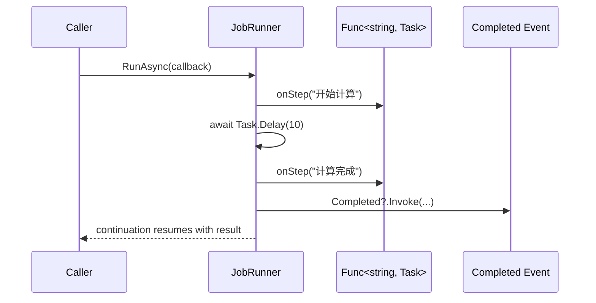

> `delegate`、`event` 和 `async/await` 不是三个孤立语法点，而是三种把行为从类里拆出来、交给 runtime 或框架安排的入口。

这是 `从 C# 到 CLR` 系列的第 13 篇。前几篇已经把对象布局、值类型位置和多态分派放进 CoreCLR 参考实现里看；这一篇换一个角度：**行为不一定写死在类的方法体里，它也可以被传递、订阅、暂停和恢复**。

> **本文明确不展开的内容：**
> - `Task` / `ValueTask` 的完整实现
> - `SynchronizationContext`、线程池、调度器在不同宿主里的全部差异
> - `async/await` 状态机 lowering 的源码级细节
> - CoreCLR delegate 对象布局和 invoke stub 的完整实现

这些内容分别去看 [ET 前置：async/await、状态机与 continuation]()、[CoreCLR 线程、同步、Monitor 与线程池]() 和 [CoreCLR 类型系统]()。

## 一、为什么这篇单独存在

很多人学 `delegate`、`event` 和 `async/await` 时，会把它们拆成三块语法记忆：委托是回调，事件是订阅，异步是不用阻塞线程。

这些说法都对，但都不够。

更准确的看法是：它们分别解决三种行为入口问题。

- `delegate`：把行为变成可以传递的值
- `event`：把通知边界收紧，保留触发权
- `async/await`：把“暂停后怎么继续”交给 continuation 和调度入口

三者共同做的事，是把原本写死在调用者和被调用者之间的行为关系，变成 runtime、框架或宿主可以安排的结构。

这正是它们和设计模式有关的原因。`Strategy` 可以用委托变轻，`Observer` 需要事件边界，`Command` 和 `async` 都在处理“把行为延迟到以后执行”的问题。

## 二、最小可运行示例

下面这个例子故意把三者放在一个小流程里：委托传入步骤回调，事件对外通知完成，`await` 把暂停后的继续执行交给 continuation。

```csharp
using System;
using System.Threading.Tasks;

public sealed class JobCompletedEventArgs : EventArgs
{
    public JobCompletedEventArgs(int result) => Result = result;
    public int Result { get; }
}

public sealed class JobRunner
{
    public event EventHandler<JobCompletedEventArgs>? Completed;

    public async Task<int> RunAsync(Func<string, Task> onStep)
    {
        if (onStep is null)
        {
            throw new ArgumentNullException(nameof(onStep));
        }

        await onStep("开始计算");
        await Task.Delay(10);
        await onStep("计算完成");

        const int result = 42;
        Completed?.Invoke(this, new JobCompletedEventArgs(result));
        return result;
    }
}

public static class Program
{
    public static async Task Main()
    {
        var runner = new JobRunner();
        runner.Completed += (_, e) => Console.WriteLine($"事件通知：结果是 {e.Result}");

        int result = await runner.RunAsync(step =>
        {
            Console.WriteLine($"回调：{step}");
            return Task.CompletedTask;
        });

        Console.WriteLine($"返回值：{result}");
    }
}
```

这段代码表面上很顺，runtime 视角却已经拆成四件事。

- `Func<string, Task>` 把一段行为当作值传进来
- `event` 允许外部订阅完成通知，但不允许外部越权触发
- `await` 后面的代码被编译器组织成 continuation
- 看起来顺序执行的方法，编译后已经带上状态保存和恢复入口



## 三、把三个词分开

### 1. `delegate`：行为值

`delegate` 不是“回调”本身，而是承载某个方法签名的类型。它解决的是：`int`、`string` 能作为值传来传去，行为为什么不行？

现代 C# 里，`Func<>` 和 `Action<>` 让它更轻。很多过去必须写成类的策略，现在传一个委托就够了。

### 2. `event`：受控的通知入口

`event` 不是“加了订阅功能的 delegate”。它更像是把触发权留在发布者手里的委托封装。

外部可以订阅和退订，不能直接触发内部广播。这个限制很值钱，因为它把对象边界钉住了。

### 3. `async/await`：continuation 协议

`async/await` 的重点不是“写得像同步代码”，而是编译器把方法拆成状态机，运行时和框架把后续逻辑登记成 continuation。

`await` 不是线程 API。很多异步操作并不会新开后台线程；它关心的是暂停后由谁恢复、恢复到哪里、带着什么上下文恢复。

### 4. 三者的分工

| 词 | 解决的问题 | 最容易误读成 |
|---|---|---|
| `delegate` | 行为怎么传 | 只是函数指针 |
| `event` | 谁能发通知 | 普通公开委托字段 |
| `async/await` | 暂停后怎么恢复 | 创建线程或阻塞等待 |

把这三者放在一起看，能看出一条线：**行为从“直接调用”走向“可传递、可订阅、可恢复”**。

## 四、直觉 vs 真相

| 直觉 | 真相 |
|---|---|
| `delegate` 就是把方法传过去 | `delegate` 是带目标对象、方法入口和调用约定的 runtime 对象；它把行为变成值 |
| `event` 就是加了订阅功能的 `delegate` | `event` 的关键是限制外部只能订阅和退订，不能越权触发 |
| `await` 就是等异步任务结束 | `await` 关心 continuation 由谁恢复、恢复到哪里、以什么上下文恢复 |
| 异步代码一定会开后台线程 | 很多异步并不创建新线程；它只是把后续逻辑交给另一个调度入口 |

这里最容易踩的坑，是把“语法表面”当成“运行时事实”。这篇要帮你建立的，正是后者。

## 五、在 Mono / CoreCLR / IL2CPP / HybridCLR / LeanCLR 里分别怎么落地

下面这张表只看边界，不展开源码细节。

| Runtime | `delegate` / `event` 的落地方式 | `async/await` 的落地方式 |
|---|---|---|
| Mono | 委托、事件按 CLI 语义落地，但会走自己的 JIT / AOT / interpreter 路径 | 状态机和 continuation 可以适配多执行模式 |
| CoreCLR | 委托调用、接口调用、虚调用都能进入 JIT 优化视野 | 编译器生成状态机，运行时和线程池承担恢复与调度 |
| IL2CPP | 表层语义保留，但动态能力被构建期收紧 | `async` 走 IL -> C++ -> native 的提前展开路径 |
| HybridCLR | 热更新边界需要让委托、事件和新方法继续可见 | 难点是热更新代码里的 continuation 如何被解释器和 AOT 世界共同承接 |
| LeanCLR | 以更小对象模型承载行为入口 | 更强调最小语义集合和可控调度面 |

这张表的重点不是“谁更强”，而是“谁把行为交给 runtime 的方式不同”。

## 六、往下读该看什么

如果你想继续往下看，最适合接这三篇：

- [ET 前置：async/await、状态机与 continuation]()
- [CoreCLR 线程、同步、Monitor 与线程池]()
- [CoreCLR 架构总览：从 dotnet run 到 JIT]()

第一篇会把 continuation 和状态机讲透，第二篇会把调度和同步边界补出来，第三篇则让你把一次委托调用、一个事件通知、一次 `await` 恢复放进完整 runtime 流程里看。

## 七、小结

- `delegate` 让行为变成值，`event` 让通知边界可控，`async/await` 让 continuation 进入运行时协议
- 这三者不是三个孤立语法点，而是同一类“把行为交给 runtime 安排”的入口
- 先把行为、边界和恢复位置分清，再去看 `Strategy`、`Command`、`Observer` 和异步框架，会顺很多

## 系列位置

- 上一篇：[CCLR-12｜virtual、interface、override：运行时到底怎么分派方法]()
- 下一篇：[CCLR-14｜Mono、CoreCLR 与 IL2CPP：同样的 C#，为什么会走向三种执行模型]()
- 向上链接：[设计模式前置 04｜委托、回调、事件：让行为变成可以传递的值]()
- 向下追深：[ET 前置：async/await、状态机与 continuation]()
- 向旁对照：[CoreCLR 线程、同步、Monitor 与线程池]() / [CoreCLR 架构总览：从 dotnet run 到 JIT]()

> 这是入口页。继续往下读时，请本地跑一次 `hugo`，确认 `ERROR` 为零。
