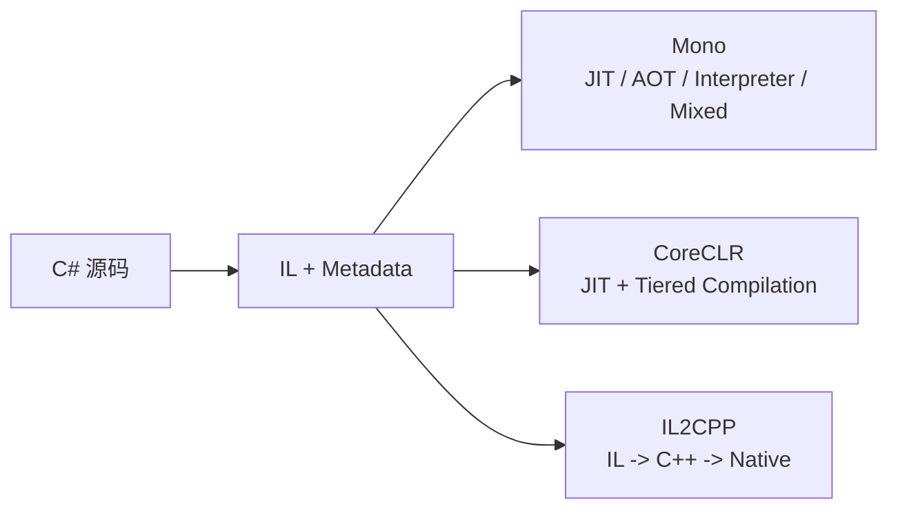

> 同样一段 C#，在 Mono、CoreCLR 和 IL2CPP 里走的不是三条“性能不同的路”，而是三条“责任分摊位置不同的路”。

这是 `从 C# 到 CLR` 系列的第 14 篇。前面 A/B/C 三层已经把语言表层、CLI 规范和 CoreCLR 参考实现的入口坐标立住了；这一篇开始正式分叉，先把 Mono、CoreCLR、IL2CPP 这三条主执行模型放到一张图上。

> **本文明确不展开的内容：**
> - 三条 runtime 的源码级细节与完整实现（分别去看各自深水系列）
> - 五 runtime 的横向总比较（去看 [runtime-cross 系列索引]()）
> - Unity 热更新补缝方案（在 [CCLR-15]() 展开）

## 一、为什么这篇单独存在

很多人第一次看 runtime 选型时，最容易把问题问错。

他们会问：谁更快、谁更先进、谁才是正确路线。

这三个问题都太扁。真正该问的是：**同一组 C# 语义，在哪个阶段被处理、在哪个阶段被固定、在哪个阶段还允许保留动态能力。**

Mono、CoreCLR 和 IL2CPP 真正分开的地方，不在语言层，也不在“有没有 CLR”这类粗口号上，而在执行模型。

- 有没有 JIT 主线
- 有多少工作被前移到构建期
- 动态能力是 runtime 默认能力，还是需要额外补缝
- 宿主和平台对执行阶段施加了多少限制

## 二、先看一张最小地图



这张图最重要的信息只有一条：**三者共享前半段语义，但后半段执行模型开始分叉。**

所以这篇不是在讲“三种不同的 C#”，而是在讲“同一组 C# 语义进入三种不同后半段”。

## 三、把三条路先分清

### 1. Mono：灵活嵌入和多执行模式

Mono 的关键词不是“旧”，而是“灵活”。

Mono 长期承担过多种执行策略的组合：JIT、AOT、解释执行和混合路径。它不是单一答案，而是一组可以按平台和宿主条件切换的 runtime 方案。

这也是 Mono 在 Unity 历史里非常重要的原因。它让同一套托管语义，能够适配一组差异很大的部署场景。

继续追：[Mono 架构总览：嵌入式 runtime 与 Unity 历史位置]()

### 2. CoreCLR：围绕 JIT 主线的一体化 runtime

CoreCLR 的关键词不是“微软版 CLR”，而是“以 JIT 为主线的一体化 runtime 参考实现”。

CoreCLR 把类型系统、GC、JIT、泛型、反射、异常处理、线程池这些能力收成一整套统一 runtime。它默认运行时可以继续观察真实执行状态，并在这个基础上做优化和调度。

这就是为什么 CoreCLR 适合作为 CCLR 的参考实现：它把对象模型、分派、泛型和执行模型都暴露得比较清楚。

继续追：[CoreCLR 架构总览：从 dotnet run 到 JIT]()

### 3. IL2CPP：把运行时工作前移到构建期

IL2CPP 的关键词不是“把 C# 变成 C++”这么简单，而是“把大量运行时决定前移到构建期”。

它先消费 IL 和 metadata，再生成 C++，最后交给原生编译链。这样做的好处是平台落地稳定，代价是运行时动态能力收紧。

在 Unity 语境里，这条路非常重要。它让很多平台可以用原生编译链完成部署，也让热更新、动态加载、泛型补缝这些问题变得更尖锐。

继续追：[IL2CPP 架构：C# 到 C++ 到 Native 的管线]()

## 四、直觉 vs 真相

| 直觉 | 真相 |
|---|---|
| Mono、CoreCLR、IL2CPP 是三种不同 C# | 它们承接同一组 C# / CLI 语义，只是在执行阶段做不同取舍 |
| IL2CPP 更像“更快的 runtime” | IL2CPP 更像把一部分 runtime 决策前移到构建期的 AOT 管线 |
| CoreCLR 只是桌面 / 后端路线 | CoreCLR 是理解 JIT 主线、对象模型、GC、泛型和调度的一体化参考实现 |
| Mono 已经不重要 | 对 Unity 历史、嵌入式 runtime 和多执行模式来说，Mono 仍是关键坐标 |

这组对比的核心，是把“性能排名”换成“责任分摊”。一旦问题问对，你就不会把 AOT、JIT、解释器、热更新这些词混成一团。

## 五、同样的 C# 进入三条路后会变什么

看一段最小 C#：

```csharp
public interface IRule
{
    int Apply(int value);
}

public sealed class AddOneRule : IRule
{
    public int Apply(int value) => value + 1;
}
```

在 C# 层，这只是接口、实现类和一次调用。

到了 Mono，它可能被 JIT、AOT 或解释路径接走；到了 CoreCLR，它会进入 JIT 主线，JIT 有机会做内联、去虚拟化和分层编译；到了 IL2CPP，它会更早被翻译进 C++ 和 native 产物里。

所以“同样的 C#”不是消失了，而是从同一组语义走向不同执行模型。

## 六、在 HybridCLR 和 LeanCLR 之前为什么必须先讲这三条

HybridCLR 不是凭空出现的。它的问题来自 IL2CPP：当 AOT 把大量决定前移到构建期之后，运行时新出现的 IL、metadata、泛型和跨边界调用该怎么办？这就是下一篇要回答的问题。

LeanCLR 也不是简单替代 HybridCLR。它的问题更像“如果不依赖现成宿主 runtime，能不能自己定义一条更轻的 CLR 路线”。

所以 D 层的顺序不能反过来：先看 Mono、CoreCLR、IL2CPP 的三条主执行模型，再看 HybridCLR 和 LeanCLR 的分叉，最后再收束到 runtime-cross 的总取舍。

## 七、小结

- Mono、CoreCLR 和 IL2CPP 的差别，核心在执行模型和责任分摊，不在 C# 语义本身
- Mono 帮你理解嵌入式和多执行路径，CoreCLR 帮你理解 JIT 主线参考实现，IL2CPP 帮你理解 AOT 与构建期前移
- 先把这三条路分清，HybridCLR 的补 metadata、解释器、bridge 才不会像“插件功能”，LeanCLR 的另起一条路也才有上下文

## 系列位置

- 上一篇：[CCLR-13｜delegate、event、async：把行为交给运行时和框架去安排]()
- 下一篇：[CCLR-15｜从 AOT 到热更新：为什么 HybridCLR 要补 metadata、解释器和 bridge]()
- 向下追深：[Mono 架构总览]() / [CoreCLR 架构总览]() / [IL2CPP 架构管线]()
- 向旁对照：[runtime-cross 系列索引]()

> 本文是跨 runtime 分叉的入口页。继续往下读时，请本地跑一次 `hugo`，确认 `ERROR` 为零。
