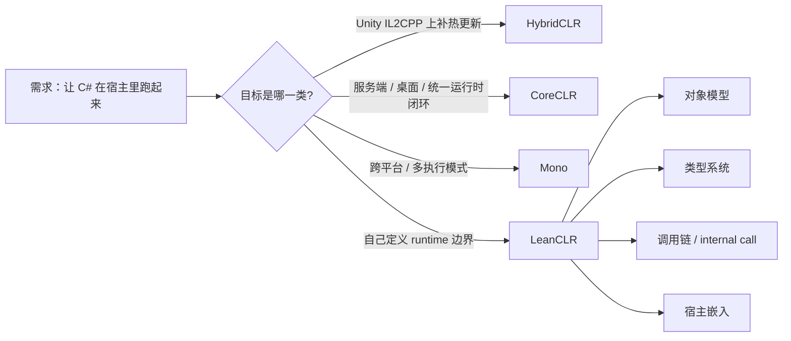

> LeanCLR 选择另一条路，不是为了“再造一个热更新方案”，而是为了把 C# runtime 从既有宿主里拆出来，变成一条可以独立嵌入、独立裁剪、独立演进的执行路线。

这篇是 `从 C# 到 CLR` 系列的第 16 篇，也是 LeanCLR 线的入口页。它只回答一个问题：**为什么有人会放弃“在现成 runtime 上补缝”的路线，转而自己搭一套 CLR**。  
对象模型、`RtObject`、`RtClass`、方法分派、类缓存、`internal call` 这些细节都不在本文展开；它们会在下游文章里单独讲。

> **本文不展开**
> - LeanCLR 对象模型的完整布局：`RtObject`、`RtClass`、`VTable`
> - LeanCLR 与 HybridCLR 的逐项对照
> - `runtime-cross` 系列里的横向取舍

## 一、先把边界定清楚

LeanCLR 不是“Unity 里又一个热更新插件”。  
如果你的问题是：**我已经站在 IL2CPP 上了，只想把增量代码补回来**，那你要先看 HybridCLR。LeanCLR 解决的不是同一个缺口。

LeanCLR 也不是“把 Mono 换个名字”。  
Mono、CoreCLR、IL2CPP、HybridCLR 都站在各自成熟的历史和宿主之上；LeanCLR 关心的是另一件事：**当 runtime 本身就是产品的一部分时，这套执行内核能不能归我自己定义**。

这就是它选择另一条路的原因。  
它不想继续沿着“借宿主、补能力、绕边界”的方式推进，而是想把 runtime 的关键责任收回来：

- 谁负责对象模型
- 谁负责类型系统
- 谁负责方法分派
- 谁负责宿主边界
- 谁负责桥接调用

一旦问题从“补缺口”变成“拿主权”，路线就会完全变掉。

## 二、为什么要另起一条路

LeanCLR 的价值，不在于“功能更多”，而在于它面对的是**没有现成答案**的场景。

### 1. 你的宿主不是 Unity

很多 C# 运行时讨论，默认前提都是 Unity。  
但真实项目里，宿主可能是 C++ 服务、嵌入式工具、研究型框架、H5 宿主，甚至是一个你自己掌控的产品壳。

这时，问题就不是“Unity 里怎么热更新”，而是：

- C# 代码怎么装进来
- 类型怎么被识别
- 方法怎么被调用
- 反射和泛型怎么落地
- 宿主和脚本怎么互相看见

LeanCLR 之所以有意义，是因为它把这些问题当成一等公民。  
它不是在既有 runtime 上做补丁，而是在问：**如果我不想依赖现成生态，能不能自己定义一条最短、最清楚的路径**。

### 2. 你的目标不是“补热更新”，而是“拿 runtime 主权”

HybridCLR 解决的是补洞。  
LeanCLR 解决的是建路。

这两个词看起来相近，工程语义完全不同：

- 补洞，默认你已经有一条主路
- 建路，默认你要自己决定路基、路宽和收费站

当 runtime 是产品能力的一部分时，主权问题会变得很现实。  
谁来定义对象布局，谁来决定分派规则，谁来承接 `internal call`，谁来做类缓存，这些都不是“实现细节”，而是后续所有能力的地基。

### 3. 你想要的是可嵌入，而不是可依附

LeanCLR 走得更轻，也更硬。  
它追求的不是“依附某个成熟引擎后还能跑”，而是“在更小的边界里也能闭环”。

这意味着它会主动把很多东西收进自己手里：

- 对象模型
- 类型系统
- 调用链
- 内建调用
- 分派缓存
- 宿主适配

这类选择不会让项目更省事。  
它只会让项目更像一个**真正的 runtime 工程**，而不是一个插件工程。

## 三、它到底换回了什么

LeanCLR 选择另一条路，换回来的主要有三样东西。

### 1. Runtime 主权

你不再只是 runtime 的使用者。  
你开始决定：

- 对象怎么摆在内存里
- 方法怎么定位
- 类怎么缓存
- 调用怎么跨边界

这类能力一旦收回来，后续扩展就不再受制于既有宿主的习惯和限制。

### 2. 更清晰的嵌入边界

LeanCLR 更像一个可以被嵌入的执行内核。  
它不是在某个生态里“额外跑起来”，而是努力把自己做成宿主可依赖的基础设施。

这对 C++ 宿主、工具链、研究型运行环境尤其重要。  
这些场景通常不缺一个能跑的解释器，缺的是一个**边界明确、责任清楚、可裁剪**的 runtime。

### 3. 更长的演进空间

当你把核心基础设施握在自己手里，未来的路线就不会被宿主平台提前锁死。  
你可以围绕自己的目标做取舍，而不是围绕别人的约束做妥协。

这也是 LeanCLR 最“值钱”的地方。  
它不是在某条老路上优化 10%，而是在争取一条可长期演进的新路。

## 四、它付出的代价也很硬

这条路不是“更高级”，只是“更难”。

### 1. 你要自己承担基础设施成本

runtime 最贵的从来不是一两个类，而是整套边界工作：

- 类型装载
- 反射
- 泛型
- 方法分派
- GC 交互
- 宿主桥接
- 调试与验证

LeanCLR 把主权收回来了，也就把这些账一起收回来了。  
换句话说，它减少的是外部依赖，不是工程总量。

### 2. 你要自己接受更长的成熟周期

HybridCLR 站在 IL2CPP 之上，很多问题可以借宿主生态的成熟度。  
LeanCLR 不这么干。它的边界更干净，但验证面更大，成熟周期也更长。

这不是缺点被美化成优点。  
这是路线选择本身的真实成本。

### 3. 你要自己对兼容性负责

一旦 runtime 不再依附成熟宿主，很多兼容性问题就不会自动消失：

- 泛型共享规则怎么定
- 值类型和引用类型怎么分派
- 宿主 ABI 怎么对接
- 反射和动态调用怎么保语义

这些不是“后面再补”的小问题。  
它们决定这条路能不能走通。

## 五、把几条路放到一张桌子上看

| 路线 | 核心目标 | 依赖谁 | 优势 | 代价 |
|---|---|---|---|---|
| CoreCLR | 成熟统一的 JIT runtime | 自己的 runtime 闭环 | 能力完整，生态成熟 | 更偏通用运行时，不是为嵌入主权而生 |
| Mono | 多执行模式和跨平台落地 | 自身 runtime + 宿主 | 灵活，适配面广 | 路径多，责任边界不如单线条清爽 |
| IL2CPP | 把 C# 转成 C++ 后原生落地 | Unity / IL2CPP 生态 | 平台落地稳定 | 动态能力收缩，边界更硬 |
| HybridCLR | 在 IL2CPP 上补热更新 | Unity / IL2CPP 生态 | 复用现成宿主，补动态能力 | 仍然绑定既有生态，不能改写整个边界 |
| LeanCLR | 自建可嵌入 CLR 路线 | 自己定义 runtime | 主权清楚，边界可裁剪 | 基础设施成本高，成熟周期长 |

这张表里，LeanCLR 和 HybridCLR 最容易被误看成同一类。  
其实它们一个在“现成路面上补洞”，一个在“自己铺路”。

## 六、别把它误读成“更激进的热更新”

这是本文最容易讲错的地方。

- **误读 1**：LeanCLR 只是更少依赖的热更新方案。  
  **真相**：它关注的是 runtime 主权，不是热更新技巧本身。

- **误读 2**：LeanCLR 只是把 `metadata`、解释器、桥接再拼一遍。  
  **真相**：这些只是它将来必须讲清楚的组成部分；它先要解决的是“为什么要自己铺路”。

- **误读 3**：LeanCLR 和 HybridCLR 的区别只是实现复杂度。  
  **真相**：两者的起点就不同。一个从既有 AOT 世界补能力，一个从可嵌入 runtime 的目标倒推架构。

如果不先把这层误读掰正，后面的源码阅读会很容易偏题。  
你会盯着目录名看，却看不见每个目录背后的因果链。

## 七、往下读的时候，顺序很重要

这篇不展开 `RtObject`、`RtClass`、`VTable`，也不展开 LeanCLR 和 HybridCLR 的逐项对照。  
你如果已经抓住“为什么要另起一条路”这个问题，下一步就该去看更具体的分叉点。

- 想看 LeanCLR 怎么把对象和类型真正落到内存结构里，去看 [LeanCLR 对象模型]()
- 想看 LeanCLR 和 HybridCLR 为什么会分叉成两条路线，去看 [LeanCLR vs HybridCLR]()
- 想看更广的 runtime 取舍地图，去看 [runtime-cross 系列索引]()

如果你想把这条线接回上一节，上一篇是 [CCLR-15｜为什么 HybridCLR 需要 metadata、解释器和 bridge]()，下一篇是 [CCLR-17｜同一组 C# 语义，在不同 runtime 里分别牺牲了什么]()。

## 小结

- LeanCLR 选择另一条路，不是因为它想做得更多，而是因为它想**自己定义 runtime 的边界和主权**。
- 它解决的是“没有现成宿主可借时，C# 怎么独立嵌入并闭环”的问题，不是 Unity 热更新补洞问题。
- 它付出的代价也很明确：更高的基础设施成本、更长的成熟周期、更多自己承担的兼容性责任。

## 系列位置

- 上一篇：[CCLR-15｜为什么 HybridCLR 需要 metadata、解释器和 bridge]()
- 下一篇：[CCLR-17｜同一组 C# 语义，在不同 runtime 里分别牺牲了什么]()
- 向下导流：[runtime-cross 系列索引]()

> 本文是 LeanCLR 线的入口页，只回答“为什么选另一条路”。对象模型、方法分派、桥接规则和泛型细节，留给后续文章单独展开。

