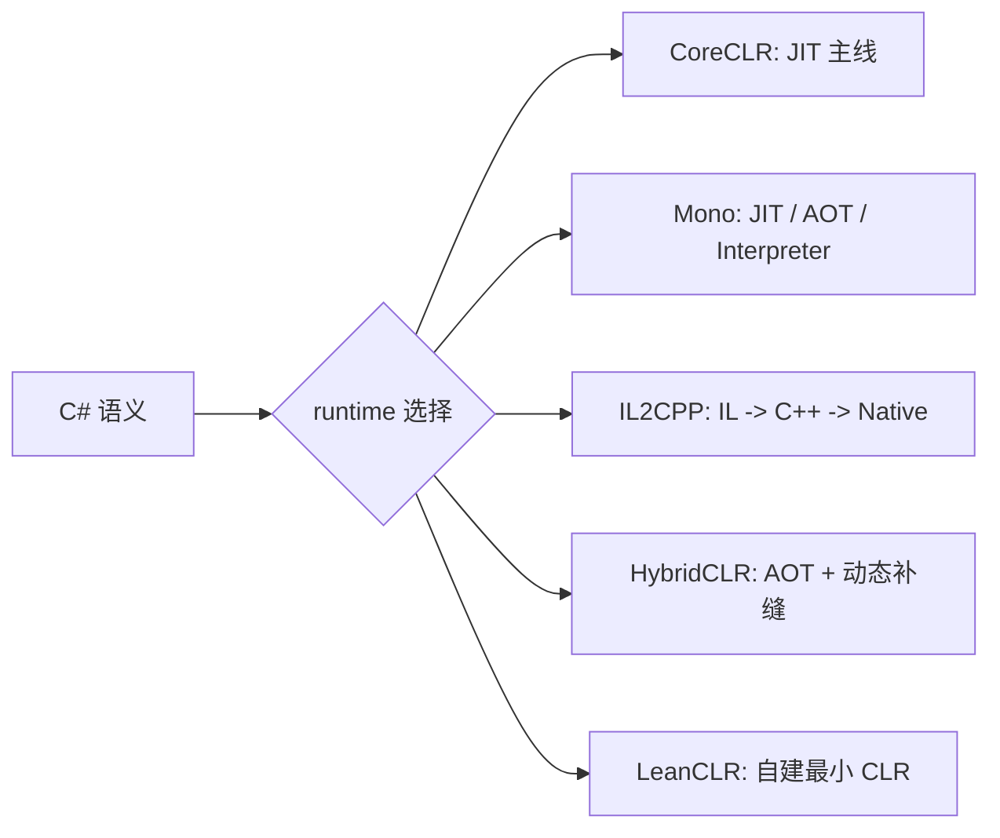

---
title: "CCLR-17｜同一组 C# 语义，在不同 runtime 里分别牺牲了什么"
slug: "cclr-17-tradeoffs-across-runtimes"
date: "2026-04-19"
description: "把同一段 C# 放进 CoreCLR、Mono、IL2CPP、HybridCLR 和 LeanCLR 里看，真正的差别不是谁更快，而是谁把成本放在首调、构建、运行时、宿主边界和维护责任上。"
tags:
  - "C#"
  - "CLR"
  - "CCLR"
  - "Comparison"
  - "Runtime"
series: "从 C# 到 CLR"
series_id: "csharp-to-clr"
weight: 1817
---

> 没有“最强 runtime”，只有“把代价放对位置的 runtime”。

这篇是 `从 C# 到 CLR` 系列的收束页，但它不重写 `runtime-cross G1~G9`。它只做一件事：把同一组 C# 语义放进不同执行模型里，看清楚每条路到底牺牲了什么、换回了什么，以及这些成本为什么会落在不同时间点。

先看一个最小样例：

```csharp
public static class ScriptEntry
{
    public static int Add(int a, int b) => a + b;
}
```

这段代码在源代码层没有差别。它放在这里不是为了比较算法，而是为了提供一份统一样本：我们只观察不同 runtime 把哪一笔成本放到了哪个阶段。runtime 的分叉，发生在“这段代码什么时候被解释、什么时候被编译、什么时候能被热替换、什么时候必须提前准备好答案”这些问题上。换句话说，**语义是同一份，账单却分散到了不同阶段**。



## 一、先把“代价”拆开，不要先比快慢

读 runtime 文章，最容易犯的错是先问“谁最快”。这会把讨论压扁成排行榜，最后只剩性能印象，没有工程判断。

真正该拆的是四类成本：

- **首调成本**：第一次调用要不要先编译、先装载、先准备元数据。
- **构建成本**：是不是把一部分工作提前搬到构建期，换掉运行时灵活性。
- **维护成本**：宿主、桥接、泛型、反射、热更新、调试这些责任落在哪一层。
- **边界成本**：runtime 依赖外部宿主，还是 runtime 自己就能闭环。

只要把这四项分清，你就会发现：CoreCLR、Mono、IL2CPP、HybridCLR、LeanCLR 并不是同一维度上的五个分数，而是五种不同的“账单分摊方式”。

## 二、再看对象模型和类型系统借了多少现成基础

CoreCLR 和 Mono 的优势，是它们都站在成熟 runtime 的对象模型上。类型系统、对象布局、GC、反射、虚调用、泛型这些基础设施都已经是“现成的桌子”。你写 C# 时，很多能力默认可用，只是 runtime 在背后做了更多工作。

IL2CPP 走另一条路。它不是把运行时的能力原封不动搬过去，而是把 C# 的一部分语义翻译成 C++，让原生编译器和平台工具链接手。这样做的直接好处，是平台落地更稳定；直接代价，是动态能力会被压缩，很多答案必须更早准备好。

HybridCLR 站在 IL2CPP 上补洞，说明它并不满足于“能跑”。它要解决的是：**在 AOT 世界里，怎么让热更新代码继续被 runtime 看到、理解并执行**。因此它最关心的不是再造一套完整 runtime，而是把 metadata、解释器和 bridge 补齐，让增量代码能顺着既有生态继续跑。

LeanCLR 则更进一步。它不是去借现成 runtime 的桌子，而是自己搭一张桌子。这样做的意义很直接：当你的目标不是 Unity 生态里的补缝，而是一个可独立嵌入的 CLR 路线时，你就不再愿意为别人的宿主约束长期买单。

## 三、把 runtime 的分叉点缩成五句

### 1. CoreCLR：把成本压在 JIT 和优化闭环里

CoreCLR 的思路是：先把语义和优化统一起来，再用 JIT 把执行成本摊开。它牺牲的不是功能，而是“必须提前把一切都决定好”的冲动。你得到的是成熟的运行时闭环，代价是对动态执行和宿主整合要遵守它的规则。

### 2. Mono：把灵活性留在前面，把选择权留给宿主

Mono 能同时保留 JIT、AOT、解释器和混合模式，这让它在嵌入式、跨平台、历史包袱较重的场景里特别稳。它的代价是：你得接受 runtime 自己也在做更多选择，架构上没有单线条那么干净，但换来的是更广的落地面。

### 3. IL2CPP：把运行时的一部分压力前移到构建期

IL2CPP 的本质不是“把 C# 变成 C++ 所以更快”，而是“把很多 runtime 该做的工作提前放到构建期”。这样，平台限制、AOT 约束、原生调试链路都更可控；但热更新、动态装载、即席生成这类能力就会被收紧。

### 4. HybridCLR：在现成 AOT 之上补一层可执行性

HybridCLR 不是第四种完全独立的 runtime，它是在 IL2CPP 的边界里补动态能力。它牺牲的是纯净性：你要接受桥接、metadata 适配和解释器介入；换回来的，是 Unity 生态里已经被大量验证过的热更新路径。

### 5. LeanCLR：把“runtime 主权”拿回到自己手里

LeanCLR 的价值不在于“又多一套 runtime”，而在于它敢于重新定义对象模型、类型系统、internal call 和分派规则。你牺牲的是一整套现成基础设施；换回来的，是可嵌入、可裁剪、可独立演进的 runtime 主权。

## 四、直觉 vs 真相

- **直觉**：runtime 选型就是性能选型。
- **真相**：runtime 选型首先是成本位置的选型，性能只是其中一个结果。

- **直觉**：IL2CPP 只是“更像原生代码”。
- **真相**：IL2CPP 的核心是把一部分 runtime 压力前移到构建期，换稳定性和平台落地。

- **直觉**：HybridCLR 和 LeanCLR 都是在做热更新。
- **真相**：HybridCLR 是在既有 AOT 上补洞，LeanCLR 是重新铺路；它们解决的约束不是同一组。

- **直觉**：Mono、CoreCLR、IL2CPP 只是实现风格不同。
- **真相**：它们把语义、优化、装载、调度、边界的责任放在了不同层级。

## 五、到底该怎么选

这不是一个“谁更强”的问题，而是一个“你想把哪笔账放在哪一栏”的问题。

- 如果你在 **服务端 / 桌面 / 工具链** 里，优先关心 JIT、成熟类型系统和统一运行时闭环，CoreCLR 往往是更自然的参照。
- 如果你在 **Unity 生态** 里，优先关心 AOT 落地、平台约束和热更新可行性，IL2CPP、HybridCLR 这条线更值得看。
- 如果你在 **非 Unity、可嵌入、要自己掌控 runtime 边界** 的场景里，LeanCLR 这种路线会更像你的问题答案。
- 如果你只是想先把整张地图看清楚，不要在这篇里继续追源码细节，直接去 `runtime-cross` 系列索引最划算。

你可以把这篇理解成入口页：它不替你做横向总表，也不替你重讲各条路内部的实现。它只负责把“代价归属”讲清楚，让你后面再去看每条路线时，不会把同一个问题问错层。

## 六、往下再走一步：去看 runtime-cross 系列索引

如果你想把这篇里提到的 trade-off 拆成可比较的章节，下一步直接看：

- [runtime-cross 系列索引]()
- [CCLR-16｜从零到 CLR：LeanCLR 为什么选择另一条路]()
- [CCLR-15｜为什么 HybridCLR 需要 metadata、解释器和 bridge]()

这三篇连起来看，顺序最好是：先看这篇收边界，再看 LeanCLR 和 HybridCLR 的分叉，最后进 runtime-cross 总索引。

## 小结

- 同一组 C# 语义，在不同 runtime 里并不是“快慢不同”，而是**代价被放在了不同时间点**。
- CoreCLR、Mono、IL2CPP、HybridCLR、LeanCLR 的差异，本质是执行模型和责任边界的差异。
- 先看 trade-off，再看实现细节，读 runtime 文会更稳，也更不容易把局部结论当成全局结论。

## 系列位置

- 上一篇：[CCLR-16｜从零到 CLR：LeanCLR 为什么选择另一条路]()
- 向下导流：[runtime-cross 系列索引]()
- 向旁对照：[CCLR-15｜为什么 HybridCLR 需要 metadata、解释器和 bridge]()

> 本文是 CCLR 的收束入口，不是 runtime-cross 的重复稿。继续往下读时，直接进入 runtime-cross 系列索引即可。

