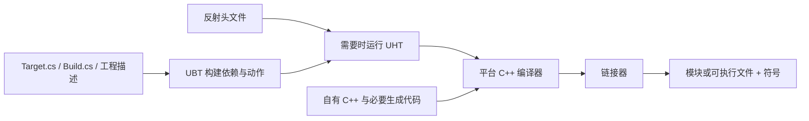

你改了一行 C++，编辑器里的方块转起来了；把工程交给别人，他却打不开。再发一个 exe，他仍然缺资源。问题常常不在旋转算法，而在你还没区分“工程输入”“编辑器加载的模块”和“独立运行的游戏包”。

这一课建立 **TwinArena** 的工程地图。先创建最小 C++ 工程，找到谁决定构建什么，再完成一次正常 Editor Target 编译。下半篇的打包步骤，在 [下一课旋转 Actor]() 完成地图后回来执行；三篇始终使用同一个 TwinArena。

这是 **UFS-03 子课 A**，对应 M0-T01/T03/T05，并给 T06 的符号和 T08 的重复构建准备身份信息。前置是 [普通 C++ 的编译、链接和所有权练习]()。不需要先理解整个 Gameplay Framework，也不要求 Linux DS、GAS 或大型样例。

> 版本边界：安装目标是用户选定的 **UE 5.8.2**，不表示已经安装或验证。2026-09-22 查阅的 Epic 页面标题显示 **Unreal Engine 5.8 Documentation**；没有据此声称核实了 5.8.2 patch 的全部差异。本课未在 UE 中创建工程、编译或打包，步骤与预期供实际执行时验证。

## 1. 开始前，先记录一套真实环境

Windows 本课采用官方二进制引擎支持的工具链。5.8 的 VS 兼容表列 **VS 2022 17.14+ / VS 2026 18.0+**，常规开发推荐 VS 2026；另列 MSVC 最低 14.38、推荐 14.50，Windows SDK 最低 10.0.22621.0、推荐 10.0.26100 或更新版本。这里优先按推荐组合准备，再让**实际 5.8.2 的 UBT 日志**确认选中了什么；不能把这些最低值任意拼成已经验证的组合。[Epic：Setting Up Visual Studio](https://dev.epicgames.com/documentation/unreal-engine/setting-up-visual-studio-development-environment-for-cplusplus-projects-in-unreal-engine)

该页较下方组件说明仍有较旧的 SDK 下限文字，本文采用顶部兼容表的 5.8 要求，不照搬旧 5.7 表。具体 patch 若拒绝某编译器，以该构建诊断、发布说明与实际工具链约束继续核查，先记阻塞，不猜“改一个版本号就行”。

在自己的环境记录中填写：

| 要记录的输入 | 到哪里确认 | 不能拿什么代替 |
| --- | --- | --- |
| UE 来源、完整版本与安装目录 | Launcher/编辑器 About；`Engine/Build/Build.version`；启动日志 | `.uproject` 的 `EngineAssociation` 往往只是关联标识，不是 patch 证明 |
| VS、MSVC、Windows SDK | VS About/Installer 的 C++ 桌面与游戏开发组件；首次 UBT 输出的实际编译器/SDK | 第一篇的 GCC 成功不代表 UE Windows 工具链通过 |
| Windows、内存、显卡驱动和磁盘空间 | 本机系统信息；实践盘、缓存盘、产物盘的可用空间 | 不用别人机器的构建耗时当本机预算 |
| 工程与产物绝对路径 | 自选短、可写的本地路径，确认不会覆盖已有工程 | 本文示例路径不是已创建目录 |
| 源码/版本管理 | 自己可追溯的 revision，或有文件清单的输入快照 | Launcher 发行版不能编一个引擎 Git SHA |

需要安装组件时由本人按选定组合安装。本文没有代你下载安装 UE、Visual Studio、素材或源码。M0 可以先使用合法二进制发行版；M1 的 Linux Dedicated Server 工具链、源码访问与构建条件另验。

## 2. 创建 TwinArena，只选择本课需要的内容

1. 打开目标引擎的 Project Browser，选择 **Games → Blank → C++**。项目名填 **TwinArena**；目标平台选 Desktop，使用较低的画质预设也可以。本课不需要 Ray Tracing；若界面提供 Starter Content 开关，关闭它。
2. 选择自己的实践位置，例如 `E:\UEPractice\TwinArena`。这是示例，不要放入这个 Hugo 站点的 `content/`，也不要覆盖同名旧工程。点击 Create，保存生成日志。
3. 若缺编译器/SDK、首次构建失败，保留第一个真实错误，先回第 1 节处理环境。不要把失败弹窗关闭后继续当作工程已建好。
4. 成功打开后查看项目名；保存所有内容，关闭编辑器。第一次先建立“关编辑器→正常编译→重新打开”的基线，不把 Live Coding 成功当本课构建回执。

Project Browser 的标签或摆放可能随 patch/语言不同；关键选择是 **C++、Blank、TwinArena、Windows 桌面、无大型素材依赖**。生成模板中若已有 GameMode 等文件，先保留，不要求把目录删成下面一模一样。

## 3. 目录地图：能再生成，不等于可以随便扔掉

| 位置 | 谁负责、保存什么 | 本课怎样处理 |
| --- | --- | --- |
| `TwinArena.uproject` | 工程描述：引擎关联、模块、插件等 | 与源码一起留存，别只交 `.sln` |
| `Source/` | 自有 C++、模块与 Target 构建规则 | 版本化输入；下一课在这里放 Actor |
| `Config/` | 项目配置，例如默认地图、打包设置 | 留意编辑器操作是否写入并保存了配置 |
| `Content/` | 地图、蓝图、材质、网格等资产 | 必需输入；`.uasset/.umap` 不能只靠 C++ 重新生成 |
| `Plugins/` | 项目本地插件；工程也可能引用引擎插件 | 本课不添加第三方插件，仍记录现有启用项与版本 |
| `Binaries/` | 编译后的模块、可执行文件及相关产物 | 能构建再生，但同次包与符号要归档；不能只靠文件夹名识别版本 |
| `Intermediate/` | UHT 生成代码、目标文件、构建中间信息等 | 不是手写源码；不要改这里的 generated 文件 |
| `Saved/` | 日志、自动保存、Cook/Stage 等工作产物 | **先保留日志、Autosaves 和故障证据**；不是笼统“都没用”的目录 |
| DDC / Derived Data Cache | 从资产等输入派生的缓存，位置可能在项目外、共享位置或服务中 | 记录实际配置；不要假定清空项目下一个目录就清空了所有缓存 |
| `.sln` / IDE 工程文件 | 开发工具的工程视图与构建入口 | 可以重生成；不是 UBT 的完整构建真相 |

从 Unity 迁移时，可以借助“源码/资产/配置/派生产物”的分层直觉，但别把 DDC 与 Library、UObject 与 C# 引用机械一对一映射。UE 模块还涉及显式依赖、目标规则和本地链接边界。

## 4. 模块与 Target：编进什么，组合成什么程序

**模块**组织一组代码及其依赖；**Target**选择要构建的程序种类、配置与模块集合。它们都不是某个 `.cpp` 文件的别名。

本课采用一个 Runtime 模块 `TwinArena`。下图是教学中统一使用的组织方式，下一课创建 Actor 时选择 Public 路径；模板可能把最初的模块文件直接放在模块根目录，这对不被其他模块引用的主游戏模块可以成立，先辨认再移动。[Epic：Modules](https://dev.epicgames.com/documentation/unreal-engine/unreal-engine-modules)

```text
TwinArena/
  TwinArena.uproject
  Source/
    TwinArena.Target.cs
    TwinArenaEditor.Target.cs
    TwinArena/
      TwinArena.Build.cs
      Public/
        TwinArena.h
        RotatingActor.h       # 下一课新增
      Private/
        TwinArena.cpp
        RotatingActor.cpp     # 下一课新增
```

`Public/Private` 是模块头文件可见性与组织约定，跟类里的 `public:/private:` 访问控制不是一回事。模块的 Public 接口用到某依赖时，应让依赖关系传到使用者；仅在实现中使用的依赖通常留在 Private。头文件前置声明可以减少不必要包含，但不能替代编译/链接依赖。

### 对照 `.uproject` 中的模块声明

打开现有 `TwinArena.uproject`，找到 `Modules`。下面是完整的**模块字段片段**，用于对照，不是让你删掉其他 JSON 字段后覆盖整个工程描述：

```json
"Modules": [
  {
    "Name": "TwinArena",
    "Type": "Runtime",
    "LoadingPhase": "Default"
  }
]
```

模块名应与 `Source/TwinArena/`、Build.cs 类名一致。`Runtime` 表示游戏运行时模块；编辑器扩展通常放 Editor 模块。本课代码不依赖 `UnrealEd`，不要为了某个编辑器函数把它随意加进 Runtime 模块，否则很容易出现 Editor 能编译、Game 包失败的差异。

### `Source/TwinArena/TwinArena.Build.cs`

以下为本课最小模块规则完整文件。Blank 模板可能额外列出 InputCore/EnhancedInput；若生成代码确实使用它们就保留，不能不看引用就删除。下面的旋转 Actor 本身只需要这三个模块。

```csharp
using UnrealBuildTool;

public class TwinArena : ModuleRules
{
    public TwinArena(ReadOnlyTargetRules Target) : base(Target)
    {
        PCHUsage = PCHUsageMode.UseExplicitOrSharedPCHs;
        PublicDependencyModuleNames.AddRange(new string[]
        {
            "Core", "CoreUObject", "Engine"
        });
    }
}
```

Build.cs 的确用 **C#** 写，但它是供 UBT 读取的构建规则，不表示 TwinArena 的玩法正在用 C# 执行。Core 提供基础类型；CoreUObject 对应对象/反射基础；Engine 提供 Actor、组件等。本课的公开 Actor 头文件继承 AActor，因此使用 Public 依赖是有具体原因的。

### 两个 Target 完整示例

`Source/TwinArena.Target.cs`：

```csharp
using UnrealBuildTool;

public class TwinArenaTarget : TargetRules
{
    public TwinArenaTarget(TargetInfo Target) : base(Target)
    {
        Type = TargetType.Game;
        DefaultBuildSettings = BuildSettingsVersion.Latest;
        IncludeOrderVersion = EngineIncludeOrderVersion.Latest;
        ExtraModuleNames.Add("TwinArena");
    }
}
```

`Source/TwinArenaEditor.Target.cs`：

```csharp
using UnrealBuildTool;

public class TwinArenaEditorTarget : TargetRules
{
    public TwinArenaEditorTarget(TargetInfo Target) : base(Target)
    {
        Type = TargetType.Editor;
        DefaultBuildSettings = BuildSettingsVersion.Latest;
        IncludeOrderVersion = EngineIncludeOrderVersion.Latest;
        ExtraModuleNames.Add("TwinArena");
    }
}
```

这两份示例的 `Latest` 指**当前选定引擎内部**的规则默认值，不会替你下载最新版。若 5.8.2 生成的文件已经给出了明确的 `BuildSettingsVersion` / `EngineIncludeOrderVersion` 枚举，实际工程保留生成值并记录它，不必为了照抄而换成 Latest。升级引擎时 Latest 也可能改变行为，不能作为跨版本锁定手段。[Epic：Target Rules](https://dev.epicgames.com/documentation/unreal-engine/unreal-engine-build-tool-target-reference)

Game 生成独立游戏目标，不等于联网架构里的专用 Client Target。Editor 用于编辑器加载游戏代码；Server 是未来 Dedicated Server 的目标类型，本课不创建它，也不从 Windows Game 成功推断 Linux Server 可用。

### 模块入口的两个完整文件

`Source/TwinArena/Public/TwinArena.h`：

```cpp
#pragma once

#include "CoreMinimal.h"
```

`Source/TwinArena/Private/TwinArena.cpp`：

```cpp
#include "TwinArena.h"
#include "Modules/ModuleManager.h"

IMPLEMENT_PRIMARY_GAME_MODULE(FDefaultGameModuleImpl, TwinArena, "TwinArena");
```

这是已有主游戏模块的入口，不要在模块根目录还留一份重复的宏实现。若原文件就在根目录，最省事的方式是原位保留；本课树形图不是强制迁移任务。

下一课类声明中的 `TWINARENA_API` 来自模块的导出/导入宏。模块式构建时它可能展开成平台符号导出/导入声明；单体链接时可能为空。**模块不是在所有目标里都等于一个 DLL**。[Epic：Module API Specifiers](https://dev.epicgames.com/documentation/unreal-engine/module-api-specifiers-in-unreal-engine)

## 5. 编译地图：UBT 调度，UHT 生成，编译器与链接器做各自的工作



UBT 根据目标、模块和平台组织构建。涉及反射的头文件由 UHT 解析、产生配套代码，随后由真正的 C++ 编译器处理，再链接为目标产物。你不手写 `.generated.h`，也不靠 IDE 红线生成它。[Epic：Unreal Header Tool](https://dev.epicgames.com/documentation/unreal-engine/unreal-header-tool-for-unreal-engine)

这是职责图，不是保证每次点击 Build 都重跑全部节点。增量、缓存、已有 UHT 产物和输入变化会影响实际动作；不要声称 UBT 每次一定“先生成 MSBuild/Ninja，再 UHT，再全量编译”。也不要把 IDE 是否显示某文件，等同于 UBT 是否发现了正确模块。

> 旧文使用提醒：本站 [UE 模块系统]() 中“每个模块是 DLL”及固定式 UBT 流程措辞需要按目标与增量行为限定。本课登记此差异，采用上面的职责边界；未修改旧文，也未声称审计过整个引擎构建源码。

### 正常编译一次 Editor Target

1. 保存工程并**关闭 Unreal Editor**，确认没有它正在进行的 Live Coding 构建。
2. 在资源管理器右键 `.uproject` → Generate Visual Studio project files；Windows 11 可能需要“显示更多选项”。若关联菜单不可用，先修复引擎关联，或使用编辑器的 IDE 工程刷新入口，不要改 `.sln` 来假装补模块。
3. 打开生成的解决方案，选择 **Development Editor / Win64**，把 TwinArena 设为启动项目。右键构建 TwinArena 项目即可，不需要对整套引擎执行 Rebuild All。
4. 看 **Output → Build** 中第一处真实错误和最终退出结果，记录实际编译器、SDK、Target、配置。IDE Error List 的级联红线不一定是首因。
5. 成功后重新打开 `.uproject`。只完成本篇前半时，还没有下一课的自有旋转行为，这是正常的。

也可在 PowerShell 用同一目标的命令行入口，先把两处路径换成自己的真实绝对路径：

```powershell
$ueRoot = 'C:\Program Files\Epic Games\UE_5.8'
$projectFile = 'E:\UEPractice\TwinArena\TwinArena.uproject'
$buildScript = Join-Path $ueRoot 'Engine\Build\BatchFiles\Build.bat'
if (!(Test-Path -LiteralPath $buildScript)) { throw 'Check UE path' }
if (!(Test-Path -LiteralPath $projectFile)) { throw 'Check project path' }
& $buildScript TwinArenaEditor Win64 Development "-Project=$projectFile" -WaitMutex
if ($LASTEXITCODE -ne 0) { throw 'Editor target build failed' }
```

安装目录写着 `UE_5.8` 不证明 patch；仍要读版本文件。命令未在本文环境执行，实际日志才是接受它的依据。

### Development、DebugGame、Live Coding 分别能说明什么

| 选择 | 适合此时做什么 | 需要防止的误判 |
| --- | --- | --- |
| Development Editor | 正常构建并打开编辑器的基线 | 优化会影响局部变量与单步，不是所有语句都能逐行观察 |
| DebugGame Editor | 更方便调试自有游戏代码，引擎仍通常是优化构建 | 不等于完整引擎 Debug；使用对应配置启动，必要时带 `-debug` |
| Development Game | 本课 Windows 独立包 | 是否有可用 PDB 要实际检查，不由 Development 这个名字保证 |
| Live Coding | 编辑期间快速反馈部分修改 | 不是完整 Build/Cook/Package，也不能证明关闭编辑器后产物可用 |

配置与 Target 是两维；Development 也能调试，但变量可能被优化。选 DebugGame 后要构建并运行对应产物，而不是继续附加旧 Development 进程。[Epic：Build Configurations](https://dev.epicgames.com/documentation/unreal-engine/build-configurations-reference-for-unreal-engine)

第一次学反射字段、构造默认值和蓝图类时，使用“保存→关编辑器→正常构建→重开”的基线更容易识别问题。后面熟悉 Live Coding 的对象重实例化边界后，再决定何时使用。

## 6. 现在先去做 Actor，再回来打同一个工程

到这里先完成 [旋转 Actor 的代码、蓝图、地图和断点]()。它会产出 `BP_RotatingActor` 与 `/Game/Maps/M0_Rotation`，不另建新项目。下面按这两个名字继续。

### Build、Cook、Stage、Package 在解决不同问题

| 阶段 | 本课输入→输出 | 常见故障方向 |
| --- | --- | --- |
| Build | C++/规则→Windows 代码产物 | 编译、反射、链接、SDK、错误 Target |
| Cook | 需要的地图与资产→目标平台可加载的数据 | 地图没纳入、引用缺失、资产/Shader 问题 |
| Stage | 代码、Cook 数据与运行依赖→待分发目录 | 文件没被复制、运行依赖缺少 |
| Package | 按平台规则组织分发产物 | 打包配置、输出/权限、平台步骤失败 |

Windows 的最终交付可能是目录结构，内容也可能使用 Pak/IoStore；不是所有平台都产生“单个安装包文件”。编辑器里的 Package Project 会编排多个阶段，日志可能复用已有产物；读实际日志，不把按钮名当成每一步都全量执行的证据。[Epic：Packaging Projects](https://dev.epicgames.com/documentation/unreal-engine/packaging-your-project)

### 设置地图与 Development 包

1. 在 TwinArena 保存 `M0_Rotation` 和蓝图，选择 **Edit → Project Settings → Maps & Modes**，把 **Game Default Map** 设成 `M0_Rotation`；Editor Startup Map 也可设同图，但它不能代替 Game Default Map。
2. 在 **Project → Packaging** 查找 **Build Configuration**，本课选择 Development；查找 **Include Debug Files** 并启用。第一份验收包启用 **Full Rebuild**，保存设置。它不是清空所有缓存的命令，也不证明已经全量重新 Cook。
3. 在 Packaging 的高级项查找 **List of maps to include in a packaged build**，加入 `/Game/Maps/M0_Rotation`。这里填写资产路径，不是磁盘 `Content/...umap`。本课不使用全量 Cook 项目中所有地图来掩盖缺失配置。
4. 先在下一课 `.cpp` 中把 `TutorialBuildId` 定为此次唯一值，例如 `m0-local-001`；保存代码、地图、配置并记录输入 revision/快照。构建期间不再改这些输入。
5. 工具栏 **Platforms → Windows**，确认 Binary Configuration 使用项目的 Development 设置，然后 **Package Project**，选择一个本次独有的输出目录，例如 `E:\UEArtifacts\m0-local-001\Package`。界面如显示 Use Project Setting，要确认括号里正是 Development。
6. 保存完整 Output Log。失败时找第一处实质错误，处理后换新的 build_id/输出目录重试；已有旧 exe 不能作为这次成功的证据。成功提示之后，再去输出目录确认文件。

如果包装后打开黑屏或默认地图不对，先核对 **Game Default Map、地图是否保存、Cook 日志、实际启动的包**，而不是立刻改旋转算法。缺网格则沿“蓝图组件实际资产→地图引用→Cook/包中资源”检查。

### 独立启动与最小身份记录

关闭编辑器。保留**整个 Package 目录**，不要只复制顶层 exe。打开该包的 `TwinArena.exe`；根启动器可能再启动 `TwinArena/Binaries/Win64/` 下的实际游戏程序，调试时要识别后者的进程。

在包根目录打开 PowerShell，以本次新的 run_id 启动：

```powershell
$runId = 'run-001'
& '.\TwinArena.exe' -log -windowed -ResX=1280 -ResY=720 "-M0RunId=$runId"
```

第三篇代码会解析 M0RunId 并在 `M0Begin` 日志中记录它与编译进去的 build_id。命令行 run_id 只是一次运行的标签，不证明包的构建身份；二者不能混用。第一次在新进程看到几何体后，还要记录实际 exe 路径、进程 PID、原始日志来源与退出情况。

在**已经成功生成的包根**另存 UTF-8 `build-identity.txt`，内容填写真实值：

```text
build_id=m0-local-001
project_revision=填写实际提交或输入快照标识
engine_build=填写实际5.8.2发行构建或源码revision
target=TwinArena
platform=Win64
configuration=Development
map=/Game/Maps/M0_Rotation
```

这是随包保存的身份小文件，不是证明自己正确的魔法文件。必须与启动日志中的编译常量一致，再用外部校验清单绑定产物。字段仍有“填写”字样时，只是模板，不能验收。

下面脚本在**产物目录**执行，哈希清单放在 Package 外，避免把自己纳入自己。改为你的实际路径，它不会清理目录：

```powershell
$packageRoot = (Resolve-Path -LiteralPath 'E:\UEArtifacts\m0-local-001\Package').Path
$receiptFile = 'E:\UEArtifacts\m0-local-001\package-sha256.csv'
Get-ChildItem -LiteralPath $packageRoot -Recurse -File |
    Sort-Object FullName |
    ForEach-Object {
        [PSCustomObject]@{
            RelativePath = $_.FullName.Substring($packageRoot.Length).TrimStart('\')
            SHA256 = (Get-FileHash -LiteralPath $_.FullName -Algorithm SHA256).Hash
        }
    } | Export-Csv -LiteralPath $receiptFile -NoTypeInformation -Encoding UTF8
```

更稳妥的顺序是：包成功→写身份文件→哈希归档→复制一份运行副本→运行副本产生日志。若你已经在原包运行过，分开记录后来生成的日志，不要把它们误当构建输入。PDB 若没有随包复制，另行保留同次构建的原始 PDB 及哈希；**符号是否匹配还要由调试器验证**。

最小回执另记编译器/SDK、构建命令或界面设置、构建日志、地图/蓝图输入、包和符号清单、每次 run_id/启动命令/原始运行日志、断点模块/PDB 截图。每次改变代码或配置都重新建 build_id；相同输入的第二次构建也用新 ID，保留比较记录，不要求二进制逐字节相同。

## 7. 故障练习：给缺少的模块起错名字

先留好正确基线。关闭编辑器，在 `TwinArena.Build.cs` 的依赖数组里临时加入不存在的 `DefinitelyMissingM0Module`，然后正常构建 **TwinArenaEditor Win64 Development**。

预测：失败应发生在构建规则/模块依赖解析阶段，未必走到自有 C++ 编译，更不可能由 Cook 修好。查看首个相关错误：它指向哪个模块名、哪个规则输入？不要期待每台机器有同一个错误号。

移除这一项，正常构建并重开工程。记录修复前后的首错、退出状态与 Target。此实验的成功标准是“能从构建入口定位到错误依赖并恢复”，不是“通过删 Binaries/Intermediate/Saved 碰巧变好”。

| 现象 | 首先查什么 |
| --- | --- |
| IDE 报 generated.h 不存在 | 先看真正 UBT/UHT 是否成功，类/文件名是否一致；不手建空 generated.h |
| Editor 能打开、Game 打包失败 | Runtime 是否误依赖 Editor 模块；Game Target、资源 Cook、配置是否不同 |
| 代码改了却像没生效 | 启动的工程/进程路径、Target、构建结果；下一课的 BP/实例覆盖值 |
| 断点空心 | 是否实际加载了自有模块，同次 PDB 是否匹配，源码是否来自该输入快照 |
| 包能开但没有本课行为 | 地图、Actor 实例、资源与实际包身份，不只盯编译成功提示 |

## 8. 验收与下一课的分工

- [ ] 指着自己的目录解释哪些是输入、哪些能再生、哪些日志/自动保存必须保留。
- [ ] 找到一个 Runtime 模块、两个 Target，并解释 Build.cs 的 C# 在何时执行。
- [ ] 完成一次关闭编辑器后的正常 Editor 构建，保留真实工具链与首错/成功记录。
- [ ] 故意写错模块依赖并恢复，不以 Live Coding 代替正常构建。
- [ ] 下一课完成后回来，把同一个地图打成 Development Windows 包，在新进程运行。
- [ ] 同时留下包、PDB、源码/配置身份、build_id/run_id 与日志；这一步仍不代表全部 M0 验收通过。

自测问题：

1. 删掉 `.sln` 是否丢失项目全部构建定义？**不是。** 工程描述、Target/Module 规则、源码/配置/资产才是需要辨认的输入；IDE 文件可重生成。
2. `TwinArenaEditor` 构建成功能否证明 Windows Game 或 Linux DS 成功？**不能。** 目标、平台和资源处理步骤不同。
3. 为什么已经有 Include Debug Files 开关仍要看 Modules？**开关表达意图；实际加载的模块、PDB 与源码是否匹配才是调试证据。**

AI 可以逐项解释你的目录树、把构建日志按规则/UHT/编译/链接/Cook 分类，并针对第一处错误提出检查顺序。给它脱敏后的真实版本和日志；不要让它凭“UE5”猜工具链，也不要把它生成的 Build.cs 不加检查地覆盖模板。本人需要在日志里找到实际目标和工具链，并说清包为什么包含地图。

本文已经提供完整正文与最小规则文件，并核对上述官方 5.8 文档；**UE 5.8.2 创建工程、正常构建、故障注入、打包、独立运行和 PDB 匹配均待实际验证**。这不是对用户环境或学习能力的通过声明。回到 [旋转 Actor]() 继续同一条操作链。
