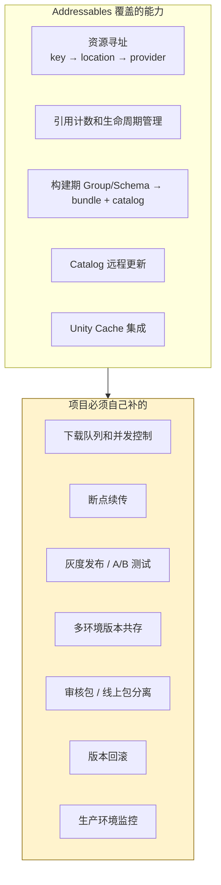
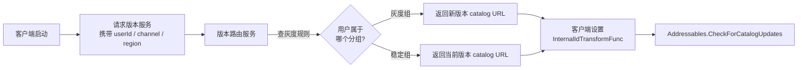
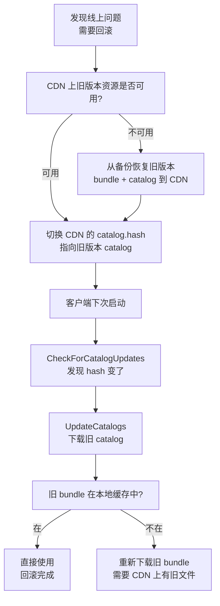

前四篇把 Addressables 从运行时到构建期完整拆了一遍：[Addr-01]() 拆运行时链路，[Addr-02]() 拆 Catalog 编码和更新，[Addr-03]() 拆引用计数和生命周期，[Addr-04]() 拆构建期从 Group Schema 到 bundle 产物。

到这里，Addressables 的内部机制已经足够清楚了。这一篇要换一个视角：

`Addressables 的能力边界在哪里？项目进入生产阶段后，哪些基础设施必须自己建？`

这不是一篇批评文章。Addressables 在 AssetBundle 之上提供了一套完整的寻址、加载、引用计数和更新抽象——前四篇已经看到这套抽象的质量。但它是一个框架，不是一个完整的资源交付系统。框架和交付系统之间的差距，就是项目必须自己补的东西。

> **版本基线：** 本文源码分析基于 Addressables 1.21.x（com.unity.addressables）。Unity 6 随附的 Addressables 2.x 差异之处会以注记标出。

## 一、为什么要谈边界

大多数项目在开发阶段不会碰到 Addressables 的边界。Editor 里用 `Use Asset Database` 模式加载快、不走 bundle、不涉及网络——一切正常。

边界在生产阶段暴露：

- 第一次灰度发布时发现：Addressables 没有 A/B 版本的概念
- 第一次弱网环境测试时发现：200MB 的热更下载到一半断了要从零开始
- 第一次线上回滚时发现：旧 bundle 可能已经被 `ClearOtherCachedVersions` 清掉了
- 第一次做审核包时发现：Addressables 不区分"审核模式"和"线上模式"

这些不是 bug，是设计边界。Addressables 的定位是"AssetBundle 之上的寻址和管理框架"，不是"端到端的资源交付平台"。理解这个定位，才能在正确的层次上补正确的东西。



下面逐项拆开。

## 二、下载队列和并发控制

### 边界在哪

Addressables 没有内置的下载队列管理器。

[Addr-01]() 拆过：每次 `LoadAssetAsync` 触发远程 bundle 时，`AssetBundleProvider` 会创建一个独立的 `UnityWebRequestAssetBundle` 请求。如果同时加载 50 个资源涉及 20 个远程 bundle，就是 20 个并发 HTTP 请求。

源码位置：`com.unity.addressables/Runtime/ResourceManager/ResourceProviders/AssetBundleProvider.cs`

`AssetBundleProvider` 的 `Provide` 方法里没有任何队列或并发控制逻辑。它的策略是：来一个请求发一个请求。

```
AssetBundleProvider.Provide()
  → InternalOp.Start()
    → CreateWebRequest(url)
    → request.SendWebRequest()  // 立即发出，不排队
```

[Case-01]() 在"没有下载队列"那一节已经详细讲过这个问题。

### 缺少什么

- 没有最大并发数控制。在弱网环境下，过多并发请求互相抢带宽，每个请求都更容易超时
- 没有优先级机制。当前场景需要的资源和预加载资源用同样的优先级抢网络
- 没有带宽分配。不能限制资源下载的总带宽，避免影响游戏的实时网络通信
- `DownloadDependenciesAsync` 虽然提供了批量预下载入口，但底层仍然是对每个 bundle 独立发请求

### 项目需要补什么

在 `AssetBundleProvider` 之上或之前建一层下载管理器。核心能力：

```csharp
// 项目需要自己构建的下载队列管理器（接口示意）
public interface IDownloadManager
{
    // 添加下载任务，支持优先级
    void Enqueue(string url, long expectedSize, DownloadPriority priority);

    // 最大并发数控制
    int MaxConcurrency { get; set; }  // 建议 WiFi 下 4-6，移动网络 2-3

    // 带宽限制（bytes/sec，0 = 不限制）
    long BandwidthLimit { get; set; }

    // 整体进度和状态回调
    event Action<DownloadProgress> OnProgressChanged;
    event Action<DownloadError> OnError;
}
```

实现路径有两条：

**方案 A：在 Addressables 之上包一层。** 在调用 `DownloadDependenciesAsync` 之前，先用 `GetDownloadSizeAsync` 计算需要下载的 bundle 列表，把列表交给自己的下载管理器排队，管理器按优先级和并发控制调度下载。下载完成后再调 `LoadAssetAsync`。

**方案 B：自定义 IResourceProvider。** 替换默认的 `AssetBundleProvider`，在 `Provide` 方法内部接入自己的下载队列。这种方式侵入性更强，但可以拦截所有 bundle 下载请求，控制更精确。

> Addressables 2.x 没有在这个方向上做改进。下载队列仍然需要项目自己建。

## 三、断点续传和下载恢复

### 边界在哪

[Case-01]() 完整追过这个问题。核心结论：

`DownloadHandlerAssetBundle` 把下载和写缓存做成了原子操作——下载过程中数据在内存缓冲区，全部完成后才写入 Unity 的 Cache 目录。中途断开，已下载的数据全部丢弃。

源码路径：

```
AssetBundleProvider.Provide()
  → UnityWebRequestAssetBundle.GetAssetBundle(url, cachedHash)
    → DownloadHandlerAssetBundle 接收数据
    → 全部完成 → 写入 Caching 系统
    → 中途断开 → 内存缓冲区丢弃 → Cache 中无任何文件
```

一个 50MB 的 bundle，下了 49MB 后网络断了——0MB 保留。

### 缺少什么

- 没有中间文件。不像普通文件下载可以写临时文件再改名，`DownloadHandlerAssetBundle` 的中间数据不落盘
- 没有 HTTP Range 支持。无法发送 `Range: bytes=49000000-` 头续传
- 没有内置重试。请求失败就是失败，`AssetBundleProvider` 不会自动重试

### 项目需要补什么

两种思路：

**思路一：预下载层。** 在 `AssetBundleProvider` 之前用普通的 `UnityWebRequest` + `DownloadHandlerFile` 把 bundle 下载到自定义目录（支持断点续传），下载完成后让 Addressables 从本地路径加载。

实现要点：
- 下载时用 `.temp` 临时文件，完成后重命名为正式文件
- 支持 HTTP Range header 续传
- 需要自己做 CRC 或 hash 校验
- 需要用 `Addressables.InternalIdTransformFunc` 把远程 URL 重定向到本地已下载文件

```csharp
// 断点续传下载的核心逻辑（简化）
async UniTask DownloadWithResume(string url, string localPath)
{
    string tempPath = localPath + ".temp";
    long existingSize = File.Exists(tempPath) ? new FileInfo(tempPath).Length : 0;

    var request = UnityWebRequest.Get(url);
    if (existingSize > 0)
        request.SetRequestHeader("Range", $"bytes={existingSize}-");

    request.downloadHandler = new DownloadHandlerFile(tempPath, existingSize > 0);
    await request.SendWebRequest();

    if (request.result == UnityWebRequest.Result.Success)
        File.Move(tempPath, localPath);
}
```

**思路二：自定义 IResourceProvider。** 写一个替代 `AssetBundleProvider` 的 provider，内部实现断点续传。这种方式更内聚，但需要处理 `AssetBundle.LoadFromFile` 和 Caching 系统的兼容问题。

> Addressables 2.x 仍然使用 `DownloadHandlerAssetBundle`，这个边界没有变。

## 四、灰度发布和 A/B 测试

### 边界在哪

Addressables 的更新模型是"一个 catalog 对应一个版本"。[Addr-02]() 拆过：`CheckForCatalogUpdates` 对比远端 `.hash` 文件，`UpdateCatalogs` 下载新 catalog 并替换旧的 `ResourceLocationMap`。

这个模型有一个隐含假设：**所有用户看到同一个 catalog**。CDN 上 `catalog.hash` 和 `catalog.json` 各只有一份，所有客户端都拿同一份。

这意味着 Addressables 原生不支持：

- 灰度发布（1% 的用户先拿新版本）
- A/B 测试（A 组用户拿资源版本 A，B 组用户拿资源版本 B）
- 按地区/渠道差异化下发

### 源码层面为什么做不到

`AddressablesImpl` 的 `CheckForCatalogUpdatesAsync` 构造远端 hash URL 的方式是固定的：

```
远端 hash URL = settings.json 中的 RemoteCatalogLoadPath + catalog.hash
```

`RemoteCatalogLoadPath` 在构建时写入 `settings.json`，运行时读取。它是一个固定的 URL 模板，不携带用户标识、分组标识或版本参数。

Addressables 确实提供了 `InternalIdTransformFunc` 回调，可以在运行时动态修改 InternalId：

```csharp
Addressables.InternalIdTransformFunc = (location) =>
{
    if (location.InternalId.Contains("catalog"))
        return ModifyCatalogUrl(location.InternalId, userSegment);
    return location.InternalId;
};
```

但这个机制有几个需要理解的特性：

- `InternalIdTransformFunc` 在所有 `IResourceLocation` 的 InternalId 被使用前都会被调用——包括 catalog 本身的 location。因此如果在 `InitializeAsync` 之前设置，它可以影响 catalog 的加载地址
- 但它不能改变 catalog 的发现逻辑（hash 对比仍然走固定路径）
- 它是全局的、per-session 的，不是 per-user-segment 的配置系统
- 需要项目自己维护 user segment → catalog URL 的映射

### 项目需要补什么

灰度发布需要在 Addressables 之外建一层版本路由：



核心组件：

1. **版本路由服务**（服务端）：接收客户端的 userId / channel / region，查灰度规则，返回对应的 catalog URL
2. **CDN 多版本存储**：同时存放多个版本的 catalog 和 bundle，按版本号或路径隔离
3. **客户端路由适配**：在 `InitializeAsync` 之前向版本服务请求正确的 catalog URL，然后通过 `InternalIdTransformFunc` 或自定义 catalog location 注入

这套系统完全在 Addressables 之外。Addressables 本身不需要任何修改——它只是从不同的 URL 拿 catalog，后续行为不变。

## 五、多环境版本共存

### 边界在哪

一个项目通常至少有三个环境：Dev / Staging / Production。每个环境的 bundle 和 catalog 可能不同——Dev 用最新打包、Staging 用 RC 版本、Production 用发布版本。

Addressables 有 `ProfileSettings` 来管理不同环境的 Build Path 和 Load Path。但 Profile 是**构建时概念**——你在构建时选择一个 Profile，它决定产出的 bundle 和 catalog 里的路径。运行时无法切换 Profile。

```
// 构建时选择 Profile
Profile: Production
  RemoteBuildPath: ServerData/[BuildTarget]
  RemoteLoadPath: https://cdn-prod.example.com/[BuildTarget]

Profile: Staging
  RemoteBuildPath: ServerData-Staging/[BuildTarget]
  RemoteLoadPath: https://cdn-staging.example.com/[BuildTarget]
```

构建完成后，`settings.json` 和 `catalog.json` 里写死的是构建时 Profile 的路径。运行时没有内置机制在不同环境之间切换。

### 项目需要补什么

两种方案：

**方案一：同一个 APK/IPA 配不同 catalog URL。** 利用 `InternalIdTransformFunc` 或启动时配置注入，让同一个包可以指向不同环境的 CDN。

```csharp
// 环境配置注入（简化）
string catalogBaseUrl = EnvironmentConfig.GetCatalogUrl();
// Dev: https://cdn-dev.example.com/Android
// Staging: https://cdn-staging.example.com/Android
// Prod: https://cdn-prod.example.com/Android

Addressables.InternalIdTransformFunc = (location) =>
{
    // 替换 catalog 和 bundle 的基础 URL
    return location.InternalId.Replace(
        "{REMOTE_BASE_URL}",
        catalogBaseUrl);
};
```

这个方案要求构建时 `RemoteLoadPath` 使用占位符而不是硬编码 URL。

**方案二：多次构建，每个环境独立的 catalog 和 bundle。** 更稳妥但构建成本更高。CI 为每个环境用不同 Profile 分别构建，各自部署到独立 CDN 路径。

方案一节省构建时间但需要仔细管理 URL 替换逻辑；方案二直观但构建量是 N 倍。具体选择取决于项目规模和 CI 资源。

## 六、审核包与线上包分离

### 边界在哪

App Store / Google Play 审核时，审核人员看到的内容可能需要和线上玩家看到的不同。典型场景：

- 审核期间关闭某些运营活动（活动美术资源不同）
- 审核版本使用"合规内容"替代某些敏感素材
- 审核通过后才开放新内容

Addressables 没有"模式"的概念。它不区分客户端当前是在审核状态还是线上状态。`CheckForCatalogUpdates` 只看 hash 是否不同，不看客户端身份。

### 项目需要补什么

这实际上是灰度发布（Section 4）的一个特例：审核包是一个特殊的"灰度组"，它的 catalog 指向审核版本的资源。

实现路径：

1. **服务端版本识别**：客户端在请求版本服务时携带包版本号（`Application.version`）和构建标记。服务端判断该版本是否处于审核状态
2. **审核版本 catalog**：CDN 上维护审核专用的 catalog 和 bundle，审核通过前指向合规资源
3. **审核通过后切换**：服务端把该版本的路由从"审核 catalog"切换到"正式 catalog"。客户端下次 `CheckForCatalogUpdates` 时自然拿到新版本

```
审核期间：
  客户端 v2.1.0 → 版本路由服务 → 审核 catalog URL → 合规资源

审核通过后（服务端切换配置）：
  客户端 v2.1.0 → 版本路由服务 → 正式 catalog URL → 完整资源
```

关键约束：切换不需要客户端发版，只需要服务端改路由配置 + CDN 上准备好两套 catalog。

## 七、版本回滚

### 边界在哪

线上热更推了一个有问题的资源版本，需要紧急回滚到上一个版本。

Addressables 没有内置的版本管理或回滚机制。[Addr-02]() 讲过：`UpdateCatalogs` 替换 `ResourceLocationMap` 后，旧 locator 被覆盖，运行时内没有回退接口。

理论上，回滚的思路很简单：把 CDN 上的 `catalog.hash` 和 `catalog.json` 切回旧版本，客户端下次 `CheckForCatalogUpdates` 发现 hash 变了，下载旧 catalog，加载旧 bundle。

但有两个实际障碍：

**障碍一：旧 bundle 可能已经被清理。** Unity 的 Caching 系统提供了 `Caching.ClearOtherCachedVersions(bundleName)` 方法。如果项目在热更流程中调用了它来清理旧版本缓存，回滚时需要的旧 bundle 已经不在本地了——需要重新从 CDN 下载。

[Case-02]() 讲过这个场景的变体：新 catalog 替换了旧的，但新 bundle 没下完。回滚到旧 catalog 后，旧 bundle 如果已经被清理，就又进入了另一种"半更新状态"。

**障碍二：CDN 上旧 bundle 可能已被覆盖或删除。** 如果 CDN 的部署策略是覆盖式（同名文件直接替换），旧版本的 bundle 文件已经不存在了。如果用了 `FileNameHash` 或 `AppendHash` 命名，旧 bundle 和新 bundle 文件名不同，旧文件可能还在。

### 项目需要补什么



需要建的基础设施：

1. **CDN 版本归档**：每次热更部署时，保留至少 N 个历史版本的完整产物（catalog + 所有 bundle）。不要覆盖式部署
2. **版本号管理**：给每次热更分配唯一版本号，CDN 路径按版本号隔离（如 `/v1001/catalog.json`、`/v1002/catalog.json`）
3. **回滚操作工具**：一键把 CDN 入口（`catalog.hash` 指向）切换到指定历史版本
4. **客户端缓存策略**：不要在热更完成后立即调用 `ClearOtherCachedVersions`。保留至少上一个版本的缓存，给回滚留余地

> `BundleNaming` 策略对回滚有直接影响。`FileName` 模式下新旧版本共用文件名，覆盖部署后旧文件不存在；`AppendHash` 模式下新旧版本文件名不同，CDN 上两套文件可以共存，更利于回滚。

## 八、监控和可观测性

### 边界在哪

[Addr-03]() 讲过 Event Viewer 和 `DiagnosticEventCollector`。Event Viewer 是 Editor-only 工具，无法在发布版本中使用。`DiagnosticEventCollector` 可以在 build 中运行，但需要手动开启且没有内置的生产环境集成。

生产环境下，Addressables 不提供任何内置的遥测能力：

- 没有下载成功率统计
- 没有 bundle 加载耗时上报
- 没有缓存命中率指标
- 没有 catalog 更新失败率监控
- 没有 handle 泄漏告警

### 项目需要补什么

基于 `ResourceManager` 的诊断回调（Addr-03 Section 6 讲过），构建生产级遥测管线。

核心采集点：

```csharp
// 1. 资源加载事件
Addressables.ResourceManager.RegisterDiagnosticCallback(evt =>
{
    Telemetry.Report(new AssetLoadEvent
    {
        OperationKey = evt.ObjectKey,
        EventType = evt.Type,           // Created / RefCount / Destroyed
        RefCount = evt.Value,
        Timestamp = Time.realtimeSinceStartup
    });
});

// 2. 下载结果追踪
// 需要在自定义下载管理器中记录
Telemetry.Report(new DownloadEvent
{
    Url = bundleUrl,
    Success = request.result == Success,
    BytesDownloaded = request.downloadedBytes,
    Duration = downloadDuration,
    RetryCount = retries
});

// 3. catalog 更新结果
var updateHandle = Addressables.UpdateCatalogs(catalogs);
await updateHandle.Task;
Telemetry.Report(new CatalogUpdateEvent
{
    Success = updateHandle.Status == Succeeded,
    Duration = updateDuration,
    NewBundleCount = ...
});
```

关键指标：

| 指标 | 计算方式 | 告警条件 |
|------|----------|----------|
| bundle 下载成功率 | 成功次数 / 总请求次数 | < 95% |
| 平均下载耗时 | 各 bundle 下载耗时均值 | > 10s（WiFi） |
| 缓存命中率 | 本地命中 / 总加载请求 | < 70%（稳定版本后） |
| catalog 更新失败率 | 失败次数 / 更新次数 | > 5% |
| handle 泄漏数 | 场景切换后仍未 Release 的操作数 | > 0 |

> Addressables 2.x 增强了 Profiler Module（支持真机连接），但仍然没有内置生产遥测。Profiler Module 适合开发和测试阶段的诊断，不适合线上大规模采集。

## 九、和 YooAsset 的边界对比

同样的边界问题，YooAsset 覆盖到哪？

| 能力 | Addressables | YooAsset | 说明 |
|------|-------------|----------|------|
| 下载队列和并发控制 | 无内置 | 内置 `ResourceDownloaderOperation`，支持最大并发数设置 | YooAsset 的 `CreateResourceDownloader` 直接支持 `maxConcurrencyCount` 参数 |
| 断点续传 | 无。`DownloadHandlerAssetBundle` 原子写入 | 内置。`.temp` 文件 + HTTP Range header | YooAsset 使用普通 `DownloadHandler` 写磁盘临时文件，中断后保留 |
| 下载重试 | 无内置重试 | 内置重试机制，可配置重试次数 | YooAsset 的下载任务失败后自动放回等待队列 |
| 灰度发布 / A/B 测试 | 无内置 | 无内置 | 两者都需要在框架之外建版本路由 |
| 多环境版本共存 | Profile 仅构建时生效 | `HostPlayModeParameters` 可配置远端 URL，但同样需要项目层管理 | 两者都需要项目层解决 |
| 审核包分离 | 无内置 | 无内置 | 两者都需要服务端版本路由 |
| 版本回滚 | 无内置。依赖 CDN + 缓存管理 | `PackageVersion` 提供版本号体系，但回滚仍需 CDN 配合 | YooAsset 的版本号管理比 Addressables 更显式 |
| 生产监控 | Event Viewer 仅 Editor。有 `DiagnosticEventCollector` 但需自建管线 | 有运行时事件回调，但同样无内置遥测管线 | 两者都需要自建监控 |
| CRC / Hash 校验 | 依赖 Unity Caching 内置校验 | 自建校验：下载完成后校验 CRC/Hash，不匹配则删除重下 | YooAsset 的校验更显式可控 |
| 缓存清理 | `Caching.ClearOtherCachedVersions`，粒度是 bundle 级 | `CacheFileSystem` 自建缓存，支持按版本清理 | YooAsset 对缓存有更多控制权 |

总结一句：在下载和缓存这一层，YooAsset 比 Addressables 覆盖得更多。在灰度发布、多环境、审核分离、版本回滚和生产监控方面，两者都需要项目自己建。

区别在于：YooAsset 因为不依赖 `DownloadHandlerAssetBundle` 和 Unity Caching 系统，自己管理了下载和缓存的完整链路，所以在这条链路上的扩展空间更大。Addressables 绑定了 Unity 引擎层的 Caching 机制，获得了和引擎的天然集成，但也继承了 Caching 机制的所有限制。

## 十、工程判断——Addressables 适合什么项目、不适合什么项目

### Addressables 的甜区

- **中等规模的热更需求**。需要远端更新资源，但更新频率不高（周级、版本级），每次更新量不大（几十 MB 以内）
- **Unity 官方工具链优先的团队**。项目已经深度依赖 Unity 的构建管线、Profiler、Package Manager，希望资源管理也用官方方案
- **需要和引擎层紧密集成**。利用 Unity Caching 系统、和 SBP 的原生集成、和 Editor 工具链的一致性
- **团队对自建基础设施的投入有限**。Addressables 开箱即用的部分（寻址、引用计数、catalog 更新）已经覆盖了大部分开发阶段需求

### Addressables 的痛区

- **重度热更的手游**。更新频繁（日级）、单次更新量大（百 MB 级）、用户网络环境差（弱网、移动网络），需要断点续传、队列控制、灰度发布——Addressables 在这些方面全部需要自建
- **多环境多渠道发行**。国内手游市场常见的多渠道包（应用宝、华为、小米、AppStore），每个渠道可能有不同的内容需求——Addressables 没有渠道概念
- **需要精细版本控制**。需要版本号管理、回滚能力、多版本共存——Addressables 的版本管理能力弱于 YooAsset
- **团队有能力和意愿投入基础设施建设**。如果团队有专人做资源管理基础设施，YooAsset 或自研方案在下载、缓存、版本管理层面的控制力更强

### 决策表

| 项目条件 | 推荐方案 | 关键理由 |
|----------|----------|----------|
| 单机或弱联网游戏，资源全打包 | Addressables | 不需要热更基础设施，Addressables 的寻址和引用计数已经足够 |
| 需要热更，更新量小（< 50MB），弱网用户少 | Addressables + 自建重试逻辑 | 边界影响小，自建量可控 |
| 需要热更，更新量大（> 100MB），移动端为主 | Addressables + 自建下载管理器和断点续传，或考虑 YooAsset | 下载体验是核心问题，需要队列控制和断点续传 |
| 需要灰度发布 / A/B 测试 | Addressables 或 YooAsset + 自建版本路由服务 | 两者都不提供内置灰度，差异在下载层 |
| 重度热更 + 多渠道 + 精细版本控制 | YooAsset 或自研 | Addressables 需要补的东西太多，ROI 不合算 |
| Unity 6 / Addressables 2.x 项目 | Addressables | 2.x 在 catalog.bin 性能、Profiler Module 等方面有改进，但核心边界不变 |
| 已有成熟自研资源管理系统 | 评估迁移成本 | 如果现有系统已经解决了上述边界问题，迁移到 Addressables 可能是退步 |

---

这一篇把 Addressables 从"它能做什么"翻转到"它不能做什么"。

核心判断就一个：

`Addressables 是一个优秀的资源寻址和管理框架，但它不是一个完整的资源交付系统。框架到系统之间的距离，取决于你的项目离生产有多远。`

前四篇拆的是 Addressables 的内功——运行时链路、Catalog 结构、引用计数、构建期。这一篇画的是它的能力圈——圈内是它覆盖的，圈外是项目必须自己补的。

下一步如果想看 YooAsset 的边界在哪里（它覆盖了 Addressables 的哪些缺口，自己又有哪些边界），可以等 Yoo-05。如果想看两者在治理能力上的逐项对比，可以等 Cmp-03。
