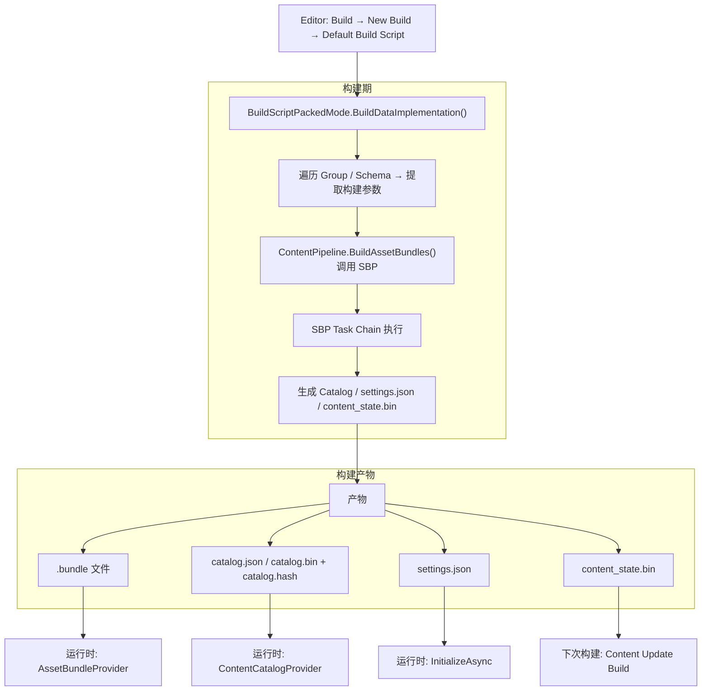
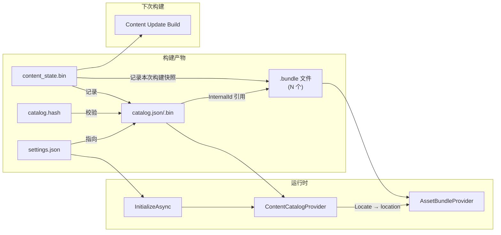
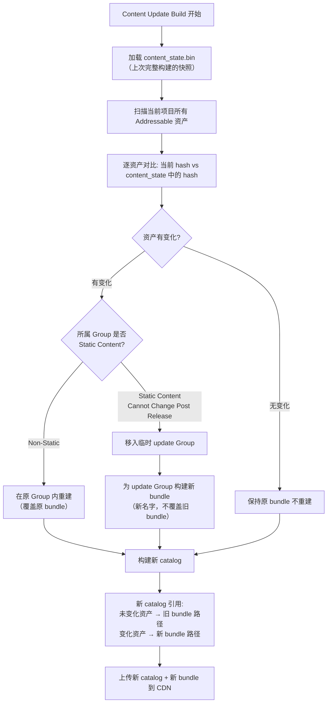

[Addr-01]() 拆的是运行时：从 `LoadAssetAsync` 到资产对象就绪，整条内部链路怎么工作。[Addr-02]() 拆的是 Catalog：`ContentCatalogData` 怎么编码、怎么查找、怎么更新。[Addr-03]() 拆的是生命周期：引用计数为什么让 Release 比 Load 更难做对。

前三篇全是运行时视角。但运行时能用的一切——bundle 文件、catalog.json、settings.json、content_state.bin——都是构建期产出的。

这一篇要回答的问题是：

`当你在 Editor 里点 Build → New Build → Default Build Script，从这一刻开始，Addressables 内部到底做了什么？`

拆清楚这条链路之后，以下问题才能定位到源码级别：

- 为什么某些资源被打进了同一个 bundle
- 为什么 bundle 名字变了导致热更全量下载
- content_state.bin 丢了为什么 Content Update Build 就废了
- Content Update Build 到底"增量"了什么

> 以下源码路径和行为基于 Addressables 1.21.x（`com.unity.addressables`）和 SBP 1.x（`com.unity.scriptablebuildpipeline`）。Addressables 2.x / Unity 6 的差异会在相关位置标注。

## 一、构建期在整个 Addressables 体系中的位置

先把构建期和前三篇的关系锚住。

Addressables 的完整生命周期可以拆成三段：

```
构建期（Editor 环境）→ 产物 → 运行时（Player 环境）
```

构建期的产出物，就是运行时的全部输入：

| 产物 | 职责 | 运行时消费者 |
|------|------|-------------|
| `.bundle` 文件 | 资产的物理容器 | `AssetBundleProvider`（Addr-01） |
| `catalog.json` / `catalog.bin` | 所有资源的寻址信息 | `ContentCatalogProvider` → `ResourceLocationMap`（Addr-02） |
| `catalog.hash` | catalog 版本标识 | `CheckForCatalogUpdates` 对比远端（Addr-02） |
| `settings.json` | 运行时初始化配置 | `Addressables.InitializeAsync` |
| `content_state.bin` | 上次构建的状态快照 | Content Update Build（本篇 Section 7） |

构建期和 SBP 的关系，[SBP 分层那篇]()已经讲清了：Addressables Build Script 站在项目内容组织层，SBP 站在 AssetBundle 构建执行层。这一篇不重复 SBP 内部机制，只追 Addressables 怎么调用它、给它什么输入、从它那里拿什么输出。



## 二、BuildScriptPackedMode 入口和流程

构建期的入口是 `BuildScriptPackedMode`——Addressables 默认的 `IDataBuilder` 实现。

源码位置：`com.unity.addressables/Editor/Build/DataBuilders/BuildScriptPackedMode.cs`

### 1. 入口方法

当你在 Editor 里点 Build，或者 CI 里调用 `AddressableAssetSettings.BuildPlayerContent()`，最终进入的是：

```
BuildScriptPackedMode.BuildDataImplementation(builderInput)
```

`builderInput` 是一个 `AddressablesDataBuilderInput`，包含：`AddressableAssetSettings` 引用、目标平台、输出路径等构建上下文。

### 2. 前置阶段：Group → Schema → 构建参数

`BuildDataImplementation` 做的第一件事不是打 bundle，而是遍历所有 Group，从每个 Group 的 Schema 里提取构建参数。

核心循环逻辑（简化）：

```
foreach (var group in settings.groups)
{
    var schema = group.GetSchema<BundledAssetGroupSchema>();
    if (schema == null) continue;

    // 从 schema 提取:
    // - BundleMode: PackTogether / PackSeparately / PackTogetherByLabel
    // - BundleNaming: FileName / FileNameHash / AppendHash
    // - BuildPath / LoadPath
    // - Compression: LZ4 / LZMA / Uncompressed
    // - IncludeInBuild

    // 为每个 Group 构建 AssetBundleBuild 列表
}
```

#### BundleMode：控制 Group 内资产怎么分到 bundle

| BundleMode | 行为 | catalog entry 数量影响 |
|------------|------|----------------------|
| `PackTogether` | 整个 Group 的所有资产打进一个 bundle | 最少——只有一个 bundle entry |
| `PackSeparately` | 每个资产独立成一个 bundle | 最多——每个资产一个 bundle entry |
| `PackTogetherByLabel` | 相同 label 的资产打进一个 bundle，没有 label 的打进一个默认 bundle | 取决于 label 数量 |

Addr-02 提到过：catalog entry 数量直接影响 `CreateLocator()` 的主线程解析耗时。`PackSeparately` 产出的 entry 最多，大型 Group 使用这个模式会让 catalog 膨胀。

#### BundleNaming：控制 bundle 文件名

| BundleNaming | 输出文件名示例 | 热更影响 |
|--------------|---------------|----------|
| `FileName` | `characters_assets_all.bundle` | 名字不变，内容变了 CDN 可以覆盖 |
| `FileNameHash` | `a3f2b1c8d9e0f1a2.bundle` | 名字由内容决定，内容变名字就变 |
| `AppendHash` | `characters_assets_all_a3f2b1c8.bundle` | 名字带 hash 后缀，内容变名字变 |

`FileNameHash` 和 `AppendHash` 都会导致内容变化时 bundle 名字改变。热更场景下这意味着客户端需要下载"新名字"的 bundle，旧 bundle 缓存失效。`FileName` 模式下名字不变，但依赖 CDN 的缓存失效机制来确保客户端拿到新内容。

### 3. 进入 SBP：ContentPipeline.BuildAssetBundles

参数提取完成后，`BuildDataImplementation` 构建一个 `AddressableAssetsBundleBuildParameters` 对象，把所有 Group 产出的 `AssetBundleBuild[]` 列表和构建参数传给 SBP：

```
ContentPipeline.BuildAssetBundles(buildParameters, buildContent, out result)
```

这是 Addressables 和 SBP 的交界点。从这里开始，控制流进入 SBP 的 task chain。

`AddressableAssetsBundleBuildParameters` 继承自 SBP 的 `BundleBuildParameters`，额外携带了 Addressables 特有的上下文——比如每个 bundle 的压缩设置、`AddressableAssetsBuildContext` 等。这个上下文对象会在 SBP task chain 的每一步之间传递。

源码位置：`com.unity.addressables/Editor/Build/AddressableAssetsBundleBuildParameters.cs`

## 三、SBP Task Chain 怎么被 Addressables 调用

[SBP 分层]()已经讲过 SBP 的四步核心 task chain。这里不重复它们的内部实现，只追 Addressables 怎么使用它们。

### 1. 四步核心 task

Addressables 通过 `ContentPipeline.BuildAssetBundles()` 启动 SBP，默认执行的 task chain 是：

```
GenerateBundlePacking → GenerateBundleCommands → WriteSerializedFiles → ArchiveAndCompressBundles
```

每一步的 Addressables 视角：

| SBP Task | Addressables 给了什么输入 | Addressables 拿到什么输出 |
|----------|------------------------|------------------------|
| `GenerateBundlePacking` | `AssetBundleBuild[]`（每个 Group 的资产-bundle 映射） | `BundleWriteData`（每个 bundle 包含哪些对象） |
| `GenerateBundleCommands` | `BundleWriteData` + 依赖信息 | 写包命令列表 |
| `WriteSerializedFiles` | 写包命令 | 序列化后的临时文件 |
| `ArchiveAndCompressBundles` | 临时文件 + 压缩参数 | 最终 `.bundle` 文件 |

源码位置：SBP task 实现都在 `com.unity.scriptablebuildpipeline/Editor/Tasks/` 目录下。

### 2. Addressables 在 SBP task 前后加了什么

Addressables 不只是原样调用 SBP。它在 task chain 的关键节点插入了自己的逻辑：

**SBP 执行前**：`BuildScriptPackedMode` 会先遍历 Group，把 `BundledAssetGroupSchema` 的配置翻译成 SBP 能理解的 `AssetBundleBuild[]` 和 `BundleBuildParameters`。这一步做的是"项目语义 → 构建指令"的翻译。

**SBP 执行后**：SBP 返回 `IBundleBuildResults`，Addressables 从中提取构建结果，用来生成 Catalog、settings.json 和 content_state.bin。这一步做的是"构建结果 → 运行时数据"的生成。

这正是 SBP 分层那篇说的：Addressables Build Script 不是在取代 SBP，而是在它上面加了一层项目内容组织和运行时数据生成的语义层。

### 3. AddressableAssetsBundleBuildParameters 的定制

`AddressableAssetsBundleBuildParameters` 在标准 `BundleBuildParameters` 基础上增加了几个关键定制：

- **Per-bundle compression**：标准 SBP 只支持全局统一的压缩设置。Addressables 通过 `AddressableAssetsBundleBuildParameters` 支持每个 Group 独立设置压缩格式（LZ4 / LZMA / Uncompressed）。
- **Build context 传递**：`AddressableAssetsBuildContext` 在 SBP task chain 的每一步都可以被访问，Addressables 利用这个机制在 task 之间传递 Group 信息、资产地址映射等项目级数据。

## 四、BundleWriteData 和依赖收集

SBP task chain 里最关键的中间数据结构是 `BundleWriteData`。它是 `GenerateBundlePacking` 的产出，也是后续所有 task 的输入基础。

### 1. 依赖收集：CalculateAssetDependencyData

在 `GenerateBundlePacking` 之前，SBP 的 `CalculateAssetDependencyData` task 先完成依赖分析：

```
对每个入口资产:
  1. 收集直接引用的所有对象（材质、贴图、Shader、脚本引用等）
  2. 递归收集间接引用
  3. 判断每个被引用对象属于哪个 bundle
  4. 如果被引用对象不属于任何显式 bundle → 标记为隐式依赖
```

源码位置：`com.unity.scriptablebuildpipeline/Editor/Tasks/CalculateAssetDependencyData.cs`

### 2. 隐式依赖怎么变成显式 bundle 引用

这是构建期最容易让人困惑的环节。

假设 bundle A 里的 Prefab 引用了一张贴图 T。贴图 T 没有被任何 Group 显式包含。那这张贴图会出现在哪里？

Addressables 的处理规则（简化）：

- 如果只有 bundle A 引用了贴图 T → T 被打进 bundle A（隐式包含）
- 如果 bundle A 和 bundle B 都引用了贴图 T → T 会被**重复打进 A 和 B**（除非你显式把 T 加入某个共享 Group）

第二种情况就是"隐式重复"。Addressables 默认不会自动创建共享 bundle——它把这个决策留给了项目。你必须用 Analyze 规则（`Check Duplicate Bundle Dependencies`）来检测隐式重复，然后手动把重复资产移到共享 Group。

### 3. BundleWriteData 结构

`BundleWriteData` 是 SBP 内部用来描述"每个 bundle 要写入什么内容"的数据结构。它包含：

| 字段 | 含义 |
|------|------|
| `AssetToFiles` | 每个入口资产对应哪些输出文件 |
| `FileToBundle` | 每个输出文件属于哪个 bundle |
| `FileToObjects` | 每个输出文件包含哪些序列化对象 |

这三个映射组合在一起，就完整描述了"哪些对象最终会进入哪个 bundle"。`GenerateBundleCommands` 从这些映射里生成具体的写包指令。

源码位置：`com.unity.scriptablebuildpipeline/Editor/ContentPipeline.cs` 中的 `BundleWriteData` 定义。

### 4. 共享依赖的判断边界

Addressables 在 1.21.x 没有自动的 shared bundle 机制。依赖分析的结果是：

```
资产 A 引用对象 X
  → X 在 A 的 bundle 里 → 不重复
  → X 在另一个 bundle B 里 → A 对 B 产生运行时依赖
  → X 不在任何 bundle 里 → X 被隐式打进 A 的 bundle
  → X 被多个 bundle 隐式包含 → 重复
```

这意味着：构建产物的体积和运行时依赖图，直接由 Group 划分决定。Group 划分不只是"资产管理方式"，它是构建产物结构的定义。

> **Addressables 2.x 注记：** Unity 6 / Addressables 2.x 引入了改进的依赖分析流程和更智能的 shared bundle 候选检测，但核心的"隐式依赖默认不自动创建共享 bundle"的原则没有改变。项目仍然需要显式决定共享策略。

## 五、Catalog 和 settings.json 的生成

SBP task chain 执行完毕后，`BuildScriptPackedMode` 拿到 `IBundleBuildResults`，进入产物生成阶段。

### 1. Catalog 生成

Catalog 生成是构建期最后也是最关键的一步——它把所有构建结果翻译成运行时的寻址信息。

核心流程：

```
1. 遍历每个 Group 的每个 entry（AddressableAssetEntry）
2. 为每个 entry 创建 ContentCatalogDataEntry:
   - InternalId: bundle 路径或资产地址
   - Provider: AssetBundleProvider / BundledAssetProvider
   - Dependencies: 依赖的 bundle 列表
   - Keys: 这个 entry 可以被哪些 key 定位（address, GUID, label）
3. 汇总所有 entry → ContentCatalogData
4. 序列化为 catalog.json（1.x）或 catalog.bin（2.x）
```

bundle 路径的生成取决于 Group Schema 的配置：

- **Local bundle**：`InternalId` 是 `{UnityEngine.AddressableAssets.Addressables.RuntimePath}/[platform]/[bundleName]`
- **Remote bundle**：`InternalId` 是 `[RemoteLoadPath]/[bundleName]`，其中 `RemoteLoadPath` 来自 Profile 配置

`RemoteLoadPath` 通常是一个模板，比如 `https://cdn.example.com/bundles/{BuildTarget}`。运行时 Addressables 会把 `{BuildTarget}` 替换成实际平台标识。

源码位置：`com.unity.addressables/Editor/Build/DataBuilders/BuildScriptPackedMode.cs` 中的 `ProcessCatalogEntries()` 相关方法。

Addr-02 详细讲过 `ContentCatalogData` 的编码结构——`m_KeyDataString`、`m_BucketDataString`、`m_EntryDataString` 怎么编码、怎么查找。这里不重复。构建期做的事情就是把构建结果填充到这个结构里，然后序列化写盘。

### 2. catalog.hash 生成

catalog 文件写盘后，`BuildScriptPackedMode` 对其内容计算哈希值，写入 `catalog.hash` 文件。这个文件只有一行——哈希字符串。

运行时 `CheckForCatalogUpdates()` 就是对比本地和远端的这个 hash 文件来判断是否需要更新（Addr-02 Section 5）。

### 3. settings.json 生成

`settings.json` 包含运行时初始化所需的配置信息：

| 字段 | 含义 |
|------|------|
| Catalog location | catalog 文件的路径或 URL |
| Catalog provider type | 解析 catalog 的 provider 类型引用 |
| Remote catalog location | 远端 catalog 的 URL（如果启用了 Build Remote Catalog） |
| Certificate handler | HTTPS 证书处理器类型 |

运行时 `Addressables.InitializeAsync()` 的第一步就是加载这个文件，从中取得 catalog 的位置，然后开始加载 catalog。

源码位置：`com.unity.addressables/Editor/Build/DataBuilders/BuildScriptPackedMode.cs` 中的 `CreateRuntimeSettingsFile()` 方法。

### 4. 产物之间的关系



## 六、content_state.bin 到底记录了什么

`content_state.bin` 是整个 Content Update Build 机制的基础。丢了它，增量更新就废了。

### 1. AddressablesContentState 数据结构

`content_state.bin` 是 `AddressablesContentState` 对象的二进制序列化文件。它记录了上一次完整构建时的完整快照。

源码位置：`com.unity.addressables/Editor/Build/ContentUpdateScript.cs` 中的 `AddressablesContentState` 类。

核心字段：

| 字段 | 类型 | 记录了什么 |
|------|------|-----------|
| `cachedInfos` | `CachedAssetState[]` | 每个资产的 GUID、hash、bundle 名、Group GUID |
| `cachedBundles` | `CachedBundleState[]` | 每个 bundle 的名字、hash、依赖列表 |
| `playerVersion` | string | 构建时的 player version |
| `editorVersion` | string | Unity Editor 版本 |
| `remoteCatalogLoadPath` | string | 远端 catalog 路径 |

#### CachedAssetState 的关键字段

```
CachedAssetState:
  asset:
    guid: "a3f2b1c8..."           // 资产的 GUID
    hash: "d9e0f1a2..."           // 资产内容的 hash
  bundleFileId: "bundle_chars_01" // 属于哪个 bundle
  groupGuid: "7b8c9d0e..."       // 属于哪个 Group
  data: ...                       // 序列化的额外数据
```

#### CachedBundleState 的关键字段

```
CachedBundleState:
  bundleFileId: "bundle_chars_01"
  hash: "f1a2b3c4..."            // bundle 内容 hash
  dependencies: ["bundle_shared_01", "bundle_shader_01"]
```

### 2. 什么时候生成

`content_state.bin` 只在 **New Build（完整构建）**时生成，不在 Content Update Build 时更新。

生成时机在 `BuildScriptPackedMode.BuildDataImplementation()` 的尾部——SBP 构建完成、Catalog 和 settings.json 都已经写完之后。

### 3. 丢了 content_state.bin 会怎样

Content Update Build 的第一步是加载 `content_state.bin`。如果找不到这个文件，构建直接失败。

更隐蔽的问题是：如果 `content_state.bin` 不是和当前线上版本对应的那一份——比如你做了一次完整构建但忘了保存 content_state.bin，后来又做了一次完整构建生成了新的 content_state.bin——那 Content Update Build 会基于错误的基线做对比，产出的增量 bundle 和 catalog 与线上版本不兼容。

这就是为什么 CI/CD 流程必须把 content_state.bin 纳入版本管理。

### 4. 存储建议

| 场景 | content_state.bin 管理方式 |
|------|--------------------------|
| 单分支、无热更 | 不需要特别管理，每次完整构建覆盖即可 |
| 有热更需求 | 每次完整构建后，把 content_state.bin 和构建版本号一起归档到 CI 产物仓库 |
| 多版本并行维护 | 每个线上版本对应一份 content_state.bin，Content Update Build 时指定对应版本 |

## 七、Content Update Build 的差量机制

Content Update Build 是 Addressables 提供的"不发整包、只更新变化内容"的构建模式。它的前提是有一份与线上版本匹配的 `content_state.bin`。

### 1. 入口

```
ContentUpdateScript.BuildContentUpdate(settings, contentStateDataPath)
```

源码位置：`com.unity.addressables/Editor/Build/ContentUpdateScript.cs`

### 2. 完整流程



### 3. 分步拆解

**Step 1：加载 content_state.bin**

`ContentUpdateScript` 反序列化 `AddressablesContentState`，得到上次完整构建时每个资产的 GUID、hash 和 bundle 归属。

**Step 2：对比当前状态 vs 上次状态**

核心方法是 `ContentUpdateScript.GetModifiedEntries()`（简化逻辑）：

```
对每个 CachedAssetState:
  1. 用 GUID 在当前项目中找到资产
  2. 计算当前资产的 hash
  3. 对比 current hash vs cached hash
  4. 如果不同 → 标记为 modified
```

这个对比不只看资产文件本身的 hash。如果一个资产的直接依赖发生了变化（比如 Prefab 引用的材质改了），即使 Prefab 文件本身没改，它的 hash 也会变——因为依赖链发生了变化。

**Step 3：Static Content 分流**

这是 Content Update Build 最核心的设计决策。

Addressables Group Schema 上有一个 `Content Update Restriction` 选项（在 1.21.x 的 UI 里叫做 `Update Restriction`）：

- **Can Change Post Release**（Non-Static）：允许更新后覆盖原 bundle。变化的资产在原 Group 内重建，产出的 bundle 可以覆盖 CDN 上同名的旧 bundle。
- **Cannot Change Post Release**（Static Content）：不允许修改已发布的 bundle。变化的资产被移到一个新的临时 update Group，构建出全新的 bundle（新名字），旧 bundle 保持不变。

为什么要区分这两种？

`Cannot Change Post Release` 的典型场景是：bundle 已经被包含在安装包里（StreamingAssets），或者被老版本客户端缓存了。如果你覆盖了这个 bundle，正在使用旧版本的客户端可能会拿到不兼容的文件，因为旧 catalog 里记录的 CRC / hash 和新 bundle 不匹配。所以变化的内容必须进新 bundle，旧 bundle 原封不动。

`Can Change Post Release` 的典型场景是：bundle 只存在于 CDN 上，每次客户端都通过新 catalog 重新定位。覆盖没有问题，因为旧 catalog 已经被新 catalog 替换了。

**Step 4：构建新 bundle + 新 catalog**

- 未变化的资产：catalog 里继续指向旧 bundle 路径。
- 变化的资产（Static Group）：catalog 里指向新的 update bundle 路径。
- 变化的资产（Non-Static Group）：catalog 里指向覆盖后的 bundle 路径。

最终产出：
- 新的 `catalog.json` / `catalog.bin` + `catalog.hash`
- 只包含变化内容的新 `.bundle` 文件
- 旧 bundle 不受影响

客户端更新流程（接 Addr-02 Section 5）：

```
1. CheckForCatalogUpdates → hash 不同，有更新
2. UpdateCatalogs → 下载新 catalog
3. 新 catalog 的 InternalId:
   - 未变化资产 → 原 bundle 路径（本地或 CDN 已缓存）
   - 变化资产 → 新 bundle 路径（需要下载）
4. DownloadDependenciesAsync → 只下载新 bundle
5. 后续 LoadAssetAsync 透明地使用新/旧 bundle
```

### 4. Content Update Build 的限制

**不能删除资产**。如果上次构建有资产 X，这次删掉了，Content Update Build 会报警告但不会从旧 bundle 里移除它。旧 bundle 保持不变。

**不能修改 Group 结构**。如果你把资产从 Group A 移到 Group B，Content Update Build 可能产出不正确的结果——它基于 content_state.bin 里记录的 Group 归属做判断。

**content_state.bin 必须对应线上版本**。如果你在做 Content Update Build 时用的 content_state.bin 不是和当前线上版本匹配的那一份，对比基线就是错的，产出的增量也是错的。

## 八、工程判断

### 1. Content Update Build vs 完整构建

| 条件 | 建议 | 理由 |
|------|------|------|
| 项目处于开发阶段，没有线上版本 | 完整构建 | Content Update Build 没有意义，增加复杂度 |
| 线上版本需要紧急热修一两个资源 | Content Update Build | 只更新变化部分，玩家下载量小 |
| 大版本更新，大量内容变化 | 完整构建 | Content Update Build 在大量变化时优势不明显，反而增加 catalog 复杂度 |
| 安装包里包含 local bundle，需要保证旧包兼容 | Content Update Build + Static Content | 旧包里的 bundle 不能被覆盖 |
| 所有 bundle 都在 CDN，客户端安装包里不含资源 | 评估是否需要 Content Update Build | 如果可以接受全量覆盖 CDN，完整构建更简单 |

### 2. content_state.bin 的 CI/CD 管理

| 实践 | 做法 |
|------|------|
| 版本归档 | 每次完整构建后，把 content_state.bin 和构建版本号、平台一起存入产物仓库（S3 / Artifactory / Git LFS） |
| 版本关联 | 文件命名带版本号：`content_state_v1.2.3_Android.bin` |
| 热更构建 | CI pipeline 从产物仓库拉取对应版本的 content_state.bin，传入 `ContentUpdateScript.BuildContentUpdate()` |
| 多平台 | 每个平台一份独立的 content_state.bin，不能混用 |

### 3. 构建时间优化

| 策略 | 预期收益 | 代价 |
|------|---------|------|
| 启用 SBP 构建缓存 | 增量构建时跳过未变化 bundle 的序列化和压缩 | 缓存目录占用磁盘空间 |
| 减少 `PackSeparately` 使用 | 减少 bundle 数量，减少 SBP task 的遍历次数 | bundle 粒度变粗 |
| 使用 LZ4 而不是 LZMA | LZ4 压缩速度快数倍 | 压缩率略低 |
| 拆分大 Group | 限制单个 Group 的资产数量 | 需要维护更多 Group |
| CI 机器 SSD + 大内存 | 序列化和压缩的 IO 瓶颈减小 | 硬件成本 |

### 4. 决策总表

| 判断维度 | 条件 | 建议 |
|----------|------|------|
| BundleMode 怎么选？ | 同一 Group 内资产总是一起用 | `PackTogether`——最少 bundle、最少 catalog entry |
| BundleMode 怎么选？ | 同一 Group 内资产需要独立更新 | `PackSeparately`——但注意 catalog 膨胀 |
| BundleMode 怎么选？ | 同一 Group 内有明确的功能子集 | `PackTogetherByLabel`——用 label 划分子 bundle |
| BundleNaming 怎么选？ | 有热更需求，需要 CDN 缓存版本化 | `AppendHash`——内容变则名变，CDN 不会返回旧内容 |
| BundleNaming 怎么选？ | 不走热更，只有安装包内 bundle | `FileName` 即可 |
| 依赖重复怎么处理？ | Analyze 检测出大量重复依赖 | 创建共享 Group，显式收入高频共享资产 |
| 依赖重复怎么处理？ | 重复量小（< 1 MB） | 可以容忍，不值得增加 Group 管理复杂度 |
| Content Update Build 还是完整构建？ | 线上紧急热修 + 有正确的 content_state.bin | Content Update Build |
| Content Update Build 还是完整构建？ | 大版本更新或 content_state.bin 丢失 | 完整构建 |
| Addressables 1.x vs 2.x 构建差异？ | Unity 6 新项目 | 使用 2.x，默认 catalog.bin，构建缓存路径改变 |
| Addressables 1.x vs 2.x 构建差异？ | 存量 2022 LTS 项目 | 继续用 1.21.x，升级需要评估 CI pipeline 和 content_state.bin 兼容性 |

---

这一篇把 Addressables 构建期从入口到产物的完整链路拆了一遍：`BuildScriptPackedMode` 怎么读 Group Schema、怎么调用 SBP task chain、`BundleWriteData` 怎么描述 bundle 内容、Catalog 和 settings.json 怎么生成、content_state.bin 记录了什么、Content Update Build 的差量机制怎么工作。

核心判断就一句：

`构建期的所有产物——bundle、catalog、settings、content state——都是由 Group 划分、Schema 配置和依赖关系共同决定的。理解了这条链路，才能把"运行时为什么这样加载"和"构建期为什么这样产出"串成一个完整的闭环。`

如果想回到运行时看 catalog 怎么被加载和更新，回去读 [Addr-02]()。如果想看构建期的三层边界怎么划分，回去读 [SBP 分层]()。如果接下来想了解 Addressables 在交付工程中接不住什么、项目必须自己补什么，可以等 Addr-05。
