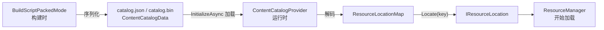
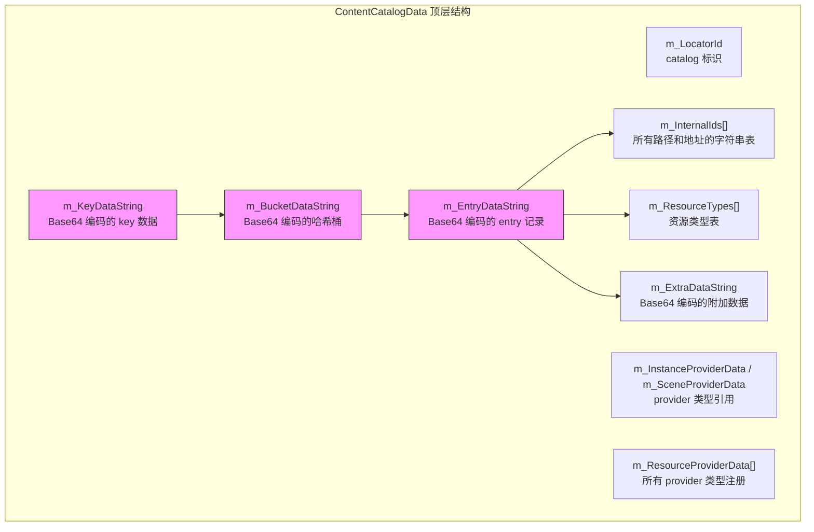
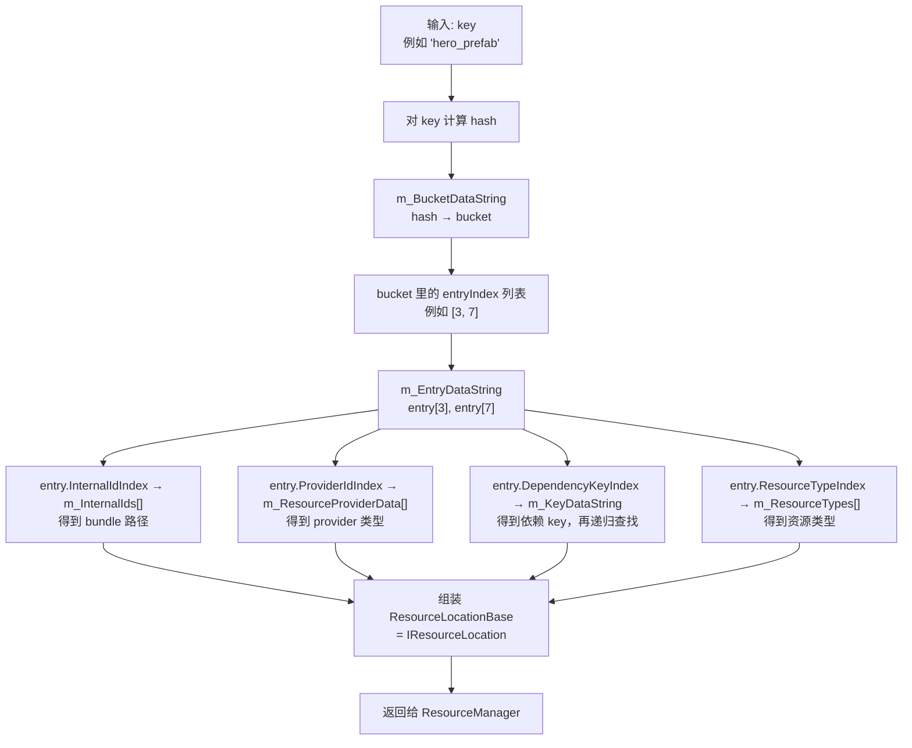
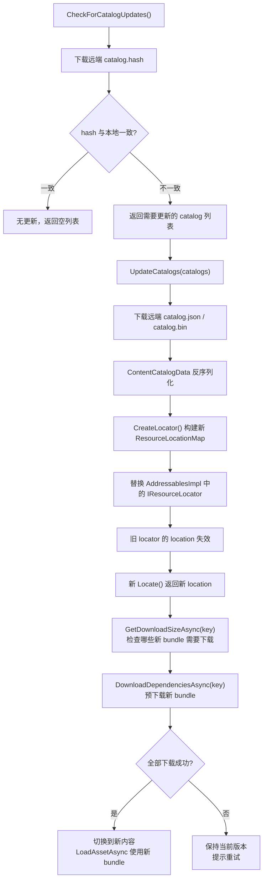

[上一篇]()把 Addressables 运行时从 `LoadAssetAsync` 到资产对象就绪的完整内部链路拆开了。那篇里提到 `IResourceLocator` 负责把 key 映射到 `IResourceLocation`，而 `ResourceLocationMap` 是运行时最常用的实现——它的数据源就是 catalog。

但那篇只用一小节带过了 catalog 的底层编码。这一篇要把这块完全拆开。

这一篇要回答三个问题：

`ContentCatalogData 里到底存了哪些字段，它们怎么编码、怎么查找？`

`catalog 加载为什么卡主线程，卡多久，怎么缓解？`

`远程 catalog 更新的完整流程是什么，失败了怎么恢复？`

这三个问题不搞清楚，项目里遇到初始化卡顿、热更失败、半更新状态的时候，就只能靠猜。

## 一、Catalog 在 Addressables 里的位置

先把 catalog 在整条链路里的角色锚住。

Catalog 是 Addressables 运行时的"电话簿"。它记录了项目里所有可寻址资源的定位信息：每个 key 对应哪个 bundle，bundle 的路径或 URL 是什么，由哪个 provider 负责加载，依赖关系怎么串。

**构建时**，`BuildScriptPackedMode` 在打包流程的最后阶段生成 catalog 文件。它把 Group 里所有资源的寻址信息序列化成 `ContentCatalogData`，输出为 `catalog.json`（Addressables 1.x 默认）或 `catalog.bin`（Addressables 2.x / Unity 6 默认）。

源码位置：`com.unity.addressables/Editor/Build/DataBuilders/BuildScriptPackedMode.cs`

**运行时**，`Addressables.InitializeAsync()` 启动初始化链，`ContentCatalogProvider` 负责加载和解析 catalog 文件，把 `ContentCatalogData` 解码成 `ResourceLocationMap`，注册到 `AddressablesImpl` 的 locator 列表里。从这一刻起，所有 `Locate(key)` 调用才能工作。

源码位置：`com.unity.addressables/Runtime/ResourceManager/ResourceProviders/ContentCatalogProvider.cs`



上一篇讲的整条链路——从 key 到 location 到 provider 到资产——catalog 就是第一步的数据源。没有它，后面的所有环节都无从谈起。

## 二、ContentCatalogData 的顶层结构

打开一个 catalog.json 文件（或者用 `Addressables > Inspect > Catalog` 在 Editor 里查看），会看到 `ContentCatalogData` 的顶层包含这些字段：

| 字段 | 类型 | 职责 |
|------|------|------|
| `m_LocatorId` | string | 这个 catalog 的唯一标识符，通常是 `AddressablesMainContentCatalog` |
| `m_InstanceProviderData` | ObjectInitializationData | 实例化 provider 的类型引用，默认指向 `InstanceProvider` |
| `m_SceneProviderData` | ObjectInitializationData | 场景加载 provider 的类型引用，默认指向 `SceneProvider` |
| `m_ResourceProviderData` | ObjectInitializationData[] | 所有注册的 resource provider 类型引用数组，包含 `AssetBundleProvider`、`BundledAssetProvider` 等 |
| `m_InternalIds` | string[] | **所有 bundle 路径和资产地址的字符串数组**，后续 entry 通过索引引用 |
| `m_KeyDataString` | string | Base64 编码的 key 序列化字节流 |
| `m_BucketDataString` | string | Base64 编码的哈希桶数组 |
| `m_EntryDataString` | string | Base64 编码的 entry 记录数组 |
| `m_ExtraDataString` | string | Base64 编码的附加数据（bundle CRC、文件大小等） |
| `m_ResourceTypes` | SerializedType[] | entry 引用的所有资源类型（`GameObject`、`Texture2D`、`AssetBundle` 等） |

源码位置：`com.unity.addressables/Runtime/ResourceManager/ResourceLocations/ContentCatalogData.cs`

前四个字段比较直白——它们是 provider 系统的注册信息。真正需要拆的是后面那一组：`m_InternalIds` 加上三个 Base64 编码字段，它们合在一起构成了 catalog 的核心查找结构。



为什么要用 Base64 编码？因为 catalog.json 是一个 JSON 文件，而 key 数据、bucket 数据和 entry 数据都是紧凑的二进制格式。Base64 让这些二进制数据可以安全地嵌入 JSON 字符串字段里。catalog.bin 则直接存二进制，不需要 Base64 这一层。

## 三、Base64 编码层：Key → Bucket → Entry → InternalId 的查找链

这是 catalog 最核心的部分。三个 Base64 字段协作完成一件事：给定一个 key，找到它对应的所有 `IResourceLocation` 信息。

### 1. m_KeyDataString：所有 key 的序列化字节流

Base64 解码后得到一个字节数组，里面按顺序存了 catalog 中所有的 key 对象。

每个 key 的存储格式是：`[类型标记 1 byte] + [数据]`。

支持的 key 类型包括：

| 类型标记 | 含义 | 数据格式 |
|----------|------|----------|
| 0 | string | UTF-8 编码的字符串 |
| 1 | UInt16 | 2 字节 |
| 2 | UInt32 | 4 字节 |
| 3 | Int32 | 4 字节 |
| 4 | Hash128 | 16 字节 |

string 类型的 key 是最常见的——它就是你在 Addressables Groups 窗口里看到的 address。Hash128 类型通常用于 AssetReference 的 GUID 和 label 的哈希值。

源码中，`ContentCatalogData.ReadKey()` 方法负责从字节流里按类型标记解码出一个 key 对象：

```
// com.unity.addressables/Runtime/ResourceManager/ResourceLocations/ContentCatalogData.cs
static object ReadKey(byte[] keyData, ref int offset)
{
    byte keyType = keyData[offset++];
    switch (keyType)
    {
        case 0: // string
            // 读取长度前缀 + UTF-8 字节
        case 1: // UInt16
        case 2: // UInt32
        case 3: // Int32
        case 4: // Hash128
            // 按固定字节数读取
    }
}
```

### 2. m_BucketDataString：哈希桶——从 key 到 entry 的索引桥

Base64 解码后得到一个哈希桶数组。每个桶记录了：

- **keyIndex**：这个桶对应的 key 在 m_KeyDataString 里的索引位置
- **entryIndex[]**：这个 key 关联的一组 entry 在 m_EntryDataString 里的索引列表

桶数组的组织方式类似一个简化的 hash map。查找时先对 key 做哈希，定位到桶，然后从桶里拿到 entry 索引列表。

为什么用哈希桶而不是直接用字典？因为 catalog 需要在序列化格式里保持紧凑。字典的序列化开销大，而哈希桶可以用固定长度的二进制数组表示，解析速度更快。

```
桶结构（简化）：
bucket[0]: keyIndex=5, entries=[0, 3, 7]
bucket[1]: keyIndex=12, entries=[1]
bucket[2]: keyIndex=8, entries=[2, 4]
...
```

### 3. m_EntryDataString：entry 记录——每个资源的完整定位信息

Base64 解码后得到一个 entry 数组。每个 entry 是一条固定长度的记录（在 Addressables 1.21.x 中是 28 字节），包含：

| 字段 | 大小 | 含义 |
|------|------|------|
| InternalId index | 4 bytes | 指向 `m_InternalIds[]` 数组的索引，得到 bundle 路径或资产地址 |
| ProviderId index | 4 bytes | 指向 `m_ResourceProviderData[]` 的索引，确定由哪个 provider 加载 |
| DependencyKeyIndex | 4 bytes | 指向 m_KeyDataString 里的另一个 key，用来查找这个 entry 的依赖列表 |
| DataIndex | 4 bytes | 指向 m_ExtraDataString 的偏移，取额外信息（CRC、文件大小等） |
| PrimaryKey index | 4 bytes | 这个 entry 的主 key 在 m_KeyDataString 里的索引 |
| ResourceType index | 4 bytes | 指向 `m_ResourceTypes[]` 的索引，标识资源类型 |
| Data | 4 bytes | 标志位（是否启用 CRC 校验等） |

源码中，`ContentCatalogData.CleanData()` 和 `CreateLocator()` 方法负责把这些二进制 entry 解码成运行时的 `ResourceLocationBase` 对象。

### 4. 完整查找链

把三层拼起来，一次 `Locate(key)` 的底层路径是：



用一个具体例子走一遍：

```
1. 调用 Locate("hero_prefab")
2. 对 "hero_prefab" 计算 hash = 0x7A3F...
3. 在 bucket 数组里定位到 bucket[hash % bucketCount]
4. bucket 说：这个 key 对应 entry[3]
5. 读取 entry[3]：
   - InternalIdIndex = 42 → m_InternalIds[42] = "characters_assets_all.bundle"
   - ProviderIdIndex = 1 → BundledAssetProvider
   - DependencyKeyIndex = 15 → key[15] 是这个 bundle 的依赖 key
   - ResourceTypeIndex = 0 → typeof(GameObject)
6. 组装成 ResourceLocationBase 返回
```

但要注意：这个查找过程在运行时并不是每次 `Locate` 都走一遍。`ContentCatalogProvider` 在加载 catalog 时会一次性把所有 entry 解码成 `ResourceLocationBase` 对象，构建成 `ResourceLocationMap` 的内部字典。之后 `Locate` 就是一次字典查找，O(1)。

代价是：**这个一次性解码过程发生在主线程上**。

## 四、加载成本：为什么 InitializeAsync 会卡主线程

这是项目里最容易被忽视的性能问题之一。

### 1. "Async" 的名字会骗人

`Addressables.InitializeAsync()` 返回一个 `AsyncOperationHandle`，看起来是异步的。但实际上，catalog 文件的解析——也就是 Base64 解码 + entry 遍历 + `ResourceLocationMap` 构建——是在 `ContentCatalogProvider` 内部同步执行的。

具体路径：

```
InitializeAsync()
  → ContentCatalogProvider.Provide()
    → ContentCatalogData.CreateLocator()
      → 同步 Base64.Decode(m_KeyDataString)
      → 同步 Base64.Decode(m_BucketDataString)
      → 同步 Base64.Decode(m_EntryDataString)
      → 同步遍历所有 entry，创建 ResourceLocationBase 对象
      → 同步构建 ResourceLocationMap 字典
```

源码位置：`com.unity.addressables/Runtime/ResourceManager/ResourceLocations/ContentCatalogData.cs` 的 `CreateLocator()` 方法。

`CreateLocator()` 内部没有任何 yield 或分帧逻辑。它一口气把所有 entry 解码完，然后才返回。这意味着即使你的初始化链路是异步的，catalog 解析这一步是一个同步阻塞点。

### 2. 卡多久？

catalog 解析耗时和 entry 数量近似线性关系。实际数据取决于设备性能和 catalog 规模：

| 场景 | entry 数量（约） | 移动端耗时（约） | 说明 |
|------|------------------|------------------|------|
| 小项目 | ~1,000 | 5-15 ms | 通常不是问题 |
| 中型项目 | ~5,000 | 20-60 ms | 开始可感知 |
| 大型项目 | ~10,000+ | 50-200 ms | 明显卡顿，低端机更严重 |
| 超大项目 | ~30,000+ | 200-500 ms | 必须优化 |

这些数字的关键含义：catalog 解析发生在 `InitializeAsync` 里，而 `InitializeAsync` 通常在游戏启动的早期阶段。如果它卡了 200ms，玩家感知到的就是启动时多了一帧明显的卡顿。在低端 Android 设备上，这个数字可能翻倍。

### 3. catalog.json vs catalog.bin 的性能差异

Addressables 1.x 默认输出 `catalog.json`，Addressables 2.x（Unity 6 随附）默认输出 `catalog.bin`。

| 维度 | catalog.json | catalog.bin |
|------|-------------|-------------|
| 格式 | JSON 文本 + Base64 编码的二进制字段 | 纯二进制 |
| 解析方式 | 先 JSON 反序列化，再 Base64 解码 | 直接二进制读取 |
| 文件体积 | 较大（Base64 膨胀约 33%） | 较小 |
| 解析速度 | 较慢（JSON 解析 + Base64 解码两层开销） | 较快（跳过 JSON 和 Base64 层） |
| 可读性 | 可以直接打开看结构 | 不可直接阅读 |
| 调试 | 可以用文本编辑器查看 | 需要用 Editor 的 Inspect Catalog 工具 |

对于 10k+ entry 的大型 catalog，从 json 切换到 bin 格式可以减少约 30-50% 的解析耗时。但这只是缓解，不是解决——核心问题仍然是同步主线程解析。

### 4. 缓解策略

**控制 catalog 规模**。每个可寻址资源（无论是 bundle 级还是 asset 级）都会在 catalog 里生成 entry。如果把 Addressables Group 的 `Bundle Mode` 设为 `Pack Separately`，每个资产独立成 bundle，catalog 会急剧膨胀。用 `Pack Together` 或 `Pack Together By Label` 可以显著减少 entry 数量。

**谨慎使用 label**。每个 label 会为关联的每个资源产生额外的 bucket entry。如果一个 label 关联了 5000 个资源，它会让 bucket 数组增加 5000 项。label 不是免费的。

**升级到 catalog.bin**。如果还在 Addressables 1.x 且无法升级到 2.x，可以在 `AddressableAssetSettings` 里把 `Build Remote Catalog` 的格式切到 binary（1.21.x 已支持此选项）。

**考虑 catalog 拆分**。对于超大型项目，可以把不同内容模块的资源放到不同的 catalog 里（通过多个 Addressable Asset Settings 或自定义 build script）。每个 catalog 独立加载，分散主线程压力。但拆分增加了管理复杂度——多 catalog 之间的依赖关系需要自己维护。

**把初始化放在加载屏幕后面**。这不是技术优化，但很实用。如果 `InitializeAsync` 在闪屏或加载界面期间执行，200ms 的卡顿玩家感知不到。

## 五、远程 Catalog 更新的完整流程

Catalog 更新是 Addressables 热更资源的核心机制。它的基本思路是：用新 catalog 替换旧 catalog，新 catalog 里的 location 指向新 bundle 路径，从而让后续加载自动拿到新资源。

### 1. 完整流程



分步解释：

**Step 1：CheckForCatalogUpdates()**

这个调用会向远端请求 catalog 的 `.hash` 文件。`.hash` 文件非常小（只有一个 hash 值字符串），所以这一步的网络开销可以忽略。

它把远端 hash 和本地存储的 hash 做比较。如果不同，说明 CDN 上有新的 catalog。返回值是一个 `List<string>`，包含所有需要更新的 catalog locator ID。

源码位置：`com.unity.addressables/Runtime/Initialization/AddressablesImpl.cs` 的 `CheckForCatalogUpdatesAsync()` 方法。

**Step 2：UpdateCatalogs(catalogs)**

这一步做了三件事：

1. 下载新的 catalog 文件（catalog.json 或 catalog.bin）
2. 用 `ContentCatalogData.CreateLocator()` 解析成新的 `ResourceLocationMap`
3. 替换 `AddressablesImpl.m_ResourceLocators` 里的旧 locator

替换完成后，后续所有 `Locate(key)` 调用返回的都是新 catalog 里的 location。旧 catalog 里的 location 对象仍然存在于已有的 operation 缓存中（已加载的资源不受影响），但新的加载请求会走新路径。

源码位置：`com.unity.addressables/Runtime/Initialization/AddressablesImpl.cs` 的 `UpdateCatalogs()` 方法。

**Step 3：预下载新 bundle**

新 catalog 替换后，新 location 可能指向还没下载到本地的 bundle。这一步用 `GetDownloadSizeAsync` 检查哪些 bundle 需要下载，然后用 `DownloadDependenciesAsync` 把它们拉下来。

### 2. 关键失败模式：半更新状态

上一篇已经提到了这个问题，这里从 catalog 的视角再讲一遍，因为理解了 catalog 内部结构后，根因会更清楚。

**场景**：`UpdateCatalogs` 成功，但后续的 bundle 下载失败（网络断开、CDN 未同步、磁盘空间不足）。

**根因**：新 catalog 的 `m_InternalIds` 数组里包含了新 bundle 的路径或 URL。这些路径已经替换了旧 catalog 里的路径。但对应的 bundle 文件还不在本地缓存里，远端也可能暂时无法访问。

**表现**：`LoadAssetAsync` 拿到新 location → `AssetBundleProvider` 尝试加载 → 本地找不到、远端下载失败 → handle.Status = Failed。

**为什么危险**：catalog 替换是不可逆的（在单次运行内）。一旦 `UpdateCatalogs` 完成，你无法"退回"旧 catalog。旧 locator 已经被替换。如果这时候 bundle 下不下来，就卡在中间状态了。

### 3. 推荐的安全更新模式

```
// Step 1: 检查是否有更新
var checkHandle = Addressables.CheckForCatalogUpdates(false);
await checkHandle.Task;

if (checkHandle.Status != AsyncOperationStatus.Succeeded
    || checkHandle.Result.Count == 0)
{
    // 没有更新或检查失败，继续用当前版本
    Addressables.Release(checkHandle);
    return;
}

// Step 2: 执行 catalog 更新
var updateHandle = Addressables.UpdateCatalogs(checkHandle.Result, false);
await updateHandle.Task;
Addressables.Release(checkHandle);

if (updateHandle.Status != AsyncOperationStatus.Succeeded)
{
    // catalog 更新失败，当前 locator 未被替换，安全
    Addressables.Release(updateHandle);
    ShowRetryDialog();
    return;
}

// Step 3: catalog 已替换，检查需要下载的内容
var sizeHandle = Addressables.GetDownloadSizeAsync("critical_content_label");
await sizeHandle.Task;
long downloadSize = sizeHandle.Result;
Addressables.Release(sizeHandle);

if (downloadSize > 0)
{
    // Step 4: 预下载新 bundle
    var downloadHandle = Addressables.DownloadDependenciesAsync(
        "critical_content_label");
    // 可以在这里显示下载进度
    await downloadHandle.Task;

    if (downloadHandle.Status != AsyncOperationStatus.Succeeded)
    {
        // bundle 下载失败，进入半更新状态
        // 这里需要项目层面的恢复策略
        Addressables.Release(downloadHandle);
        HandlePartialUpdateFailure();
        return;
    }
    Addressables.Release(downloadHandle);
}

Addressables.Release(updateHandle);

// Step 5: 所有内容就绪，安全切换
SwitchToNewContent();
```

**关键点**：`UpdateCatalogs` 和 `DownloadDependenciesAsync` 之间不能有"切换到新内容"的逻辑。必须等两步都成功，再让游戏逻辑开始使用新资源。

### 4. 失败恢复策略

如果进入了半更新状态（新 catalog + 旧 bundle），可选的恢复路径包括：

**重试下载**。最简单的方案。重新调用 `DownloadDependenciesAsync`，如果是临时网络问题，重试几次可能就好了。

**重启应用**。`InitializeAsync` 在启动时会重新加载 catalog。如果远端 catalog 可用，会加载远端版本；如果远端不可达，会 fallback 到本地打包的 catalog。这相当于"重置"到一个一致的状态。但前提是本地还保留了可用的 fallback catalog。

**清除本地 catalog 缓存**。`Caching.ClearCache()` 可以清掉 Unity 的 bundle 缓存，配合删除本地存储的 catalog hash 文件，让下次启动从头开始。这是最激进的方案，代价是所有已缓存的 bundle 都需要重新下载。

## 六、catalog.json vs catalog.bin（Unity 6 注记）

Addressables 2.x（Unity 6 LTS 随附）默认使用 `catalog.bin`——纯二进制格式。这个变化值得单独说几句。

### 1. 格式差异

`catalog.json` 的结构是：

```
JSON 壳
  ├── m_InternalIds: ["path1", "path2", ...]     // 明文 JSON 数组
  ├── m_KeyDataString: "SGVsbG8gV29ybGQ=..."     // Base64 字符串
  ├── m_BucketDataString: "AQIDBAU=..."           // Base64 字符串
  ├── m_EntryDataString: "AQIDBAUGCAU=..."        // Base64 字符串
  └── ...其他 JSON 字段
```

`catalog.bin` 的结构是：

```
二进制文件
  ├── 文件头（版本号、偏移表）
  ├── InternalIds 区域（直接二进制存储）
  ├── Key 数据区域（直接二进制存储，无 Base64）
  ├── Bucket 数据区域（直接二进制存储）
  ├── Entry 数据区域（直接二进制存储）
  └── ExtraData 区域
```

bin 格式跳过了 JSON 序列化和 Base64 编解码两层开销，直接按偏移读取二进制数据。

### 2. 性能收益

- **文件体积**：bin 比 json 小约 25-40%（省掉 JSON 结构字符和 Base64 膨胀）
- **解析速度**：bin 比 json 快约 30-50%（省掉 JSON 解析和 Base64 解码）
- **内存峰值**：bin 解析时不需要先分配 JSON 文本字符串再解码，内存峰值更低

### 3. 调试代价

bin 格式不可直接用文本编辑器查看。调试时需要：

- 在 Editor 里用 `Window > Asset Management > Addressables > Inspect > Catalog` 查看内容
- 或者在 build settings 里临时切回 json 格式做一次构建，查看结构后再切回来

### 4. 版本兼容性

`catalog.json` 和 `catalog.bin` 不能混用。如果项目从 Addressables 1.x 升级到 2.x，远端 CDN 上的旧 catalog.json 和新 catalog.bin 不兼容。升级时需要确保：

- 所有客户端都更新到支持 bin 格式的版本
- CDN 上的 catalog 文件格式和客户端期望的格式一致
- 或者在过渡期保持 json 格式，等所有旧版本客户端都升级后再切换

## 七、项目判断

| 判断维度 | 条件 | 建议 |
|----------|------|------|
| catalog 解析耗时可接受吗？ | entry < 3,000，移动端耗时 < 30ms | 不需要特殊处理 |
| catalog 解析耗时不可接受 | entry > 10,000，移动端耗时 > 100ms | 减少 entry 数量（合并 bundle）、升级 catalog.bin、把初始化放在加载屏幕后 |
| 是否需要拆分 catalog | 项目有明确的内容模块划分（如多个 DLC），每个模块 > 5,000 entry | 考虑多 catalog，每个模块独立加载 |
| 是否需要拆分 catalog | 单一连续内容，entry 总量 < 10,000 | 不需要拆分，管理复杂度不值得 |
| catalog 更新失败恢复重要吗？ | 有远程热更需求，玩家在弱网环境 | 必须实现完整的分步更新和失败恢复逻辑 |
| catalog 更新失败恢复重要吗？ | 纯本地游戏，不走远端更新 | 不需要，catalog 打包在 StreamingAssets 里 |
| json 还是 bin？ | Addressables 2.x / Unity 6 | 默认 bin，不需要改 |
| json 还是 bin？ | Addressables 1.x，性能敏感 | 可以手动开启 bin 格式（1.21.x 支持） |
| json 还是 bin？ | Addressables 1.x，需要频繁调试 catalog | 保持 json，调试完再考虑切换 |
| label 使用策略 | 每个 label 关联 < 500 个资源 | 正常使用 |
| label 使用策略 | 某个 label 关联 > 5,000 个资源 | 重新审视 label 设计，考虑拆分或用更细粒度的 key 策略 |

---

这一篇把 catalog 从外到里拆了一遍：顶层结构、Base64 编码的三层查找链、主线程加载成本、远程更新流程和失败恢复。

回到上一篇的整体链路图：`key → Locate → IResourceLocation → ProvideResource → bundle → asset`。这一篇深入的是第一步——`Locate` 背后的数据从哪里来、怎么编码、怎么到达运行时。

下一步如果想了解 `AsyncOperationHandle` 的引用计数机制、Release 为什么比 Load 更难做对、以及常见泄漏模式的源码级分析，可以等 Addr-03。如果想看 YooAsset 的 `PackageManifest` 和 Addressables Catalog 在同一层问题上的结构对比，可以等 Yoo-02 和 Cmp-02。
