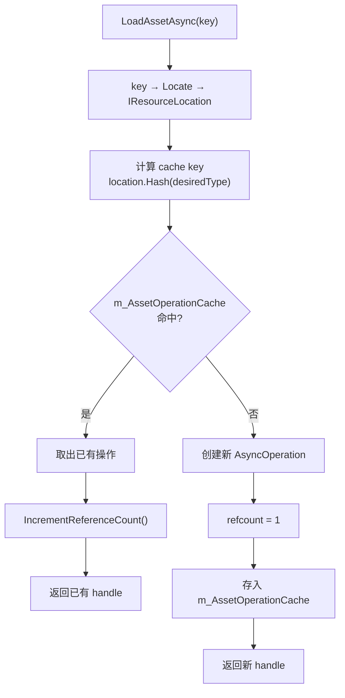
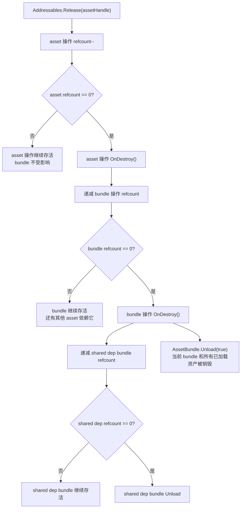
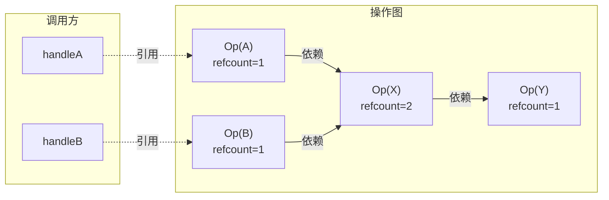

[Addr-01]() 把 Addressables 运行时从 `LoadAssetAsync` 到资产对象就绪的完整内部链路拆开了。那篇最后一节提到了引用计数和 Release 触发 Unload 的基本路径，但只用了一小节带过。

[Case-04]() 是一篇案例文章——它从"QA 报了内存只涨不跌"这个现场出发，追到源码根因，然后给出五种泄漏模式的修复代码。它回答的是：**泄漏了怎么办**。

这一篇不从 bug 出发。它要回答的是：**Addressables 的引用计数和生命周期系统到底怎么设计的，为什么 Release 在工程上比 Load 难做对**。

把这套机制拆清楚之后，再回去看 Case-04 里的那些泄漏模式，就不是在"背修法"，而是能从系统设计层推导出来"为什么那样写就会漏"。

> **版本基线：** 本文源码分析基于 Addressables 1.21.x（com.unity.addressables）。Unity 6 随附的 Addressables 2.x 差异之处会以注记标出。

## 一、引用计数的底层数据结构

引用计数这件事，在 Addressables 里不在 handle 上，而在 handle 背后的操作对象上。

### 1. m_referenceCount 在哪里

每个 `AsyncOperationHandle<T>` 是一个结构体，它内部持有一个对 `AsyncOperationBase<T>` 实例的引用。引用计数就维护在这个内部操作对象上：

```
// com.unity.addressables/Runtime/ResourceManager/AsyncOperations/AsyncOperationBase.cs
internal int m_referenceCount;
```

这是一个普通的 `int` 字段，不是原子变量，不是线程安全的。Addressables 的所有操作都运行在主线程上，所以不需要锁。

### 2. IncrementReferenceCount 的前置检查

`IncrementReferenceCount()` 不是简单的 `m_referenceCount++`。它有一个关键的前置检查：

```
// AsyncOperationBase.cs
internal void IncrementReferenceCount()
{
    if (m_referenceCount == 0)
        throw new Exception("...");
    m_referenceCount++;
}
```

如果 refcount 已经是 0，说明这个操作已经被标记为待销毁或已销毁。再递增就意味着有人试图复活一个已经释放的操作——这是 bug，所以直接抛异常。

这个检查在项目里的实际效果：如果你在 `Release` 之后又试图使用同一个 handle（比如存了一个 handle 的引用，Release 了，过一会儿又试图访问它的 `.Result`），在 Debug 模式下会得到一个异常。

### 3. DecrementReferenceCount 的销毁触发

```
// AsyncOperationBase.cs
internal void DecrementReferenceCount()
{
    m_referenceCount--;
    if (m_referenceCount <= 0)
    {
        // 引用计数归零，通知 ResourceManager 执行销毁
        m_DestroyedAction?.Invoke(this);
    }
}
```

`m_DestroyedAction` 是操作创建时由 `ResourceManager` 注册的回调。当它被触发，ResourceManager 会执行 `ReleaseInternal()`，进入操作的销毁流程。

注意这里的判断是 `<= 0` 而不是 `== 0`。这是一种防御式写法——如果因为某种 bug 导致多次 Decrement，不会错过销毁时机。

### 4. Handle 是结构体意味着什么

`AsyncOperationHandle<T>` 是 struct，不是 class。复制一个 handle 不会触发 `IncrementReferenceCount`。

```csharp
var handle1 = Addressables.LoadAssetAsync<Sprite>("icon");
var handle2 = handle1; // 这只是结构体复制，refcount 不变，仍然是 1
```

这和 C++ 的 `shared_ptr` 不同——`shared_ptr` 的拷贝构造会递增引用计数。Addressables 的 handle 是一个轻量包装器，它持有的是对内部操作的引用，但不参与引用计数管理。

这意味着：**复制 handle 不会延长操作的生命周期**。多个地方持有同一个 handle 的副本，只要其中任何一个调用了 `Release`，refcount 就会递减。如果 refcount 因此归零，所有副本同时失效。

## 二、Operation Cache 和 Handle 复用

引用计数不是孤立存在的。它和 ResourceManager 的操作缓存机制紧密配合。



### 1. m_AssetOperationCache 的结构

ResourceManager 内部维护一个操作缓存字典：

```
// com.unity.addressables/Runtime/ResourceManager/ResourceManager.cs
internal Dictionary<int, IAsyncOperation> m_AssetOperationCache;
```

cache key 是一个 `int`，由 location 和资源类型组合计算得出。具体计算方式在 `ResourceManager.CreateCacheKeyForLocation()` 中：

```
// ResourceManager.cs
static int CreateCacheKeyForLocation(IResourceLocation location, Type desiredType)
{
    return location.Hash(desiredType);
}
```

`location.Hash()` 结合了 `InternalId`、`ProviderId` 和 `desiredType`，产生一个尽量唯一的哈希值。

### 2. 缓存命中时的行为

当第二次调用 `LoadAssetAsync` 请求同一个 key 时，ResourceManager 的处理路径是：

```
1. key → Locate → 得到 IResourceLocation
2. 用 location + type 计算 cache key
3. 在 m_AssetOperationCache 中查找
4. 如果命中 → 取出已有操作 → IncrementReferenceCount() → 返回 handle
5. 如果未命中 → 创建新操作 → refcount = 1 → 存入缓存 → 返回 handle
```

用代码表示：

```csharp
// 第一次加载
var handle1 = Addressables.LoadAssetAsync<GameObject>("hero_prefab");
// 内部：创建新操作，refcount = 1，存入缓存

// 第二次加载同一个 key
var handle2 = Addressables.LoadAssetAsync<GameObject>("hero_prefab");
// 内部：缓存命中，同一个操作 refcount = 2

// handle1 和 handle2 指向同一个内部操作
// 但它们是两个独立的 handle 结构体副本
```

这个缓存机制是 Addressables 性能优化的核心之一——对同一资源的重复请求不会触发重复的 IO 和反序列化。

### 3. 缓存带来的引用计数复杂性

缓存让"一次 Load 对应一次 Release"这个规则变得微妙。

如果系统 A 和系统 B 分别调用 `LoadAssetAsync("hero_prefab")`，它们拿到的 handle 指向同一个操作，refcount 是 2。如果系统 A 调了 Release，refcount 变成 1。只有当系统 B 也 Release 之后，refcount 才会归零，操作才会被销毁。

但如果系统 A Release 了，然后系统 B 又调了一次 `LoadAssetAsync("hero_prefab")`——这取决于时序。如果系统 B 的 Load 发生在系统 A Release 之后、但操作还没被销毁之前（同一帧内），缓存可能仍然命中，refcount 从 1 变成 2。如果操作已经被销毁并从缓存移除了，那系统 B 会得到一个全新的操作。

这种时序依赖是引用计数系统在工程上最容易出问题的地方。不是说代码写错了，而是**行为取决于多个系统的 Load / Release 顺序，而这个顺序在复杂项目里很难静态推理**。

### 4. 缓存清理时机

操作的 refcount 归零后，`ResourceManager.ReleaseInternal()` 会把它从 `m_AssetOperationCache` 中移除：

```
// ResourceManager.cs
internal void ReleaseInternal(IAsyncOperation operation)
{
    // 从缓存字典中移除
    m_AssetOperationCache.Remove(cacheKey);
    // 执行操作的 Destroy
    operation.DecrementReferenceCount();
    // ...
}
```

移除后，下次再请求同一个 key 会重新创建操作、重新加载资源。

## 三、Release 触发 Unload 的条件链

Addr-01 里用一段流程图带过了 Release 到 Unload 的路径。这里要把每一步的条件和分支完整拆开。

### 1. 完整调用链

```
Addressables.Release(handle)
  → AddressablesImpl.Release(handle)
    → ResourceManager.Release(handle)
      → handle.m_InternalOp.DecrementReferenceCount()
        → 如果 refcount == 0:
          → m_DestroyedAction(this)
            → ResourceManager.ReleaseInternal(operation)
              → 从 m_AssetOperationCache 移除
              → operation.OnDestroy()
```

### 2. OnDestroy 做了什么

`AsyncOperationBase.OnDestroy()` 是一个虚方法，不同类型的操作有不同的实现。对于资产加载操作链，关键的两层是：

**BundledAssetProvider 层**：释放从 bundle 中加载的资产引用。这一步本身不会触发 `AssetBundle.Unload`——它只是告诉 ResourceManager "我不再需要这个 bundle 了"。

**AssetBundleProvider 层**：检查 bundle 操作自身的引用计数。如果这个 bundle 没有被其他资产操作依赖了，refcount 归零，触发 `AssetBundleResource.Unload()`，最终调用 `AssetBundle.Unload(true)`。

### 3. 级联释放的条件

一个资产操作被销毁时，会递减它所依赖的所有操作的引用计数。这些依赖操作包括：

- 资产所在的 bundle 的加载操作
- 这个 bundle 依赖的其他 bundle 的加载操作（shared dependencies）

只有当一个 bundle 操作的 refcount 降到 0——也就是没有任何资产操作还依赖它——`AssetBundle.Unload(true)` 才会被调用。



### 4. Unload(true) 的不可逆性

`AssetBundle.Unload(true)` 是引擎层的操作，一旦执行：

- bundle 容器本身被释放
- 从这个 bundle 加载出来的**所有**资产对象被销毁
- 如果还有 GameObject 在引用这些资产（比如一个 Material 正在被某个 Renderer 使用），这些引用会变成 null——表现为紫色材质、mesh 丢失、或 MissingReferenceException

这就是为什么 Release 比 Load 更难做对：**Load 的后果是可预期的（要么成功要么失败），Release 的后果取决于全局状态（还有没有其他引用者）**。

## 四、依赖引用的传播图

引用计数不是每个操作独立管理的。操作之间通过依赖关系形成一个有向图，引用计数沿着这个图传播。

### 1. 操作依赖图的结构

当你加载 bundle X 里的 asset A 时，Addressables 内部创建的操作图是：

```
BundledAssetProvider.Op(A) ──依赖──→ AssetBundleProvider.Op(X)
```

如果 bundle X 还依赖一个 shared bundle Y（比如公共贴图包），图变成：

```
BundledAssetProvider.Op(A) ──依赖──→ AssetBundleProvider.Op(X) ──依赖──→ AssetBundleProvider.Op(Y)
```

每条依赖边都意味着：上游操作持有对下游操作的一次引用计数。

### 2. 多资产共享 bundle 的引用计数

用一个具体例子来看。假设 bundle X 包含 asset A 和 asset B，bundle X 依赖 shared bundle Y：



此时各操作的引用计数：
- Op(A)：refcount = 1（来自 handleA）
- Op(B)：refcount = 1（来自 handleB）
- Op(X)：refcount = 2（来自 Op(A) 和 Op(B) 的依赖）
- Op(Y)：refcount = 1（来自 Op(X) 的依赖）

### 3. 释放过程的传播

如果此时 Release handleA：

```
1. Op(A).refcount 从 1 → 0，触发 OnDestroy
2. Op(A) 释放对 Op(X) 的依赖引用
3. Op(X).refcount 从 2 → 1
4. Op(X) 不会被销毁——Op(B) 还依赖它
5. Op(Y) 不受影响
```

bundle X 和 bundle Y 都不会被 Unload。asset A 的操作被清理了，但 bundle 还活着，因为 asset B 还在用。

继续 Release handleB：

```
1. Op(B).refcount 从 1 → 0，触发 OnDestroy
2. Op(B) 释放对 Op(X) 的依赖引用
3. Op(X).refcount 从 1 → 0，触发 OnDestroy
4. Op(X) 释放对 Op(Y) 的依赖引用
5. Op(Y).refcount 从 1 → 0，触发 OnDestroy
6. Op(X) 执行 AssetBundle.Unload(true)，bundle X 被卸载
7. Op(Y) 执行 AssetBundle.Unload(true)，bundle Y 被卸载
```

这就是级联释放——一个 handle 的 Release 可以沿依赖链一路触发多个 bundle 的 Unload。

### 4. 共享 bundle 的保护机制

假设另一个 bundle Z 里的 asset C 也依赖 shared bundle Y：

```
Op(C) → Op(Z) → Op(Y)
Op(A) → Op(X) → Op(Y)
Op(B) → Op(X) → Op(Y)
```

这时候 Op(Y) 的 refcount = 2（来自 Op(X) 和 Op(Z)）。即使 handleA 和 handleB 都 Release 了，Op(X) 被销毁，Op(Y) 的 refcount 只从 2 降到 1——它不会被 Unload，因为 Op(Z) 还在引用它。

这个机制保证了共享 bundle 不会被过早卸载。但它也意味着：**如果你只释放了部分资产的 handle，共享 bundle 会一直常驻**。这不是泄漏，但可能不符合你对内存释放的预期。

## 五、常见泄漏模式（源码视角）

Case-04 从 bug 修复的角度列出了五种泄漏模式。这里从系统设计的角度重新审视四种最核心的模式，追的是"源码里哪条路径导致 refcount 无法归零"。

### 模式一：Handle 被丢弃，refcount 卡在 1

```csharp
void Start()
{
    // 返回值没存，handle 丢失
    Addressables.LoadAssetAsync<Sprite>("icon");
}
```

源码路径：`ResourceManager.ProvideResource()` 创建操作，refcount 初始化为 1，存入 `m_AssetOperationCache`。但调用方没有保存 handle，无法调用 `Release`。操作永远留在缓存里，refcount 永远是 1。

这是最简单的泄漏——没有任何复杂的时序问题，纯粹是调用方忽略了返回值。

### 模式二：Handle 集合只加不减

```csharp
private List<AsyncOperationHandle> handles = new();

void LoadItem(string key)
{
    var handle = Addressables.LoadAssetAsync<GameObject>(key);
    handles.Add(handle);
}

// 从不调用 Release，或者只在某些条件下调用
```

源码路径：每次 `LoadItem` 都会通过 `ResourceManager.ProvideResource()` 创建或复用操作并递增 refcount。集合不断膨胀，但没有对应的 Release 循环。即使操作被缓存命中（同一个 key 的多次加载共享操作），每次缓存命中都会 `IncrementReferenceCount()`，如果 Release 次数不匹配 Load 次数，refcount 就永远不会归零。

### 模式三：场景加载不做 UnloadScene

```csharp
var sceneHandle = Addressables.LoadSceneAsync("BattleScene");
// ... 玩完了
SceneManager.LoadScene("MainMenu"); // 用 Unity 原生 API 切场景
// sceneHandle 没有被 UnloadSceneAsync，也没有被 Release
```

源码路径：`Addressables.LoadSceneAsync` 内部创建一个 `SceneProvider` 操作，它持有对场景 bundle 的依赖引用。用 `SceneManager.LoadScene` 切场景只是在引擎层卸载了场景对象，但 Addressables 层的操作引用和 bundle 引用完全不受影响。

正确做法是用 `Addressables.UnloadSceneAsync(sceneHandle)` 或者至少 `Addressables.Release(sceneHandle)` 来触发引用计数递减。

### 模式四：Instantiate 后只 Destroy 不 Release

```csharp
var handle = Addressables.InstantiateAsync("enemy_prefab");
var go = await handle.Task;
// ... 敌人被击杀
Destroy(go); // 只销毁了 GameObject，没有 Release handle
```

源码路径：`Addressables.InstantiateAsync` 在 `ResourceManager` 中创建一个 `InstanceOperation`，它持有对原始 prefab 加载操作的依赖引用。`Destroy(go)` 是 Unity 引擎层的操作，只销毁 GameObject 实例，不会触发 Addressables 的 `DecrementReferenceCount()`。

`InstanceOperation` 的 refcount 保持不变，它对 prefab 操作的依赖引用也不释放，进而 prefab 所在的 bundle 也无法卸载。

## 六、Event Viewer 和 Profiler 诊断

知道了引用计数机制和泄漏模式，还需要知道怎么在运行时看到这些内部状态。

### 1. DiagnosticEventCollector 的工作方式

Addressables 的诊断系统基于 `DiagnosticEventCollector`。它通过注册到 `ResourceManager` 的事件回调来收集运行时数据：

```
// com.unity.addressables/Runtime/Diagnostics/DiagnosticEventCollector.cs
ResourceManager.RegisterDiagnosticCallback(OnResourceManagerDiagnosticEvent);
```

`ResourceManager` 在以下时机发出诊断事件：

- 操作创建时（refcount 初始化）
- `IncrementReferenceCount()` 调用时
- `DecrementReferenceCount()` 调用时
- 操作销毁时

这些事件携带了操作 ID、引用计数值和时间戳。`DiagnosticEventCollector` 把它们缓存起来，供 Event Viewer 显示。

> 前提条件：必须在 `AddressableAssetSettings` 中开启 `Send Profiler Events`。如果没开，`ResourceManager` 不会注册诊断回调，没有任何事件被收集。

### 2. Event Viewer 中的 refcount 列

打开 Event Viewer（`Window > Asset Management > Addressables > Event Viewer`），运行游戏后可以看到：

- **操作列表**：每一行是一个操作（资产加载、bundle 加载、场景加载等）
- **refcount 列**：显示每个操作当前的引用计数
- **时间线**：可以看到 refcount 随时间的变化

诊断时最核心的观察：

**场景退出后 refcount 应该归零**。如果你在场景 A 里加载了一批资源，退出场景 A 后，这些操作的 refcount 应该全部变成 0（然后操作被销毁从列表消失）。如果有操作的 refcount 一直 > 0，说明有 handle 泄漏。

**bundle 操作的 refcount 等于依赖它的资产操作数量**。如果一个 bundle 的 refcount 比预期的高，说明有多余的资产操作没有被释放。

### 3. ResourceManager 事件回调自定义诊断

对于线上环境或自动化测试，Event Viewer 不可用（它只在 Editor 模式下工作）。但可以直接使用 `ResourceManager` 的事件回调来构建自定义诊断。

核心接口：

```csharp
Addressables.ResourceManager.RegisterDiagnosticCallback(
    (diagnosticEvent) =>
    {
        // diagnosticEvent.ObjectKey — 操作标识
        // diagnosticEvent.Type — 事件类型
        // diagnosticEvent.Value — 当前 refcount 值
    }
);
```

基于这个回调，可以构建运行时的引用计数追踪器——在场景切换时检查是否有未归零的操作，在测试框架里做断言。Case-04 中给出的 `HandleLeakDetector` 就是这个思路的简化实现。

### 4. Addressables Profiler Module（Unity 2022.2+）

Unity 2022.2 引入了 Addressables Profiler Module，可以在 Profiler 窗口中查看：

- 所有活跃的 Addressables 操作
- 每个操作的引用计数
- bundle 的加载/卸载状态
- 资产的依赖关系图

和 Event Viewer 的区别：Profiler Module 可以连接到真机运行（通过 Player Connection），不局限于 Editor。这使得在移动设备上的诊断成为可能。

> Unity 6 / Addressables 2.x 对 Profiler Module 做了增强，增加了 bundle 内存占用的显示和操作生命周期的可视化时间线。如果你的项目在 Unity 2022.2+ 上，优先用 Profiler Module 替代 Event Viewer。

## 七、工程判断：项目该怎么管理 Handle 生命周期

把前六节的机制理解拼起来，可以推导出一个结论：Addressables 的引用计数系统在设计上是正确的，但它把**正确释放的全部责任**交给了调用方。框架本身不提供任何兜底——不会自动释放不再使用的 handle，不会检测疑似泄漏，不会在场景切换时做清理。

这意味着项目必须自己建立 handle 生命周期管理策略。以下是三种从简单到系统化的方案。

### 方案一：HandleTracker / HandleScope 包装

用一个包装类管理 handle 集合，在明确的生命周期终点统一释放。

```csharp
public class HandleScope : IDisposable
{
    private readonly List<AsyncOperationHandle> _handles = new();
    private bool _disposed;

    public AsyncOperationHandle<T> Load<T>(object key)
    {
        var handle = Addressables.LoadAssetAsync<T>(key);
        _handles.Add(handle);
        return handle;
    }

    public void Dispose()
    {
        if (_disposed) return;
        foreach (var h in _handles)
            if (h.IsValid()) Addressables.Release(h);
        _handles.Clear();
        _disposed = true;
    }
}
```

使用时，每个需要加载资源的系统持有一个 `HandleScope`，在系统销毁时 Dispose：

```csharp
public class BattleUI : MonoBehaviour
{
    private HandleScope _scope = new();

    async void Start()
    {
        var icon = await _scope.Load<Sprite>("battle_icon").Task;
        var bg = await _scope.Load<Texture2D>("battle_bg").Task;
    }

    void OnDestroy() => _scope.Dispose();
}
```

**适用场景**：团队小、资源加载路径可控、不需要跨系统共享 handle 的项目。

### 方案二：Per-Scene Handle Collection

把 HandleScope 绑定到场景生命周期。每个场景有一个全局的 handle 收集器，场景卸载时自动释放。

核心思路：在每个场景的根 GameObject 上挂一个 `SceneHandleCollector`。所有通过 Addressables 加载的资源都注册到当前场景的 collector 里。场景被卸载时，`OnDestroy` 自动释放所有注册的 handle。

这个方案特别适合以场景为最大生命周期单元的项目。大多数游戏的资源生命周期和场景生命周期是对齐的——进入战斗场景加载战斗资源，退出战斗场景释放战斗资源。

**需要注意的边界**：

- 跨场景共享的资源（如全局 UI、音乐）不应该注册到任何单一场景的 collector 里，而应该由一个独立的、生命周期和应用进程对齐的 collector 管理
- Additive 场景需要各自独立的 collector

### 方案三：CI 自动化检测

在持续集成中加入引用计数回归测试。基本思路：

1. 自动化测试进入目标场景，记录 AssetBundle 对象基线数量
2. 执行若干次场景切换循环
3. 回到初始场景，等待异步清理完成
4. 再次记录 AssetBundle 对象数量
5. 增量超过阈值则测试失败

```csharp
[UnityTest]
public IEnumerator SceneCycleShouldNotLeakBundles()
{
    yield return LoadScene("MainMenu");
    int baseline = AssetBundle.GetAllLoadedAssetBundles().Count();

    for (int i = 0; i < 5; i++)
    {
        yield return LoadScene("Gameplay");
        yield return new WaitForSeconds(0.5f);
        yield return LoadScene("MainMenu");
        yield return new WaitForSeconds(0.5f);
    }

    yield return null;
    yield return null;

    int current = AssetBundle.GetAllLoadedAssetBundles().Count();
    Assert.LessOrEqual(current - baseline, 2,
        $"Possible leak: {current - baseline} extra bundles after 5 cycles");
}
```

阈值设为 2 而不是 0，因为全局常驻 bundle（如公共 shader 包）合理存在。具体阈值根据项目的 bundle 策略调整。

**这个方案不能替代前两个方案**——它只能在泄漏已经发生后报警，不能阻止泄漏。但它是最后一道防线，尤其在多人协作的项目里，可以防止某次提交无意中引入泄漏。

### 判断表

| 项目条件 | 推荐方案 | 理由 |
|----------|----------|------|
| 小团队，加载路径少（< 20 处） | 方案一：HandleScope | 最轻量，侵入性最低 |
| 中型项目，以场景为资源边界 | 方案二：Per-Scene Collector + 方案三：CI 检测 | 场景级自动释放覆盖大部分场景，CI 兜底 |
| 大型项目，多系统交叉加载 | 三者结合 + 运行时诊断回调 | 需要多层防御 |
| 使用 YooAsset 而非 Addressables | 同样需要 Release，但 `ForceUnloadAllAssets` 可作为额外兜底 | YooAsset 不免除 Release 责任，但给了核选项 |
| Unity 6 / Addressables 2.x | 同上 + 优先用 Profiler Module 替代 Event Viewer | 2.x 的引用计数机制没有本质变化，诊断工具更好 |

---

这一篇把 Addressables 的引用计数和生命周期系统从数据结构、缓存机制、Release 条件链、依赖传播图到诊断方法完整拆了一遍。

核心结论就一个：

`Load 是单向的——调一次得一个结果。Release 是全局的——它的效果取决于整个引用图的状态。这就是为什么 Release 比 Load 更难做对。`

理解了这套机制，再回去看 [Case-04]() 里的那些泄漏模式和修复代码，每一条都能从系统设计层推导出来，而不是死记硬背。

下一步如果想了解 YooAsset 的下载器和缓存系统在同一层问题上的设计差异，可以等 Yoo-03。如果想看 Addressables 构建期到底做了什么，可以等 Addr-04。
