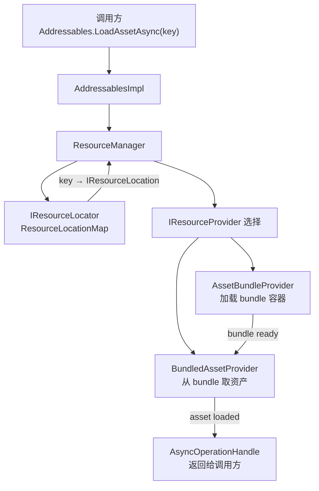
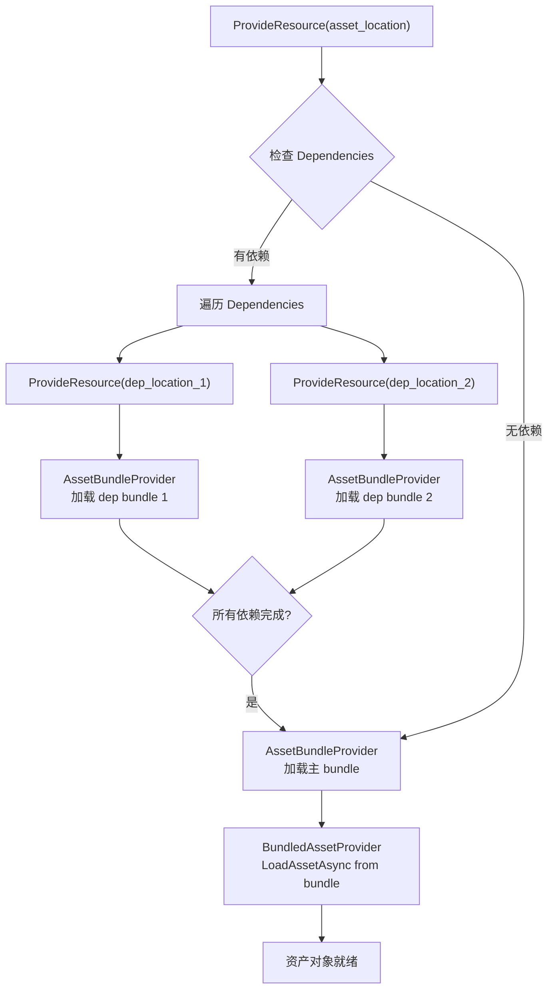
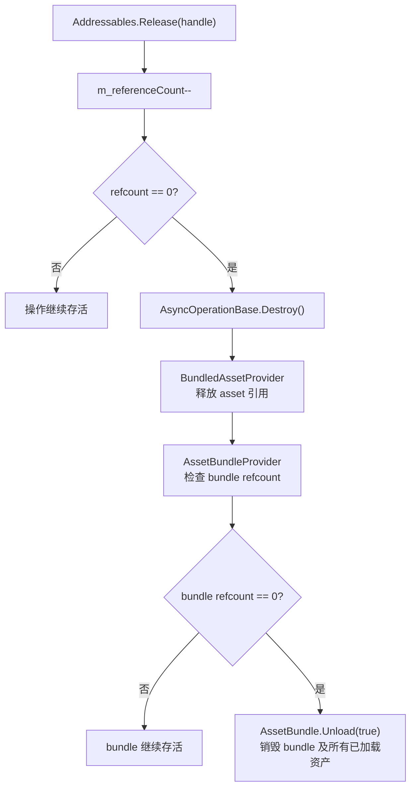

[上一篇]()把 Addressables 和 AssetBundle 的层次关系讲清了：AssetBundle 更像底层交付格式，Addressables 更像建在它之上的定位、调度和生命周期管理层。

那篇回答的是：
`它们在架构上各站哪一层。`

这一篇要回答的是：
`当你在项目里写下 Addressables.LoadAssetAsync<T>(key)，从这行代码开始，内部到底发生了什么？`

这条链路如果不拆开，很多运行时问题根本没法定位：

- handle 拿到了，为什么资源没到
- 某个 bundle 到底被谁触发的加载
- Release 以后内存为什么没下来
- catalog 更新了，为什么有些资源还是加载失败

这些问题的根因，全在 Addressables 内部链路里。
而这条链路并不短。

> **版本基线：** 本文源码分析基于 Addressables 1.21.x（com.unity.addressables）。Unity 6 随附的 Addressables 2.x 差异之处会以注记标出。

## 一、Addressables 运行时的四个核心角色

在进入链路之前，先把参与的四个核心角色立住。

如果不先分清它们各自在做什么，后面的代码路径会混成一团。

### 1. ResourceManager

全局资源调度中心。所有资源加载请求最终都汇聚到它手里。它负责：按 location 选择 provider、启动异步操作、管理操作缓存和引用计数。

源码位置：`com.unity.addressables/Runtime/ResourceManager/ResourceManager.cs`

### 2. IResourceLocator（ContentCatalogProvider → ResourceLocationMap）

定位器。它的职责是把一个 key（address、label、AssetReference 的 GUID）映射到一个或一组 `IResourceLocation`。运行时最常用的实现是 `ResourceLocationMap`，由 `ContentCatalogProvider` 在初始化时从 catalog 数据解码生成。

源码位置：`com.unity.addressables/Runtime/ResourceLocator/ResourceLocationMap.cs`

### 3. IResourceProvider（AssetBundleProvider、BundledAssetProvider）

实际干活的人。每种资源类型对应一个 provider。对于 bundle 里的资产，有两个关键 provider 形成链式关系：`AssetBundleProvider` 负责把 bundle 容器加载进来，`BundledAssetProvider` 负责从已加载的 bundle 里提取具体资产。

源码位置：
- `com.unity.addressables/Runtime/ResourceManager/ResourceProviders/AssetBundleProvider.cs`
- `com.unity.addressables/Runtime/ResourceManager/ResourceProviders/BundledAssetProvider.cs`

### 4. AsyncOperationHandle

调用方拿到的凭证。它包裹了一个 `AsyncOperationBase<T>` 实例，持有引用计数，暴露 `Completed` 回调和 `Task` 接口。它不是资源本身，而是一个操作生命周期的代理。

源码位置：`com.unity.addressables/Runtime/ResourceManager/AsyncOperations/AsyncOperationBase.cs`

四个角色的关系可以用下面这张图看清楚：



## 二、从 key 到 IResourceLocation：定位阶段

调用从这里开始。

### 1. 入口：Addressables.LoadAssetAsync

`Addressables` 是一个静态门面类，它的方法全部委托给 `AddressablesImpl` 单例。

```
Addressables.LoadAssetAsync<T>(key)
  → AddressablesImpl.LoadAssetAsync<T>(key)
    → ResourceManager.ProvideResource<T>(location, ...)
```

但在调到 `ProvideResource` 之前，`AddressablesImpl` 需要先把 key 变成 location。

### 2. Locate：从 key 查到 IResourceLocation

`AddressablesImpl` 内部会遍历已注册的 `IResourceLocator` 列表（通常只有一个），调用：

```
locator.Locate(key, typeof(T), out IList<IResourceLocation> locations)
```

这个 `Locate` 调用做的事情是：在 `ResourceLocationMap` 的内部字典里，用 key 查到一组匹配的 `IResourceLocation`。

### 3. IResourceLocation 里装了什么

一个 `IResourceLocation` 并不复杂，但它是整条链路的信息枢纽。核心字段包括：

- `InternalId`：bundle 的实际路径或 URL，比如本地路径 `{UnityEngine.AddressableAssets.Addressables.RuntimePath}/StandaloneWindows64/characters_assets_all.bundle` 或远端 URL
- `ProviderId`：声明这个 location 应该由哪个 provider 类处理，比如 `UnityEngine.ResourceManagement.ResourceProviders.AssetBundleProvider`
- `Dependencies`：一个 `List<IResourceLocation>`，列出这个位置依赖的其他 location（通常是依赖 bundle 的 location）
- `ResourceType`：这个位置最终会产出什么类型的对象

### 4. ContentCatalogData 的底层编码

Catalog 数据在磁盘上以 `ContentCatalogData` 的形式存储（catalog.json 或 catalog.bin）。它用紧凑编码来减小体积：

- `m_KeyDataString`：所有 key 的序列化字节流
- `m_BucketDataString`：哈希桶，把 key 的哈希值映射到 entry 列表的偏移
- `m_EntryDataString`：entry 数组，每个 entry 包含 InternalId 索引、ProviderId 索引、依赖 key 索引、ResourceType 索引
- `m_InternalIds`：所有 InternalId 字符串的数组

查找过程大致是：
```
key → hash → bucket → entry offset → entry → InternalId index → 实际路径
```

`ResourceLocationMap` 在 catalog 加载时把这些编码数据解析成内存字典，之后 Locate 就是一次字典查找。

定位阶段到这里结束。key 已经变成了 `IResourceLocation`，里面带着路径、provider 类型和依赖列表。

## 三、从 location 到资产对象：Provider 链

定位完成后，`ResourceManager.ProvideResource` 接管。

### 1. ResourceManager 怎么选 provider

`ResourceManager` 维护一个已注册 provider 列表。它根据 location 的 `ProviderId` 字符串匹配对应的 `IResourceProvider` 实例。

匹配逻辑在 `ResourceManager.GetResourceProvider` 里：

```
foreach (var provider in m_ResourceProviders)
    if (provider.ProviderId == location.ProviderId)
        return provider;
```

找到 provider 后，ResourceManager 创建一个 `ProviderOperation`，把 location 和 provider 绑在一起，启动异步流程。

### 2. 依赖先行：递归加载依赖 bundle

这是链路中最关键的一步。

在启动主 location 的 provider 之前，ResourceManager 会先检查 `location.Dependencies`。如果有依赖，它会对每个依赖 location 递归调用 `ProvideResource`。

也就是说，如果你要加载的资产在 bundle A 里，而 bundle A 依赖 bundle B 和 bundle C，那么实际的执行顺序是：

```
1. ProvideResource(location_B)  → AssetBundleProvider 加载 bundle B
2. ProvideResource(location_C)  → AssetBundleProvider 加载 bundle C
3. 等 B 和 C 都完成
4. ProvideResource(location_A)  → AssetBundleProvider 加载 bundle A
5. 等 A 完成
6. BundledAssetProvider 从 bundle A 里提取资产
```

ResourceManager 在这里有一个关键优化：操作缓存。如果 bundle B 已经被之前的某次加载请求加载过，它不会重新创建新的操作，而是直接复用已有的 `AsyncOperationHandle`，并递增引用计数。



### 3. AssetBundleProvider：加载 bundle 容器

`AssetBundleProvider.Provide()` 被调用时，它内部会创建一个 `AssetBundleResource` 对象来执行实际的 bundle 加载。

加载方式取决于 bundle 的位置：

**本地 bundle：**
```
AssetBundle.LoadFromFileAsync(internalId)
```
直接从本地文件系统异步读取。这是最快的路径。

**远端 bundle：**
```
UnityWebRequestAssetBundle.GetAssetBundle(internalId, cachedHash)
```
通过 UnityWebRequest 下载，同时利用 Unity 的 bundle 缓存系统。如果本地缓存命中，实际不会发起网络请求。

`AssetBundleResource` 在内部持有加载完成的 `AssetBundle` 引用。加载完成后，通过回调通知 `ProviderOperation`。

### 4. BundledAssetProvider：从 bundle 提取资产

当 bundle 容器就绪后，`BundledAssetProvider.Provide()` 开始工作。

它拿到 `AssetBundleResource` 持有的 `AssetBundle` 对象，然后调用：

```
assetBundle.LoadAssetAsync<T>(internalId)
```

这里的 `internalId` 是资产在 bundle 内部的路径（通常是 `Assets/...` 形式的路径）。

`LoadAssetAsync` 返回一个 `AssetBundleRequest`，它完成时就拿到了反序列化后的资产对象。

到这里，从 key 到可用对象的完整路径就走完了。

## 四、AsyncOperationHandle 和引用计数

调用方拿到的不是资产对象本身，而是一个 `AsyncOperationHandle<T>`。

### 1. Handle 的内部结构

每个 handle 包裹一个 `AsyncOperationBase<T>` 实例（通常是 `ProviderOperation<T>` 或 `ChainOperation<T>`）。内部操作对象维护几个关键状态：

- `m_Status`：操作状态（None / Succeeded / Failed）
- `m_Result`：加载完成后的资产对象
- `m_referenceCount`：引用计数
- `m_DestroyedAction`：引用计数归零时的清理回调

### 2. 引用计数怎么工作

每次调用 `Addressables.LoadAssetAsync` 拿到 handle，内部操作的引用计数为 1。

如果多个系统加载同一个 key，ResourceManager 的操作缓存会让它们共享同一个底层操作，每次共享都递增引用计数。

```
// 第一次加载
var handle1 = Addressables.LoadAssetAsync<GameObject>("hero_prefab");
// 内部操作 refcount = 1

// 第二次加载同一个 key
var handle2 = Addressables.LoadAssetAsync<GameObject>("hero_prefab");
// 内部操作 refcount = 2（共享同一个操作）
```

### 3. Release 和卸载链

`Addressables.Release(handle)` 做的事情：

1. 递减内部操作的 `m_referenceCount`
2. 如果 refcount 变成 0，触发操作的 `Destroy()`
3. `Destroy()` 沿着 provider 链回溯：`BundledAssetProvider` 释放 asset 引用 → `AssetBundleProvider` 检查 bundle 的引用计数 → 如果 bundle 也没有其他引用，调用 `AssetBundle.Unload(true)`

这里有两个项目里最容易踩的边界：

**忘记 Release：**
内部操作的引用计数永远不会归零，`AssetBundle.Unload` 永远不会被调用，bundle 和它里面的所有资产对象常驻内存，永不释放。

**Release 太早：**
如果系统 A 和系统 B 共用一个 bundle 里的资产，系统 A 先 Release 导致引用计数归零，`AssetBundle.Unload(true)` 被触发。这会销毁 bundle 里所有已加载的资产对象，包括系统 B 还在用的那些。系统 B 会拿到已被销毁的对象引用，表现为紫色材质、mesh 丢失或直接崩溃。



## 五、依赖链和 Catalog 更新的运行时路径

### 1. 依赖链的递归与去重

前面已经提到，`location.Dependencies` 是一个 `List<IResourceLocation>`，每个依赖本身也可能有自己的依赖。

ResourceManager 对此的处理策略是：

**递归加载：** 遍历 Dependencies 列表，对每个依赖 location 调用 `ProvideResource`。如果依赖的依赖也有 Dependencies，继续递归。

**操作级去重：** ResourceManager 维护一个以 location 为 key 的操作缓存（`m_AssetOperationCache`）。当发现某个 location 已经有一个进行中或已完成的操作时，直接返回已有操作的 handle，不会重复加载同一个 bundle。

这意味着：即使多个资产依赖同一个共享 bundle，这个 bundle 只会被加载一次。后续请求直接复用已有的加载结果，引用计数递增。

```
资产 A → 依赖 bundle_shared, bundle_a
资产 B → 依赖 bundle_shared, bundle_b

加载 A：
  1. 加载 bundle_shared (新操作，refcount=1)
  2. 加载 bundle_a (新操作，refcount=1)
  3. 从 bundle_a 提取 A

加载 B：
  1. 加载 bundle_shared (复用，refcount=2)
  2. 加载 bundle_b (新操作，refcount=1)
  3. 从 bundle_b 提取 B
```

### 2. Catalog 远程更新

Catalog 远程更新的完整流程（hash 校验 → 下载 → 替换 locator → 半更新风险）在 [Addr-02]() 中有源码级拆解，这里不再展开。

核心要点：`CheckForCatalogUpdates` 对比远端 hash，`UpdateCatalogs` 下载并替换 locator，之后必须用 `DownloadDependenciesAsync` 预下载新 bundle，三步全部成功再切换内容——否则会陷入"新 catalog + 旧 bundle"的半更新状态。

## 六、项目里最常踩的三个坑

前五节把内部链路拆完了。这一节回到项目现场，讲三个最常见的运行时问题。

### 1. Handle 忘记 Release → bundle 永不卸载 → 内存持续增长

这是项目里出现频率最高的 Addressables 问题，没有之一。

典型场景：UI 界面加载了一批图标资源，界面关闭时只销毁了 GameObject，没有 Release 对应的 handle。

结果：这些图标所在的 bundle 永远不会 `Unload`。如果界面反复打开关闭，内存会持续增长，但 Profiler 里看不到明显的泄漏源，因为对象没有被"泄漏"，它们只是没有被释放。

**诊断方法：**
打开 Addressables Event Viewer（Window → Asset Management → Addressables → Event Viewer）。它会显示每个操作的当前引用计数。如果看到某个 bundle 的 refcount 只增不减，就是忘了 Release。

**修复模式：**
对每个 `LoadAssetAsync` / `InstantiateAsync` 的返回值建立配对释放。最稳的方式是在加载方所在的生命周期（MonoBehaviour 的 OnDestroy、UI Panel 的 Close 回调）里集中 Release。

### 2. Catalog 更新半途失败 → 新 catalog + 旧 bundles → 加载报错

弱网环境下最常见：`UpdateCatalogs` 成功（catalog 文件只有几 KB），但后续 bundle 下载失败，客户端陷入"新 catalog + 旧 bundle"的半更新状态。完整的失败模式分析和安全更新代码模板见 [Addr-02 Section 5]()。

### 3. WaitForCompletion() 同步等待 → 主线程阻塞

`WaitForCompletion()` 是 Unity 2021.2+ 加入的同步等待 API。它允许你把异步操作强制变成同步：

```
var handle = Addressables.LoadAssetAsync<GameObject>(key);
var result = handle.WaitForCompletion();
```

它的内部实现非常直接：在主线程上 spin-wait，不断检查操作是否完成，直到 `Status != None`。这意味着它会完全阻塞 PlayerLoop，阻塞渲染、输入和所有其他系统。

三个关键限制：

**WebGL 完全不可用。** WebGL 是单线程环境，spin-wait 会导致浏览器挂起。Addressables 在 WebGL 上直接抛异常。

**远端资源会冻结画面。** 如果 bundle 需要从网络下载，WaitForCompletion 会阻塞主线程直到下载完成。对于几十 MB 的 bundle，这意味着画面冻结数秒甚至更长。

**依赖链的阻塞是串行的。** 如果资产有三个依赖 bundle，WaitForCompletion 会串行等待每个依赖加载完成。原本可以并行的 IO 操作被强制串行化，总耗时是各依赖耗时之和而不是最大值。

**什么时候可以考虑用：**
只在必须同步拿到资产、且确定是本地小 bundle、且不在关键帧的场景下使用。比如引擎初始化阶段加载一个小的配置资产。在常规游戏循环中应该始终使用异步路径。

---

这一篇把 Addressables 运行时从入口到出口的完整内部链路拆开了。

核心链路就是这条：
`key → IResourceLocator.Locate → IResourceLocation → ResourceManager.ProvideResource → 依赖 bundle 先行加载 → AssetBundleProvider 加载 bundle 容器 → BundledAssetProvider 从 bundle 提取资产 → AsyncOperationHandle 返回给调用方`

理解这条链路之后，再回去看那些运行时问题，定位就会清楚很多：

- 加载失败 → 先看是定位阶段（catalog 里没有这个 key），还是 provider 阶段（bundle 不存在或下载失败），还是提取阶段（bundle 里没有这个 asset path）
- 内存不释放 → 看 handle 的引用计数是不是归零了，bundle 的 Unload 有没有被触发
- 加载卡顿 → 看是不是依赖链太深，或者用了 WaitForCompletion

下一步如果想了解另一套资源管理框架在运行时的内部路径，可以等后续 YooAsset 运行时链路那篇。如果更关心异步加载在 Unity 运行时层面是怎么和引擎主循环接起来的，可以看 [异步运行时 Extra-B：Unity 桥接层｜AsyncOperation、UnityWebRequest 与 Addressables]()。
