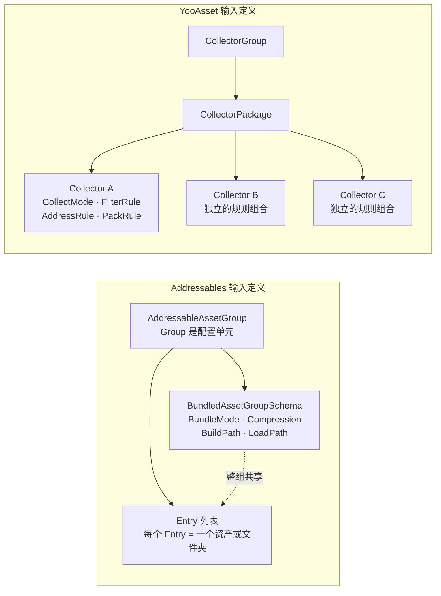
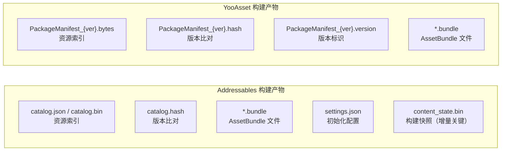
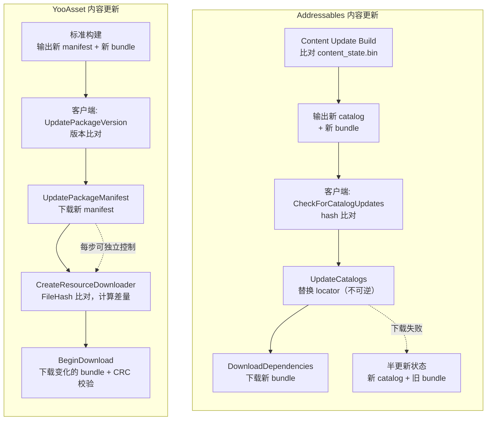

[Cmp-01]() 把两个框架的运行时调度模型放到同一组问题上对照了：定位机制、Provider 链 vs Loader 链、引用计数、异步模型。那篇解决的是"运行时结构差异在哪"。

这篇往前挪一步，追构建期。

两个框架面对的原始输入完全一样——工程里的资产文件、依赖关系和目标平台。最终输出也是同类产物——AssetBundle 文件加上一份索引元数据。中间那段"怎么定义输入、怎么组织产物、怎么做增量构建、怎么管理内容更新"，才是设计分歧真正发生的地方。

这篇沿五个维度展开对比：

1. 构建输入定义——Group Schema vs AssetBundleCollector
2. 依赖分析
3. 产物格式——Catalog vs PackageManifest
4. 增量构建机制
5. 内容更新机制

每个维度先各拆一遍结构，再放到一起比。文末给出构建期选型的判断表。

版本基线：Addressables 1.21.x（Unity 6 随附 2.x 有注记），YooAsset 2.x。

---

## 一、对比维度——构建期解决的同一组问题

不管是 Addressables 还是 YooAsset，构建期做的事情归结到底就四件：

1. **定义输入**：哪些资产要进包，按什么规则分组
2. **分析依赖**：每个资产依赖什么，共享资源怎么处理
3. **生成产物**：bundle 文件怎么切、索引元数据（catalog / manifest）怎么写
4. **支持增量**：下一次构建怎么只处理变化的部分，内容更新怎么只发差量

两个框架对这四件事的回答不同，但问题本身完全一致。差异不在"做不做"，而在"怎么做"和"把控制权交给谁"。

---

## 二、构建输入定义对比——Group Schema vs AssetBundleCollector

构建的第一步是定义"哪些资产进包，按什么规则组织"。这一步决定了后续所有环节的输入边界。两个框架的定义粒度和控制模型差异很大。

### Addressables：Group + BundledAssetGroupSchema

Addressables 的输入定义以 **Group** 为核心单元。每个 Group 是一个 `AddressableAssetGroup` ScriptableObject，包含一组资产条目和一组 Schema。

对于 bundle 构建，最关键的 Schema 是 `BundledAssetGroupSchema`，它定义了这个 Group 的所有打包参数：

| 参数 | 类型 | 职责 |
|------|------|------|
| BundleMode | enum | 打包模式：`PackTogether`（整组一个 bundle）/ `PackSeparately`（每个 entry 一个 bundle）/ `PackTogetherByLabel`（按 label 分包） |
| BundleNaming | enum | bundle 文件命名策略：文件名 hash、Group 名 hash、文件名直出 |
| BuildPath | ProfileVariable | 构建输出路径（通过 Profile 变量解析） |
| LoadPath | ProfileVariable | 运行时加载路径（本地 / 远端，通过 Profile 变量解析） |
| Compression | enum | 压缩方式：Uncompressed / LZ4 / LZMA |
| IncludeInBuild | bool | 是否参与构建 |

源码位置：`com.unity.addressables/Editor/Settings/GroupSchemas/BundledAssetGroupSchema.cs`

关键特征：**配置挂在 Group 级别**。同一个 Group 内的所有资产共享同一套 BundleMode、压缩方式、BuildPath/LoadPath。如果一个 Group 里有 100 个资产，它们的打包模式、压缩策略和本地/远端归属完全一致。

要对 Group 内部做更细的控制（比如让某些资产用不同的 BundleMode），唯一的方式是拆成多个 Group。

### YooAsset：AssetBundleCollector + 多级规则

YooAsset 的输入定义以 **AssetBundleCollector** 为核心单元。Collector 的组织结构是三级嵌套：`CollectorGroup → CollectorPackage → AssetBundleCollector`。

每个 `AssetBundleCollector` 定义一条收集规则，控制力度比 Addressables 的 Group Schema 更细：

| 参数 | 类型 | 职责 |
|------|------|------|
| CollectPath | string | 收集目录或文件路径 |
| CollectorType | enum | 主资源收集器 / 依赖资源收集器 / 静态资源收集器 |
| CollectMode | enum | 按目录 / 按文件 / 按文件（顶层目录） |
| FilterRule | IFilterRule | 过滤规则接口，可自定义哪些文件被收集 |
| AddressRule | IAddressRule | 地址生成规则接口，可自定义每个资产的加载地址 |
| PackRule | IPackRule | 打包规则接口，可自定义每个资产被打进哪个 bundle |
| UserData | string | 自定义数据透传 |

源码位置：`YooAsset/Editor/AssetBundleCollector/AssetBundleCollector.cs`

关键特征：**规则挂在 Collector 级别，且核心规则通过接口暴露**。同一个 CollectorGroup 里可以有多个 Collector，每个 Collector 有自己独立的 CollectMode、FilterRule、AddressRule 和 PackRule。

`PackRule` 尤其重要——它是 YooAsset 控制 bundle 粒度的核心。通过实现 `IPackRule` 接口，项目可以定义任意的资产到 bundle 的映射逻辑。内置的 PackRule 实现包括：`PackSeparately`（每个资产一个 bundle）、`PackDirectory`（按目录打包）、`PackTopDirectory`（按顶层目录打包）、`PackCollector`（整个 Collector 一个 bundle）、`PackShaderVariants`（Shader 变体专用）等。

### 结构差异



| 维度 | Addressables | YooAsset |
|------|-------------|---------|
| 配置粒度 | Group 级别——同组资产共享打包策略 | Collector 级别——每个 Collector 独立定义收集和打包规则 |
| bundle 粒度控制 | BundleMode 三选一（PackTogether / PackSeparately / PackTogetherByLabel） | PackRule 接口，内置多种实现，支持自定义 |
| 地址生成 | Entry 的 address 字段手动设定或通过 Simplify Name 自动简化 | AddressRule 接口，可按文件名、路径、自定义逻辑生成地址 |
| 过滤机制 | 文件夹 Entry 自动收集，可设置 label 过滤 | FilterRule 接口，可自定义哪些文件参与收集 |
| 本地/远端归属 | BuildPath / LoadPath 通过 Profile 变量，Group 级别统一 | 在 CollectorPackage 或构建参数层配置 |
| 扩展方式 | 新增自定义 GroupSchema 类继承 `AddressableAssetGroupSchema` | 实现 IPackRule / IFilterRule / IAddressRule 接口 |

工程影响：Addressables 的 Group 级别配置在小中型项目里更直观——一个 Group 就是一套完整的打包决策，配置集中不分散。但当项目规模上来，同一个目录下的资产需要不同的打包策略时，Group 会越拆越多，管理成本增长。

YooAsset 的 Collector 级别配置天然支持"一个目录下不同资产用不同规则"，但代价是配置分散——需要理解 CollectMode、FilterRule、AddressRule、PackRule 四个维度的组合关系，初学者的认知成本更高。

---

## 三、依赖分析对比

定义完输入之后，构建系统需要分析资产之间的依赖关系，决定共享资源怎么处理。这一步直接影响最终的 bundle 数量和大小。

### Addressables / SBP：CalculateAssetDependencyData → 隐式依赖提升

Addressables 的构建走 [SBP 的 task chain]()。依赖分析由 SBP 的 `CalculateAssetDependencyData` task 执行。

核心流程：

```
BuildScriptPackedMode.BuildDataImplementation()
  → ContentPipeline.BuildAssetBundles()
    → SBP task chain:
      → CalculateAssetDependencyData
        → 对每个资产调用 AssetDatabase.GetDependencies()
        → 区分 explicit（显式引用）和 implicit（间接依赖）
      → GenerateBundlePacking
        → 把资产分配到 bundle
      → GenerateBundleCommands
        → 生成写包指令
```

依赖关系在 SBP 的 `BuildLayout` 报告中体现为两类：

- **Explicit dependencies**：这个 bundle 直接包含的资产引用了哪些其他 bundle 的资产
- **Implicit dependencies**：被多个 bundle 共享但没有被任何 Group 显式声明的资产

Addressables 对隐式依赖的默认处理是：如果一个资产被多个 bundle 引用但不属于任何 Group，它会被**重复打进每个引用它的 bundle**。这就是社区里讨论最多的"隐式依赖导致重复"问题。

解决方式是手动把共享资产拉进一个专门的 Group（"提升"为显式依赖），或者使用 Addressables 的 **Analyze Rules**（`CheckBundleDupeDependencies`）来检测重复并自动创建新 Group。

源码位置：
- `com.unity.scriptablebuildpipeline/Editor/Tasks/CalculateAssetDependencyData.cs`
- `com.unity.addressables/Editor/Build/AnalyzeRules/CheckBundleDupeDependencies.cs`

### YooAsset：Collector 依赖分析 → PackRule 控制归属

YooAsset 的依赖分析在构建期由 Collector 系统完成。核心逻辑在 `AssetBundleCollectorSetting` 的构建流程中。

流程：

```
AssetBundleBuilder.Run()
  → AssetBundleCollectorSetting.GetPackageAssets()
    → 每个 Collector 收集资产列表
    → 对每个资产分析依赖
    → 依赖资产通过 CollectorType.DependAssetCollector 纳入构建
  → BuildBundleInfo()
    → 根据 PackRule 把资产分配到 bundle
    → 共享依赖的 bundle 归属由 PackRule 决定
```

YooAsset 处理共享依赖的方式不同于 Addressables 的"隐式 → 显式提升"模型。它通过 `CollectorType` 区分：

- `MainAssetCollector`：主资源收集器，收集的资产作为可加载资产
- `DependAssetCollector`：依赖资源收集器，收集的资产只作为其他资产的依赖，自身不可被直接加载
- `StaticAssetCollector`：静态资源收集器，资产打进 bundle 但不参与地址注册

依赖资产的 bundle 归属由 PackRule 决定。如果一个共享贴图被多个主资产引用，项目可以通过设置一个 `DependAssetCollector` + `PackDirectory` 的 PackRule，让所有共享贴图按目录归入独立 bundle，避免重复。

构建完成后，每个 `PackageAsset` 的 `DependBundleIDs` 数组记录了这个资产依赖的所有 bundle 索引。[Yoo-02]() 已经拆过这个数据结构——它是一个扁平的 `int[]`，构建期就把传递依赖展平了，运行时不需要递归。

源码位置：
- `YooAsset/Editor/AssetBundleCollector/AssetBundleCollectorSetting.cs`
- `YooAsset/Editor/AssetBundleBuilder/AssetBundleBuilder.cs`

### 对照

| 维度 | Addressables / SBP | YooAsset |
|------|-------------------|---------|
| 依赖分析执行者 | SBP 的 `CalculateAssetDependencyData` task | Collector 系统的构建期分析 |
| 依赖数据格式 | `IResourceLocation.Dependencies`（递归 location 对象列表） | `PackageAsset.DependBundleIDs`（`int[]`，构建期展平） |
| 共享依赖默认行为 | 未被 Group 收集的共享资产默认重复打入引用方 bundle | 通过 `DependAssetCollector` 显式收集，PackRule 控制归属 |
| 重复检测 | 事后检测：`CheckBundleDupeDependencies` Analyze Rule | 事前避免：Collector 类型 + PackRule 在定义阶段就确定归属 |
| 依赖链深度 | 运行时可能有多级间接依赖 | 构建期展平为一级列表 |

工程影响：Addressables 的隐式依赖问题是大型项目里最常见的 bundle 膨胀根因之一。它的设计哲学是"默认简单，出问题再修"——不做过多自动处理，但提供 Analyze Rule 事后检测。这在中小项目里没问题，但当资产量上万时，重复依赖的检测和修复会变成持续的维护成本。

YooAsset 的 Collector 类型分层把共享依赖的处理"前置"了——在定义阶段就区分主资源和依赖资源，通过 PackRule 控制归属。代价是定义阶段的认知成本更高，但避免了后期大规模的重复依赖清理。

---

## 四、产物格式对比——Catalog vs PackageManifest

构建完成后，两个框架各自输出一组文件。这里不重复 [Addr-02]() 和 [Yoo-02]() 已经深入拆过的 catalog / manifest 内部结构，只做产物级别的对照。

### Addressables 构建产物

一次 `BuildScriptPackedMode` 构建完成后，输出目录里包含：

| 文件 | 用途 |
|------|------|
| `catalog.json` / `catalog.bin` | 资源索引元数据。1.x 默认 JSON + Base64 编码，2.x 默认纯二进制 |
| `catalog.hash` | catalog 文件的 hash 值，用于远端版本比对 |
| `*.bundle` | AssetBundle 文件 |
| `settings.json` | 运行时初始化配置（catalog 路径、provider 注册信息） |
| `addressables_content_state.bin` | 构建快照——记录本次构建时每个资产的 GUID、hash 和 Group 归属，用于后续 Content Update Build 的差量比对 |
| `link.xml`（可选） | 防 IL2CPP 代码裁剪的配置 |

其中 `addressables_content_state.bin` 是增量构建和内容更新的关键文件，后面两节会重点展开。

### YooAsset 构建产物

一次 YooAsset 构建完成后，输出目录里包含：

| 文件 | 用途 |
|------|------|
| `PackageManifest_{version}.bytes` | 资源索引元数据，二进制序列化的 C# 对象 |
| `PackageManifest_{version}.hash` | manifest 文件的 hash 值，用于远端版本比对 |
| `PackageManifest_{version}.version` | 版本标识文件 |
| `*.bundle` | AssetBundle 文件 |
| 构建报告（可选） | 构建统计信息 |

### 产物级对照



| 维度 | Addressables | YooAsset |
|------|-------------|---------|
| 索引格式 | `ContentCatalogData`：JSON + Base64（1.x）/ 二进制（2.x） | `PackageManifest`：二进制 C# 序列化 |
| 版本比对文件 | `catalog.hash`（单一文件 hash） | `PackageManifest_{ver}.hash` + `.version`（hash + 版本号分离） |
| 构建快照 | `content_state.bin`——记录完整的资产级构建状态 | 无独立快照文件——版本差异通过 manifest 之间的 FileHash 比对 |
| 初始化配置 | `settings.json`——catalog 路径、provider 注册 | 配置内嵌在代码初始化参数中 |
| 版本标识方式 | catalog 文件名固定，通过 hash 文件区分版本 | manifest 文件名包含版本号，版本语义在文件名中 |
| 产物文件数 | 较多（catalog + hash + settings + content_state + bundles） | 较少（manifest + hash + version + bundles） |

工程影响：Addressables 的 `content_state.bin` 是一个关键的设计选择——它让增量构建成为可能，但也引入了一个强依赖：丢失这个文件就无法做 Content Update Build。YooAsset 不依赖独立的构建快照文件，版本差异完全通过比对两个 manifest 的 bundle hash 完成，对构建环境的状态依赖更小。

---

## 五、增量构建机制对比

增量构建解决的问题是：资源改了一部分，怎么只重新构建变化的部分，而不是全量重来。

### Addressables：content_state.bin + Content Update Build

Addressables 的增量构建分两个路径：

**SBP 级别的构建缓存**。SBP 维护一个 `BuildCache`（默认在 `Library/BuildCache`），记录每个 bundle 的输入指纹（资产 hash + 依赖 hash + 构建参数 hash）。下一次构建时，SBP 检查缓存指纹是否匹配——匹配的 bundle 跳过重新构建，直接复用缓存。这是底层执行层的增量。

**Addressables 级别的内容更新**。`addressables_content_state.bin` 记录了上一次 "New Build" 的完整构建状态——每个资产的 GUID、content hash、所属 Group、bundle 名称。当调用 **Content Update Build** 时，Addressables 把当前工程状态和 `content_state.bin` 里的记录逐项比对：

```
Content Update Build 的比对逻辑：
  1. 读取 content_state.bin 中的资产列表
  2. 对比当前工程中每个资产的 content hash
  3. hash 变化 → 标记为"需要更新"
  4. 检查变化资产所属 Group 的标记：
     - "Cannot Change Post Release" → 保留旧 bundle 不动
     - "Can Change Post Release" → 生成新 bundle 替换
  5. 生成新 catalog 指向新旧混合的 bundle 集合
```

这里的关键设计是 Group 上的两个标记：

- **Cannot Change Post Release**（默认）：这个 Group 的内容在 Content Update Build 时不会被修改。如果其中的资产发生了变化，Addressables 会把变化的资产"提升"到一个临时的新 Group，打成新 bundle。旧 bundle 保持不变。
- **Can Change Post Release**：这个 Group 的内容可以在 Content Update Build 时整体重新打包。

源码位置：
- `com.unity.addressables/Editor/Build/DataBuilders/BuildScriptPackedMode.cs`
- `com.unity.addressables/Editor/Build/ContentUpdateScript.cs`

> **Unity 6 注记**：Addressables 2.x 对 Content Update Build 流程做了调整。`content_state.bin` 仍然存在，但 Group 标记的默认行为和 UI 措辞有变化。核心的差量比对逻辑未改变。

### YooAsset：标准构建 + manifest hash 比对

YooAsset 没有 Addressables 意义上的 "Content Update Build" 概念。它的增量机制更简单：

**构建级别**：每次构建都是标准的全量构建流程。YooAsset 的构建器（`AssetBundleBuilder`）不依赖上一次构建的快照文件。

**更新级别**：版本差异通过运行时比对两个 manifest 完成。[Yoo-02]() 已经拆过这个三层校验：

```
1. PackageVersion 比对 → 有没有新版本
2. 逐 bundle 比对 FileHash → 哪些 bundle 变了
3. 下载后 CRC 校验 → 下载有没有坏
```

差量检测发生在运行时而不是构建时。构建时只管把当前版本的完整 manifest 和 bundle 输出出来。运行时下载新 manifest 后，和本地已缓存的 manifest 逐个 bundle 比对 FileHash，只下载 hash 变化的 bundle。

### 对照

| 维度 | Addressables | YooAsset |
|------|-------------|---------|
| 增量构建依赖 | `content_state.bin`（必须保留上一次 New Build 的快照） | 无独立快照依赖 |
| 差量计算时机 | 构建时（Content Update Build 比对 content_state.bin） | 运行时（新旧 manifest 的 FileHash 比对） |
| 构建流程种类 | 两种：New Build（全量）+ Content Update Build（增量） | 一种：标准构建（全量），增量在运行时解决 |
| 丢失快照的后果 | 无法做 Content Update Build，必须重新 New Build → 所有客户端全量重下 | 无影响——每次构建输出完整 manifest，运行时自行比对 |
| SBP 构建缓存 | 支持（`Library/BuildCache`），加速 bundle 重建 | 不走 SBP，构建缓存逻辑由 YooAsset 自行管理 |
| CI/CD 友好度 | content_state.bin 需要在 CI 环境中持久化存储，丢失即灾难 | 无需持久化构建状态文件，CI 每次独立构建即可 |

工程影响：`content_state.bin` 的存在是 Addressables 增量构建的基石，也是最大的操作风险点。如果 CI 环境没有正确保存这个文件（比如使用了无状态的构建节点、git clean 清掉了 Library 目录），Content Update Build 就无法执行。这意味着必须把 `content_state.bin` 纳入版本管理或 CI 制品存储。

YooAsset 的模型把增量判断推到了运行时——构建端不需要维护任何跨版本的状态文件。每次构建输出完整的 manifest 和 bundle，运行时通过比对 FileHash 自行决定哪些需要下载。这让 CI 流水线的构建节点可以是完全无状态的，但代价是每次构建都是全量构建（SBP 级别的构建缓存不适用）。

---

## 六、内容更新机制对比

增量构建解决的是"构建端怎么省事"。内容更新解决的是"线上玩家怎么拿到新内容"。这是两个不同的问题。

### Addressables：Content Update Build → 新 catalog 指向新旧混合 bundle

Addressables 的内容更新流程在 [Addr-02]() 的第五节已经详细拆过。这里从构建期的视角补充 Content Update Build 的产出结构：

```
Content Update Build 产出：
  1. 新 catalog.json / catalog.bin
     → m_InternalIds 里混合了旧 bundle 路径和新 bundle 路径
  2. 新 catalog.hash
     → 和旧 hash 不同，触发客户端更新
  3. 新 bundle 文件
     → 只有变化的资产对应的 bundle 是新的
  4. 更新后的 content_state.bin
     → 记录新的构建状态，为下一次 Content Update Build 做准备
```

客户端更新链路：

```
客户端启动
  → CheckForCatalogUpdates()
    → 下载远端 catalog.hash
    → 和本地 hash 比对
    → 不同 → 有更新
  → UpdateCatalogs()
    → 下载新 catalog
    → 替换 IResourceLocator
    → 新 catalog 的 InternalIds 指向新旧混合的 bundle 路径
  → GetDownloadSizeAsync() / DownloadDependenciesAsync()
    → 只下载新 bundle（旧 bundle 已在缓存中）
```

关键的 Group 标记语义：

- **Cannot Change Post Release** Group 里的资产如果变化了，变化的部分会被移到一个新 bundle，旧 bundle 保持原样。新 catalog 里这些资产的 InternalId 指向新 bundle 路径。没有变化的资产仍然指向旧 bundle。
- **Can Change Post Release** Group 里的资产如果变化了，整个 Group 重新打包出新 bundle，旧 bundle 完全被替代。

**半更新状态的风险**：如果 `UpdateCatalogs()` 成功但后续 bundle 下载失败，客户端会进入"新 catalog + 旧 bundle"的不一致状态。新 catalog 里的 InternalId 指向还不存在于本地的 bundle，后续 `LoadAssetAsync` 会失败。Addr-02 已经详细讲过这个问题和恢复策略。

### YooAsset：新版本构建 → 新 manifest → 运行时差量下载

YooAsset 的内容更新流程在概念上更简单：

```
新版本构建（标准构建流程）
  → 输出新 PackageManifest_{newVer}.bytes + 新 bundle 文件
  → 部署到 CDN

客户端更新：
  → UpdatePackageVersionAsync()
    → 下载远端版本文件
    → 和本地 PackageVersion 比对
    → 不同 → 有新版本
  → UpdatePackageManifestAsync()
    → 下载新 manifest
  → CreateResourceDownloader()
    → 新旧 manifest 逐 bundle 比对 FileHash
    → hash 不同的 bundle 加入下载队列
  → BeginDownload()
    → 只下载变化的 bundle
    → 每个 bundle 下载后 CRC 校验
    → 校验通过 → 写入缓存
```

YooAsset 的内容更新有一个结构性优势：**manifest 更新和 bundle 下载是分离的三步操作**。项目代码可以在每一步之间插入自定义逻辑（版本检查后决定是否更新、manifest 更新后计算下载量展示给玩家、下载过程中展示进度和重试）。

这和 Addressables 的区别在于：Addressables 的 `UpdateCatalogs()` 是一步完成 catalog 替换，替换之后新 locator 立刻生效。如果后续 bundle 没下完，就进入半更新状态。YooAsset 的三步分离让项目在 manifest 更新和 bundle 下载之间有明确的控制点。

### 对照



| 维度 | Addressables | YooAsset |
|------|-------------|---------|
| 构建流程 | 专用的 Content Update Build（依赖 content_state.bin） | 标准构建，无需特殊流程 |
| 差量计算 | 构建时：content_state.bin 比对 → 只打变化的 bundle | 运行时：新旧 manifest 的 FileHash 比对 → 只下载变化的 bundle |
| 客户端更新步骤 | CheckForCatalogUpdates → UpdateCatalogs → DownloadDependencies | UpdatePackageVersion → UpdatePackageManifest → CreateResourceDownloader → BeginDownload |
| catalog/manifest 替换时机 | UpdateCatalogs 替换后立刻生效（不可逆） | manifest 更新和 bundle 下载分离，每步独立可控 |
| 半更新风险 | 高——catalog 替换不可逆，bundle 未下完即进入不一致状态 | 低——三步分离，可以在 manifest 更新后、bundle 下载前做检查 |
| Group 标记语义 | Cannot Change / Can Change Post Release 影响更新行为 | 无等价概念——所有内容按版本整体管理 |

---

## 七、判断表——构建期选型

以下判断覆盖构建输入定义、产物格式、增量构建和内容更新四个维度。运行时调度差异见 [Cmp-01]()。

| 项目条件 | 推荐方向 | 原因 |
|----------|---------|------|
| 构建管线复杂度要低，团队对 Unity 官方工具链熟悉 | Addressables | Group + Schema 的配置模型直观，和 Unity Editor 面板深度集成，Analyze Rules 提供事后检测能力 |
| 需要对每个目录、每类资产定义不同的打包规则 | YooAsset | Collector 级别的 PackRule / FilterRule / AddressRule 接口提供了更细粒度的声明式控制 |
| CI/CD 环境是无状态构建节点（容器化、临时 VM） | YooAsset | 不依赖 `content_state.bin`，每次构建独立输出完整产物，无需持久化构建状态文件 |
| CI/CD 环境有持久化存储，构建状态可跨版本保留 | 两者皆可 | Addressables 的 content_state.bin 可安全保存，Content Update Build 的差量能力可用 |
| 增量构建可靠性是硬需求（不允许出现"全量重下"） | Addressables（谨慎） | Content Update Build 提供显式的资产级差量，但前提是 content_state.bin 不丢失。需要严格的 CI 文件管理 |
| 增量更新可靠性是硬需求，但不想依赖构建快照 | YooAsset | 运行时 FileHash 比对天然增量，不依赖构建端状态文件 |
| 内容更新需要"不可变层 + 可变层"的混合策略 | Addressables | Cannot Change / Can Change Post Release 的 Group 标记提供了原生的分层更新语义 |
| 内容更新需要简单明确的全版本管理 | YooAsset | 每次构建输出完整版本，运行时自行差量，没有分层更新的概念负担 |
| 共享依赖的处理需要前置控制（构建前就确定归属） | YooAsset | DependAssetCollector + PackRule 在定义阶段就解决共享资源的 bundle 归属 |
| 共享依赖的处理可以事后检测和修复 | Addressables | Analyze Rules（CheckBundleDupeDependencies）提供事后检测和自动修复能力 |
| 团队学习成本是关键考量 | Addressables | Group + Schema 的心智模型更简单，"一个 Group = 一套打包配置"容易理解 |
| 团队有资源管理基础设施经验，愿意投入配置规则 | YooAsset | Collector 的规则组合提供了更多控制维度，但需要理解 CollectMode / FilterRule / AddressRule / PackRule 的交互 |

---

这篇把 Addressables 和 YooAsset 的构建期从输入定义到产物输出到增量更新逐项对照了。核心差异可以压成三句话：

1. **输入定义的控制粒度不同**——Addressables 在 Group 级别配置，直观但粒度粗；YooAsset 在 Collector 级别配置，灵活但认知成本高。

2. **增量构建的状态依赖不同**——Addressables 依赖 `content_state.bin` 做构建时差量，丢失即灾难；YooAsset 把差量推到运行时 manifest 比对，构建端无状态。

3. **内容更新的操作模型不同**——Addressables 的 catalog 替换是不可逆的单步操作，有半更新风险；YooAsset 的三步分离（版本检查 → manifest 更新 → bundle 下载）给项目更多控制点。

下一步如果想看版本控制、缓存管理、下载治理和回滚机制的对比，可以等 Cmp-03。如果想回去看两套系统各自的运行时调度差异，入口在 [Cmp-01]()。
