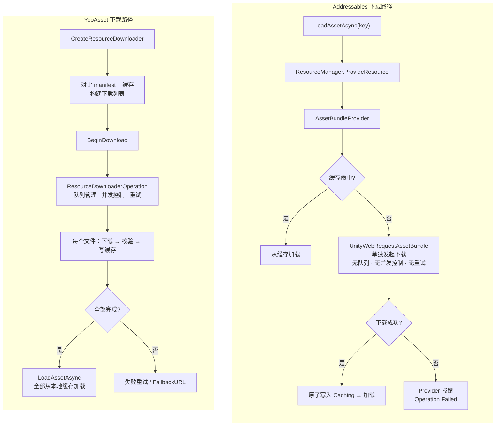
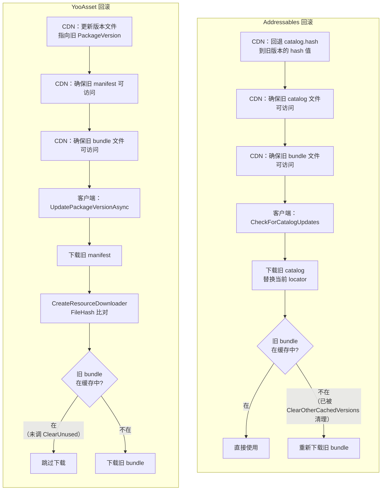
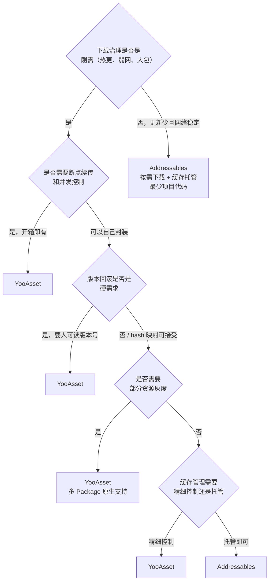

[Cmp-01]() 把两个框架的运行时调度模型放到同一组问题上对照了。[Cmp-02]() 把构建输入、产物格式和增量更新拆开比了一遍。

那两篇回答的是"资源怎么加载"和"资源怎么打包"。

这篇要回答第三个问题：**资源上线之后怎么管**。

版本号体系、缓存清理、下载队列、断点续传、回滚、多环境发布——这些能力不决定项目能不能跑起来，但决定项目能不能稳定地跑下去。这是运行时和构建期之后的第三个选型维度，也是把"能用"和"能上线"拉开差距的那一层。

本文沿七个维度展开对比：

1. 什么是"治理能力"
2. 版本号体系
3. 缓存管理
4. 下载治理
5. 断点续传
6. 回滚机制
7. 多环境发布

文末给出综合治理能力矩阵和工程判断表。

> **版本基线：** 本文基于 Addressables 1.21.x 和 YooAsset 2.x 源码。

---

## 一、什么是"治理能力"

运行时调度解决的是"一个 key 怎么变成一个可用对象"。构建期解决的是"资产怎么变成 bundle 产物"。治理解决的是第三组问题：

`资源交付到设备之后，版本怎么管、缓存怎么清、下载怎么控、出了问题怎么回退。`

具体展开，治理层覆盖六个子问题：

| 子问题 | 含义 |
|--------|------|
| 版本号体系 | 怎么标识一个版本、怎么判断"有没有更新" |
| 缓存管理 | 已下载的 bundle 存在哪、怎么清理旧版本、磁盘空间怎么控制 |
| 下载控制 | 下载队列管理、并发控制、进度汇报 |
| 断点续传 | 下载中断后能否继续、已下载数据是否保留 |
| 回滚 | 线上版本出了问题，怎么退回上一个已知可用的版本 |
| 多环境发布 | 开发 / 测试 / 灰度 / 正式环境怎么切换资源来源 |

为什么治理能力是分水岭？因为一个资源系统在开发环境里"能跑"是最低标准。上了线之后，玩家在弱网环境下断了、CDN 推了错误的版本、QA 环境需要和线上隔离——这些才是真正考验框架的场景。一个框架在这些维度上的默认能力越完善，项目需要自己补的代码就越少，踩坑的概率也越低。

---

## 二、版本号体系对比

版本号是治理层的基础。项目需要回答"客户端当前是哪个版本""CDN 上有没有新版本""回滚到哪个版本"——所有这些问题的前提都是：系统有一套明确的版本标识机制。

### Addressables：content hash，不是版本号

Addressables 没有显式的版本号概念。它的版本判定基于内容哈希：

**catalog.hash 文件**：每次构建生成一个 `catalog.hash` 文件，内容是 catalog 文件的 hash 值。客户端调用 `CheckForCatalogUpdates()` 时，下载远端的 `catalog.hash` 和本地比对——hash 不同即"有更新"。

**bundle 文件名 hash**：每个 bundle 的文件名可以包含内容 hash（由 `BundledAssetGroupSchema.BundleNaming` 控制）。bundle 内容变了，hash 变了，文件名也变了。缓存系统通过文件名 hash 区分同一个 bundle 的不同版本。

```
Addressables 的版本标识：
  版本 = catalog.hash 的值（如 "a1b2c3d4..."）
  更新判定 = 远端 hash ≠ 本地 hash
  bundle 版本 = 文件名中的 hash 后缀
```

这是一套 **content-addressable** 的模型——不需要人工维护版本号，内容变了 hash 自然变。好处是不可能出现"版本号对了但内容是旧的"这类人为错误。

源码位置：
- `com.unity.addressables/Runtime/Initialization/AddressablesImpl.cs`（CheckForCatalogUpdates）
- `com.unity.addressables/Editor/Settings/GroupSchemas/BundledAssetGroupSchema.cs`（BundleNaming）

### YooAsset：显式 PackageVersion + FileHash

YooAsset 同时使用显式版本号和内容哈希，两层并行：

**PackageVersion**：一个由项目定义的版本字符串（如 `"1.0.0"`, `"2024031501"`），嵌入在 manifest 文件名中：`PackageManifest_{version}.bytes`。版本号的格式完全由项目决定——YooAsset 不强制语义化版本。

**per-bundle FileHash**：每个 `PackageBundle` 记录了自己的 `FileHash`。更新时逐 bundle 比对 hash，只下载变化的文件。

**PackageCRC**：manifest 文件自身的 CRC 校验，确保传输完整性。

```
YooAsset 的版本标识：
  版本 = PackageVersion 字符串（项目定义）
  更新判定 = 远端 PackageVersion ≠ 本地 PackageVersion
  bundle 版本 = PackageBundle.FileHash
  manifest 完整性 = PackageCRC
```

这是一套 **explicit versioning + content hash 混合** 的模型。PackageVersion 面向人——运维人员能一眼看出"这是 3 月 15 号的第一个构建"；FileHash 面向机器——精确判定每个 bundle 是否需要更新。

源码位置：
- `YooAsset/Runtime/PackageSystem/PackageManifest.cs`
- `YooAsset/Runtime/PackageSystem/Operations/UpdatePackageVersionOperation.cs`

### 并排对照

| 维度 | Addressables | YooAsset |
|------|-------------|---------|
| 版本标识 | catalog.hash（纯内容哈希，无人可读版本号） | PackageVersion 字符串（项目自定义） + FileHash |
| 更新判定 | 远端 catalog.hash ≠ 本地 hash | 远端 PackageVersion ≠ 本地版本 |
| bundle 级版本 | 文件名中的 hash 后缀 | PackageBundle.FileHash 字段 |
| 校验层 | 引擎内置 CRC（`UnityWebRequestAssetBundle` 内部） | 三重校验：FileSize + FileCRC + FileHash |
| CDN 运维可读性 | 低——CDN 上看到的是 hash 字符串，和构建版本无直接关联 | 高——manifest 文件名包含版本号，CDN 目录可按版本组织 |
| 版本号维护成本 | 无——内容变 hash 自动变 | 需要项目维护版本号生成策略（CI 自动生成或手动指定） |
| 回滚指向性 | 回滚到"某个 hash"——需要记录 hash 和发布时间的对应关系 | 回滚到"某个版本号"——直接指定 PackageVersion |

工程影响：Addressables 的纯哈希模型在 CDN 运维场景下有一个实际痛点——当运维人员需要在 CDN 控制台上找到"上周五发的那个版本"时，面对的是一串 hash 字符串，没有人类可读的版本标识。项目需要自己在 CI 流水线或发布系统中维护"构建时间 → catalog.hash"的映射表。

YooAsset 的显式版本号让这件事简单得多——manifest 文件名就是版本号，CDN 目录可以直接按版本号组织。但代价是项目需要维护版本号的生成策略，确保不同构建产生不同的版本号。

---

## 三、缓存管理对比

资源下载到设备后，缓存管理接手。它负责三件事：把 bundle 文件存起来、判断缓存是否有效、清理不再需要的旧文件。

### Addressables：委托给 Unity Caching API

Addressables 不自管缓存。它的远程 bundle 下载走 `UnityWebRequestAssetBundle` + `DownloadHandlerAssetBundle`，数据直接写入 Unity 引擎的 `Caching` 系统。

`Caching` API 提供的能力：

- **LRU 淘汰**：当缓存空间超过 `Caching.maximumAvailableDiskSpace` 设定的上限时，自动按最近最少使用的顺序淘汰旧缓存。
- **按版本清理**：`Caching.ClearOtherCachedVersions(bundleName)` 清理同一个 bundle name 的旧版本，保留当前版本。
- **全量清理**：`Caching.ClearCache()` 清空所有缓存。
- **多缓存路径**：支持配置多个缓存目录（`Caching.AddCache`），但实际使用场景有限。

项目层面对单个 bundle 的缓存没有直接操作权——不能遍历缓存目录、不能读取单个缓存文件的元数据、不能删除指定 hash 的特定 bundle。引擎管理缓存目录的内部结构，路径和布局对应用层不透明。

源码位置：`com.unity.addressables/Runtime/ResourceManager/ResourceProviders/AssetBundleProvider.cs`（下载 → 缓存的入口）

### YooAsset：自管 CacheSystem

[Yoo-03]() 已经把 `CacheSystem` 的磁盘结构和索引机制拆到了字段级别。这里不重复内部实现，只提取对比需要的关键特征。

YooAsset 的缓存完全由应用层自管：

```
{PersistentDataPath}/YooAsset/{PackageName}/CacheFiles/
├── {BundleGUID}/
│   ├── __data        ← 实际的 bundle 文件
│   └── __info        ← 元数据（FileHash、FileCRC、FileSize）
```

**索引机制**：`CacheSystem` 初始化时扫描 `CacheFiles/` 目录，读取每个 `__info` 文件构建内存字典 `_cacheRecords`。判断某个 bundle 是否已缓存就是一次字典查找。

**清理 API**：`ClearUnusedCacheFilesAsync()` 遍历所有缓存条目，删除当前 manifest 中不存在的 FileHash 对应的文件。

**控制力**：项目可以遍历缓存目录、读取元数据、删除指定 bundle、统计总磁盘占用——全部在应用层完成。

### 对照表

| 维度 | Addressables | YooAsset |
|------|-------------|---------|
| 缓存管理者 | Unity `Caching` API（引擎层） | `CacheSystem`（应用层自管） |
| 缓存目录结构 | 引擎内部管理，应用层不透明 | `{BundleGUID}/__data + __info`，结构公开 |
| 缓存索引 | 引擎内部维护 | 启动时扫描 `__info` 文件，构建内存字典 |
| "已下载" vs "下载中" | 原子写入——要么完整存在，要么完全不存在 | `__data` + `__info` = 已下载；`.temp` 文件 = 下载中 |
| 清理策略 | LRU 自动淘汰 + `ClearOtherCachedVersions` + `Caching.maximumAvailableDiskSpace` | 项目显式调用 `ClearUnusedCacheFilesAsync`，无自动淘汰 |
| 版本共存 | `Caching` 支持同一 bundle 的多个版本并存（不同 hash），LRU 管理 | 同一 bundle 只保留最新版本的缓存，旧版本在 `ClearUnused` 时删除 |
| 磁盘用量监控 | `Caching.currentCacheForWriting.spaceFree`（引擎提供） | 项目自行统计 `CacheFiles/` 目录大小 |
| 单文件操作 | 不支持——引擎管理 | 支持——可遍历、读取、删除单个缓存条目 |

工程影响：Addressables 的缓存托管模式胜在省心——设一个 `maximumAvailableDiskSpace` 上限，引擎自动用 LRU 淘汰旧缓存，项目不需要写任何清理逻辑。但当项目需要精细控制时（比如按 tag 分级清理、在回滚场景下保留特定版本的缓存），`Caching` API 的粒度不够。

YooAsset 的自管模式胜在控制力——清什么、留什么、什么时候清，完全由项目代码决定。但代价是项目必须自己规划清理策略。如果忘了调 `ClearUnusedCacheFilesAsync`，旧缓存会无限增长。

---

## 四、下载治理对比

下载治理是治理层差异最大的维度。这里不重复 [Yoo-03]() 和 [Case-01]() 已经拆过的内部实现，只做结构对比。

### Addressables：没有下载层

严格地说，Addressables 没有独立的"下载层"。远程 bundle 的获取是加载链路的一部分——`AssetBundleProvider` 内部通过 `UnityWebRequestAssetBundle` 发起请求，调用方无法感知这次 `LoadAssetAsync` 是走了本地缓存还是触发了网络下载。

这意味着：

- **无内置队列**：每个 `AssetBundleProvider` 独立发起请求，没有统一的队列管理。
- **无并发控制**：并发数由 `UnityWebRequest` 的全局连接池限制，项目层面无法配置。
- **无进度汇总**：要知道"所有待下载资源的总进度"，需要项目自己汇总多个 `AsyncOperationHandle` 的 `PercentComplete`。
- **无失败重试**：单个 bundle 下载失败后，`AssetBundleProvider` 直接报错，不会自动重试。
- **无 URL 容灾**：默认只有一个加载路径（由 `BundledAssetGroupSchema.LoadPath` 决定）。

Addressables 提供的补救工具是 `DownloadDependenciesAsync(key)` 和 `GetDownloadSizeAsync(key)`——前者预下载指定 key 的所有依赖 bundle，后者查询需要下载的总大小。但这两个 API 仍然不提供队列管理或并发控制。

项目如果需要完整的下载治理（队列、并发、重试、进度、容灾），需要在 Addressables 之上自己封装一层 `IResourceProvider`，或者在外部用 `GetDownloadSizeAsync` + `DownloadDependenciesAsync` 自行编排。

源码位置：`com.unity.addressables/Runtime/ResourceManager/ResourceProviders/AssetBundleProvider.cs`

### YooAsset：完整的下载治理层

YooAsset 把下载作为一个独立阶段，由 `ResourceDownloaderOperation` 统一管理。[Yoo-03]() 已经拆过它的三态队列（`_waitingList` → `_downloadingList` → `_succeedList`）和调度逻辑。关键能力：

- **队列管理**：所有待下载 bundle 统一排队，按顺序调度。
- **并发控制**：`downloadingMaxNum` 参数显式控制最大并发数。
- **进度汇报**：`TotalDownloadCount`、`TotalDownloadBytes`、`CurrentDownloadBytes`、`Progress` 直接暴露。
- **失败重试**：`failedTryAgain` 参数配置重试次数，失败任务自动回到等待队列。
- **双 URL 容灾**：`RemoteMainURL` + `RemoteFallbackURL`，主 URL 失败自动切换备用。

### 并列流程图



### 对照表

| 维度 | Addressables | YooAsset |
|------|-------------|---------|
| 下载时机 | 加载时按需触发（隐式） | 加载前显式阶段（三步分离） |
| 队列管理 | 无 | 三态队列：等待 → 下载中 → 完成 |
| 并发控制 | 无内置控制 | `downloadingMaxNum` 显式配置 |
| 进度汇报 | 需要自行汇总多个 handle 的 `PercentComplete` | `Progress`、`TotalDownloadBytes`、`CurrentDownloadBytes` 直接暴露 |
| 失败重试 | 无内置重试 | `failedTryAgain` 参数，自动回队列重试 |
| URL 容灾 | 无内置容灾，需自定义 Provider | `RemoteMainURL` + `RemoteFallbackURL` 双 URL |
| 下载 + 加载耦合度 | 高——下载是加载链路的一部分 | 低——下载和加载是独立阶段 |

这是 YooAsset 在治理层优势最明显的维度。Addressables 的设计哲学是把下载透明化——开发者调用 `LoadAssetAsync`，框架在幕后处理一切。这在理想网络环境下体验很好，但在移动端热更场景（弱网、大包、需要进度 UI）下，透明化反而变成了限制。

---

## 五、断点续传对比

[Case-01]() 已经从生产场景完整追了一遍两个框架在下载中断时的表现。这里只提取结构对比的关键差异。

### Addressables：原子写入，无断点续传

`DownloadHandlerAssetBundle` 的工作方式是原子写入——下载完成并校验通过后整体写入 `Caching` 系统。下载过程中的数据存在内部缓冲区，中断时缓冲区丢弃。

结果：一个 bundle 不管下了多少，中断后进度归零。

### YooAsset：.temp 文件 + HTTP Range header

下载中的数据写入 `.temp` 临时文件。下次启动时检测到 `.temp` 文件，通过 HTTP Range header 从断点继续。下载完成后校验通过才重命名为正式缓存文件。如果校验失败，删除 `.temp` 从头重下。

### 对照

| 维度 | Addressables | YooAsset |
|------|-------------|---------|
| 中断后已下载数据 | 丢弃（原子写入，缓冲区不持久化） | 保留（`.temp` 文件在磁盘上） |
| 续传能力 | 无 | `.temp` 文件 + HTTP Range header |
| 续传后校验 | 不适用 | 三重校验（FileSize + FileCRC + FileHash），失败则删除重下 |
| CDN 要求 | 无特殊要求 | CDN 需要支持 HTTP Range（不支持则退化为全量重下） |
| 大文件中断场景 | 100MB bundle 下了 99MB，中断后从 0 开始 | 100MB bundle 下了 99MB，续传剩余 1MB |

在小文件场景（单个 bundle 几百 KB 到几 MB）下，断点续传的价值有限——重下也很快。但在大文件场景（几十 MB 的场景 bundle、音频包）和弱网环境下，这个差异直接影响玩家体验。

---

## 六、回滚机制对比

线上版本出了问题——新版本的资源有 bug、某个 bundle 导致闪退——需要紧急退回上一个版本。两个框架都没有原子回滚机制，但回滚路径的操作难度不同。

### Addressables 的回滚路径

Addressables 的回滚操作发生在 CDN 侧：

```
回滚操作：
  1. 在 CDN 上把 catalog.hash 回退到旧版本的 hash 值
  2. 在 CDN 上确保旧版本的 catalog.json / catalog.bin 可访问
  3. 在 CDN 上确保旧版本引用的所有 bundle 文件可访问
```

客户端下次调用 `CheckForCatalogUpdates()` 时，发现远端 hash 和本地不同（或相同——取决于客户端是否已经更新到了出问题的版本），走标准更新流程。

**回滚的难点在第 3 步**。如果客户端已经更新到了新版本，并且调用了 `Caching.ClearOtherCachedVersions()` 清理了旧 bundle——回滚到旧 catalog 后，旧 bundle 不在本地缓存中，需要重新从 CDN 下载。这意味着回滚不是瞬间生效的，而是"触发一次全量或部分重下"。

更麻烦的问题是：**回滚目标难以精确指定**。catalog.hash 是一串哈希值，没有人类可读的版本号。运维人员需要一张"发布时间 → catalog.hash → bundle 列表"的映射表才能确定回滚到哪个版本。如果发布系统没有记录这个映射关系，回滚时就要靠 CDN 文件的时间戳猜。

### YooAsset 的回滚路径

YooAsset 的回滚同样发生在 CDN 侧：

```
回滚操作：
  1. 在 CDN 上让旧版本的 PackageManifest_{oldVer}.bytes 可访问
  2. 在 CDN 上更新版本文件，指向旧 PackageVersion
  3. 在 CDN 上确保旧版本引用的 bundle 文件可访问
```

客户端下次调用 `UpdatePackageVersionAsync()` 时，拿到旧版本号，走标准更新流程：下载旧 manifest → 逐 bundle 比对 FileHash → 下载差量 bundle。

**回滚目标的指向性更好**。因为 PackageVersion 是人类可读的版本号，回滚到"v1.2.3"还是"2024031501"是一个明确的操作，不需要查映射表。

**旧 bundle 可能还在缓存中**。如果客户端从 v1.0 更新到 v1.1 后还没清理旧缓存（没调 `ClearUnusedCacheFilesAsync`），v1.0 的 bundle 可能还在 `CacheFiles/` 目录里。回滚到 v1.0 时，这些 bundle 可以直接命中缓存，无需重新下载。但这不是保证——如果已经清理过，同样需要重下。

### 回滚流程对比



### 对照

| 维度 | Addressables | YooAsset |
|------|-------------|---------|
| 回滚目标标识 | catalog.hash（哈希值，需映射表） | PackageVersion（人可读版本号） |
| 回滚操作 | CDN 上回退 catalog.hash + 确保旧 bundle 可访问 | CDN 上更新版本文件到旧版本号 + 确保旧 manifest 和 bundle 可访问 |
| 旧缓存可用性 | 可能已被 `ClearOtherCachedVersions` 清理 | 可能还在（如果未调 `ClearUnusedCacheFilesAsync`） |
| 原子性 | 否——catalog 替换和 bundle 下载不是原子的 | 否——manifest 更新和 bundle 下载不是原子的 |
| 半回滚风险 | 存在——旧 catalog 指向的 bundle 可能不在本地 | 存在——但三步分离让项目可以在下载前做检查 |
| CDN 管理复杂度 | 需要保留旧 catalog + 旧 bundle 文件不被清理 | 需要保留旧 manifest + 旧 bundle 文件不被清理 |

关键结论：**两个框架都没有原子回滚**。回滚在两个框架里本质上都是"让客户端获取到旧版本的索引文件，然后走标准更新流程"。差异在于 YooAsset 的显式版本号让回滚目标更容易指定，三步分离让回滚过程更可控。但不管用哪个框架，CDN 侧的旧版本文件保留策略是回滚能力的硬前提——旧文件被 CDN 清理了，回滚就无从谈起。

---

## 七、多环境发布对比

开发、测试、灰度、正式环境需要加载不同来源的资源。两个框架都不内置"环境"概念，但提供了不同的钩子来实现环境切换。

### Addressables：ProfileSettings + InternalIdTransformFunc

Addressables 的多环境支持分两层：

**构建时：ProfileSettings**。Addressables 通过 Profile 变量控制 BuildPath 和 LoadPath。项目可以创建多个 Profile（如 "Development"、"Staging"、"Production"），每个 Profile 设置不同的远端 URL。构建时选择 Profile 即决定了 bundle 的加载路径。

但 Profile 是构建时绑定的——一旦构建完成，LoadPath 就写死在 catalog 里。不同环境需要不同的构建产物。

**运行时：InternalIdTransformFunc**。Addressables 提供了一个运行时的路径转换钩子：

```csharp
Addressables.InternalIdTransformFunc = (location) =>
{
    if (location.InternalId.StartsWith("http"))
        return location.InternalId.Replace("{cdnRoot}", GetCurrentEnvironmentCDN());
    return location.InternalId;
};
```

通过这个回调，项目可以在运行时动态替换 bundle 的加载 URL——同一套构建产物，指向不同环境的 CDN。

这是 Addressables 做多环境发布的标准做法，但它需要项目在 catalog 的 InternalId 里预埋占位符（如 `{cdnRoot}`），并在运行时替换。

源码位置：`com.unity.addressables/Runtime/Initialization/AddressablesImpl.cs`（`InternalIdTransformFunc`）

### YooAsset：HostPlayMode URL 参数 + 多 ResourcePackage

YooAsset 的多环境支持同样分两层：

**初始化时：URL 参数**。`HostPlayMode` 初始化时传入 `HostServerURL`，这个 URL 完全由项目代码控制：

```csharp
var initParameters = new HostPlayModeParameters();
initParameters.RemoteServices = new RemoteServices(
    defaultHostServer: GetEnvironmentCDN(),     // 主 URL
    fallbackHostServer: GetFallbackCDN()         // 备用 URL
);
```

不需要在构建产物里预埋占位符——URL 在运行时初始化时直接指定。同一套构建产物可以在不同环境下初始化时传入不同 URL。

**多 Package 实例**。YooAsset 的原生多 Package 设计允许不同 Package 指向不同的远端 URL。项目可以让"基础资源包"指向稳定的正式环境 CDN，让"活动资源包"指向灰度环境 CDN——在同一个客户端内实现部分资源的灰度发布。

### 对照

| 维度 | Addressables | YooAsset |
|------|-------------|---------|
| 构建时环境绑定 | ProfileSettings 决定 BuildPath / LoadPath，构建时绑定 | 构建产物不绑定环境，URL 在运行时初始化时指定 |
| 运行时环境切换 | `InternalIdTransformFunc` 回调替换 URL | 初始化参数直接指定 URL |
| 同一构建产物多环境 | 需要 InternalId 预埋占位符 + 运行时替换 | 原生支持——初始化时传入不同 URL |
| 部分资源灰度 | 不原生支持——catalog 是整体的 | 多 Package 实例可指向不同 CDN，实现包级别灰度 |
| 实现复杂度 | 中等——需要维护 Profile 配置 + InternalIdTransformFunc | 低——初始化参数即配置 |

工程影响：如果项目需要"同一个安装包在不同环境下连接不同 CDN"（比如内测包走内网 CDN、正式包走公网 CDN），YooAsset 的运行时 URL 指定更直接。Addressables 需要通过 `InternalIdTransformFunc` 做路径转换，可行但需要额外的约定和代码。

如果项目需要"同一个客户端里部分资源走灰度"，YooAsset 的多 Package 设计提供了原生的隔离能力。Addressables 的单 catalog 模型下很难实现这一点。

---

## 八、综合治理能力矩阵

把前面七个维度的对比压缩到一张总表里。"默认"列表示框架开箱即有的能力；"扩展"列表示项目通过自定义代码可以达到的能力。

| 治理维度 | Addressables 默认 | Addressables 扩展 | YooAsset 默认 | YooAsset 扩展 |
|---------|-------------------|-------------------|--------------|--------------|
| **版本标识** | catalog.hash（纯哈希） | 项目自维护版本映射表 | PackageVersion 显式版本号 | 项目自定义版本号格式 |
| **更新判定** | hash 文件比对 | — | PackageVersion 比对 + per-bundle FileHash | — |
| **缓存结构** | Unity Caching API 托管 | 无法扩展底层结构 | `CacheSystem` 自管，`__data` + `__info` | 可继承扩展缓存策略 |
| **缓存清理** | LRU + `ClearOtherCachedVersions` | — | `ClearUnusedCacheFilesAsync`（显式调用） | 可按 tag / 时间 / 大小自定义清理逻辑 |
| **磁盘空间限制** | `Caching.maximumAvailableDiskSpace` | — | 无内置限制 | 项目自行统计和限制 |
| **下载队列** | 无 | 自定义 Provider + 外部队列管理 | `ResourceDownloaderOperation` 三态队列 | 可配置调度策略 |
| **并发控制** | 无内置控制 | 自定义 Provider 实现 | `downloadingMaxNum` 参数 | 运行时动态调整 |
| **下载进度** | 单 handle 的 `PercentComplete` | 自行汇总多 handle 进度 | `TotalDownloadBytes` / `CurrentDownloadBytes` / `Progress` | — |
| **失败重试** | 无 | 自定义 Provider 实现重试 | `failedTryAgain` 内置重试 | 自定义重试策略 |
| **URL 容灾** | 无 | `InternalIdTransformFunc` 替换 URL | 双 URL：Main + Fallback | 可扩展更多 URL |
| **断点续传** | 无 | 需要绕过 `DownloadHandlerAssetBundle`，用自定义下载器 | `.temp` 文件 + HTTP Range | — |
| **完整性校验** | 引擎内置 CRC | — | FileSize + FileCRC + FileHash 三重校验 | 可扩展校验逻辑 |
| **回滚目标** | catalog.hash（需映射表） | 项目自建版本追踪 | PackageVersion（人可读） | — |
| **回滚缓存保留** | 可能已被 LRU 或 `ClearOtherCachedVersions` 清理 | 需谨慎管理清理时机 | 未调 `ClearUnused` 前旧缓存保留 | 可自定义保留策略 |
| **原子回滚** | 不支持 | 不支持 | 不支持 | 不支持 |
| **多环境切换** | ProfileSettings（构建时）+ `InternalIdTransformFunc`（运行时） | — | 初始化参数指定 URL（运行时） | — |
| **部分资源灰度** | 不原生支持 | 需要多 catalog 方案（复杂） | 多 Package 实例指向不同 CDN | 原生支持 |

---

## 九、工程判断

### 判断表

| 项目条件 | 推荐方向 | 原因 |
|----------|---------|------|
| 大型移动端项目，频繁热更，弱网环境用户占比高 | YooAsset | 下载队列、并发控制、断点续传、双 URL 容灾全部开箱即有，不需要项目额外封装 |
| 中小型项目，更新频率低，团队不想维护下载和缓存逻辑 | Addressables | 缓存托管 + 按需下载，项目代码量最少，LRU 自动淘汰省心 |
| 需要精确的版本回滚能力（线上出事要秒回退） | YooAsset | PackageVersion 提供人可读的回滚目标，三步分离让回滚过程更可控 |
| 已有成熟的发布系统和 CDN 管理平台 | 两者皆可 | 如果发布系统已经维护了"构建 → 版本号 → CDN 路径"的完整映射，Addressables 的 hash 模型也能工作 |
| 需要部分资源灰度发布（A/B test、分区域推送） | YooAsset | 多 Package 实例原生支持包级别的灰度，Addressables 需要多 catalog 方案 |
| 官方生态集成和长期维护是首要考虑 | Addressables | Unity 官方维护，和 Unity Editor、SBP、Cloud Content Delivery 深度集成 |
| 缓存需要精细管理（按 tag 分级清理、保留指定版本） | YooAsset | CacheSystem 应用层自管，可遍历、可操作单个缓存条目 |
| 缓存管理越简单越好，不想写清理代码 | Addressables | `Caching` API + LRU + `maximumAvailableDiskSpace`，设好参数即可 |
| 项目需要审计所有已缓存的 bundle（安全合规场景） | YooAsset | `CacheFiles/` 目录结构公开，`__info` 元数据可读，支持遍历审计 |
| 下载过程需要完整的 UI 集成（进度条、下载速度、文件计数） | YooAsset | `ResourceDownloaderOperation` 直接暴露所有进度数据，不需要自行汇总 |

### 决策流



---

这篇是对比系列的最后一篇，覆盖的是两个框架在上线之后的治理能力维度。

三篇对比文章的核心结论可以压缩成一个模型：

- **运行时调度**（[Cmp-01]()）：Addressables 在扩展性上更好（Provider 模式），YooAsset 在调度路径上更短（直接 Loader）。
- **构建与产物**（[Cmp-02]()）：Addressables 的增量构建依赖 `content_state.bin`（有状态），YooAsset 把差量推到运行时（无状态构建）。
- **治理能力**（本文）：Addressables 依赖引擎层托管（`Caching` API + 按需下载），YooAsset 在应用层提供完整的下载和缓存治理。

两个框架不存在绝对的优劣。选哪个，取决于项目在扩展性、运维控制力和团队维护成本之间怎么做权衡。

想回去看两套系统各自的内部机制，入口在这里：
- Addressables 运行时：[Addr-01]()
- Addressables 引用计数：[Addr-03]()
- YooAsset 下载器和缓存：[Yoo-03]()
- 断点续传案例：[Case-01]()
- 半更新状态案例：[Case-02]()
