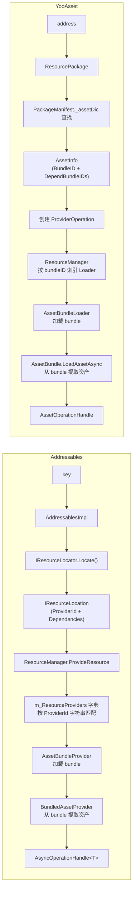
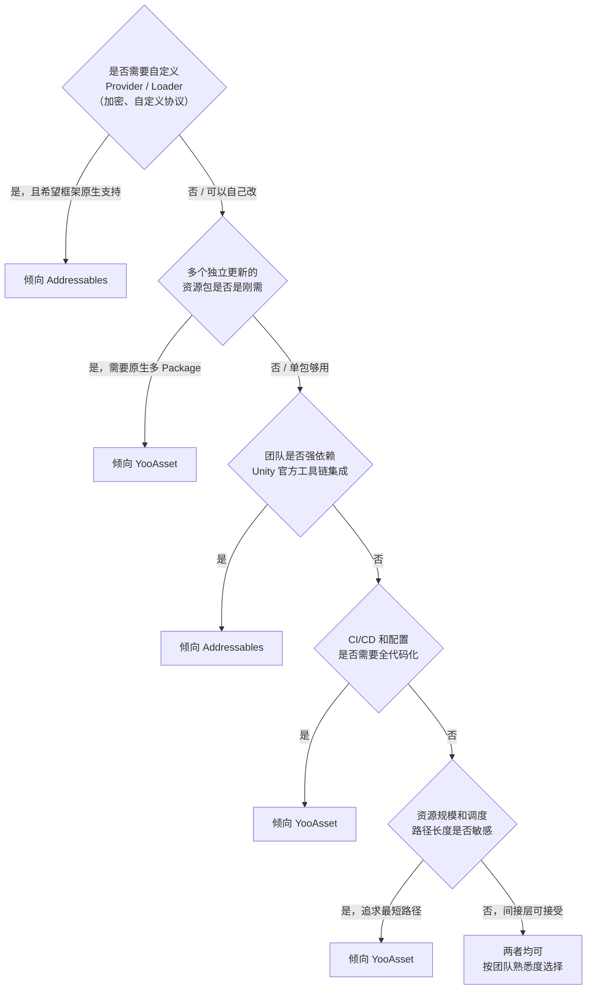

## 一、对比视角——用同一组问题丈量两个系统

[Addr-01]() 把 Addressables 从 `LoadAssetAsync` 到 bundle 加载完成的完整内部链路拆开了。
[Yoo-01]() 对 YooAsset 做了同样的事情。

两篇文章各自回答的是"这套系统内部怎么工作"。

这篇要回答的是另一个问题：
`把它们放到同一组问题上，结构差异到底在哪？`

这不是一篇"A 比 B 好"的结论文。两套系统面对的底层问题完全一样——把一个 key 变成一个可用对象——但做出的设计选择不同。这些选择没有绝对的好坏，只有在具体项目条件下的适配度差异。

本文沿五个维度逐一对照：

1. 资源定位机制
2. 调度模型——Provider 链 vs Loader 链
3. 引用计数与生命周期管理
4. 异步模型
5. PlayMode / 编辑器模拟

每个维度先各拆一遍结构，再放到一起比。文末给出判断表。

版本基线：Addressables 1.21.x（Unity 6 随附 2.x 有注记），YooAsset 2.x。

---

## 二、资源定位机制对比

定位是运行时链路的第一步：调用方给出一个 key 或 address，系统必须找到这个资源在哪个 bundle 里、bundle 在哪个路径下、有哪些依赖。

### Addressables：key → IResourceLocator → IResourceLocation

Addressables 的定位走三层间接。

调用方传入 key（address 字符串、label 或 AssetReference 的 GUID）。`AddressablesImpl` 遍历已注册的 `IResourceLocator` 列表，对每个 locator 调用：

```
locator.Locate(key, typeof(T), out IList<IResourceLocation> locations)
```

运行时最常用的 locator 实现是 `ResourceLocationMap`。它在初始化时由 `ContentCatalogProvider` 从磁盘上的 `ContentCatalogData` 解码而来。

`ContentCatalogData` 的底层编码是一套紧凑的自定义格式：`m_KeyDataString`（所有 key 的序列化字节流）、`m_BucketDataString`（哈希桶 → entry 偏移映射）、`m_EntryDataString`（entry 数组，每个 entry 包含 InternalId 索引、ProviderId 索引、依赖 key 索引）、`m_InternalIds`（路径字符串数组）。

查找路径：
```
key → hash → bucket → entry offset → entry → InternalId index → 实际路径
```

`ResourceLocationMap` 在 catalog 加载时把编码数据一次性解析成内存字典。之后每次 `Locate` 就是字典查找，但这个字典本身的构建成本（解码 + 内存分配）发生在 catalog 首次加载的主线程上。

源码位置：
- `com.unity.addressables/Runtime/ResourceLocator/ResourceLocationMap.cs`
- `com.unity.addressables/Runtime/ResourceManager/Util/ContentCatalogData.cs`

### YooAsset：address → PackageManifest → AssetInfo

YooAsset 的定位只有一层间接。

调用方在具体的 `ResourcePackage` 实例上发起请求。Package 内部持有一个 `PackageManifest`，Manifest 维护两张核心字典：

- `_assetDic`：`Dictionary<string, PackageAsset>`，key 是 address 字符串
- `_bundleDic`：`Dictionary<int, PackageBundle>`，key 是 bundleID 整数索引

查找路径：
```
address → _assetDic[address] → PackageAsset → BundleID → _bundleDic[bundleID] → PackageBundle
```

没有 hash bucket，没有 entry offset，没有 Base64 解码。Manifest 反序列化后直接就是两张 `Dictionary`，定位就是两次字典查找。

源码位置：
- `YooAsset/Runtime/PackageSystem/PackageManifest.cs`

### 并排对照

| 维度 | Addressables | YooAsset |
|------|-------------|---------|
| 定位入口 | `IResourceLocator.Locate(key, type)` | `PackageManifest.TryGetPackageAsset(address)` |
| 底层数据结构 | `ContentCatalogData` 紧凑编码 → 运行时解码为 `ResourceLocationMap` 字典 | `PackageManifest` 反序列化后直接是 `Dictionary<string, PackageAsset>` |
| 间接层数 | key → hash bucket → entry → InternalId（3 层编码间接） | address → 字典查找（1 层） |
| 初始化成本 | catalog 首次加载需要主线程解码，catalog 越大成本越高 | Manifest 反序列化成本相对线性，无额外解码步骤 |
| 多 catalog / 多 package | 支持多 catalog（遍历 locator 列表），但运行时很少使用 | 原生多 Package 设计，每个 Package 独立 Manifest、独立版本 |
| 定位结果 | `IResourceLocation`（带 InternalId、ProviderId、Dependencies 列表） | `AssetInfo`（带 BundleID、DependBundleIDs 扁平列表） |

工程影响：如果项目的 catalog 体积很大（几千到上万条 entry），Addressables 的 catalog 首次解码会占用可感知的主线程时间。YooAsset 在这个环节没有额外编码层，Manifest 体积的增长对初始化时间的影响更接近线性。但 Addressables 的紧凑编码换来了更小的磁盘体积和传输体积，这在远程更新 catalog 时是一个正向权衡。

---

## 三、调度模型对比——Provider 链 vs Loader 链

定位完成后，系统需要把"资源在哪"变成"资源加载到内存中"。这一步是两个框架设计分歧最大的地方。

### Addressables：ResourceManager + Provider 模式

Addressables 的加载调度由全局的 `ResourceManager` 统一管理。

`ResourceManager` 维护一个已注册 provider 列表。当 `ProvideResource(location)` 被调用时，它按 `location.ProviderId` 字符串在列表中匹配对应的 `IResourceProvider`：

```
// ResourceManager.GetResourceProvider
foreach (var provider in m_ResourceProviders)
    if (provider.ProviderId == location.ProviderId)
        return provider;
```

找到 provider 后，创建一个 `ProviderOperation` 把 location 和 provider 绑在一起，启动异步流程。

对于 bundle 内资产的标准加载路径，两个 provider 形成链式关系：
1. `AssetBundleProvider` — 负责把 bundle 容器从文件或网络加载进来
2. `BundledAssetProvider` — 负责从已加载的 bundle 中提取具体资产

依赖处理是递归的：`ResourceManager` 检查 `location.Dependencies`，对每个依赖 location 递归调用 `ProvideResource`。依赖的依赖也会被递归展开。

这个模型的核心特征是**松散匹配**：provider 不是在编译期绑死的，而是通过 `ProviderId` 字符串在运行时动态匹配。这意味着可以注册自定义 provider 来改变加载行为，而不需要修改框架代码。

源码位置：
- `com.unity.addressables/Runtime/ResourceManager/ResourceManager.cs`
- `com.unity.addressables/Runtime/ResourceManager/ResourceProviders/AssetBundleProvider.cs`
- `com.unity.addressables/Runtime/ResourceManager/ResourceProviders/BundledAssetProvider.cs`

### YooAsset：Package 内闭环 + 直接 Loader 分配

YooAsset 没有全局调度中心，也没有 Provider 模式的间接查找。

`ResourcePackage` 在拿到 `AssetInfo` 后，创建一个 `ProviderOperation`。ProviderOperation 通过 YooAsset 内部的 `ResourceManager`（和 Addressables 的 `ResourceManager` 是完全不同的类）获取或创建 `BundleLoaderBase` 实例。

Loader 的选择不是通过字符串匹配，而是由 PlayMode 在初始化时决定：

- `HostPlayMode` / `OfflinePlayMode` → `AssetBundleLoader`
- `EditorSimulateMode` → `EditorSimulateLoader`

每个 bundleID 在运行时只有一个 Loader 实例。Loader 字典以 bundleID 为 key，直接索引。

依赖处理是扁平的：ProviderOperation 从 `AssetInfo.DependBundleIDs` 拿到依赖列表（一个整数数组），为每个依赖获取或创建 Loader，等所有依赖 Loader 就绪后启动主 bundle Loader。没有递归——依赖结构只有一层。

这个模型的核心特征是**紧耦合直接分配**：Loader 类型在初始化时就确定了，运行时不存在动态匹配。调度路径更短，但扩展性受限于框架预设的 PlayMode 类型。

源码位置：
- `YooAsset/Runtime/ResourcePackage/ResourcePackage.cs`
- `YooAsset/Runtime/ResourcePackage/Operation/Internal/BundleLoaderBase.cs`
- `YooAsset/Runtime/ResourcePackage/Operation/Internal/AssetBundleLoader.cs`

### 并列流程图



### 结构差异小结

| 维度 | Addressables | YooAsset |
|------|-------------|---------|
| 调度中心 | 全局 `ResourceManager` 单例 | `ResourcePackage` 各自独立，无全局调度 |
| Provider / Loader 匹配 | 运行时按 `ProviderId` 字符串动态匹配 | 初始化时按 PlayMode 确定 Loader 类型，运行时按 bundleID 整数索引 |
| 依赖展开 | `IResourceLocation.Dependencies` 递归展开（可能有依赖的依赖） | `DependBundleIDs` 扁平列表，只有一层 |
| 扩展性 | 注册自定义 `IResourceProvider` 即可改变加载行为 | 需要继承 `BundleLoaderBase` 或修改 PlayMode 分支 |
| 调度路径长度 | 较长：key → locator → location → provider 匹配 → provider chain | 较短：address → manifest 查找 → loader 直接索引 |

工程影响：如果项目需要自定义加载行为（比如加密 bundle 的解密 provider、自定义 CDN 协议），Addressables 的 Provider 模式提供了更干净的扩展点。如果项目追求最短路径和最少间接层，YooAsset 的直接 Loader 模型运行时开销更小——但要加自定义加载逻辑时需要在框架预设的分支里找位置。

---

## 四、引用计数与生命周期管理对比

资源加载完了不是终点。谁持有它、谁释放它、什么时候真正从内存里卸载——这是运行时生命周期管理的核心问题。

### Addressables：操作级引用计数 + 自动卸载链

Addressables 的引用计数挂在 `AsyncOperationBase` 级别。每次 `LoadAssetAsync` 调用，如果目标 key 已有进行中或已完成的操作，`ResourceManager` 的操作缓存（`m_AssetOperationCache`）会直接复用该操作，递增 `m_referenceCount`。

```
// 两次加载同一个 key → 共享同一个 operation
handle1 = Addressables.LoadAssetAsync<T>(key);  // op refcount = 1
handle2 = Addressables.LoadAssetAsync<T>(key);  // op refcount = 2
```

Release 链：
```
Addressables.Release(handle)
  → m_referenceCount--
  → refcount == 0 → AsyncOperationBase.Destroy()
    → BundledAssetProvider 释放 asset 引用
    → AssetBundleProvider 检查 bundle refcount
    → bundle refcount == 0 → AssetBundle.Unload(true)
```

关键特征：引用计数在 operation 和 bundle 之间形成了依赖图。operation 归零触发 asset 释放，所有引用某个 bundle 的 operation 都归零后，bundle 才会卸载。这是一个**自动级联卸载**模型——只要上层正确 Release，底层的 bundle 卸载会自动发生。

源码位置：`com.unity.addressables/Runtime/ResourceManager/AsyncOperations/AsyncOperationBase.cs`

### YooAsset：双层引用计数 + 显式卸载

YooAsset 的引用计数分两层。

**ProviderOperation 层**：每次 `LoadAssetAsync` 都创建一个独立的 `ProviderOperation`。即使两次加载同一个 address，也是两个独立的 operation。

**BundleLoader 层**：`BundleLoaderBase` 维护自己的引用计数，记录被多少个 ProviderOperation 引用。

```
// 两次加载同一个 address → 两个独立 operation，共享 bundleLoader
handle1 = package.LoadAssetAsync<T>(addr);  // providerOp1, bundleLoader refcount = 1
handle2 = package.LoadAssetAsync<T>(addr);  // providerOp2, bundleLoader refcount = 2
```

Release 链：
```
handle.Release()
  → ProviderOperation 标记释放
  → ResourceManager 递减相关 BundleLoader 的引用计数
  → bundleLoader refcount == 0 → AssetBundle.Unload(true)
  → 从 Loader 字典移除
```

此外，YooAsset 提供了 `ForceUnloadAllAssets()` 方法——无视所有引用计数，直接卸载 Package 下的全部 bundle。这是一个"核武器"级别的 API，适合在场景完全切换时一刀切清理。

源码位置：
- `YooAsset/Runtime/ResourcePackage/Operation/Internal/BundleLoaderBase.cs`
- `YooAsset/Runtime/ResourcePackage/ResourcePackage.cs`

### 对照

| 维度 | Addressables | YooAsset |
|------|-------------|---------|
| 引用计数粒度 | operation 级别（同 key 共享 operation） | 双层：ProviderOperation 独立 + BundleLoader 引用计数 |
| 同 key 二次加载 | 复用已有 operation，refcount++ | 创建新 ProviderOperation，bundleLoader refcount++ |
| 卸载触发方式 | operation refcount → 0 → 自动级联到 bundle | bundleLoader refcount → 0 → 卸载 bundle |
| 强制卸载 | 无原生 API（需要手动 Release 所有 handle） | `ForceUnloadAllAssets()` 一刀切 |
| 追踪粒度 | 只能追踪到 operation 级别，多个 handle 共享一个 operation 时难以区分谁在持有 | 每个加载请求是独立的 ProviderOperation，可以逐个追踪 |
| 典型泄漏表现 | bundle 永不卸载，内存只增不减 | 同上，但 `ForceUnloadAllAssets` 提供了兜底手段 |

工程影响：Addressables 的 operation 共享机制减少了重复操作对象的创建，但代价是"谁在持有这个资源"变得更难追踪——多个 handle 背后是同一个 operation，Profiler 里看到的 refcount 是合并后的数字。YooAsset 的每请求独立 operation 在诊断时更透明，你能清楚地看到每个加载请求对应的 operation 和它引用了哪些 Loader。但这也意味着更多的 operation 对象创建和管理开销。

---

## 五、异步模型差异

两个框架的 `LoadAssetAsync` 都返回一个 handle，都支持异步等待。但 handle 的内部实现和与 Unity 运行时的接入方式有明显差异。

### Addressables：AsyncOperationHandle 包裹 IAsyncOperation

`AsyncOperationHandle<T>` 是一个结构体壳，内部持有一个 `AsyncOperationBase<T>` 实例（通常是 `ProviderOperation<T>` 或 `ChainOperation<T>`）。

支持的等待方式：

**1. Completed 回调**
```
handle.Completed += (op) => { /* 完成处理 */ };
```

**2. Task 桥接**
```
var result = await handle.Task;
```
`handle.Task` 返回一个 `Task<T>`，通过内部的 `TaskCompletionSource<T>` 在操作完成时 resolve。

**3. 协程 yield**
Addressables 本身不直接实现 `IEnumerator`，但可以借助工具类在协程中等待 handle。

**4. UniTask 桥接**
UniTask 提供了对 `AsyncOperationHandle` 的原生扩展：
```
var result = await handle.ToUniTask();
```
这条路径绕过 `Task`，直接注册 Completed 回调，避免 Task 的 GC 分配。

操作完成的驱动方式：`AsyncOperationBase` 在 `Update` 中被 ResourceManager 轮询。ResourceManager 把自己的更新注册到 `MonoBehaviourCallbackHooks`，挂在一个隐藏 GameObject 上，随 Unity PlayerLoop 的 `Update` 执行。

源码位置：
- `com.unity.addressables/Runtime/ResourceManager/AsyncOperations/AsyncOperationBase.cs`
- `com.unity.addressables/Runtime/ResourceManager/ResourceManager.cs`（`Update` 方法）

### YooAsset：GameAsyncOperation 继承体系

`AssetOperationHandle` 包裹一个 `ProviderOperation`，`ProviderOperation` 继承自 `GameAsyncOperation`——YooAsset 自己的异步操作基类。

支持的等待方式：

**1. Completed 回调**
```
handle.Completed += (op) => { /* 完成处理 */ };
```

**2. 协程 yield**
`GameAsyncOperation` 实现了 `IEnumerator`，可以直接在协程中 yield：
```
yield return handle;
```

**3. Task 桥接**
YooAsset 2.x 提供了 `Task` 扩展方法：
```
await handle.Task;
```

**4. UniTask 桥接**
同样可以通过 UniTask 的扩展支持。

操作完成的驱动方式：YooAsset 的操作更新由 `OperationSystem` 管理。`OperationSystem` 维护一个操作列表，通过 `YooAssets.Update()` 驱动（或通过 PlayerLoop 注入自动更新）。每帧遍历操作列表，调用每个操作的 `InternalOnUpdate`，推进状态机。

源码位置：
- `YooAsset/Runtime/ResourcePackage/Operation/AssetOperationHandle.cs`
- `YooAsset/Runtime/Services/OperationSystem.cs`

### 对照

| 维度 | Addressables | YooAsset |
|------|-------------|---------|
| Handle 类型 | `AsyncOperationHandle<T>`（结构体，包裹 `AsyncOperationBase<T>`） | `AssetOperationHandle`（类，包裹 `ProviderOperation`） |
| Completed 回调 | 支持 | 支持 |
| 协程 yield | 需要工具类辅助 | 原生 `IEnumerator`，直接 `yield return handle` |
| Task 桥接 | `handle.Task` 原生支持 | 扩展方法支持 |
| UniTask 桥接 | UniTask 原生支持 `AsyncOperationHandle` 转换 | 可通过 UniTask 扩展支持 |
| 驱动方式 | `ResourceManager.Update` 挂在隐藏 GameObject 上 | `OperationSystem` 通过 `YooAssets.Update()` 或 PlayerLoop 注入 |
| 同步等待 | `WaitForCompletion()`（Unity 2021.2+，spin-wait 阻塞主线程） | 无原生同步等待 API |

工程影响：Addressables 的 `WaitForCompletion()` 提供了同步路径，在引擎初始化等必须阻塞等待的场景下有用，但代价是主线程完全阻塞，远端 bundle 和深依赖链场景下表现极差。YooAsset 不提供原生同步等待，强制使用者走异步路径。

两个框架的 Task 桥接和 UniTask 桥接在使用体验上几乎等价——差异主要在内部实现层面。Addressables 的操作驱动依赖隐藏 GameObject，这在极端情况下可能被误删或 DontDestroyOnLoad 场景切换时受影响。YooAsset 通过显式的 `OperationSystem` 管理，依赖关系更明确。

---

## 六、PlayMode / 编辑器模拟差异

开发期和发布期的资源加载行为需要能切换。两个框架都提供了编辑器模拟模式，但切换机制和可选模式不同。

### Addressables 三种 Play Mode

Addressables 通过 Build Script 和 Play Mode Script 的组合切换，配置在 Editor 面板的 Addressables Groups 窗口中。

| 模式 | 内部机制 | 使用场景 |
|------|---------|---------|
| **Use Asset Database** | 绕过 bundle，直接走 `AssetDatabase.LoadAssetAtPath` | 开发迭代：不需要打 bundle，修改资产立刻生效 |
| **Simulate Groups** | 不加载真实 bundle，但模拟 bundle 分组、依赖和加载延迟 | 验证分组策略：检查依赖关系是否正确，无需等构建 |
| **Use Existing Build** | 加载真实 bundle 产物 | 最终验证：完整的发布路径测试 |

切换方式：通过 Editor 面板选择 Play Mode Script。代码中无需任何改动。

### YooAsset 三种 PlayMode

YooAsset 通过 `InitializeAsync` 传入不同的 `InitializeParameters` 类型切换，完全在代码中控制。

| 模式 | 内部机制 | 使用场景 |
|------|---------|---------|
| **EditorSimulateMode** | 走 `AssetDatabase.LoadAssetAtPath`，不加载任何 bundle | 开发迭代：和 Addressables 的 Use Asset Database 等价 |
| **OfflinePlayMode** | 从 StreamingAssets 加载打好的 bundle，不触发网络请求 | 内置资源验证：测试打包产物，无需部署远端 |
| **HostPlayMode** | 完整的远程资源流程：缓存 → 下载 → 加载 | 线上行为验证：模拟真实的热更和远程加载 |

切换方式：代码中根据环境条件选择不同的 `InitializeParameters` 子类。

### 对照

| 维度 | Addressables | YooAsset |
|------|-------------|---------|
| 模式数量 | 3 | 3 |
| 切换方式 | Editor 面板选择 Play Mode Script | 代码中传入不同的 `InitializeParameters` |
| 开发期免打包 | Use Asset Database | EditorSimulateMode |
| 模拟分组/依赖 | Simulate Groups（独有：模拟加载延迟和依赖关系） | 无直接等价，需要 OfflinePlayMode + 真实产物 |
| 真实产物测试 | Use Existing Build | OfflinePlayMode / HostPlayMode |
| 切换是否需要改代码 | 不需要，面板切换 | 需要在初始化代码中修改参数类型 |
| CI/CD 自动化 | 可以通过 Editor API 脚本化切换 | 代码中通过条件编译或配置文件自动切换，更自然 |

工程影响：Addressables 的面板切换对开发者更友好——不用改代码就能在 Editor 里快速切模式。但在 CI/CD 流水线上，代码化切换（YooAsset 的方式）更容易自动化和版本控制。

Addressables 独有的 **Simulate Groups** 模式在大型项目中有明确价值：它允许在不打 bundle 的情况下验证分组策略和依赖关系是否正确。YooAsset 没有等价模式——要验证分组结果必须先完成一次完整构建。

---

## 七、判断表——你的项目该选哪个调度模型

以下判断基于运行时调度层面的结构差异。构建期、版本治理和缓存管理的对比会在后续 Cmp-02 和 Cmp-03 中展开。

| 项目条件 | 推荐方向 | 原因 |
|----------|---------|------|
| 需要自定义加载行为（加密 bundle、自定义协议、非标资源类型） | Addressables | Provider 模式的松散匹配提供了干净的扩展点，注册自定义 `IResourceProvider` 不需要修改框架代码 |
| 追求最短调度路径和最少运行时间接层 | YooAsset | Package 内闭环 + Loader 直接索引，调度链路比 Addressables 少两层间接 |
| 多个独立更新的资源包（主包 + DLC + 多语言包） | YooAsset | 原生多 Package 设计，每个 Package 独立 Manifest、独立版本号、独立更新。Addressables 的多 catalog 能力存在但实践中很少使用 |
| 需要精细追踪每个加载请求的生命周期 | YooAsset | 每次 LoadAssetAsync 创建独立 ProviderOperation，比 Addressables 的 operation 共享模型更容易追踪谁在持有什么 |
| 大量 UI 面板频繁加载/卸载，需要可靠的自动释放 | Addressables | operation 级引用计数 + 自动级联卸载链，只要正确配对 Release，底层 bundle 卸载自动发生 |
| 场景切换时需要一刀切清理所有资源 | YooAsset | `ForceUnloadAllAssets()` 提供原生的全量卸载能力，Addressables 没有等价 API |
| 团队主要使用 Unity 官方工具链，需要和 Unity Editor 面板深度集成 | Addressables | Unity 原生集成：Addressables Groups 窗口、Event Viewer、Build Reports，面板切换 Play Mode 不需要改代码 |
| 项目需要在开发期验证 bundle 分组策略但不想等构建 | Addressables | Simulate Groups 模式独有：模拟分组和依赖关系而不需要真实构建 |
| CI/CD 流水线需要代码化控制所有配置 | YooAsset | 初始化参数全在代码中，PlayMode 切换通过条件编译或配置文件，比 Editor 面板配置更容易自动化 |
| 团队有能力维护自研的资源管理中间层 | 两者皆可 | 在此条件下框架选择更多取决于上层封装策略而非框架内部差异 |

### 选型决策流



---

最后重复一下：这篇对比的全部依据来自运行时调度层面的源码结构差异。它不能代替完整的选型判断。构建期的产物格式和增量机制（Cmp-02）、版本治理和缓存管理（Cmp-03）是选型的另外两个关键维度。

如果想回去看两套系统各自的完整内部链路，入口在这里：
- Addressables：[Addr-01]()
- YooAsset：[Yoo-01]()
