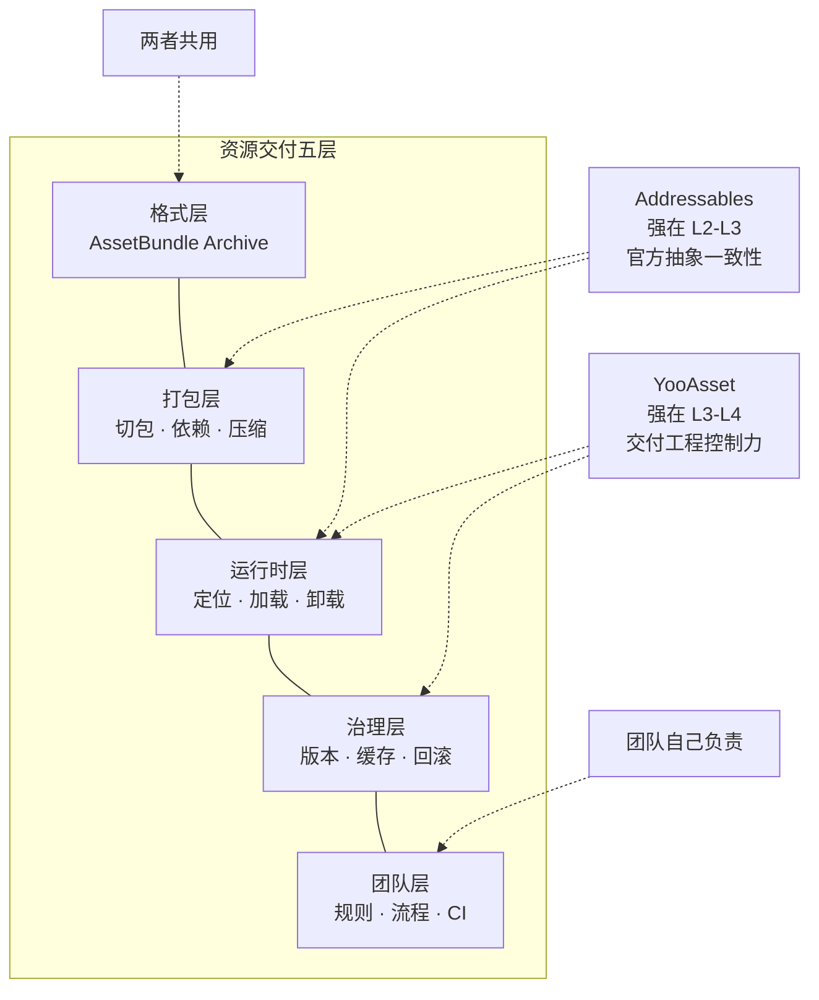

`Addressables` 和 `YooAsset` 最容易被比错的地方，不是资料少，而是大家默认它们在解决同一种问题。于是讨论很快就会滑成几句熟话：官方的更稳，第三方的更强；做热更就上 `YooAsset`，想省事就上 `Addressables`。

这些话不能说完全错，但错在把不同层的问题压成了同一句判断。两者都站在 `AssetBundle` 之上，却没有把优势放在同一层。你拿“谁的加载 API 更顺手”去比，会低估交付问题；你拿“谁更适合灰度、回滚和多环境发布”去比，又会错过官方抽象带来的稳定收益。

所以这篇文章只做一件事：把比较对象从“框架功能表”收回到“资源交付问题空间”，讲清 `Addressables` 和 `YooAsset` 的优势，到底分别强在哪一层。

## 先给一句总判断

如果这篇只记一句话，我建议记这个：`Addressables 赢在官方抽象一致性，YooAsset 赢在交付工程控制力；你选的不是功能表，而是资源交付问题的主战场。`

这里最关键的不是“谁更先进”，而是“你的项目现在最痛的是哪一层”。如果主要矛盾还在“怎么把 Unity 资源组织、定位、加载先收口”，`Addressables` 的价值会非常高；如果主要矛盾已经变成“版本、下载、缓存、回滚、灰度、多环境发布怎么控住”，`YooAsset` 的价值就会更直接。

## 为什么这个问题经常会被比错

大多数讨论一上来就在比三类东西：

- 谁的 API 更顺手
- 谁的编辑器面板更舒服
- 谁更适合“大项目”

这些维度都不算完全没用，但它们的问题是太接近“使用感受”，离真正的资源交付矛盾太远。

真实项目里的资源系统，最后迟早会碰到的通常不是“这个接口好不好写”，而是下面这些问题：

- 首包和远端内容的边界怎么划
- 哪些内容应该一起发、一起测、一起回滚
- 更新失败、缓存损坏、版本回退时谁来兜底
- 不同环境、不同平台、不同审核流程下，发布策略怎么保持可控

如果这些问题已经进了你的日常讨论，那你比的就不该再是“框架功能点”，而应该是“这套系统把哪一层问题放到了前台”。

## 先把共同抽象模型立住：资源交付链到底分几层

讨论 `Addressables` 和 `YooAsset` 之前，最好先把共同问题空间摆出来。至少可以拆成下面五层。

| 层次 | 主要问题 | 更接近的代表 |
|---|---|---|
| 底层交付格式层 | 资源最终以什么容器被构建、分发、缓存 | `AssetBundle` |
| 构建组织层 | 资源怎么分组、怎么切包、怎么生成目录和构建输入 | `Addressables` 感知更强 |
| 运行时定位与加载层 | 资源怎么定位、下载、缓存、实例化、卸载 | 两者都覆盖 |
| 交付治理层 | 版本、灰度、回滚、多环境发布、校验、修复 | `YooAsset` 放得更前台 |
| 团队 ownership 层 | 多少复杂度交给官方抽象，多少复杂度由团队自己长期持有 | 真正的选型分水岭 |

关于 AssetBundle 和 Addressables 的分层关系——为什么一个是底层交付格式，另一个是管理层——见[前文]()。这里只补一句：`YooAsset` 同样不是新的底层资源格式，它和 `Addressables` 一样站在 `AssetBundle` 之上，差异在于各自把哪部分工程问题包装得更成熟。

所以如果你一边用”底层格式”的标准要求 `Addressables`，一边又用”运营级交付治理”的标准要求它像 `YooAsset` 一样显式，最后一定会觉得它哪里都差一点。反过来，如果你只用”加载资源”这个层来理解 `YooAsset`，又会把它真正有价值的部分看窄。

## Addressables 真正强在哪里

### 1. 它强在官方抽象一致性

`Addressables` 最核心的优势，不是“热更更强”，而是它把 `Groups`、`Labels`、`Profiles`、`Catalog`、`Locator` 这些概念收进了 Unity 官方工作流里。对于很多团队来说，这件事的价值远高于“多一个下载器接口”或者“少写几行封装代码”。

因为一旦进入 `Addressables` 心智，团队看到的就不再只是裸 `AssetBundle`，而是一套更接近 Unity 原生语义的资源组织和定位方式。你可以不先完全掌握底层交付细节，也能把资源系统先组织起来，把本地和远端的访问模型统一起来，把“找资源、拉依赖、异步加载、释放句柄”这些常见问题先收口到同一套模型里。

这就是它为什么特别适合中型项目，或者特别适合团队成员经验差异比较大的项目。它提供的是一种“让大多数项目先不要自己维护太多层”的默认路径。

### 2. 它强在工具链入口统一

很多团队真正从 `Addressables` 获益的地方，不是某一个运行时 API，而是整套工具链入口比较统一：

- `Profiles` 让不同环境的本地与远端路径有了统一管理入口
- `Groups` 把构建组织和交付边界先收进编辑器配置里
- `Analyze` 和 `Content Update Workflow` 至少把检查和更新工作流放到了一个可复用的官方范式下

这种统一的好处是：协作心智更稳，培训成本更低，很多“这到底算资源配置问题还是运行时代码问题”的争论，会少很多。

当然，这里有个很容易混淆的点：`Group` 不是天然等于一个 `Bundle`。`Addressables` 很强的地方在于“组织与抽象”，不是“把底层切包问题直接替你消灭”。但即便如此，它仍然让很多团队第一次真正拥有了可以落地的资源管理入口。

### 3. 它更适合把复杂度先藏到官方抽象后面

对很多项目而言，早期最需要的并不是一套极强的交付治理系统，而是一套先跑通、先统一、先少踩坑的资源抽象层。`Addressables` 的价值就在这里。

如果你的项目具备下面这些特征，它通常会是一个很稳的起点：

- 远端内容有，但不是业务主战场
- 团队希望尽量走 Unity 官方路线
- 资源系统需要先标准化，而不是先工程化到极致
- 你更在意“协作和维护能不能统一”，而不是“版本治理是不是足够显式”

这时候，官方抽象一致性本身就是优势。

### 4. 它的代价也很明确

`Addressables` 不会让复杂度消失，它只是把复杂度更多地收进了 `group schema`、`catalog`、`content state file`、更新限制和构建配置里。也就是说，它擅长收口，但不等于它擅长把每一类交付治理问题都摆到台前。

当项目主问题开始变成下面这些时，它的默认优势就会明显下降：

- 多环境版本治理
- 灰度与快速回滚
- 零资源首包或强按需下载
- 小游戏平台或特殊文件系统环境
- 超大内容、多包体、分工程构建

这并不说明 `Addressables` 不好，只说明它真正擅长解决的，主要还是“官方资源抽象层”的问题。

## YooAsset 真正强在哪里

### 1. 它强在交付工程控制力

如果说 `Addressables` 更像“官方资源抽象层”，那 `YooAsset` 更像“商业化资源交付工程层”。

它最值钱的地方，不是重新发明了一套底层格式，而是从一开始就把问题定义成：资源系统不只是加载系统，而是交付系统。也正因为如此，`YooAsset` 公开强调的重点场景，天然就更贴近长期运营项目会反复遇到的现实矛盾：

- 首包要小，但内容要大
- 要支持按需下载、边玩边下
- 要能区分测试包、审核包、线上包
- 要能做版本回退、损坏修复和文件校验
- 平台文件系统差异不能在上线前才暴露

这些问题并不是“换一个加载 API”就能解决的，它们本来就是交付工程问题。而 `YooAsset` 的优势，恰恰就是把这些问题直接放到了前台。

### 2. 它强在版本、下载和运行模式的显式治理

很多团队第一次真正觉得 `YooAsset` 顺手，不是因为它的调用名字更好记，而是因为它在系统设计上更强调这些事情本来就要被显式管理：

- 多运行模式切换
- 下载器与下载任务的组织
- 断点续传
- 文件校验与损坏修复
- 按标签、按资源对象创建下载任务
- 版本信息和资源状态的显式更新流程

这类能力的本质，是让“交付治理”不再只是你项目里零散的辅助脚本或约定俗成，而是变成系统默认关注的对象。

所以在长线运营项目里，`YooAsset` 往往不是因为某个功能比 `Addressables` 多一个按钮才显得强，而是因为它更早承认：真正耗团队精力的，往往不是把资源加载出来，而是把内容安全、稳定、可回退地交付出去。

### 3. 它更贴近商业项目的现实约束

很多项目一开始并不会认真讨论资源交付，直到真正上线后，问题才开始变得非常现实：

- 这个版本要不要把活动内容放远端
- 这个审核包能不能和线上资源共存
- 这个平台的文件系统是不是和标准移动端行为不同
- 这个更新失败后，玩家有没有办法回到一个还能玩的旧版本

`YooAsset` 更容易打动商业项目，原因不在“它更高级”，而在“它更承认这些约束才是项目主战场”。特别是当你要面对小游戏平台、复杂审核流程、活动资源频繁更新或者非常明确的首包限制时，它的价值会比单纯的加载抽象更直接。

### 4. 它的代价也同样明显

`YooAsset` 的优势来自更高的系统 ownership。换句话说，它更适合那些愿意认真建设资源交付系统的团队，不太适合“只想把资源管理做得现代一点”的团队。

如果你的团队说不清下面这些问题，那么 `YooAsset` 的很多优势最后都会变成额外复杂度：

- 包怎么分
- 版本怎么升
- 失败怎么修
- 回滚怎么做
- 不同环境怎么发

它不能替团队建立边界，只是比很多更轻的方案更愿意把这些边界摆到你面前。

## 它们真正不是谁替代谁，而是谁在前台解决问题

把上面这些差异压缩成最短的话，其实就是两句：

- `Addressables` 更像官方资源抽象层
- `YooAsset` 更像商业化资源交付工程层

这两句话的意思不是它们互相毫无重叠，而是它们各自把不同层的问题放到了前台。

`Addressables` 前台解决的是：怎么让 Unity 项目里的资源组织、远端定位、运行时加载和基础更新工作流先统一起来。它让很多团队不需要立刻拥有很强的资源交付工程能力，也能把资源系统带进一个可管理状态。

`YooAsset` 前台解决的是：怎么让版本、下载、缓存、校验、回滚、多环境、多平台这些问题，不再只是上线后补洞，而是在系统层面就被当成一等公民。

所以这不是“谁替代谁”的关系，更像是“谁把哪类问题收成了默认主线”。选型的关键，也不是盯着功能堆栈去找“更高级”的那个，而是先承认：你的项目主要痛点到底落在官方抽象层，还是交付工程层。

## 项目里怎么判断该优先站哪边

最后把判断收成一张决策表。

| 项目信号 | 更优先方案 | 原因 |
|---|---|---|
| 团队希望尽量走 Unity 官方路线，项目规模中等，远端内容不是业务主战场 | `Addressables` | 官方抽象一致性更重要，先把资源组织和加载心智统一起来 |
| 团队成员经验参差，资源系统还没有标准入口 | `Addressables` | `Profiles / Groups / Catalog` 这套官方抽象更容易协作和培训 |
| 项目已经明确存在首包、分包、热更、灰度、回滚、多环境版本治理压力 | `YooAsset` | 这些本来就是它默认前台能力 |
| 项目包含小游戏平台、特殊文件系统环境、强按需下载或边玩边下诉求 | `YooAsset` | 资源交付工程问题比基础加载抽象更关键 |
| 项目有超大体量内容、分工程构建、长期活动内容和强运营节奏 | `YooAsset` | 版本、下载、校验、回滚的显式治理价值更高 |
| 团队说不清版本、缓存、回滚和失败修复规则 | 先别急着定 | 这不是框架问题先没选，而是交付 ownership 先没立住 |

这张表真正想表达的，不是“某类项目只能选某一边”，而是一个更稳的判断顺序：先认主战场，再选工具。

如果你的主要矛盾还是“把 Unity 官方资源工作流先收口”，优先看 `Addressables`。如果你的主要矛盾已经是“内容交付不可控”，优先认真评估 `YooAsset`。如果团队连版本、缓存、回滚和失败修复规则都说不清，先别急着谈框架优劣。

## 最后只压一个判断

`Addressables` 赢在官方抽象一致性，`YooAsset` 赢在交付工程控制力；你选的不是框架名字，而是谁来长期持有资源交付的复杂度。

如果你下一步想看的是“怎么把这个判断落到具体打包配置”，继续读 [Addressables / YooAsset 打包配置：Group 划分、Bundle 布局最佳实践]()。

如果你下一步要解决的是“到底要不要把自研资源系统也拉进来一起比”，继续读 [Addressables、YooAsset 和自研资源系统到底怎么选]()。