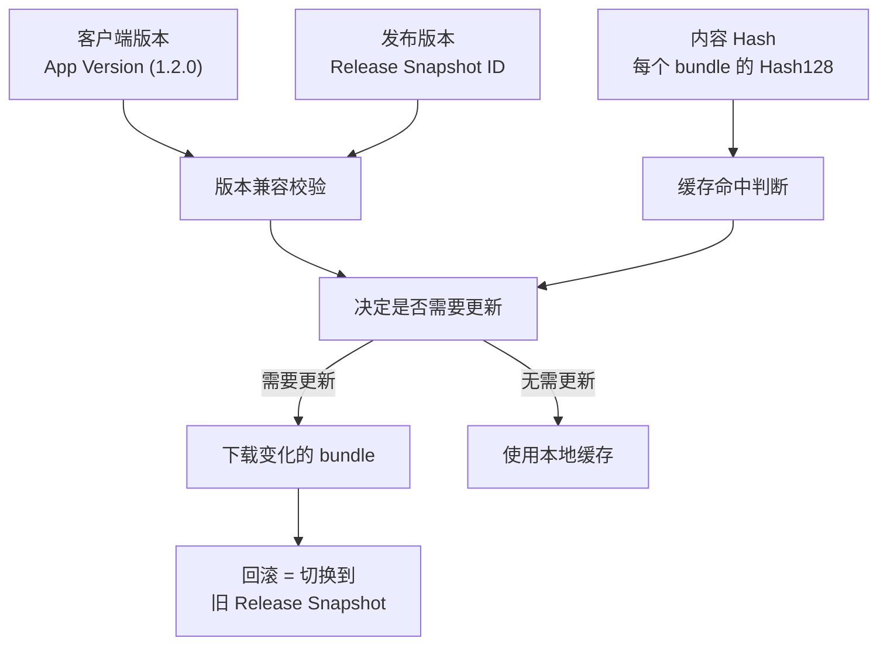

前面几篇已经把 AssetBundle 的主线拆到了比较完整的程度：

- 为什么它解决的是交付，不是单纯加载
- 它怎么从资产系统被编成 bundle、manifest 和压缩后的交付物
- 它在运行时怎样从下载、缓存、依赖满足一路接到 `LoadAsset`、反序列化、`Instantiate` 和 `Unload`
- 它为什么会把切包粒度、共享依赖、包爆炸、首次卡顿和内存峰值一起带出来

如果只到这里，系列看起来已经能解释很多“资源为什么出问题”。

但真实项目里，真正把团队拖进长期成本的，往往不是某一次加载异常，而是另一类更慢、更隐蔽的问题：

- 这一版客户端到底该拿哪一批 bundle
- 本地缓存的是不是同一份内容
- CDN 上现在挂的是哪一套交付物
- 出问题时该回滚哪一层
- 构建完以后，怎么知道依赖、重复资源、漏包、错包、脚本边界问题没有重新回来

也就是说，AssetBundle 真正难的地方，最后并不只是在“把包做出来”，而是在：
`怎么让这套交付体系长期可识别、可校验、可回退、可演进。`

## 先给一句总判断

如果要把 AssetBundle 的工程治理压成一句话，我会这样说：

`AssetBundle 的治理，核心不是“把文件发到 CDN 上”，而是给每份内容建立稳定身份、给每次发布建立明确映射、给每个缓存建立可验证依据，并让回滚和回归验证都能围绕这套身份体系落地。`

这里最容易混掉的，是三种完全不同的东西：

- `版本号`
- `Hash`
- `缓存副本`

它们经常一起出现，但职责并不一样。

如果这三层没分清，项目现场很容易不断重复这些问题：

- 客户端说自己是新版本，结果拿到旧内容
- CDN 上看起来内容更新了，本地却一直命中旧缓存
- 回滚了版本说明，但运行时仍然混用了旧新两批 bundle
- 构建产物已经变化，却没有任何自动校验提前发现

所以治理篇真正要立住的，不是某个工具细节，而是：
`内容身份和发布身份必须是显式结构，不是人脑记忆。`

## 一、先把三层身份拆开：客户端版本、发布版本、内容 Hash

很多团队一开始做资源发布时，最容易犯的错误就是：
用一个“版本号”试图包住所有问题。

这通常不够。

### 1. 客户端版本，解决的是“这份程序能不能理解这批内容”

也就是：

- 当前 Player 是哪一版
- 它支持哪套脚本接口、资源结构和运行时约定
- 哪些 bundle 即使下载到了，也根本不应该给这版客户端使用

这层最重要的，不是资源变没变，而是：
`代码和内容是否兼容。`

所以它更像兼容边界，而不是内容身份本身。

### 2. 发布版本，解决的是“这次对外声明的一整套内容集合是什么”

它更偏向一套人和系统都能读懂的发布语义，例如：

- `2026.03.23-hotfix-2`
- 某个灰度批次
- 某个渠道环境
- 某个回滚点

它回答的是：
`这一批线上玩家，应该看到哪一整套资源世界。`

所以发布版本更像一个“映射标签”，不是 bundle 的物理身份。

### 3. 内容 Hash，解决的是“这份 bundle 到底是不是那一份内容”

到了 bundle 级别，真正稳定的身份通常应该落在内容指纹上。

因为对于缓存、校验、CDN 和回滚来说，最重要的问题不是：
“它叫不叫 v105”

而是：
`这是不是那份字节级内容。`

所以 `Hash` 更像 bundle 的不可变内容身份。

这三层一旦分清，很多治理动作才站得住：

- 客户端版本负责兼容
- 发布版本负责指向一组内容
- Hash 负责精确识别每个交付单元

值得补充的是，Unity 在 bundle 层级还提供了一层 CRC 校验机制，它和 Hash 身份配合，但代价容易被低估。`AssetBundle.LoadFromFile` 和 `UnityWebRequestAssetBundle.GetAssetBundle` 都接受一个可选的 CRC 参数；启用后，引擎会对 bundle 的未压缩内容计算一遍 CRC32，再与 `AssetBundleManifest.GetAssetBundleCrc()` 返回的期望值比对。问题在于，对 `LoadFromFile` 启用 CRC 会强制引擎做一次完整的读取 + 解压流程——即使是 LZ4（ChunkBased）包，也无法再利用 memory-mapped 按需读取的优势，退化为全量解压。这个开销在生产环境中足以被注意到，很多团队上线后才发现首次加载变慢，最终选择关闭 CRC，但也同时失去了完整性校验。治理层面的常见折中是：仅在首次下载写入缓存时（走 `UnityWebRequestAssetBundle`）开启 CRC 校验，后续从本地缓存 `LoadFromFile` 时跳过，把完整性验证限定在网络传输环节，而不让它反复拖慢本地加载。

## 二、Manifest 真正连接的，不只是依赖关系，还有”发布映射”

前面构建篇已经讲过，`Manifest` 不是附带说明书，而是交付单元的身份表和依赖表。

到了治理层，它还有另一层价值：
`它让“某次发布”能落到一组可验证的 bundle 身份上。`

### 1. 没有映射层，版本号和内容集合之间会变成人工约定

如果项目里只有一句模糊的话：

- “这是今天的新资源”
- “这是热更版本 17”
- “这是测试服当前那批 bundle”

但没有一份清晰的映射表把这些名字落到具体 bundle 名、依赖和 hash 上，那么后面很多事都会飘：

- 客户端到底该拉哪些文件
- 哪些依赖链属于这次发布
- 哪个包被替换过
- 出问题时到底该切回哪一套内容清单

所以治理的第一步通常不是先谈 CDN，而是先谈：
`有没有一份可追溯的发布清单，把版本语义绑定到具体内容身份。`

### 2. 更稳的发布对象，不是“目录里一堆 bundle”，而是一份完整内容快照

从工程上看，一次可发布的 AssetBundle 结果，最好被理解成：

- 一组 bundle 文件
- 一份 manifest / catalog / mapping
- 一组 bundle hash
- 一组依赖关系
- 一套环境与目标平台信息

也就是说，真正该被发布、归档、回滚的，通常不是”几个散文件”，而是一份：
`完整内容快照。`

只要这层不是快照化的，后面回滚和回归就很容易失控。

从引擎接口层面看，`AssetBundleManifest` 提供的具体 API 正好覆盖了这些身份和依赖信息：`GetAllAssetBundles()` 返回所有 bundle 名称列表；`GetAssetBundleHash(bundleName)` 返回对应的 Hash128，用于版本比较和缓存命中判断；`GetAllDependencies(bundleName)` 返回传递性依赖列表（包含间接依赖）；`GetDirectDependencies(bundleName)` 返回仅一层的直接依赖。Manifest 本身从一个与输出目录同名的特殊 bundle 中加载——也就是说它自身也是一个 AssetBundle，需要先 `LoadFromFile` 再 `LoadAsset<AssetBundleManifest>`。对于 Addressables，等价角色由 `ContentCatalogData`（序列化在 `catalog.json` / `catalog.hash` 中）承担：每条 `ResourceLocationData` 记录了 key 到 provider ID、内部 bundle ID 和依赖列表的映射，功能上覆盖了传统 Manifest 的身份表和依赖表。

## 三、缓存不是”本地存了一份文件”，而是”本地是否持有某个内容身份”

缓存这一层也很容易被说浅。

很多讨论只会说：
客户端有没有缓存。

但从治理角度看，更关键的问题其实是：
`它缓存的是哪一份内容身份。`

### 1. 缓存命中必须建立在内容身份上，而不是人类版本感受上

如果本地只知道：

- “这是上次下载过的”
- “文件名一样”
- “版本号看起来没变”

那通常不够稳。

更稳的判断方式应该是：

- 当前发布清单要求的 bundle hash 是什么
- 本地缓存副本的 hash 是什么
- 两者是不是同一份内容

因为对缓存来说，“名字相同”不等于“内容相同”，“版本描述相近”也不等于“可以安全复用”。

### 2. 所以缓存策略本质上是在回答“复用的最小单位是什么”

这里又会回到前面 `D03` 讲过的粒度问题。

如果 bundle 切得很粗，那么缓存复用单元也会很粗：

- 一点内容变化就可能整包失效
- 本地明明大部分内容没变，也要重新拉大块副本

如果 bundle 切得很碎，那么缓存虽然更细，但治理又会变复杂：

- 要管理更多 hash
- 要处理更多依赖命中关系
- 要面对更多细碎失效

所以缓存从来不是独立问题，它一直绑在交付粒度上。

### 3. 缓存失效的设计，决定了线上很多“为什么我还是旧内容”

项目里最典型的线上争议之一就是：
“明明发布了，为什么我还是旧资源？”

这类问题通常就落在下面几层中的一层或几层：

- 发布映射没切到新的 hash
- CDN 仍在服务旧对象
- 客户端本地缓存判断不够严格
- 某些共享 bundle 仍引用旧依赖
- 新旧内容在局部路径上混用了

所以缓存问题的本质，不是”本地有没有删干净”，而是：
`内容身份切换有没有沿整条分发链一致生效。`

这里有必要补充 Unity 内置缓存（`Caching` API）在实际项目中容易踩到的几个边界行为。Unity 的缓存以 `(bundleName, Hash128)` 为 key：当通过 `UnityWebRequestAssetBundle.GetAssetBundle(url, new CachedAssetBundle(bundleName, hash))` 下载时，hash 决定了缓存槽位。需要注意的边界情况包括：如果 bundle 名称发生了变化（例如 Addressables 的 group 重命名），旧名称对应的缓存条目会变成孤儿——它仍然占据磁盘空间，但新的请求永远不会命中它，必须通过 `Caching.ClearOtherCachedVersions(bundleName)` 手动清理。其次，`Caching.compressionEnabled`（默认 true）会让 LZMA 压缩的 bundle 在写入缓存时被重新压缩为 LZ4；如果两次构建之间这个设置发生了变化，旧缓存条目的压缩格式可能与当前预期不一致。最后，缓存磁盘用量可以通过 `Caching.maximumAvailableStorageSpace` 设定上限，但超限后引擎会静默驱逐最近最少使用的条目（LRU），团队排查”为什么客户端又重新下载了”时，往往遗漏了这一层静默回收。

## 四、CDN 的职责不是”能下载”，而是稳定服务不可变内容

很多团队提到 CDN，会把它理解成一个纯网络层组件：
把包放上去，客户端能拉就行。

但对 AssetBundle 来说，CDN 更像交付治理的一部分。

### 1. 更稳的 CDN 思路，是让内容对象尽量不可变

原因很简单。

如果同一个路径背后的内容会被频繁原地覆盖，那么下面这些事都会一起变危险：

- 缓存行为更难预测
- 回滚更容易混乱
- 灰度更难控制
- 问题定位时很难确认客户端到底拿到了哪一份

所以更稳的策略通常是：
`让具体 bundle 内容尽量按 hash 或等价不可变身份落盘，再让上层发布映射去指向它们。`

这样 CDN 更像是在服务一组稳定对象，而不是在服务“今天这个路径应该代表什么”这种会飘的语义。

### 2. 发布切换应该更多发生在映射层，而不是频繁原地改内容对象

也就是说，真正适合被切换、灰度、回滚的，通常是：

- 某份 manifest / catalog
- 某个发布版本到内容快照的映射

而不是反复覆盖同一路径下的 bundle 文件本体。

这样一来，CDN、缓存和回滚才更容易形成稳定配合：

- 内容对象尽量不可变
- 发布指向可以变
- 客户端根据最新映射决定拿哪一组 hash

## 五、回滚真正回的，不是“文件夹”，而是“一整套内容映射”

回滚是治理体系里最容易被说成一句空话的词：
“有问题就回滚。”

但真正要落地时，回滚必须至少回答两件事：

- 回到哪一套内容
- 客户端怎样稳定地重新指向那套内容

### 1. 回滚对象应该是一个完整快照点，而不是若干零散补丁

如果所谓回滚，只是临时记着：

- 把这个 bundle 换回旧的
- 把那个共享包也顺手换一下
- 再改一个版本说明

这通常很危险。

因为 AssetBundle 天生有依赖图，只回单点文件，很容易出现：

- 入口包回了，依赖包没回
- 私有 bundle 回了，共享层没回
- bundle 回了，但映射没回
- 内容回了，但客户端兼容边界不成立

所以真正可执行的回滚单位，通常应该是：
`某次已归档的完整内容快照。`

### 2. 更稳的回滚路径，应该优先切映射，而不是现场重新拼内容

这也是为什么前面一直强调“发布版本 -> 内容快照 -> bundle hash”这三层映射。

如果这三层是完整的，那么回滚动作就更接近：

- 把当前发布指针切回旧快照
- 让客户端重新按那套映射拿内容

而不是：

- 线上临时找旧包
- 人工判断哪些要替换
- 再猜一次依赖有没有全回去

前者是工程动作，后者更像事故现场操作。

## 六、构建校验真正值钱的地方，是把事故前移到发布前

很多团队直到线上遇到错包、漏依赖、重复资源爆炸、脚本丢失，才意识到需要治理。

但治理真正值钱的地方，不是善后，而是：
`把这些问题在构建完成时就尽量截住。`

### 1. 该校验的，通常不是“打包成功了没有”，而是“交付图是否符合预期”

比如至少要关心：

- 是否存在缺失依赖
- 是否出现超预期重复资源
- 关键 bundle 的 hash 是否异常波动
- 共享层是否被意外改动
- manifest 依赖图是否发生危险变化
- 关键资产是否被打进了错误边界

这些检查的价值在于：
它们直接对准“交付图有没有漂移”，而不是只对准“命令有没有执行成功”。

### 2. 某些问题还必须做运行时烟测，而不能只停在构建物静态检查

因为有些风险直到运行时路径才会暴露，例如：

- 关键 Prefab 是否能真实加载并实例化
- 关键 Scene 是否能完整恢复
- 关键 Shader / Material 路径是否能命中
- 关键脚本绑定链是否成立

所以更稳的校验体系通常至少分两层：

- 静态产物校验
- 关键路径运行时烟测

只做前者不够，只做后者又太晚。

## 七、回归不是“再跑一次打包”，而是持续监视交付结构有没有漂移

很多团队对回归的理解还停在：
这次也打包成功了。

这其实太浅。

对 AssetBundle 来说，更有价值的回归通常是结构回归。

### 1. 关注“这次和上次相比，交付结构发生了什么变化”

例如：

- 哪些 bundle 新增、删除或改名了
- 哪些共享依赖突然变重了
- 哪些 hash 改变了，但按理不该改变
- 哪些关键包的体积明显异常
- 哪些资源从私有边界漂到了共享层，或反过来

这些变化本身，不一定都是错误。

但它们至少应该是：
`可见、可解释、可追溯。`

### 2. 没有结构回归，很多问题只会以“为什么这版突然怪了”出现

这也是为什么 AssetBundle 相关问题经常给人一种玄学感。

不是因为它真的玄，而是因为：

- 结构变化没人看见
- 发布映射没人留档
- hash 变化没人解释
- 回滚点没人归档

最后问题只能以现象形式出现：

- 这版怎么突然缓存全失效了
- 这次怎么共享包突然大了
- 为什么某个旧功能第一次打开又开始拉一串依赖

这些表象，本质上都是“交付结构漂移没有被工程化监视”。

## 八、这一篇真正想立住的判断

这一篇最想立住的，其实只有三句话。

第一句：
`AssetBundle 治理的起点不是 CDN，也不是缓存，而是先把内容身份、发布身份和兼容边界拆清。`

第二句：
`版本号负责描述一组发布语义，Hash 负责识别具体内容，缓存负责持有某份内容副本，这三层不能混着用。`

第三句：
`真正稳的回滚和回归，都不应该围绕零散文件，而应该围绕完整内容快照、明确映射关系和可重复校验。`

理解这三句之后，很多治理动作的优先级就会变清楚：

- 先建立稳定身份，再谈缓存策略
- 先建立完整快照，再谈回滚
- 先建立结构校验，再谈“线上为什么又出事故”

下一篇我会把 `Addressables` 放回这张图里，专门写清：
它和 AssetBundle 到底是什么关系，谁是底层格式，谁是调度和管理层。
