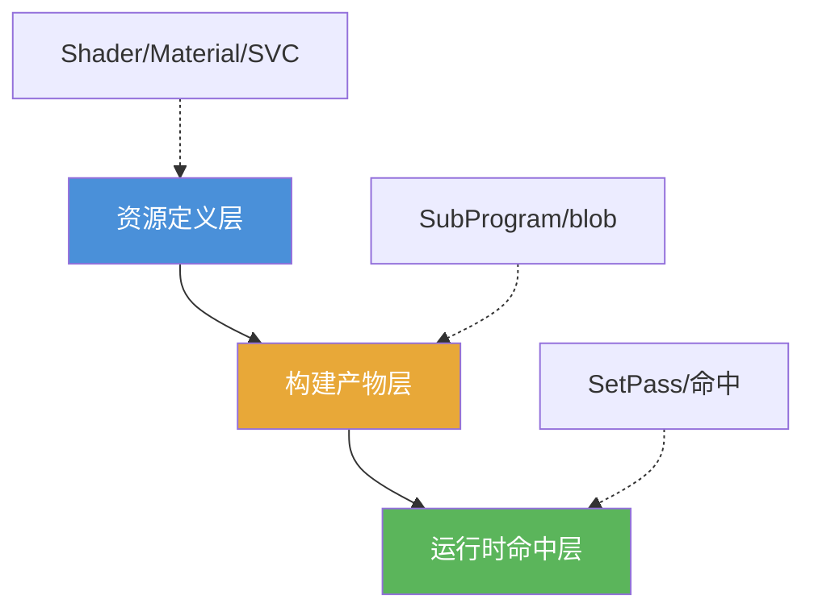

写到这里，`AssetBundle` 这条线其实已经把交付、构建、运行时加载和工程治理都铺出来了。

但只要项目里一碰到 `Shader`，问题复杂度通常就会再往上抬一层。

原因也很直接。前面那些资源，大多还能沿着下面这条线理解：

`资产定义 -> 构建切分 -> 交付 -> 运行时恢复`

可一旦对象开始依赖 `Shader`，你很快就会发现，现场问题不再只是“资源有没有进包”，而会变成这些更难的问题：

- `Material` 里到底存了什么，为什么它看起来有 shader，运行时却还是不对
- bundle 里明明有 `Shader` 资源，为什么某些 keyword 组合还是出不了正确效果
- `Shader Variant Collection` 到底是在存 shader，还是在存 variant 清单
- 为什么有时不是 variant 被过滤掉了，而是构建时根本就没有生成

这些问题如果不先分层，很容易全部被混成一句模糊的话：

`Shader 没打进去。`

但工程上，这句话通常太粗了。

所以这一篇，我不打算去做 `AssetBundle` 二进制格式考古，也不准备直接堆 `ShaderLab` 语法，而是先把一个更关键的问题拆开：

`Shader 在 AssetBundle 里，到底是以哪几层不同的身份存在的？`

## 先给一句总判断

如果把整件事压成一句话，我会这样描述：

`Shader 在 AssetBundle 里，不能被理解成“一个完整可运行 shader 被原样塞进包里”；更稳的理解是，它同时跨了资源定义层、构建期编译产物层和运行时 variant 命中层，而这三层不是同一回事。`

这句话里最关键的是三层：

1. `资源定义层`
2. `编译产物层`
3. `运行时命中层`

只要这三层一混，后面很多现场现象都会被误判：

- 以为 `Material` 里已经“自带 shader”
- 以为 bundle 里有 `Shader` 资源就等于所有 variant 都在
- 以为 `ShaderVariantCollection` 就是在“存 shader 编译结果”
- 以为粉材质、错效果、首载卡顿都是同一类根因

## 一、先把四个常被混在一起的东西拆开

真正讲 `Shader 在 AssetBundle 里怎么存` 之前，我建议先把下面四样东西拆开：

1. `Shader`
2. `Material`
3. `Shader Variant`
4. `ShaderVariantCollection`

它们经常在项目现场被一句“shader 资源”统称掉，但其实各自站在不同层。

### 1. Shader 不是材质效果本身，而是那份渲染程序定义

更稳的理解是：

`Shader` 更像一份渲染逻辑模板。

它定义的是：

- 有哪些 `SubShader`、`Pass`
- 支持哪些 keyword 路径
- 哪些属性会暴露给材质
- 在不同平台和渲染路径下，有哪些可能的编译分叉

它不是场景里那个“已经渲出来的效果”，更不是材质实例本身。

### 2. Material 存的是“这份材质怎样使用某个 Shader”

`Material` 站得更靠近资源定义层。

它更接近在存：

- 指向哪个 `Shader`
- 这份材质当前有哪些属性值
- 当前启用了哪些 keyword 或等价的功能状态
- 某些渲染状态和参数覆盖

所以 `Material` 本质上更像：

`Shader 的一次具体配置。`

它不是编译好的 GPU 程序本体。

### 3. Shader Variant 不是另一份 Shader 资源，而是某条具体编译路径

同一个 `Shader`，在不同：

- 平台
- `Pass`
- keyword 组合
- 管线条件
- 平台宏和图形 API 条件

下，会生成很多条不同的编译路径。

其中某一条具体结果，才更接近一个 `Shader Variant`。

所以 `Variant` 不该被理解成“另一个 shader 资源文件”，而更接近：

`同一份 shader 定义在某组条件下的具体编译结果。`

### 4. ShaderVariantCollection 更像“要保留或预热哪些 variant 的清单”

`ShaderVariantCollection` 更容易被误读。

它最稳的定位不是“替你装下一份完整 shader”，而是：

`把某些 shader / pass / keyword 组合显式登记出来，作为保留、定位或预热的候选集合。`

所以它更像清单，不像编译产物本体。

## 二、资源定义层：序列化数据里到底挂着什么

如果先只站在资产和序列化这一层去看，`Shader`、`Material` 和 `SVC` 的角色其实是清楚的。

### 1. Shader 资源定义层更接近“可被构建系统继续处理的模板”

从这一层理解，`Shader` 不是最终交付给 GPU 的那份稳定机器码，而更接近：

- 一份渲染程序定义
- 一套属性声明
- 一组可能的 `Pass` 和编译分叉入口

也就是说，资源定义层里的 `Shader` 还只是：

`后续构建系统可以继续拿来生成不同平台编译结果的源头。`

它本身并不等于“这次目标平台最终一定会跑的那批 variant”。

### 2. Material 存的是 shader 引用和材质状态，不是“编译结果缓存”

这也是项目里最容易混的一层。

很多时候看到 `Material` 在 bundle 里、`Shader` 引用也没丢，人就会直觉认为：

`那 shader 应该已经齐了。`

但这个判断并不稳。

更准确地说，`Material` 在序列化层主要只是负责：

- 把自己挂回某个 `Shader`
- 把属性值和功能状态带到运行时

至于这个 `Shader` 在目标平台上有哪些编译结果可用，哪些 variant 被裁掉，哪些需要预热，已经不再是 `Material` 这层单独能决定的事。

### 3. SVC 存的是“哪些 variant 值得被显式记住”，不是“完整运行时代码”

`ShaderVariantCollection` 也常被误会成“打进去就万事大吉”。

但更稳的理解是，它站在资源定义和构建治理的交界上，只是在显式表达：

- 哪些 variant 是项目认为重要的
- 哪些 variant 希望被保留或预热

它更像一份针对构建和运行时的辅助描述，而不是编译结果本体的容器。

所以从资源定义层看，一个比较稳的结论是：

`Material` 决定“怎样使用 shader”，`Shader` 决定“有哪些可能的编译分叉”，`SVC` 决定“项目显式关心哪些 variant”；它们都还不等于最终平台编译产物。`

## 三、编译产物层：真正可运行的 shader 结果是在这里被决定的

只要进入 `AssetBundle` 和 Player 构建，这件事就开始从“资源定义”跨进“平台产物”。

而很多现场问题，恰恰就出在这里。

### 1. 构建期真正做的是“把可能路径收敛成目标平台需要的那批结果”

从工程上看，构建系统面对 `Shader` 时，解决的不是“这个资源文件要不要进 bundle”这么简单，而是：

- 目标平台是什么
- 哪些 `Pass` 会参与
- 哪些 keyword 组合要生成
- 哪些 variant 会被 stripping
- 哪些 variant 根本不会进入生成阶段

也就是说，真正让 shader 变成“目标平台可运行结果”的，是构建期。

这也是为什么前面那篇 `URP Shader Prefiltering` 问题记录会成立：

`有时问题不是 variant 被后来删掉了，而是更早就没被生成。`

### 2. Shader 在 bundle 里的“存在”，不等于所有编译路径都存在

这是整篇最该先钉住的一点。

项目里很常见的一种误判是：

`我在 bundle 里看到了 shader 资源，所以运行时缺效果一定不是 variant 问题。`

这个结论通常不成立。

因为 “shader 资源存在” 和 “目标运行路径需要的那些编译结果存在”，中间还隔着整整一层构建产物边界。

更直白一点说：

- `Shader` 资源在
- `Material` 也在
- 某些 variant 依然可能不在

这三件事是完全可能同时成立的。

### 3. 真正进入交付物的，是“资源定义 + 目标平台相关编译结果”的组合

如果站在项目交付视角去理解，最终交到设备上的 shader 世界，更接近是这样一组东西：

- 可序列化的 `Shader / Material / SVC` 资源定义
- 与目标平台、目标管线、目标内容路径相关的编译结果
- 用于把运行时引用接回这些结果的必要元数据和边界信息

这也是为什么我更不建议把问题问成：

`Shader 到底是存成一个什么文件格式。`

因为更值得先理解的，不是某个版本某个 bundle 的字节摆放，而是：

`资源定义和编译产物从来就不是一层。`

### 4. 承载位置可能随版本、管线和构建路径变化，但逻辑边界不变

这一点也值得提前讲清。

如果你去追得非常底层，不同 Unity 版本、不同 SRP、不同构建路径下，最终某些 shader 编译结果具体落在哪个交付物里，承载方式可能并不完全一致。

但从工程判断上看，有个更稳定的结论不会变：

`无论最终字节落在哪个文件里，项目都应该先把 shader 资源定义层和 shader 编译产物层分开理解。`

因为真正决定粉材质、错效果、首载卡顿和 variant 缺失的，通常不是“它叫不叫同一个资源”，而是：

`目标运行路径需要的那批编译结果，到底有没有生成、有没有进入目标交付边界。`

## 四、运行时命中层：bundle 下来以后，材质怎样把 shader 接回去

到了运行时，问题又会再分叉一次。

这时候系统要做的，已经不再是“生成 variant”，而是：

`让当前材质、当前平台、当前渲染路径，命中到某条已经存在的 shader 编译结果。`

### 1. Material 先把 shader 引用和属性状态接回来

当 bundle 里的 `Material` 被恢复出来时，它会先做的是：

- 把自己重新挂回对应 `Shader`
- 把材质属性和功能状态恢复出来

这一层如果只是引用关系没接回去，现场通常会更像：

- 材质直接丢 shader
- 材质回退到默认状态
- 明显的 missing reference

### 2. 真正的效果正确与否，还取决于运行时有没有命中正确 variant

哪怕 `Material` 和 `Shader` 的引用都接回去了，运行时还要继续回答一个更具体的问题：

`当前 pass、当前 keyword 组合、当前平台路径，对应的那条 variant 是否真的存在并被命中。`

只要这一层出问题，现场就会开始出现另外一批很典型的症状：

- 材质不是完全丢了，但效果不对
- 某些 keyword 组合才错
- 某些场景入口、某些平台才错
- 首次命中某条路径时出现明显卡顿

所以“引用接回去了”和“效果一定正确”并不是一回事。

### 3. SVC 在这里更像“帮助准备或显式保留某些命中路径”

如果把 `SVC` 放回这一层，它的角色也会更清楚。

它不是替代运行时命中机制，而更像在辅助表达：

- 哪些 variant 值得提前准备
- 哪些路径不应该被轻易裁掉

所以它能影响命中质量和首载体验，但它依然不是 shader 可运行结果本体的同义词。

## 五、为什么 Shader 问题总容易在 AssetBundle 上爆出来

严格来说，这一篇的重点不是“为什么 bundle 上最容易炸”，那是下一篇更适合展开的话题。

但这里还是可以先把核心原因压一下。

### 1. AssetBundle 会把交付边界显式暴露出来

在编辑器里，很多 shader 相关问题会被更完整的资产世界“遮住”。

一旦进入 bundle 交付，边界就被硬切出来了：

- 哪些内容进了哪组交付物
- 哪些依赖必须先满足
- 哪些 variant 真正在目标构建里存在

所以很多本来就潜伏在构建层的问题，到这里会被放大。

### 2. Shader 天然跨资源定义、构建产物和运行时命中三层

普通资源很多时候只要：

`资源在 -> 引用在 -> 对象恢复成功`

问题就结束了。

但 `Shader` 不一样。

它默认至少同时跨了：

- 资源定义层
- 编译产物层
- 运行时命中层

层数一多，误判空间也就大很多。

### 3. 现场症状长在材质上，根因却常常不在材质层

这也是为什么 `Shader` 问题特别容易带来错觉。

玩家看到的是：

- 粉
- 黑
- 阴影没了
- 某个效果不对

但根因可能分别落在：

- `Material` 引用层
- shader 编译产物层
- variant 裁剪层
- 运行时命中层

而这些表面上都像“材质坏了”。

## 六、遇到 Shader 相关资源问题时，先把怀疑拆成这三刀

如果你后面真的要排查 bundle 里的 shader 问题，我更建议先按三刀收敛，而不是一句“shader 没进包”。

### 1. 第一刀：资源定义有没有问题

先看：

- `Shader` 资源是否存在
- `Material` 是否还正确引用目标 `Shader`
- `SVC` 是否真的登记了预期 variant 路径

这一刀回答的是：

`资源层定义还在不在。`

### 2. 第二刀：目标构建产物有没有问题

再看：

- 目标平台需要的 variant 是否真的生成
- stripping、prefiltering、构建配置有没有把它排掉
- 这批结果是否真的进入了目标交付边界

这一刀回答的是：

`该有的那批编译结果到底有没有形成。`

### 3. 第三刀：运行时命中有没有问题

最后再看：

- bundle 加载后引用是否接回
- 当前 keyword / pass / 平台路径是否命中正确 variant
- 问题是“没有”还是“有但首载才慢、没预热”

这一刀回答的是：

`结果有没有在正确的时机被命中和使用。`

这三刀一旦先切开，很多看起来一团雾的 `Shader` 问题，马上就会从“玄学”变回结构问题。

## 官方文档参考

- [Shader variants and keywords](https://docs.unity3d.com/Manual/shader-variants-and-keywords.html)
- [ShaderVariantCollection](https://docs.unity3d.com/ScriptReference/ShaderVariantCollection.html)
- [Shader loading](https://docs.unity3d.com/Manual/shader-loading.html)

## 最后收成一句话

如果把这篇最后再压回一句话，我会这样说：

`Shader 在 AssetBundle 里，最不该被理解成”一个完整效果资源被塞进包里”；更稳的理解是：bundle 里有资源定义，构建期决定平台编译结果，运行时再去命中具体 variant，而问题往往就出在你把这三层当成了一层。`

这也是为什么后面再继续讲：

- 为什么 `Shader Variant` 问题总在 `AssetBundle` 上爆出来
- 怎么知道项目缺了哪些 variant
- 怎么做 stripping、SVC 和回归治理

这些话题才会开始真正接得上。
