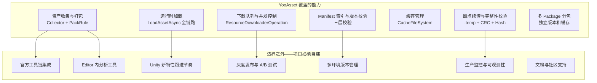
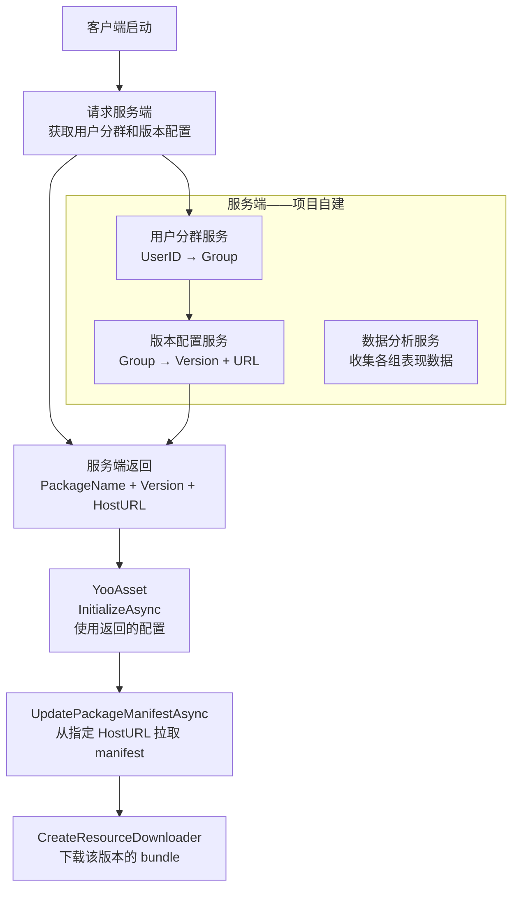

[Yoo-01]() 拆了运行时从 `LoadAssetAsync` 到资产对象就绪的完整内部链路。[Yoo-02]() 拆了 `PackageManifest` 的序列化结构和三层校验。[Yoo-03]() 拆了下载器和缓存系统的队列管理、断点续传和磁盘结构。[Yoo-04]() 拆了构建期从 Collector 到 bundle 产物的完整链路。

前四篇的结论是一致的：**YooAsset 在资源交付的核心环节——定位、下载、缓存、构建——提供了一套结构清晰、控制力强的解决方案。**

但任何框架都有边界。

这篇不是在说 YooAsset 哪里"不好"。它是一篇工程评估：哪些能力 YooAsset 已经覆盖，哪些它设计上选择不覆盖，哪些是项目必须自己补的基础设施。理解边界是选型判断的前提——知道框架做到哪里，才能规划团队需要投入多少工程量。

> 本文基于 YooAsset 2.x 源码和文档。

## 一、为什么要谈边界

每个资源管理框架都有它的设计半径。

YooAsset 的设计半径非常明确：**它是一个资源交付引擎，聚焦于资源的收集、打包、下载、缓存和加载**。在这个半径内，它的能力密度很高——[Yoo-03]() 拆过的断点续传、三重校验、双 URL 容灾都是例证。

但资源交付只是生产环节的一部分。一个完整的资源运维体系还需要：构建分析、环境管理、灰度发布、生产监控、工具链集成。这些环节有的 Addressables 有部分覆盖，有的两套框架都不覆盖。



下面逐项展开。

## 二、Unity 官方工具链集成

Addressables 是 Unity 官方 package，和 Unity 生态深度绑定。YooAsset 是第三方社区项目，这意味着一系列集成层面的差异。

### 不集成 Unity Cloud Build 和 Unity DevOps

Addressables 可以直接在 Unity Cloud Build 中构建——Group 配置、Profile 设置、构建脚本都被官方 CI 系统识别。YooAsset 的 Collector 配置和构建流程对 Unity Cloud Build 不可见。如果项目使用 Unity DevOps，需要自己写 BuildScript 来驱动 YooAsset 的构建流程。

### 没有官方 Profiler Module

Addressables 有专门的 Event Viewer 和 Profiler 模块，可以在 Unity Profiler 中直接看到 asset 加载事件、引用计数变化和 bundle 生命周期。YooAsset 运行时的调度过程——ProviderOperation 的状态流转、BundleLoader 的引用计数变化——在 Unity Profiler 中没有专属入口。要做同等深度的运行时诊断，项目需要自建。

### Package Manager 分发 vs 手动导入

Addressables 通过 Unity Package Manager（UPM）安装和更新，版本管理、依赖解析都由 UPM 处理。YooAsset 的常见接入方式是 GitHub 手动导入或通过 git URL 引用。虽然 YooAsset 也支持 UPM 格式，但不在 Unity 官方 Registry 中，更新需要项目手动追踪 GitHub releases。

### 项目需要补什么

| 缺口 | 自建方案 |
|------|---------|
| CI 集成 | 在 Jenkins/GitLab CI/GitHub Actions 中写自定义 BuildScript 调用 YooAsset 构建 API |
| 运行时 Profiler | 自建调试面板，订阅 YooAsset 的回调事件，输出 bundle 加载时序和引用计数 |
| 版本更新追踪 | 设定固定周期检查 YooAsset GitHub releases，评估更新内容和兼容性 |

## 三、Editor 内分析工具

### Addressables 的内置分析规则

Addressables 提供一组 Analyze Rules，在 Editor 中可以直接运行：

- **Check Duplicate Bundle Dependencies**：检测同一个资产被多个 bundle 重复包含
- **Check Resources to Addressable Duplicate Dependencies**：检测 Resources 目录和 Addressable Groups 之间的重复
- **Build Bundle Layout**：预览构建后的 bundle 布局
- **Check Scene to Addressable Duplicate Dependencies**：检测场景和 Addressable 之间的依赖重复

这些规则在构建前就能发现潜在的包体膨胀问题——不需要先打 bundle，不需要部署到设备上。

### YooAsset 的 Editor 工具现状

YooAsset 的 Editor 工具集中在 Collector 配置界面和构建报告查看。[Yoo-04]() 拆过构建报告包含资产到 bundle 的映射和大小统计——这些信息在构建完成后可以做分析。

但 YooAsset 没有内置的构建前分析规则。

具体来说：

**没有等价的 "Check Duplicate Bundle Dependencies" 规则。** 共享依赖的重复打包问题需要在构建后检查报告，或者自己写 Editor 脚本在构建前扫描。[Yoo-04]() 提到 `DependAssetCollector` 可以显式管理共享依赖——但这是一种预防手段，不是检测手段。如果漏配了 DependAssetCollector，框架不会在构建前告诉你。

**没有内置的 bundle 大小预估。** Addressables 的 Analyze 可以在不执行完整构建的情况下预览 bundle 布局。YooAsset 必须完整执行构建后才能从报告中看到大小数据。

### 项目需要补什么

| 缺口 | 自建方案 |
|------|---------|
| 构建前重复依赖检测 | 基于 `AssetDatabase.GetDependencies` 写 Editor 脚本，扫描所有 Collector 覆盖的资产，检测被多 bundle 引用但未被 DependAssetCollector 管理的资产 |
| bundle 大小预估 | 在 CI 中自动化：构建后解析 BuildReport，对超过阈值（如 10MB）的 bundle 触发告警 |
| 自定义分析规则 | 利用 YooAsset BuildReport 的结构化数据（比文本格式更容易自动化），编写项目特定的分析逻辑 |

值得注意的是，YooAsset 的 BuildReport 是结构化数据而非纯文本——这一点在 [Yoo-04]() 中和 Addressables 的 BuildLayout.txt 做过对比。虽然没有内置分析规则，但结构化数据让自建分析工具的门槛更低。

## 四、Unity 新特性跟进节奏

### 社区驱动 vs 官方驱动

Addressables 作为 Unity 官方 package，和引擎版本同步发布。Unity 6 引入的新特性（比如 `Object.InstantiateAsync`、Content Pipeline 变更）会在 Addressables 的对应版本中得到适配。

YooAsset 是社区维护的项目，更新节奏取决于维护者的投入。新的 Unity 版本发布后，YooAsset 的适配存在一个时间窗口——这个窗口可能是几周，也可能更长。

### 具体的风险点

**Unity 6 兼容性：** Unity 6 对 AssetBundle 底层有若干调整（SBP 变化、序列化格式演进）。Addressables 2.x 是随 Unity 6 一起发布的，原生兼容。YooAsset 需要单独验证和适配。

**新 API 支持：** Unity 持续在引擎层面引入新的资源加载和实例化 API。这些 API 和现有的 AssetBundle 加载链路可能有交互关系。Addressables 可以在 Provider 层面直接对接新 API，YooAsset 需要在自己的 Loader 层面做适配。

**BuildPipeline 演进：** 如果 Unity 未来对 `BuildPipeline.BuildAssetBundles` 做重大变更或弃用，YooAsset 的 BuiltinBuildPipeline 模式会直接受到影响。使用 ScriptableBuildPipeline 模式可以降低这一风险，因为 SBP 的接口层更稳定。

### 项目需要补什么

| 缺口 | 应对策略 |
|------|---------|
| Unity 升级前兼容性验证 | 在 Unity 大版本升级前，先在分支上验证 YooAsset 是否兼容目标 Unity 版本 |
| 关键特性缺失时的应急方案 | 评估是否需要 fork YooAsset 仓库，在项目内维护适配补丁 |
| 长期跟进策略 | 订阅 YooAsset GitHub 的 release 和 issues，关注维护活跃度和社区反馈 |

## 五、灰度发布和 A/B 测试

### YooAsset 的多 Package 能力

[Yoo-01]() 拆过 YooAsset 的多 `ResourcePackage` 设计：每个 Package 有独立的 Manifest、独立的缓存目录、独立的版本号。这个能力可以作为 A/B 测试的基础——理论上可以为不同用户群体加载不同的 Package。

但从 Package 能力到完整的灰度发布系统，中间有一段很长的路需要项目自己走。

### YooAsset 不覆盖的环节

**服务端版本路由：** YooAsset 的 `HostPlayMode` 接收一个 host server URL。客户端请求哪个版本的 manifest，由这个 URL 决定。但 YooAsset 不管"哪些用户应该拿到哪个版本"——这是服务端的职责。

**用户分群：** 按用户 ID、设备类型、地区、渠道把用户分成不同的灰度组，让每组拿到不同版本的资源——这完全在 YooAsset 的设计范围之外。

**CDN 路由：** A/B 测试场景下，不同用户组可能需要从 CDN 的不同路径获取 bundle。YooAsset 支持动态设置 host URL，但路由逻辑需要在服务端实现。

**数据回收与分析：** A/B 测试的目的是对比两组用户的表现数据。下载成功率、加载耗时、crash 率这些指标的采集和分析，完全是项目自建的领域。

### 项目需要补什么



关键实现要点：

- 服务端维护 `用户ID → 灰度组 → 版本配置` 的映射
- 版本配置包含 `PackageName`、`PackageVersion` 和 `HostServerURL`
- 客户端在 YooAsset 初始化前先向服务端请求配置，然后用返回的参数初始化
- YooAsset 的 `IQueryServices` 接口可以在这里承接动态 URL 的注入

## 六、多环境版本管理

### Addressables 的 Profile 机制

Addressables 内置了 ProfileSettings——一套环境变量管理系统。项目可以定义多个 Profile（Dev、Staging、Prod），每个 Profile 设置不同的 `RemoteLoadPath`、`RemoteBuildPath`、`LocalBuildPath`。在 Editor 中切换 Profile 就切换了整个环境配置。

### YooAsset 的做法

YooAsset 没有内置 Profile 概念。

`HostPlayModeParameters` 接收 `IRemoteServices` 接口来获取远端 URL。URL 怎么取、指向哪个环境，完全由项目代码决定。

```csharp
// YooAsset 的环境切换是代码级的
var initParameters = new HostPlayModeParameters();
initParameters.RemoteServices = new MyRemoteServices(currentEnvironment);

// 没有 Editor 面板上的 Profile 下拉菜单
// 没有构建时自动选择 Profile 的机制
```

### 缺什么

**没有 Editor 面板的环境切换。** Addressables 的 Profile 下拉菜单让策划和 QA 可以在 Editor 里一键切换环境。YooAsset 的环境切换是代码逻辑，非技术人员无法直接操作。

**构建产物和环境的绑定需要手动管理。** Addressables 构建时会根据当前 Profile 自动设置 bundle 的部署路径。YooAsset 构建后的产物和部署路径之间没有框架层的绑定——需要在 CI 脚本中处理"这次构建的产物应该部署到哪个 CDN 目录"。

### 项目需要补什么

| 缺口 | 自建方案 |
|------|---------|
| 环境配置管理 | 自建 `EnvironmentConfig` ScriptableObject，包含各环境的 HostURL、CDN 路径、调试开关 |
| Editor 面板切换 | 自建 Editor 窗口或在 Inspector 中增加环境下拉菜单，驱动 `IRemoteServices` 实现 |
| 构建到部署的环境绑定 | 在 CI 脚本中根据构建参数决定产物上传路径（如 `cdn.example.com/dev/` vs `cdn.example.com/prod/`） |

实际工程量不大——一个 ScriptableObject 加一个简单的 Editor 窗口就能覆盖基本需求。但这确实是一笔需要预算的投入。

## 七、生产监控和可观测性

### YooAsset 提供了事件回调，但没有内置监控

YooAsset 在下载和加载的关键节点提供了回调和状态查询接口。[Yoo-03]() 拆过 `ResourceDownloaderOperation` 暴露的进度属性：`TotalDownloadBytes`、`CurrentDownloadBytes`、`Progress`。下载失败时也有错误信息可以获取。

但这些都是原始数据点。从原始数据到生产级的可观测性，中间有一系列环节需要项目自建。

### 需要补的监控指标

**下载指标：**
- 下载成功率（按 bundle 粒度、按版本粒度）
- 平均下载耗时
- 下载失败原因分布（超时、DNS 失败、HTTP 错误码）
- 断点续传触发频率和成功率

**缓存指标：**
- 缓存命中率（`LoadAssetAsync` 命中本地缓存 vs 触发下载的比例）
- 缓存目录总大小和增长趋势
- `ClearUnusedCacheFilesAsync` 清理的文件数和释放空间

**加载指标：**
- `LoadAssetAsync` 耗时分布（P50/P95/P99）
- bundle 加载耗时（`AssetBundle.LoadFromFileAsync` 的实际耗时）
- 加载失败率和失败原因

**版本更新指标：**
- `UpdatePackageVersionAsync` 的网络延迟
- manifest 下载大小和耗时
- 增量更新比例（需要下载的 bundle 数 / 总 bundle 数）

### 项目需要补什么

```csharp
// 监控集成的基本模式
public class YooAssetMonitor
{
    // 订阅下载事件
    public void OnDownloadProgress(ResourceDownloaderOperation op)
    {
        // 上报进度指标到监控系统（Grafana、Firebase、自建埋点等）
        Report("download_progress", new {
            total = op.TotalDownloadBytes,
            current = op.CurrentDownloadBytes,
            fileCount = op.TotalDownloadCount
        });
    }

    // 订阅下载完成/失败
    public void OnDownloadComplete(bool success, string error)
    {
        Report("download_result", new {
            success,
            error,
            timestamp = DateTime.UtcNow
        });
    }

    // 包装 LoadAssetAsync 记录耗时
    public async AssetOperationHandle LoadWithMetrics<T>(
        ResourcePackage package, string address)
    {
        var startTime = Time.realtimeSinceStartup;
        var handle = package.LoadAssetAsync<T>(address);
        await handle;
        var duration = Time.realtimeSinceStartup - startTime;
        Report("load_duration", new {
            address,
            duration,
            success = handle.Status == EOperationStatus.Succeed
        });
        return handle;
    }
}
```

这不是框架的缺陷——Addressables 同样不提供开箱即用的生产监控。但 Addressables 的 Event Viewer 至少在开发期提供了一个可视化的调试入口。YooAsset 的运行时诊断完全依赖项目自建。

## 八、文档和社区支持

### 文档语言

YooAsset 的官方文档和代码注释以中文为主。对于中文团队来说这是优势——直接阅读设计意图，不需要翻译。但对于英文环境或国际化团队，这是一个现实的障碍。

对比来看，Addressables 的文档在 Unity Manual 中有完整的英文版本，社区讨论（Unity Forums、Stack Overflow、Reddit）也以英文为主。

### 社区支持渠道

| 渠道 | Addressables | YooAsset |
|------|-------------|---------|
| 官方文档 | Unity Manual（英文，持续更新） | GitHub Wiki + README（中文为主） |
| 社区问答 | Stack Overflow（大量问答积累） | GitHub Issues（中文为主） |
| 实时交流 | Unity Forums | QQ 群 |
| 源码可读性 | UPM 安装后可直接在 IDE 中浏览 | GitHub 克隆或 UPM git 引用 |

### 项目需要评估什么

**团队语言能力：** 如果团队成员对中文技术文档不适应，YooAsset 的学习曲线会显著增加。框架的设计意图、Collector 配置的最佳实践、运行时行为的边界情况——这些信息主要分布在中文文档和社区讨论中。

**问题排查路径：** Addressables 的问题可以在 Stack Overflow 搜索到大量已有解答。YooAsset 的问题排查更多依赖直接阅读源码——好消息是 YooAsset 的源码结构比 Addressables 更直接（[Yoo-01]() 到 [Yoo-04]() 全部是源码级拆解），阅读门槛比 Addressables 低。

**依赖风险：** 社区项目的长期维护取决于维护者。如果项目的生命周期规划是 3 年以上，需要评估 YooAsset 的维护活跃度。一个务实的做法是 fork 仓库到项目内部，确保即使上游停止维护，项目也有源码级的修改能力。

## 九、和 Addressables 的边界对比

把两套框架的边界放在一起做一个结构化对照。

| 边界维度 | YooAsset | Addressables |
|---------|---------|-------------|
| Unity Cloud Build 集成 | 不支持，需自建 CI 脚本 | 原生支持 |
| Profiler 集成 | 无内置模块，需自建调试面板 | Event Viewer + Profiler Module |
| Package Manager 分发 | 非官方 Registry，手动追踪更新 | 官方 UPM Registry |
| 构建前分析规则 | 无内置，需自建 Editor 脚本 | Analyze Rules（重复依赖检测等） |
| 构建报告格式 | 结构化数据（自动化友好） | BuildLayout.txt（人工阅读友好） |
| Unity 新特性跟进 | 社区驱动，存在适配时间窗口 | 官方同步发布 |
| 灰度发布 | 多 Package 提供基础，路由逻辑需自建 | 无内置，同样需自建 |
| 环境管理 | 无内置 Profile，代码级配置 | ProfileSettings，Editor 面板可切换 |
| 生产监控 | 提供回调接口，监控系统需自建 | 提供 Event Viewer 但仅限开发期 |
| 文档语言 | 中文为主 | 英文为主 |
| 社区覆盖 | GitHub Issues + QQ 群 | Unity Forums + Stack Overflow |
| 源码阅读门槛 | 结构直接，扁平链路 | 多层抽象，Provider 链较深 |
| 下载基础设施 | 内置队列、断点续传、双 URL 容灾 | 需自建或依赖第三方 |
| 缓存控制力 | 应用层自管，文件级操作 | 引擎托管，操作受限 |

一个核心判断浮出来了：**YooAsset 在交付基础设施（下载/缓存/校验）上的覆盖度高于 Addressables，但在工具链集成和治理基础设施（分析/监控/环境管理）上的覆盖度低于 Addressables。**

这不是好坏的判断，而是设计半径的差异。YooAsset 选择把精力集中在交付核心上做到高控制力，把治理和集成留给项目。Addressables 选择覆盖更宽的范围，但在每个环节的控制力相对更弱。

## 十、工程判断——YooAsset 适合什么项目、不适合什么项目

### YooAsset 的甜区

**移动端重热更项目。** YooAsset 的交付基础设施——断点续传、三重校验、并发控制、双 URL 容灾——是为移动端弱网环境和频繁热更场景设计的。如果项目每周甚至每天推送热更内容，YooAsset 的显式下载分离（[Yoo-03]()）和全量构建 + 运行时 diff（[Yoo-04]()）比 Addressables 的按需下载 + content_state.bin 更安全。

**中文技术团队。** 文档、社区、源码注释全部中文，学习和排查效率高。源码结构扁平，遇到问题直接看代码的门槛低。

**需要精细下载/缓存控制的项目。** 下载队列管理、缓存目录操作、文件级清理——这些在 Addressables 里需要绕过框架或扩展 Provider 才能实现，YooAsset 开箱即用。

**CI/CD 要求高的团队。** 无状态全量构建意味着任何 commit 都能独立产出完整的构建产物，不依赖 `content_state.bin` 这样的外部状态文件。CI pipeline 的复杂度显著降低。

### YooAsset 的痛点

**深度依赖 Unity 官方工具链的团队。** 如果团队的排查能力建立在 Event Viewer、Profiler Module、Addressables Analyze 上，切换到 YooAsset 意味着这些工具都不能用，需要自建替代方案。

**英文环境团队。** 文档和社区以中文为主，英文资料有限。如果团队成员不具备中文阅读能力，学习成本会显著增加。

**需要构建前分析的项目。** 如果项目的资产规模大、共享依赖关系复杂，构建前检测重复打包是一个高优需求。Addressables 有内置规则，YooAsset 需要自建。

**跟进 Unity 最新特性的项目。** 如果项目需要在 Unity 新版本发布后快速升级，Addressables 的官方同步发布提供了更高的兼容性保证。YooAsset 存在适配窗口期的风险。

### 决策框架

| 项目条件 | 推荐 | 原因 |
|---------|------|------|
| 移动端，频繁热更，中文团队 | YooAsset | 交付基础设施完整，中文文档友好 |
| 移动端，频繁热更，英文团队 | 评估：团队是否愿意读源码 | YooAsset 源码门槛低但文档是中文 |
| PC/主机端，不需要热更 | Addressables | 官方集成优势明显，热更能力用不上 |
| 深度使用 Unity Cloud Build | Addressables | YooAsset 不集成 Unity 官方 CI |
| CI 无状态构建要求 | YooAsset | 不依赖 content_state.bin |
| 需要构建前重复依赖检测 | Addressables，或 YooAsset + 自建脚本 | Addressables 有内置 Analyze Rules |
| 需要精细缓存控制 | YooAsset | CacheFileSystem 提供文件级操作 |
| 需要断点续传和双 URL 容灾 | YooAsset | 内置支持，Addressables 需自建 |
| 生产级监控和可观测性 | 两者都需要自建 | 都没有开箱即用的生产监控 |
| 灰度发布 / A/B 测试 | 两者都需要自建 | 都没有内置灰度路由 |
| 项目生命周期 > 5 年 | 评估：Addressables 有官方维护保障 | YooAsset 是社区项目，长期维护存在不确定性 |

### 边界总结

YooAsset 是一个交付引擎，不是一个全栈资源运维平台。它的设计哲学是：**把核心做精（下载、缓存、校验、加载），把外围留给项目**。

选择 YooAsset 的团队，需要在以下领域预留工程投入：

1. **CI/CD 脚本**——驱动 YooAsset 构建 API
2. **构建分析工具**——重复依赖检测、bundle 大小监控
3. **环境管理系统**——Dev/Staging/Prod 的 URL 和配置切换
4. **运行时诊断面板**——替代 Addressables 的 Event Viewer
5. **生产监控埋点**——下载/缓存/加载指标的采集和上报
6. **灰度发布服务**——如果需要的话，服务端的版本路由和用户分群

这些投入不是 YooAsset 的"缺陷"——而是它作为一个聚焦型框架的合理边界。团队在选型时，需要把这些工程量计入总成本，和 Addressables 的"官方但控制力弱"方案做总账比较。

---

这篇把 YooAsset 的能力边界逐项展开，从官方工具链集成到文档社区支持，共覆盖了八个维度。

核心结论就两句话：

1. **YooAsset 的设计半径是资源交付引擎**——在这个半径内（下载/缓存/校验/加载/构建），它的控制力和工程完整度很高。

2. **半径之外的治理和集成层，是项目必须自建的领域**——CI 集成、构建分析、环境管理、生产监控、灰度发布。团队选型时需要把这些自建成本计入技术投资的总账。

后续 Cmp-03（治理能力对比）会把 YooAsset 和 Addressables 在版本控制、缓存管理、下载治理和回滚机制上做逐项结构对比。
