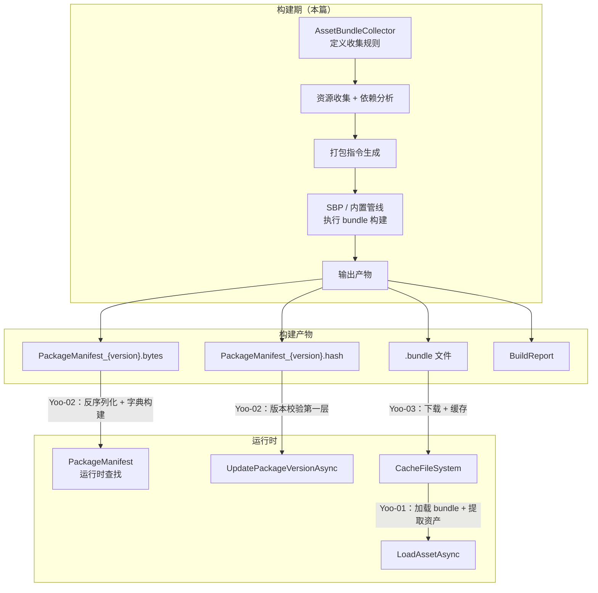
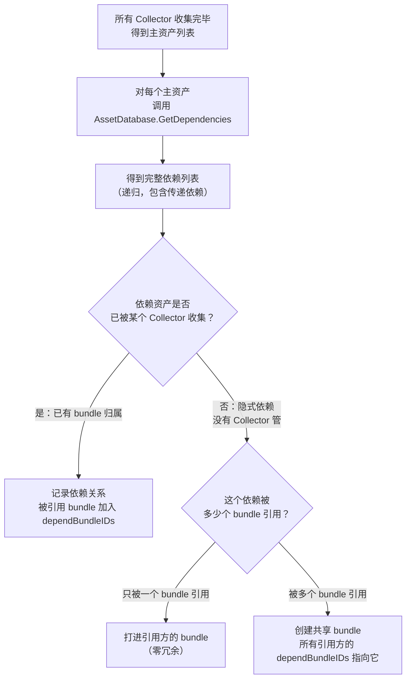
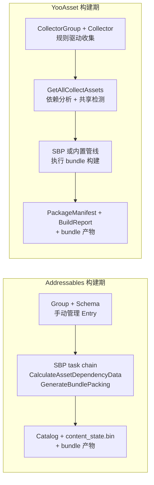

[Yoo-01]() 拆了运行时从 `LoadAssetAsync` 到资产对象就绪的完整内部链路。[Yoo-02]() 拆了 `PackageManifest` 的序列化结构和三层校验。[Yoo-03]() 拆了下载器和缓存系统的队列管理、断点续传和磁盘结构。

那三篇全部是运行时视角——回答的是"资源怎么被定位、怎么被下载、怎么被加载"。

但有一个更前置的问题一直没展开：

`运行时拿到的那些 bundle 文件和 PackageManifest，在构建期是怎么生成出来的？`

具体来说：

- 项目里几千个资产，哪些进 bundle、怎么分组、谁和谁打在一起——这些规则是怎么定义的？
- 资产之间的依赖关系在构建期是怎么分析的？共享依赖怎么处理？
- bundle 的文件名怎么确定？输出目录长什么样？
- 构建报告里有什么？怎么用它做优化？
- 和 Addressables 的构建期相比，结构上有什么差异？

这篇接上这些口子，沿 YooAsset 构建期的完整链路走一遍。

> **版本基线：** 本文源码分析基于 YooAsset 2.x（https://github.com/tuyoogame/YooAsset）。

## 一、构建期在整个 YooAsset 体系中的位置

先把构建期在 YooAsset 整体流程中的位置锚住。

YooAsset 的完整生命周期分两段：**构建期**和**运行时**。构建期在 Unity Editor 中执行，产出的文件交给运行时消费。

构建期的输出是四类产物：

- `.bundle` 文件：打好的 AssetBundle 文件，每个 bundle 包含一组资产
- `PackageManifest_{version}.bytes`：manifest 二进制文件，运行时反序列化后成为 `PackageManifest` 对象（[Yoo-02]() 详细拆过它的结构）
- `PackageManifest_{version}.hash`：manifest 文件的哈希值，用于远端版本比对
- `BuildReport`：构建报告，记录资产-bundle 映射、依赖关系和大小统计

这四类产物和运行时三篇文章的对应关系：



### YooAsset 和 SBP 的关系

在[构建管线分层]()那篇里讲过，SBP（Scriptable Build Pipeline）是 AssetBundle 的构建执行层，Addressables 的 Build Script 在它之上建立内容组织语义。

YooAsset 的构建期和 SBP 的关系更灵活。YooAsset 2.x 支持两种构建管线：

**BuiltinBuildPipeline：** 使用 Unity 内置的 `BuildPipeline.BuildAssetBundles` API。这是最传统的路径，不依赖 SBP package。

**ScriptableBuildPipeline：** 使用 SBP 的 `ContentPipeline.BuildAssetBundles`。和 Addressables 一样走 SBP 的 task chain（`GenerateBundlePacking → GenerateBundleCommands → WriteSerializedFiles → ArchiveAndCompressBundles`），能利用 SBP 的增量构建缓存。

但不管选哪种管线，YooAsset 构建期的核心职责都一样：**把 Collector 配置转化成打包指令，交给底层管线执行，然后从构建结果中生成 manifest 和报告**。

管线选择只影响"bundle 怎么被写出来"这一步，不影响上层的收集、分析和产物生成。

## 二、AssetBundleCollector 配置体系

YooAsset 构建期的起点是 Collector 配置。这套配置决定了"哪些资产进 bundle、怎么分组、地址怎么生成"。

### 层级结构

Collector 配置是一个两级树形结构：

```
AssetBundleCollectorPackage         ← 包级别（对应一个 ResourcePackage）
├── AssetBundleCollectorGroup       ← 组级别
│   ├── AssetBundleCollector        ← 收集器
│   ├── AssetBundleCollector
│   └── ...
├── AssetBundleCollectorGroup
│   ├── AssetBundleCollector
│   └── ...
└── ...
```

**AssetBundleCollectorGroup** 是组织单元。一个 Group 对应一类资源（比如"角色"、"场景"、"UI"），包含一个或多个 Collector。Group 上可以设置标签（Tags），这些标签会传递给组内所有 Collector 产出的 bundle——这就是 [Yoo-03]() 中 `PackageBundle.Tags` 的来源。

**AssetBundleCollector** 是实际的收集规则。每个 Collector 指向一个目录或文件，通过一组规则决定怎么收集资产、怎么分包、地址怎么生成。

源码位置：`YooAsset/Editor/AssetBundleCollector/AssetBundleCollectorGroup.cs`、`YooAsset/Editor/AssetBundleCollector/AssetBundleCollector.cs`

### 五个核心配置维度

每个 `AssetBundleCollector` 上有五个关键配置，控制收集和打包行为的不同方面。

#### 1. CollectorType：这个 Collector 的职责是什么

| 值 | 含义 |
|---|---|
| MainAssetCollector | 收集主资产——这些资产会被注册到 manifest 中，运行时可以通过 address 直接加载 |
| StaticAssetCollector | 收集静态资产——会被打进 bundle 但不注册 address，运行时不能直接按地址加载 |
| DependAssetCollector | 收集依赖资产——显式声明某些资产作为共享依赖，由这个 Collector 管理其打包方式 |

`MainAssetCollector` 最常用——角色预制体、UI、场景文件都通过它收集。`StaticAssetCollector` 适用于只作为依赖存在、不需要直接加载的资产（如共享 Shader）。`DependAssetCollector` 最容易被忽视但最关键——后面第三节会详细讲它在依赖管理中的角色。

#### 2. AddressRule：地址怎么生成

| 规则 | 生成的地址 | 示例 |
|---|---|---|
| AddressByFileName | 文件名（不含扩展名） | `Hero` |
| AddressByFilePath | 完整资产路径 | `Assets/Characters/Hero.prefab` |
| AddressByGroupAndFileName | 组名 + 文件名 | `Characters_Hero` |
| AddressByFolderAndFileName | 文件夹名 + 文件名 | `Characters_Hero` |

地址规则决定了运行时 `LoadAssetAsync` 时用什么字符串定位资产——这就是 [Yoo-02]() 中 `PackageAsset.Address` 字段的来源。也可以实现 `IAddressRule` 接口编写自定义规则。

#### 3. PackRule：资产怎么分到 bundle 里

| 规则 | 打包方式 |
|---|---|
| PackSeparately | 每个资产一个 bundle |
| PackDirectory | 同一目录下的资产打进同一个 bundle |
| PackTopDirectory | 按顶层子目录分 bundle |
| PackCollector | 整个 Collector 收集的资产打进一个 bundle |
| PackGroup | 整个 Group 下所有 Collector 的资产打进一个 bundle |
| PackRawFile | 作为原始文件（非 AssetBundle 格式）输出 |

PackRule 是影响运行时性能最直接的配置。粒度太细导致 bundle 数量爆炸和 IO 开销，太粗导致加载浪费。项目可以实现 `IPackRule` 接口自定义打包规则。

#### 4. FilterRule：收集哪些文件

| 规则 | 过滤方式 |
|---|---|
| CollectAll | 目录下所有资产 |
| CollectScene | 只收集 .unity 场景文件 |
| CollectPrefab | 只收集 .prefab 预制体 |
| CollectSprite | 只收集图片精灵 |

FilterRule 在资产枚举阶段做第一道筛选。项目也可以实现 `IFilterRule` 接口自定义过滤规则。

### 和 Addressables 的配置对比

Addressables 的输入定义是 **Group + BundledAssetGroupSchema**。

对照来看：

| 配置维度 | Addressables | YooAsset |
|---------|-------------|---------|
| 组织单元 | Group（直接包含 Entry 列表） | Group → Collector（两级结构） |
| 打包粒度 | BundleMode（PackTogether / PackSeparately / PackTogetherByLabel） | PackRule（6+ 种内置规则 + 自定义） |
| 地址生成 | Entry 的 address 属性（手动或自动） | AddressRule（规则化生成） |
| 资产筛选 | 手动添加文件/文件夹到 Group | FilterRule（规则化筛选） |
| 共享依赖 | 自动分析 + Shared Bundle 策略 | DependAssetCollector 显式声明 |

核心差异在于：Addressables 的 Group 是"先把资产拖进来，再配打包参数"；YooAsset 的 Collector 是"先定义规则，再由规则自动收集资产"。

规则驱动的好处是批量管理效率高——新增资产放在正确目录下自动收集。缺点是规则设错时影响面更大。

## 三、从 Collector 到打包指令——资源收集和依赖分析

Collector 配置定义了规则。构建期的下一步是执行这些规则，把项目里的资产收集出来、分析依赖、生成打包指令。

### 资源收集：GetAllCollectAssets

每个 `AssetBundleCollector` 通过 `GetAllCollectAssets` 方法枚举它负责收集的资产。

内部逻辑大致如下：

```
AssetBundleCollector.GetAllCollectAssets():
  1. 获取 CollectPath 指向的目录（或单文件）
  2. 枚举目录下的所有文件
  3. 应用 FilterRule 过滤
     → CollectScene → 只保留 .unity
     → CollectPrefab → 只保留 .prefab
     → CollectAll → 全部保留
  4. 对每个通过过滤的文件，创建 CollectAssetInfo
     → 根据 AddressRule 生成地址
     → 根据 PackRule 分配 bundle 名
     → 标记 CollectorType（Main / Static / Depend）
  5. 返回 List<CollectAssetInfo>
```

源码位置：`YooAsset/Editor/AssetBundleCollector/AssetBundleCollector.cs`

### PackRule 怎么决定 bundle 归属

每个资产经过 PackRule 后会得到一个 bundle 名称字符串。**bundle 名称相同的资产会被打进同一个 bundle**。比如 `PackDirectory` 下，`Assets/Characters/` 目录内的 Hero、Villain、NPC 三个预制体都得到 `"assets_characters"` 这个 bundle 名，最终打进同一个 bundle。`PackSeparately` 则让每个资产独占一个 bundle。

### 依赖分析

资产收集完成后，构建系统需要分析依赖关系——预制体引用的材质、Shader、贴图等隐式依赖必须在构建期处理好。



依赖分析的核心决策是：**隐式依赖（没有被任何 Collector 显式收集的资产）该怎么处理**。

如果一个贴图只被一个预制体引用，最高效的做法是直接打进那个预制体所在的 bundle——不额外创建 bundle，运行时也不需要额外的 bundle 加载。

如果一个贴图被三个不同 bundle 里的预制体引用，必须把它单独提取到一个共享 bundle 里。否则这张贴图会被复制三份，分别打进三个 bundle，造成包体膨胀和内存浪费。

这和 Addressables 的 `CalculateAssetDependencyData` + 共享 bundle 策略在目标上一致——都是要解决"共享依赖不能重复打包"的问题。但实现路径不同：Addressables 在 SBP 的 task chain 中处理，YooAsset 在自己的收集分析阶段处理。

### DependAssetCollector 的角色

`DependAssetCollector` 是 YooAsset 提供的一种显式依赖管理机制。

默认情况下，构建系统会自动分析隐式依赖并决定怎么处理。但项目可以通过 `DependAssetCollector` 主动声明：某些资产是共享依赖，由我来指定它们的打包方式。

典型场景：

```
Group: SharedAssets
  Collector: (DependAssetCollector)
    CollectPath: Assets/SharedTextures/
    PackRule: PackDirectory
    → 所有共享贴图打进 "assets_sharedtextures" 这个 bundle

Group: Characters
  Collector: (MainAssetCollector)
    CollectPath: Assets/Characters/
    PackRule: PackSeparately
    → 每个角色一个 bundle

Group: Environments
  Collector: (MainAssetCollector)
    CollectPath: Assets/Environments/
    PackRule: PackDirectory
    → 每个场景目录一个 bundle
```

角色和场景的预制体都引用了共享贴图。因为共享贴图已经被 `DependAssetCollector` 显式管理，构建系统不需要再做"猜测"——这些贴图的 bundle 归属是确定的。角色和场景的 bundle 的 `dependBundleIDs` 会指向 `assets_sharedtextures`。

Addressables 没有显式的 DependAssetCollector 概念，共享依赖完全由构建系统自动处理。YooAsset 给了项目选择——可以让系统自动处理，也可以自己显式管理。

## 四、Bundle 命名和输出结构

资产收集和依赖分析完成后，构建系统生成打包指令，交给底层管线（`BuiltinBuildPipeline` 或 `ScriptableBuildPipeline`）执行。执行完成后，产物被组织到输出目录。

### Bundle 命名策略

YooAsset 的 bundle 命名由两部分组成：

**逻辑名称：** 由 PackRule 在收集阶段生成，反映资产的目录结构。比如 `assets_characters_hero` 或 `assets_ui`。

**最终文件名：** 在逻辑名称的基础上附加哈希值，确保文件名在内容变化时一起变化。最终文件名的具体格式取决于 `IFileNameStyle` 配置：

| 命名风格 | 文件名示例 | 说明 |
|---------|----------|------|
| HashName | `a1b2c3d4e5f6.bundle` | 纯哈希值，最短，完全不暴露目录结构 |
| BundleName_HashName | `assets_characters_hero_a1b2c3d4.bundle` | 逻辑名 + 哈希，可读性和唯一性兼顾 |
| BundleName | `assets_characters_hero.bundle` | 纯逻辑名，无哈希后缀 |

源码位置：`YooAsset/Editor/AssetBundleBuilder/` 目录下的文件名风格相关实现。

哈希值基于 bundle 文件内容计算。内容不变则文件名不变，对 CDN 缓存策略很重要。这就是 [Yoo-02]() 中 `PackageBundle.BundleName` 和 `PackageBundle.FileHash` 的来源。

### 输出目录结构

构建产物的输出目录大致如下：

```
{OutputRoot}/{BuildPipeline}/{BuildTarget}/{PackageName}/{PackageVersion}/
├── PackageManifest_{PackageVersion}.bytes    ← manifest 二进制文件
├── PackageManifest_{PackageVersion}.hash     ← manifest 的哈希值
├── PackageManifest_{PackageVersion}.json     ← manifest 可读版本（调试用）
├── {BundleName_1}.bundle                     ← bundle 文件
├── {BundleName_2}.bundle
├── {BundleName_3}.bundle
└── ...
```

`{BuildTarget}` 层确保不同平台的产物隔离。`{PackageVersion}` 层让每次构建产物独立存放，支持多版本并存和按需发布。构建时还会输出一份 `.json` 版本的 manifest 供调试用——二进制版本给运行时，JSON 版本给人看。

### PackageManifest 的生成

manifest 是构建期最重要的产物之一。它的生成过程就是把构建结果转化成运行时需要的索引数据。

```
构建完成后生成 manifest 的过程：
  1. 遍历所有构建产出的 bundle 文件
  2. 对每个 bundle 计算 FileHash、FileCRC、FileSize
  3. 为每个被 MainAssetCollector 收集的资产创建 PackageAsset
     → 填入 Address、AssetPath、AssetGUID
     → 填入 BundleID（该资产所在 bundle 的索引）
     → 填入 DependBundleIDs（依赖 bundle 的索引数组）
  4. 为每个 bundle 创建 PackageBundle
     → 填入 BundleName、FileHash、FileCRC、FileSize、Tags
  5. 设置 PackageVersion
  6. 序列化成二进制文件
```

这里回应了 [Yoo-02]() 中提到的一个关键设计：**`DependBundleIDs` 是在构建期就展平好的**。构建系统在分析依赖时，已经把传递依赖递归解开，写入每个 `PackageAsset` 的 `DependBundleIDs` 数组。运行时不需要再做图遍历——直接遍历 `int[]` 就够了。

### PackageVersion 的赋值

`PackageVersion` 是 manifest 的版本标识。它在构建时由项目指定，通常是以下几种策略之一：

- 时间戳：`"2026041312"`
- 递增版本号：`"1.2.3"`
- Git commit hash：`"a1b2c3d"`
- CI build number：`"build_1234"`

版本号怎么取不影响 YooAsset 的工作方式——它只做字符串相等比较（[Yoo-02]() 中的第一层校验）。项目选择能体现发布时序的格式即可。

## 五、构建报告——BuildReport 包含什么

每次构建完成后，YooAsset 会生成一份 BuildReport。这份报告是构建期优化的核心工具。

### 报告内容

YooAsset 的构建报告包含以下关键信息：

- **资产到 bundle 的映射：** 每个资产被打进了哪个 bundle，运行时加载异常时第一步就查这个
- **每个 bundle 包含的资产列表：** 反向查看，用于发现意外打进来的大文件
- **依赖关系：** 资产级和 bundle 级的依赖图
- **大小统计：** 每个 bundle 的文件大小，可按大小排序快速定位最大 bundle
- **冗余检测：** 同一个资产被打进多个 bundle 的情况

### 用构建报告做优化

常见的优化路径：

**找超大 bundle：** 按大小排序，超过 5MB 的值得检查——可能包含了不该放在一起的资产，或者混入了高分辨率贴图。

**找重复依赖：** 同一个贴图出现在多个 bundle 里，说明 DependAssetCollector 没有覆盖到这个共享资产。

**找冷资产：** 线上几乎没被加载过但体积不小的 bundle，可以考虑拆分或降低下载优先级。

### 对比 Addressables 的 BuildLayout.txt

Addressables 在构建后也会生成 `BuildLayout.txt`，包含类似的信息：bundle 列表、资产映射、大小统计和依赖关系。

差异点：

| 维度 | Addressables BuildLayout.txt | YooAsset BuildReport |
|------|------------------------------|---------------------|
| 格式 | 纯文本 | 结构化数据（可序列化） |
| 查看方式 | 直接文本打开 / Addressables Event Viewer | YooAsset Editor 窗口 / 自定义工具 |
| 和 Profiler 集成 | 深度集成 Unity Profiler | 独立于 Unity Profiler |
| 自定义分析 | 需要解析文本 | 可以直接读取数据结构做自动化分析 |

YooAsset 的报告更适合自动化 CI 检查，Addressables 的 BuildLayout 更适合人工阅读和官方工具链排查。

## 六、增量构建和版本更新机制

YooAsset 的构建和版本更新机制和 Addressables 有一个根本性的设计差异。

### Addressables 的增量更新：content_state.bin

Addressables 有一个 `addressables_content_state.bin` 文件，记录上一次构建的快照。Content Update Build 时拿当前状态和它做 diff，只产出变化的 bundle，Catalog 指向新旧混合的 bundle 集合。好处是客户端只下载变化的部分。代价是 `content_state.bin` 必须严格管理——丢失或错误的 state 文件会导致更新链路断裂。

### YooAsset 的做法：每次都是完整构建

YooAsset 没有 `content_state.bin` 这样的增量构建快照概念。每次构建都是完整构建——重新收集所有资产、重新分析依赖、重新生成所有 bundle 和 manifest。

版本比较发生在运行时而非构建期。客户端通过 `UpdatePackageManifestAsync` 拿到新 manifest 后，`CreateResourceDownloader` 对比新旧 `_bundleList` 的 FileHash——变了的才下载。这就是 [Yoo-02]() 和 [Yoo-03]() 中讲过的三层校验和下载列表构建机制。

```
Addressables 增量更新：
  构建期 diff → 只产出变化的 bundle → Catalog 指向 新+旧 bundle
  
YooAsset 增量更新：
  构建期全量 → 产出所有 bundle → 运行时 diff manifest → 只下载变化的 bundle
```

### 取舍

| 维度 | YooAsset 全量构建 | Addressables 增量构建 |
|------|------------------|---------------------|
| 构建流程 | 简单，无状态，不依赖快照文件 | 需要维护 content_state.bin |
| CI/CD | 任何 commit 都可独立构建 | state 文件必须在 CI 中持久化 |
| 构建速度 | 全量重建，SBP 缓存可部分缓解 | 只处理变化部分，更快 |
| 产物回滚 | 每个版本自包含，直接切换 | 需要回到对应版本的 state 文件 |
| 碎片化风险 | 无（每次全量） | 多次增量后 bundle 碎片化加剧 |

热更频率高的项目，YooAsset 的全量构建 + 运行时 diff 更安全。追求最短构建时间的大项目，Addressables 的增量构建更有吸引力。

## 七、和 Addressables 构建期的对应关系

把两套框架构建期的关键环节放到一起对照。

| 维度 | Addressables | YooAsset |
|------|-------------|---------|
| 输入定义 | Group + BundledAssetGroupSchema + Entry 列表 | CollectorGroup + Collector + 五维规则（Type/Address/Pack/Filter/Mode） |
| 资产收集 | 手动添加 Entry 到 Group | Collector 按规则自动收集 |
| 地址生成 | Entry 的 address 属性（可手动编辑） | AddressRule 规则化生成 |
| 打包分组 | BundleMode（3 种） | PackRule（6+ 种 + 自定义） |
| 依赖分析 | SBP 的 `CalculateAssetDependencyData` + 自动共享 bundle | 自有分析 + `DependAssetCollector` 显式管理 |
| 构建管线 | 必须走 SBP task chain | 可选 SBP 或内置 `BuildPipeline.BuildAssetBundles` |
| 增量更新 | `content_state.bin` + Content Update Build | 全量构建 + 运行时 manifest diff |
| 构建报告 | `BuildLayout.txt` + Event Viewer 集成 | BuildReport 结构化数据 |
| 版本标识 | Catalog hash | PackageVersion 字符串 |
| bundle 命名 | InternalId（通常含 hash 后缀） | IFileNameStyle（3 种内置风格 + 自定义） |



一句话概括差异：**Addressables 的构建期在 SBP 之上建立了一套完整的内容组织语义（Group、Schema、Profile、content_state），但也带来了更多需要管理的状态。YooAsset 的构建期用规则驱动的 Collector 替代手动管理的 Group，用全量构建 + 运行时 diff 替代 content_state 增量更新，换取更简单的构建流程。**

## 八、工程判断

源码拆完了，回到项目。

**YooAsset 构建期更适合的场景：** 资产数量多且按目录整齐组织的项目（规则驱动的收集效率高）；CI/CD 集成要求高的项目（无状态构建，不依赖快照文件）；需要对共享依赖做精细控制的项目（`DependAssetCollector` 显式管理）。

**Addressables 构建期更适合的场景：** 需要增量构建缩短构建时间的大型项目（Content Update Build 只处理变化部分）；深度依赖 Unity 官方工具链排查的团队（BuildLayout + Event Viewer + Profiler 集成）；资产组织不规律、需要逐个手动控制的项目。

### 构建优化检查表

| 检查项 | 建议 |
|-------|------|
| PackRule 粒度是否合理 | 避免极端——既不要每个资产一个 bundle（IO 爆炸），也不要整个 Group 一个 bundle（加载浪费） |
| 共享依赖是否用 DependAssetCollector 显式管理 | 对高频共享的贴图、材质、Shader 建议显式管理，避免构建系统自动处理时的不确定性 |
| bundle 命名风格是否和 CDN 缓存策略匹配 | HashName 或 BundleName_HashName 对 CDN 缓存更友好——文件名变化意味着内容变化 |
| 构建报告是否在 CI 中自动检查 | 设定超大 bundle 阈值（如 10MB），构建完成后自动扫描报告，超限则告警 |
| 是否使用 SBP 管线以获得增量缓存 | 对构建时间敏感的项目，SBP 的构建缓存能显著减少重复构建时间 |
| PackageVersion 是否包含时间或构建号信息 | 方便追溯"线上版本对应哪次构建" |
| 多 Package 场景下 Collector 配置是否隔离 | 每个 Package 独立的 CollectorPackage，避免跨包资产收集混乱 |

### 判断表

| 项目条件 | 推荐方案 | 原因 |
|---------|---------|------|
| 资产按目录整齐组织，数量上千 | YooAsset Collector | 规则驱动，批量管理效率高 |
| 资产组织不规律，需要逐个指定 | Addressables Group | 手动 Entry 管理更灵活 |
| CI/CD 无状态构建 | YooAsset | 不依赖 content_state.bin，构建可复现 |
| 需要最短构建时间 | Addressables + Content Update Build | 增量构建只处理变化部分 |
| 共享依赖复杂，需要显式控制 | YooAsset + DependAssetCollector | 显式声明共享依赖的打包方式 |
| 深度使用 Unity Profiler 分析构建 | Addressables | BuildLayout + Event Viewer 集成 |
| 需要同时支持内置管线和 SBP | YooAsset | 支持两种构建管线切换 |
| 热更频繁，每次全量构建可接受 | YooAsset | 运行时 diff 比构建期 diff 更安全 |
| 热更频繁，构建时间不可接受 | Addressables | 增量构建速度快 |

---

这篇把 YooAsset 构建期从 Collector 配置到 bundle 产物的完整链路拆开了。

核心结论四句话：

1. **Collector 是规则驱动的资产收集系统。** 五个维度（CollectorType / AddressRule / PackRule / FilterRule / CollectMode）定义了"收集什么、地址怎么生成、怎么分 bundle"，比 Addressables 的手动 Entry 管理更适合批量资产场景。

2. **依赖分析在构建期展平。** 共享依赖要么由系统自动检测并创建共享 bundle，要么由 `DependAssetCollector` 显式管理。展平后的结果直接写入 `PackageAsset.DependBundleIDs`，运行时不需要递归。

3. **每次构建都是完整构建，版本 diff 在运行时做。** 没有 `content_state.bin`，构建流程无状态。代价是构建时间更长，收益是流程更简单、CI 更友好、不存在 state 文件不同步的风险。

4. **构建报告是优化的入口。** 超大 bundle、重复依赖、冷资产——这些问题在运行时很难发现，但在构建报告里一目了然。

下一步如果想看 YooAsset 在工程实践中有哪些边界——它接不住什么、项目必须自己补什么，可以等 Yoo-05（YooAsset 的边界）。如果想把两套框架的构建期做结构对比，可以等 Cmp-02（构建与产物对比）。
