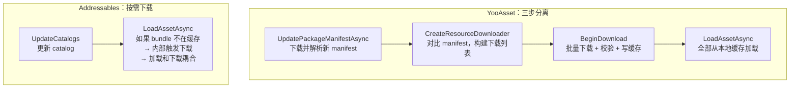
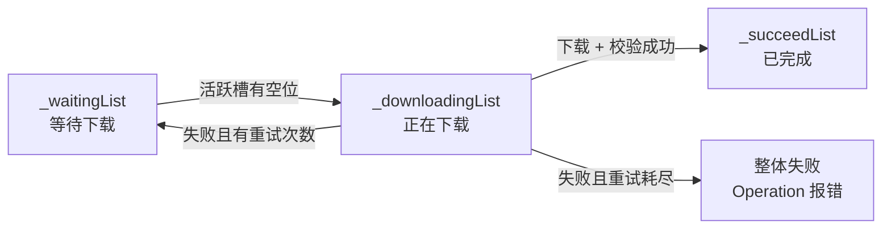
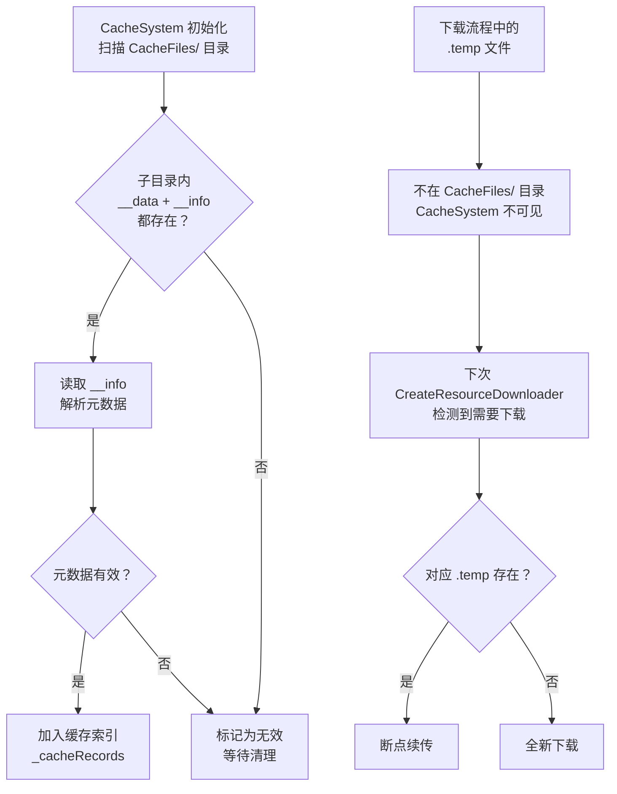

[Yoo-01]() 把 YooAsset 运行时从 `LoadAssetAsync` 到资产对象就绪的完整链路拆开了。[Yoo-02]() 把 `PackageManifest` 的序列化结构、三层校验和运行时查找链路拆清楚了。

那两篇各留了一个口子：

Yoo-01 在讲 HostPlayMode 的加载路径时提到——如果缓存未命中，`AssetBundleWebLoader` 会触发下载，下载完成后写入缓存再加载 bundle。但"下载"和"缓存"内部到底怎么工作，没有展开。

Yoo-02 在讲三层校验时提到——FileHash 做差量判定，FileCRC 做传输校验。但这两层校验在下载流程中的具体触发位置和失败处理，也没有展开。

这篇接上这两个口子，回答三个问题：

`YooAsset 的下载队列是怎么管理的？并发控制、校验重试、断点续传的实现路径是什么？`

`CacheSystem 在磁盘上长什么样？怎么区分"已下载"和"下载了一半"？`

`版本清理怎么做？旧缓存什么时候删、怎么删？`

> **版本基线：** 本文源码分析基于 YooAsset 2.x（https://github.com/tuyoogame/YooAsset）。

## 一、下载在整条链路中的位置

先把下载环节在 YooAsset 整体流程中的位置锚住。

YooAsset 的资源就绪流程分三步，彼此严格分离：

```
步骤 1：UpdatePackageManifestAsync  → 拿到最新 manifest
步骤 2：CreateResourceDownloader   → 构建下载列表 → BeginDownload → 全部下完
步骤 3：LoadAssetAsync             → 从本地缓存加载（保证命中）
```

这个三步分离是 YooAsset 的一个核心设计选择。它和 Addressables 的方式有本质不同。

**Addressables 的做法是按需下载（on-demand）。** 调用 `LoadAssetAsync` 时，如果 bundle 不在本地缓存中，`AssetBundleProvider` 内部用 `UnityWebRequestAssetBundle` 直接发起下载，加载和下载耦合在一条链路里。调用方无法提前知道这次加载是否会触发网络请求。

**YooAsset 的做法是显式下载（explicit download）。** 下载是一个独立的阶段，发生在 manifest 更新之后、资产加载之前。项目可以选择在 loading 界面把所有需要的 bundle 下完，确保后续的 `LoadAssetAsync` 全部命中本地缓存，不触发任何网络请求。



这个分离的好处在[Yoo-01]()里已经提过：避免了 HostPlayMode 下首次加载未缓存 bundle 导致的卡顿。这篇要从下载器内部拆开，看这个分离到底是怎么实现的。

## 二、ResourceDownloaderOperation 的下载队列

下载阶段的入口是 `ResourceDownloaderOperation`。

### 创建下载器

项目代码通过 `ResourcePackage` 创建下载器：

```csharp
// 按标签创建——只下载带指定标签的 bundle
var downloader = package.CreateResourceDownloader(tag, downloadingMaxNum, failedTryAgain);

// 按全部——下载所有需要更新的 bundle
var downloader = package.CreateResourceDownloader(downloadingMaxNum, failedTryAgain);
```

两个关键参数：
- `downloadingMaxNum`：最大并发下载数
- `failedTryAgain`：单个文件下载失败后的重试次数

源码位置：`YooAsset/Runtime/ResourcePackage/ResourcePackage.cs` 中的 `CreateResourceDownloader` 方法族。

### 下载列表的构建

`CreateResourceDownloader` 内部做的核心事情是：**对比当前 manifest 中的 bundle 列表和本地缓存系统，找出所有需要下载的 bundle**。

逻辑大致如下：

```
遍历 PackageManifest._bundleList
  → 对每个 PackageBundle：
    → 问 CacheSystem：这个 bundle 的 FileHash 对应的缓存文件存在吗？
    → 存在且校验通过 → 跳过
    → 不存在 或 校验不通过 → 加入下载列表
```

如果指定了 tag，还会多一层过滤——只有 `PackageBundle.Tags` 包含目标 tag 的 bundle 才参与比对。

下载列表构建完成后，`ResourceDownloaderOperation` 持有一个待下载的 `BundleInfo` 列表。每个 `BundleInfo` 包含了下载所需的全部信息：远端 URL、文件名、FileHash、FileCRC、FileSize。

### 队列管理：三态流转

`ResourceDownloaderOperation` 内部维护三个集合，管理下载任务的生命周期：

```
_waitingList    → 等待下载（尚未开始）
_downloadingList → 正在下载（已发起网络请求）
_succeedList     → 已完成（下载 + 校验通过）
```

每帧的 `InternalOnUpdate` 中，调度逻辑做两件事：

1. **填充活跃槽**：如果 `_downloadingList.Count < _downloadingMaxNum` 且 `_waitingList` 不为空，从等待列表中取出任务，创建下载 operation 并移入下载中列表。

2. **检查完成**：遍历 `_downloadingList`，已完成的任务根据结果移入成功列表或放回等待列表（如果需要重试）。



### 并发控制

并发控制通过 `_downloadingMaxNum` 实现，默认值通常设为 1~10 之间。调度逻辑非常直接——每帧检查当前活跃下载数是否低于上限，低于就从等待列表补充。

这不是一个基于带宽的自适应策略，而是简单的固定上限。项目需要根据目标网络环境自行调整：

- WiFi 环境：可以设到 5~10，充分利用带宽
- 移动数据：建议设到 1~3，降低并发避免频繁超时
- 弱网环境：设到 1，确保单个文件有完整的带宽

源码位置：`YooAsset/Runtime/ResourcePackage/Operation/ResourceDownloaderOperation.cs`

### 下载进度和回调

`ResourceDownloaderOperation` 暴露几个关键属性供 UI 层使用：

- `TotalDownloadCount`：需要下载的总文件数
- `TotalDownloadBytes`：需要下载的总字节数
- `CurrentDownloadCount`：已完成的文件数
- `CurrentDownloadBytes`：已下载的字节数
- `Progress`：总体进度（0~1）

这些数据足够项目做一个标准的下载进度界面。

## 三、单文件下载流程：从 URL 到磁盘

队列层管理的是"哪些文件要下、同时下几个"。每个具体文件的下载由更底层的下载操作类负责。

### 下载操作的分层

YooAsset 2.x 中，单文件下载的核心实现在 `FileGeneralDownloader` / `FileResumeDownloader` 及其相关类中。内部使用 Unity 的 `UnityWebRequest` 发起 HTTP 请求。

一次完整的单文件下载经过这些阶段：

```
1. 构建 URL（RemoteMainURL 或 RemoteFallbackURL）
2. 检查本地是否有 .temp 临时文件（断点续传检测）
3. 创建 UnityWebRequest
4. 如果有 .temp 文件 → 设置 Range header → 续传
5. 下载中 → 数据写入 .temp 文件
6. 下载完成 → 校验 FileCRC / FileHash / FileSize
7. 校验通过 → .temp 重命名为正式缓存文件
8. 校验失败 → 删除 .temp → 触发重试
```

### 断点续传的实现

断点续传是 YooAsset 相比 Addressables 的一个重要差异点。Addressables 依赖 `UnityWebRequestAssetBundle`，这个 API 不原生支持断点续传——下载中断后只能从头开始。

YooAsset 自己管理断点续传，实现方式如下：

**临时文件机制：** 下载过程中，数据先写入一个 `.temp` 后缀的临时文件，而不是直接写入最终缓存位置。只有下载完成且校验通过后，才把临时文件移到正式缓存目录。

**续传检测：** 下次启动下载同一个文件时，检查临时文件是否存在：

```
if (.temp 文件存在)
{
    long existingSize = .temp 文件的当前大小;
    if (existingSize < expectedTotalSize)
    {
        // 设置 HTTP Range header，从断点处继续
        request.SetRequestHeader("Range", $"bytes={existingSize}-");
        // 以 append 模式打开 .temp 文件
    }
    else
    {
        // 临时文件大小异常，删除重下
        删除 .temp 文件;
    }
}
```

**HTTP Range header：** 标准的 HTTP 断点续传机制。服务端如果支持 Range 请求，会返回 206 Partial Content，只发送剩余部分的数据。如果服务端不支持（返回 200），YooAsset 会回退到全量下载。

**容错处理：** 临时文件可能因为以下原因损坏：
- 应用被强杀，写入不完整
- 磁盘空间不足导致写入中断
- CDN 内容变更导致续传数据不连续

YooAsset 的应对方式是：如果续传后的最终校验失败（CRC 不匹配），删除临时文件并从头重新下载。断点续传是一种优化尝试，不是一种保证——最终的正确性由校验层兜底。

### 完整性校验

每个文件下载完成后，YooAsset 执行三项校验：

**文件大小校验：** 下载后的文件大小和 `PackageBundle.FileSize` 比对。这是最快的检查——大小不对，文件一定有问题。

**CRC32 校验：** 对下载后的文件计算 CRC32，和 `PackageBundle.FileCRC` 比对。检测传输过程中的数据损坏。

**文件哈希校验：** 对下载后的文件计算哈希值，和 `PackageBundle.FileHash` 比对。确保文件内容和构建时的产物完全一致。

三项校验全部通过后，文件才会被认定为"下载成功"，写入正式缓存目录。任何一项不通过，文件被丢弃，计入一次失败。

### 重试机制

单文件下载失败后的处理：

```
失败次数 < failedTryAgain
  → 该任务回到 _waitingList，等待重新调度
  → 重试时不使用断点续传（删除 .temp，从头下载）

失败次数 >= failedTryAgain
  → 该任务标记为最终失败
  → ResourceDownloaderOperation 整体状态变为 Failed
  → 上报错误信息（URL、错误码、失败原因）
```

重试时删除临时文件是一个重要的细节——如果文件校验失败，说明已有的数据可能有问题，续传只会在错误数据上继续追加。从头重下是更安全的做法。

### 双 URL 容灾

YooAsset 支持配置两个远端 URL：`RemoteMainURL` 和 `RemoteFallbackURL`。下载流程中，先尝试 MainURL，如果 MainURL 失败（超时或服务端错误），自动切换到 FallbackURL 重试。

这为 CDN 故障场景提供了一层容灾。项目可以把 MainURL 指向主 CDN，FallbackURL 指向备用 CDN 或 OSS 直连。

## 四、CacheSystem 的磁盘结构

下载完成后，文件要落盘到缓存目录。这一节拆开 `CacheSystem` 的磁盘布局和索引机制。

### 缓存目录结构

YooAsset 的缓存目录布局如下：

```
{PersistentDataPath}/YooAsset/{PackageName}/CacheFiles/
├── {BundleGUID}/
│   ├── __data        ← 实际的 bundle 文件
│   └── __info        ← 元数据文件（hash、CRC、size 等）
├── {BundleGUID}/
│   ├── __data
│   └── __info
└── ...
```

每个已缓存的 bundle 占一个独立目录，目录名是 bundle 的 GUID（基于 BundleName 和 FileHash 计算）。目录内固定两个文件：

**`__data`**：实际的 AssetBundle 文件内容。运行时 `AssetBundle.LoadFromFileAsync` 加载的就是这个文件。

**`__info`**：元数据文本文件，记录了：
- FileHash：文件哈希值
- FileCRC：CRC32 校验值
- FileSize：文件大小

`__info` 的作用是让 `CacheSystem` 在不读取 `__data` 文件内容的情况下，快速判断缓存是否有效。启动时重建缓存索引只需要读 `__info`，不需要校验整个 bundle 文件。

### 缓存索引的构建

`CacheSystem` 在初始化时扫描缓存目录，为每个有效的缓存条目建立内存索引：

```
CacheSystem 初始化：
  1. 遍历 CacheFiles/ 下的所有子目录
  2. 对每个子目录，检查 __data 和 __info 是否都存在
  3. 读取 __info，解析出 FileHash、FileCRC、FileSize
  4. 可选：用 __info 中的信息做快速校验
  5. 将有效条目加入内存字典 → _cacheRecords[bundleGUID] = CacheRecord
```

初始化完成后，判断某个 bundle 是否已缓存就是一次字典查找：

```
bool IsCached(PackageBundle bundle)
{
    string guid = 根据 bundle.BundleName 和 bundle.FileHash 计算 GUID;
    return _cacheRecords.ContainsKey(guid);
}
```

### "已下载" vs "下载了一半"的区分

这是缓存系统设计中的一个关键问题。YooAsset 的区分方式很清晰：

**已下载且验证通过：** 缓存目录中有完整的 `{BundleGUID}/` 子目录，包含 `__data` 和 `__info` 两个文件，且 `__info` 中记录的元数据和 manifest 中的对应 `PackageBundle` 信息一致。这种文件会被 `CacheSystem` 索引，`LoadAssetAsync` 可以直接从 `__data` 加载。

**下载了一半：** 只有一个 `.temp` 临时文件，存在于临时下载目录中（不在 `CacheFiles/` 下）。`CacheSystem` 不索引临时文件。下次创建 `ResourceDownloaderOperation` 时，这个 bundle 会出现在下载列表中，下载器检测到对应的 `.temp` 文件后尝试续传。

**下载完成但校验失败：** 临时文件被删除，不留任何痕迹。这个 bundle 等同于"完全没下载"，下次会从头开始。



### 和 Addressables 缓存结构的对比

Addressables 不管理自己的缓存目录——它依赖 Unity 引擎的 `Caching` API。`UnityWebRequestAssetBundle` 下载的 bundle 由引擎缓存系统存储，路径和结构由 Unity 控制，项目层面无法直接操作单个缓存文件。

YooAsset 完全自管缓存。项目可以遍历缓存目录、读取元数据、删除特定 bundle 的缓存、统计磁盘占用。这种控制力在需要精细缓存管理的场景下很有价值。

## 五、版本清理机制

缓存会持续增长。新版本发布后，旧版本的 bundle 缓存还留在磁盘上。如果不清理，设备存储会被逐渐吃满。

### ClearUnusedCacheFilesAsync

YooAsset 提供 `ClearUnusedCacheFilesAsync` 方法来清理不再需要的缓存。

```csharp
var operation = package.ClearUnusedCacheFilesAsync();
yield return operation;
```

**"unused" 的定义：** 缓存目录中的 bundle 文件，如果在**当前 manifest** 的 `_bundleList` 中找不到对应的 `FileHash`，就被认定为 unused。

清理逻辑：

```
遍历 CacheFiles/ 下所有缓存条目
  → 对每个条目，检查其 FileHash 是否出现在当前 manifest 的 _bundleList 中
  → 出现 → 保留（当前版本还在使用）
  → 未出现 → 删除整个 {BundleGUID}/ 目录
```

典型场景：v1.0 版本有 bundle A（hash=abc）和 bundle B（hash=def）。v1.1 版本更新了 bundle A（hash=xyz），bundle B 没变（hash 仍是 def）。清理时，`hash=abc` 的旧 bundle A 被删除，`hash=def` 的 bundle B 被保留。

### 清理时机

YooAsset 不自动清理旧缓存。`ClearUnusedCacheFilesAsync` 需要项目显式调用。推荐的调用时机：

**manifest 更新并下载完成后：** 新版本的 bundle 全部下完，旧版本的 bundle 不再需要，这是最安全的清理时机。

```csharp
// 标准的更新 + 清理流程
yield return package.UpdatePackageManifestAsync(version);
var downloader = package.CreateResourceDownloader(downloadingMaxNum, failedTryAgain);
downloader.BeginDownload();
yield return downloader;

// 新版本下完，清理旧版本
var clearOp = package.ClearUnusedCacheFilesAsync();
yield return clearOp;
```

**不要在 manifest 更新后、下载完成前清理。** 如果新 manifest 引用了新 bundle 但还没下完，而旧 manifest 引用的 bundle 已经被清掉了，回退到旧版本的路径就被堵死了。

### 和 Addressables 缓存清理的对比

Addressables 依赖 Unity `Caching` API 的内置策略：

- `Caching.ClearOtherCachedVersions`：清理同一个 bundle name 的旧版本缓存
- `Caching.maximumAvailableStorageSpace`：设置缓存大小上限
- LRU（Least Recently Used）：Unity 缓存系统内置的淘汰策略

Addressables 的优势是"托管式"——设个上限就不用管了，引擎会自动淘汰旧缓存。

YooAsset 的优势是"控制式"——项目完全知道什么时候删、删了什么、还剩多少。但代价是项目必须自己规划清理策略，框架不会替你做。

| 维度 | Addressables | YooAsset |
|------|-------------|---------|
| 缓存管理者 | Unity `Caching` API（引擎层） | `CacheSystem`（应用层自管） |
| 清理触发 | LRU 自动淘汰 + 手动调 API | 项目显式调用 `ClearUnusedCacheFilesAsync` |
| "旧版本"定义 | 同 bundle name 的非当前 hash 版本 | 当前 manifest 中不存在对应 hash 的文件 |
| 大小限制 | `Caching.maximumAvailableStorageSpace` | 无内置限制，项目自行统计和控制 |
| 单文件操作 | 不直接支持（引擎管理） | 可以遍历和删除单个缓存条目 |

## 六、和 Addressables 下载机制的关键差异

前面几节在各个细节上做了局部对比，这里把结构性差异集中到一张表里。

| 维度 | Addressables | YooAsset |
|------|-------------|---------|
| **下载时机** | 按需——`LoadAssetAsync` 内部触发下载 | 显式——先 `CreateResourceDownloader` + `BeginDownload`，再加载 |
| **下载队列** | 无内置队列，每个 `AssetBundleProvider` 独立发起请求 | `ResourceDownloaderOperation` 统一管理，三态队列 |
| **并发控制** | 无内置并发限制（受 UnityWebRequest 全局连接池影响） | `_downloadingMaxNum` 显式控制最大并发数 |
| **断点续传** | 不支持——`UnityWebRequestAssetBundle` 没有原生续传能力 | 支持——.temp 临时文件 + HTTP Range header |
| **完整性校验** | 依赖引擎内置校验（`AssetBundle.LoadFromFile` 的内部 CRC） | 应用层显式校验——FileSize + FileCRC + FileHash 三重检查 |
| **重试机制** | 无内置重试，需要项目在上层封装 | 内置 `failedTryAgain` 参数，自动重试 |
| **URL 容灾** | 需要自定义 `IResourceProvider` 实现 | 内置 `RemoteMainURL` + `RemoteFallbackURL` 双 URL |
| **缓存结构** | 引擎 `Caching` API 管理，项目不可见 | 应用层自管 `CacheFiles/` 目录，可遍历、可操作 |
| **缓存清理** | LRU + `Caching` API | 项目显式调 `ClearUnusedCacheFilesAsync` |
| **下载进度** | 需要自己汇总多个 `AsyncOperationHandle` 的进度 | `ResourceDownloaderOperation` 直接暴露总进度 |

一句话概括差异：**Addressables 把下载当作加载链路的一部分，由 Provider 在幕后处理；YooAsset 把下载当作一个独立阶段，由项目在前台控制。**

这不是绝对的好坏——Addressables 的方式更省心（不需要写下载流程），YooAsset 的方式更可控（项目决定什么时候下、下多少、怎么重试）。但在移动端热更场景下，显式控制通常是更安全的选择。

## 七、工程判断：项目该怎么配置下载器

源码拆完了，回到项目。

### 并发数怎么设

没有万能数字，但有一个判断框架：

| 网络环境 | 推荐 `downloadingMaxNum` | 原因 |
|---------|------------------------|------|
| WiFi / 高速固定网络 | 5~10 | 带宽充裕，并发能缩短总下载时间 |
| 4G/5G 移动数据 | 2~4 | 避免并发过多导致单个请求超时 |
| 弱网 / 信号不稳定 | 1~2 | 降低并发保证单个文件的成功率 |
| 后台静默下载 | 1 | 不抢主线程资源，不影响游戏体验 |

项目可以动态调整——在 loading 界面用高并发快速下完，进入游戏后切换到低并发做后台预下载。

### 预下载 vs 按需加载

**推荐预下载的场景：**
- 关键游戏流程（战斗、主线剧情）的资源 → 在进入前的 loading 界面全部预下载
- 用户体验敏感的 UI 资源 → 启动时预下载
- 大型场景资源 → 在前一个场景的转场期间预下载

**可以按需加载的场景：**
- 非关键的装饰性资源（头像框、聊天表情）
- 用户可能永远不会触发的分支内容
- 体积极小、下载时间可忽略的资源

混合策略是最常见的做法：核心资源预下载保证体验，边缘资源按需加载节省流量。

### 失败恢复策略

```
failedTryAgain 推荐值：3

第 1 次失败 → 可能是网络抖动，自动重试
第 2 次失败 → 可能是临时服务问题，继续重试
第 3 次失败 → 大概率是持续性问题
全部重试耗尽 → 弹出提示："网络异常，请检查网络后重试"
```

重试耗尽后的兜底方案：
1. 保存当前下载进度（`.temp` 文件天然保留）
2. 提示用户检查网络
3. 用户点击"重试"时，重新 `CreateResourceDownloader` → `.temp` 文件触发续传

### 缓存空间管理

YooAsset 不内置缓存大小限制，项目需要自行监控：

```csharp
// 周期性检查缓存大小
long cacheSize = GetDirectorySize(cachePath);
if (cacheSize > MAX_CACHE_SIZE)
{
    // 清理当前版本不需要的旧缓存
    yield return package.ClearUnusedCacheFilesAsync();
    
    // 如果仍然超限，考虑按 tag 分级：
    //   保留 "base" 标签的 bundle
    //   可选清理 "event" 标签的过期活动 bundle
}
```

### 工程检查表

| 检查项 | 建议 |
|-------|------|
| `downloadingMaxNum` 是否根据网络环境调整 | WiFi 5~10，移动网络 1~3 |
| 关键路径资源是否在 loading 界面预下载 | 确保战斗、主线等核心流程不触发运行时下载 |
| `failedTryAgain` 是否合理 | 推荐 3 次，配合用户侧重试 UI |
| CDN 是否配置了 FallbackURL | 利用 YooAsset 双 URL 容灾 |
| CDN 是否支持 HTTP Range | 不支持则断点续传退化为全量重下，大文件场景需确认 |
| `ClearUnusedCacheFilesAsync` 是否在更新下载完成后调用 | 避免在下载过程中清理 |
| 缓存目录大小是否有监控 | YooAsset 无内置限制，需项目自行管理 |
| 多 Package 场景下每个 Package 是否独立管理下载和缓存 | 各 Package 有独立的 CacheFiles 目录和下载器 |

---

这篇把 YooAsset 的下载和缓存系统从队列管理、单文件下载、断点续传、磁盘缓存到版本清理完整拆了一遍。

核心结论三句话：

1. **下载是独立阶段，不是加载的副作用。** `ResourceDownloaderOperation` 的三态队列（等待→下载中→完成）加并发控制，让项目对下载流程有完整的掌控力。

2. **缓存是自管的，不依赖引擎。** `CacheSystem` 的 `__data` + `__info` 双文件结构，让缓存的有效性判断和清理都在应用层完成，项目可以做到文件级的精细控制。

3. **断点续传和校验是下载可靠性的两道防线。** `.temp` 文件 + Range header 解决"下了一半怎么办"，FileSize + CRC + Hash 三重校验解决"下的对不对"。两道防线各管一端，合在一起保证最终落盘的文件一定是正确的。

如果想看两套框架在热更下载失败场景下的完整表现对比，可以等 Case-01（断点续传失败案例）。如果想看 YooAsset 构建期是怎么生成这些 bundle 和 manifest 的，可以等 Yoo-04（构建期）。
