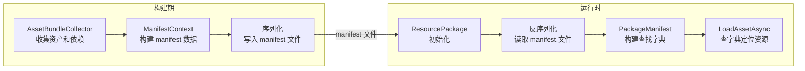
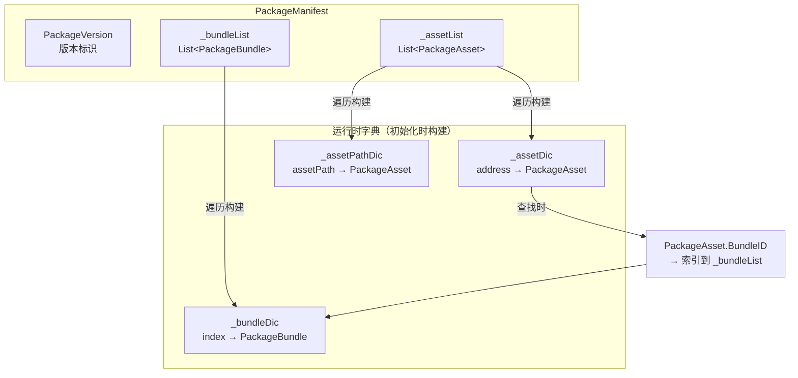
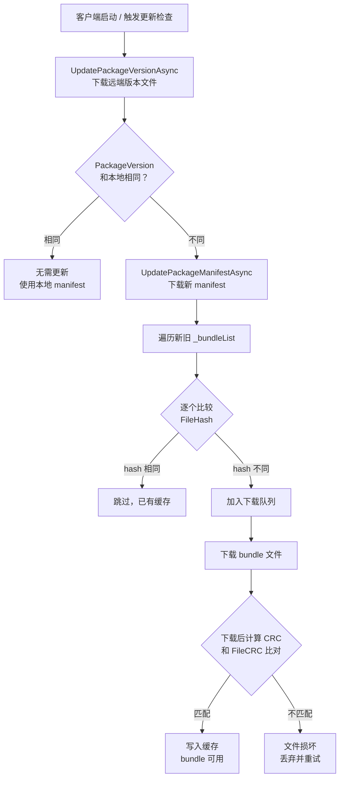

[上一篇]()把 Addressables 的运行时内部链路从 `LoadAssetAsync` 到 bundle 加载完成拆了一遍，核心是那条 key → IResourceLocator → IResourceLocation → ResourceManager → Provider 链 → AsyncOperationHandle 的调用路径。

那篇解决的是：Addressables 内部怎么工作。

这篇要换到 YooAsset 一侧，回答一个更聚焦的问题：`YooAsset 的 PackageManifest 到底存了什么，运行时怎么用它来定位和校验资源？`

为什么要专门拆 manifest？因为不管是 Addressables 还是 YooAsset，运行时的一切资源操作，最终都要查一张索引表。Addressables 那边叫 `ContentCatalogData`，YooAsset 这边叫 `PackageManifest`。这张表的结构直接决定了：

- 资源定位有多快
- 依赖关系怎么表达
- 版本校验有几道防线
- 热更新的粒度和安全性

拆开 `PackageManifest`，这些问题的答案就会变得具体。

> 本文基于 YooAsset 2.x 版本源码（`YooAsset/Runtime/PackageSystem/` 目录）。

## 一、PackageManifest 在 YooAsset 里的位置

先把它在整个系统里的位置标清楚。

`PackageManifest` 是 YooAsset 运行时的核心索引结构。一句话概括它的职责：**把所有资产地址映射到 bundle 文件，让运行时能根据一个 address 找到要加载哪个 bundle、依赖哪些其他 bundle**。

它的生命周期分两段：

**构建期生成：** 在 YooAsset 的构建流程中，`ManifestContext` 收集所有 `AssetBundleCollector` 的分析结果（资产列表、bundle 分组、依赖关系），最终序列化成一个 manifest 文件。这个文件随构建产物一起输出。

**运行时加载：** 在 `ResourcePackage` 初始化流程中，manifest 文件被反序列化成 `PackageManifest` 对象。反序列化完成后，`PackageManifest` 会立刻构建内部的查找字典，供后续所有资源操作使用。



这里有一个和 Addressables 的关键差异需要先记住：

**Addressables 的 Catalog** 是 Base64 编码的 JSON 或二进制格式（`ContentCatalogData`），加载时需要解码和解析 `m_KeyDataString`、`m_BucketDataString`、`m_EntryDataString` 等紧凑编码字段，再构建 `ResourceLocationMap`。

**YooAsset 的 Manifest** 是直接的 C# 二进制序列化。反序列化后拿到的就是带类型的 C# 对象列表，字典构建只是遍历列表做 `Dictionary.Add`。

这个差异在大项目里会有可感知的影响——后面第五节会详细讲。

## 二、PackageManifest 的顶层结构

打开 `YooAsset/Runtime/PackageSystem/PackageManifest.cs`，顶层字段非常清晰。

### 核心字段

```
PackageManifest
├── PackageVersion          // string, 包版本号
├── EnableAddressable       // bool, 是否启用地址模式
├── _assetList              // List<PackageAsset>, 所有资产信息
├── _bundleList             // List<PackageBundle>, 所有 bundle 信息
```

`PackageVersion` 是整个 manifest 的版本标识。它不是一个自增数字，而是构建时生成的版本字符串，用于远端版本比对。

`EnableAddressable` 控制资产查找的方式。开启时，用户可以通过自定义地址（address）查找资产；关闭时，只能通过完整资产路径（AssetPath）查找。

`_assetList` 和 `_bundleList` 是 manifest 的两大核心列表。一个存资产信息，一个存 bundle 信息。它们之间通过整数索引关联。

### 运行时构建的字典

`PackageManifest` 在反序列化之后，会立刻从这两个列表构建出查找字典：

```
运行时字典
├── _assetDic               // Dictionary<string, PackageAsset>
│                            //   key = address 或 assetPath
│                            //   value = PackageAsset
├── _assetPathDic            // Dictionary<string, PackageAsset>
│                            //   key = assetPath（全路径）
│                            //   value = PackageAsset
├── _bundleDic               // Dictionary<int, PackageBundle>
│                            //   key = bundle 在列表中的索引
│                            //   value = PackageBundle
```

构建过程的核心逻辑大致是：

```
// 伪代码，简化自 PackageManifest 初始化逻辑
foreach (var asset in _assetList)
{
    if (EnableAddressable)
        _assetDic[asset.Address] = asset;
    _assetPathDic[asset.AssetPath] = asset;
}
foreach (int i = 0; i < _bundleList.Count; i++)
{
    _bundleDic[i] = _bundleList[i];
}
```

字典构建完成后，整个 manifest 的查找就是 `O(1)` 的字典查询。



## 三、PackageAsset 和 PackageBundle 的字段

这两个类是 manifest 里的核心数据单元。拆开它们的字段，就能看清 YooAsset 在数据层面做了什么、省了什么。

### PackageAsset（资产信息）

源码位置：`YooAsset/Runtime/PackageSystem/PackageAsset.cs`

| 字段 | 类型 | 职责 |
|------|------|------|
| Address | string | 用户定义的加载地址，比如 `"hero_prefab"` |
| AssetPath | string | 资产在工程中的完整路径，比如 `"Assets/Prefabs/Hero.prefab"` |
| AssetGUID | string | Unity 资产 GUID，用于唯一标识 |
| BundleID | int | 这个资产所在的 bundle 在 `_bundleList` 中的索引 |
| DependBundleIDs | int[] | 这个资产依赖的所有其他 bundle 在 `_bundleList` 中的索引数组 |

这里最值得注意的是 `BundleID` 和 `DependBundleIDs` 的设计。

**它们不是字符串引用，而是整数索引。** 每个 `PackageAsset` 用一个 `int` 指向自己所在的 bundle，用一个 `int[]` 指向所有依赖 bundle。索引直接对应 `_bundleList` 的下标。

这意味着从资产到 bundle 的查找，不需要任何字符串匹配或哈希表查询——一次数组下标访问就够了。

**`DependBundleIDs` 创建了一个显式的、扁平的依赖图。** 不需要递归遍历，每个资产直接声明"我需要这些 bundle 全部就位才能加载"。运行时只要遍历这个 `int[]`，逐个确保对应 bundle 已加载。

对比一下 Addressables 的做法：每个 `IResourceLocation` 有一个 `Dependencies` 列表，里面是其他 `IResourceLocation` 对象。依赖本身也可能有依赖，形成递归结构。`ResourceManager` 需要递归遍历并去重。

YooAsset 把这件事在构建期就展平了——每个资产的完整依赖链在构建时已经算好，运行时不需要递归。

### PackageBundle（Bundle 信息）

源码位置：`YooAsset/Runtime/PackageSystem/PackageBundle.cs`

| 字段 | 类型 | 职责 |
|------|------|------|
| BundleName | string | bundle 文件名 |
| FileHash | string | 内容哈希值，基于 bundle 文件内容计算 |
| FileCRC | string | CRC32 校验值 |
| FileSize | long | 文件大小（字节） |
| Tags | string[] | 标签数组，用于过滤和分组 |

每个字段的用途都不含糊：

**BundleName** 是物理文件名。在缓存目录和 CDN 路径上都用这个名字定位 bundle 文件。

**FileHash** 是基于文件内容计算的哈希值。它有两个用途：作为缓存的 key（判断本地是否已有这个版本的 bundle）和作为下载校验的参考（服务端 manifest 里的 hash 和下载后文件的 hash 做比对）。

**FileCRC** 是 CRC32 校验码。和 FileHash 的用途不同——CRC 主要用于检测下载传输过程中的数据损坏，而不是判断版本变化。

**FileSize** 在下载管理中使用：计算下载进度、预估下载时间、判断磁盘空间。

**Tags** 是 YooAsset 的标签过滤机制的数据基础。项目可以给 bundle 打标签（比如 `"base"`、`"chapter1"`、`"event_2026spring"`），运行时按标签批量查询需要下载的 bundle 列表。

### 用一个具体例子串起来

假设项目里有一个 `hero_prefab` 预制体，它引用了一个共享材质和一张贴图：

```
PackageAsset:
  Address       = "hero_prefab"
  AssetPath     = "Assets/Characters/Hero.prefab"
  AssetGUID     = "a1b2c3d4..."
  BundleID      = 3          // → _bundleList[3] = characters_bundle
  DependBundleIDs = [7, 12]  // → _bundleList[7] = shared_materials
                             //   _bundleList[12] = shared_textures

PackageBundle (_bundleList[3]):
  BundleName = "characters_assets_a1b2c3"
  FileHash   = "e5f6a7b8..."
  FileCRC    = "1234567890"
  FileSize   = 2457600
  Tags       = ["base"]

PackageBundle (_bundleList[7]):
  BundleName = "shared_materials_c3d4e5"
  FileHash   = "f9a0b1c2..."
  FileCRC    = "9876543210"
  FileSize   = 512000
  Tags       = ["base"]

PackageBundle (_bundleList[12]):
  BundleName = "shared_textures_d4e5f6"
  FileHash   = "0b1c2d3e..."
  FileCRC    = "5678901234"
  FileSize   = 8192000
  Tags       = ["base"]
```

运行时加载 `"hero_prefab"` 时，manifest 告诉加载器：你要加载 `_bundleList[3]`，但在加载它之前，先确保 `_bundleList[7]` 和 `_bundleList[12]` 已经就位。

## 四、版本号 + CRC + Hash 三层校验

YooAsset 的版本校验不是一个单一机制，而是三层结构，每层解决不同的问题。

### 第一层：PackageVersion — "有没有新版本？"

`PackageVersion` 是整个 manifest 的版本标识符。它是一个字符串（通常是时间戳或递增版本号），在 `ResourcePackage` 的更新流程中最先被检查。

运行时调用 `UpdatePackageVersionAsync()` 时，做的事情是：

```
1. 从远端下载版本文件（轻量级，只包含版本字符串）
2. 和本地已缓存的 PackageVersion 做字符串比较
3. 不同 → 有新版本，进入 manifest 更新流程
4. 相同 → 当前是最新，不需要更新
```

这一层的设计意图是：**用最小的网络开销判断"要不要更新"**。版本文件可能只有几十个字节，即使在弱网环境下也能快速完成检查。

### 第二层：FileHash — "哪些 bundle 变了？"

`PackageBundle.FileHash` 是基于 bundle 文件内容计算的哈希值。它在两个场景下发挥作用：

**差量更新判定：** 当新 manifest 下载完成后，运行时会遍历新旧 manifest 的 `_bundleList`，比较每个 bundle 的 `FileHash`。hash 不同的 bundle 才需要重新下载。这就是 YooAsset 实现增量更新的核心机制——只下载变化的 bundle，不是全量替换。

**本地缓存命中：** 在缓存系统（`CacheFileSystem`）中，FileHash 作为缓存文件的唯一标识。检查某个 bundle 是否已缓存，就是检查对应 hash 的文件是否存在于缓存目录中。

### 第三层：FileCRC — "下载有没有坏？"

`PackageBundle.FileCRC` 是 CRC32 校验值。它只在一个场景下使用：**下载完成后的完整性校验**。

```
1. bundle 文件从 CDN 下载到本地
2. 对下载后的文件计算 CRC32
3. 和 manifest 中记录的 FileCRC 比对
4. 匹配 → 文件完整，写入缓存
5. 不匹配 → 传输损坏，丢弃文件，触发重试
```

### 三层各管一件事

```
PackageVersion  → 粗粒度：有没有更新
FileHash        → 中粒度：哪些 bundle 需要更新
FileCRC         → 细粒度：下载的文件有没有损坏
```

这三层之间没有相互替代的关系。版本号告诉你"要不要查"，hash 告诉你"要查哪些"，CRC 告诉你"查到的东西是不是完好的"。



对比 Addressables 的做法：Addressables 用 `catalog.hash` 做版本比对（对应 YooAsset 的 PackageVersion 层），用 Unity 内置的 `UnityWebRequestAssetBundle` 的 hash 参数做缓存命中（对应 FileHash 层），但在 CRC 校验这一层，默认行为依赖 `AssetBundle.LoadFromFile` 的内置校验，不像 YooAsset 在应用层做显式的 CRC 比对。

YooAsset 把三层校验全部放在自己的控制范围内，项目可以自定义每一层的行为。Addressables 则把底层校验委托给了 Unity 引擎 API，项目的控制空间更小。

## 五、运行时查找链路

这一节沿着一次 `LoadAssetAsync(address)` 的调用，追踪 manifest 在运行时是怎么被查询的。

### 完整查找路径

```
LoadAssetAsync("hero_prefab")
  → ResourcePackage.LoadAssetAsync("hero_prefab")
    → PackageManifest._assetDic["hero_prefab"]
      → 拿到 PackageAsset
        → PackageAsset.BundleID = 3
          → _bundleList[3]
            → 拿到 PackageBundle
              → 检查 FileHash 是否在缓存中
                → 命中缓存 → 直接加载 bundle
                → 未命中   → 下载 bundle → CRC 校验 → 写入缓存 → 加载
        → PackageAsset.DependBundleIDs = [7, 12]
          → _bundleList[7], _bundleList[12]
            → 对每个依赖 bundle 执行同样的缓存检查/下载/加载流程
              → 所有依赖就位
                → 加载主 bundle
                  → 从 bundle 中提取资产对象
                    → 返回 AssetOperationHandle
```

这条链路的关键特征是：**没有递归，没有间接层，没有中间抽象**。

从 address 到 `PackageAsset` 是一次字典查找。从 `PackageAsset` 到 `PackageBundle` 是一次数组下标访问。依赖列表是一个 `int[]`，遍历它、查对应的 `PackageBundle`，也是数组下标访问。

### 对比 Addressables 的查找路径

在[前文]()中拆过的 Addressables 查找链路：

```
LoadAssetAsync(key)
  → AddressablesImpl
    → IResourceLocator.Locate(key)
      → ResourceLocationMap 内部字典
        → key → hash → bucket → entry offset → IResourceLocation
          → IResourceLocation.InternalId (bundle 路径)
          → IResourceLocation.ProviderId (provider 类型)
          → IResourceLocation.Dependencies (List<IResourceLocation>)
            → 递归遍历每个依赖的 IResourceLocation
              → ResourceManager.ProvideResource 对每个依赖
```

差异在三个地方：

**定位环节：** Addressables 的 `ContentCatalogData` 用 `m_BucketDataString` 做哈希桶映射，key 需要经过 hash → bucket → entry → index 的多步跳转。YooAsset 的 `_assetDic` 就是一个标准的 `Dictionary<string, PackageAsset>`，一步到位。

**依赖环节：** Addressables 的依赖是 `List<IResourceLocation>`，每个依赖本身也是一个完整的 location 对象，可以有自己的依赖列表，需要递归处理。YooAsset 的 `DependBundleIDs` 是一个 `int[]`，在构建期已经把完整依赖链展平成一个扁平数组，运行时不需要递归。

**中间抽象：** Addressables 在定位和加载之间有 `IResourceProvider` 选择、`ProviderOperation` 创建等中间步骤，这些抽象层为自定义 provider 提供了扩展空间，但也增加了运行时的间接跳转。YooAsset 的链路更直接——从 manifest 拿到 bundle 信息后，直接交给对应的 `BundleLoaderBase` 去加载。

```mermaid
flowchart TD
    subgraph YooAsset["YooAsset 查找链路"]
        Y1["LoadAssetAsync(address)"] --> Y2["_assetDic 字典查找<br/>O(1)"]
        Y2 --> Y3["PackageAsset<br/>BundleID + DependBundleIDs"]
        Y3 --> Y4["_bundleList 数组索引<br/>O(1)"]
        Y4 --> Y5["PackageBundle<br/>FileHash 检查缓存"]
        Y5 --> Y6["加载 bundle / 下载"]
    end
    subgraph Addressables["Addressables 查找链路"]
        A1["LoadAssetAsync(key)"] --> A2["ResourceLocationMap<br/>hash → bucket → entry"]
        A2 --> A3["IResourceLocation<br/>InternalId + Dependencies"]
        A3 --> A4["ResourceManager<br/>选择 IResourceProvider"]
        A4 --> A5["递归加载<br/>Dependencies"]
        A5 --> A6["AssetBundleProvider<br/>加载 bundle"]
    end
```



### 加载成本的实际差异

manifest/catalog 加载这一步本身也有成本差异。

**Addressables 的 catalog 加载：** 需要对 `m_KeyDataString`、`m_BucketDataString`、`m_EntryDataString` 做 Base64 解码，然后解析紧凑编码的二进制数据，构建 `ResourceLocationMap`。对于大项目（上万资产），这个过程可能在主线程上耗费数十毫秒甚至更长。社区里有不少项目在启动阶段被这一步卡住。

**YooAsset 的 manifest 加载：** 二进制反序列化直接还原成 C# 对象列表，然后遍历列表做 `Dictionary.Add`。数据结构更紧凑，不需要多层解码。对于同等规模的项目，通常比 Addressables 的 catalog 加载更快。

但需要注意：这个差异在小项目（几百个资产）里基本不可感知。只有当资产规模上到数千甚至上万时，catalog/manifest 的加载成本才会变成可感知的瓶颈。

## 六、和 Addressables Catalog 的结构对比

把两边的核心差异放到一张表里做对照。

| 维度 | Addressables Catalog | YooAsset Manifest |
|------|---------------------|-------------------|
| 序列化格式 | Base64 JSON（1.x）/ 二进制（Unity 6 的 2.x） | 二进制 C# 序列化 |
| 查找复杂度 | key → hash → bucket → entry → InternalId | address → dict → PackageAsset → PackageBundle |
| 依赖表达 | `IResourceLocation.Dependencies`（递归 location 对象） | `DependBundleIDs`（int 数组，直接索引，构建期展平） |
| 版本校验层数 | `catalog.hash` 单一文件 hash | PackageVersion + 每 bundle FileHash + 每 bundle CRC，三层分离 |
| 加载成本 | 全量解码 + 解析（大 catalog 在主线程有可感知卡顿） | 二进制反序列化 + dict 构建（结构更紧凑，通常更快） |
| 扩展模型 | 通过 `IResourceProvider` / `IResourceLocator` 自定义 | 通过 `IDecryptionServices` / `IQueryServices` 自定义 |
| 每资产数据量 | InternalId + ProviderId + Dependencies + ResourceType + labels | Address + AssetPath + GUID + BundleID + DependBundleIDs |
| 运行时内存 | `ResourceLocationMap` + 所有 `IResourceLocation` 对象（对象多、引用复杂） | `Dictionary` + `PackageAsset` / `PackageBundle` 对象（结构更扁平） |

几个值得展开的差异：

### 依赖表达的设计取舍

Addressables 的递归 location 依赖模型更灵活——它允许依赖链动态组合，支持复杂的 provider 链（比如一个 location 指向加密 bundle，由自定义 provider 解密后再交给 `AssetBundleProvider`）。

YooAsset 的扁平 `int[]` 依赖模型更直接——构建期把所有传递依赖算好，运行时不需要做图遍历。但代价是灵活性更低：如果需要在依赖链中间插入自定义处理逻辑（比如某些 bundle 需要特殊解密），需要在其他层面解决。

### 版本校验的设计取舍

Addressables 依赖 `catalog.hash` 做单一入口的版本比对。一旦 hash 变了，就认为有新 catalog，然后下载整个新 catalog。新旧 bundle 的差异比对交给 Unity 的缓存系统（通过 `UnityWebRequestAssetBundle` 的 hash 参数）。

YooAsset 把版本比对拆成三步（PackageVersion → FileHash → FileCRC），每一步的职责清晰分离。项目可以选择只检查版本而不下载 manifest，可以精确知道哪些 bundle 需要更新，可以在下载后做显式的 CRC 校验。

这意味着 YooAsset 在版本管理的控制粒度上更细，但也意味着项目需要理解这三层各自的语义，才能正确使用更新流程。Addressables 的模型更"托管"——把更多决策交给了框架内部。

### 序列化格式的演进

Addressables 在 Unity 6 随附的 2.x 版本中引入了二进制 catalog 格式（`catalog.bin`），试图解决 1.x 版本 Base64 JSON 的解析性能问题。这说明 Addressables 团队也意识到了 catalog 加载成本是一个需要解决的问题。

YooAsset 从一开始就选择了二进制序列化，没有经历过 JSON 阶段。这不一定说明 YooAsset 的方案更好，而是说两个框架在这件事上面临的约束不同——Addressables 作为官方 package 需要更多的调试可读性和跨版本兼容性考量，YooAsset 可以更大胆地选择性能优先的方案。

## 七、项目判断

拆完 `PackageManifest` 的结构之后，回到项目层面收束。

### YooAsset 的 manifest 结构在什么场景下是优势

**快速迭代的中小项目。** manifest 加载快、查找链路短、依赖关系直观。对于资产规模在几百到几千的项目，manifest 不会成为瓶颈，而且简单的数据结构让调试和排查更容易。

**需要精细版本控制的热更项目。** 三层校验（版本号 + hash + CRC）让项目可以精确控制更新粒度：先检查有没有更新，再看哪些 bundle 变了，最后确认下载没有损坏。每一步都在项目的控制范围内，可以自定义策略。

**对启动速度敏感的移动端项目。** manifest 的二进制反序列化和字典构建通常比 Addressables 的 catalog 解析更快，在大资产规模下差异更明显。如果项目启动阶段的帧预算很紧，这个差异值得关注。

### Addressables 的 catalog 结构在什么场景下更有价值

**需要复杂 provider 链的项目。** 如果你的项目需要在加载链路中插入自定义逻辑（加密/解密 provider、远端资产重定向、多源内容合并），Addressables 的 location + provider 模型提供了更多扩展点。YooAsset 的扁平模型在这类场景下需要绕路实现。

**依赖 Unity 官方工具链的团队。** Addressables 和 Unity Profiler、Event Viewer、Build Report 深度集成。如果团队的排查能力强依赖这些官方工具，catalog 结构的"多层间接"反而是这些工具能够介入的前提。

**多内容源合并的场景。** Addressables 支持多个 catalog、多个 locator 的注册和查找。如果项目需要从不同来源（本地、CDN A、CDN B）合并资源索引，Addressables 的 locator 列表模型更自然。YooAsset 通过 `ResourcePackage` 分包来实现类似能力，但模型不同。

### 两边都没解决的问题

不管选 Addressables 还是 YooAsset，manifest/catalog 都面临一个共同的规模问题：**当资产数量上万时，这张索引表本身的内存占用和加载时间都会变成需要关注的指标**。

Addressables 在大 catalog 上卡主线程的问题在社区里有大量讨论。YooAsset 虽然加载通常更快，但数万级 `PackageAsset` 对象的字典构建同样不是零成本。

如果项目的资产规模会持续增长到万级以上，需要在早期就关注 manifest/catalog 的分包策略——把一个巨大的索引表拆成多个较小的包级 manifest/catalog，按需加载。YooAsset 的 `ResourcePackage` 分包设计天然支持这种拆分，Addressables 则需要通过多 catalog 来实现。

---

这篇把 YooAsset 的 `PackageManifest` 从顶层结构到字段细节到运行时链路全部拆开了。

核心结论就三句话：

1. **manifest 的结构是扁平的**——`PackageAsset` 和 `PackageBundle` 通过整数索引关联，依赖关系在构建期展平，运行时查找是 `O(1)` 字典查询加数组下标访问。

2. **三层校验各管一件事**——PackageVersion 管"要不要查"，FileHash 管"要下哪些"，FileCRC 管"下的对不对"。

3. **和 Addressables 的 catalog 相比，manifest 更简单更直接，但也更"固执"**——更少的中间抽象意味着更快的查找和更低的学习成本，但也意味着在需要复杂扩展时的灵活度更低。

下一步如果想看 YooAsset 拿到 `PackageBundle` 信息之后，下载器和缓存系统是怎么工作的，可以等 Yoo-03（下载器和缓存系统）。如果想对照 Addressables 的 catalog 内部编码细节，可以等 Addr-02（ContentCatalogData 深度拆解）。
