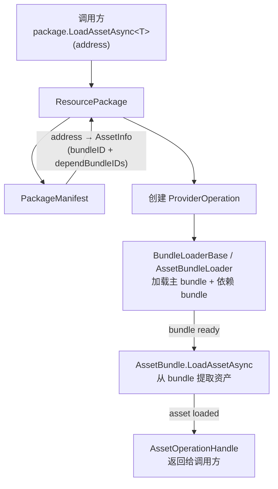
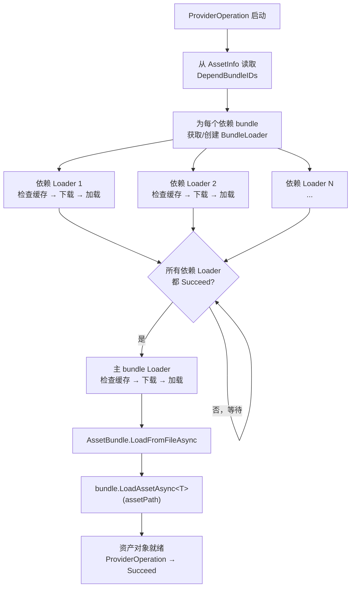

[上一篇]()把 Addressables 运行时的完整内部链路拆开了：从 key 到 IResourceLocator 定位，到 ResourceManager 调度 Provider 链，到 AsyncOperationHandle 返回给调用方。

那篇回答的是：
`Addressables 内部那条链路长什么样。`

这一篇要回答的是：
`同样是 LoadAssetAsync，YooAsset 内部走的是一条什么样的链路？`

YooAsset 在 API 层和 Addressables 看起来差不多——都是一行 `LoadAssetAsync` 拿到 handle。但内部的调度模型完全不同。Addressables 用的是 ResourceManager + Provider 链的松散匹配；YooAsset 用的是 ResourcePackage + Manifest 直查 + Loader 直接持有 bundle 的紧凑路径。

这条链路如果不拆开，很多运行时问题同样没法定位：

- 多 Package 环境下资源到底从哪个包加载的
- bundle 没下完的时候 LoadAssetAsync 为什么卡住了
- Release 以后内存为什么没降
- HostPlayMode 下首次加载比后续加载慢一个数量级

这些问题的根因，全在 YooAsset 运行时链路里。

本文基于 YooAsset 2.x 源码。

## 一、YooAsset 运行时的四个核心角色

和 Addressables 一样，先把参与的核心角色立住。

YooAsset 的运行时比 Addressables 少一层间接——没有 ResourceManager 这样的全局调度中心，也没有 Provider 模式的松散匹配。它的调度是以 Package 为单位的，每个 Package 自带完整的定位、加载和生命周期管理能力。

### 1. ResourcePackage

包级别的入口对象。YooAsset 的多 Package 设计意味着一个项目里可以同时存在多个独立的 ResourcePackage 实例，每个 Package 有自己的 Manifest、自己的缓存目录、自己的版本号。所有资源操作的起点都是某个具体的 Package。

源码位置：`YooAsset/Runtime/ResourcePackage/ResourcePackage.cs`

### 2. PackageManifest

资产索引和 bundle 索引的容器。它在内存中维护两张核心字典：`_assetDic` 把 address 映射到 `PackageAsset`，`_bundleDic` 把 bundleID 映射到 `PackageBundle`。定位阶段的所有查找都在这两张字典上完成，不需要像 Addressables 那样经过 hash bucket → entry offset 的多层解码。

源码位置：`YooAsset/Runtime/PackageSystem/PackageManifest.cs`

### 3. BundleLoaderBase / AssetBundleLoader

实际执行 bundle 加载的工人。`BundleLoaderBase` 是抽象基类，`AssetBundleLoader` 是最常用的实现。它直接持有一个 `AssetBundle` 引用，负责从文件系统或网络加载 bundle，管理 bundle 级别的引用计数。每个 bundle 在运行时只有一个 Loader 实例。

源码位置：
- `YooAsset/Runtime/ResourcePackage/Operation/Internal/BundleLoaderBase.cs`
- `YooAsset/Runtime/ResourcePackage/Operation/Internal/AssetBundleLoader.cs`

### 4. AssetOperationHandle

用户侧拿到的凭证。它包裹一个 `ProviderOperation`，暴露 `Status`、`AssetObject`、`Completed` 回调等接口。和 Addressables 的 `AsyncOperationHandle<T>` 角色一致，但生命周期管理方式不同——YooAsset 的引用计数挂在 ProviderOperation 上，而不是挂在 handle 自身。

源码位置：`YooAsset/Runtime/ResourcePackage/Operation/AssetOperationHandle.cs`

四个角色的关系如下：



和 Addressables 对比，最明显的结构差异是：YooAsset 没有全局 ResourceManager，也没有 Provider 模式的间接查找。Package 自己管自己的全部资源，定位和加载都在 Package 内部闭环完成。

## 二、从 address 到 AssetInfo：定位阶段

调用从这里开始。

### 1. 入口：package.LoadAssetAsync

YooAsset 没有 Addressables 那样的静态门面类。调用方必须先拿到一个 `ResourcePackage` 实例，然后在它上面发起加载：

```
var package = YooAssets.GetPackage("DefaultPackage");
var handle = package.LoadAssetAsync<GameObject>("hero_prefab");
```

`ResourcePackage.LoadAssetAsync<T>` 内部做两件事：从 Manifest 查找 AssetInfo，然后创建 ProviderOperation 交给调度系统。

### 2. Manifest 查找：address → AssetInfo

`PackageManifest` 内部维护的核心数据结构：

**`_assetDic`**：`Dictionary<string, PackageAsset>`。key 是资产的 address 字符串（也可以是完整路径，取决于 Collector 配置），value 是 `PackageAsset` 对象。

**`PackageAsset`** 包含：
- `Address`：资产地址
- `AssetPath`：资产在工程中的完整路径（如 `Assets/Prefabs/Hero.prefab`）
- `BundleID`：这个资产属于哪个 bundle（整数索引）
- `DependBundleIDs`：这个资产依赖的其他 bundle 的 ID 列表

**`_bundleDic`**：`Dictionary<int, PackageBundle>`。key 是 bundleID，value 是 `PackageBundle` 对象，包含 bundle 的文件名、Hash、大小、CRC 等信息。

查找过程非常直接：

```
PackageManifest.TryGetPackageAsset(address)
  → _assetDic[address]
  → 拿到 PackageAsset
  → 通过 BundleID 查 _bundleDic 得到主 bundle 信息
  → 通过 DependBundleIDs 查 _bundleDic 得到所有依赖 bundle 信息
```

这和 Addressables 的定位路径有一个本质区别：Addressables 的 catalog 在磁盘上是 Base64 编码的紧凑格式，运行时需要先解码成 `ResourceLocationMap`，然后通过 hash bucket 跳转到 entry 再索引到 InternalId。YooAsset 的 `PackageManifest` 反序列化后直接就是内存字典，定位就是一次字典查找，没有中间编码层。

### 3. AssetInfo 的信息完备性

从 `PackageAsset` 和 `PackageBundle` 拼出来的信息，已经足够发起完整的加载流程：

- 知道主 bundle 是谁 → 知道要加载哪个文件
- 知道依赖 bundle 列表 → 知道要先加载哪些前置
- 知道 bundle 的 Hash 和文件名 → 知道在缓存目录里找哪个文件
- 知道资产的 AssetPath → 知道从 bundle 里用什么路径提取

定位阶段到这里结束。address 已经变成了完整的加载计划。

## 三、从 AssetInfo 到资产对象：Loader 链

定位完成后，进入实际加载。

### 1. ProviderOperation 的创建

`ResourcePackage` 在拿到 AssetInfo 后，创建一个 `ProviderOperation`。这个 operation 负责协调整个加载流程：先确保所有依赖 bundle 就绪，再加载主 bundle，最后从 bundle 里提取资产。

ProviderOperation 内部通过 `ResourceManager`（注意：这里的 ResourceManager 是 YooAsset 内部的，和 Addressables 的 ResourceManager 是完全不同的类）获取或创建 BundleLoader。

### 2. BundleLoaderBase：每个 bundle 一个 Loader

`ResourceManager` 维护一个 Loader 字典，每个 bundleID 对应一个 `BundleLoaderBase` 实例。如果 Loader 已存在就复用，不存在就创建。

创建时根据当前 PlayMode 选择具体实现：

- **HostPlayMode** → `AssetBundleLoader`（标准路径，支持远程下载 + 本地缓存）
- **OfflinePlayMode** → `AssetBundleLoader`（只查本地，不触发下载）
- **EditorSimulateMode** → 使用 `EditorSimulateLoader`（直接用 AssetDatabase，不加载真实 bundle）

### 3. AssetBundleLoader 的加载流程

以最常用的 `AssetBundleLoader`（HostPlayMode 场景）为例，内部状态机大致经过这些阶段：

**阶段 1：检查缓存**
通过 `CacheFileSystem` 检查本地是否已经有这个 bundle 的缓存文件。检查依据是 bundle 的 Hash 和文件名。

**阶段 2：下载（如果需要）**
如果缓存未命中，创建下载任务。下载完成后写入缓存目录，并做 CRC 校验。

**阶段 3：加载 AssetBundle**
缓存就绪后，调用：
```
AssetBundle.LoadFromFileAsync(cachedFilePath)
```
从本地文件异步加载 AssetBundle 对象。

**阶段 4：提取资产**
bundle 就绪后，ProviderOperation 调用：
```
assetBundle.LoadAssetAsync<T>(assetPath)
```
从 bundle 中提取目标资产。

### 4. 依赖加载顺序

ProviderOperation 拿到 `DependBundleIDs` 列表后，先为每个依赖创建或获取 BundleLoader，等所有依赖 Loader 都进入 Succeed 状态，才启动主 bundle 的加载。



和 Addressables 的依赖处理对比：Addressables 的依赖是通过 `IResourceLocation.Dependencies` 递归，由 ResourceManager 统一调度；YooAsset 的依赖是通过 `DependBundleIDs` 扁平列表，由 ProviderOperation 自己协调。YooAsset 的依赖结构是扁平的（只有一层依赖列表），没有 Addressables 那种依赖的依赖的递归情况。

## 四、三种 PlayMode 的调度差异

YooAsset 用 PlayMode 把"开发期"和"发布期"的差异隔离在框架层，上层代码不需要改一行。三种 PlayMode 共享同一套 `LoadAssetAsync` API，但内部走完全不同的路径。

### 1. EditorSimulateMode

开发期专用。不打 bundle，不加载 bundle，甚至不需要 Manifest。

加载路径：
```
LoadAssetAsync<T>(address)
  → 通过 Manifest 拿到 AssetPath
  → 直接调用 AssetDatabase.LoadAssetAtPath<T>(assetPath)
  → 资产对象就绪
```

这个模式的价值在于：开发期的迭代完全不需要经过构建流程。修改资产后立刻就能在 Editor 里看到效果，不用等打 bundle。

限制：只能在 Unity Editor 中使用，真机上不存在 AssetDatabase。

### 2. OfflinePlayMode

内置资源模式。所有 bundle 都打在包体内的 StreamingAssets 目录，运行时不触发任何下载。

加载路径：
```
LoadAssetAsync<T>(address)
  → Manifest 定位 → 找到 bundle 文件名
  → 从 StreamingAssets 路径加载
  → AssetBundle.LoadFromFileAsync(streamingAssetsPath)
  → bundle.LoadAssetAsync<T>(assetPath)
```

适用场景：单机游戏、不需要热更的项目、或者作为联网失败时的兜底模式。

### 3. HostPlayMode

完整的远程资源模式，也是线上项目最常用的模式。

加载路径：
```
LoadAssetAsync<T>(address)
  → Manifest 定位 → 找到 bundle 信息
  → 检查 CacheFileSystem 本地缓存
  → 缓存命中 → AssetBundle.LoadFromFileAsync(cachedPath)
  → 缓存未命中 → 下载 → 校验 → 写入缓存 → 再从缓存加载
  → bundle.LoadAssetAsync<T>(assetPath)
```

HostPlayMode 下的 `LoadAssetAsync` 可能隐含网络请求。如果调用方没有预下载策略，首次加载某个资源可能触发同步等待下载，表现为明显卡顿。

### 4. PlayMode 的切换机制

`ResourcePackage` 在初始化时通过 `InitializeAsync` 接收一个 `InitializeParameters` 参数，参数的具体类型决定了 PlayMode：

- `EditorSimulateModeParameters` → EditorSimulateMode
- `OfflinePlayModeParameters` → OfflinePlayMode
- `HostPlayModeParameters` → HostPlayMode

初始化完成后，Package 内部持有对应的 `IPlayMode` 实现。后续所有操作都委托给这个实现，调用方完全无感。

这个设计意味着：项目代码只需要在初始化时根据环境选择 PlayMode 参数，后续所有资源操作代码完全不用改。

## 五、AssetOperationHandle 的生命周期

调用方拿到的 `AssetOperationHandle` 背后是一个 `ProviderOperation` 实例。

### 1. 状态流转

ProviderOperation 的状态机：

```
None → Processing → Succeed / Failed
```

- **None**：刚创建，还没开始执行
- **Processing**：正在加载（可能在等依赖、等下载、等 AssetBundle 加载）
- **Succeed**：资产对象就绪，`handle.AssetObject` 可用
- **Failed**：加载失败，`handle.LastError` 里有原因

调用方可以通过 `handle.Completed += callback` 注册回调，也可以在协程里用 `yield return handle` 等待完成。

### 2. 引用计数和 Release

YooAsset 的引用计数模型和 Addressables 有一个关键区别。

**Addressables 的引用计数挂在 operation 级别：** 多次加载同一个 key 共享同一个 operation，每次加载递增 operation 的 refcount，Release 递减。operation 的 refcount 归零后触发 bundle 卸载。

**YooAsset 的引用计数挂在 ProviderOperation 级别：** 每个 `LoadAssetAsync` 调用都创建一个 ProviderOperation，ProviderOperation 内部记录自己引用了哪些 BundleLoader。BundleLoader 维护自己的引用计数（被多少个 ProviderOperation 引用）。

Release 的链条：

```
handle.Release()
  → ProviderOperation 标记释放
  → 通知 ResourceManager
  → ResourceManager 递减相关 BundleLoader 的引用计数
  → 如果某个 BundleLoader 的引用计数归零
    → 调用 AssetBundle.Unload(true)
    → 从 Loader 字典中移除
```

### 3. 和 Addressables 的引用计数对比

Addressables 里，两次 `LoadAssetAsync` 同一个 key 会共享底层 operation：

```
// Addressables
var h1 = Addressables.LoadAssetAsync<T>(key); // op refcount = 1
var h2 = Addressables.LoadAssetAsync<T>(key); // op refcount = 2（共享）
Addressables.Release(h1); // op refcount = 1
Addressables.Release(h2); // op refcount = 0 → unload
```

YooAsset 里，两次 `LoadAssetAsync` 同一个 address 会创建两个 ProviderOperation，但共享底层的 BundleLoader：

```
// YooAsset
var h1 = package.LoadAssetAsync<T>(address); // providerOp1, bundleLoader refcount = 1
var h2 = package.LoadAssetAsync<T>(address); // providerOp2, bundleLoader refcount = 2
h1.Release(); // providerOp1 释放, bundleLoader refcount = 1
h2.Release(); // providerOp2 释放, bundleLoader refcount = 0 → unload
```

结果一样（最后一次 Release 触发卸载），但中间层的粒度不同。YooAsset 的粒度更细——你可以单独追踪每个加载请求的生命周期，而不是只能看到一个合并后的 operation。

### 4. ForceUnloadAllAssets

`ResourcePackage` 提供了 `ForceUnloadAllAssets()` 方法，强制卸载当前 Package 下所有已加载的 bundle。

它的内部实现是：遍历所有 BundleLoader，无视引用计数，直接调用 `AssetBundle.Unload(true)`，然后清空 Loader 字典和 ProviderOperation 列表。

这是一个核武器级别的 API。它会销毁所有已加载资产，包括正在使用的。用它的正确时机是场景完全切换、确认没有任何旧资产还在被引用的时候。

## 六、项目里最常踩的三个坑

前五节把 YooAsset 运行时的内部链路拆完了。这一节回到项目现场。

### 1. 多 Package 初始化顺序导致 Manifest 不一致

YooAsset 的多 Package 是一个强大的设计：主包一个 Package，DLC 一个 Package，各自独立版本、独立更新。

但多 Package 的初始化有顺序要求。如果 Package A 先完成初始化拿到 Manifest v2，Package B 还在用 Manifest v1，而 A 里有资源依赖 B 里的 bundle（通过 `DependBundleIDs` 跨 Package 引用），就可能出现 A 认为 B 应该有某个 bundle，但 B 的 Manifest 里根本没有这个 bundle 的情况。

**表现：** 加载某些资源时报 bundle 找不到，但同样的资源在所有 Package 都更新完后又能正常加载。

**防御方式：** 所有 Package 的 `InitializeAsync` 和 `UpdateManifestAsync` 必须全部完成后，再开始任何资源加载。在初始化流程中加一个屏障等所有 Package 就绪。

### 2. HostPlayMode 首次加载触发下载但没有预下载策略

这是最常被忽略的性能陷阱。

`LoadAssetAsync` 的 API 签名看起来是纯本地操作，但在 HostPlayMode 下，如果目标 bundle 不在本地缓存中，它会触发网络下载。调用方如果没有做预下载，首次加载某个资源可能要等几百毫秒到几秒的下载时间。

**表现：** 角色进入新区域，首次加载该区域的资源时有明显卡顿，后续加载正常。

**正确做法：** 在合适的时机（比如 loading 界面、场景切换间隙）使用 `ResourceDownloaderOperation` 预下载即将使用的资源组。确保关键路径上的 `LoadAssetAsync` 命中的都是本地缓存。

```
// 先预下载
var downloader = package.CreateResourceDownloader(tag, downloadingMaxNum, failedTryAgain);
downloader.BeginDownload();
yield return downloader;

// 预下载完成后再加载，此时全部命中缓存
var handle = package.LoadAssetAsync<GameObject>("hero_prefab");
```

### 3. ForceUnloadAllAssets 和手动 Release 的冲突

常见的事故场景：项目里一些模块在 `OnDestroy` 里做了规范的 `handle.Release()`，同时场景切换时又调用了 `ForceUnloadAllAssets()`。

`ForceUnloadAllAssets` 先执行，直接清空了所有 Loader 和 ProviderOperation。然后各模块的 `OnDestroy` 开始跑，调用 `handle.Release()`，但对应的 ProviderOperation 已经不存在了。

**表现：** 场景切换时报空引用异常或者日志里出现 "provider operation is null" 警告。大部分时候不影响功能（因为资源反正已经卸载了），但会产生大量错误日志，混淆真正的问题。

**防御方式：** 二选一。要么全用 `ForceUnloadAllAssets`，在场景切换时一刀切，各模块不做单独 Release。要么全用手动 Release，不调 ForceUnloadAllAssets。不要混用。

---

这一篇把 YooAsset 运行时从入口到出口的完整内部链路拆开了。

核心链路就是这条：
`address → PackageManifest.TryGetPackageAsset → AssetInfo(bundleID + dependBundleIDs) → BundleLoaderBase 加载依赖 bundle → AssetBundleLoader 加载主 bundle → AssetBundle.LoadAssetAsync 提取资产 → AssetOperationHandle 返回给调用方`

和 Addressables 那条链路放在一起看，最大的结构差异在三个地方：

| 对比维度 | Addressables | YooAsset |
|---------|-------------|---------|
| 定位机制 | key → IResourceLocator → IResourceLocation（经过 hash bucket 间接查找） | address → PackageManifest._assetDic 字典直查 |
| 调度中心 | 全局 ResourceManager + Provider 模式松散匹配 | Package 内闭环，没有全局调度，没有 Provider 间接层 |
| 引用计数粒度 | operation 级别（多次加载同 key 共享一个 operation） | ProviderOperation 级别（每次加载独立 operation，bundle 引用计数独立维护） |
| 依赖结构 | `IResourceLocation.Dependencies` 递归，可能有依赖的依赖 | `DependBundleIDs` 扁平列表，只有一层 |
| PlayMode 切换 | 通过不同的 Build Script 和 Play Mode Script 在 Editor 面板切换 | 通过 `InitializeParameters` 类型在代码中切换 |

理解这条链路之后，再回去看那些运行时问题，定位就会清楚很多：

- 加载失败 → 先看是定位阶段（Manifest 里没有这个 address），还是 Loader 阶段（bundle 文件不存在或下载失败），还是提取阶段（bundle 里没有这个 assetPath）
- 内存不释放 → 看 BundleLoader 的引用计数是不是归零了，哪些 ProviderOperation 还在引用它
- 首次加载卡顿 → 看是不是 HostPlayMode 下命中了未缓存的 bundle，需要加预下载策略

下一步如果想看两套框架的运行时调度在同层问题上的完整对比，可以等后续 Cmp-01 那篇。如果想先深入 YooAsset 的 Manifest 结构和版本校验机制，可以等 Yoo-02。
