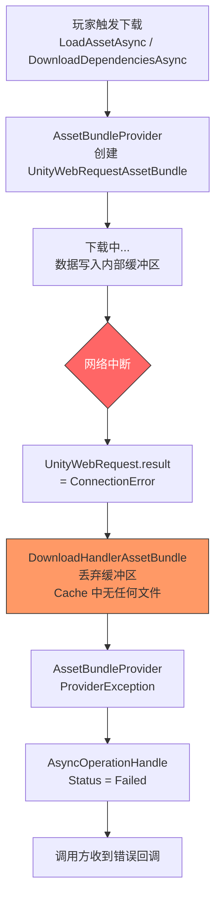
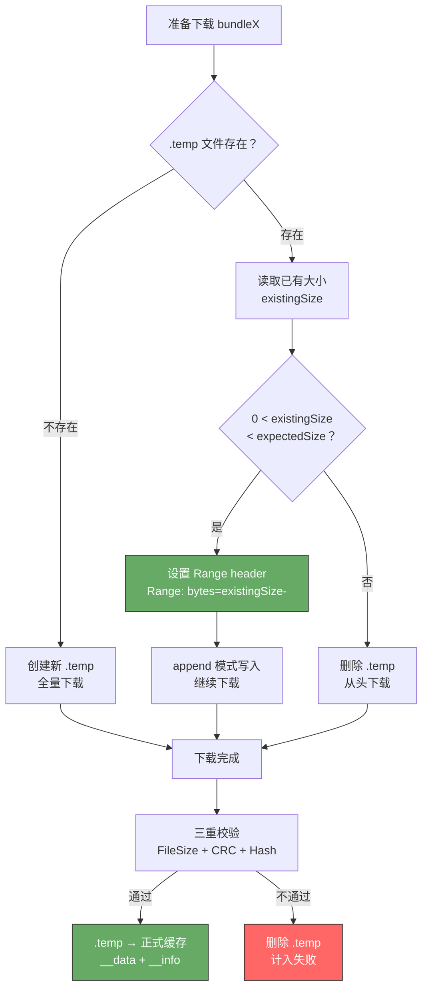

这篇是 Addressables 与 YooAsset 源码解读系列的 Case-01。

[Yoo-03]() 把 YooAsset 的下载器和缓存系统从队列管理到断点续传完整拆了一遍。[Addr-01]() 把 Addressables 运行时从 `LoadAssetAsync` 到 bundle 加载的完整链路拆清楚了。

那两篇各留了一个没展开的场景：

Yoo-03 在讲断点续传时提到——`.temp` 文件 + Range header 能处理下载中断。但"中断"在不同网络异常下的表现差异没有展开。

Addr-01 在讲 `AssetBundleProvider` 时提到——bundle 加载由 `UnityWebRequestAssetBundle` 发起。但这个 API 在网络异常下的行为细节没有展开。

这篇从一个高频生产场景出发，把两个框架在"下载到一半断了"这个问题上的完整表现追一遍。

> **版本基线：** 本文基于 Addressables 1.21.x 和 YooAsset 2.x 源码。

## 一、现场还原——下载进度到 60% 然后断了

### 典型现场

玩家在 WiFi 环境下启动游戏，弹出热更提示：需要下载 200MB 更新资源。玩家点击"开始下载"，进度条走到 60% 左右——大约下了 120MB。

然后网络断了。

可能的原因很多：电梯里信号消失、WiFi 路由器重启、玩家切到后台太久系统断开网络连接、或者就是 CDN 节点临时故障。

接下来，玩家的操作可能是三种：

**情况 A：等网络恢复后继续。** 信号回来了，玩家没退出过 App，等着它恢复。

**情况 B：杀进程重开。** 玩家觉得卡住了，划掉 App 重新打开。

**情况 C：切后台再回来。** 玩家切出去回微信，过几分钟切回游戏。

三种操作在两个框架下的表现完全不同。

### 玩家最关心的一个问题

`已经下了 60%，重新开始还是续传？`

如果 200MB 的更新每次断了都要从零开始，用户体验是灾难级的——尤其在弱网环境和流量敏感的地区。

这个问题的答案，取决于框架底层对"下载了一半"这个状态的处理方式。

## 二、Addressables 的下载机制——为什么没有原生断点续传

### 下载入口：AssetBundleProvider

Addressables 的 bundle 下载入口在 `AssetBundleProvider.cs`。当 `ResourceManager` 需要一个远程 bundle 时，`AssetBundleProvider.Provide` 方法被调用，内部创建下载请求。

关键调用链：

```
AssetBundleProvider.Provide()
  → InternalOp.Start()
    → 判断是远程 bundle
      → UnityWebRequestAssetBundle.GetAssetBundle(url, cachedBundle)
        → 创建 UnityWebRequest
        → request.downloadHandler = new DownloadHandlerAssetBundle(...)
        → request.SendWebRequest()
```

源码位置：`com.unity.addressables/Runtime/ResourceManager/ResourceProviders/AssetBundleProvider.cs`

这里用的不是普通的 `UnityWebRequest`，而是 `UnityWebRequestAssetBundle` 配合 `DownloadHandlerAssetBundle`。这个组合有一个关键特性：**下载和解包是一体化的，数据写入 Unity 的 Caching 系统时是原子操作。**

### 原子写入的后果

`DownloadHandlerAssetBundle` 的工作方式：

1. 下载过程中，数据写入一个内部缓冲区
2. 全部下载完成 + 校验通过后，才整体写入 Unity 的 Cache 目录
3. 如果下载中断——缓冲区丢弃，Cache 目录中不留任何文件

这意味着：**一个 10MB 的 bundle，已经下了 9.9MB，网络断了——0MB 保留**。

引擎层面不存在"半个 bundle"的状态。对 Caching 系统来说，一个 bundle 要么完整存在，要么完全不存在。

### 网络断开时的错误链路

当 `UnityWebRequest` 的底层连接中断时，错误沿以下路径传播：

```
UnityWebRequest.result = ConnectionError / ProtocolError
  → DownloadHandlerAssetBundle 被清理，缓冲区丢弃
  → AssetBundleProvider.InternalOp.WebRequestOperationCompleted()
    → 检测到 request.result != Success
    → 创建 ProviderException
    → AsyncOperationHandle.Status = Failed
    → Completed 回调拿到 error
```



### 没有内置重试

Addressables 的 `AssetBundleProvider` 内部没有重试逻辑。请求失败就是失败，handle 的状态变成 `Failed`，不会自动再试。

项目如果想重试，需要在上层自己处理：

```csharp
// Addressables 没有内置重试，项目需要自己写
async UniTask<T> LoadWithRetry<T>(string key, int maxRetry = 3)
{
    for (int i = 0; i < maxRetry; i++)
    {
        var handle = Addressables.LoadAssetAsync<T>(key);
        await handle.Task;

        if (handle.Status == AsyncOperationStatus.Succeeded)
            return handle.Result;

        // 失败了，释放 handle
        Addressables.Release(handle);

        if (i < maxRetry - 1)
            await UniTask.Delay(TimeSpan.FromSeconds(1 << i)); // 指数退避
    }
    throw new Exception($"Failed to load {key} after {maxRetry} retries");
}
```

但即使加了重试，每次重试都是从零开始下载整个 bundle——因为没有断点续传。

### 没有下载队列

Addressables 没有统一的下载队列。每次 `LoadAssetAsync` 如果触发远程 bundle 下载，都是一个独立的 `UnityWebRequest`。如果同时加载 50 个资源涉及 20 个不同的远程 bundle，就是 20 个并发 HTTP 请求。

并发数受 Unity 内部的 `UnityWebRequest` 连接池限制（默认和平台相关），但项目无法精确控制。在弱网环境下，过多并发请求会互相抢带宽，导致每个请求都更容易超时。

### 批量下载用 DownloadDependenciesAsync

Addressables 有一个批量预下载的 API：`DownloadDependenciesAsync`。但它的实现仍然是为每个 bundle 分别创建 `UnityWebRequestAssetBundle`，没有队列管理，没有断点续传，没有自动重试。

```
Addressables.DownloadDependenciesAsync(key)
  → 对每个依赖 bundle 分别调 AssetBundleProvider
    → 每个 bundle 独立的 UnityWebRequestAssetBundle
    → 任何一个失败 → 整体 handle 报错
```

如果 20 个 bundle 下了 18 个，最后 2 个超时——需要重新调用 `DownloadDependenciesAsync`。好消息是已经在 Cache 中的 18 个 bundle 不会重新下载（`Caching.IsVersionCached` 判断），但那 2 个失败的 bundle 需要完全重新下载。

## 三、YooAsset 的断点续传——从 .temp 文件到 Range 恢复

[Yoo-03]() 已经把 YooAsset 的下载队列和断点续传机制完整拆过了。这里不再重复内部实现，只聚焦在"网络中断"这个场景下的具体行为。

### 中断时的即时行为

当 `ResourceDownloaderOperation` 的一个下载任务遇到网络中断：

```
UnityWebRequest 网络错误
  → FileResumeDownloader 检测到失败
  → 当前 .temp 文件保留在磁盘上（已下载的部分不丢弃）
  → 该任务标记为失败
  → 检查重试次数
    → 未耗尽：放回 _waitingList，等待重新调度
    → 已耗尽：任务标记为最终失败
```

和 Addressables 最大的区别在这里：**YooAsset 不使用 `DownloadHandlerAssetBundle`，而是用普通的 `DownloadHandler` 将数据直接写入磁盘的 `.temp` 文件。** 网络中断时，已写入磁盘的数据保留在 `.temp` 文件中，不丢弃。

### 续传流程

当同一个 bundle 再次进入下载流程（无论是自动重试还是用户手动重新开始下载），续传检测逻辑如下：

```
准备下载 bundleX
  → 检查临时文件 bundleX.temp 是否存在
  → 存在
    → 读取 .temp 文件大小 existingSize
    → existingSize < expectedTotalSize 且 existingSize > 0
      → 设置 HTTP 请求头 Range: bytes={existingSize}-
      → 以 append 模式打开 .temp 文件
      → 从断点处继续下载
    → existingSize >= expectedTotalSize 或 existingSize == 0
      → 异常状态，删除 .temp，从头下载
  → 不存在
    → 全新下载
```



### CDN 对 Range 请求的支持

断点续传的前提是 CDN 支持 HTTP Range 请求。绝大多数现代 CDN（阿里云 OSS、腾讯云 COS、AWS CloudFront、Cloudflare）默认支持 Range。

当 CDN 支持 Range 时，响应返回 `206 Partial Content`，只发送请求的字节范围。

当 CDN 不支持 Range 时（少见但存在），服务端返回 `200 OK` 和完整文件。YooAsset 检测到响应码是 200 而不是 206 时，会回退到全量下载模式——删除已有的 `.temp` 文件，从头接收。

### 校验兜底

断点续传本身不保证正确性。续传可能导致错误的场景：

- App 被强杀，最后一次写入不完整，`.temp` 文件尾部有损坏数据
- CDN 在两次下载之间更新了文件内容，续传拼接出新旧混合的数据
- 磁盘 IO 错误导致 `.temp` 文件中间有坏块

YooAsset 的应对方式是**不信任续传结果**。无论是全量下载还是续传下载，完成后都执行同样的三重校验（FileSize + CRC + Hash）。校验失败就删除 `.temp` 文件并从头重下——断点续传是优化尝试，校验是正确性保障。

这个设计在 [Yoo-03]() 里已经详细分析过，这里不再重复校验的源码路径。

## 四、网络异常场景矩阵

前面两节分别拆了两个框架的机制。这一节把五个典型网络异常场景放到一起对比。

| 场景 | Addressables（1.21.x） | YooAsset（2.x） |
|------|----------------------|----------------|
| **单文件下载中途网络断开** | `UnityWebRequest` 失败，`DownloadHandlerAssetBundle` 丢弃缓冲区，已下载数据全部丢失。下次从零开始。 | `.temp` 文件保留已下载部分。重试时检测 `.temp` 大小，设置 `Range` header 从断点继续。 |
| **批量下载中途 App 被杀** | 每个 bundle 独立走 `DownloadHandlerAssetBundle`。已完成写入 Cache 的 bundle 保留，正在下载的 bundle 全部丢失（缓冲区在进程内存中，进程死就没了）。下次 `DownloadDependenciesAsync` 会跳过已缓存的、重新下载未缓存的。 | 已完成校验的 bundle 在正式缓存中，不受影响。正在下载的 bundle 有 `.temp` 文件在磁盘上。下次 `CreateResourceDownloader` 构建下载列表时，正式缓存中的跳过，有 `.temp` 的尝试续传。 |
| **网络超时（CDN 响应慢）** | `UnityWebRequest` 有默认超时（平台相关），超时后 `result = ConnectionError`。无内置重试。 | `FileResumeDownloader` 有超时检测，失败后检查 `failedTryAgain` 计数器决定是否重试。重试时可续传。 |
| **CDN 返回损坏数据** | `DownloadHandlerAssetBundle` 写入 Cache 后，`AssetBundle.LoadFromFile` 加载时 CRC 校验可能失败。但如果 `BundleNaming` 没启用 CRC 校验，损坏的 bundle 可能被静默缓存，后续加载出异常资产。 | 下载完成后执行 FileSize + CRC + Hash 三重校验。任何一项不通过就删除文件并重下。损坏数据不会进入正式缓存。 |
| **WiFi 切到蜂窝网络（连接变更）** | 当前 `UnityWebRequest` 可能中断。如果中断，整个 bundle 重新下载。如果底层 socket 未断（系统级处理），可能继续完成。行为取决于操作系统的网络切换策略。 | 如果当前请求中断，`.temp` 保留。新请求通过新网络连接发起，Range header 从断点继续。对 YooAsset 来说，网络切换等同于一次普通的中断 + 续传。 |

### 一个关键数字

假设场景：200MB 更新包含 50 个 bundle，每个约 4MB，下载到 60%（30 个完成 + 第 31 个下了一半）时 App 被杀。

**Addressables 侧：**
- 30 个已完成的 bundle 在 Cache 中，保留（约 120MB 不用重下）
- 第 31 个正在下载的 bundle：缓冲区丢弃，0MB 保留
- 重启后需要重新下载：20 个完整的 + 第 31 个完整的 = 约 84MB
- 实际进度回退：从 60% 回退到约 60%（文件级，但丢失了第 31 个文件的部分进度）

**YooAsset 侧：**
- 30 个已完成的 bundle 在正式缓存中，保留
- 第 31 个有 `.temp` 文件，假设已下 3MB（共 4MB）
- 重启后需要下载：20 个完整的 + 第 31 个剩余 1MB = 约 81MB
- 续传节省的数据量取决于中断时单文件的下载进度

在这个场景下，两者差距不大——因为 Addressables 也有文件级的缓存保护。**真正拉开差距的是大文件场景：如果一个 bundle 有 50MB，Addressables 下了 49MB 断了全部丢失，YooAsset 下了 49MB 断了只需要续传 1MB。**

## 五、Addressables 项目的补救方案

如果项目已经选择了 Addressables，没有断点续传不代表不能解决——需要在 Addressables 的上层自己构建这一层。

### 方案一：自定义下载器 + UnityWebRequest Range

绕过 `UnityWebRequestAssetBundle`，用普通的 `UnityWebRequest` + `DownloadHandlerFile` 自己管下载，拿到文件后用 `AssetBundle.LoadFromFile` 本地加载。

核心思路：

```csharp
// 最小断点续传下载器骨架
public class ResumableDownloader
{
    public async UniTask DownloadBundle(string url, string tempPath,
        string finalPath, long expectedSize)
    {
        long existingSize = 0;
        if (File.Exists(tempPath))
            existingSize = new FileInfo(tempPath).Length;

        // 如果已有文件大小等于期望大小，可能已经下完了
        if (existingSize >= expectedSize)
        {
            // 直接走校验流程
            if (VerifyFile(finalPath, expectedSize))
                return;
            // 校验失败，删除重来
            File.Delete(tempPath);
            existingSize = 0;
        }

        using var request = new UnityWebRequest(url, "GET");
        // 关键：用 DownloadHandlerFile 写入磁盘，而不是 DownloadHandlerAssetBundle
        // Unity 2021.2+ 支持 append 参数
        request.downloadHandler = new DownloadHandlerFile(tempPath, existingSize > 0);

        if (existingSize > 0)
        {
            request.SetRequestHeader("Range", $"bytes={existingSize}-");
        }

        await request.SendWebRequest();

        if (request.result != UnityWebRequest.Result.Success)
        {
            // .temp 文件保留，下次续传
            throw new DownloadException(request.error);
        }

        // 下载完成，移动到最终位置
        if (File.Exists(finalPath))
            File.Delete(finalPath);
        File.Move(tempPath, finalPath);
    }
}
```

这个方案的代价是需要自己管理：

- 下载队列和并发控制
- `.temp` 文件的命名和清理
- 校验逻辑（CRC / Hash）
- 与 Addressables 的 Caching 系统对接——因为绕过了 `DownloadHandlerAssetBundle`，bundle 不在 Unity 的 Cache 中，需要自己维护一套映射

这实质上是在 Addressables 之上重新实现了 YooAsset 下载器的一部分功能。

### 方案二：自定义 AssetBundleProvider

Addressables 的 Provider 机制支持替换。可以写一个自定义的 `IResourceProvider` 替换默认的 `AssetBundleProvider`，内部实现断点续传逻辑。

```csharp
[DisplayName("Resumable AssetBundle Provider")]
public class ResumableAssetBundleProvider : ResourceProviderBase
{
    public override void Provide(ProvideHandle provideHandle)
    {
        // 1. 从 provideHandle.Location 拿到 URL 和 bundle 信息
        // 2. 检查本地是否有 .temp 文件
        // 3. 用 UnityWebRequest + Range header 下载
        // 4. 下载完成后用 AssetBundle.LoadFromFile 加载
        // 5. provideHandle.Complete(bundle, ...)
    }
}
```

在 Group 的 schema 里把 `BundleAssetProvider` 替换为自定义 Provider，Addressables 就会用新的 Provider 处理 bundle 下载。

这个方案比方案一侵入性低——不需要自己管队列，Addressables 的调度机制不变。但仍需要自己实现续传逻辑和文件管理。

### 方案三：Unity 6 的变化

Unity 6 随附的 Addressables 2.x 在下载层有一些改进，但**断点续传仍然不是内置功能**。主要变化包括：

- `catalog.bin` 二进制格式替代 `catalog.json`，减少加载开销
- 构建和加载流程的性能优化
- 更好的错误信息和诊断工具

如果项目在 Unity 6 上使用 Addressables，下载中断的补救方案和 1.21.x 基本相同——仍然需要自定义下载层。

## 六、两者在大规模下载场景的表现差异

前面几节聚焦在单次中断的处理。项目真正面对的是大规模热更场景：100+ 个 bundle，500MB+ 总量，跨越多种网络环境。

### 并发控制的差异

**Addressables** 没有统一的下载并发控制。如果项目用 `DownloadDependenciesAsync` 下载一个 label 下的 50 个 bundle，50 个 `UnityWebRequest` 可能同时发出（受 Unity 内部连接池限制）。在弱网环境下，大量并发请求互相争带宽，每个请求更容易超时，形成"全部超时 → 全部重试 → 全部再超时"的恶性循环。

**YooAsset** 的 `ResourceDownloaderOperation` 通过 `_downloadingMaxNum` 严格控制并发。弱网下设成 1~2，确保单个文件有完整带宽，大幅降低超时概率。

### 进度持久化的差异

**Addressables** 的进度信息在内存中。App 被杀后，无法知道上次下到了哪里。重启后 `DownloadDependenciesAsync` 会重新检查 `Caching.IsVersionCached`——已完整缓存的 bundle 跳过，未缓存的从头下载。进度持久化的粒度是"整个 bundle"。

**YooAsset** 的进度自然持久化。已完成校验的 bundle 在 `CacheFiles/` 目录中，下载中断的 bundle 有 `.temp` 文件在磁盘上。重启后 `CreateResourceDownloader` 构建下载列表时，两种状态都能正确识别。进度持久化的粒度是"字节级"（通过 `.temp` 文件大小）。

### 内存占用差异

大规模下载时的内存表现：

**Addressables** 用 `DownloadHandlerAssetBundle`，下载数据在内存缓冲区中。多个并发下载意味着多份缓冲区同时存在。一个 10MB 的 bundle 下载中大约占用 10MB 内存缓冲。10 个并发就是约 100MB 的额外内存开销——这在低端移动设备上可能触发内存警告甚至 OOM。

> **Unity 2021+ 注记：** Unity 2021 以后的版本对 `DownloadHandlerAssetBundle` 的大文件下载有流式处理优化，实际内存占用可能低于 bundle 完整大小。精确行为因平台和 Unity 版本而异。

**YooAsset** 用 `DownloadHandlerFile` 或自定义的流式写入，数据直接写磁盘，内存占用主要是缓冲区大小（通常 64KB~256KB 每个下载任务）。10 个并发的额外内存开销约 2.5MB，可以忽略。

### CDN 边缘场景

一个容易被忽略的场景：**下载批次跨越了 CDN 缓存失效。**

假设项目在 14:00 发布了 v2.0 版本。CDN 的缓存 TTL 是 1 小时。玩家在 14:30 开始下载 100 个 bundle，下到第 50 个时是 14:50。这时运维发现 v2.0 有问题，在 CDN 源站上替换了某些 bundle 文件。15:00 CDN 缓存过期，后续请求拿到的是修改后的文件。

**Addressables 的风险：** 如果替换的 bundle 恰好是已经缓存在 Unity Cache 中的，不会重新下载（版本号没变的话）。新下载的 bundle 可能和旧的不兼容。

**YooAsset 的防护：** 每个 bundle 下载完都有 CRC + Hash 校验。如果 CDN 返回的文件和 manifest 记录的 Hash 不一致，校验失败，触发重下。但这也意味着——如果源站替换了文件且没有更新 manifest，玩家会陷入"下载→校验失败→重下→再失败"的死循环。

**正确做法是：永远不要在 CDN 上就地替换已发布的资源文件。** 要修复就发新版本（新的 manifest + 新的文件名/Hash），确保版本号和文件内容始终一致。

## 七、工程判断

### 决策表

| 项目特征 | 推荐方案 | 原因 |
|---------|---------|------|
| 热更内容少（<50MB），网络环境稳定 | Addressables 默认方案够用 | bundle 数量少，单文件小，重新下载的代价可以接受 |
| 热更内容多（>200MB），目标包含弱网地区 | YooAsset 或自建下载层 | 断点续传和重试机制是刚需，没有会直接影响用户留存 |
| 已选 Addressables，热更量增长 | 方案二（自定义 Provider） | 侵入性最低，保留 Addressables 的调度机制 |
| 已选 Addressables，需要完整下载控制 | 方案一（自定义下载器） | 完全控制下载流程，但开发和维护成本高 |
| 新项目选型阶段 | 如果热更是核心需求，YooAsset 的下载系统是显著优势 | 内置的并发控制 + 断点续传 + 三重校验 + 双 URL 容灾，项目不需要重新造轮子 |

### 预防检查表

| 检查项 | 说明 |
|-------|------|
| CDN 是否支持 HTTP Range 请求 | 发布前用 `curl -r 0-1023 {bundle_url}` 验证。返回 206 表示支持。不支持则断点续传退化为全量重下。 |
| 单个 bundle 是否过大 | 超过 10MB 的 bundle 在断网场景下代价陡增。Addressables 侧尤其敏感——重下 50MB 的大 bundle 意味着浪费 49MB 流量。 |
| 网络异常时的用户提示 | 下载失败时必须有明确的重试入口和进度提示，避免玩家反复杀进程。 |
| 下载进度是否显示已缓存的部分 | 重启后的进度条应该从已缓存的百分比开始，而不是从 0%。Addressables 需要在 `GetDownloadSizeAsync` 之后计算；YooAsset 的 `ResourceDownloaderOperation` 自动排除已缓存文件。 |
| `failedTryAgain` 是否配置合理（YooAsset） | 推荐 3 次自动重试，配合用户手动重试兜底。 |
| 缓存清理时机是否正确 | 不要在新版本 bundle 下载完成之前清理旧缓存。详见 [Case-02]() 中关于半更新状态的分析。 |
| 大文件是否拆分 | 将超大 bundle 拆成多个小 bundle（每个 2~5MB），让文件级缓存和断点续传都能发挥最大价值。 |
| 弱网环境下并发数是否降低 | Addressables 无内置控制，需项目层面限制并发加载数。YooAsset 的 `downloadingMaxNum` 建议弱网设为 1~2。 |

---

这篇从"下载到一半断了"这个场景出发，把两个框架的下载中断处理从错误链路到恢复机制到补救方案完整追了一遍。

核心结论三句话：

1. **Addressables 的下载中断代价和单个 bundle 大小成正比。** `DownloadHandlerAssetBundle` 的原子写入机制意味着中断 = 全部丢失。项目必须控制单 bundle 大小，或者自建断点续传层。

2. **YooAsset 的断点续传不是魔法，它的正确性靠校验兜底。** `.temp` 文件 + Range header 节省的是带宽和时间，三重校验保证的是最终文件一定是对的。两道机制缺一不可。

3. **大规模热更场景下，下载系统的健壮性直接影响用户留存。** 200MB 更新在弱网下反复失败、反复从零开始——这不是技术问题，是流失原因。框架的选型或者下载层的投入，需要在项目初期就决定。
