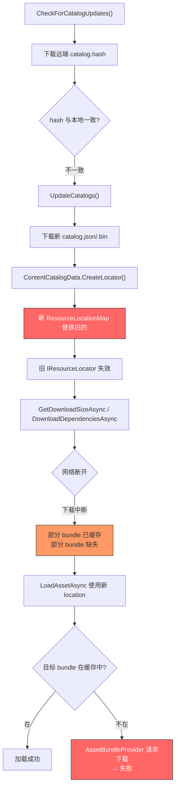
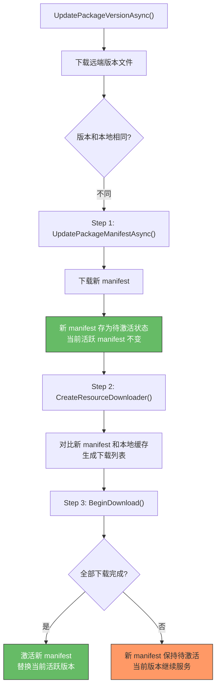
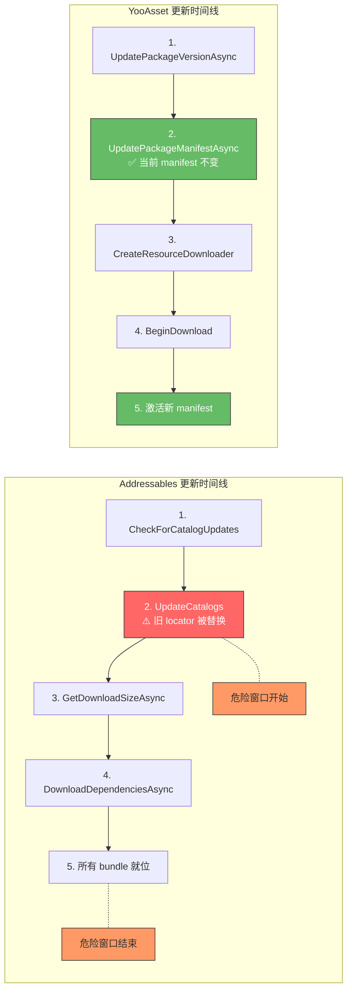
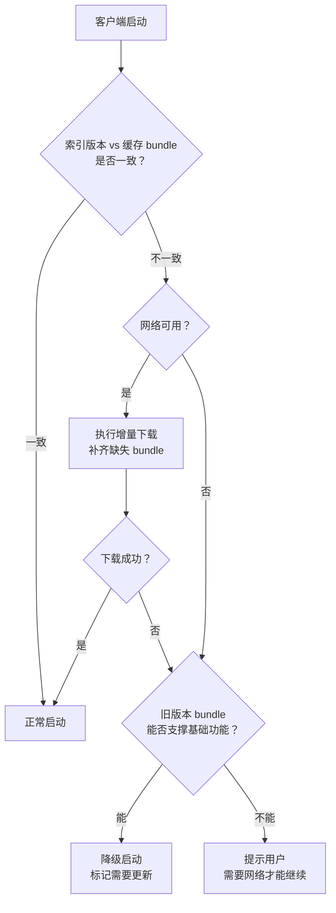

这篇是 Addressables 与 YooAsset 源码解读系列的 Case-02。

[Catalog 篇]()和 [Manifest 篇]()分别把两个框架的索引结构拆到了字段级别。Catalog 篇最后专门提到了一个危险状态：

`UpdateCatalogs 成功了，但新 bundle 还没下完。`

那篇只用几段讲了现象和推荐模式。这篇要从一个真实生产事故出发，把这个"半更新状态"从触发条件到源码根因到恢复路径完整追一遍。

> 以下源码路径基于 Addressables 1.21.x（`com.unity.addressables`）和 YooAsset 2.x。

## 一、现场还原：更新完 catalog 但 bundle 没下完

### 典型现场

线上收到一批 crash report，集中在弱网环境的玩家。现象是：

1. 玩家启动游戏，弹出"发现新版本"提示
2. 点击"更新"，进度条走到一半，网络断了
3. 玩家重新打开游戏，没有再弹更新提示（因为 catalog 已经是最新的）
4. 进入主界面后，点击任何涉及新资源的功能，闪退或黑屏

Console 日志里看到的是 `AssetBundleProvider` 的加载失败，或者 `LoadAssetAsync` 返回 `Failed` 状态。错误信息通常是 bundle 文件找不到，或者 UnityWebRequest 超时。

### 为什么这是热更最难定位的问题之一

它有三个特征让排查变得困难：

**无错即过。** Catalog 更新本身成功了，没有报错。从日志看，初始化阶段一切正常。问题要等到玩家实际加载新资源时才暴露。

**状态不可逆。** 在 Addressables 里，一旦 `UpdateCatalogs` 完成，旧的 `IResourceLocator` 就被替换了。不存在内置的"回退到上一个版本"。

**现象多样。** 根据哪些 bundle 下完了、哪些没下完，玩家看到的表现完全不同。有的功能正常（用到的 bundle 碰巧缓存了），有的闪退（用到的 bundle 不存在），排查时很容易被"部分正常"误导。

## 二、Addressables 侧的半更新问题

### 它是怎么发生的

沿 [Catalog 篇]()里拆过的更新流程，把出问题的时间点标出来：



危险窗口就是从 **G（新 catalog 替换旧的）** 到 **I（所有新 bundle 下载完成）** 之间的这段时间。在这个窗口内，索引指向的是新 bundle，但新 bundle 可能还不存在于本地缓存。

### 源码路径

**catalog 替换的关键代码在 `AddressablesImpl.cs` 的 `UpdateCatalogs` 方法里。** 核心步骤是：

```
UpdateCatalogs(catalogIds)
  → 对每个 catalogId，下载新 catalog 文件
    → ContentCatalogProvider.InternalLoadCatalogFromBundle()
      或 ContentCatalogProvider.LoadCatalog()
    → ContentCatalogData.CreateLocator()
      → 解码 m_KeyDataString / m_BucketDataString / m_EntryDataString
      → 构建新的 ResourceLocationMap
  → AddressablesImpl.OnCatalogUpdated()
    → 用新 ResourceLocationMap 替换 m_ResourceLocators 中的旧条目
```

源码位置：`com.unity.addressables/Runtime/Initialization/AddressablesImpl.cs`

替换操作在 `OnCatalogUpdated` 里是直接赋值——旧的 locator 被新的覆盖，没有备份、没有回滚接口。

**新 catalog 里的 `m_InternalIds` 数组包含了新 bundle 的路径。** 这些路径可能指向：
- CDN 上的新文件 URL（远端 bundle）
- 本地缓存目录下的新文件路径（但文件还不存在）

**`AssetBundleProvider` 尝试加载时**，会先检查 Unity 的缓存（通过 `Caching` API），如果缓存未命中，就通过 `UnityWebRequest` 从远端下载。如果此时网络不可用，请求直接失败。

源码位置：`com.unity.addressables/Runtime/ResourceManager/ResourceProviders/AssetBundleProvider.cs`

### 关键事实：没有内置回滚

Addressables 没有提供"如果 bundle 下载失败，自动回退到旧 catalog"的机制。原因在于设计上的一个前提假设：

`UpdateCatalogs 应该在确认网络可用并且准备好下载所有内容之后才调用。`

框架假设调用方会在 `UpdateCatalogs` 之后立刻通过 `GetDownloadSizeAsync` + `DownloadDependenciesAsync` 把所有新 bundle 拉下来。如果这一步失败了，需要项目自己处理。

这个假设在弱网环境下会被打破。

## 三、YooAsset 侧的三步分离为什么更安全

YooAsset 的更新流程在 [Manifest 篇]()里已经拆过版本校验的三层结构。这里从半更新问题的角度再看一遍它的更新链路。

### 三步分离的设计



核心差异在 **Step 1 结束时**：新 manifest 下载完成后，YooAsset 不会立刻用它替换当前活跃的 manifest。当前的 `PackageManifest` 对象——也就是 `_assetDic` 和 `_bundleDic` 指向的那个——保持不变。

### 源码路径

**Step 1：`ResourcePackage.UpdatePackageManifestAsync()`**

这个操作下载新的 manifest 文件，反序列化成 `PackageManifest` 对象，但把它存在 Package 内部的待激活位置，不替换当前活跃的 manifest。

源码位置：`YooAsset/Runtime/ResourcePackage/ResourcePackage.cs`

当前活跃的 `PackageManifest`（也就是 `LoadAssetAsync` 查询用的那个）在这一步完全不受影响。

**Step 2：`ResourcePackage.CreateResourceDownloader()`**

这个方法拿新 manifest 的 `_bundleList` 和本地缓存做对比。对比方式参考 [Manifest 篇]()里讲的 `FileHash` 校验——hash 不同的 bundle 加入下载队列。返回一个 `ResourceDownloaderOperation`，里面包含了需要下载的 bundle 列表和总大小。

源码位置：`YooAsset/Runtime/ResourcePackage/ResourcePackage.cs`

**Step 3：下载完成后激活**

所有 bundle 下载完成并通过 CRC 校验后，新 manifest 才被设置为活跃版本。从这一刻起，后续的 `LoadAssetAsync` 才会查新 manifest 的 `_assetDic`。

### 为什么这更安全

安全的核心在于：**在整个下载过程中，当前活跃的 manifest 始终指向已经就位的 bundle。**

玩家在 Step 3 进行中打开任何功能，`LoadAssetAsync` 查到的 location 指向的 bundle 一定在缓存里（因为活跃 manifest 还是旧的）。不会出现"索引指向不存在的 bundle"的情况。

如果下载被中断，当前版本继续正常运行。下次启动时重新走一遍三步流程，`CreateResourceDownloader` 会自动跳过已缓存的 bundle，只下载剩余的。

### 但不是完全无风险

**跨重启的边界情况。** 如果 Step 3 完成了一部分、App 被杀掉，下次启动时 YooAsset 的初始化流程需要重新校验缓存一致性。如果缓存目录中存在 `.temp` 文件（下载中断的半成品），需要清理后重新下载。YooAsset 的 `CacheFileSystem` 在初始化时会处理这种情况，但项目应该验证这个路径在自己的构建配置下是否正常工作。

**manifest 版本和 CDN 内容不同步。** 如果 CDN 已经删除了旧版本的 bundle，而新 manifest 还没激活完成，旧 manifest 引用的 bundle 可能在 CDN 上已经不存在了。这个问题两个框架都会遇到，和框架设计无关——它是 CDN 运维策略的问题。

## 四、两种框架在半更新状态下的表现差异

把关键差异对齐到一张表里。

| 维度 | Addressables | YooAsset |
|------|-------------|---------|
| 索引激活时机 | catalog 下载完成后立即替换 `IResourceLocator` | manifest 下载后存为待激活，全部 bundle 就位后才替换 |
| 半更新窗口 | 从 `UpdateCatalogs` 完成到所有 bundle 缓存——**窗口存在** | 设计上消除——但跨重启场景仍需注意 |
| 预下载支持 | 需要手动调用 `GetDownloadSizeAsync` + `DownloadDependenciesAsync` | 内置 `CreateResourceDownloader` + `BeginDownload` |
| 回退到旧版本 | 无内置机制，需要项目自己实现 catalog 备份 | 当前活跃 manifest 在下载完成前不变，天然回退 |
| 下载中断后重启 | `InitializeAsync` 重新加载 catalog（可能加载远端新版或本地 fallback） | `CreateResourceDownloader` 自动增量续传 |



## 五、诊断方法

当怀疑项目处于半更新状态时，需要做两件事：确认当前索引版本，确认缓存中的 bundle 和索引是否一致。

### Addressables 侧的诊断

**1. 确认 catalog 版本**

```csharp
// 获取当前活跃的 locator 信息
foreach (var locator in Addressables.ResourceLocators)
{
    Debug.Log($"Locator ID: {locator.LocatorId}");
    Debug.Log($"Key count: {locator.Keys.Count()}");
}
```

如果 `LocatorId` 对应的是新版 catalog，但后续加载失败，说明已经进入半更新状态。

**2. 检查缓存的 bundle 清单**

```csharp
// 枚举所有 location，检查哪些 bundle 实际存在于缓存
var allLocations = new List<IResourceLocation>();
foreach (var locator in Addressables.ResourceLocators)
{
    foreach (var key in locator.Keys)
    {
        IList<IResourceLocation> locations;
        if (locator.Locate(key, typeof(object), out locations))
        {
            allLocations.AddRange(locations);
        }
    }
}

// 过滤出 bundle 类型的 location
var bundleLocations = allLocations
    .Where(l => l.ResourceType == typeof(IAssetBundleResource))
    .Distinct();

foreach (var loc in bundleLocations)
{
    var cachedVersions = new List<Hash128>();
    Caching.GetCachedVersions(loc.InternalId, cachedVersions);
    bool isCached = cachedVersions.Count > 0;
    Debug.Log($"Bundle: {loc.InternalId}, Cached: {isCached}");
}
```

这段代码列出新 catalog 引用的所有 bundle，然后检查每个 bundle 是否在 Unity 缓存中。没有缓存的就是"缺口"。

**3. Event Viewer 诊断**

在 Editor 中用 Event Viewer（`Window > Asset Management > Addressables > Event Viewer`）运行时观察：

- 查找 `AssetBundleProvider` 类型的 operation
- 状态为 `Failed` 的 operation 就是加载不到的 bundle
- 检查它的 `InternalId`——这就是缺失的 bundle 路径

### YooAsset 侧的诊断

**1. 检查 manifest 版本**

```csharp
var package = YooAssets.GetPackage("DefaultPackage");
Debug.Log($"Active version: {package.GetPackageVersion()}");
```

如果版本号已经是新版但部分资源加载失败，说明 manifest 激活时缓存校验可能有遗漏。

**2. 检查下载进度和缓存状态**

```csharp
// 创建下载器检查还有多少需要下载
var downloader = package.CreateResourceDownloader(downloadingMaxNum: 10,
    failedTryAgain: 3);
Debug.Log($"Total download count: {downloader.TotalDownloadCount}");
Debug.Log($"Total download bytes: {downloader.TotalDownloadBytes}");
```

如果 `TotalDownloadCount > 0`，说明有 bundle 缺失。这个方法本身就是对比当前活跃 manifest 和本地缓存的差异。

**3. 检查缓存目录中的临时文件**

YooAsset 的 `CacheFileSystem` 在下载过程中使用 `.temp` 后缀的临时文件。如果在缓存目录中发现 `.temp` 文件，说明上次下载未完成就被中断了。

```csharp
// 获取缓存根目录
string cacheRoot = $"{Application.persistentDataPath}/yoo/DefaultPackage";
if (Directory.Exists(cacheRoot))
{
    var tempFiles = Directory.GetFiles(cacheRoot, "*.temp",
        SearchOption.AllDirectories);
    Debug.Log($"Incomplete downloads: {tempFiles.Length}");
    foreach (var f in tempFiles)
    {
        Debug.Log($"  Temp file: {Path.GetFileName(f)}");
    }
}
```

## 六、恢复策略

### Addressables 的恢复方案

**方案 1：重试下载（最小侵入）**

如果网络恢复了，最简单的做法是重新调用 `DownloadDependenciesAsync`。

```csharp
async UniTask RetryDownload(string label, int maxRetries = 3)
{
    for (int i = 0; i < maxRetries; i++)
    {
        var sizeHandle = Addressables.GetDownloadSizeAsync(label);
        await sizeHandle.Task;
        long size = sizeHandle.Result;
        Addressables.Release(sizeHandle);

        if (size <= 0)
        {
            Debug.Log("All bundles cached, no download needed.");
            return;
        }

        var downloadHandle = Addressables.DownloadDependenciesAsync(label);
        await downloadHandle.Task;

        if (downloadHandle.Status == AsyncOperationStatus.Succeeded)
        {
            Addressables.Release(downloadHandle);
            Debug.Log("Download completed.");
            return;
        }

        Addressables.Release(downloadHandle);
        Debug.LogWarning($"Download attempt {i + 1} failed, retrying...");
        await UniTask.Delay(TimeSpan.FromSeconds(2 * (i + 1)));
    }
    Debug.LogError("Download failed after all retries.");
}
```

这个方案的前提是 CDN 上的 bundle 和当前 catalog 版本一致。如果 CDN 已经更新到更新的版本，旧 catalog 引用的 bundle 路径可能已经失效。

**方案 2：先下载再更新 catalog（预防性方案）**

与其在 `UpdateCatalogs` 之后补救，不如改变更新顺序：先检查新内容的下载量，下载完成后再替换 catalog。

```csharp
async UniTask SafeUpdate()
{
    // Step 1: 检查更新
    var checkHandle = Addressables.CheckForCatalogUpdates(false);
    await checkHandle.Task;

    if (checkHandle.Status != AsyncOperationStatus.Succeeded
        || checkHandle.Result.Count == 0)
    {
        Addressables.Release(checkHandle);
        return; // 无更新
    }
    var catalogIds = checkHandle.Result;
    Addressables.Release(checkHandle);

    // Step 2: 更新 catalog
    var updateHandle = Addressables.UpdateCatalogs(catalogIds, false);
    await updateHandle.Task;

    if (updateHandle.Status != AsyncOperationStatus.Succeeded)
    {
        Addressables.Release(updateHandle);
        return; // catalog 更新失败，当前状态安全
    }

    // Step 3: 立刻检查并下载所有新 bundle
    // 用项目里所有需要预下载的 label
    var labels = new List<string> { "preload", "base", "ui" };
    foreach (var label in labels)
    {
        var sizeHandle = Addressables.GetDownloadSizeAsync(label);
        await sizeHandle.Task;
        long size = sizeHandle.Result;
        Addressables.Release(sizeHandle);

        if (size > 0)
        {
            var downloadHandle =
                Addressables.DownloadDependenciesAsync(label);
            await downloadHandle.Task;

            if (downloadHandle.Status != AsyncOperationStatus.Succeeded)
            {
                Addressables.Release(downloadHandle);
                // 进入半更新状态，需要恢复
                HandlePartialUpdateFailure();
                return;
            }
            Addressables.Release(downloadHandle);
        }
    }

    Addressables.Release(updateHandle);
    // 所有内容就绪，安全切换
}
```

这个方案的问题是：`UpdateCatalogs` 和 bundle 下载之间仍然存在窗口。如果玩家在这个窗口内操作了，仍可能命中缺失的 bundle。

**方案 3：catalog 备份与回退（最安全但最复杂）**

在 `UpdateCatalogs` 之前，把当前的 catalog 文件备份一份。如果 bundle 下载失败，用备份 catalog 重新初始化 locator。

```csharp
// 备份当前 catalog
string catalogCachePath = Path.Combine(
    Caching.currentCacheForWriting.path,
    "catalog_backup.json");
// 复制当前 catalog 到备份路径
// ...

// 如果 bundle 下载失败，回退
void HandlePartialUpdateFailure()
{
    // 从备份重新加载旧 catalog
    // 需要自定义 IResourceLocator 的注册/替换逻辑
    // 这部分 Addressables 没有提供公开 API，
    // 需要反射或 fork package 源码
}
```

这个方案能力最强，但实现成本也最高。Addressables 没有提供"替换当前 locator"的公开 API，实际操作需要深入 `AddressablesImpl` 的内部状态。

### YooAsset 的恢复方案

**方案 1：续传下载（内置能力）**

这是 YooAsset 最直接的恢复路径。因为在 bundle 全部下载完成之前，当前活跃 manifest 不变，所以"恢复"就是重新走一遍下载流程。

```csharp
async UniTask ResumeDownload()
{
    var package = YooAssets.GetPackage("DefaultPackage");

    // CreateResourceDownloader 会自动对比 manifest 和缓存
    // 已下载的 bundle 不会重复下载
    var downloader = package.CreateResourceDownloader(
        downloadingMaxNum: 10,
        failedTryAgain: 3);

    if (downloader.TotalDownloadCount == 0)
    {
        Debug.Log("All bundles are up to date.");
        return;
    }

    Debug.Log($"Resuming download: {downloader.TotalDownloadCount} files, " +
              $"{downloader.TotalDownloadBytes} bytes");

    downloader.BeginDownload();
    await downloader;

    if (downloader.Status == EOperationStatus.Succeed)
    {
        Debug.Log("Download completed, new manifest activated.");
    }
    else
    {
        Debug.LogError($"Download failed: {downloader.Error}");
        // 当前版本仍在正常服务，可以让玩家继续使用旧内容
    }
}
```

关键优势：即使这次恢复也失败了，玩家仍然可以用当前版本正常游戏。不存在"卡在中间"的状态。

**方案 2：清除缓存重新下载**

如果缓存目录出现损坏（比如 `.temp` 文件无法恢复），可以清理缓存后完整重新下载。

```csharp
async UniTask CleanAndRedownload()
{
    var package = YooAssets.GetPackage("DefaultPackage");

    // 清除缓存
    var clearOperation = package.ClearCacheFilesAsync();
    await clearOperation;

    // 重新走完整更新流程
    // Step 1: 更新版本
    var versionOp = package.UpdatePackageVersionAsync();
    await versionOp;
    // Step 2: 更新 manifest
    var manifestOp = package.UpdatePackageManifestAsync(
        versionOp.PackageVersion);
    await manifestOp;
    // Step 3: 下载所有 bundle
    var downloader = package.CreateResourceDownloader(
        downloadingMaxNum: 10, failedTryAgain: 3);
    downloader.BeginDownload();
    await downloader;
}
```

这是"核弹"方案，代价是所有已缓存的 bundle 都需要重新下载。只在缓存确认损坏时使用。

**方案 3：CDN 端版本回退**

如果新版本有严重问题需要紧急回退，在 CDN 端把版本文件指回旧版本号即可。客户端下次 `UpdatePackageVersionAsync` 时拿到旧版本号，manifest 不会更新，继续使用已缓存的旧内容。

这个方案是运维层面的，不需要客户端改代码。

## 七、工程判断：如何避免半更新状态

### 决策表

| 项目条件 | 推荐策略 | 原因 |
|---------|---------|------|
| 使用 Addressables，弱网用户多 | `UpdateCatalogs` 前预检网络，下载完成后再放开游戏功能入口 | 框架不保证索引和 bundle 一致性，需要项目层面补 |
| 使用 Addressables，只在 Wi-Fi 下更新 | `UpdateCatalogs` + `DownloadDependenciesAsync` 串行执行，失败则重试 | 强网环境下半更新窗口很短，重试通常能解决 |
| 使用 YooAsset，标准更新流程 | 按三步流程走，不跳步 | 框架设计已经消除了半更新窗口 |
| 使用 YooAsset，需要极端可靠性 | 三步流程 + 下载进度持久化 + 启动时校验缓存完整性 | 覆盖 App 被杀掉的边界情况 |
| 两种框架，CDN 需要保留旧版本 | CDN 侧配置版本保留策略，旧 bundle 至少保留到所有客户端都更新完成 | 避免旧 catalog/manifest 引用的 bundle 在 CDN 上被删除 |

### 工程检查清单



不管用哪个框架，启动时都应该做一次一致性校验。对 Addressables 来说，是检查当前 catalog 引用的 bundle 是否都在缓存中。对 YooAsset 来说，是检查 `CreateResourceDownloader` 返回的下载量是否为零。

### 两个框架各自要补的

**Addressables 项目必须补：**
- 更新流程中的"全部下载完成才放开功能入口"逻辑
- 下载失败时的重试和降级策略
- （可选）catalog 备份和回退机制

**YooAsset 项目应该补：**
- 下载进度持久化（App 被杀后能从断点恢复）
- 启动时的缓存完整性校验（清理 `.temp` 文件）
- CDN 版本保留策略的运维配合

---

这篇从一个线上事故出发，把半更新状态的触发条件、源码根因和恢复路径追完了。

核心结论：

1. **Addressables 的半更新窗口是结构性的。** `UpdateCatalogs` 一旦完成就不可逆，但新 bundle 可能还不在本地。项目必须自己补下载完成确认和失败恢复。

2. **YooAsset 的三步分离在设计上消除了这个窗口。** 活跃 manifest 在所有 bundle 就位之前不会被替换。但跨重启场景和 CDN 运维仍然需要项目层面的关注。

3. **不管用哪个框架，启动时的一致性校验是最后一道防线。** 索引版本和缓存 bundle 的匹配检查应该是启动流程的标准步骤。

[Catalog 篇]()和 [Manifest 篇]()提供了理解索引结构的基础。这篇在那个基础上追了一个最常见的生产问题。下一篇 Case-03 会追另一个高频事故：线上版本需要紧急回滚时，两个框架的回滚路径和代价分别是什么。
