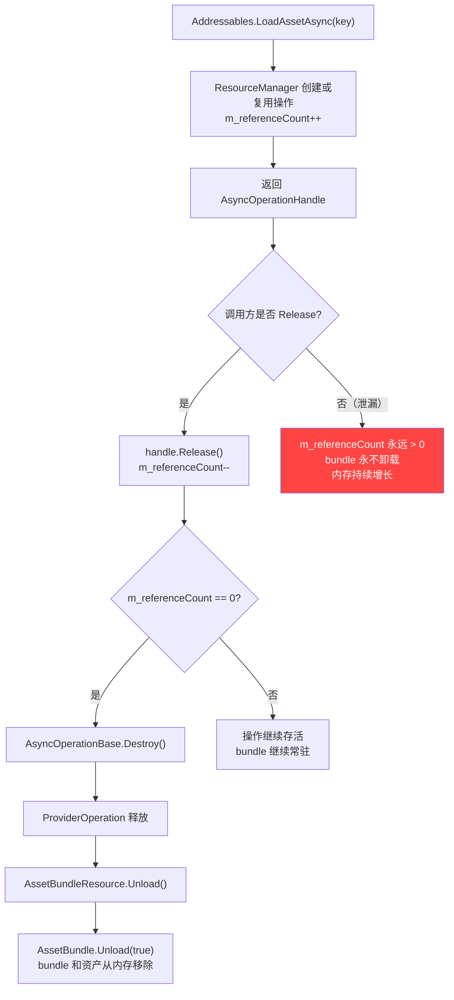
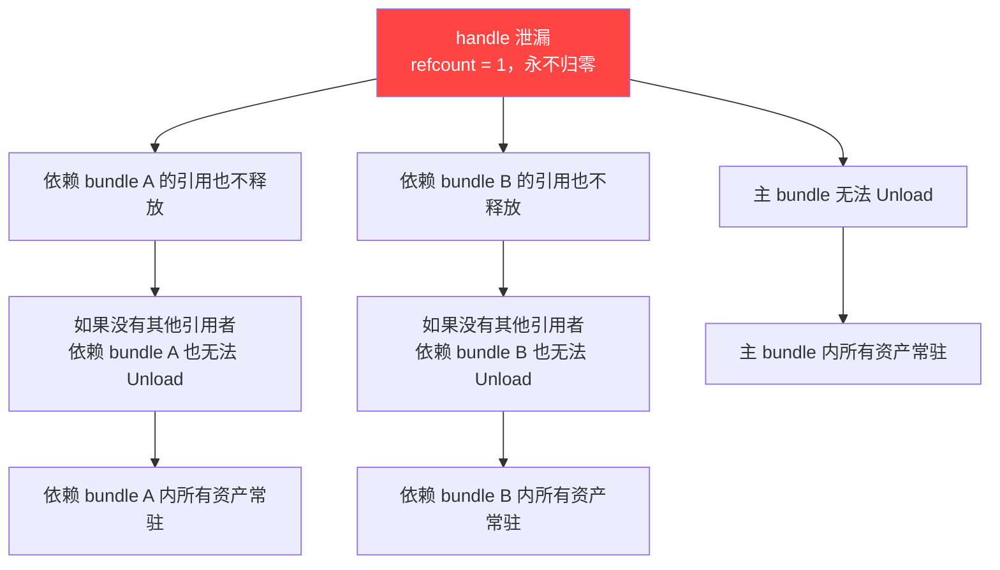

这篇是 Addressables 与 YooAsset 源码解读系列的 Case-04。

[运行时链路篇]()已经把从 `LoadAssetAsync` 到 bundle 加载完成的完整内部路径拆开了。那篇最后提到了一个项目里出现频率最高的问题：

`Handle 忘记 Release，bundle 永不卸载，内存持续增长。`

那篇只用一段带过了现象和修法。这篇要把这件事从源码到诊断到修复完整地追一遍。

> **版本基线：** 本文基于 Addressables 1.21.x 和 YooAsset 2.x 源码。

## 一、现象：内存只涨不跌

### 典型现场

QA 报了一个 bug：玩家在几个场景之间反复切换之后，游戏帧率开始下降，低端设备直接闪退。

打开 Memory Profiler 看快照对比，发现两个信号：

1. **AssetBundle 对象数量只增不减。** 每次进入新场景会加载新的 bundle，但退出场景后旧 bundle 没有卸载。切 10 次场景，内存里就有 10 份 bundle 的残留。

2. **GC 完全无效。** 手动触发 `GC.Collect()` + `Resources.UnloadUnusedAssets()`，内存纹丝不动。AssetBundle 不受 GC 管理——它是引擎原生对象，只有显式调用 `AssetBundle.Unload` 才会释放。

3. **Profiler 的 Asset 计数持续攀升。** Texture2D、Material、Mesh 的实例数随场景切换单调递增，即使这些资产来自已经不可见的旧场景。

这三个信号组合在一起，指向的根因只有一个：某些 `AsyncOperationHandle` 没有被 `Release`，导致 Addressables 的引用计数永远不会归零，bundle 的 `Unload` 永远不会被触发。

### 为什么这个问题特别隐蔽

它不会报错。不会有异常堆栈。不会在 Console 里留下任何痕迹。

Addressables 的设计哲学是：只要 handle 还活着，就认为调用方还需要这个资源。它不会主动帮你判断"这个 handle 是不是该释放了"。

结果就是：泄漏是静默的，内存增长是渐进的，直到 OOM 崩溃那一刻才会被注意到。

## 二、源码根因：AsyncOperationHandle 的引用计数链

要理解为什么忘记 Release 就会导致 bundle 永驻内存，需要沿着源码追一遍完整的引用计数链。

### 1. 引用计数在哪里

每个 `AsyncOperationHandle` 包裹的是一个 `AsyncOperationBase<T>` 实例。引用计数就维护在这个内部操作对象上：

```
// AsyncOperationBase.cs
internal int m_referenceCount;
```

当 `ResourceManager` 创建一个新操作或复用已有操作时，通过 `IncrementReferenceCount()` 递增：

```
// AsyncOperationBase.cs
internal void IncrementReferenceCount()
{
    if (m_referenceCount == 0)
        throw ...;
    m_referenceCount++;
}
```

### 2. Release 做了什么

调用 `Addressables.Release(handle)` 最终会走到 `ResourceManager.Release`：

```
Addressables.Release(handle)
  → AddressablesImpl.Release(handle)
    → ResourceManager.Release(handle)
      → asyncOperation.DecrementReferenceCount()
```

`DecrementReferenceCount()` 的核心逻辑：

```
// AsyncOperationBase.cs
internal void DecrementReferenceCount()
{
    m_referenceCount--;
    if (m_referenceCount <= 0)
    {
        // 通知 ResourceManager 执行销毁
        ResourceManager.Destroy(this);
    }
}
```

### 3. Destroy 触发的卸载链

当 refcount 降到 0，`ResourceManager` 触发操作的 `Destroy()` 方法。对于 bundle 加载操作，这条链会一路回溯到 `AssetBundle.Unload`：

```
AsyncOperationBase.Destroy()
  → ProviderOperation.Destroy()
    → AssetBundleProvider 的内部资源释放
      → AssetBundleResource.Unload()
        → AssetBundle.Unload(true)
```

`AssetBundle.Unload(true)` 是引擎级别的操作：它会销毁 bundle 容器本身以及从这个 bundle 加载出来的所有资产对象。

### 4. 如果 Release 永远不被调用

那 `m_referenceCount` 永远不会变成 0。整条销毁链永远不会触发。bundle 和它里面的所有资产对象，会在内存里一直活到进程退出。

这就是引用计数泄漏的完整源码路径。



### 5. 依赖 bundle 的连带效应

引用计数泄漏的影响不止于被直接加载的那一个 bundle。

每次 `ProvideResource` 处理一个带依赖的 location 时，会对依赖 bundle 也创建操作并递增引用计数。如果主操作的 handle 没有被 Release，主操作不会被 Destroy，它持有的依赖操作引用也不会被释放，依赖 bundle 的引用计数也不会归零。

也就是说：一个 handle 的泄漏，可能导致整条依赖链上的所有 bundle 全部无法卸载。



一个 handle 忘记 Release，可能锁住 3-5 个甚至更多 bundle，这就是为什么在生产环境里内存增长速度经常比预期快得多。

## 三、五种最常见的泄漏模式

以下五种模式覆盖了项目中绝大多数的 handle 泄漏场景。每种给出 bug 代码和修复代码。

### 模式一：Scene 切换时 handle 没跟着 Release

这是最高频的泄漏模式。MonoBehaviour 在 `Start` 或 `Awake` 里加载了资源，但 `OnDestroy` 里没有 Release。

**泄漏代码：**

```csharp
public class UIIcon : MonoBehaviour
{
    private AsyncOperationHandle<Sprite> _handle;

    void Start()
    {
        _handle = Addressables.LoadAssetAsync<Sprite>("icon_gold");
        _handle.Completed += op => GetComponent<Image>().sprite = op.Result;
    }

    // 没有 OnDestroy
    // 场景切换时 GameObject 被销毁，handle 泄漏
}
```

**修复代码：**

```csharp
public class UIIcon : MonoBehaviour
{
    private AsyncOperationHandle<Sprite> _handle;

    void Start()
    {
        _handle = Addressables.LoadAssetAsync<Sprite>("icon_gold");
        _handle.Completed += op => GetComponent<Image>().sprite = op.Result;
    }

    void OnDestroy()
    {
        if (_handle.IsValid())
            Addressables.Release(_handle);
    }
}
```

关键点：`handle.IsValid()` 检查是必须的。如果 handle 已经被其他路径释放过，重复 Release 会抛异常。

### 模式二：对象池持有 handle 但池没清理

对象池会预加载一批 prefab 实例，但对象池本身的生命周期通常比单次场景更长。如果池在整场游戏期间不断膨胀但从不释放 handle，泄漏就会累积。

**泄漏代码：**

```csharp
public class EffectPool
{
    private List<GameObject> _pool = new();

    public async void Preload(string key, int count)
    {
        for (int i = 0; i < count; i++)
        {
            var handle = Addressables.InstantiateAsync(key);
            var go = await handle.Task;
            go.SetActive(false);
            _pool.Add(go);
            // handle 没有保存，无法 Release
        }
    }
}
```

**修复代码：**

```csharp
public class EffectPool
{
    private List<GameObject> _pool = new();
    private List<AsyncOperationHandle<GameObject>> _handles = new();

    public async void Preload(string key, int count)
    {
        for (int i = 0; i < count; i++)
        {
            var handle = Addressables.InstantiateAsync(key);
            var go = await handle.Task;
            go.SetActive(false);
            _pool.Add(go);
            _handles.Add(handle);
        }
    }

    public void ClearPool()
    {
        foreach (var handle in _handles)
        {
            if (handle.IsValid())
                Addressables.Release(handle);
        }
        _handles.Clear();
        _pool.Clear();
    }
}
```

关键点：`InstantiateAsync` 返回的 handle 必须被追踪。仅仅 `Destroy(go)` 并不等于 `Release(handle)`——GameObject 被销毁了，但 handle 背后的引用计数还在。

### 模式三：async/await 异常路径跳过 Release

异步代码里最容易忽略的是：如果 `await` 之后的代码抛了异常，后面的 Release 永远不会执行。

**泄漏代码：**

```csharp
public async Task LoadAndApply(string key)
{
    var handle = Addressables.LoadAssetAsync<Material>(key);
    var mat = await handle.Task;

    // 如果这一行抛异常，Release 永远不会执行
    ApplyMaterial(mat);

    Addressables.Release(handle);
}
```

**修复代码：**

```csharp
public async Task LoadAndApply(string key)
{
    var handle = Addressables.LoadAssetAsync<Material>(key);
    try
    {
        var mat = await handle.Task;
        ApplyMaterial(mat);
    }
    finally
    {
        if (handle.IsValid())
            Addressables.Release(handle);
    }
}
```

关键点：`finally` 块保证无论正常路径还是异常路径，Release 都会执行。这和文件流的 `using` / `Dispose` 模式完全一致——只要资源有手动释放的责任，就必须用结构化的释放保证。

### 模式四：多次 LoadAssetAsync 同一个 key，只 Release 了一个

`ResourceManager` 的操作缓存会让多次加载同一个 key 时共享底层操作，但每次调用仍然会返回独立的 handle，每个 handle 都会递增引用计数。

**泄漏代码：**

```csharp
public class WeaponSystem : MonoBehaviour
{
    private AsyncOperationHandle<GameObject> _handle;

    // 每次切换武器都调用
    public void SwitchWeapon(string weaponKey)
    {
        // 问题：_handle 被覆盖，旧 handle 丢失，旧引用计数永远不会归零
        _handle = Addressables.LoadAssetAsync<GameObject>(weaponKey);
        _handle.Completed += OnWeaponLoaded;
    }

    void OnDestroy()
    {
        // 只 Release 了最后一个 handle
        if (_handle.IsValid())
            Addressables.Release(_handle);
    }
}
```

如果玩家切了 5 次武器，就有 4 个 handle 泄漏了。

**修复代码：**

```csharp
public class WeaponSystem : MonoBehaviour
{
    private AsyncOperationHandle<GameObject> _handle;

    public void SwitchWeapon(string weaponKey)
    {
        // 先释放旧 handle
        if (_handle.IsValid())
            Addressables.Release(_handle);

        _handle = Addressables.LoadAssetAsync<GameObject>(weaponKey);
        _handle.Completed += OnWeaponLoaded;
    }

    void OnDestroy()
    {
        if (_handle.IsValid())
            Addressables.Release(_handle);
    }
}
```

关键点：任何可能被重新赋值的 handle 字段，在赋新值之前必须先 Release 旧值。和 `IDisposable` 字段的重置逻辑完全一样。

### 模式五：InstantiateAsync 返回的 handle 被忽略

这是新手最常犯的错误。很多人以为 `InstantiateAsync` 和普通的 `Instantiate` 一样，只要 `Destroy` 掉 GameObject 就行了。

**泄漏代码：**

```csharp
public async void SpawnEnemy(string key, Vector3 pos)
{
    // handle 没有保存
    var go = await Addressables.InstantiateAsync(key, pos, Quaternion.identity).Task;
    // ... 敌人被击杀后
    Destroy(go);
    // 以为 Destroy 了 GameObject 就够了，但 handle 的引用计数还在
}
```

`Destroy(go)` 只是销毁了 Unity 层面的 GameObject。Addressables 层面的引用计数完全不受影响。底层 bundle 仍然被锁住。

**修复方案 A：保存 handle 并显式 Release**

```csharp
public class EnemySpawner : MonoBehaviour
{
    private Dictionary<GameObject, AsyncOperationHandle<GameObject>> _handleMap = new();

    public async void SpawnEnemy(string key, Vector3 pos)
    {
        var handle = Addressables.InstantiateAsync(key, pos, Quaternion.identity);
        var go = await handle.Task;
        _handleMap[go] = handle;
    }

    public void DespawnEnemy(GameObject go)
    {
        if (_handleMap.TryGetValue(go, out var handle))
        {
            _handleMap.Remove(go);
            Addressables.Release(handle);
            // Release(InstantiateAsync 的 handle) 会同时 Destroy GameObject
        }
    }
}
```

**修复方案 B：用 Addressables.ReleaseInstance 替代 Destroy**

```csharp
public void DespawnEnemy(GameObject go)
{
    // ReleaseInstance 会同时处理 Destroy 和引用计数释放
    if (!Addressables.ReleaseInstance(go))
    {
        // 返回 false 说明这个 go 不是通过 InstantiateAsync 创建的
        Destroy(go);
    }
}
```

关键点：`Addressables.ReleaseInstance(go)` 内部会查找这个 GameObject 对应的操作 handle，执行 Release。这是 `InstantiateAsync` 场景下最简洁的释放方式。但前提是 GameObject 确实是通过 `InstantiateAsync` 创建的，否则会返回 false。

## 四、诊断方法

知道了泄漏模式还不够。在真实项目里，代码量大、加载路径多，光靠 code review 很难找全。需要运行时的诊断手段。

### 1. Addressables Event Viewer

这是官方提供的最直接的诊断工具。

入口：`Window → Asset Management → Addressables → Event Viewer`

Event Viewer 会实时显示每个 Addressables 操作的状态，包括：

- 操作类型（Load / Instantiate / Download）
- 关联的 key 和 bundle
- 当前引用计数
- 操作生命周期（创建时间、完成时间、是否已销毁）

**诊断步骤：**

1. 打开 Event Viewer，然后执行你怀疑有泄漏的操作流程（比如反复切换场景）
2. 操作结束后，在 Event Viewer 里筛选 refcount > 0 的操作
3. 正常情况下，场景退出后所有相关操作的 refcount 应该归零
4. 如果有操作的 refcount 一直 > 0，说明有 handle 没有被 Release

> 注意：Event Viewer 只在 Editor 模式下有效，且需要在 Addressables Settings 中开启 `Send Profiler Events`。在 `AddressableAssetSettings` 的 Inspector 里可以找到这个开关。

### 2. Memory Profiler 的 AssetBundle 对象追踪

Unity Memory Profiler（Package Manager 安装）可以拍摄内存快照。

**诊断步骤：**

1. 在操作流程的起点拍一次快照（snapshot A）
2. 执行场景切换若干次
3. 再拍一次快照（snapshot B）
4. 用 Diff 视图对比两个快照，关注 `AssetBundle` 类型的对象
5. 如果 snapshot B 中 AssetBundle 的实例数比 snapshot A 多，而这些多出来的 bundle 对应的场景已经不在了，就是泄漏

还可以进一步展开每个 AssetBundle 对象，查看它引用的 Texture、Material、Mesh 等子资产，估算泄漏导致的总内存代价。

### 3. 自定义运行时诊断

对于线上环境或自动化测试，可以用 Addressables 提供的 ResourceManager 回调来做运行时的泄漏检测。

```csharp
public static class HandleLeakDetector
{
    private static Dictionary<int, string> _activeHandles = new();

    [RuntimeInitializeOnLoadMethod]
    static void Init()
    {
        Addressables.ResourceManager.RegisterForCallbacks();
    }

    public static AsyncOperationHandle<T> TrackLoad<T>(object key)
    {
        var handle = Addressables.LoadAssetAsync<T>(key);
        _activeHandles[handle.GetHashCode()] = $"{key} | {Environment.StackTrace}";
        return handle;
    }

    public static void TrackRelease<T>(AsyncOperationHandle<T> handle)
    {
        _activeHandles.Remove(handle.GetHashCode());
        Addressables.Release(handle);
    }

    // 在场景切换点或定时器里调用
    public static void DumpLeaks()
    {
        if (_activeHandles.Count == 0)
        {
            Debug.Log("[HandleLeakDetector] No leaks detected.");
            return;
        }

        Debug.LogWarning(
            $"[HandleLeakDetector] {_activeHandles.Count} handles not released:");

        foreach (var kv in _activeHandles)
            Debug.LogWarning($"  Handle {kv.Key}: {kv.Value}");
    }
}
```

这种方案的价值在于：它记录了每个 handle 创建时的调用栈。当 `DumpLeaks()` 报出泄漏时，你能直接看到是哪行代码创建了这个 handle 但忘记了 Release。

在 CI 场景里，可以在自动化测试的场景切换后调用 `DumpLeaks()`，如果有泄漏就标记测试失败。

## 五、YooAsset 的对比：生命周期管理有什么不同

> 以下基于 YooAsset 2.x 源码。

YooAsset 的资源加载也返回 handle（`AssetHandle`、`SubAssetsHandle` 等，都继承自 `HandleBase`），也需要调用 `Release()`。从接口层面看，它和 Addressables 的模式是一样的：加载得到 handle，用完必须 Release。

但两套系统在生命周期管理的设计细节上有几个关键差异。

### 差异一：引用计数的层级

Addressables 的引用计数在操作级别（`AsyncOperationBase.m_referenceCount`）。每个操作对应一个或一组 bundle，引用计数归零时触发操作销毁，操作销毁时释放 bundle。

YooAsset 的引用计数在 provider 级别。`BundleLoaderBase` 维护 `RefCount`，每次有新的资源请求依赖这个 bundle，RefCount 递增；资源 handle 被 Release 时，沿依赖链递减对应 bundle loader 的 RefCount。归零时卸载 bundle。

两种方案最终效果类似，但 YooAsset 的 bundle 级引用计数在诊断时更直观——你可以直接查看每个 bundle 的引用计数，而不需要从操作层反推。

### 差异二：ForceUnloadAllAssets

这是两套系统最显著的差异点。

YooAsset 提供了一个 Addressables 没有的能力：

```csharp
ResourcePackage package = YooAssets.GetPackage("DefaultPackage");
package.ForceUnloadAllAssets();
```

`ForceUnloadAllAssets()` 会强制卸载这个 package 下所有已加载的资源和 bundle，无论引用计数是多少。

在源码中，它的实现路径是遍历 `ResourceManager` 中所有活跃的 provider 和 loader，强制执行卸载，然后清空内部缓存。

这个能力的意义在于：它提供了一个"核选项"。当项目遇到难以定位的泄漏时，可以在安全的时间点（比如返回主菜单、大场景切换的 loading 界面）调用它来做一次彻底清理。

Addressables 没有等价的 API。`Addressables.ClearResourceLocators()` 只是清除定位器，不会卸载已加载的 bundle。如果你想在 Addressables 里实现类似效果，必须自己追踪每一个 handle 并逐一 Release——这正是泄漏问题在 Addressables 项目中更难根治的原因。

### 差异三：场景资源的生命周期

Addressables 加载场景用 `Addressables.LoadSceneAsync`，返回 `AsyncOperationHandle<SceneInstance>`。卸载场景用 `Addressables.UnloadSceneAsync(handle)`。如果 handle 丢失，场景 bundle 同样会泄漏。

YooAsset 的场景加载通过 `ResourcePackage.LoadSceneAsync`，返回 `SceneHandle`。差异在于：YooAsset 在场景卸载时会自动清理场景关联的资源引用，减少了手动追踪 scene handle 的负担。

### 对比总结

| 维度 | Addressables | YooAsset |
|------|-------------|---------|
| handle 需要 Release | 是 | 是 |
| 引用计数层级 | 操作级（AsyncOperationBase） | bundle loader 级（BundleLoaderBase） |
| 强制全部卸载 | 无此 API | `ForceUnloadAllAssets()` |
| handle 泄漏的后果 | bundle 永不卸载，无兜底 | bundle 永不卸载，但有核选项兜底 |
| 场景资源释放 | 必须手动 UnloadSceneAsync | 场景卸载时自动清理关联引用 |
| 泄漏诊断工具 | Event Viewer（Editor only） | 内建引用计数查询接口 |

一句话总结这个差异：

`两套系统都要求你 Release 每一个 handle。但 Addressables 没有兜底手段，YooAsset 至少给了一个 ForceUnloadAllAssets 作为最后防线。`

## 六、防泄漏的工程方案

靠 code review 和个人纪律来保证"每个 handle 都被 Release"，在大项目里是不可持续的。需要工程化的方案。

### 方案一：HandleTracker 包装类

把所有 Addressables 加载操作包装在一个统一的 Tracker 里，自动追踪 handle 生命周期。

```csharp
public class HandleTracker : IDisposable
{
    private readonly List<AsyncOperationHandle> _handles = new();
    private bool _disposed;

    public AsyncOperationHandle<T> Load<T>(object key)
    {
        var handle = Addressables.LoadAssetAsync<T>(key);
        _handles.Add(handle);
        return handle;
    }

    public AsyncOperationHandle<GameObject> Instantiate(
        object key, Vector3 pos, Quaternion rot, Transform parent = null)
    {
        var handle = Addressables.InstantiateAsync(key, pos, rot, parent);
        _handles.Add(handle);
        return handle;
    }

    public void ReleaseAll()
    {
        foreach (var handle in _handles)
        {
            if (handle.IsValid())
                Addressables.Release(handle);
        }
        _handles.Clear();
    }

    public void Dispose()
    {
        if (!_disposed)
        {
            ReleaseAll();
            _disposed = true;
        }
    }
}
```

使用时，每个需要加载资源的系统持有一个 `HandleTracker`，在系统销毁时调用 `Dispose()`：

```csharp
public class BattleScene : MonoBehaviour
{
    private HandleTracker _tracker = new();

    async void Start()
    {
        var handle = _tracker.Load<GameObject>("hero_prefab");
        var prefab = await handle.Task;
        // ...
    }

    void OnDestroy()
    {
        _tracker.Dispose();
    }
}
```

这个方案的好处：调用方不需要手动追踪每一个 handle，只要保证 Tracker 被正确 Dispose。

### 方案二：Scene-Scoped Handle Collection

把 HandleTracker 和场景生命周期绑定，场景卸载时自动释放该场景所有 handle。

```csharp
public class SceneScopedHandles : MonoBehaviour
{
    private static Dictionary<string, SceneScopedHandles> _instances = new();
    private HandleTracker _tracker = new();

    void Awake()
    {
        string sceneName = gameObject.scene.name;
        _instances[sceneName] = this;
    }

    public static SceneScopedHandles Get(string sceneName)
    {
        return _instances.TryGetValue(sceneName, out var inst) ? inst : null;
    }

    public HandleTracker Tracker => _tracker;

    void OnDestroy()
    {
        _tracker.Dispose();
        _instances.Remove(gameObject.scene.name);
    }
}
```

在每个场景的根 GameObject 上挂这个组件。该场景里所有的资源加载都通过 `SceneScopedHandles.Get(sceneName).Tracker` 来做。场景被卸载时，`OnDestroy` 自动释放所有 handle。

这个方案特别适合以场景为最大生命周期单元的项目（大多数游戏都是）。

### 方案三：CI 内存回归测试

把泄漏检测自动化，集成到 CI 流水线。

测试逻辑：

1. 启动 Player，进入目标场景
2. 记录当前 AssetBundle 对象数量（baseline）
3. 执行 N 次场景切换循环
4. 回到初始场景，等待 2 帧让异步清理完成
5. 再次记录 AssetBundle 对象数量
6. 如果 (当前数量 - baseline) > 阈值，测试失败

```csharp
[UnityTest]
public IEnumerator SceneSwitchShouldNotLeakBundles()
{
    yield return LoadScene("MainMenu");
    int baseline = GetLoadedAssetBundleCount();

    for (int i = 0; i < 5; i++)
    {
        yield return LoadScene("Battle");
        yield return new WaitForSeconds(1f);
        yield return LoadScene("MainMenu");
        yield return new WaitForSeconds(1f);
    }

    yield return null; // 等一帧
    yield return null; // 再等一帧

    int current = GetLoadedAssetBundleCount();
    int leaked = current - baseline;

    Assert.LessOrEqual(leaked, 2,
        $"Possible handle leak: {leaked} extra AssetBundles after 5 scene cycles");
}

static int GetLoadedAssetBundleCount()
{
    return AssetBundle.GetAllLoadedAssetBundles().Count();
}
```

阈值设为 2 而不是 0，是因为有些 bundle（比如全局公共 bundle）在整个游戏生命周期内合理地常驻。具体阈值需要根据项目的 bundle 策略调整。

---

这篇把 Addressables 引用计数泄漏从现象到源码根因到五种泄漏模式到诊断方法到工程防护方案完整地追了一遍。

最后收成一张检查表：

| 检查项 | 具体动作 |
|-------|---------|
| 每个 LoadAssetAsync 是否有配对的 Release | 检查 handle 字段是否在 OnDestroy / Dispose / finally 中释放 |
| InstantiateAsync 的 handle 是否被追踪 | 确认不是只 Destroy(go) 而忘了 Release(handle)，或改用 ReleaseInstance |
| 可重复赋值的 handle 字段是否先 Release 再覆盖 | 检查 switch/change 类方法中是否先释放旧 handle |
| async 代码是否有 finally 释放 | 确认异常路径不会跳过 Release |
| 对象池清理是否包含 handle Release | 确认池的 Clear/Destroy 方法中释放了所有 handle |
| Event Viewer 场景退出后 refcount 是否归零 | 定期在 Editor 里用 Event Viewer 做抽查 |
| CI 是否有内存回归测试 | 自动化检测场景切换后 AssetBundle 对象数量是否回落 |
