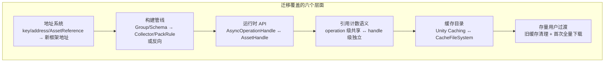
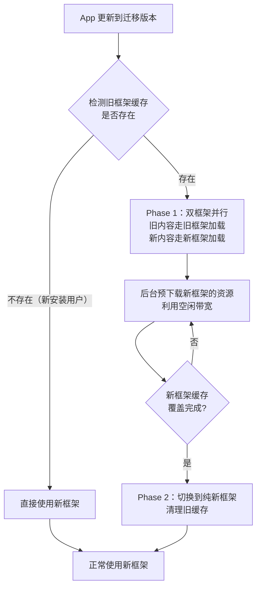
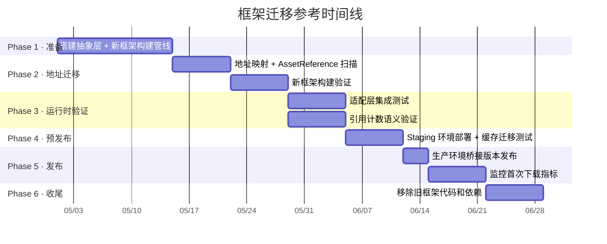

这篇是 Addressables 与 YooAsset 源码解读系列的 Case-05，也是整个系列的最后一篇。

前面 17 篇做的事情：主线 A 把 Addressables 从运行时到构建期拆到了源码级别，主线 B 对 YooAsset 做了同样的拆解，对比线 C 在运行时、构建期和治理层三个维度把两个框架放到同一组问题上结构对比，Case-01 到 Case-04 用四个生产场景验证了这些结构差异在实际事故中的表现。

这篇要回答系列留到最后的一个问题：

`如果项目需要从一个框架迁移到另一个，完整路径是什么，哪里最容易翻车？`

迁移不是"换一组 API 调用"。[Cmp-01]() 拆过两套系统在定位、调度、引用计数上的结构差异，[Cmp-02]() 拆过构建输入和产物格式的不同，[Cmp-03]() 拆过版本号、缓存、下载层的治理差异。迁移本质上是把这些差异逐项对齐——地址系统、构建管线、运行时调度、缓存目录、引用计数语义，全部要重新映射。

这篇覆盖两个方向：Addressables → YooAsset，和 YooAsset → Addressables。大多数迁移场景是前者（Addressables 的边界在重度热更场景下被触达，[Addr-05]() 已经列过这些边界），但反向迁移在需要 Unity 官方生态深度集成时也会发生。

> 以下分析基于 Addressables 1.21.x 和 YooAsset 2.x。

## 一、为什么会需要迁移

### 从 Addressables 迁向 YooAsset 的典型触发点

项目进入生产阶段后，[Addr-05]() 列出的能力边界开始集中暴露：

- **下载治理缺失**。[Cmp-03]() 追过——Addressables 没有内置的下载队列、并发控制、断点续传。项目已经在 `AssetBundleProvider` 之上自建了一整套下载管理器，维护成本逐渐超过框架本身带来的收益。
- **`content_state.bin` 反复出事**。[Cmp-02]() 拆过——Content Update Build 依赖这个快照文件，CI 环境丢失或损坏一次就是全量重下。团队在 CI 上为保护这个文件投入的精力已经不合比例。
- **多包独立更新是刚需**。项目有主包 + DLC + 多语言资源，需要各自独立更新版本。Addressables 的多 catalog 能力理论可行但实践中问题多，YooAsset 的原生多 `ResourcePackage` 设计更直接。

### 从 YooAsset 迁向 Addressables 的典型触发点

- **Unity 官方生态绑定**。项目需要用 Unity Cloud Build、Unity Cloud Content Delivery，或者需要 Addressables Event Viewer / Profiler Module 做持续的运行时诊断。
- **团队变化**。新加入的团队成员熟悉 Addressables，对 YooAsset 不了解。[Yoo-05]() 提过文档以中文为主、社区渠道有限的现实。
- **Unity 6 升级**。Addressables 2.x 随 Unity 6 发布，catalog.bin 性能提升、Profiler Module 增强。如果项目计划全面拥抱 Unity 6 官方管线，统一到 Addressables 可以减少维护面。

### 迁移的核心认知

不管方向如何，迁移不是"把 `Addressables.LoadAssetAsync` 替换成 `package.LoadAssetAsync`"的字符串替换。它是一次资源交付模型的重映射：



每一层都有自己的迁移路径和翻车点。下面逐层展开。

## 二、地址系统迁移

地址系统是迁移的第一步——两个框架用不同的方式把"一个标识"映射到"一个可加载资产"。

### Addressables 的地址模型

[Cmp-01]() 拆过 Addressables 的定位机制。调用方传入的 key 有三种来源：

| key 类型 | 来源 | 运行时行为 |
|---------|------|-----------|
| address 字符串 | Group Entry 的 address 字段 | `IResourceLocator.Locate(key)` 在 `ResourceLocationMap` 中查找 |
| Label | Group Entry 的 labels | `Locate` 返回所有带该 label 的 location 列表 |
| AssetReference | 序列化在 Prefab/SO/Scene 中的 GUID | `AssetReference.RuntimeKey` 拿到 GUID 字符串，走 `Locate` |

### YooAsset 的地址模型

YooAsset 的定位只有一层：`PackageManifest._assetDic[address]`。address 字符串由构建期的 `AddressRule` 生成。

| key 类型 | 来源 | 运行时行为 |
|---------|------|-----------|
| address 字符串 | `AddressRule` 生成（默认按文件名、可自定义） | `PackageManifest.TryGetPackageAsset(address)` 字典查找 |
| asset path | 资产的完整路径 | 同上，path 也可以作为地址 |
| tag | Collector 配置 | 用于筛选下载范围，不直接用于加载 |

### 迁移映射

**方向一：Addressables → YooAsset**

| Addressables 概念 | YooAsset 对应 | 迁移动作 |
|-------------------|--------------|---------|
| address 字符串 | address 字符串 | 配置 AddressRule 生成相同的地址。如果原地址是路径格式，直接映射；如果是自定义简称，需要自定义 `IAddressRule` |
| Label | Tag | Collector 的 Tag 字段。功能不完全等价——Label 可用于加载时筛选，Tag 主要用于下载筛选 |
| AssetReference（GUID） | 无直接对应 | 这是最难迁移的部分，后面专门讲 |

**方向二：YooAsset → Addressables**

| YooAsset 概念 | Addressables 对应 | 迁移动作 |
|--------------|-------------------|---------|
| address 字符串 | address 字符串 | 在 Group Entry 上设置相同的 address |
| asset path | address 或直接路径 | Addressables 也可以用路径作为 key |
| Tag | Label | 把 Tag 值映射为 Label 名 |

### AssetReference——迁移中最硬的骨头

`AssetReference` 是 Addressables 独有的设计。它是一个序列化在 Prefab、ScriptableObject、Scene 中的字段，存储 GUID + SubObjectName：

```csharp
// Addressables 的 AssetReference 用法
[SerializeField] private AssetReference _uiPrefab;

async void LoadUI()
{
    var handle = _uiPrefab.LoadAssetAsync<GameObject>();
    await handle.Task;
    Instantiate(handle.Result);
}
```

YooAsset 没有 `AssetReference` 概念。加载都走 address 字符串：

```csharp
// YooAsset 的等价加载
async void LoadUI()
{
    var handle = _package.LoadAssetAsync<GameObject>("UIPrefab");
    await handle.Task;
    Instantiate(handle.AssetObject as GameObject);
}
```

问题在于：`AssetReference` 分布在项目的所有序列化资产中。每个 Prefab 上的 `MonoBehaviour`、每个 `ScriptableObject` 的字段、每个 Scene 里的组件引用——只要用了 `AssetReference`，迁移时都需要处理。

### 迁移工具：AssetReference 扫描和映射表

```csharp
// Editor 脚本：扫描项目中所有 AssetReference 字段，
// 输出 GUID → address 映射表
public static class AssetReferenceMigrationScanner
{
    // 扫描所有 Prefab 和 ScriptableObject 中的 AssetReference 字段
    // 输出格式：{ GUID, AssetPath, 所在资产路径, 字段名 }
    public static List<AssetRefEntry> ScanAllAssetReferences()
    {
        var results = new List<AssetRefEntry>();
        // 1. 找到所有可能包含 AssetReference 的资产
        var guids = AssetDatabase.FindAssets("t:Prefab t:ScriptableObject");

        foreach (var guid in guids)
        {
            var path = AssetDatabase.GUIDToAssetPath(guid);
            var asset = AssetDatabase.LoadAssetAtPath<UnityEngine.Object>(path);
            if (asset == null) continue;

            // 2. 通过 SerializedObject 遍历所有 SerializedProperty
            var so = new SerializedObject(asset);
            var prop = so.GetIterator();
            while (prop.NextVisible(true))
            {
                // 3. 检查字段类型是否是 AssetReference
                if (prop.type.Contains("AssetReference")
                    && prop.FindPropertyRelative("m_AssetGUID") != null)
                {
                    var refGuid = prop.FindPropertyRelative("m_AssetGUID").stringValue;
                    if (string.IsNullOrEmpty(refGuid)) continue;

                    var refPath = AssetDatabase.GUIDToAssetPath(refGuid);
                    results.Add(new AssetRefEntry
                    {
                        GUID = refGuid,
                        ReferencedAssetPath = refPath,
                        HostAssetPath = path,
                        FieldPath = prop.propertyPath
                    });
                }
            }
        }
        return results;
    }
}
```

扫描结果是一张迁移映射表。对于每一个 `AssetReference`，项目需要决定：

1. 在 YooAsset 中这个资产的 address 是什么（由 `AddressRule` 决定）
2. 用什么方式在代码中引用它——从 `[SerializeField] AssetReference` 改成 `[SerializeField] string address`，还是包一层中间类

工作量和 `AssetReference` 的分布密度成正比。散布在几百个 Prefab 里的情况并不少见。

## 三、构建产物迁移

### 核心结论：旧 bundle 不能复用

两套框架的构建管线完全不同。[Cmp-02]() 完整对照过：

- Addressables 走 SBP task chain，产出 `catalog.json` / `catalog.bin` + bundle 文件 + `content_state.bin`
- YooAsset 走 `AssetBundleBuilder`，产出 `PackageManifest_{ver}.bytes` + bundle 文件

即使底层都是 AssetBundle 格式，两套框架的打包策略（分组规则、依赖处理、命名方式）不同，产出的 bundle 内容和结构也不同。旧框架的 bundle 不能被新框架的 Manifest/Catalog 正确索引。

**迁移意味着一次完整的重新构建。** 这是一个一次性的 clean break。

### Group → Collector 映射（Addressables → YooAsset）

| Addressables 配置 | YooAsset 对应配置 | 说明 |
|-------------------|------------------|------|
| `AddressableAssetGroup` | `CollectorGroup` + `AssetBundleCollector` | 一个 Group 通常对应一个 CollectorGroup 下的一到多个 Collector |
| `BundleMode.PackTogether` | `PackRule = PackCollector` | 整组打一个 bundle |
| `BundleMode.PackSeparately` | `PackRule = PackSeparately` | 每个资产一个 bundle |
| `BundleMode.PackTogetherByLabel` | 自定义 `IPackRule` | YooAsset 没有内置的按 Label 分包，需要实现自定义 PackRule |
| `BundledAssetGroupSchema.Compression` | 构建参数中设置 | 压缩方式在 YooAsset 构建参数层统一配置 |
| `BuildPath / LoadPath` (Profile) | `IRemoteServices` 运行时指定 | YooAsset 构建产物不绑定加载路径，运行时初始化时指定 |
| `content_state.bin` | 无对应 | YooAsset 不依赖构建快照文件，每次独立全量构建 |

### Collector → Group 映射（YooAsset → Addressables）

| YooAsset 配置 | Addressables 对应配置 | 说明 |
|--------------|----------------------|------|
| `CollectorGroup` | `AddressableAssetGroup` | 一个 CollectorGroup 对应一个或多个 Group |
| `PackRule` | `BundleMode` | PackSeparately → PackSeparately；PackDirectory / PackCollector → PackTogether（可能需要拆分 Group 以匹配粒度） |
| `FilterRule` | Entry 级别手动管理 | Addressables 没有 FilterRule 接口，需要在 Entry 添加时自行过滤 |
| `AddressRule` | Entry address 字段 | 需要确保地址格式一致 |
| `DependAssetCollector` | 无直接对应 | 需要手动将共享依赖拉进专门的 Group，或依赖 Analyze Rules 事后检测 |

### 关键差异：依赖处理策略

[Cmp-02]() 对这个差异做过详细对照。迁移方向不同，影响也不同：

**Addressables → YooAsset**：Addressables 的隐式依赖（未被 Group 收集的共享资产默认重复打入引用方 bundle）在 YooAsset 中需要通过 `DependAssetCollector` 显式管理。迁移时如果遗漏了共享依赖的 Collector 配置，会导致 bundle 膨胀。

**YooAsset → Addressables**：YooAsset 的 `DependAssetCollector` 管理的共享依赖需要在 Addressables 中拉进专门的 Group。如果漏掉了，Addressables 会默认重复打包这些资产。

## 四、运行时 API 适配层

如果项目不想一刀切迁移（或者想保留在两个框架之间切换的能力），可以设计一层抽象。

### 适配层接口设计

```csharp
// 框架无关的资源加载接口
public interface IAssetLoader : IDisposable
{
    // 加载资产
    ILoadHandle<T> LoadAssetAsync<T>(string address) where T : UnityEngine.Object;

    // 释放资产
    void Release(ILoadHandle handle);

    // 创建下载器（预下载指定 tag/label 的资源）
    IDownloadHandle CreateDownloader(string tag, int maxConcurrency = 4);

    // 查询下载大小
    long GetDownloadSize(string tag);
}

// 加载句柄
public interface ILoadHandle<T> : ILoadHandle where T : UnityEngine.Object
{
    T Result { get; }
}

public interface ILoadHandle
{
    bool IsDone { get; }
    bool IsSuccess { get; }
    float Progress { get; }
    System.Threading.Tasks.Task Task { get; }
}

// 下载句柄
public interface IDownloadHandle
{
    long TotalBytes { get; }
    long DownloadedBytes { get; }
    float Progress { get; }
    void BeginDownload();
    System.Threading.Tasks.Task Task { get; }
}
```

### Addressables 实现

```csharp
public class AddressablesAssetLoader : IAssetLoader
{
    public ILoadHandle<T> LoadAssetAsync<T>(string address) where T : UnityEngine.Object
    {
        var op = Addressables.LoadAssetAsync<T>(address);
        return new AddressablesLoadHandle<T>(op);
    }

    public void Release(ILoadHandle handle)
    {
        if (handle is IAddressablesHandle addrHandle)
            Addressables.Release(addrHandle.RawHandle);
    }

    public IDownloadHandle CreateDownloader(string tag, int maxConcurrency = 4)
    {
        // Addressables 不支持 maxConcurrency——这是适配层无法抹平的差异
        var sizeOp = Addressables.GetDownloadSizeAsync(tag);
        return new AddressablesDownloadHandle(tag, sizeOp);
    }

    public long GetDownloadSize(string tag)
    {
        var op = Addressables.GetDownloadSizeAsync(tag);
        op.WaitForCompletion();
        return op.Result;
    }

    public void Dispose() { }
}

// 包裹 AsyncOperationHandle
internal class AddressablesLoadHandle<T> : ILoadHandle<T>, IAddressablesHandle
    where T : UnityEngine.Object
{
    private readonly AsyncOperationHandle<T> _handle;

    public AddressablesLoadHandle(AsyncOperationHandle<T> handle) => _handle = handle;

    public T Result => _handle.Result;
    public bool IsDone => _handle.IsDone;
    public bool IsSuccess => _handle.Status == AsyncOperationStatus.Succeeded;
    public float Progress => _handle.PercentComplete;
    public Task Task => _handle.Task;
    public AsyncOperationHandle RawHandle => _handle;
}
```

### YooAsset 实现

```csharp
public class YooAssetLoader : IAssetLoader
{
    private readonly ResourcePackage _package;

    public YooAssetLoader(ResourcePackage package) => _package = package;

    public ILoadHandle<T> LoadAssetAsync<T>(string address) where T : UnityEngine.Object
    {
        var handle = _package.LoadAssetAsync<T>(address);
        return new YooAssetLoadHandle<T>(handle);
    }

    public void Release(ILoadHandle handle)
    {
        if (handle is IYooAssetHandle yooHandle)
            yooHandle.RawHandle.Release();
    }

    public IDownloadHandle CreateDownloader(string tag, int maxConcurrency = 4)
    {
        var downloader = _package.CreateResourceDownloader(tag, maxConcurrency, 3);
        return new YooAssetDownloadHandle(downloader);
    }

    public long GetDownloadSize(string tag)
    {
        var downloader = _package.CreateResourceDownloader(tag, 1, 1);
        return downloader.TotalDownloadBytes;
    }

    public void Dispose()
    {
        // Package 生命周期由上层管理
    }
}

// 包裹 AssetHandle
internal class YooAssetLoadHandle<T> : ILoadHandle<T>, IYooAssetHandle
    where T : UnityEngine.Object
{
    private readonly AssetHandle _handle;

    public YooAssetLoadHandle(AssetHandle handle) => _handle = handle;

    public T Result => _handle.AssetObject as T;
    public bool IsDone => _handle.IsDone;
    public bool IsSuccess => _handle.Status == EOperationStatus.Succeed;
    public float Progress => _handle.Progress;
    public Task Task => _handle.Task;
    public AssetHandle RawHandle => _handle;
}
```

### 适配层的取舍

**优点**：

- 允许渐进式迁移——先迁移构建管线，运行时通过切换 `IAssetLoader` 实现来验证
- 新旧框架可以 A/B 对比（同一套上层代码，底层分别跑两个框架）
- 迁移完成后，如果未来需要再换框架，成本更低

**代价**：

- 适配层无法抹平所有差异。[Cmp-01]() 拆过的引用计数语义差异（operation 级共享 vs handle 级独立）是结构性的，适配层只能选择一种语义暴露给上层
- 框架特有功能被遮蔽。YooAsset 的 `ForceUnloadAllAssets()`、Addressables 的 `WaitForCompletion()`——这些无法在通用接口中暴露
- 多一层抽象意味着多一层需要维护和调试的代码

适配层适合迁移期间作为过渡手段。迁移完成后，建议评估是否保留——如果团队确定不会再换框架，直接使用框架原生 API 的维护成本更低。

## 五、缓存兼容性

[Cmp-03]() 把两个框架的缓存管理做过完整对照。核心结论：**两套缓存系统完全独立，没有任何共享。**

### Addressables 缓存

```
Unity Caching API 管理：
  {cacheRoot}/{bundleName}/{hash128}/
  引擎层托管，应用层不透明
```

### YooAsset 缓存

```
CacheFileSystem 自管：
  {persistentDataPath}/YooAsset/{PackageName}/CacheFiles/
  ├── {BundleGUID}/
  │   ├── __data        ← bundle 文件
  │   └── __info        ← 元数据
```

### 迁移对用户的影响

迁移到新框架后，旧框架的缓存对新框架不可见。这意味着：

**存量用户在迁移版本首次启动时，需要重新下载所有资源。**

如果项目的热更包体是 500MB，存量用户在迁移版本发布后首次打开应用，就需要经历一次 500MB 的完整下载——即使这些内容在旧框架的缓存中全部存在。

### 缓存过渡策略



**策略一：一刀切（简单但体验差）**

迁移版本发布后，所有用户走新框架的完整下载流程。旧缓存在确认新框架资源全部就绪后删除。

适用条件：资源总量小（< 100MB）、用户网络环境好、可以接受一次性长时间下载。

**策略二：双框架并行（复杂但体验好）**

迁移版本同时包含旧框架和新框架的运行时。已缓存的旧资源仍然通过旧框架加载，新增内容通过新框架加载。后台利用空闲带宽逐步将旧资源在新框架下重新缓存。全部完成后切换到纯新框架模式。

适用条件：资源总量大（> 500MB）、用户对下载敏感（移动端、弱网地区）。代价是迁移版本需要同时集成两套框架，包体增大，逻辑复杂。

**策略三：版本桥接（折中）**

在迁移版本之前发一个"桥接版本"。这个版本仍然使用旧框架，但在后台偷偷把旧缓存中的资源以新框架的格式重新写入一份。桥接版本完成后，下一个版本切换到新框架。

适用条件：项目有版本递进的空间（可以分两个版本完成迁移）。好处是用户在桥接版本期间感知不到迁移过程。

### 旧缓存清理

**从 Addressables 迁出**：旧缓存在 Unity `Caching` 目录中。通过 `Caching.ClearCache()` 清理全部，或 `Caching.ClearOtherCachedVersions` 按 bundle 清理。

**从 YooAsset 迁出**：旧缓存在 `{persistentDataPath}/YooAsset/` 目录下。直接删除整个目录即可——YooAsset 的缓存结构对应用层完全可见。

## 六、最容易翻车的三个点

前五节是迁移的"正面路径"。这一节讲的是三个最高频的翻车点——每一个都是从具体的框架结构差异推导出来的。

### 翻车点一：AssetReference 引用丢失

**为什么会翻车**

`AssetReference` 序列化在 Prefab、ScriptableObject、Scene 中。它存储的是目标资产的 GUID 和 SubObjectName。当从 Addressables 迁移到 YooAsset 时，`AssetReference` 类型本身不再有意义——YooAsset 的加载 API 接收 address 字符串，不接收 `AssetReference`。

但 `AssetReference` 的序列化数据散布在项目的每一个序列化资产中。如果代码层面把 `AssetReference` 字段改成了 `string address`，而没有同步更新所有引用这个字段的 Prefab 和 ScriptableObject——序列化数据断裂，运行时拿到的是空字符串或默认值。

**为什么难发现**

这不是编译期错误。代码改完后项目正常编译、正常构建。问题在运行时暴露：某个 UI 面板加载时传了空地址，返回 null。而且不是所有面板都会立刻被触发——低频使用的功能可能在上线后很久才被用户触碰到。

**怎么防**

1. 在修改字段类型之前，先用 Section 2 的扫描工具导出完整的 AssetReference 映射表
2. 修改字段类型后，写 Editor 脚本自动用映射表回填新字段值
3. 写一个构建前校验脚本：扫描所有 Prefab 和 ScriptableObject 中类型为 `string` 且名称匹配地址字段命名规范的属性，检查是否为空
4. 在 CI 中加入加载测试：对所有已注册地址执行一次 `LoadAssetAsync`，验证无 null 返回

### 翻车点二：引用计数语义差异导致资源泄漏或提前卸载

**为什么会翻车**

[Cmp-01]() 和 [Case-04]() 完整拆过两套框架的引用计数差异：

- **Addressables**：同 key 二次加载共享同一个 operation，refcount 合并。两个调用者拿到的 handle 背后是同一个 operation 实例。
- **YooAsset**：每次 `LoadAssetAsync` 创建独立的 ProviderOperation。两个调用者拿到的 handle 各自独立，bundleLoader 层面的引用计数分别递增。

这意味着在 Addressables 下"合法"的代码模式，在 YooAsset 下可能导致问题：

**模式一：Load-And-Forget**

```csharp
// Addressables 下这种模式不会泄漏——
// 两次 Load 同一个 key 共享一个 operation，
// 第二次 Load 不增加真实加载次数，
// Release 一次即可把 operation refcount 降为 0
var handle1 = Addressables.LoadAssetAsync<Sprite>("icon");
await handle1.Task;
var sprite = handle1.Result;
// ...用完后只 Release 了 handle1
Addressables.Release(handle1);

// 但如果中间有人也 Load 了同一个 key：
var handle2 = Addressables.LoadAssetAsync<Sprite>("icon");
// handle2 和 handle1 共享 operation，refcount = 2
// 只 Release handle1 → refcount = 1 → 资源不卸载
// 在 Addressables 下这是预期行为——有人还在用
```

```csharp
// 迁移到 YooAsset 后——
// 每次 LoadAssetAsync 创建独立 operation
var handle1 = package.LoadAssetAsync<Sprite>("icon");
await handle1.Task;
// handle1 对应 providerOp1，bundleLoader refcount = 1

var handle2 = package.LoadAssetAsync<Sprite>("icon");
// handle2 对应 providerOp2，bundleLoader refcount = 2

handle1.Release();  // bundleLoader refcount = 1
// handle2 没有 Release → bundleLoader refcount 永远不归零 → 泄漏
```

**模式二：场景级 Handle Pool**

有些项目在 Addressables 下建了"场景级 handle pool"——进入场景时统一 Load，退出时统一 Release 池内所有 handle。这个模式依赖 Addressables 的 operation 共享：场景内多个系统加载同一个资源，都拿到同一个 operation 的 handle。池只需要记录一次、Release 一次。

迁移到 YooAsset 后，每次 Load 都是独立 handle。如果池只记录了第一次 Load 的 handle，后续 Load 的 handle 就不在池的管理范围内——退出场景时这些 handle 不会被 Release。

**怎么防**

1. 迁移前审计项目中所有 `LoadAssetAsync` / `Release` 的配对关系
2. 如果项目依赖 operation 共享语义（同 key 只记一次 handle），在迁移到 YooAsset 后需要在自己的资源管理层加一层"address → handle"缓存，模拟 Addressables 的共享行为
3. 反向迁移同理：从 YooAsset 迁到 Addressables 时，原来每次 Load 都独立 Release 的代码在 Addressables 下可能出现过早卸载（Release 了共享 operation，影响了其他持有者）

### 翻车点三：热更存量用户的首次全量下载

**为什么会翻车**

Section 5 已经讲了缓存不兼容的事实。但真正的翻车点不在技术层面，而在用户体验层面。

假设项目有 1000 万存量用户，热更资源总量 800MB。迁移版本发布后：

- 所有存量用户首次打开需要下载 800MB
- 如果是移动端用户，800MB 下载在 4G 环境下需要 10-20 分钟
- 如果断了（[Case-01]() 讲过的场景），旧框架是 Addressables 的话连断点续传都没有
- 大量用户可能在下载过程中流失

这不是框架的 bug，是迁移的结构性代价。但如果项目没有预估到这个代价，上线后突然发现次日留存暴跌，就是一次运营事故。

**怎么防**

1. **拆分迁移批次**。不要一次把所有资源都切到新框架。第一个迁移版本只切新增内容，旧内容保持在旧框架。后续版本逐步迁移。
2. **预热策略**。在迁移版本发布前 N 个版本，开始在后台静默下载新框架格式的核心资源。迁移版本发布时，大部分资源已经在新框架缓存中了。
3. **下载分层**。核心游戏资源优先下载（进入游戏需要的部分），非核心内容（活动、多语言包）在游戏过程中后台下载。
4. **监控**。迁移版本发布后密切监控：首次启动下载完成率、平均下载耗时、下载中断率、应用卸载率。

## 七、迁移清单和时间线建议

### 分阶段时间线



### 迁移检查清单

| 序号 | 检查项 | 状态 |
|------|--------|------|
| 1 | 导出项目中所有 AssetReference 的映射表（GUID → path → host asset） | |
| 2 | 新框架的 AddressRule / Group Entry 配置完成，地址格式和旧框架一致 | |
| 3 | 新框架构建管线跑通，产物输出正常 | |
| 4 | 共享依赖的处理策略确认（DependAssetCollector / 专用 Group） | |
| 5 | 适配层 `IAssetLoader` 两端实现完成并通过单元测试 | |
| 6 | 引用计数语义审计完成——列出所有依赖 operation 共享的代码模式 | |
| 7 | Label / Tag 映射表完成，下载筛选逻辑验证通过 | |
| 8 | 旧框架缓存清理逻辑编写并测试 | |
| 9 | 新框架缓存目录、磁盘占用评估完成 | |
| 10 | 存量用户首次全量下载的预估大小和耗时已计算 | |
| 11 | 桥接版本策略确认（一刀切 / 双框架并行 / 版本桥接） | |
| 12 | CI 构建管线适配完成（移除 content_state.bin 依赖 / 新增 Collector 构建脚本） | |
| 13 | Staging 环境端到端测试通过（安装 → 更新 → 下载 → 加载 → 缓存清理） | |
| 14 | 生产环境监控指标就绪（下载完成率、平均耗时、中断率、卸载率） | |
| 15 | 旧框架代码和依赖的移除 PR 准备好（迁移确认稳定后合入） | |

## 八、系列回顾与工程判断

这是整个系列的最后一节。18 篇文章做了什么，回顾一下。

### 主线 A：Addressables 内部架构（5 篇）

[Addr-01]() 到 [Addr-05]() 把 Addressables 从运行时到构建期完整拆到了源码级别：

- 运行时四角色和 `LoadAssetAsync` 的完整链路
- `ContentCatalogData` 的编码格式、加载成本和更新机制
- 引用计数和生命周期——为什么 Release 比 Load 更难做对
- 构建期从 Group Schema 到 bundle 产物的 SBP task chain
- 能力边界——下载队列、断点续传、灰度发布、多环境版本共存

核心判断：Addressables 是一个优秀的资源寻址和管理框架，但不是一个完整的资源交付系统。框架和交付系统之间的距离，取决于项目离生产有多远。

### 主线 B：YooAsset 内部架构（5 篇）

[Yoo-01]() 到 [Yoo-05]() 对 YooAsset 做了同样层次的拆解：

- 运行时四阶段和从 address 到对象就绪的全链
- `PackageManifest` 的序列化结构和三层校验
- 下载器和缓存系统——队列管理、断点续传、磁盘结构
- 构建期从 Collector 到 bundle 产物的完整链路
- 能力边界——官方工具链集成、Editor 分析规则、Unity 新特性跟进

核心判断：YooAsset 是一个聚焦型的资源交付引擎，在交付核心（下载/缓存/校验/加载）上的控制力很高，但把治理和工具链集成留给了项目。

### 对比线 C：结构差异对照（3 篇）

[Cmp-01]() 到 [Cmp-03]() 在三个维度上把同一组问题放到一起比：

- **运行时调度**：Addressables 的 Provider 模式扩展性更好，YooAsset 的直接 Loader 调度路径更短
- **构建与产物**：Addressables 的增量构建依赖 `content_state.bin`（有状态），YooAsset 把差量推到运行时（无状态构建）
- **治理能力**：Addressables 依赖引擎层托管，YooAsset 在应用层提供完整的下载和缓存治理

核心判断：两个框架不存在绝对优劣。差异在设计半径——Addressables 覆盖范围更广但每个环节控制力相对弱，YooAsset 聚焦交付核心但治理层需要项目自建。

### 实战线 D：生产场景验证（5 篇）

[Case-01]() 到本文（Case-05），用五个生产场景验证了前三条线的结构分析：

- 下载中断与恢复——YooAsset 的断点续传 vs Addressables 的原子写入
- 半更新状态——catalog 替换不可逆 vs manifest 三步分离
- 线上版本回滚——hash 标识 vs 显式版本号
- Handle 泄漏——operation 共享模型下的引用计数陷阱
- 框架迁移——地址系统、构建管线、运行时 API、缓存目录的完整重映射

### 最终工程判断

18 篇文章构建的不是一个"A 比 B 好"的结论，而是一套判断框架：

**选型不该基于功能清单，而该基于结构证据。**

"Addressables 是官方的"和"YooAsset 下载好"都是表层描述。本系列追的是这些描述背后的结构性原因：

- "官方"意味着什么——意味着 Provider 模式的扩展点、SBP 的原生集成、Event Viewer 的诊断能力、和 Unity 版本的同步更新。但也意味着 `DownloadHandlerAssetBundle` 的原子写入限制、`Caching` API 的粒度限制、`content_state.bin` 的状态依赖。
- "下载好"意味着什么——意味着 `ResourceDownloaderOperation` 的三态队列、`.temp` 文件的断点续传、FileSize + FileCRC + FileHash 的三重校验。但也意味着没有 Analyze Rules 的构建前检测、没有 Event Viewer 的运行时诊断、没有官方 Registry 的版本管理。

项目在选型时，需要把自己的具体条件（更新频率、用户网络环境、团队构成、CI 基础设施、Unity 版本计划）映射到这些结构差异上，得出的才是有根据的判断。

迁移也是一样。迁移不是因为"那个框架更好"，而是因为项目的条件变了——触达了当前框架的边界，而另一个框架的设计半径更好地覆盖了新条件。

这个系列到这里结束。所有分析的证据来源是两套框架的源码结构，而不是功能列表或社区口碑。希望这些源码级的拆解能帮助读者在自己的项目条件下做出有根据的工程判断。
