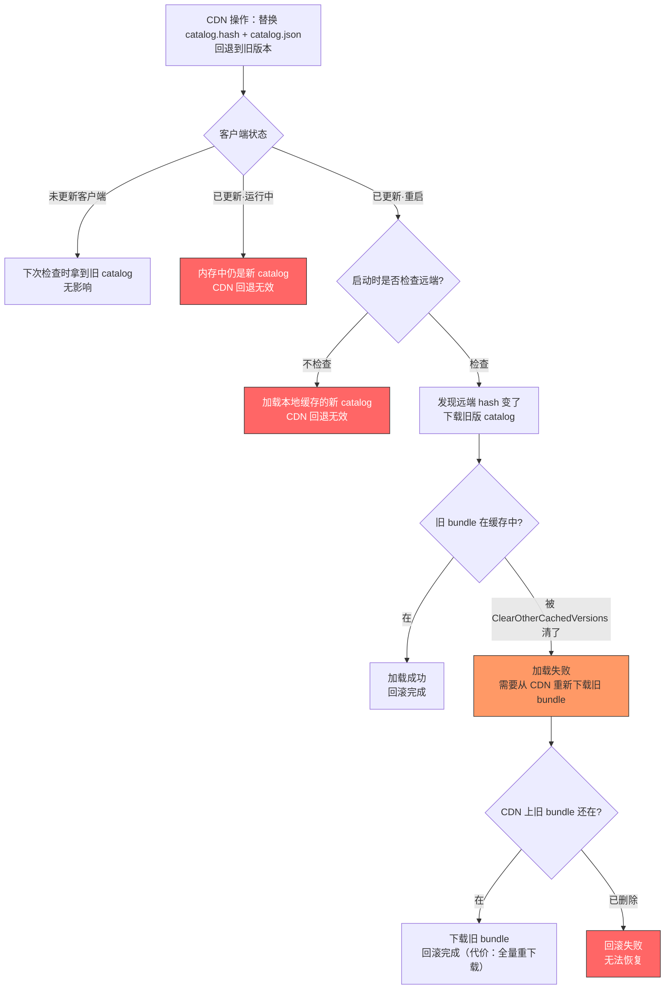
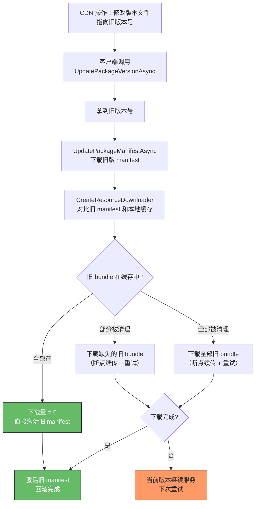

这篇是 Addressables 与 YooAsset 源码解读系列的 Case-03。

[Case-02]() 追的是"半更新状态"——索引更新了但 bundle 没下完。那篇的结论是 Addressables 的半更新窗口是结构性的，YooAsset 的三步分离在设计上消除了这个窗口。

这篇要追一个更高压的场景：**半更新的反面——更新完全成功了，但新版本有严重问题，必须紧急回滚到旧版本。**

半更新是"更新没做完"，回滚是"更新做完了但做错了"。两个方向，两种风险，两种恢复路径。

> **版本基线：** 本文基于 Addressables 1.21.x 和 YooAsset 2.x 源码。

## 一、现场还原——紧急回滚场景

### 典型现场

周二上午 10 点，运营团队通过热更新推送了一个新版本资源包到全量用户。更新内容包含 UI 界面改版和一批新的角色资源。CDN 文件已经全部替换，catalog/manifest 指向新 bundle。

到 11 点，客服开始收到密集反馈：
- 部分玩家进入战斗后闪退
- 新 UI 在某些低端机上布局错乱
- 某个必经流程的 prefab 加载失败，阻断主线

crash rate 从 0.3% 飙到 4%。团队决定：**立刻回滚到上一个稳定版本。**

### 回滚面对的三个核心问题

**第一，怎么让客户端拿到旧版本的索引？** Catalog 或 manifest 已经指向新 bundle，需要让客户端重新指回旧版本。

**第二，客户端本地缓存处于什么状态？** 已经更新完成的客户端，缓存里可能只有新 bundle。旧 bundle 可能已经被缓存清理策略删掉了。

**第三，回滚后的数据一致性怎么保证？** 回滚不是"时光倒流"——客户端可能存在新旧 bundle 混存的状态，这种混合状态会不会引发新的问题？

### 为什么这是移动端运营最高压的场景之一

和半更新不同，回滚场景下所有客户端都已经拿到了新内容。受影响的不是"弱网的一小部分用户"，而是全量用户。每多一分钟不回滚，crash 就多影响一批玩家。

但回滚本身也可能引入新问题。如果回滚操作不干净——比如旧索引和新 bundle 混在一起——等于用一个新问题替换了旧问题。

这篇要从源码层面追清楚：两个框架在这个场景下各自的操作路径、风险点和恢复代价。

## 二、Addressables 的回滚路径

### Step 1：CDN 侧回退 catalog

Addressables 的热更核心是 catalog。客户端每次检查更新时，请求的是 CDN 上的 `catalog.hash` 文件。回滚的第一步是在 CDN 上操作：

```
操作：把 CDN 上的 catalog.hash 和 catalog.json（或 catalog.bin）
      替换回上一个稳定版本的文件
```

替换完成后，新启动的客户端调用 `CheckForCatalogUpdates()` 时，拿到的 hash 和本地一致（如果本地还缓存着旧 catalog），就不会触发更新。或者拿到旧版本 hash，触发一次"降级更新"——下载旧版 catalog。

这一步的源码路径在 [Catalog 篇]()里已经拆过：`CheckForCatalogUpdates` 内部用 `ContentCatalogProvider` 对比远端 hash 和本地 hash。如果不同，返回需要更新的 catalog 列表。

### Step 2：已更新客户端的问题

CDN 回退解决了"还没更新的客户端"。但已经完成更新的客户端呢？

对于已经下载了新 catalog 的客户端，情况分两种：

**客户端仍在运行中。** 新 catalog 已经通过 `UpdateCatalogs` 加载到内存，`AddressablesImpl.m_ResourceLocators` 中存的是新版 `ResourceLocationMap`。在这次运行期间，所有 `Locate(key)` 返回的都是新 bundle 的 location。CDN 上的回退对正在运行的客户端无效——它不会重新检查 catalog。

**客户端重启。** `InitializeAsync` 启动时，`ContentCatalogProvider` 会尝试加载 catalog。加载来源取决于配置：
- 如果配置了远端 catalog 更新，会先检查远端——此时拿到的是已回退的旧版 catalog
- 如果本地缓存了新版 catalog 且未清理，可能加载本地缓存的新版

关键问题出在这里：**`ContentCatalogProvider` 在初始化时，优先使用本地缓存的 catalog 还是重新请求远端？**

源码位置：`com.unity.addressables/Runtime/ResourceManager/ResourceProviders/ContentCatalogProvider.cs`

`ContentCatalogProvider` 的行为是：如果本地有缓存的 catalog 且 hash 匹配，直接使用本地版本，不请求远端。只有显式调用 `CheckForCatalogUpdates` 并发现 hash 不同时，才会下载远端的新（此时是旧）版本。

这意味着：**如果项目在启动时没有调用 `CheckForCatalogUpdates`，已更新客户端重启后仍会使用缓存的新版 catalog。CDN 回退对这些客户端无效。**

### Step 3：缓存里的 bundle 状态

即使客户端成功加载了旧版 catalog，还有一个更棘手的问题：缓存里的 bundle 是什么版本的？

旧 catalog 的 `m_InternalIds` 引用的是旧 bundle 的路径和版本 hash。但客户端缓存里可能只有新 bundle：

- 如果更新过程中调用了 `Caching.ClearOtherCachedVersions()`，旧版本的 bundle 已经被删除
- 如果没有主动清理，新旧版本的 bundle 可能共存于 Unity 缓存中

`Caching.ClearOtherCachedVersions()` 是 Unity 缓存 API 提供的方法，作用是清理同一个 bundle name 下的所有非当前版本缓存。很多项目在热更完成后调用这个方法来释放磁盘空间。

但在回滚场景下，这就变成了一颗定时炸弹：**旧 bundle 已经被清理了，旧 catalog 又指向旧 bundle——加载必然失败。**

### 整体回滚流程和风险点



图里标红的节点就是 Addressables 回滚路径上的三个风险点：
1. 运行中客户端无法被动回滚
2. 不检查远端的客户端无法感知回滚
3. 旧 bundle 被清理后需要重新下载，CDN 必须保留旧文件

## 三、YooAsset 的回滚路径

### Step 1：CDN 侧回退 manifest 版本

YooAsset 的版本检查入口是 `UpdatePackageVersionAsync`，它请求 CDN 上的版本文件获取当前应该使用的 `PackageVersion` 字符串。回滚操作：

```
操作：修改 CDN 上的版本文件，把版本号指回上一个稳定版本
      确保旧版本的 PackageManifest 文件仍在 CDN 上
```

客户端下次调用 `UpdatePackageVersionAsync` 时拿到旧版本号，接着调用 `UpdatePackageManifestAsync` 下载旧版 manifest。

这一步和 Addressables 的 catalog 回退在概念上是对等的，但有一个关键差异：**YooAsset 的版本号是显式的字符串，不是 hash。** 项目可以精确地指定"回到 v1.2.3"，而不是靠替换 hash 文件来间接实现。

[Manifest 篇]()里拆过的三层校验在这里发挥作用：`PackageVersion` 作为第一层检查，开销极小，只需要下载一个几十字节的版本文件。

### Step 2：客户端接收回滚

YooAsset 的三步更新流程在回滚场景下的表现：

```
1. UpdatePackageVersionAsync → 拿到旧版本号
2. UpdatePackageManifestAsync(旧版本号) → 下载旧版 manifest
3. CreateResourceDownloader → 对比旧 manifest 和本地缓存
```

第 3 步是关键。`CreateResourceDownloader` 会遍历旧 manifest 的 `_bundleList`，用每个 `PackageBundle.FileHash` 去查本地 `CacheFileSystem`：

```
对旧 manifest 中的每个 bundle:
  → 计算 BundleGUID (基于 BundleName + FileHash)
  → 查 CacheFileSystem._cacheRecords 字典
  → 命中 → 跳过（旧 bundle 还在缓存里）
  → 未命中 → 加入下载列表（需要从 CDN 下载旧 bundle）
```

### Step 3：缓存命中分析

旧 bundle 是否还在缓存里，取决于项目是否调用过 `ClearUnusedCacheFilesAsync`。

在 [Yoo-03]() 里拆过这个方法的逻辑：它遍历 `CacheFiles/` 目录，删除当前 manifest 的 `_bundleList` 中找不到对应 `FileHash` 的缓存文件。

如果更新到新版本后调用了 `ClearUnusedCacheFilesAsync`，旧版本独有的 bundle 会被清理。但两个版本共享的 bundle（hash 没变的那些）仍然保留。

这意味着回滚时的下载量 = 旧版本独有的 bundle（被清理掉的那些），而不是全量。

### 回滚后的 manifest 激活时机

[Case-02]() 里讲过 YooAsset 的三步分离：新 manifest 在所有 bundle 下载完成之前不会被激活。在回滚场景下，这个机制同样生效：

**如果旧 bundle 全部在缓存中（或已下完），** 旧 manifest 被激活，客户端立刻回到旧版本状态。

**如果旧 bundle 的下载还在进行中，** 当前活跃的 manifest 保持不变。客户端继续使用现有版本（可能是有问题的新版本），直到旧 bundle 全部就位。

这是一个需要权衡的点：三步分离保证了一致性，但也意味着回滚不是"瞬间生效"的——如果需要重新下载大量旧 bundle，回滚的生效时间取决于下载速度。

### 整体回滚流程



和 Addressables 的流程图对比，YooAsset 的回滚路径上没有"CDN 回退无效"的节点——只要客户端走一遍标准更新流程，就能感知到版本变化。关键变量只有一个：旧 bundle 是否需要重新下载。

## 四、回滚代价对比矩阵

| 维度 | Addressables | YooAsset |
|------|-------------|---------|
| 回滚目标精度 | catalog hash（间接，替换文件实现） | PackageVersion（显式版本号） |
| CDN 操作 | 替换 catalog.hash + catalog.json 两个文件 | 修改版本文件中的版本号指针 |
| 运行中客户端 | 无法被动回滚，必须重启且主动检查远端 | 下次 `UpdatePackageVersionAsync` 时感知 |
| 重启后客户端 | 取决于是否检查远端 catalog，可能仍用缓存的新版 | 走标准三步流程，自动获取旧版 |
| 回滚后缓存状态 | 不可预测：新旧 bundle 混存，取决于清理策略 | 可预测：manifest 驱动，缺啥下啥 |
| 旧 bundle 可用性 | 如果 `ClearOtherCachedVersions` 已调用，旧 bundle 全部丢失 | 如果 `ClearUnusedCacheFilesAsync` 已调用，只丢失旧版本独有的 bundle |
| 用户侧带宽代价 | 最坏情况：全量重下载所有 bundle | 最坏情况：只下载被清理的旧版本独有 bundle |
| 回滚生效时间 | 需要重启 + 检查远端 + 可能全量下载 | 下次更新检查 + 差量下载（如有） |
| 数据一致性风险 | 较高：catalog 和 bundle 版本可能不匹配 | 较低：manifest 不激活则不切换 |
| 中间状态安全性 | 有风险：旧 catalog + 新 bundle 的混合状态可能导致加载失败 | 安全：回滚下载期间当前版本继续服务 |

## 五、缓存冲突——回滚时最容易翻车的地方

回滚路径上最大的风险不在 CDN 操作，而在客户端缓存。这一节专门拆缓存冲突。

### Addressables 的缓存困境

Addressables 依赖 Unity 的 `Caching` API 管理 bundle 缓存。`Caching` 的设计理念是：同一个 bundle name 可以有多个版本的缓存，通过 hash 区分。

```
Unity Caching 目录结构（简化）：
{CacheRoot}/
├── characters_bundle/
│   ├── {hash_v1}/   ← v1 版本
│   │   └── __data
│   └── {hash_v2}/   ← v2 版本
│       └── __data
```

理论上，新旧版本的 bundle 可以共存。但实际上，很多项目在热更完成后调用 `Caching.ClearOtherCachedVersions()` 来释放磁盘空间——这会删除同一个 bundle name 下的所有旧版本缓存。

**"幽灵 bundle"问题。** 回滚后的场景：旧 catalog 引用 `characters_bundle` 的 `hash_v1` 版本，但缓存里只有 `hash_v2`。`AssetBundleProvider` 用 `hash_v1` 去查缓存，查不到——因为 `ClearOtherCachedVersions` 已经把 `hash_v1` 删了。

从加载链路的视角看：

```
LoadAssetAsync("hero_prefab")
  → Locate → IResourceLocation (InternalId 指向 characters_bundle, hash=v1)
  → AssetBundleProvider
    → UnityWebRequestAssetBundle(url, hash_v1)
      → Caching 检查：hash_v1 不在缓存中
      → 尝试从 CDN 下载
        → CDN 上是旧版 bundle? 如果保留了则下载成功
        → CDN 上旧 bundle 已删除? 加载失败
```

这就是 Addressables 回滚时最容易翻车的地方：**catalog 版本、缓存 bundle 版本、CDN bundle 版本三者必须全部对齐，任何一环不匹配都会导致加载失败。**

### YooAsset 的缓存安全性

YooAsset 的 `CacheFileSystem` 用 `BundleGUID`（基于 BundleName + FileHash 计算）作为缓存目录名。不同版本的同一个 bundle 有不同的 GUID，存在不同的目录下，互不干扰。

```
YooAsset 缓存目录结构：
{PersistentDataPath}/YooAsset/{PackageName}/CacheFiles/
├── {GUID_based_on_hash_v1}/   ← v1 版本
│   ├── __data
│   └── __info
├── {GUID_based_on_hash_v2}/   ← v2 版本
│   ├── __data
│   └── __info
```

`ClearUnusedCacheFilesAsync` 的清理逻辑是：只删除当前 manifest 中找不到对应 `FileHash` 的缓存文件。这意味着：

**如果在新版本激活后、回滚前调用了清理，** 旧版本独有的 bundle 会被删除。但新旧版本共享的 bundle（hash 没变的）保留。

**如果没有调用清理，** 新旧版本的 bundle 全部共存。回滚时 `CreateResourceDownloader` 发现旧 bundle 全部命中缓存，下载量为零，回滚瞬间完成。

**关键差异：YooAsset 的 `ClearUnusedCacheFilesAsync` 是相对于 manifest 清理的，而 Addressables 的 `ClearOtherCachedVersions` 是相对于单个 bundle name 清理的。** 前者在回滚后重新指向旧 manifest 时，旧 bundle 自然变成"used"；后者不关心 catalog 指向谁，只关心同名 bundle 的当前版本。

### 缓存清理策略对回滚能力的影响

```mermaid
flowchart TD
    subgraph Addr["Addressables 缓存清理"]
        A1["更新完成"] --> A2["ClearOtherCachedVersions()"]
        A2 --> A3["删除旧版本 bundle<br/>只保留新版本"]
        A3 --> A4["回滚时：旧 bundle 不在缓存<br/>必须重新下载"]
    end

    subgraph Yoo["YooAsset 缓存清理"]
        Y1["更新完成"] --> Y2["ClearUnusedCacheFilesAsync()"]
        Y2 --> Y3["删除旧 manifest 独有的 bundle<br/>共享 bundle 保留"]
        Y3 --> Y4["回滚时：只需下载旧版本独有的 bundle<br/>共享部分命中缓存"]
    end

    subgraph NoClear["不清理缓存"]
        N1["更新完成"] --> N2["新旧 bundle 全部保留"]
        N2 --> N3["回滚时：旧 bundle 全部命中缓存<br/>零下载量"]
    end

    style A4 fill:#f66,stroke:#333,color:#fff
    style Y4 fill:#f96,stroke:#333
    style N3 fill:#6b6,stroke:#333,color:#fff
```



结论很清楚：**生产环境中不要在热更完成后立刻清理旧缓存。** 至少保留一个版本的旧 bundle，直到确认新版本稳定。这是两个框架共通的最佳实践。

## 六、两个框架的最小回滚方案

### Addressables 最小回滚方案

**前提条件：**
1. CDN 上保留旧版 catalog 文件（catalog.hash + catalog.json/.bin），不立刻删除
2. CDN 上保留旧版 bundle 文件，至少保留 N 天（N 取决于回滚窗口期需求）
3. 不在热更完成后立刻调用 `ClearOtherCachedVersions()`

**CDN 侧操作：**

```
1. 把 CDN 上 catalog.hash 替换回旧版本的 hash 值
2. 把 CDN 上 catalog.json（或 .bin）替换回旧版本的文件
3. 确认旧版 bundle 文件仍可访问
```

**客户端侧恢复（需要项目代码支持）：**

```csharp
// 服务端下发强制刷新标记后，客户端执行：
async UniTask ForceRollbackCheck()
{
    // Step 1: 检查远端 catalog 是否有变化
    var checkHandle = Addressables.CheckForCatalogUpdates(false);
    await checkHandle.Task;

    if (checkHandle.Status == AsyncOperationStatus.Succeeded
        && checkHandle.Result.Count > 0)
    {
        // Step 2: 远端 catalog 变了（已回退），下载旧版 catalog
        var updateHandle = Addressables.UpdateCatalogs(
            checkHandle.Result, false);
        await updateHandle.Task;
        Addressables.Release(checkHandle);

        if (updateHandle.Status == AsyncOperationStatus.Succeeded)
        {
            // Step 3: 检查旧 bundle 是否需要下载
            var sizeHandle = Addressables.GetDownloadSizeAsync(
                "all_content");
            await sizeHandle.Task;
            long size = sizeHandle.Result;
            Addressables.Release(sizeHandle);

            if (size > 0)
            {
                // 旧 bundle 部分缺失，需要下载
                var downloadHandle =
                    Addressables.DownloadDependenciesAsync("all_content");
                await downloadHandle.Task;
                Addressables.Release(downloadHandle);
            }
            Addressables.Release(updateHandle);
        }
        else
        {
            Addressables.Release(updateHandle);
        }
    }
    else
    {
        Addressables.Release(checkHandle);
    }
}
```

**对于已缓存新 catalog 且不检查远端的客户端：**

需要一个服务端标记（比如通过登录接口或 push 通知下发），告诉客户端"当前版本已被回滚，请强制清除 catalog 缓存并重新初始化"。

```csharp
// 服务端告知需要强制回滚时
void HandleForceRollback()
{
    // 清除本地 catalog 缓存
    // catalog 缓存在 Application.persistentDataPath 下
    string catalogCachePath = Path.Combine(
        Application.persistentDataPath,
        "com.unity.addressables");
    if (Directory.Exists(catalogCachePath))
    {
        Directory.Delete(catalogCachePath, true);
    }

    // 清除 Unity bundle 缓存
    Caching.ClearCache();

    // 重新初始化——会从远端拉取旧版 catalog
    Addressables.InitializeAsync();
}
```

> **风险提示：** 在同一进程生命周期内重新调用 `Addressables.InitializeAsync()` 可能存在内部状态残留（部分 Provider 和 Operation 缓存未完全清理）。更安全的做法是在清理缓存后引导用户重启 App，让下次启动时自然走干净的初始化路径。

这个方案的代价很大：`Caching.ClearCache()` 会清掉所有已缓存的 bundle，回滚后客户端需要从 CDN 重新下载全部旧版 bundle。对用户来说，相当于一次全量更新。

### YooAsset 最小回滚方案

**前提条件：**
1. CDN 上保留所有版本的 manifest 文件
2. CDN 上保留旧版 bundle 文件，至少保留 N 天
3. 不在热更完成后立刻调用 `ClearUnusedCacheFilesAsync()`——或者至少保留上一个稳定版本的 bundle

**CDN 侧操作：**

```
1. 修改 CDN 上的版本文件，把版本号指回旧版本
2. 确认旧版本的 manifest 文件和 bundle 文件仍可访问
```

**客户端侧恢复（走标准更新流程即可）：**

```csharp
async UniTask CheckAndApplyRollback()
{
    var package = YooAssets.GetPackage("DefaultPackage");

    // Step 1: 检查版本——拿到旧版本号
    var versionOp = package.UpdatePackageVersionAsync();
    await versionOp;

    if (versionOp.Status != EOperationStatus.Succeed)
    {
        Debug.LogError($"Version check failed: {versionOp.Error}");
        return;
    }

    // Step 2: 下载旧版 manifest
    var manifestOp = package.UpdatePackageManifestAsync(
        versionOp.PackageVersion);
    await manifestOp;

    if (manifestOp.Status != EOperationStatus.Succeed)
    {
        Debug.LogError($"Manifest update failed: {manifestOp.Error}");
        return;
    }

    // Step 3: 检查需要下载的旧 bundle
    var downloader = package.CreateResourceDownloader(
        downloadingMaxNum: 10,
        failedTryAgain: 3);

    if (downloader.TotalDownloadCount == 0)
    {
        // 旧 bundle 全部在缓存中，回滚瞬间完成
        Debug.Log("Rollback complete, no download needed.");
        return;
    }

    // 有缺失的旧 bundle，下载补齐
    Debug.Log($"Downloading {downloader.TotalDownloadCount} files " +
              $"({downloader.TotalDownloadBytes} bytes) for rollback.");

    downloader.BeginDownload();
    await downloader;

    if (downloader.Status == EOperationStatus.Succeed)
    {
        Debug.Log("Rollback download complete.");
    }
    else
    {
        Debug.LogError($"Rollback download failed: {downloader.Error}");
        // 当前版本继续服务，不会进入不一致状态
    }
}
```

这段代码和正常的更新流程完全一样——YooAsset 不需要为回滚写特殊逻辑。框架的三步分离设计天然支持"向前更新"和"向后回滚"用同一套流程。

**对比 Addressables：**

- Addressables 回滚需要额外的强制清缓存逻辑和服务端标记配合
- YooAsset 回滚走标准更新流程，不需要特殊代码路径
- Addressables 最坏情况下需要全量重下载
- YooAsset 最坏情况下只需要下载旧版本独有的 bundle（差量）

### 两个方案的下载代价对比

用一个具体的数字来说明差异。假设项目有 200 个 bundle，v1 到 v2 的更新改了其中 30 个：

| 场景 | Addressables | YooAsset |
|------|-------------|---------|
| 旧缓存未清理，回滚 | 0 下载（旧 bundle 都在） | 0 下载（旧 bundle 都在） |
| 旧缓存已清理，回滚 | 200 个 bundle 全量下载（`ClearCache` 清了全部） | 30 个 bundle 差量下载（只缺 v1 独有的） |
| 旧缓存已清理 + CDN 旧文件已删 | 回滚失败 | 回滚失败（对旧 bundle 部分同样依赖 CDN） |

## 七、工程判断——如何建设回滚基础设施

源码层面的回滚路径追完了。最后收到工程层面：怎么在项目里建设回滚能力。

### CDN 文件保留策略

这是回滚基础设施的第一块：**CDN 上必须保留足够版本的历史文件。**

| 文件类型 | 保留策略建议 |
|---------|------------|
| Catalog / Manifest | 至少保留最近 3 个版本 |
| Bundle 文件 | 至少保留最近 2 个版本（回滚窗口期内不删除） |
| 版本文件 | 所有版本永久保留（体积极小） |

删除策略：新版本发布后 N 天内不删除旧版本文件。N 的值取决于项目的回滚窗口期——如果团队承诺"发现问题 24 小时内能回滚"，那 N 至少是 2 天（留余量）。

### 服务端版本管控

CDN 文件替换是粗暴的手段。更成熟的做法是在服务端加一层版本管控：

```
服务端维护一个"当前生效版本"配置：
  → 每个客户端请求版本时，服务端返回"当前生效版本号"
  → 回滚时只需修改服务端配置，不需要替换 CDN 文件
  → 支持灰度：不同用户组可以指向不同版本
```

这层管控对两个框架都适用：

- 对 Addressables：服务端返回的版本号决定客户端应该请求哪个 catalog URL
- 对 YooAsset：服务端返回的版本号直接作为 `UpdatePackageManifestAsync` 的参数

### 客户端缓存保留策略

**核心原则：不要在热更完成后立刻激进地清理旧缓存。**

| 策略 | Addressables | YooAsset |
|------|-------------|---------|
| 保留上一版本缓存 | 不调用 `ClearOtherCachedVersions`，允许多版本共存 | 不调用 `ClearUnusedCacheFilesAsync`，或延迟调用 |
| 延迟清理 | 新版本稳定运行 N 天后再清理旧缓存 | 新版本稳定运行 N 天后再清理 |
| 磁盘空间紧张时 | 只在磁盘空间不足时触发清理，优先删除最老的版本 | 同左 |

### 回滚生效监控

回滚操作完成后，怎么知道有多少客户端成功回滚了？

**打点方案：**
- 客户端在加载 catalog/manifest 时上报当前版本号
- 回滚后监控版本号分布：旧版本占比应该随时间上升
- 如果旧版本占比停滞，说明部分客户端卡在回滚流程中

**告警阈值建议：**
- 回滚后 30 分钟内，旧版本占比应达到活跃用户的 50%+
- 回滚后 2 小时内，应达到 90%+
- 如果 2 小时后仍低于 80%，需要排查是否有客户端回滚失败

### 决策表

| 项目条件 | 建议 | 原因 |
|---------|------|------|
| 使用 Addressables，需要回滚能力 | 实现服务端版本管控 + 强制刷新机制，不依赖纯 CDN 文件替换 | Addressables 没有内置回滚支持，需要在项目层面补齐 |
| 使用 YooAsset，需要回滚能力 | CDN 保留历史版本 + 延迟清理旧缓存，走标准更新流程即可 | 框架设计天然支持双向版本切换 |
| 任一框架，用户量 > 100 万 | 灰度发布优先于全量发布，减少需要全量回滚的概率 | 预防优于治疗 |
| 任一框架，CDN 存储成本敏感 | 至少保留 2 个版本的 bundle，版本文件和 manifest 永久保留 | manifest/catalog 文件极小，bundle 保留 2 个版本的额外成本通常可接受 |
| 团队没有服务端版本管控能力 | 至少在 CDN 层面做好文件保留，文档化回滚操作流程 | 手动 CDN 操作也能完成回滚，但需要明确的 SOP |

### 工程检查清单

| 检查项 | 状态 |
|-------|------|
| CDN 上旧版本 catalog/manifest 是否保留 | |
| CDN 上旧版本 bundle 是否保留（至少 2 个版本） | |
| 热更完成后是否延迟清理旧缓存（而非立刻清理） | |
| 是否有服务端版本管控（而非直接替换 CDN 文件） | |
| 客户端启动时是否检查远端版本（Addressables 必须做） | |
| 是否有强制刷新机制（Addressables 已更新客户端需要） | |
| 回滚后是否有版本号上报和监控 | |
| 是否有文档化的回滚 SOP（操作步骤 + 验证清单） | |
| 是否定期演练回滚流程（不要等线上出事才第一次操作） | |

---

这篇从一个线上紧急回滚场景出发，把 Addressables 和 YooAsset 的回滚路径、缓存冲突风险和恢复代价完整追了一遍。

核心结论：

1. **Addressables 的回滚是"逆向操作"。** 框架没有内置回滚能力，回滚需要替换 CDN 文件 + 强制客户端刷新 + 可能的全量重下载。已更新客户端如果不主动检查远端，CDN 回退对其无效。

2. **YooAsset 的回滚是"正常更新"。** 版本号指回旧版本后，客户端走标准三步更新流程即可。三步分离保证回滚过程中不会进入不一致状态，差量下载减少带宽代价。

3. **缓存清理策略决定回滚代价。** 不管用哪个框架，激进的缓存清理都会增大回滚的下载成本。生产环境应该延迟清理，至少保留上一个稳定版本的缓存。

4. **回滚基础设施需要提前建设。** CDN 文件保留策略、服务端版本管控、客户端强制刷新机制、回滚监控——这些不能等出事了才补。

[Catalog 篇]()和 [Manifest 篇]()提供了理解索引结构的基础。[Case-02]() 追了"半更新"场景。[Yoo-03]() 提供了缓存系统和下载器的内部机制。这篇在这些基础上追了回滚这个更高压的生产场景。
