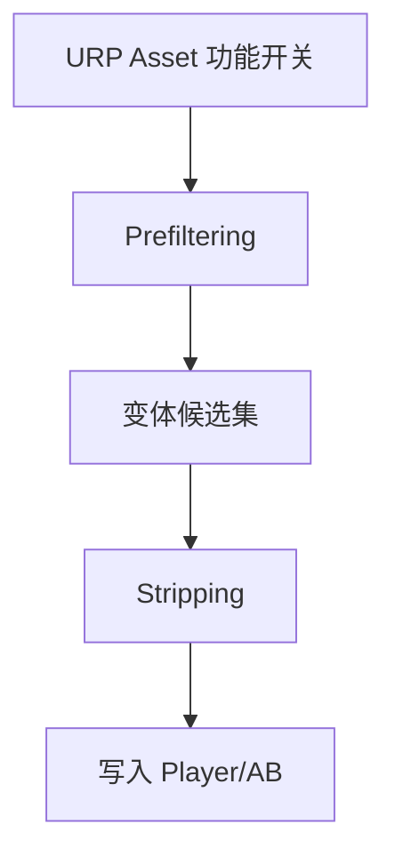
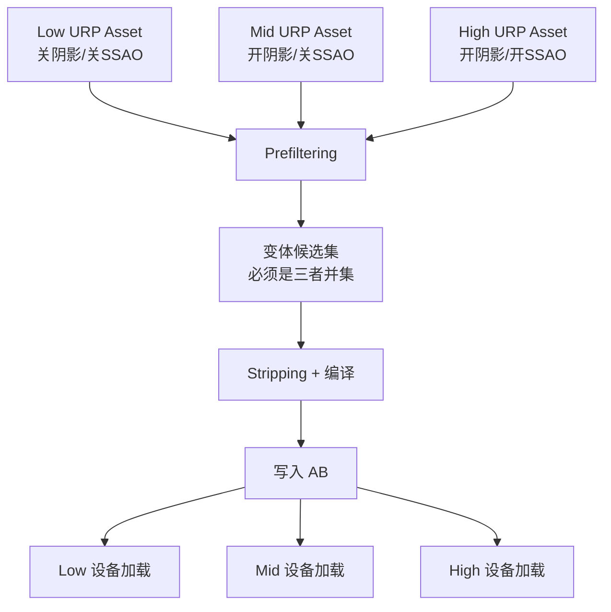

如果你的项目只有一个质量档、一个 URP Asset、一次 Player Build 包含所有内容——变体交付不会有太大问题，前面的文章已经覆盖了。

但大多数商业项目不是这个情况。典型的移动项目至少有两到三个质量档：低端机关阴影关 SSAO，高端机全开。每个档位对应一个不同的 URP Asset，功能开关不同，意味着 Prefiltering 后保留的变体集也不同。

问题就出在这里：

`AB 通常只构建一次，但它产出的变体集必须覆盖所有质量档的运行时需求。如果构建时的 Prefiltering 只反映了一个档位的配置，其他档位需要的变体就会被裁掉。`

这篇文章解决三个问题：构建时怎么确保变体并集、Shader 包怎么分、热更加了新功能怎么办。

## 一、问题的结构：为什么多档位会让变体交付变复杂

### 单档位的简单模型

只有一个 URP Asset 时，链路是线性的：

Prefiltering 依据的功能开关和运行时用的功能开关完全一致——不存在覆盖不足的问题。

### 多档位的复杂模型

三个档位时，链路变成：

关键约束是：**AB 只构建一次，但三种设备都要能正确渲染。** 如果候选集不是三者的并集，某些档位的设备会遇到变体缺失。

### 为什么 Player Build 不容易出这个问题

Player Build 时，Unity 会扫描 `Quality Settings` 里所有 Quality Level 引用的 URP Asset，取功能开关的并集做 Prefiltering。所以即使有三个档位，Player Build 自然会保留所有档位需要的变体。

但 AB Build 的行为不同——特别是 SBP（Scriptable Build Pipeline）路径下，Prefiltering 数据的收集方式和 Player Build 不完全一致。如果构建脚本没有正确触发 Prefiltering 数据更新，AB 的变体集可能只反映构建时"当前活跃"的那一个 URP Asset。

## 二、AB 构建时怎么确保变体覆盖所有档位

### 核心原则

`构建 AB 之前，必须确保所有目标质量档的 URP Asset 都参与了 Prefiltering 数据的生成。`

### 具体操作

**方式一：确保 Graphics Settings 和 Quality Settings 配置完整**

1. 打开 `Quality Settings`，检查每个 Quality Level 都关联了对应的 URP Asset
2. 打开 `Graphics Settings → Scriptable Render Pipeline Settings`，确认引用了默认的 URP Asset
3. Unity 在 Prefiltering 阶段会调用 `QualitySettings.GetAllRenderPipelineAssetsForPlatform` 收集所有 URP Asset 的功能开关，取并集

这是最简单也最可靠的方式。只要 Quality Settings 配置正确，无论 Player Build 还是 AB Build，Prefiltering 都会基于并集。

**方式二：构建脚本中显式触发 Prefiltering 更新（URP 14.0.11+）**

如果你的 AB 构建流程是独立的（不经过 `BuildPlayer`），需要在构建前手动触发 URP 的 Prefiltering 数据更新：

URP 14.0.11 引入了 `UpdateShaderPrefilteringDataBeforeBuild` 方法，它会遍历所有 Quality Level 的 URP Asset，更新每个 Asset 的 `m_Prefiltering*` 字段。在 AB 构建脚本的最前面调用它。

**方式三：SBP 路径中显式传入 globalUsage**

SBP 提供了 `ContentBuildInterface.GetGlobalUsageFromGraphicsSettings()` API，可以获取当前 Graphics Settings 的全局使用标记。确保这个值被传入 `CalculateBuildUsageTags`，让 AB 构建拥有和 Player Build 一致的全局裁剪信息。

### 常见陷阱

**陷阱一：CI 构建机的 Quality Settings 和开发机不一致**

如果 CI 机器上的 Unity 项目设置和开发机不同（比如某个 Quality Level 没有关联 URP Asset），CI 构建出来的 AB 变体集会和开发机构建的不一样。

**解决方式**：Quality Settings 和 Graphics Settings 应该提交到版本控制，CI 机器使用版本控制里的配置，不依赖本地设置。

**陷阱二：AB 构建脚本切换了当前 Quality Level**

有些构建脚本会在构建前切换 `QualitySettings.SetQualityLevel` 来模拟不同档位。但这不会改变 Prefiltering 的行为——Prefiltering 收集的是所有 Quality Level 的 URP Asset 并集，不是当前活跃的那一个。切换 Quality Level 对 Prefiltering 没有帮助，反而可能导致其他配置混乱。

**陷阱三：URP < 14.0.11 的 Prefiltering 数据过时**

在 URP 14.0.11 之前，Prefiltering 数据不会在 AB 构建前自动更新。如果上一次打开编辑器时活跃的 URP Asset 和构建目标不一致，`m_Prefiltering*` 字段可能是过时的。

**解决方式**：在构建脚本中手动加载每个 URP Asset 并调用 `EditorUtility.SetDirty` + `AssetDatabase.SaveAssets`，触发 Prefiltering 数据刷新。或者升级到 URP 14.0.11+。

## 三、Shader 包怎么分：跟档位拆还是全局共享

### 方案一：全局共享 Shader 包（推荐起步方案）

所有 Shader 和变体打进一个（或少量几个）Shader 包，所有档位共享。

**优点**：
- 简单——不需要按档位维护多套 Shader 包
- 不存在"用户切换档位后需要下载新 Shader 包"的问题
- 引用关系清晰——所有材质包依赖同一组 Shader 包

**缺点**：
- 包体更大——包含了所有档位的变体并集
- 低端机内存里会有高端机才用的 Shader 数据（但变体本身是懒加载的，未命中的变体不会被编译到 GPU）

**适用场景**：中小规模项目、档位差异主要在参数级别（分辨率/阴影距离）而非功能级别（有没有 SSAO/Decal）。

### 方案二：基础包 + 档位差异包

拆成两层：
- `shader-base` 包：所有档位都需要的基础变体（Forward 基础光照、基础阴影、UI 等）
- `shader-high` 包：仅高端机需要的额外变体（SSAO 路径、Decal 路径、Screen Space Shadows 等）

运行时根据设备档位决定是否加载 `shader-high` 包。

**优点**：
- 低端机不需要下载和缓存高端变体
- 减小低端机的首包或下载量

**缺点**：
- 需要准确识别哪些变体属于"高端专属"——这要求你对 URP 的 keyword 和功能开关的对应关系非常清楚
- 如果用户从低端档切换到高端档（比如换了新手机），需要额外下载 `shader-high` 包
- 维护成本更高

**适用场景**：大规模项目、档位之间有显著的功能差异（而不仅仅是参数差异）。

### SVC 要不要按档位建

无论用哪种打包方案，SVC 都建议**按档位分别建**：

- `SVC_Common`：所有档位共用的关键变体（基础光照、UI、粒子等）
- `SVC_High`：高端专属变体（SSAO on + shadow cascade + additional lights pixel 等组合）

按档位分 SVC 的好处不只是构建保留——更重要的是 WarmUp 可以按档位加载对应的 SVC，低端机不需要预热高端变体。

### Addressables/YooAsset 的 Group 策略

- 如果用全局共享方案：Shader 放在一个独立 Group，标记为 `Local`（跟首包走），所有材质 Group 依赖它
- 如果用差异包方案：基础 Shader 一个 Group（`Local`），高端 Shader 一个 Group（`Remote`），材质 Group 根据自身档位依赖对应的 Shader Group

关键原则：`Shader 包应该比它的使用者（材质包）先加载。` 如果材质包加载时 Shader 包还没到，材质会找不到 Shader。

## 四、热更加了新 Renderer Feature 怎么办

### 哪些变更会引入新变体轴

不是所有 URP 配置变更都影响变体。以下变更**会**引入新的 keyword 轴：

| 变更类型 | 新增 keyword | 影响 |
|---------|-------------|------|
| 添加 SSAO Feature | `_SCREEN_SPACE_OCCLUSION` | 所有受影响 Shader 的变体空间翻倍 |
| 添加 Decal Feature | `_DECAL_LAYERS` / `_DBUFFER_*` | Decal 相关路径全部新增 |
| 开启 Screen Space Shadows | `_MAIN_LIGHT_SHADOWS_SCREEN` | 阴影路径新增一个选项 |
| 从 Forward 切到 Forward+ | `_FORWARD_PLUS` | 光照路径完全改变 |

以下变更**不会**引入新变体轴（只是参数变化）：

- 调整 Shadow Distance / Shadow Cascade Count
- 调整 Render Scale
- 调整 Anti-Aliasing 质量
- 调整 Additional Lights Per Object Limit

### 已部署 AB 的兼容性判断

`如果新功能引入了新 keyword，已部署的 AB 里不可能有对应变体——因为构建时这个 keyword 根本不存在。`

这意味着：

- 开启新 Feature 后，已部署的 AB 材质会 fallback 到没有这个 keyword 的近似变体
- 视觉效果不会是"正确的新功能"，而是"像之前一样但可能有细微差异"
- 如果启用了 `Strict Shader Variant Matching`，会直接报错

### 解决方案

**方案一：重建并推送 Shader 包（推荐）**

1. 在新版本的 URP Asset 配置下重新构建 Shader AB
2. 通过热更推送新的 Shader 包到用户设备
3. 同时推送更新的 SVC（包含新 Feature 的关键变体）
4. 确保新 Shader 包在新 Feature 启用之前到达设备

**方案二：预留变体空间**

在项目规划阶段，预判未来可能开启的 Feature，在构建时就把它们的 keyword 包含进来（通过 SVC 显式登记或在构建配置里临时启用这些 Feature）。

缺点是预留的变体可能永远用不上，白白增大包体。适用于功能路线图比较确定的项目。

**方案三：Feature 只在大版本更新时启用**

不在热更中开启新 Feature，而是等到下一次完整版本更新（包含新的 Player Build + AB Build）时一起上线。这是最安全的方式，但灵活性最低。

### 关键原则

`任何涉及新 keyword 轴的功能变更，都应该当作一次"变体集变更"来对待——需要重新构建受影响的 Shader 包，不能只改 Remote Config。`

## 五、最小检查表

### 构建配置

- 所有目标质量档的 URP Asset 是否都在 Quality Settings 中关联？
- Graphics Settings 的 Pipeline Asset 引用是否正确？
- 构建脚本是否在 AB 构建前触发了 Prefiltering 数据更新（URP 14.0.11+）？
- CI 构建机的 Quality Settings / Graphics Settings 是否和版本控制一致？

### 打包策略

- Shader 包的打包方案是全局共享还是分档位？方案是否和项目规模匹配？
- SVC 是否按档位分组？WarmUp 是否只加载当前档位的 SVC？
- Shader 包是否先于材质包加载？依赖关系是否正确声明？

### 热更兼容

- 本次热更是否引入了新的 keyword 轴？
- 如果是，是否同步推送了重新构建的 Shader 包？
- 新功能是否在 Shader 包到达设备之后才被激活？

## 导读

- 下一篇：[多档位变体问题的排查与 CI 验证]()

## 官方文档参考

- [Shader variants and keywords](https://docs.unity3d.com/Manual/shader-variants-and-keywords.html)
- [Graphics Settings](https://docs.unity3d.com/Manual/class-GraphicsSettings.html)
- [ShaderVariantCollection](https://docs.unity3d.com/ScriptReference/ShaderVariantCollection.html)
