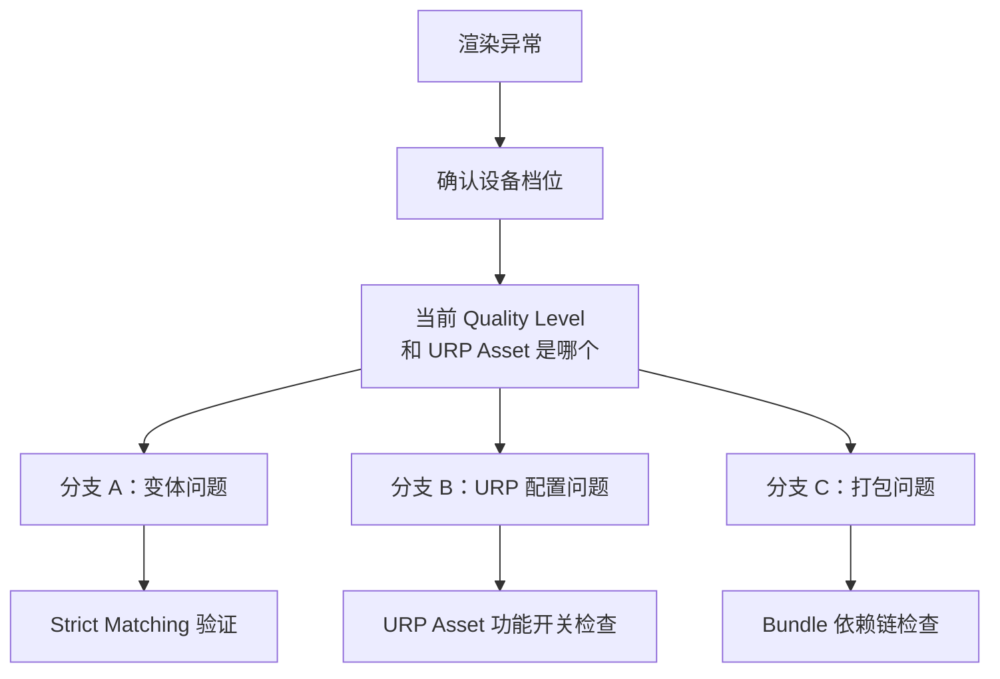
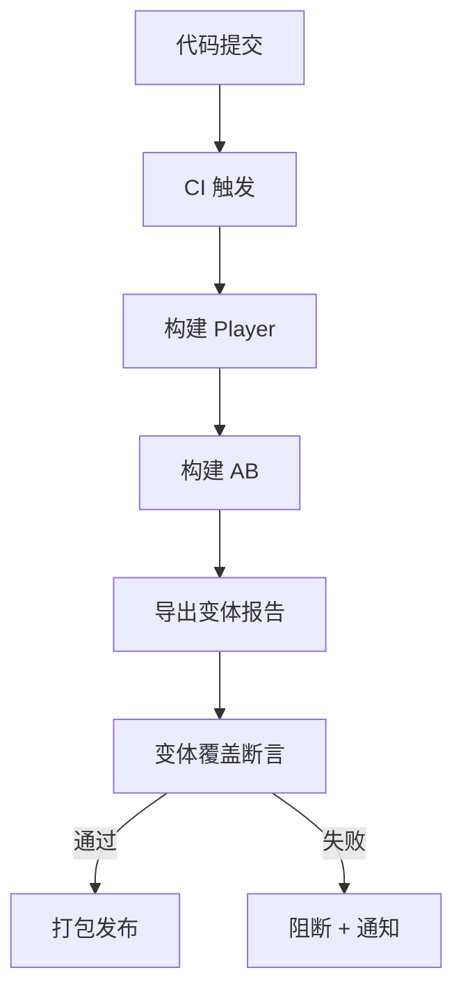

上一篇解决了"怎么做对"——多档位项目的变体交付策略。这篇解决"怎么验证"和"出了问题怎么定位"。

多档位项目的变体问题比单档位多了一个维度：同样的 AB 材质包，在不同档位的设备上可能表现不同。一个渲染异常可能是变体被裁了（构建问题）、URP Asset 配置不匹配（管线配置问题）、或者 Shader 包没加载（打包问题）。三种根因的现象几乎一样——阴影丢了、特效不对、材质粉了。

如果不按系统分层排查，团队会在三个方向之间来回猜，浪费大量时间。

## 一、统一排障流程：先定档位，再分三路



### 第零步：确认设备档位

在排查任何渲染问题之前，先确认这台设备运行的是哪个 Quality Level 和对应的 URP Asset。

- 在运行时日志中输出 `QualitySettings.GetQualityLevel()` 和当前生效的 `UniversalRenderPipelineAsset` 名称
- 如果项目有动态分档逻辑（根据设备性能自动选档），确认分档结果是否符合预期
- 记录下来，后续每一步排查都要基于这个档位

这一步看起来简单，但很多团队在排查时默认用"开发机的高端档"去推断"低端机的问题"，直接导致排查方向错误。

### 分支 A：变体是否存在

**症状**：材质粉了（Error Shader）、或者效果不对但不粉（fallback 到近似变体）。

**检查步骤**：

1. 在目标设备上开启 `Strict Shader Variant Matching`（Player Settings → Other Settings）
2. 重新打包，在目标设备上运行
3. 看日志（logcat / Xcode Console）是否有 Shader 变体匹配失败的错误
4. 如果有错误，记录缺失的 Shader 名称、Pass 名称和 keyword 组合

**定位根因**：

- 如果缺失的 keyword 和当前档位的 URP 功能开关相关（比如 `_SCREEN_SPACE_OCCLUSION`），回到构建配置检查：该 URP Asset 的功能是否在 Prefiltering 并集中
- 如果缺失的 keyword 是材质自身的 `shader_feature`（比如 `_NORMALMAP`），检查材质是否在 AB 构建的输入中，SVC 是否包含该组合
- 如果 keyword 是 `multi_compile` 声明的，理论上不会被裁——如果还是缺，检查是否有自定义 `IPreprocessShaders` 规则误删

### 分支 B：URP Asset 配置是否匹配

**症状**：材质不粉，变体也存在，但渲染效果和预期不同（阴影距离不对、光照质量不对、后处理效果消失）。

**检查步骤**：

1. 在运行时输出当前 URP Asset 的关键配置：`mainLightShadowsSupported`、`additionalLightsRenderingMode`、`supportsHDR`、挂载的 Renderer Feature 列表
2. 对比该档位预期的配置值
3. 特别注意：Renderer Feature 的 active 状态——即使 Feature 挂载了，如果 `isActive` 为 false，对应功能不会生效

**常见根因**：

- Quality Level 关联了错误的 URP Asset
- 动态分档逻辑选了错误的档位
- URP Asset 的某个功能开关在编辑器中被意外修改后提交了（参考 OnEnable 污染案例）
- Renderer Feature 因为 Remote Config 条件未满足而被关闭

### 分支 C：Shader 包是否已加载

**症状**：在 AB 加载后才出现渲染异常，纯 Player Build 正常。

**检查步骤**：

1. 检查材质引用的 Shader 是否在 `Always Included Shaders` 列表中
   - 如果在：Shader 由 Player 全局兜底，AB 不需要自带——这条分支不是问题来源
   - 如果不在：Shader 需要由某个 AB 包携带
2. 检查 Shader 所在的 AB 包是否已经加载
   - 用 Addressables 的 `OperationStatus` 或 YooAsset 的包状态 API 确认
   - 如果 Shader 包和材质包是分开的 Group，确认 Shader 包先于材质包加载
3. 检查 Shader 包的构建时间是否和 Player 构建一致
   - 如果 Shader 包是旧版本构建的，而 Player 是新版本构建的，`Always Included` 列表可能不一致，导致 Shader 归属混乱

**常见根因**：

- Shader 没进 Always Included，也没被任何 AB 包含——材质引用了一个没有交付源的 Shader
- Shader 包存在但没有被及时加载——材质包先加载了，引用到了空 Shader
- Shader 包和 Player 构建不一致——Always Included 列表变了，但 AB 没重建

## 二、跨系统问题速查表

| 现象 | 先查哪个系统 | 具体检查项 | 典型修复 |
|------|-----------|-----------|---------|
| 材质粉了，只在某个档位 | 变体 | 该档位的 URP Asset 功能开关是否在 Prefiltering 并集中 | 补 Quality Settings 的 URP Asset 关联 |
| 效果不对但不粉，所有档位 | 变体 | Strict Matching 是否报错；是否 fallback 到近似变体 | 补 SVC 或调整 keyword 声明 |
| 效果不对但不粉，特定档位 | URP 配置 | 该档位的 URP Asset 功能开关是否正确 | 修正 URP Asset 配置 |
| AB 加载后粉，Player Build 正常 | 打包 | Shader 是否在 Always Included 或 AB 中 | 加 Always Included 或确保 Shader 在 AB 依赖链中 |
| 首帧卡，只在某个档位 | 变体 WarmUp | 该档位的 SVC 是否覆盖了首帧变体 | 补充档位专属 SVC |
| 热更后新功能无效果 | 变体 + 打包 | 新 keyword 是否在已部署 AB 中 | 重建并推送 Shader 包 |
| CI 构建的包和本地构建效果不同 | 构建配置 | CI 的 Quality Settings / Graphics Settings 是否和版本控制一致 | 统一构建配置到版本控制 |

## 三、CI 怎么验证 AB 变体覆盖所有档位

### 变体覆盖矩阵的概念

```
AB 实际产出的变体集  ⊇  所有档位运行时需求的并集
```

如果这个包含关系不成立，就意味着某个档位的设备会遇到变体缺失。

### 怎么生成"每个档位需要的变体集"

**步骤一：用 IPreprocessShaders 导出变体报告**

在构建脚本中实现一个 `IPreprocessShaders`，把每次构建实际编译的变体导出为 JSON 报告：

```csharp
public class VariantReporter : IPreprocessShaders
{
    public int callbackOrder => 999; // 最后执行，拿到最终结果

    public void OnProcessShader(Shader shader, ShaderSnippetData snippet,
        IList<ShaderCompilerData> data)
    {
        foreach (var variant in data)
        {
            // 记录：shader名、pass名、keyword组合、平台
            ReportEntry.Add(shader.name, snippet.passName,
                variant.shaderKeywordSet, variant.shaderCompilerPlatform);
        }
    }
}
```

**步骤二：针对每个档位生成报告**

在 CI 脚本中，依次将每个 Quality Level 设为"当前活跃"（用于获取该档位的 URP Asset 配置），然后执行一次 AB 构建，收集变体报告：

```
# 伪代码
for tier in [Low, Mid, High]:
    set_active_quality_level(tier)
    build_ab()
    save_variant_report(f"variants_{tier}.json")
```

实际实现中不需要真的打三次包——可以在一次构建中通过 `IPreprocessShaders` 记录所有变体，然后用每个档位的 URP Asset 配置做模拟过滤，得出每个档位的"需求集"。

**步骤三：断言包含关系**

```python
# CI 验证脚本
actual_variants = load_json("variants_actual.json")
for tier in ["low", "mid", "high"]:
    required = load_json(f"variants_{tier}.json")
    missing = required - actual_variants
    if missing:
        fail(f"Tier {tier} missing {len(missing)} variants: {missing[:10]}")
```

### 集成到 CI 的位置



**关键点**：变体覆盖断言应该放在 AB 构建之后、打包发布之前。这是一个阻断性门禁——不通过不发布。

### 增量检查（降低 CI 成本）

每次都做全量变体对比成本很高。更实际的做法是：

1. 第一次做全量对比，生成基线报告
2. 后续每次构建只做增量检查：`本次产出的变体集`和`基线`做 diff，如果有变体减少则告警
3. 每次新增 Renderer Feature 或修改 URP Asset 配置时，重新生成基线

### 最小可行方案（不需要完整矩阵）

如果团队资源有限，最小可行的 CI 验证是：

1. 在 AB 构建后，用 `IPreprocessShaders` 导出变体总数
2. 和上一次成功构建的变体总数对比
3. 如果变体总数显著下降（比如减少超过 10%），自动告警

这不能精确到"哪个档位缺了什么"，但能捕捉到大多数意外裁剪事件（比如 URP Asset 被意外修改、Quality Settings 关联丢失等）。

## 四、常见误判

### "效果不对肯定是变体问题"

在多档位项目中，效果不对的原因可能是：
- 变体 fallback（变体问题）
- 当前 URP Asset 的功能开关本来就是关的（配置问题，不是 bug）
- Shader 包还没加载完（打包问题）

先确认档位和配置预期，再判断是不是 bug。

### "CI 跑通了就没问题"

CI 通常只验证一个构建目标（比如 Android + IL2CPP）。如果项目同时出 iOS 和 Android，两个平台的 Graphics API 不同（Vulkan vs Metal），变体集可能不同。CI 应该覆盖所有目标平台。

### "Player Build 没问题所以 AB Build 也没问题"

Player Build 天然包含所有 Quality Level 的变体并集。AB Build 的变体集取决于构建时的配置。两者的变体集可能不同——Player Build 正常不能证明 AB Build 也正常。

### "加了 Always Included 就不用管档位了"

Always Included 确实让 Shader 由 Player 全局兜底。但它使用 `kShaderStripGlobalOnly` 裁剪级别——`shader_feature` 的使用证据裁剪被跳过，变体数量会显著增大。如果所有公共 Shader 都走 Always Included，包体会膨胀。对于档位专属的 Shader（比如只有高端机用的特效 Shader），不应该放 Always Included。

## 五、最小检查表

### 排障时

- 是否先确认了设备当前的 Quality Level 和 URP Asset？
- 是否在目标设备上开启了 Strict Shader Variant Matching？
- 是否区分了三种根因（变体缺失 / URP 配置 / 包加载）？
- 是否对比了 Player Build 和 AB Build 的行为差异？

### CI 配置

- AB 构建后是否有变体覆盖断言？
- 变体报告是否覆盖所有目标平台（Android + iOS）？
- Quality Settings 和 Graphics Settings 是否在版本控制中？
- URP Asset 修改是否触发了变体基线重新生成？

## 导读

- 上一篇：[多档位项目的 Shader 变体交付策略]()

## 官方文档参考

- [Shader variants and keywords](https://docs.unity3d.com/Manual/shader-variants-and-keywords.html)
- [IPreprocessShaders](https://docs.unity3d.com/ScriptReference/Build.IPreprocessShaders.html)
- [Graphics Settings](https://docs.unity3d.com/Manual/class-GraphicsSettings.html)
