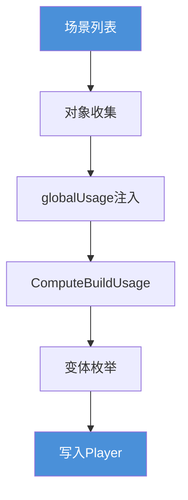
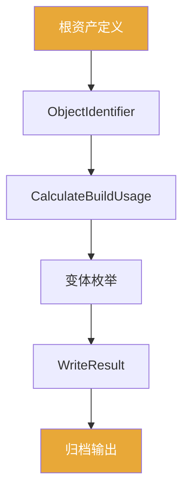

前面几篇已经把 `Shader Variant` 的保留依据、剔除层级和运行时命中拆过了。  
到了构建阶段，项目现场最常见的误判不是"不知道有 stripping"，而是：

`以为 Player Build 和 AssetBundle Build 对 variant 的处理方式是一样的。`

事实是，这两条链在输入结构、对象收集策略、usage 计算入口和最终交付边界上都有本质差异。  
把它们混着讲，会直接导致排查方向错误：明明 variant 在 Player 里存在，却以为 AB 里也一定有；或者反过来，因为 AB 里的 SVC 没生效，却去 Player 那边找原因。

这篇文章只做一件事：

`以对比为主线，把 Player Build 和 AssetBundle Build 在 shader variant 链路上的根本差异说清楚。`

主要对照的源码入口：

- `Editor/Mono/BuildPipeline.bindings.cs`
- `Editor/Src/BuildPipeline/BuildPlayer.cpp`
- `Editor/Src/BuildPipeline/BuildAssetBundle.cpp`
- `Editor/Src/BuildPipeline/AssetBundleBuilder.cpp`
- `Editor/Src/BuildPipeline/BuildSerialization.cpp`
- `Editor/Src/BuildPipeline/ComputeBuildUsageTagOnObjects.cpp`
- `Modules/BuildPipeline/Editor/Managed/ContentBuildInterface.bindings.cs`
- `Modules/BuildPipeline/Editor/Managed/WriteCommand.cs`
- `Modules/BuildPipeline/Editor/Public/ContentBuildInterface.cpp`

---

## 一、先给一句总判断

如果把两条链的本质差异压成一句话：

`Player Build 从"场景内容根"出发，通过全局 manager、scene manager、Resources、Always Included 四个入口收集对象，用 BuildUsageTagGlobal 叠加图形配置约束，最后以场景文件和 Player 资产文件为交付形态。AssetBundle Build 从"显式根资产"出发，通过 ObjectIdentifier 枚举和 GetPlayerDependenciesForObjects 展开依赖闭包，用 CalculateBuildUsageTags 对根对象和依赖对象分别计算 usage，最后以 WriteResult（含 serializedObjects、resourceFiles、externalFileReferences）为交付形态，再经 ArchiveAndCompress 归档。`

两条链共享同一个对象级 usage 转换核心（`ComputeBuildUsageTagOnObjects`），但喂进去的对象集合、全局 usage 条件的来源，以及最终写出的文件结构，都有本质差异。

**Player Build 链路：**



**AB Build 链路：**



---

## 二、顶层输入结构不同

### Player Build

最上层入口是 `BuildPlayerOptions`，字段包括：

- `scenes`：内容根，但不是完整输入集合
- `target / subtarget / options`：不只是平台信息，从 usage 阶段就开始影响 variant
- `extraScriptingDefines`
- `assetBundleManifestPath`：说明 Player 构建入口并不完全孤立于 Bundle 边界

其中 `target / subtarget` 的影响不是最后才介入的——它们会改变 `BuildTargetSelection`，进而影响 `BuildUsageTagGlobal` 怎样被图形设置修剪。

### AssetBundle Build

最上层入口是 `BuildAssetBundlesParameters`，字段包括：

- `outputPath`
- `bundleDefinitions`
- `options`
- `targetPlatform`
- `subtarget`

每个 bundle 的定义是 `AssetBundleBuild`：

- `assetBundleName / assetBundleVariant`
- `assetNames`：只是显式根资产，不是最终对象清单
- `addressableNames`

### 差异：起点的粒度不同

Player Build 的起点是"场景路径"——一个相对宏观的内容容器。  
AB Build 的起点是"资产路径列表"——更小粒度的显式根资产声明。

但这里有一个容易误判的地方：

`粒度更小不代表覆盖范围更可控。`

Player Build 的场景虽然看起来粗，但 Unity 会从场景往外自动覆盖全局 manager、Resources、Always Included 三个额外来源。AB Build 的起点虽然明确，但如果依赖闭包里有 shader，它是否被正确带入 usage 链，取决于 `GetPlayerDependenciesForObjects` 能不能枚举到它。

---

## 三、对象收集策略的差异：四路汇入 vs 根资产展开

### Player Build：四路来源汇入对象闭包

顺着 `BuildPlayer.cpp` 和 `BuildSerialization.cpp`，Player Build 的对象来源至少有四组：

**1. 全局 managers**

`CompileGlobalGameManagerDependencies(...)` 遍历 `ManagerContext::kGlobalManagerCount`，用 `ShouldWriteManagerForBuildTarget(...)` 判断当前目标平台，对允许带资产依赖的 manager 调 `collector.GenerateInstanceID(...)`。

全局 manager 本身及其依赖，是 variant 决策链的一部分，和场景内容无关。

**2. 场景 managers 和场景对象**

`CompileGameScene(...)` 调用 `CalculateAllLevelManagersAndUsedSceneObjects(scene, allSceneObjects, ...)`，拿到 `WriteDataArray allSceneObjects`，然后排序（`std::stable_sort`）和线性化（`LinearizeLocalIdentifierInFile`）。

**3. Resources 路径对象**

`BuildSerialization.cpp` 里有 `CollectPlayerOnlyResourceList(...)`，单独收集 `Resources` 路径下的对象依赖。

**4. Always Included Shaders 及其依赖**

通过 `GraphicsSettings::GetReferencedShaders()` 等路径整理出来，在 `BuildPlayerData` 里以 `alwaysIncludedShaderAssets` 的形式显式参与 usage 和写出。

四路汇入后，再通过 `GameReleaseCollector` 展开成递归依赖闭包 `allObjects`。

### AB Build：根资产 -> ObjectIdentifier -> 依赖闭包

AB Build 在 `ContentBuildInterface.cpp` 这层开始从"资产路径"切换到"对象标识"。

**第一步：GetPlayerObjectIdentifiersInAsset**

根据 GUID 找到 asset path，枚举文件里的 `fileID + type`，过滤 `ObjectIsSupportedInBuild(...)`，输出 `ObjectIdentifier`（包含 GUID、localIdentifierInFile、fileType、filePath）。

注意：`GetPlayerObjectIdentifiersInAsset(...)` 明确不接受 scene asset，传 scene 会报错。这说明普通 asset bundle 和 scene bundle 在更底层就是两条不同的写出链。

**第二步：GetPlayerDependenciesForObjects**

把根对象扩成依赖闭包。在 `BundleBuildUtil.cs` 里：先拿 `objectsInAsset`，再拿 `dependenciesInAsset`，再合成 `allObjects`。

### 差异：是否包含全局来源

Player Build 的对象闭包天然包含全局 manager、Resources 和 Always Included。这些来源与场景无关，但会直接影响 usage 计算结果。

AB Build 的对象闭包只来自显式根资产和它们的依赖。`Always Included Shaders` 不会自动注入进来。

这是两边 variant 集合产生差异最根本的结构原因之一。

---

## 四、usage 计算入口的差异：全局条件来源不同

两条链最终都会调到 `ComputeBuildUsageTagOnObjects`，但全局 usage 条件的来源和组装方式不同。

### Player Build：图形设置提前写进 globalUsage

在 `CompileGlobalGameManagerDependencies`、`CompileGlobalDependencies`、`CompileGameScene` 三个阶段，都会先执行：

```
GetGraphicsSettings().EditorOnly().ApplyShaderStrippingToBuildUsageTagGlobal(globalUsage);
```

这句话的含义是：图形设置不是只在最后 stripping 才生效，它会提前把全局裁剪条件写进 `BuildUsageTagGlobal`，后面的对象 usage 计算是带着这个前提一起做的。

`globalUsage` 里的字段至少包括：

- `m_LightmapModesUsed`、`m_LegacyLightmapModesUsed`、`m_DynamicLightmapsUsed`
- `m_FogModesUsed`
- `m_ForceInstancingStrip`、`m_ForceInstancingKeep`
- `m_BrgShaderStripModeMask`
- `m_HybridRendererPackageUsed`
- `m_BuildForLivelink`、`m_BuildForServer`
- `m_ShadowMasksUsed`、`m_SubtractiveUsed`

### AB Build：globalUsage 由 CalculateBuildUsageTags 单独算出

AB Build 里，`ContentBuildInterface.cpp` 的 `CalculateBuildUsageTags(...)` 会创建 `BuildTagCalculator`，然后：

```
AddObjectsByObjectIdentifiers(objectIDs, true)
AddObjectsByObjectIdentifiers(dependentObjectIDs, false)
Calculate(usageCache)
```

这里有一个关键细节：根对象（`objectIDs`）和依赖对象（`dependentObjectIDs`）在语义上是分开传入的。`dependentObjectIDs` 主要作为计算上下文参与遍历，不是和根对象完全等价地落表。

这也是为什么在 shader bundle / material bundle 的测试场景里，往往要把另一个 bundle 的对象 id 当成 dependent objects 传进去，才能算出正确的 usage。

### 共用的对象级转换核心

两条链都会经过 `ComputeBuildUsageTagOnObjects`，处理的对象类型也完全一样：

- `Material`
- `ShaderVariantCollection`
- `Terrain`
- `Renderer`
- `TerrainData`
- `ParticleSystem`
- `ParticleSystemRenderer`
- `VisualEffectAsset`
- `VisualEffect`

对应的处理函数包括 `ComputeMaterialShaderUsageFlags`、`ComputeShaderVariantCollectionShaderUsageFlags`、`ComputeTerrainShaderUsageFlags` 等。

AB Build 里还有 `BuildUsageCache` 的缓存机制（`m_VisitedShaderUsages`、`m_ShaderUsageMap`、`m_ShaderVertexComponentsCache` 等），避免对同一 `<shader, keywordString>` 重复计算。

### 差异：globalUsage 的注入方式不同

Player Build 的 globalUsage 由 `ApplyShaderStrippingToBuildUsageTagGlobal` 在构建早期直接注入图形设置。

AB Build（传统路径）的 globalUsage 同样会经过 `ApplyShaderStrippingToBuildUsageTagGlobal` 注入（`AssetBundleBuilder.cpp` 第 224 行）。SBP（Scriptable Build Pipeline）路径则通过 `ContentBuildInterface.GetGlobalUsageFromGraphicsSettings()` 公开 API 获取图形设置，再传入 `CalculateBuildUsageTags`。

两条路径最终都会拿到图形设置，但注入方式和时机不同。如果使用自定义构建管线且没有正确调用这些 API，globalUsage 可能缺少图形设置的约束，导致两边 stripping 结果不一致。

---

## 五、Always Included Shaders 的地位差异

这是实践中最容易踩坑的一个点。

### 在 Player Build 里

`Always Included Shaders` 在 `BuildPlayerData` 里有独立的 `alwaysIncludedShaderAssets` 字段，作为显式参数传给 `ComputeBuildUsageTagOnObjects`：

```
ComputeBuildUsageTagOnObjects(allObjects, usedClassTypes, globalUsage, &assets, &alwaysIncludedShaderAssets, &allSceneObjects)
```

从 `BuildPlayer.cpp` 的相关逻辑看，`Always Included` 的资产会被识别成 `IsAlwaysIncludedShaderOrDependency`，走更偏全局保留的策略，而不是完全按场景 material usage 做 full stripping。

这就是为什么项目里会出现：场景里没直接打到，但放进 Always Included 就活了——因为它不走普通场景 usage 收缩那条线。

### 在 AB Build 里

`Always Included Shaders` 不会自动注入到 AB Build 的对象闭包里。AB Build 的对象来源只有根资产和它们的依赖。

**实际含义**：如果一个 variant 在 Player Build 里靠 `Always Included` 保活，在 AB Build 里不做任何额外处理，这个 variant 不会自动出现在对应的 bundle 里。

---

## 六、Scene Bundle 的特殊性：它更接近 Player 那条链

普通 asset bundle 和 scene bundle 不是同一套写出逻辑。

`WriteSceneSerializedFile(...)` 会额外接受 `scenePath` 和 `sceneBundleInfo`，并在写出前重新走：

```
OpenSceneForBuild
ProcessSceneBeforeExport
CalculateAllLevelManagersAndUsedSceneObjects
ComputeBuildUsageTagOnObjects(sceneObjectIDs, usedClassTypes, globalUsage, &buildAssets, NULL, &sceneObjects)
```

这条写出链比普通 asset bundle 更接近 Player Build 的场景处理逻辑。

但注意 `alwaysIncludedShaderAssets` 那个参数位传的是 `NULL`。也就是说，scene bundle 虽然走了类 Player 的收集流程，但 Always Included 注入这条路仍然不在 AB 侧。

---

## 七、写出结构和交付边界的差异

### Player Build 的输出

从 `BuildSerialization.cpp` 看，Player Build 的构建产物包括：

- `globalgamemanagers`
- `globalgamemanagers.assets`
- `sharedassetsN.assets`
- `resources.assets`
- split `Resources` 文件
- `Resources/unity_builtin_extra`

这些文件里的 shader 数据以平台程序数据的形式嵌入，不存在"外部引用"这种输出形态。

### AB Build 的输出

AB Build 的写出结果是 `WriteResult`，字段包括：

- `serializedObjects`
- `resourceFiles`
- `includedTypes`
- `includedSerializeReferenceFQN`
- `externalFileReferences`

最后由 `ArchiveAndCompress(...)` 把 `resourceFiles` 归档压缩成最终 bundle 文件。

### 差异：externalFileReferences 的存在

Player Build 不存在"只留外部引用"这种输出形态。AB Build 的写出结果里明确有 `externalFileReferences`。

**实际含义**：在 AB Build 里，"这个 shader 逻辑上属于这个 bundle"和"这个 shader 的平台程序数据真正写进了这个 bundle"是两件事。有时候 bundle 里只留了外部引用关系，而不是完整的 shader 实体数据。

这就是为什么 `Always Included`、Player 兜底和 bundle 交付边界的话题，总会在 Shader 问题上缠在一起——在 Player 里存在的东西，不代表在 bundle 里以同样形态存在。

---

## 八、stripping 层级的对比

两条链的 stripping 层次结构相似，但细节不同。

### Player Build 的 stripping 层次（以 graphics shader 为例）

1. `ShaderKeywordFilterUtilProxy::GetKeywordFilterVariants` 的 settings filtering
2. `ShaderVariantEnumerationUsage` 的 usage-based filtering
3. `ShouldShaderKeywordVariantBeStripped` 的 built-in 剥离
4. `ShouldPassBeIncludedIntoBuild` 的 pass 级过滤
5. `ShaderCompilerShouldSkipVariant` 的平台过滤
6. `OnPreprocessShaderVariants` 的脚本剥离

### AB Build 的 stripping 层次

1. 资源合法性过滤
2. settings filtering（`SettingsFilteredShaderVariantEnumeration`）
3. built-in stripping（`ShouldShaderKeywordVariantBeStripped`）
4. scriptable stripping（`OnPreprocessShaderVariants`、`OnPreprocessComputeShaderVariants`）

### 差异

Player Build 多了 `ShouldPassBeIncludedIntoBuild` 的 pass 级过滤和 `ShaderCompilerShouldSkipVariant` 的平台过滤这两层。AB Build 多了资源合法性过滤作为第一道门。

两边的 `OnPreprocessShaderVariants` 调用都存在，但触发时机和传入的 usage 上下文不同——因为 usage 的来源本身就不同（见第四节）。

---

## 九、两边不一致会出什么问题

把上面的差异整合起来，可以列出几类典型的不一致场景。

### 1. variant 在 Player 里有，在 bundle 里没有

最常见的原因有三个：

- 这个 variant 靠 `Always Included` 在 Player 里保活，但 AB Build 的对象闭包里没有对应的 shader 对象
- AB Build 的依赖闭包里没有能触发正确 usage 的 Material 或 Renderer，导致 `ComputeBuildUsageTagOnObjects` 算出来的 keyword 集合比 Player 那边少
- AB Build 的写出结果里这个 shader 只有 `externalFileReferences`，而不是完整的平台程序数据

### 2. SVC 在 bundle 里没生效

`ComputeBuildUsageTagOnObjects` 明确有 `ShaderVariantCollection` 分支。也就是说，SVC 仍然要进入对象到 usage 的转换链。

如果 SVC 对应的 `ObjectIdentifier` 没有被正确枚举进根对象或依赖对象，或者 SVC 的根资产在 AB Build 的 `assetNames` 里根本没有，它就不会参与 usage 计算。

### 3. AB Build 里 variant 被早死

与 Player 一样，`最后没了`不代表`打包时没带上`。  
AB Build 里的 variant 也可能死在 settings filtering 或 built-in stripping，而不是 `OnPreprocessShaderVariants`。  
排查时要顺着 `CalculateBuildUsageTags` -> `ComputeBuildUsageTagOnObjects` -> shader writer 链逐层确认。

### 4. globalUsage 不一致导致两边 stripping 结果不同

Player Build 里图形设置提前写进 `globalUsage`，会在 `ComputeBuildUsageTagOnObjects` 阶段提前收缩某些 variant 的 usage 条件。AB Build 里如果 `globalUsage` 的来源不同，同一批对象算出来的 usage 结果可能不一致，进而导致两边留下的 variant 集合不同。

---

## 十、两张账单对比

### 输入层

| 维度 | Player Build | AssetBundle Build |
| --- | --- | --- |
| 顶层入口 | `BuildPlayerOptions.scenes / target / subtarget / options` | `BuildAssetBundlesParameters.bundleDefinitions / targetPlatform / subtarget` |
| 根内容定义 | `scenes`（场景路径） | `AssetBundleBuild.assetNames`（显式根资产） |
| 对象枚举起点 | 场景对象 + 全局 manager + Resources + Always Included | `GetPlayerObjectIdentifiersInAsset` 产出 `ObjectIdentifier` |
| 依赖展开方式 | `GameReleaseCollector` 展开 `allObjects` | `GetPlayerDependenciesForObjects` 展开依赖闭包 |
| globalUsage 来源 | `ApplyShaderStrippingToBuildUsageTagGlobal` 提前注入图形设置 | 传统路径同样调用 `ApplyShaderStrippingToBuildUsageTagGlobal`；SBP 路径通过 `GetGlobalUsageFromGraphicsSettings()` API 获取 |
| Always Included 介入 | 显式参与 `ComputeBuildUsageTagOnObjects` | 不自动注入 |

### 处理层

| 维度 | Player Build | AssetBundle Build |
| --- | --- | --- |
| usage 计算入口 | `ComputeBuildUsageTagOnObjects(allObjects, ..., globalUsage, &assets, &alwaysIncludedShaderAssets, ...)` | `CalculateBuildUsageTags(objectIDs, dependentObjectIDs, globalUsage, usageSet)` |
| 对象级 usage 核心 | `ComputeBuildUsageTagOnObjects.cpp`（Material/SVC/Renderer/Terrain/Particle/VFX） | 同一套，但无 Always Included 参数；有 `BuildUsageCache` 缓存 |
| scene bundle 差异 | N/A | 走类 Player 的场景收集链，但 Always Included 传 NULL |
| compute shader | 不走 scene usage 主链，走 `ComputeShader::Transfer` | 同 Player |

### 输出层

| 维度 | Player Build | AssetBundle Build |
| --- | --- | --- |
| 主要输出文件 | `globalgamemanagers`、`sharedassetsN.assets`、`resources.assets` | `WriteResult`（serializedObjects + resourceFiles + externalFileReferences）+ 归档 bundle |
| 是否存在外部引用形态 | 不存在 | 存在（`externalFileReferences`） |
| shader 数据形态 | 平台程序数据嵌入资产文件 | 可能是实体数据，也可能只是外部引用 |
| 产物边界 | Player 交付物（含 Always Included 保活的 shader） | bundle 文件（Always Included 不自动进来） |

---

## 十一、最容易误判的 7 件事

**1. "Player 里有的 variant，bundle 里也一定有"**

不对。两边的对象闭包来源不同，Always Included 不自动注入 AB Build。

**2. "bundle 里的 shader 就是完整写入了"**

不一定。`WriteResult.externalFileReferences` 说明 bundle 也可以只留外部引用。

**3. "两边的 SVC 效果是一样的"**

SVC 在两边都要进 `ComputeBuildUsageTagOnObjects`。但如果 AB Build 的对象枚举没正确覆盖 SVC 对应的 `ObjectIdentifier`，SVC 就没资格参与 usage 计算。

**4. "AB Build 的 globalUsage 和 Player Build 里的一样"**

来源不同。Player 那边有图形设置提前注入；AB 那边由 `CalculateBuildUsageTags` 单独计算。

**5. "scene bundle 和普通 asset bundle 的 variant 处理逻辑是一样的"**

scene bundle 走 `WriteSceneSerializedFile`，有自己的对象收集流程，更接近 Player Build 的场景处理链。

**6. "没在 IPreprocessShaders 里删，variant 就一定留着"**

两边的 stripping 都分多层，`IPreprocessShaders` 是最后一层，前面的 settings filtering、built-in stripping 都会更早介入。

**7. "compute shader 和 graphics shader 的构建链是一样的"**

compute shader 不走 scene usage 主链，不经过 `ComputeBuildUsageTagOnObjects`，直接在 `ComputeShader::Transfer` 里做 variant stripping 和 compile。这在两条链里都一样。

---

## 官方文档参考

- [IPreprocessShaders](https://docs.unity3d.com/ScriptReference/Build.IPreprocessShaders.html)
- [Graphics Settings](https://docs.unity3d.com/Manual/class-GraphicsSettings.html)

## 十二、这篇文章真正想帮你建立什么判断

以后项目里再有人问：

`为什么这个 variant 在 Player 里有，在 bundle 里却缺？`

你可以顺着这条线去拆：

1. 这个 variant 在 Player 里是靠什么保活的——是场景 material usage，还是 Always Included？
2. 如果是 Always Included，AB Build 的对象闭包里根本没有对应来源
3. 如果是场景 material usage，AB Build 的根资产定义里有没有覆盖到对应的 Material 或 Renderer 对象
4. 如果有覆盖，`CalculateBuildUsageTags` 的根对象和依赖对象分离有没有导致 usage 算少了
5. 如果 usage 算对了，`WriteResult` 里的输出是 serialized data 还是 external reference

只有把这五步拆清楚，才能定位 variant 缺失的真正层级，而不是反复加 SVC 或调 stripping 回调试错方向。
