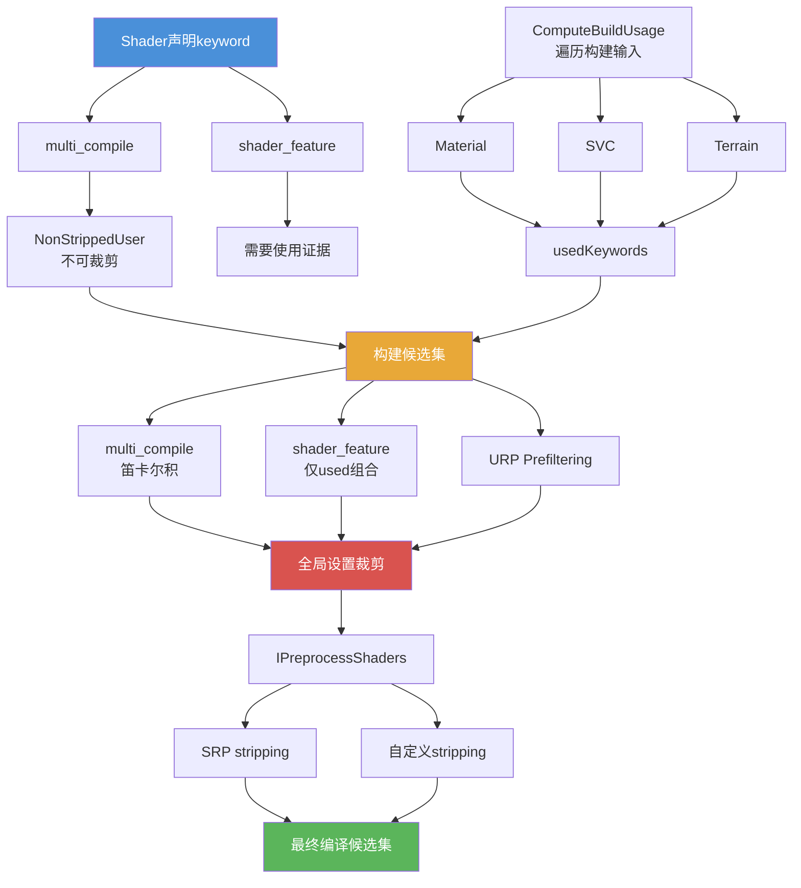

前面的文章讲了变体的保留依据有四方角色（Material、Scene、SVC、Always Included），也讲了变体的裁剪有四层（URP Prefiltering、Builtin Stripping、SRP Stripping、Custom IPreprocessShaders）。但中间最关键的一步一直是个黑盒：

`构建系统拿到这些"保留依据"以后，到底是怎么把它们变成"这次构建要编译哪些变体"的？`

如果这一步不拆开，很多现象就会一直让人困惑：

- 为什么材质里明明启用了某个 keyword，构建后对应变体却不在
- 为什么 `shader_feature` 和 `multi_compile` 声明的 keyword，在构建期命运完全不同
- 为什么 SVC 补了 keyword 组合，有时候管用、有时候不管用
- 为什么 Always Included 的 Shader 变体数量往往比普通 Shader 多

这篇从源码层把这条链追完整。

## 先给一句总判断

`构建系统把保留依据变成变体候选集，核心分两条线：multi_compile 的 keyword 无条件参与笛卡尔积枚举，shader_feature 的 keyword 只枚举材质和 SVC 实际提供了使用证据的组合。两者在最终的变体矩阵里相乘，再经过全局设置（雾、光照贴图、Instancing 等）过滤，才形成真正进入编译的候选集。`

## 一、先看数据结构：构建系统用什么装"使用证据"

### 1. BuildUsageTag：每个 Shader 的逐对象使用记录

源码位于 `Runtime/Serialize/BuildUsageTags.h`。

每个参与构建的 Shader 都有一份 `BuildUsageTag`，里面最关键的字段是：

以下为基于引擎行为的观测字段：

| 字段名 | 类型 | 行为描述 |
|--------|------|---------|
| shaderUsageKeywordNames | 字符串数组 | 从材质和 SVC 收集到的 keyword 组合列表 |
| shaderIncludeInstancingVariants | 布尔值 | 标记是否有材质启用了 GPU Instancing |

`ShaderUsageKeywordNames` 的底层类型是 `dynamic_array<core::string>`——一个字符串数组，每个元素是一组排序后的 keyword 名称（比如 `"_EMISSION _NORMALMAP"`），代表一种被实际使用的 keyword 组合。

这些 keyword 组合就是 `shader_feature` 变体的候选依据。

### 2. BuildUsageTagGlobal：构建级别的全局设置

同一个头文件里还有 `BuildUsageTagGlobal`，记录的是整个构建范围内的全局渲染设置使用情况：

以下为基于引擎行为的观测字段：

| 字段名 | 类型 | 行为描述 |
|--------|------|---------|
| m_LightmapModesUsed | 整型位掩码 | 记录哪些 Lightmap 模式被场景使用了 |
| m_LegacyLightmapModesUsed | 整型位掩码 | 记录旧版 Lightmap 模式的使用情况 |
| m_DynamicLightmapsUsed | 整型位掩码 | 记录动态 Lightmap 的使用情况 |
| m_FogModesUsed | 整型位掩码 | 记录哪些雾模式被使用了（Linear/Exp/Exp2） |
| m_ShadowMasksUsed | 布尔值 | 标记是否有场景使用 Shadow Mask |
| m_SubtractiveUsed | 布尔值 | 标记是否用了 Subtractive 光照 |
| m_ForceInstancingStrip | 布尔值 | 标记是否强制裁掉 Instancing 变体 |
| m_ForceInstancingKeep | 布尔值 | 标记是否强制保留 Instancing 变体 |

这些标记会在后续的 Builtin Stripping 阶段使用——如果构建中没有任何场景使用了 Exp2 雾，那么所有 `FOG_EXP2` 变体都会被裁掉。

### 3. BuildUsageCache：避免重复计算的缓存

源码位于 `Modules/BuildPipeline/Editor/Public/BuildUsageCache.h`。

它维护了一个已访问的 `<ShaderID, keywordString>` 对集合，确保同一个 Shader 的同一个 keyword 组合只被处理一次。

## 二、ComputeBuildUsageTagOnObjects：谁在收集使用证据

源码位于 `Editor/Src/BuildPipeline/ComputeBuildUsageTagOnObjects.cpp`。

这个函数是整条收集链的入口。它遍历所有参与本次构建的对象，按类型提取 Shader keyword 使用信息。

### 1. 处理顺序有讲究

源码中定义了一个优先处理的类型列表：

```text
以下为基于引擎行为的推断伪代码：

gTypeOrder[] 优先处理顺序 = {
    Material,
    ShaderVariantCollection,
    Terrain
}
（不在此列表中的类型在这三者之后处理）
```

Material 最先处理，然后是 SVC，然后是 Terrain，最后才是其他类型。这个顺序保证了 keyword 使用面的收集是从最直接的来源开始的。

### 2. 从 Material 提取 keyword 使用

这是最核心的路径。当遍历到一个 Material 时，调用 `UpdateShaderUsageTagRecursive`：

- 获取这个 Material 引用的 Shader
- 从 Material 的 keyword 状态（`material->GetShaderKeywordState()`）中提取当前启用的 keyword
- 用 Shader 的 keyword space 把状态转换成排序后的 keyword 名称字符串
- 插入到 usage set 中

然后调用 `BuildUsageCache::UpdateShaderFeatureUsage`，这个函数内部会调用真正的核心函数 `GetShaderFeatureUsage`（位于 `Runtime/Shaders/GpuPrograms/ShaderSnippet.cpp`）：

```text
以下为基于引擎行为的推断伪代码：

function GetShaderFeatureUsage(shader, materialKeywords, inoutUsage):
    // 第一步：收集 Shader 所有 snippet 声明的全部 keyword 的并集
    keywords = 空的 keyword 状态
    for each snippet in shader.snippets:
        keywords = keywords UNION snippet.m_AllKeywordsMask

    // 第二步：和材质的 keyword 状态做交集
    //   只保留"Shader 自身声明了 且 材质也启用了"的 keyword
    keywords = keywords INTERSECT materialKeywords

    // 第三步：把交集结果转成排序后的 keyword 名称字符串，插入 usage set
    keywordString = shader.KeywordSpace.转为排序名称(keywords)
    inoutUsage.insert(keywordString)
```

这里有一个关键细节：**交集操作**。不是材质启用的所有 keyword 都会被收集，而是只收集"Shader 自身声明了的且材质启用了的"keyword。如果材质启用了一个 Shader 根本不认识的 keyword，它会被忽略。

### 3. 从 SVC 提取 keyword 使用

当遍历到一个 ShaderVariantCollection 时，处理方式和 Material 类似：

- 调用 `collection->GetShaderKeywordUsageForShader(shader, keywords)` 获取 SVC 为该 Shader 登记的所有 keyword 组合
- 同样通过 `BuildUsageCache::UpdateShaderFeatureUsage` 插入 usage set

SVC 的 keyword 组合和 Material 的 keyword 组合最终进入同一个 usage set——它们是**并集**关系，不是替代关系。

### 4. 从 Terrain 提取 keyword 使用

Terrain 比较特殊。它会调用 `terrain->CollectInternallyCreatedMaterials()` 收集 Terrain 内部自动生成的材质，然后对每个材质走和普通 Material 一样的流程。

如果 Terrain 配置了 GPU Instancing 绘制树木和草地，还会强制设置 `SetEnableInstancingVariants(true)`。

### 5. 其他对象类型

- Renderer（MeshRenderer / SkinnedMeshRenderer）：主要收集 Mesh Channel 使用信息，不直接贡献 keyword
- ParticleSystem / ParticleSystemRenderer：收集粒子系统特有的使用标记
- VisualEffectAsset / VisualEffect：收集 VFX Graph 的使用标记

## 三、shader_feature 和 multi_compile 在构建期的根本差异

这是整篇文章最关键的一节。

### 1. 差异从 pragma 解析就开始了

源码位于 `Tools/UnityShaderCompiler/Utilities/ShaderImportUtils.cpp`。

当 Shader 编译器解析 `#pragma` 声明时，`multi_compile` 和 `shader_feature` 走的是同一个解析入口，但有一个关键分叉：

```text
以下为基于引擎行为的推断伪代码：

// 在 ShaderImportUtils.cpp 的 pragma 解析阶段
if variantType 是 multi_compile 或 (variantType 是 dynamic_branch 且不是 surface shader 生成):
    将该 keyword 加入 m_NonStrippedUserKeywords 列表
// shader_feature 的 keyword 不会进入此列表
```

**只有 `multi_compile` 的 keyword 会被加入 `m_NonStrippedUserKeywords`。`shader_feature` 的 keyword 不会。**

这个列表的名字直接说明了它的含义：non-strippable user keywords——不会被使用证据裁剪的 keyword。

### 2. 数据结构上的差异

源码位于 `Editor/Src/AssetPipeline/ShaderImporting/ShaderVariantEnumeration.h`。

`ShaderVariantData` 结构体里，两种 keyword 都会进入 `m_UserGlobal` 或 `m_UserLocal` 数组（取决于有没有 `_local` 后缀）——这是声明层，两者没有区别。

但 `m_NonStrippedUserKeywords` 数组里只有 `multi_compile` 的 keyword。这个数组是构建期枚举逻辑的分水岭。

### 3. 枚举阶段的行为差异

源码位于 `Editor/Src/AssetPipeline/ShaderImporting/ShaderVariantEnumerationKeywords.cpp`。

当构建系统创建 `SettingsFilteredShaderVariantEnumeration` 时（`ShaderWriter.cpp`），会把 `m_NonStrippedUserKeywordsMask`（即 `multi_compile` keyword 的位掩码）传进去。

在 `ShaderVariantEnumerationUsage::PrepareEnumeration` 中，发生了关键分叉：

**对于 `multi_compile` keyword（在 NonStrippedUserKeywords 里的）：**
- 保留在笛卡尔积枚举中
- 所有声明的选项都会被枚举，无论有没有材质使用

**对于 `shader_feature` keyword（不在 NonStrippedUserKeywords 里的）：**
- 从笛卡尔积枚举中移除
- 改为只枚举材质和 SVC 实际提供了使用证据的组合（从 `m_UsedKeywords` 集合中取）

具体来说，该阶段的逻辑会遍历所有 keyword tuple，如果一个 tuple 里没有任何 `multi_compile` keyword，它就会被从枚举列表中删除——因为它全部由 `shader_feature` keyword 组成，应该完全由使用证据驱动。

### 4. 最终的变体数量公式

理解了这个分叉以后，最终的候选变体数量可以这样理解：

```
候选变体数 = (multi_compile 各维度的笛卡尔积)
           × (builtin keyword 的笛卡尔积)
           × (shader_feature 被材质/SVC 实际使用的组合数)
```

`multi_compile` 那边是乘法（所有组合），`shader_feature` 那边是加法（只有被使用的组合）。这就是为什么把一个本应是 `shader_feature` 的声明改成 `multi_compile` 会导致变体数量爆炸。

### 5. shader_feature 的一个隐含行为

源码中还有一个细节：

```text
以下为基于引擎行为的推断伪代码：

// 当 shader_feature 只声明了单个 keyword 时，自动补充空状态 "_"
if variantType 不是 multi_compile 且 curKeywords 只有 1 个元素:
    在 curKeywords 开头插入 "_"
// 即 shader_feature FOOBAR 等价于 shader_feature _ FOOBAR
```

如果 `shader_feature` 只声明了一个 keyword（比如 `#pragma shader_feature FOOBAR`），编译器会自动在前面插入一个 `_`（空状态）。这意味着 `shader_feature FOOBAR` 实际上是 `shader_feature _ FOOBAR`——关闭状态也是一个有效的变体。

`multi_compile` 不会做这个处理。`multi_compile FOOBAR` 就只有 `FOOBAR` 一个选项。

## 四、Always Included 为什么变体更多

### 1. 裁剪级别的差异

源码位于 `ShaderWriter.cpp`：

```text
以下为基于引擎行为的推断伪代码：

strippingLevel = 完全裁剪（使用证据 + 全局设置）

isAlwaysIncludedShader = 检查该 Shader 是否在 Always Included 列表中（含其依赖）
if isAlwaysIncludedShader:
    strippingLevel = 仅全局设置裁剪（跳过使用证据裁剪）
```

普通 Shader 使用 `kShaderStripFull`——同时应用使用证据裁剪和全局设置裁剪。

Always Included Shader 使用 `kShaderStripGlobalOnly`——**跳过使用证据裁剪，只做全局设置裁剪**。

### 2. 跳过使用证据裁剪意味着什么

`kShaderStripFull` 时，构建系统会用材质和 SVC 的使用证据来约束 `shader_feature` 的枚举（如第三节所述）。

`kShaderStripGlobalOnly` 时，这一步被跳过。`shader_feature` keyword 不再受使用证据约束——所有声明的组合都会被枚举，就像 `multi_compile` 一样。

这就是为什么 Always Included 的 Shader 变体数量通常比普通 Shader 多很多：`shader_feature` 的使用证据过滤被关闭了。

### 3. 源码注释的解释

`ShaderWriter.cpp` 中的注释说明了原因：

> Always Included Shader 的使用面过去无法通过分析场景对象来追踪，因为它们在 `AddBuildAssetInfoChecked` 阶段被跳过了。现在虽然已经可以追踪了，但引擎仍然保持了旧的行为——只基于全局使用情况来裁剪变体。

历史原因：Always Included Shader 曾经无法通过场景对象分析来追踪使用面，所以被设计为跳过使用证据裁剪。虽然现在已经可以追踪了，但行为没有改变。

## 五、BuildUsageTagGlobal 怎样约束全局候选空间

### 1. 全局设置裁剪的时机

全局设置裁剪发生在变体枚举完成之后、scriptable stripping 之前。入口是 `ShouldShaderKeywordVariantBeStripped`（`ShaderSnippet.cpp`）。

### 2. 裁剪了什么

这个函数根据 `BuildUsageTagGlobal` 的标记，裁剪以下类型的变体：

- **Lightmap 变体**：如果构建中没有场景使用 Baked Lightmap，所有 `LIGHTMAP_ON` 变体被裁掉。Directional Lightmap、Dynamic Lightmap、Shadow Mask 同理，各自根据对应的 `m_LightmapModesUsed` 位标记决定
- **Fog 变体**：如果没有场景使用 Exp2 雾，`FOG_EXP2` 变体被裁掉。Linear 和 Exp 同理
- **Instancing 变体**：根据 `m_ForceInstancingStrip` 和 `m_ForceInstancingKeep` 以及材质的 `shaderIncludeInstancingVariants` 决定
- **Stereo/XR 变体**：根据构建目标是否支持 VR 决定
- **DOTS Instancing 变体**：根据是否使用 Hybrid Renderer / Entities Graphics 决定
- **Editor Visualization 变体**：在 Player 构建中总是被裁掉

### 3. 和使用证据裁剪的关系

全局设置裁剪和使用证据裁剪是两个独立的层：

- 使用证据裁剪决定的是 `shader_feature` 的哪些 keyword 组合进入枚举
- 全局设置裁剪在枚举完成后，再逐个检查每个候选变体是否符合全局设置

两者共同作用，才得到最终进入编译的候选集。

`ShaderSnippet.cpp` 中的注释明确了这个关系：

> 常规的完全裁剪（kShaderStripFull）假设 usedKeywords 的决策已经在此代码之前完成，即由 `ShaderVariantEnumerationUsage.PrepareEnumeration` / `Enumerate` 处理。

## 六、构建日志的四个数字

当你在 Editor.log 里看到一个 Shader 的构建统计时，会看到四个数字（`ShaderWriter.cpp`）：

```
Full variant space:         N
After settings filtering:   N
After built-in stripping:   N
After scriptable stripping: N
```

对应的就是这条链上的四个截面：

| 数字 | 含义 | 对应阶段 |
|------|------|---------|
| Full variant space | 所有声明维度的笛卡尔积 | 理论最大值 |
| After settings filtering | URP Prefiltering + 使用证据枚举后的候选数 | shader_feature 过滤 + 设置过滤 |
| After built-in stripping | 全局设置裁剪后的数量 | 雾/光照/Instancing 裁剪 |
| After scriptable stripping | SRP + 自定义 IPreprocessShaders 裁剪后的数量 | 最终进入编译的数量 |

如果你发现第一个数字很大但第二个数字急剧下降，说明 `shader_feature` 的使用证据过滤在起作用——大量没有材质使用的组合被跳过了。

如果你发现第一个和第二个数字几乎一样大，可能的原因是：Shader 全用了 `multi_compile`（没有 `shader_feature` 可以过滤），或者 Shader 在 Always Included 列表里（使用证据过滤被跳过了）。

## 七、为什么"SVC 补了但还是没用"

理解了上面的链路以后，就可以解释很多项目常见的困惑。

### 场景一：SVC 补了 keyword 组合，但变体还是不在

可能的原因：

1. SVC 不在本次构建的输入中。SVC 必须作为构建资产被引用（放入 Addressables 的 Group、或者被场景引用、或者放入 Preloaded Shaders），否则 `ComputeBuildUsageTagOnObjects` 根本遍历不到它
2. SVC 里登记的 keyword 组合通过了使用证据枚举，但被后续的 URP Prefiltering 或 Builtin Stripping 裁掉了——使用证据只能帮你进入候选集，不能帮你通过后续的裁剪层
3. SVC 里登记的 keyword 组合和 Shader 声明的 keyword 不匹配——`GetShaderFeatureUsage` 会做交集，不认识的 keyword 会被忽略

### 场景二：材质启用了 keyword，但构建后变体不在

可能的原因：

1. 这个材质没有进入本次构建的输入。`ComputeBuildUsageTagOnObjects` 只遍历参与构建的对象——如果材质所在的场景没有被构建包含、或者 AssetBundle 的根资产定义没有覆盖到这个材质，它的 keyword 使用不会被收集
2. 这个 keyword 是 `shader_feature` 声明的，但 Shader 在 Always Included 列表里——这种情况下使用证据裁剪被跳过了，理论上所有组合都会被枚举，问题应该不在这一层
3. 这个 keyword 被 URP Prefiltering 判定为"当前配置不可能发生"，在更早的阶段就被过滤了

## 八、把这条链收成一张图



## 官方文档参考

- [IPreprocessShaders](https://docs.unity3d.com/ScriptReference/Build.IPreprocessShaders.html)
- [Shader variants and keywords](https://docs.unity3d.com/Manual/shader-variants-and-keywords.html)

## 这一篇真正想立住的判断

`shader_feature 和 multi_compile 的差异不是"名字不同"，而是在构建系统里走的是两条完全不同的路：multi_compile 的 keyword 无条件参与笛卡尔积枚举，shader_feature 的 keyword 只枚举被材质和 SVC 实际提供了使用证据的组合。这个分叉发生在 pragma 解析阶段（NonStrippedUserKeywords 是否收录），兑现在变体枚举阶段（ShaderVariantEnumerationUsage.PrepareEnumeration），比你能感知到的任何 stripping 回调都要早。`

`如果你的变体"莫名消失了"，不要先怀疑 stripping——先问一句：这条路径的使用证据，到底有没有被 ComputeBuildUsageTagOnObjects 收集到。`
