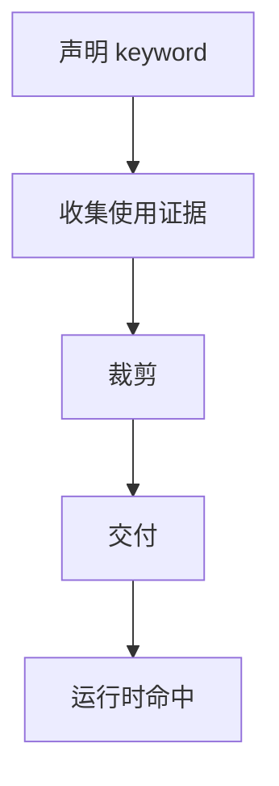
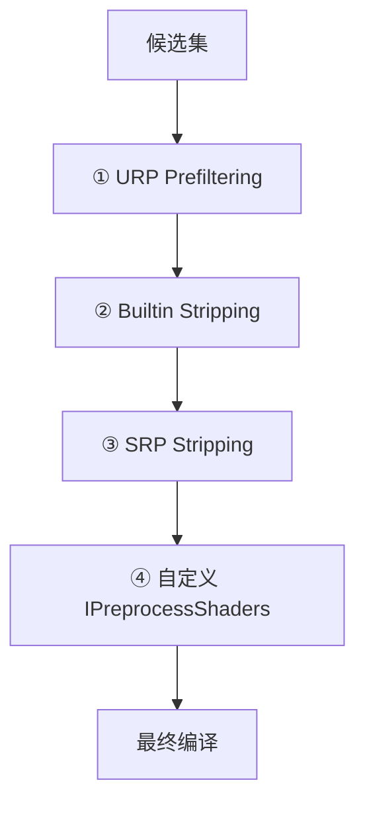
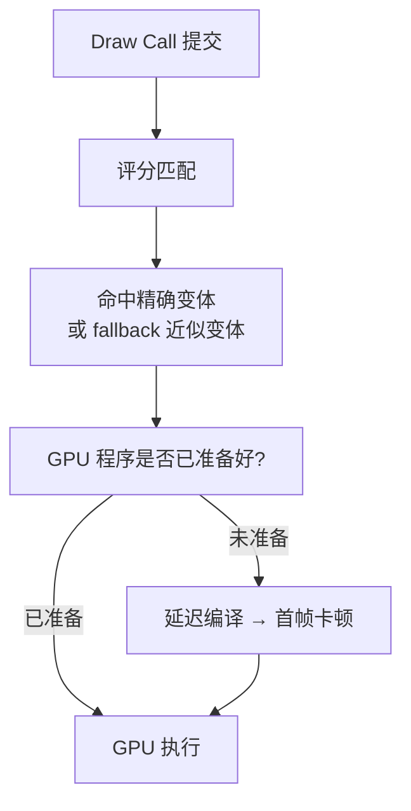

这篇文章是 Shader Variant 系列的总览。它不展开每个环节的细节，而是把完整链路按读者的认知顺序串起来，每个环节讲清楚"是什么"和"为什么"，然后给出深入链接。

如果你在项目里碰到了变体相关的问题，可以先从这篇定位问题在哪个阶段，再跳到对应的细节文章。

## 全链路概览



下面逐节展开。

---

## 一、什么是 Shader Variant，Unity 为什么要这样设计

GPU 和 CPU 的执行模型有一个根本差异：CPU 擅长分支跳转，GPU 不擅长。

GPU 把线程组织成 Warp（NVIDIA）或 Wave（AMD），一个 Warp 里的所有线程在同一时刻执行同一条指令。如果 Shader 代码里有 `if/else` 分支，且 Warp 内的线程走了不同的分支方向，GPU 必须把两个分支都执行一遍，再用掩码丢掉不该要的结果。这叫 **Warp Divergence**，代价很高。

Unity 的解决方式是：**在编译期就把不同的功能组合拆成独立的 GPU 程序**。每个程序对应一组特定的功能开关（keyword），运行时只需要选择正确的那份程序，不需要在 Shader 内部做分支判断。

`一个 Shader + 一组 keyword 状态 = 一个 Shader Variant（一份独立的 GPU 程序）`

这意味着一个 Shader 在构建后不是一份程序，而是一批程序。keyword 的组合数决定了变体的数量——如果有 3 组 keyword，每组 2 个选项，理论变体数就是 2 × 2 × 2 = 8 个。

> 深入阅读：[Shader Variant 到底是什么：GPU 编译模型与变体本质]()

---

## 二、变体从哪里来：谁在定义 keyword

变体的数量由 keyword 的声明方式和来源共同决定。keyword 不只是 Shader 代码里写的那几行，还有很多是管线和引擎自动注入的。

keyword 的来源分三类：

| 来源 | 示例 | 谁声明的 |
|------|------|---------|
| Shader 源码 | `#pragma multi_compile` / `#pragma shader_feature` | 开发者 |
| 管线注入 | 阴影、附加光、SSAO、Decal、Renderer Feature | URP/HDRP |
| 引擎内置 | `FOG_LINEAR`/`EXP`/`EXP2`、`LIGHTMAP_ON`、`INSTANCING_ON` | Unity 引擎 |

所有来源的 keyword 维度相乘，形成理论变体空间。

### multi_compile 和 shader_feature 的核心区别

这是整个变体系统最重要的设计决策，直接决定构建产物的大小：

- **`multi_compile`**：声明的所有 keyword 组合都会被编译，无论有没有材质在使用。适合运行时会动态切换的全局功能（如雾、质量档切换）
- **`shader_feature`**：只编译有材质或 SVC 提供了使用证据的 keyword 组合。没有证据的组合不会被编译。适合静态的材质功能开关（如法线贴图开关、自发光开关）

在构建系统的源码（`ShaderImportUtils.cpp`）中，`multi_compile` 的 keyword 会被加入 `NonStrippedUserKeywords` 列表（不可裁剪），`shader_feature` 的不会。这个分叉从 Shader 导入阶段就开始了。

> 深入阅读：[变体从哪里来：keyword 的六大来源]() · [构建系统怎样把保留依据变成变体候选集]()

---

## 三、构建时谁决定保留哪些变体

理论变体空间通常有成千上万个组合，不可能全部编译。构建系统需要回答：**这次构建到底要保留哪些变体？**

答案来自四个角色，它们各自提供不同类型的"保留依据"：

### 六个角色的职责边界

| 角色 | 做什么 | 不做什么 |
|------|--------|---------|
| **Material** | 提供最直接的 keyword 使用证据（`shader_feature` 的保留依据） | 不保证变体一定被保留（后续还有裁剪） |
| **SVC** | 补充场景里没直连的关键路径（和 Material 是并集关系） | 不是"放进去就一定有"的保险箱 |
| **Always Included** | 改变裁剪级别：让 Shader 由 Player 全局兜底，跳过使用证据裁剪 | 不是精确治理工具，会增大包体 |
| **URP Asset / Renderer Feature** | 决定哪些管线功能参与构建，Prefiltering 的直接依据 | 不提供逐材质的使用证据 |
| **Graphics Settings** | 提供全局裁剪前提（雾/光照/Instancing 等模式的使用情况） | 不控制逐 Shader 的变体保留 |
| **场景对象** | 通过引用 Material 间接贡献使用证据，同时贡献全局 Lightmap/Fog 模式 | 不直接声明 keyword |

### 关键机制：ComputeBuildUsageTagOnObjects

构建系统通过 `ComputeBuildUsageTagOnObjects`（源码位于 `Editor/Src/BuildPipeline/`）遍历所有参与构建的对象，按 Material → SVC → Terrain 的顺序提取 keyword 使用。核心函数 `GetShaderFeatureUsage` 做的是材质的 keyword 状态和 Shader 声明的 keyword 的**交集**——只收集"Shader 认识且材质启用了"的 keyword。

> 深入阅读：[保留与存活：四方角色和六道检查点]() · [SVC 是什么]() · [Always Included 为什么能修问题]()

---

## 四、构建时哪些层会裁掉变体

收集到候选集以后，变体还要经过四层裁剪。每一层有不同的裁剪依据和职责：



### 每层做什么

**① URP Prefiltering**（发生在枚举前）

URP 在构建开始前扫描所有 Quality Level 引用的 URP Asset，收集功能开关。如果某个功能没开（比如 Decal Layers 关闭），对应的 keyword 直接从枚举中移除——**连候选集都进不了**。

影响 Prefiltering 的关键配置：HDR、Main Light Shadows、Additional Lights、SSAO、Decal Layers、Forward+/Deferred 等。如果多个 Quality Level 引用了不同的 URP Asset，它们的功能开关取并集。

**② Unity Builtin Stripping**（发生在枚举后）

根据 `BuildUsageTagGlobal` 的标记逐个检查候选变体。如果没有场景使用 Exp2 雾，所有 `FOG_EXP2` 变体被裁掉。Lightmap 模式、Shadow Mask、Instancing、Stereo 同理。

**③ SRP Stripping**（通过 C# 回调）

URP/HDRP 的 `IPreprocessShaders` 实现。比 Prefiltering 更细粒度——可以检查具体的 keyword 组合是否合理，裁掉不可能同时启用的组合。

**④ 自定义 IPreprocessShaders**（项目自定义）

项目团队通过 `OnProcessShader` 回调添加的自定义规则。注意：**你在这个回调里看到的变体，是经过前三层存活下来的**。如果某个变体根本没出现在回调里，不代表它没被裁——可能是更早的 Prefiltering 就把它干掉了。

### 构建日志的四个数字

Editor.log 里每个 Shader 的构建统计会输出四个数字，对应这条链的四个截面：

| 日志标签 | 含义 |
|---------|------|
| `Full variant space` | 所有声明维度的笛卡尔积（理论最大值） |
| `After settings filtering` | URP Prefiltering + 使用证据枚举后 |
| `After built-in stripping` | 全局设置裁剪后 |
| `After scriptable stripping` | SRP + 自定义裁剪后（最终编译数量） |

> 深入阅读：[裁剪阶段详解：Prefiltering、Builtin、SRP、Custom 四层]() · [URP Prefiltering 专项]()

### 影响变体裁剪的关键配置项

在动手治理变体之前，先确认这些配置项的状态：

| 配置项 | 位置 | 作用 |
|--------|------|------|
| **Strip Unused Shader Variants** | URP Asset → General | 开启后 URP 根据管线配置裁剪不可能的变体。关闭则保留所有 URP 变体 |
| **Shader Variant Log Level** | URP Global Settings（Project Settings → Graphics） | 控制构建日志中变体统计的详细程度。设为 `AllShaders` 可看到每个 Shader 的四个数字 |
| **Strict Shader Variant Matching** | Player Settings → Other Settings | 开启后运行时不再静默 fallback，精确变体缺失会报错。排障时必开 |
| **Log Shader Compilation** | Player Settings → Other Settings | 开启后记录运行时首次编译的变体，用于定位首帧卡顿 |
| **Graphics APIs** | Player Settings → Other Settings | 每个图形 API 独立编译变体。多余的 API 会增加变体总量 |
| **Quality Settings 的 URP Asset 关联** | Quality Settings → Rendering | 每个质量档关联的 URP Asset 决定了 Prefiltering 的功能开关并集 |
| **Always Included Shaders** | Graphics Settings | 列表中的 Shader 使用 `kShaderStripGlobalOnly` 裁剪级别，变体数量通常更多 |
| **Preloaded Shaders** | Graphics Settings | 放入的 SVC 会在 Player 启动时自动 WarmUp，同时作为构建资产参与使用证据收集 |

---

## 五、运行时 Unity 怎么使用变体

构建完成后，存活的变体被写进 Player 或 AssetBundle。运行时，每次 Draw Call 需要选择一个变体交给 GPU。



### 评分匹配，不是精确查找

运行时查找变体用的是评分算法（源码位于 `LocalKeyword.cpp` 的 `ComputeKeywordMatch`）：

```
score = matchingCount - mismatchingCount × 16
```

- `matchingCount`：变体需要的 keyword 中，当前确实启用的数量（+1 分/个）
- `mismatchingCount`：变体需要的 keyword 中，当前没有启用的数量（-16 分/个）

不匹配的惩罚是匹配奖励的 16 倍——引擎强烈倾向于选择不需要额外 keyword 的变体。

### Fallback 和首帧卡顿

- 如果精确变体不存在，引擎会退化到得分最高的近似变体。画面不会粉，但效果可能不对
- 如果变体存在但对应的 GPU 程序尚未准备好，第一次使用时会触发延迟编译，造成一帧卡顿
- `ShaderVariantCollection.WarmUp()` / `WarmUpProgressively(int)` 可以在 Loading Screen 期间提前编译，避免首帧卡顿

> 深入阅读：[运行时命中机制：评分匹配、延迟加载与 WarmUp]() · [SVC 怎么收集、分组和回归]()

---

## 六、缺了变体会怎样，怎么定位

变体问题在项目里有三种典型表现，对应链路上的不同位置：

| 现象 | 含义 | 排查方向 |
|------|------|---------|
| 粉材质 / Error Shader | 完全没有可接受的变体 | 构建期保留 → 交付边界 |
| 效果不对但不粉 | 退化命中了 fallback 变体 | 精确变体是否被裁 → keyword 状态 |
| 首帧卡顿后续正常 | 变体在但未提前准备 | WarmUp 覆盖 → 时机 |

### 最短排查路径

1. 开启 `Player Settings → Strict Shader Variant Matching`，把退化命中变成明确的错误日志
2. 看日志，定位是哪个 Shader、哪个 Pass、哪组 keyword 缺失
3. 判断缺失发生在哪个阶段：是构建输入没覆盖、Prefiltering 删了、Stripping 删了，还是交付边界配错了
4. 对应修复：补 SVC、调 URP Asset 配置、修 Stripping 规则、或调整 Always Included

> 深入阅读：[变体排障速查：从现象到修复的最短路径]() · [变体缺失诊断流程]()

---

## 七、工程最佳实践

变体治理不是出了问题才做的事。以下是一条可执行的项目设置链：

| 步骤 | 做什么 | 为什么 |
|------|--------|--------|
| ① 审计 keyword | 检查所有 `multi_compile` 和 `shader_feature` 声明，修正不合理的 | 源头不对，后面全白做 |
| ② 检查管线配置 | 确保所有 Quality Level 的 URP Asset 功能开关覆盖实际需求 | Prefiltering 依赖这些配置 |
| ③ 设置 Always Included | 把全局公共 Shader（URP/Lit、后处理、UI）加入 Always Included | 避免 AB 加载后缺 Shader |
| ④ 分组建 SVC | 按入口（登录/主界面/战斗）创建 SVC，登记关键变体路径 | 保留 + 预热两用 |
| ⑤ 配置裁剪日志 | 实现一个只记日志不裁剪的 `IPreprocessShaders` | 先观测，再治理 |
| ⑥ 配置 WarmUp | 在 Loading Screen 期间调用 `WarmUp()` 或 `WarmUpProgressively(N)` | 消除首帧卡顿 |
| ⑦ 构建验证 | 开 Strict Matching + Log Compilation 跑关键流程 | 确认无遗漏 |

> 深入阅读：[变体实践：怎样确保项目的 Shader 变体被正确保留]() · [CI 监控]()

---

## 官方文档参考

- [Shader variants and keywords](https://docs.unity3d.com/Manual/shader-variants-and-keywords.html)
- [ShaderVariantCollection](https://docs.unity3d.com/ScriptReference/ShaderVariantCollection.html)
- [IPreprocessShaders](https://docs.unity3d.com/ScriptReference/Build.IPreprocessShaders.html)
- [Graphics Settings](https://docs.unity3d.com/Manual/class-GraphicsSettings.html)

## 系列导航

按阅读顺序，这个系列的完整文章列表：

**基础概念**
- [Shader Variant 到底是什么：GPU 编译模型与变体本质]()
- [变体从哪里来：keyword 的六大来源]()
- [为什么要有 Shader Variant：工程权衡与跨引擎对比]()

**构建期**
- [构建系统怎样把保留依据变成变体候选集]()
- [保留与存活：四方角色和六道检查点]()
- [构建账单：Player Build 与 AssetBundle Build 的差异]()
- [裁剪阶段详解：Prefiltering、Builtin、SRP、Custom 四层]()
- [URP Prefiltering 专项]()

**工具与治理**
- [SVC 是什么]()
- [SVC 怎么收集、分组和回归]()
- [SVC 覆盖率与 Keyword 使用契约]()
- [SVC vs Always Included vs Stripping 怎么选]()
- [Always Included 为什么能修 AssetBundle 的问题]()

**运行时**
- [运行时命中机制：评分匹配、延迟加载与 WarmUp]()

**AssetBundle 专项**
- [Shader 在 AssetBundle 里怎么存]()
- [为什么变体问题在 AssetBundle 上会爆发]()

**诊断与实践**
- [变体缺失诊断流程]()
- [变体排障速查：从现象到修复的最短路径]()
- [变体实践：怎样确保项目的 Shader 变体被正确保留]()
- [CI 监控]()

**案例**
- [案例：OnEnable 时序导致的管线状态污染]()
