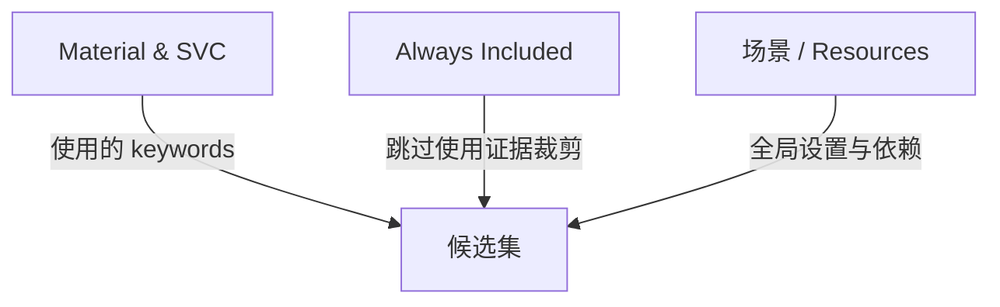
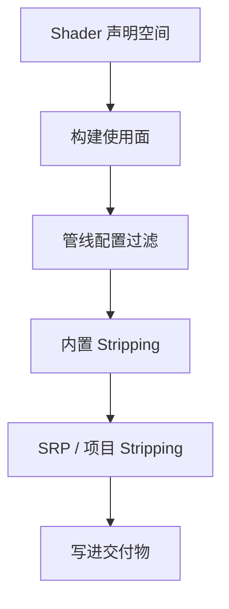

很多团队讨论 `Shader Variant` 时，最容易把两个不同层面的问题混在一起：

第一层：`Material / 场景 / SVC / Always Included` 到底各自在做什么，它们之间是并列关系还是分层关系？

第二层：一条 variant 从声明到最终留在目标构建里，到底要过哪几关？

这两个问题是同一件事的两面。

前者帮你搞清楚"谁在扮演什么角色、边界在哪"，后者帮你搞清楚"一条具体的 variant 沿着这条链能不能活下来"。

如果只搞清楚其中一面，现场排查时会一直卡着：

`这个 keyword 明明在 SVC 里，为什么最后构建里还是没有？`

`这个 shader 加到 Always Included 就好了，到底是为什么？`

`材质明明在场景里，这条路径应该有啊。`

这篇把两条线合并讲。先讲四方角色，再讲六关链路，最后给排查工具的对应关系。

---

## 一、四方角色：先分层，不要一上来当成同一类按钮

最稳的拆法是先把这四者分成两类。

**第一类：谁在告诉构建系统"这条路径真的会被用到"**

- `Material`
- 参与本次构建的 `Scene / Resources / Bundle 输入`
- `ShaderVariantCollection`

**第二类：谁在改变 shader 的归属边界**

- `Always Included Shaders`

所以这四者不是并列关系，更准确地说：

- `Material / 场景` 是默认使用面
- `SVC` 是显式补充的使用面
- `Always Included` 是更粗的一层全局交付策略

> 如果只留一句话，我会这样压：  
> `Material / 场景 / SVC` 更像在提供"这次构建为什么要保留这条路径"的依据，`Always Included` 更像在改变"谁来负责把这份 shader 带进交付物"的边界。

---

## 二、Material 和场景：默认的保留依据，站位最靠前

大多数 variant 能留下来，最普通的原因其实不是做了什么高级治理，而是：

`参与本次构建的材质和内容，本来就在真实使用这条路径。`

这层最容易被忽略的一个事实是：

`不是项目里存在的所有材质，都会自动成为这次构建的保留依据。`

真正有资格参与本次 build 判断的，通常是：

- 当前要构建进 `Player` 的场景对象
- `Resources` 里会被一并带入的对象
- 本次参与构建的 `AssetBundle / Addressables` 输入
- 构建链显式收集到的依赖对象

所以"场景里有材质"这句话，真正有效时，隐含条件其实是：

`这个场景和这个材质真的属于当前这次构建输入。`

如果不满足这个条件，常见误会就来了：

- 材质明明在项目里
- 编辑器里也能看到
- 但它没有参与这次 `Player` 构建
- 那它就未必会给这次构建贡献真实使用面

换句话说：

`Material / Scene` 解决的是"当前构建真实内容在用什么"，不是"项目理论上未来可能会用什么"。

---

## 三、SVC：补"默认输入看不到"的关键路径，不是替代整个世界

`ShaderVariantCollection` 最有价值的地方，不是"神奇地生成更多 variant"，而是：

`把项目显式关心的那批路径补进构建使用面。`

这类路径通常有几种典型来源：

- 首次进入关键场景时一定会命中的特效
- 不在默认场景里，但运行时一定会下载的活动内容
- 需要提前 `WarmUp` 的首屏或战斗入口
- 靠编辑器静态扫描很难自然覆盖到的 keyword 组合

所以 `SVC` 的位置，应该理解成：

`对默认材质 / 场景使用面的显式补充。`

它在工程上做的是两件事：

1. 让一些本来不容易被当前构建输入自然带出来的 keyword 组合，有机会进入保留判断
2. 让这些显式关心的路径，后续可以被分组、加载、预热和回归

### SVC 不是全流程保留通行证

这里要特别钉住一句话：

`SVC 提供的是显式保留依据，不是最终存在保证。`

哪怕你把一条路径登记进 `SVC`，它后面仍然可能出问题：

- 当前渲染管线配置觉得这条路径不可能发生
- URP 预过滤提前把它剪掉
- 后续 stripping 又把它删了
- 或者它最后没有进入正确的交付边界

所以 `SVC` 更像：

`我明确告诉构建系统，这条路径值得保留，请把它纳入正式讨论。`

而不是：

`从此以后它一定已经安全地存在于所有目标构建里。`

---

## 四、Always Included：它不是"更大的 SVC"，而是在改交付责任

`Always Included Shaders` 最容易被误解成"全局版 SVC"，但这不准确。

`SVC` 仍然是在说：

`项目显式关心哪些具体 variant 路径。`

而 `Always Included` 更像是在说：

`这份 shader 不再只由局部内容是否引用来决定，而是由 Player 全局负责把它带进去。`

它改变的核心不是"多了一份关键词清单"，而是：

`shader 的归属边界。`

所以当一个 shader 被放进 `Always Included` 时，工程含义更接近：

- 它不再完全依赖当前场景 / 当前 bundle 自己证明"我用到了哪些路径"
- 它被当成全局基础能力来处理
- bundle 侧很多时候只是在引用它，而不是自己再承载一整份 shader 本体

这也是为什么它经常表现得像一个强力止血按钮——因为它回答的问题其实已经不是"这条 variant 是不是被当前场景自然带到了"，而变成了"这份 shader 本身就由 Player 全局兜底了"。

如果一定要压成一句区分：

- `SVC` 更像精细保留关键路径
- `Always Included` 更像全局兜底 shader 归属

这两个不是替代关系，而是职责不同。

---

## 五、六关链路：一条 variant 到底要过哪几关

搞清楚四方角色之后，再来看一条具体 variant 沿着构建链能不能活下来。

按构建顺序摊开，链路更接近这样：

`Shader 声明可能空间 → 本次构建的使用面 → 渲染管线配置过滤 → Unity 内置 stripping → SRP / 项目 stripping → 写进正确交付物`

### 第一关：这条 variant 得先在"理论上存在"

最前面这关看的是：

`Shader 源码里到底有没有这条编译路径。`

如果一条路径根本没有被声明成 variant，那后面所有"保留"讨论都无从谈起。

这里至少要先分清三件事：

- `multi_compile` / `shader_feature` / `shader_feature_local` 这类声明，定义的是"可能的编译分叉"
- `Pass` 不同，variant 空间也不同
- 纯运行时参数改值，不等于新增了一条编译期 variant

所以一条 variant 最早不是从 `SVC` 开始的，而是从 `Shader 自己有没有把这条路径声明出来` 开始的。

### 第二关：它要进入"本次构建的真实使用面"

这一步对应前面讲的四方角色：

- 参与本次构建的 `Scene`、`Resources`、`AssetBundle` 里的材质提供默认使用面
- `SVC` 把显式关心的路径并进来
- `Always Included` 的 shader 走全局交付路径

最关键的判断是：

`不在本次构建输入里的内容，不会自动贡献它的 keyword 使用面。`

### 第三关：当前渲染管线得承认这条路径"有可能发生"

到了这里，问题就不再只是"项目有没有用到"，而变成：

`当前渲染管线配置，认不认这条路径在这次构建里是可能发生的。`

这一步在 URP 项目里尤其重要。URP 会根据当前 `Pipeline Asset`、`Renderer Feature`、图形 API、质量档和部分全局功能配置，提前把"不可能发生"的路径剪掉。

所以有些 variant 的死亡顺序其实是：

1. 材质或 `SVC` 的确让它进入了候选讨论范围
2. 但当前 URP 配置判断这条路径在这次构建里不可能发生
3. 于是它在更早的设置过滤阶段就被拿掉了

这也是很多人会误以为"是不是 OnProcessShader 把它删了"，但实际上问题发生得更早。

**Decal Layers 这类问题最典型**

`Decal Layers` 不是一个"把 keyword 写进 SVC 就稳了"的问题。它还依赖：

- 当前 `Renderer Feature` 是否真的启用了 `Decal`
- 是否启用了和 `Rendering Layers` 相关的那条路径
- 当前图形 API 是否支持这组路径
- 当前构建用到的 `URP Asset / Renderer` 是否把这组能力算进来了

如果这些前提里有一个不成立，那么即使把相关 keyword 记进 `SVC`，它也仍然可能被当成"这次构建里不可能发生的路径"，在更早的设置过滤阶段消失。

遇到这类问题时，第一反应不该是"是不是 SVC 没生效"，而应该先问：

`这次构建实际生效的 URP Asset / Renderer / Graphics API，到底承不承认这条路径存在。`

### 第四关：它还要过 Unity 自己的内置 stripping

哪怕一条 variant 已经进入候选集，后面还有一层更通用的内置剔除，看的是：

`按这次构建的全局渲染配置，这些内置路径是不是根本没必要保留。`

最典型的是：

- 雾效模式
- 光照贴图模式
- 阴影相关全局路径
- 编辑器专用路径
- instancing 的全局保留 / 强制剔除判断

这一层解释了一个常见误会：

`Always Included 不等于完全不剔除。`

更准确地说，`Always Included` 更像是不再按项目局部使用面做细粒度的保留判断，但仍然会按全局渲染配置做一轮更粗的剔除。所以它比普通路径更稳，但它并不是把这个 shader 的所有理论 variant 全部无脑塞进包里。

### 第五关：它还要过 SRP 和项目自己的 stripping

到了这一步，留下来的候选 variant 才会进入很多团队熟悉的那层：

`IPreprocessShaders`

这里需要特别钉住一个顺序：

`你在 OnProcessShader 里看到的，不是理论全集，而是前面几关已经活下来的那一批候选。`

如果一条 variant 前面就没有进入候选集，或者已经在 URP 的设置过滤里被判掉，或者已经在内置 stripping 里被拿掉，那你在自定义 `IPreprocessShaders` 里根本看不到它。

这层常见来源有两类：

- SRP 自己的 scriptable stripping
- 项目写的自定义 `IPreprocessShaders`

它们回答的是：

`前面都还活着的 variant，项目还想不想继续留。`

而不是：

`把前面已经判死的东西救回来。`

### 第六关：它得被写进正确的交付边界

就算一条 variant 通过了前面的构建判断，它还要落到正确的交付物里，问题才算真正结束。

这一步最容易在 `Player` 和 `AssetBundle` 之间出错。

因为"留下来"至少有两种不同含义：

- 留在 `Player` 全局里
- 留在某个独立 `AssetBundle` 自己负责的那部分里

这两种不是一回事。

例如：某个 shader 在 `Always Included` 里，那它更接近是 `Player` 全局负责提供，bundle 侧更像只持有引用。反过来，如果它不在 `Always Included` 里，那就更依赖这次负责交付它的 `Player / Bundle` 自己把相关 shader 代码和 variant 带齐。

所以一条路径"在 Player 构建里留住了"，不等于"在某个独立 bundle 构建里也留住了"。

这也是为什么 shader variant 问题一到 `AssetBundle`、热更新或多包型场景，就会陡然变复杂。

---

## 六、WarmUp 是另一层问题，不要混进"保留"讨论

很多讨论会把下面几件事混在一起：

- variant 根本没编进目标构建
- variant 编进去了，但第一次命中才加载
- SVC 在，但没正确加载或没 `WarmUp`

这三件事不是一层问题。

如果一条 variant 在前面的构建链路里就没留下来，那么后面的 `WarmUp` 再正确也没法把它凭空变出来。

`WarmUp` 回答的是：已经存在的 variant，要不要在更早、更可控的时机准备好。它不回答：这条 variant 到底有没有被编进来。

所以真正稳定的判断顺序一定是：

1. 先问它有没有留下来
2. 再问它有没有被正确交付
3. 最后才问它有没有被正确预热

---

## 七、在 Player 和 AssetBundle 场景里，四方角色的协作关系会不一样

### 纯 Player 场景里

更常见的链路是：场景和材质先贡献默认使用面，`SVC` 补关键路径，`Always Included` 兜全局基础 shader。这时问题相对容易理解，因为很多依赖都在同一条 `Player` 构建链里。

### AssetBundle / 热更新场景里

问题会立刻复杂一层。因为这时你要回答的不只是"这条路径该不该保留"，还要回答"它最后到底由 Player 负责，还是由这个 Bundle 自己负责"。

于是四者的职责会变成：

- `Material / 场景`：本次参与 build 的 bundle 内容真实在用什么
- `SVC`：补 bundle 静态输入看不到但运行时会走到的关键路径
- `Always Included`：把某些 shader 的责任重新推回 Player 全局
- stripping：继续根据配置和规则删掉"不需要"的部分

所以在 bundle 场景里，最容易出的问题不是"这些工具谁更强"，而是：

`现在到底是谁在负责带齐这份 shader 和它的关键路径。`

---

## 八、官方排查工具，分别对应哪一关

### 想看它有没有留到构建里，用 `Editor.log`

最直接的官方办法是构建后看 `Editor.log`，搜 `Compiling shader`。如果是 URP / HDRP，再打开 `Shader Variant Log Level`。

这组日志最适合回答：这条路径到底有没有活到构建产物生成阶段，也就是候选空间、配置过滤、内置 stripping、scriptable stripping 之后最终还剩多少。

### 想看运行时是不是第一次才编 GPU 程序，用 `Log Shader Compilation`

如果你怀疑问题不是"没保留"，而是"保留了，但第一次命中时才真正触发驱动侧编译"，那更推荐打开 `Log Shader Compilation`，用 Development Build 跑目标内容。

这不是"保留没保留"的同一层问题，但它能帮你避免把变体缺失、首次编译卡顿、预热时机不对这三件事继续混在一起。

### 想把"近似匹配"变成显式报错，用 `Strict Shader Variant Matching`

默认情况下，Unity 在运行时如果找不到精确 variant，会尽量找一个"最接近"的版本顶上。这对玩家有时比较平滑，但对排查来说反而会遮住真正的问题。

打开严格匹配后，Unity 会在找不到精确组合时直接报错，并给出对应 shader、pass 和 keywords。

这组信息特别适合回答：这条运行时真实请求的 variant，到底是不是根本没留住。

如果你们在做 variant stripping 回归，建议把这一项放进最小验证流程。

---

## 九、最常见的四种误会

### 1. "材质在项目里"就等于"材质参与了这次构建"

不是。只有真的进入当前 `Player / Bundle` 构建输入的内容，才会自然提供保留依据。

### 2. "SVC 里有"就等于"目标包里一定有"

不是。`SVC` 只是让这条路径进入正式讨论，后面还要过渲染管线配置、stripping 和交付边界。

### 3. "Always Included"就是"更大号的 SVC"

不是。`Always Included` 主要是在改 shader 的交付归属边界，不是在替你列一份更精细的 variant 清单。

### 4. "既然有 Always Included，就不需要 SVC 了"

也不是。`Always Included` 解决的是"这份 shader 要不要全局兜底"，而 `SVC` 解决的是"哪些关键路径需要显式保留和预热"。在认真做首载稳定性和内容分包治理的项目里，两者经常会同时存在。

---

## 十、两套判断问题，合并成一张图

### 当你不确定"谁该负责保留这条路径"时，问这四个问题

1. 这条路径是不是已经稳定地出现在本次构建输入的材质和场景里？
2. 如果没有，项目能不能用 `SVC` 把它显式补进来？
3. 这个问题本质上是在缺"关键路径清单"，还是在缺"全局兜底 shader"？
4. 这份 shader 最后应该由 `Player` 全局负责，还是由局部 bundle 自己负责？

### 当你遇到"这条 variant 为什么没了"时，按六关顺序压

1. 这条路径在 shader 里到底有没有被声明成 variant？
2. 它有没有进入这次构建的真实使用面？
3. 当前 `URP / SRP` 配置有没有把它提前判成"不可能发生"？
4. Unity 内置 stripping 有没有按全局配置把它裁掉？
5. SRP 或项目自定义 stripping 有没有把它删掉？
6. 它最后是不是被写进了正确的 `Player / AssetBundle` 边界？

只要这六问按顺序问，很多现场讨论会立刻从"为什么它又玄学地没了"变成"它到底死在哪一关"。

---

## 官方文档参考

- [ShaderVariantCollection](https://docs.unity3d.com/ScriptReference/ShaderVariantCollection.html)
- [GraphicsSettings](https://docs.unity3d.com/ScriptReference/Rendering.GraphicsSettings.html)
- [IPreprocessShaders](https://docs.unity3d.com/ScriptReference/Build.IPreprocessShaders.html)

---

## 结论

把这篇压成几句最有用的工程结论：

1. `Material / 场景` 是默认保留依据，定义"当前构建真实在用什么"。
2. `SVC` 是显式补充的保留依据，解决"默认输入看不到，但运行时确实重要"的关键路径；但它不是整条构建链的万能保留开关。
3. `Always Included` 不是更大的 `SVC`，它更像把 shader 的责任提升到 `Player` 全局兜底层；但它也不等于完全不剔除。
4. URP 项目里一定要把 `Pipeline Asset`、`Renderer Feature`、图形 API 和质量档放进同一张判断图里，因为很多 variant 在到达 `IPreprocessShaders` 之前就已经没了。
5. 官方给你的三种证据要分开用：`Editor.log` 看构建期保留结果，`Log Shader Compilation` 看运行时首次编译，`Strict Shader Variant Matching` 看精确 variant 是否缺失。
6. 真正稳的理解不是"这几个按钮谁更强"，而是：

`谁在提供保留依据，谁在承担交付责任，这条 variant 死在哪一关。`

---

延伸读这几篇会更顺：

- [ShaderVariantCollection 到底是干什么的：记录、预热、保留与它不负责的事]()
- [URP 的 Shader Variant 管理：Prefiltering、Strip 设置和多 Pipeline Asset 对变体集合的影响]()
- [为什么 Shader 加到 Always Included 就好了：它和放进 AssetBundle 到底差在哪]()
- [SVC、Always Included、Stripping 到底各自该在什么场景下用]()
- [Unity Shader Variant 运行时命中机制：从 SetPass 到变体匹配的完整链路]()
