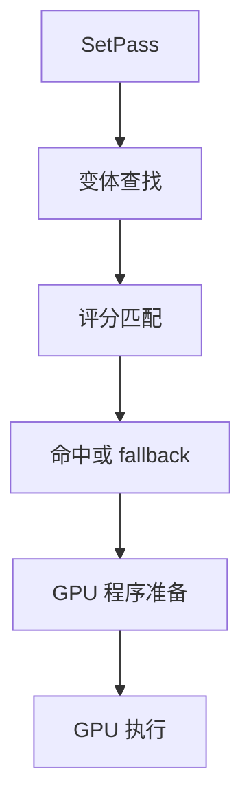

前几篇把 shader variant 的构建期行为讲清了：

- 哪些 variant 会被枚举生成
- 哪些会被 stripping 剔除
- Always Included、SVC、普通 bundle shader 分别走哪条构建路径

但有一类问题，构建期解释不了：

- 材质第一次出现时，即使 variant 存在，为什么还是会卡一下
- 有时材质不粉，但效果不太对，比预期少了一些 pass
- 某些情况下 variant 明明在包里，运行时却用了另一条路径
- `WarmUp` 调了，为什么有些平台还是首帧抖

这些问题都发生在**运行时命中阶段**，不在构建期。

所以这篇只讲一件事：

`Unity 在运行时是怎么找到要用的那条 shader variant 的。`

## 先给一句总判断

如果把整件事压成一句话：

`运行时 shader variant 命中，是一个从 SetPass 触发、经过 keyword 评分匹配、找到最佳子程序、再延迟加载 GPU 可用代码的过程；WarmUp 的作用，是提前把这个过程走一遍，让第一次真正渲染时不再临时做准备工作。`



## 一、命中的起点：SetPass

每当 Unity 提交一次 draw call，渲染系统需要确认这次 draw call 用哪个 shader、哪个 pass、哪组 keyword 状态。

这个过程的入口在 `Material::SetPass`，内部会走到 `ApplyMaterialPass`，核心链路是：

```
Material::SetPass
  → Pass::ApplyPass
    → ShaderState::ApplyShaderState
      → ShaderState::FindSubProgramsToUse
        → Program::GetMatchingSubProgram
          → m_Lookup 缓存查找 → 未命中 → FindBestMatchingSubProgram（评分匹配）
            → 找到最佳 variant → 延迟加载 blob
```

其中 `GetMatchingSubProgram` 内部有一层 `m_Lookup` 哈希表缓存：如果当前 keyword 状态已经命中过，直接返回缓存结果，不再重新评分。只有缓存未命中时才走 `FindBestMatchingSubProgram` 做评分匹配。

## 二、评分匹配：怎么找到"最佳" variant

运行时查找 variant，不是精确匹配——Unity 用的是评分算法。

每个 variant 的匹配分数计算规则如下（源码位于 `LocalKeyword.cpp` 的 `ComputeKeywordMatch` 函数）：

```
score = matchingCount - mismatchingCount × 16
```

其中：
- `matchingCount`：变体要求的 keyword 中，当前确实启用的数量（+1 分/个）
- `mismatchingCount`：变体要求的 keyword 中，当前没有启用的数量（-16 分/个）

注意：当前启用了但变体不要求的 keyword **不扣分**——惩罚是单向的，只惩罚"变体要了但当前没给"的情况。

Unity 会遍历同一个 pass 下所有可用 variant，选评分最高的那条作为本次使用的结果。

这个算法的工程含义是：

- 如果某个 keyword 组合的精确 variant 不存在，Unity 不会直接给粉材质，而是**退化到最近似的一条**
- `mismatchingCount` 的权重是 matchingCount 的 16 倍，所以"多余 keyword"的惩罚很重，但"完全没有某 keyword"也是 mismatch

这也解释了一些现象：

- 项目里缺了某个 keyword 组合的精确 variant，但材质不粉——因为退化到了相近的 fallback variant
- 效果略有异常但不明显——因为用了一条"凑合能跑"的 variant，而不是正确的那条
- 有时甚至效果差异很大——如果退化到的 variant 是一个差别较大的分支

## 三、延迟加载：为什么找到了还可能卡

`FindBestMatchingSubProgram` 找到目标 variant 后，并不意味着 GPU 立刻可以用它。

这条 variant 的 GPU 可用代码（shader blob）是**延迟加载**的——只有当它第一次真正被需要时，Unity 才去磁盘/内存里把这份二进制 blob 读出来，交给图形 API 做编译或转换。

这个过程在运行时是同步的，放在第一次 draw call 之前发生。

如果没有提前处理，就会产生非常典型的现象：

- 第一次进某个场景卡一下
- 第一次出现某个特效停顿一帧
- 之后重复出现就完全正常了

因为第一次触发了加载，后续直接走缓存。

## 四、WarmUp 的真实意义

`ShaderVariantCollection.WarmUp()` 做的事，就是在你主动调用的时机，提前把 SVC 里登记的所有 variant 的 blob 加载好，让 GPU 做好准备。

本质上等于：

`提前把第一次 draw call 时会临时做的那些工作，挪到你选定的时机做完。`

所以 WarmUp 的价值是：

- 消除首次命中时的冷启动卡顿
- 让 shader 准备成本落在可控时机（比如加载屏幕）而不是玩家第一次看到效果时

但有几点限制值得注意：

### WarmUp 的局限

**在 DX11 和 OpenGL 上**，WarmUp 效果最完整——blob 加载后驱动就基本准备好了。

**在 DX12、Vulkan、Metal 上**，驱动需要结合实际渲染状态（顶点布局、RenderTarget 格式等）才能完成最终的 PSO 编译。如果 WarmUp 时的状态和第一次真实渲染时不完全一致，驱动仍然可能需要在运行时再做一次额外工作。

这意味着：

- DX12/Vulkan/Metal 上，WarmUp 能消除大部分卡顿，但不能保证完全消除
- 如果首帧仍然有轻微抖动，考虑使用 Pipeline State Object 缓存（各图形 API 的 PSO 预缓存机制）

**WarmUp 不等于保证不缺 variant**。如果 SVC 里登记的 keyword 组合和实际运行时走到的路径对不上，WarmUp 预热了错误的变体，第一次真实命中时仍然会触发新的查找和加载。

所以 WarmUp 的前提是 SVC 内容正确，它解决的是"已经有正确变体，但没提前准备"的问题，不是"变体根本不存在"的问题。

## 五、运行时命中链路与构建期的关系

把两个阶段放在一起看，会更清楚：

| 阶段 | 决定什么 | 可能出什么问题 |
|------|----------|--------------|
| 构建期（枚举 + stripping） | 哪些 variant 存在于包里 | 关键 variant 从未生成，或被 strip 掉 |
| 运行时（SetPass + 评分匹配） | 实际用哪条 variant | 找到的是退化 fallback，不是精确匹配 |
| 运行时（延迟加载） | 何时触发 blob 加载 | 首次命中时卡顿 |
| WarmUp | 提前触发延迟加载 | 预热时机不对，或 SVC 内容不准确 |

所以"材质粉"、"效果不对"、"首次卡顿"三种现象，对应的是不同层的问题：

- 粉材质 → 通常是构建期缺 variant（没有任何可接受的 fallback）
- 效果略不对 → 通常是运行时退化到了相近但不精确的 fallback variant
- 首次卡顿 → 通常是 variant 存在但没提前 WarmUp，延迟加载发生在第一次 draw call

## 六、关键工程结论

### 1. 运行时命中失败不等于变体不存在

看到效果不对时，先别急着加 SVC 或 Always Included。有可能 variant 存在但是跑了退化路径。用 Frame Debugger 看当前 draw call 实际使用的是哪个 shader pass，再和预期对比。

### 2. WarmUp 时机要在第一次真实渲染之前

太晚了没用。太早了可能预热了还没下载的内容。最理想的时机是：

- 首屏 SVC：在 Logo 显示阶段或首场景加载时
- 某个活动的 SVC：跟活动内容包一起下载完成后立即 WarmUp，在进入活动场景之前完成

### 3. SVC 内容要和运行时真实路径对齐

WarmUp 预热了错误的 keyword 组合，等于白做。SVC 的收集来源要基于真实运行时走到的路径，不能只靠编辑器理论推断。

### 4. DX12/Vulkan/Metal 上，首帧轻微抖动是正常的

这是 API 层的 PSO 编译触发，不是 variant 缺失。考虑平台专用的 PSO 预热方案（如 `ShaderWarmup.WarmupShader`）而不是简单地加 SVC。

## 官方文档参考

- [Shader loading](https://docs.unity3d.com/Manual/shader-loading.html)
- [ShaderVariantCollection](https://docs.unity3d.com/ScriptReference/ShaderVariantCollection.html)

---

## 最后收成一句话

`运行时 shader variant 命中走的是评分匹配而非精确查找，第一次命中时会触发延迟加载；WarmUp 把这个延迟成本提前到可控时机，但它的前提是 SVC 内容准确、时机合适、并清楚各图形 API 上的保证边界。`
