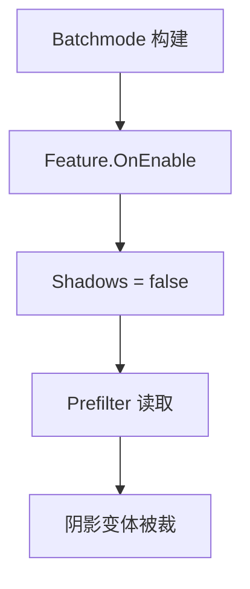

做过 Unity 项目的人，大概都遇到过这种情况：

某天突然发现包里没有阴影。shader 代码没动，stripping 规则没动，材质也没变。但阴影就是没有了。

我们最近遇到的这个问题，比这还要绕一点。

Jenkins 打出来的包没有阴影。本机打出来的包，之前有，但清了一次 Library 缓存之后，也没了。把 PoleStar/Lit 加进 Always Include Shaders，重新打，还是没有。

排查到最后，根因落在一行代码上：

```csharp
URPGraphicsSettings.MainLightCastShadows = false;
```

但这行代码本身没有问题。它在 Play Mode 下工作得很好，功能完全正确。问题在于，它所在的方法，在一个没有人预料到的时机被执行了。



---

## 一、阴影丢了，但代码看起来没有问题

先描述一下现象的完整面貌。

Android 包安装到手机上，场景里光源正确，shadow map 存在，logcat 里能看到 `mainKeyword=True`，一切运行时信号都说阴影应该有。但画面上就是没有阴影。

手机 logcat 里能看到 PoleStar/Lit ForwardLit 变体上传 GPU 时的 keyword 状态：

```
PoleStar/Lit ForwardLit, keywords _GLOBAL_LIGHTMAP_ON _NORMALMAP
```

没有 `_MAIN_LIGHT_SHADOWS`。

这个关键字的缺失说明问题的性质：包里根本没有带 `_MAIN_LIGHT_SHADOWS` 的变体。运行时找不到对应变体，退化到了不接收阴影的那条路径。

这不是运行时配置问题，也不是材质问题，而是构建期问题——这条变体在打包的时候就没被编译进去。

---

## 二、加进 Always Include Shaders 为什么没用

遇到变体不在包里，很多人的第一反应是：加进 Always Include Shaders。

这个直觉有它的道理。Always Include Shaders 会强制把 shader 纳入构建，绕过 `usedKeywords` 枚举阶段的限制——如果问题是"材质不在构建的 allObjects 里，keyword 组合没有进入 usedKeywords"，这个方法确实有效。

但加了之后，阴影还是没有。

看构建日志，问题就清楚了。PoleStar/Lit ForwardLit 的编译数字是这样的：

```
Full variant space:          98304
After settings filter:       24576
After scriptable strip:      18432
```

`98304 / 4 = 24576`，说明在 settings filter 这一层，shadow 关键字组里的 4 个选项只保留了 1 个——也就是只保留了 OFF 变体，其他全被提前剔掉了。

这不是自定义 stripping 规则干的（那在 `After scriptable strip` 这一行才体现）。是 URP 内置的 prefiltering 在 settings filter 阶段就把所有 `_MAIN_LIGHT_SHADOWS` 相关变体删掉了。

Always Include Shaders 能保证 shader 被枚举，但绕不过 prefiltering 的剔除。变体在枚举进来之后、还没到自定义 stripping 之前就已经被删了。

问题不在枚举，也不在自定义规则，而在 URP 的内置过滤逻辑。这层过滤的依据，来自 Pipeline Asset 里的两个字段。

---

## 三、真正的线索：pipeline asset 在打包后被悄悄改了

URP 内置的 ShaderPreprocessor 在决定是否剔除 shadow 变体时，读的是 Pipeline Asset 里的 `m_PrefilteringModeMainLightShadows` 字段。

这个字段是一个枚举值：

| 值 | 含义 |
|----|------|
| 0 | Remove：所有 shadow 变体全部剔除 |
| 1 | SelectMainLight：只保留 `_MAIN_LIGHT_SHADOWS` |
| 2 | SelectMainLightAndOff：保留主光和关闭状态 |
| 3 | SelectMainLightAndCascades：保留主光 + cascade 变体 |
| 4 | SelectAll：保留全部 shadow 变体 |

值为 0（Remove）时，URP 通过 `[ShaderKeywordFilter.RemoveIf]` 声明式属性（位于 `UniversalRenderPipelineAssetPrefiltering.cs`）把所有 shadow keyword 标记为移除。在构建期的 settings filtering 阶段，任何包含 `_MAIN_LIGHT_SHADOWS`、`_MAIN_LIGHT_SHADOWS_CASCADE` 或 `_MAIN_LIGHT_SHADOWS_SCREEN` 的变体都会被剔除。

用 SVN diff 对比工作副本和仓库里的 `AndroidPipelineAssetLow.asset`，发现了两行差异：

```
- m_MainLightShadowsSupported: 1
+ m_MainLightShadowsSupported: 0

- m_PrefilteringModeMainLightShadows: 4
+ m_PrefilteringModeMainLightShadows: 0
```

这两个值，在打包之后被改成了 0。

这不是 stripping 规则写错了。stripping 规则一行没动。是 stripping 读取的**输入配置**在打包过程中被悄悄改坏了。

pipeline asset 不会自己改。是谁改的？

---

## 四、根因：ScriptableObject.OnEnable() 不只在 Play Mode 触发

找到 `URPGraphicsSettings.MainLightCastShadows` 的赋值处，定位到 `CachedShadowsRenderFeature.OnEnable()`：

```csharp
private void OnEnable()
{
    if(isActive == false) return;
    // 打包的时候不关Shadow，进游戏再关
    URPGraphicsSettings.MainLightCastShadows = false;
}
```

注释写着"打包的时候不关 Shadow，进游戏再关"。说明写这段代码的人知道打包时不应该执行它，但误以为 `OnEnable()` 不会在打包时触发。

实际上，Unity 在打包（batchmode）初始化阶段，会把所有被 Graphics Settings 引用到的 Pipeline Asset、所有挂在 Renderer 上的 ScriptableRendererFeature 都加载进来。加载 ScriptableObject 资产，就会触发 `OnEnable()`。

这和 Play Mode 按下播放按钮时触发是同一个回调，但时机完全不同——此时是打包初始化，不是游戏运行。

`URPGraphicsSettings.MainLightCastShadows = false` 这行代码通过反射操作，触发了一条完整的污染链：

```
反射找到 QualitySettings.renderPipeline 对象
    ↓ FieldInfo.SetValue 把 m_MainLightShadowsSupported 写为 0
    ↓ URP 内部检测到变化，更新 prefiltering 数据（UpdateShaderKeywordPrefiltering）
    ↓ m_MainLightShadowsSupported = 0 → m_PrefilteringModeMainLightShadows = 0（Remove）
    ↓ 打包结束，Unity 调用 AssetDatabase.SaveAssets()
    ↓ 两个 0 被序列化写入 .asset 文件磁盘
    ↓ 下次打包，ShaderPreprocessor 读到 0/0
    ↓ 所有含 _MAIN_LIGHT_SHADOWS 的变体被删除
    ↓ 包内无阴影变体 → 无阴影
```

修复只需要一行：

```csharp
private void OnEnable()
{
    if(isActive == false) return;
    if(!Application.isPlaying) return; // 非运行时（编辑器加载、batchmode打包）不执行
    // 打包的时候不关Shadow，进游戏再关
    URPGraphicsSettings.MainLightCastShadows = false;
}
```

`Application.isPlaying` 在 batchmode 打包初始化时返回 `false`，这一行 guard 阻止了打包时的错误执行。

---

## 五、为什么本机之前有阴影：缓存救了你，清缓存暴露了真相

这里有一个值得单独解释的现象。

本机打包，之前是有阴影的。清了一次 Library 缓存之后，阴影就消失了。

原因是 `Library/PlayerDataCache` 和 `Library/BuildPlayerData` 会缓存上一次构建的 shader 编译产物。

污染发生的时序是这样的：

1. 很久以前，pipeline asset 还是正确值（1/4），打了一次包，shader 编译产物带着正确的 shadow 变体进了缓存
2. 后来某次打包，`OnEnable()` 执行，pipeline asset 被改成 0/0 写盘
3. 再次打包时，Unity 检查 shader 源文件没有变化，直接复用缓存里的编译产物——那些缓存是 1/4 时编的，shadow 变体都在
4. 表面上阴影还有，但磁盘上的 pipeline asset 已经是 0/0 了
5. 清缓存后，Unity 强制用当前磁盘上的 0/0 重新编译，shadow 变体全被 strip——阴影消失

Jenkins 环境没有本机积累的缓存，每次都是全新编译，所以从 pipeline asset 被污染的那次打包起，Jenkins 包就再没有阴影了。

本机的缓存掩盖了问题，给出了一个假的"有阴影"的结论，让排查方向一度跑偏。

---

## 六、验证：打包后确认 pipeline asset 没有被改动

修复上线之后，验证方式很简单：打包结束后，检查 pipeline asset 有没有被修改。

```bash
svn diff Assets/Settings/AndroidPipelineAsset.asset
svn diff Assets/Settings/AndroidPipelineAssetLow.asset
```

如果两个文件都没有输出，说明 `OnEnable()` 没有再污染它们，根因修复验证通过。

如果想把这个检查长期化，可以在 CI 的构建后脚本里加一条：pipeline asset 的这两个字段一旦偏离预期值就报警退出，不等到手机测试才发现。

---

## 最后

这件事让我重新想了一下排查 shader 变体问题的顺序。

常见的三层排查（枚举阶段 / stripping 阶段 / 运行时命中）都是正确的，但有时候在这三层之前还需要先做一件事：

`确认 stripping 读取的输入配置本身是否还是正确的。`

stripping 规则没动，不代表 stripping 的结果没变。如果 pipeline asset 在构建开始前就被悄悄改坏，rules 还是原来的 rules，但 inputs 已经不对了，outputs 自然也会错。

`ScriptableObject.OnEnable()` 在 batchmode 打包时会被触发，这件事本身不是 bug。但如果 `OnEnable()` 里有"只应该在运行时做的事"，它就会在错误的时机静默执行，把后续所有构建的前提条件改坏——而且这种破坏会被缓存遮住，等到缓存失效才暴露。

查变体问题，查规则之前先查输入。

---

*下一篇：[URP 的 Shader Variant 管理：Prefiltering、Strip 设置和多 Pipeline Asset 对变体集合的影响](../unity-urp-shader-variant-prefiltering-strip-settings)*

*扩展阅读：[Unity Shader Variant 缺失事故排查流程：从现象到根因的三层定位法](../unity-shader-variant-missing-diagnosis-flow)*
