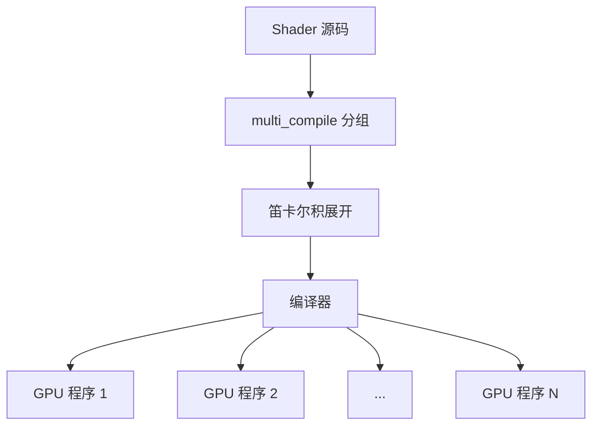

> 如果只用一句话概括这篇，我会这样说：Shader Variant 不是"带条件的 Shader"，而是"同一段 Shader 逻辑按不同关键字组合预先编译出的多份独立 GPU 程序"。

上一篇讲了 Shader Variant 为什么会存在。这篇进一步解决一个更基础的问题：

**变体到底是什么，`multi_compile` 为什么产生那么多版本，`EnableKeyword` 在运行时到底在做什么。**

---

## 为什么 GPU 不能直接做 if/else

先从问题的根源说起。

CPU 执行代码时，`if/else` 很正常——CPU 顺序执行，每次只走一条分支，另一条分支的代码直接跳过。

GPU 的执行模型不同。GPU 的核心优势是**大量线程同时执行同一段程序**——一个 Draw Call 可能同时有几万个像素的 Fragment Shader 在并行运行。这些线程被组织成 Warp（NVIDIA）或 Wave（AMD）这样的执行单元，同一个 Warp 里的所有线程在同一时刻执行同一条指令。

这就带来了一个问题：如果 Shader 里有 `if/else`，同一个 Warp 里的不同线程可能走不同的分支。GPU 的处理方式是**两条分支都执行，只是屏蔽掉"不该执行"的线程的写入**。这叫做 Warp Divergence（线程分歧）。

后果是：哪怕只有一半线程走了 `if` 分支，这条分支的代码仍然消耗了所有线程的执行时间。`if/else` 没有节省任何计算量，只是丢弃了一半的结果。

对于简单的条件（`if (x > 0.5)`），这个代价是可以接受的。但对于"这个材质要不要做法线贴图计算""要不要做阴影级联"这类**功能级别的开关**，`if/else` 意味着所有材质都要跑一遍法线贴图的采样和计算，只是最后不用——这是不可接受的浪费。

Unity 的解法是：**在编译期把每种功能组合拆成独立的程序，运行时选正确的那个版本去跑。**

---

## `multi_compile` 做的事：声明一个"编译时开关组"

```hlsl
#pragma multi_compile _ _WET_SURFACE _SNOW_SURFACE
#pragma multi_compile _ _HIGH_QUALITY_SHADOWS
```

先把这两行的语法拆开读：

**`#pragma` 是什么**：写给编译器的指令，不是 Shader 的运行逻辑。编译器读到 `#pragma` 开头的行，就按后面的内容调整编译行为。`#pragma multi_compile` 的意思是"声明一组编译时开关"。

**每行的结构**：`#pragma multi_compile` 后面跟着一组用空格分隔的选项，每次只能有一个选项被激活。

**单独一个 `_` 是什么**：Unity 约定用一个下划线表示"这个开关的关闭状态"，即不启用任何 keyword。读起来就是"要么什么都不开，要么开 `_WET_SURFACE`，要么开 `_SNOW_SURFACE`"。

```
#pragma multi_compile  _            _WET_SURFACE   _SNOW_SURFACE
                       ↑            ↑              ↑
                    关闭状态       湿地表面         雪地表面
                  （默认，什么      （开关打开）     （开关打开）
                    都不开）
```

这两行合起来告诉 Unity 编译器：

- 第一行：这里有一个三选一的开关——关闭、`_WET_SURFACE`、`_SNOW_SURFACE`
- 第二行：这里有一个二选一的开关——关闭、`_HIGH_QUALITY_SHADOWS`

Unity 对这两行做笛卡尔积，编译出所有组合：

```
组合 1：（无）         +（无）
组合 2：（无）         + _HIGH_QUALITY_SHADOWS
组合 3：_WET_SURFACE   +（无）
组合 4：_WET_SURFACE   + _HIGH_QUALITY_SHADOWS
组合 5：_SNOW_SURFACE  +（无）
组合 6：_SNOW_SURFACE  + _HIGH_QUALITY_SHADOWS
```

每个组合编译出**一份独立的 GPU 机器码**。这就是 6 个 Shader Variant。



在每个变体的编译过程里，`#ifdef` 决定哪些代码段被纳入这个版本：

```hlsl
// 这段代码只出现在含 _WET_SURFACE 的变体里
#ifdef _WET_SURFACE
    color = ApplyWetness(color);
#endif

// 这段代码只出现在含 _HIGH_QUALITY_SHADOWS 的变体里
#ifdef _HIGH_QUALITY_SHADOWS
    float shadow = SampleCascadedShadowMap();
#else
    float shadow = SampleSimpleShadow();
#endif
```

编译完之后，**不含 `_WET_SURFACE` 的变体里根本没有 `ApplyWetness` 的代码**——不是跳过，是压根不存在。这就实现了零运行时开销的功能切换。

---

## 变体是什么：一份 GPU 程序

更具体地说，一个 Shader Variant 在 Unity 内部是什么：

```
一个 Variant = 一份针对特定 keyword 组合编译好的 GPU 程序
              = HLSL 代码 + 特定 #define 组合 → 编译 → GPU 字节码/机器码
```

打包时，这些编译产物被存入 AssetBundle 或 Player 数据包。加载时，Unity 把对应的字节码上传给 GPU 驱动，驱动再做最终的平台特定编译（在某些平台上，这一步会在首次使用时触发，这就是"首帧卡顿"的来源之一）。

---

## `EnableKeyword` 在运行时切换什么

```csharp
material.EnableKeyword("_WET_SURFACE");
```

这行代码做的事，不是"修改 Shader 代码"，也不是"触发重新编译"。

它做的是：**更新这个材质当前激活的 keyword 集合，让下一次 SetPass 时选择不同的变体。**

更直观地说：

```
调用前：材质使用的是 变体3（_WET_SURFACE 关闭，无阴影增强）
调用后：材质使用的是 变体4（_WET_SURFACE 开启，无阴影增强）
```

GPU 收到的是完全不同的两份程序——只是切换速度很快，看起来像"在修改参数"。

全局关键字的切换同理：

```csharp
Shader.EnableKeyword("_HIGH_QUALITY_SHADOWS");
```

这会把所有材质的"阴影开关"档位往上切一格——所有下一次渲染时，只要 Shader 里有 `#pragma multi_compile _ _HIGH_QUALITY_SHADOWS`，都会切换到含 `_HIGH_QUALITY_SHADOWS` 的变体。

---

## 变体缺失时发生什么

如果运行时需要"组合4：`_WET_SURFACE` + `_HIGH_QUALITY_SHADOWS`"，但这个变体在构建时被 strip 掉了或者从未被收录进包，Unity 会用**评分算法找最相近的变体降级使用**（见运行时命中机制那篇的详细说明）。

降级的结果不是报错，而是**静默地渲染出错误效果**——阴影质量不对、表面效果不对，或者在最糟糕的情况下，出现粉色材质。

这就是为什么变体的收集和管理如此重要：漏掉一个变体不会崩溃，但会在特定条件下产生静默的视觉错误，而且这类问题很难在编辑器里复现（编辑器里所有变体都在）。

---

## 官方文档参考

- [Shader variants and keywords](https://docs.unity3d.com/Manual/shader-variants-and-keywords.html)
- [Shader compilation](https://docs.unity3d.com/Manual/shader-compilation.html)

---

## 为什么变体数量会爆炸

笛卡尔积是乘法。每增加一条 `multi_compile`，变体数量就乘以它的选项数：

```
1 条 multi_compile，4 个选项  → 4 个变体
2 条 multi_compile，各 4 个  → 4 × 4 = 16 个变体
3 条 multi_compile，各 4 个  → 4 × 4 × 4 = 64 个变体
4 条 multi_compile，各 4 个  → 4 × 4 × 4 × 4 = 256 个变体
```

URP 的 Lit Shader 有十几条 `multi_compile`，这是项目里变体数量动辄上千的根本原因，不是 bug，是设计如此。下一篇会讲怎么用 `shader_feature` 和设计规范来控制这个数字。
