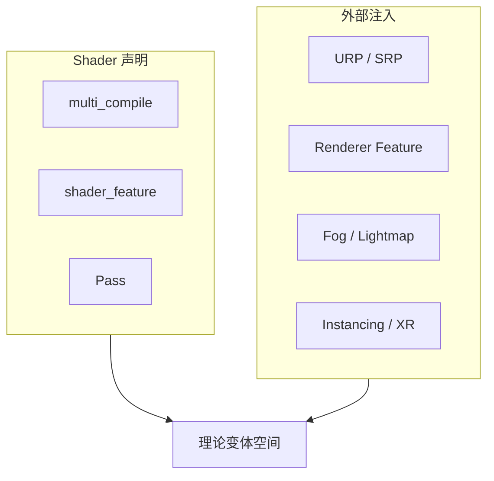

> 如果只用一句话概括这篇，我会这样说：Shader Variant 不是“某个 keyword 打开了就多一份程序”，而是“多个编译轴交叉后形成的一张版本网”。

这篇只回答一个问题：**哪些维度真的在制造 Shader Variant。**  
它不讲怎么排查丢变体，也不讲该用哪种治理工具。那些内容分别看保留链和剔除链的文章。

---

## 一、先把“来源”分成两层

最容易写乱的地方，是把所有影响结果的东西都当成“变体来源”。其实 Unity 里的来源大致分两类：

- **Shader 自己声明的轴**：`multi_compile`、`shader_feature`、`Pass`
- **Unity / 管线 / 平台注入的轴**：SRP keyword、Renderer Feature、Graphics API、Graphics Tier、XR、Lightmap、Fog、Instancing、Quality

前者是作者在源码里显式写出来的编译分叉。  
后者是 Unity 在构建时、管线配置里、平台适配里，额外叠加进来的编译条件。

这两个层次都能制造变体，但它们的”来源方式”不一样。



---

## 二、Shader 自己声明出来的轴

`multi_compile` 和 `shader_feature` 都是在声明“这里有一个编译时分叉”。

```hlsl
#pragma multi_compile _ _MAIN_LIGHT_SHADOWS
#pragma shader_feature_local _ _NORMALMAP
#pragma multi_compile_instancing
```

`multi_compile` 更像“把这组组合全部编出来”；`shader_feature` 更像“这条轴只有在项目里真的被用到时才有意义”。  
但从“来源地图”的角度，它们都属于同一类：**由 Shader 源码显式声明的变体轴**。

`local` 版本只是在作用域上更局部，不改变它是不是来源轴。  
换句话说，`shader_feature_local` 不是“另一种来源”，而是“同一种来源的局部版本”。

---

## 三、`Pass` 不是 keyword，但它会直接扩大变体空间

很多人把 `Pass` 当成渲染结构，忽略了它也是变体来源的一部分。原因很简单：**不同 Pass 是不同的编译单元。**

`ForwardLit`、`ShadowCaster`、`DepthOnly`、`Meta` 这些 Pass，哪怕用了同一组 keyword，它们仍然会分别形成独立的编译结果。  
所以 `Pass` 不是“一个额外 keyword”，而是一个会把变体空间再乘一层的边界。

从工程上看，可以把它理解成：

`同一组 keyword，在不同 Pass 下面，不是同一个 Variant。`

---

## 四、管线把轴注入进来：SRP keyword、Renderer Feature、Quality

这一层的关键点是：**这些轴很多并不是 shader 作者自己手写出来的。**

URP/HDRP 会根据管线资产、Renderer Feature、全局设置，把一批 keyword 轴带进编译过程。  
在源码里，这些信息会先从 `URP Asset`、Renderer 配置、全局图形设置里汇总，再变成构建时要考虑的 feature 集合。

最典型的例子是 `Renderer Feature`：

- `Decal`
- `Rendering Layers`
- SSAO
- Shadows 相关功能
- 2D / Deferred / Forward Plus 这类管线模式

这些都不是“材质上随手点一下”的东西，而是管线级别的编译输入。  
也就是说，**一旦某个功能在管线里被定义成可编译路径，它就已经是变体来源的一部分了。**

`Quality` 也属于这一层。它本身不是 keyword，但它会决定当前构建到底使用哪组渲染管线资产、哪套图形配置。  
因此，质量档不是“运行时显示偏好”，而是会影响编译输入的一部分。

---

## 五、平台和硬件能力：Graphics API、Graphics Tier、XR

这一层回答的是：**同一份 Shader，为什么在不同平台或不同能力档上会有不同变体。**

`Graphics API` 是最直观的一个：

- `D3D11`
- `D3D12`
- `Vulkan`
- `Metal`
- `OpenGL ES`

它们不是同一个后端。Unity 会针对不同后端生成不同的编译产物，所以同一个 Shader 从一开始就不是单一实体。

`Graphics Tier` 更像是全局能力档位。它不是材质级开关，而是编译前的能力边界，会让某些 shader 路径、宏定义或硬件级分支进入不同版本。  
你可以把它理解成“平台能力的更细粒度分层”。

`XR` 也是同样道理。它会引入自己的渲染路径和编译条件，比如单通道/多通道渲染、立体相关宏、与实例化相关的路径。  
这也是为什么 XR 项目里，变体空间经常比非 XR 项目更大。

---

## 六、光照与渲染模式：Lightmap、Fog、Instancing

这一组维度很容易被误会成“只是场景状态”，但它们会直接影响编译路径。

`Lightmap` 相关的常见轴包括：

- `LIGHTMAP_ON`
- `DIRLIGHTMAP_COMBINED`
- `DYNAMICLIGHTMAP_ON`
- shadowmask / probe 相关路径

`Fog` 也一样，通常会拆成不同雾模式和关闭状态。  
它不是“运行时渲染参数”，而是进入了 shader 的编译分叉。

`Instancing` 则是最典型的显式来源之一。`#pragma multi_compile_instancing` 这类声明会让同一段 shader 分裂出“支持实例化”和“不支持实例化”的不同版本。  
在工程上，这很重要，因为它经常和 XR、草地、大量同类物体渲染一起出现。

---

## 七、这些轴是怎么叠加成完整变体空间的

把上面几层放在一起，真正的变体空间其实是一个乘法结果：

- Shader 自己声明了哪些轴
- 当前 Pass 有哪些独立编译单元
- 管线和 Renderer Feature 注入了哪些轴
- 当前 Quality / Graphics Tier / Graphics API 选了哪条编译路径
- XR、Lightmap、Fog、Instancing 等全局渲染模式又打开了哪些分支

所以变体爆炸不是某一个 keyword 太多，而是**多个来源轴同时存在**。  
`multi_compile` 只是最显眼的一层，真正让项目变复杂的，是这些轴叠加在一起以后形成的组合空间。

---

## 八、源码里能看到的东西

如果只看 Unity 源码，能直接对应出几件事：

- `Editor/Mono/ShaderUtil.bindings.cpp` 里可以看到 Unity 会单独计算当前场景的 lightmap 和 fog 相关路径。
- `Packages/com.unity.render-pipelines.universal/Editor/ShaderBuildPreprocessor.cs` 会从 URP Asset、Renderer Feature、XR 和全局设置里汇总编译输入。
- `Editor/Mono/Shaders/ShaderKeywordFilterUtil.cs` 会按平台拿到对应的 render pipeline assets，再组织成构建时的过滤/编译输入。
- `UniversalRenderPipelineAssetPrefiltering.cs` 则把一部分功能开关直接映射成 shader feature 轴，比如 `DecalLayers`。

这些位置说明了一件事：**变体来源不是一个单点，而是一条由 Shader、管线、平台和全局配置共同拼出来的链。**

---

## 官方文档参考

- [Shader variants and keywords](https://docs.unity3d.com/Manual/shader-variants-and-keywords.html)
- [Shader compilation](https://docs.unity3d.com/Manual/shader-compilation.html)

---

## 九、这一篇不回答什么

这篇只回答“变体从哪里来”。  
它不回答：

- 哪些变体会在构建里被保留下来
- 哪些会被剔除
- 丢了以后为什么会粉、会错、会卡

那几部分分别看后面的保留链、剔除链和运行时命中文章。

如果你读完这篇之后，脑子里已经有一张“来源地图”，那这篇的目标就达到了。
