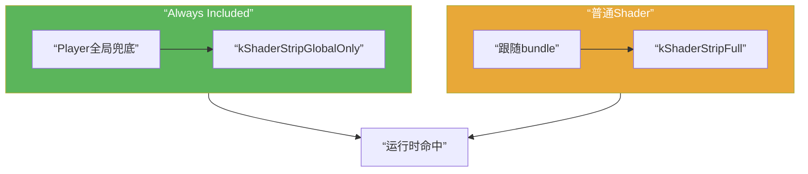

做 Unity 资源交付时，很多人都会碰到一个非常具体、也非常迷惑的现象：

`某个 Shader 放在 AssetBundle 里总出问题，但一旦把它加进 Always Included Shaders，问题就立刻好了。`

表面上看，这很像一个“神奇开关”：

- 材质不粉了
- 丢失效果回来了
- 某些 bundle 场景突然稳定了
- 原本只在真机或热更路径上出现的问题消失了

所以很自然会追问：

`为什么会这样？`

如果只从现象看，最容易得出的结论是：

`Always Included 更稳。`

但这个结论还不够精确。

更准确的说法其实是：

`Always Included 不是把 bundle 修好了，而是把 shader 的归属边界改了。`

这篇我就只讲这一件事。

## 先给一句总判断

如果把整件事压成一句话，我会这样描述：

`把 Shader 放进 Always Included Shaders，本质上是让 Player 全局内置这份 shader 及其所有 variant；而当它不在 Always Included 里时，AssetBundle 更可能需要自己承载那份平台相关 shader 代码或相关结果。`

这意味着两者最大的区别不是”都能不能用 shader”，而是：

`这份 shader 到底由谁负责带到运行时。`

- `Always Included`：更像 `Player` 全局内置
- `Shader 在 bundle 里`：更像当前交付内容自己负责

只要这个边界一换，后面很多问题就会看起来像被“一键修复”了。

## 一、Always Included 到底做了什么

这一层其实是最关键的。

Unity Graphics Settings 文档对 `Always Included Shaders` 的定义很直接：

- 这里的 shader，会把所有可能的 variant 都带进每一次构建
- 这对运行时才会用到的 shader 或 variant 很有用，比如 `AssetBundles`、`Addressables` 或运行时切 keyword 的场景
- 但对 variant 特别多的 shader 不推荐，因为会明显拖慢构建和运行时表现

从工程上看，这句话真正意味着两件事：

### 1. 它不是“保留一个 shader 引用”，而是把这份 shader 当成 Player 全局内容

也就是说，当 shader 被放进 `Always Included Shaders`，Unity 不再把它当成“某个内容入口也许会用到”的局部资源，而更接近把它视为：

`这份程序默认就应该带着走的全局渲染能力。`

### 2. 它不是“只保留当前用了的几个 variant”，而是更接近“把可能路径整体兜住”

这里有一个关键细节值得讲清楚。

Unity 构建时对 `Always Included Shaders` 里的 shader 使用的是 `kShaderStripGlobalOnly` 策略，而不是 `kShaderStripNone`（完全不剔）。

两者的区别是：

- `kShaderStripNone`：所有变体全部保留，一条都不剔
- `kShaderStripGlobalOnly`：只按全局构建状态剔变体，包括雾效模式、光照贴图模式、GPU Instancing 开关等全局配置不需要的路径——但不按材质关键字组合剔

实际工程含义是：

- `shader_feature` 声明的 keyword，如果它属于材质驱动的功能分支（比如 `_FEATURE_EMISSION`），**不会**因为某个材质没用到它就被剔掉
- 但如果是全局关闭的路径（比如项目完全关闭了雾效，那雾效相关变体仍然会被剔）

所以更准确的表述不是"所有变体全部保留"，而是：

`Always Included 的变体只按全局渲染配置做一次粗剔，不再按各材质的 keyword 使用面做精细裁剪。`

这就是为什么它在变体保留上比普通 bundle shader 粗暴得多，也更难出现"某个 keyword 路径恰好被漏掉"的问题。

## 二、它和“Shader 放在 AssetBundle 里”到底差在哪

这一层如果不拆开，后面所有现象都会被误读成“只是多带了一份 shader”。

其实区别比这更结构化。

### 1. 在 Always Included 里时，bundle 更像只存对 shader 的引用

Unity Support 对 AssetBundle 粉材质问题的解释非常明确：

如果 shader 在 `Always Included Shaders` 里，Unity 在构建 `AssetBundle` 时，会在 bundle 里存对这个 shader 的引用，而不是那份平台相关的 shader 代码。

换句话说，这时候 bundle 在假设：

`加载我的那个 Player，本来就已经有这份 shader。`

所以 bundle 不需要自己完整承载它。

### 2. 不在 Always Included 里时，bundle 更可能需要自己承载那份平台相关结果

同一篇 Unity Support 也反过来说明了另一边：

如果 shader 不在 `Always Included Shaders` 里，bundle 场景就更依赖它自己带上那份平台相关 shader code。

这时候你真正要赌的是：

- build target 对不对
- Graphics API 对不对
- 相关 variant 有没有真的生成
- 当前交付边界有没有真的把它们带齐

所以这两条路径最大的区别，不是“一个全局，一个局部”这么简单，而是：

`一个在用 Player 全局能力兜底，一个在要求当前 bundle 对 shader 结果自证完整。`

## 三、为什么一加 Always Included 看起来就好了

现在回头看这个现象，其实就不神秘了。

### 1. 因为你把问题从“bundle 自己要带对”改成了“Player 已经内置好了”

很多 bundle shader 问题本来就不是：

`Material 引用断了。`

而更像是：

- Player 根本没内置这份 shader
- bundle 里那份 shader code 不匹配目标平台或图形 API
- bundle 路径里缺了真正会命中的 variant
- stripping、prefiltering 或构建边界把关键路径裁掉了

一旦你把 shader 放进 `Always Included`，这类问题里相当大的一部分都会被直接绕开。

因为这时系统面对的是：

`Player 里已经有，而且还是一整份更完整的 shader 世界。`

### 2. 因为它会把所有 variant 一起兜住

这也是它看起来特别有效的原因。

很多现场症状并不是“shader 没有”，而是：

- `Shader` 资源在
- `Material` 引用也在
- 但当前 keyword 路径真正要命中的那个 variant 不在

这时 `Always Included` 的粗暴之处恰好变成了优势：

`我不再跟你细算哪些 variant 应该保留，我直接把这一整份 shader 的 variant 都放进 Player。`

所以很多原本属于 variant 生成、裁剪、预热、交付边界的问题，都会暂时被遮住。

### 3. 因为它把“当前 bundle 是否自证完整”这个问题变轻了

不走 `Always Included` 时，你其实是在要求：

`这个 bundle 所处的构建与交付边界，必须足够正确，才能把 shader 世界接完整。`

而一旦走 `Always Included`，要求就变成了：

`只要 Player 自己内置得够完整，bundle 侧很多问题就没那么容易炸。`

这就是为什么它像一个“止血手段”，而不一定像一个“根因修复手段”。

## 四、Always Included 和 bundle 自带 shader，分别在赌什么

把这件事讲成两套不同的工程策略，会更清楚。

### 1. Always Included 在赌“全局内置比局部分发更省心”

这条路线更接近：

- 把 shader 当成程序基础能力
- 让所有入口都默认能找到它
- 用更大的 Player 成本，换更低的局部交付复杂度

它最擅长解决的是：

- 线上先止血
- 某些少量关键 shader 必须全局稳定
- 当前项目还没把 shader 的 bundle 治理完全理顺

### 2. bundle 自带 shader 在赌“交付边界足够正确，可以按需带齐”

这条路线更接近：

- shader 是内容交付的一部分
- 哪些 shader 跟着哪个内容入口走，要按交付边界显式设计
- Player 不必为所有入口内置所有 shader 世界

它的优势是更节省全局成本，也更符合内容按需分发。

但它要求你把这些事情都做对：

- 目标平台
- Graphics API
- variant 生成与 stripping
- 共享依赖和 bundle 闭包
- SVC 与预热策略

所以它更灵活，也更难。

## 五、为什么 Always Included 不能当长期默认解法

如果它只是“更稳”，那好像所有 shader 都该塞进去。

但 Unity 文档专门提醒过，这个功能不推荐给 variant 很多的 shader，例如 `Standard Shader`，因为它会显著拖慢构建和运行时表现。

这背后的账其实很直接。

### 1. 包体和构建成本会上升

只要 shader variant 很多，把它们全局塞进每次构建，代价通常会直接体现在：

- Player 体积
- 构建时间
- 构建产物复杂度

### 2. 运行时准备成本也会上升

带进来的 variant 越多，后面可能要付的代价也越多：

- 首载准备
- 内存占用
- shader 加载与预热压力

所以 `Always Included` 很适合做兜底，不太适合做“所有问题统一答案”。

### 3. 它还会掩盖真正的交付边界问题

这点在工程治理上尤其重要。

因为一旦你靠 `Always Included` 把问题压住了，团队就更容易失去动力去回答这些本来迟早要回答的问题：

- 这个 shader 到底应该由谁交付
- 哪些 variant 真的是目标内容需要的
- 哪些问题是 Player 全局能力，哪些问题其实属于 bundle 内容治理

也就是说，它有时会让问题“看起来不存在了”，但根因边界并没有真的被理顺。

## 六、还有一个非常关键的坑：构建和加载时的列表必须一致

这一点非常容易被忽略，但 Unity Support 写得很明确：

`Always Included Shaders` 列表在构建 `AssetBundle` 和加载 `AssetBundle` 时必须保持一致。

要理解为什么，得先清楚 Unity 在构建 bundle 时实际做了什么。

### 1. 构建时，Unity 会自动把 Always Included shader 从 bundle 里排除

这一步发生在 `BuildSerialization.cpp` 里。Unity 构建 AssetBundle 时，如果检测到某个 shader 已经在 `Always Included Shaders` 列表里，会主动跳过它，不把它写进 bundle 的实体内容。

原因也写在注释里：

`putting them into bundles would just lead to duplication of shaders`

bundle 只会存一个 PPtr 引用，运行时靠这个引用去找 Player 内置的那份 shader 实体。

### 2. 所以构建时在列表里，bundle 存的是引用，而不是 shader 本体

这时候 bundle 在假设：

`加载我的 Player 肯定已经内置了这份 shader。`

### 3. 但如果加载时你把它从列表里删了，Player 里可能根本没有它

这时现场就会变成：

- bundle 里只有引用
- Player 里又没有真正的 shader 实体

结果自然就是找不到，常见表现就是粉。

这类问题最容易出现在：

- 两个 Unity 工程一个构建 bundle、一个加载 bundle
- 不同分支、不同环境的 `Graphics Settings` 不一致
- 构建和加载使用的 Graphics API 列表也不一致

这也是为什么 `Always Included` 不是单纯的本地小开关，而是会进入交付契约的一部分。

## 七、什么时候该用它，什么时候不该靠它

如果只从工程判断上给建议，我会这样分：

### 1. 适合先用它兜住的时候

- 线上正在出 shader 事故，需要先止血
- 少量关键 shader 必须全局稳定
- 当前 bundle shader 治理链还没完全建立
- 某些基础渲染能力本来就更接近 Player 全局能力

### 2. 不适合长期依赖它的时候

- shader variant 数量非常大
- 项目强依赖资源按需交付
- 你们已经在认真做 stripping、SVC、预热和回归治理
- 真正的问题其实是 bundle 边界、构建配置或 variant 生成链不对

这时候更稳的长期做法通常不是“继续加 Always Included”，而是回头把：

- shader 归属边界
- variant 保留策略
- bundle 构建和依赖闭包
- 运行时预热与回归入口

这些地方真正理顺。

## 官方文档参考

- [Graphics Settings](https://docs.unity3d.com/Manual/class-GraphicsSettings.html)
- [Shader variants and keywords](https://docs.unity3d.com/Manual/shader-variants-and-keywords.html)

## 最后收成一句话

如果把这篇最后再压回一句话，我会这样说：

`Shader 加到 Always Included 就好了，通常不是因为它神奇地修复了 bundle，而是因为它把 shader 从“当前交付内容自己负责带齐”改成了“Player 全局已经内置并兜底”；问题之所以看起来消失了，常常只是你换了一套承担责任的边界。`

也正因为如此，`Always Included` 更像一个强力兜底开关，而不该被误当成所有 bundle shader 问题的长期标准答案。
