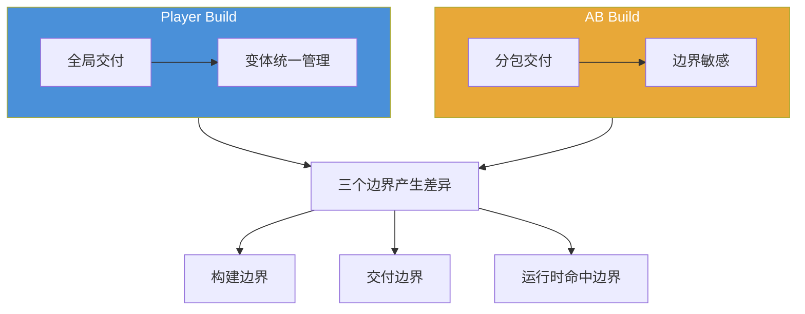

前一篇我已经先把一个更底层的问题拆开了：

`Shader 在 AssetBundle 里，不该被理解成“一个完整可运行效果被原样塞进包里”，而应该拆成资源定义层、编译产物层和运行时命中层。`

如果这个判断站住，下一步最自然的问题其实就是：

`为什么 Shader Variant 问题总在 AssetBundle 场景里集中爆出来？`

这不是错觉。

项目里很多最典型的 shader 事故，确实都喜欢长在这一层：

- 编辑器正常，打成 bundle 后材质变粉
- `Material` 和 `Shader` 看起来都在，效果却还是不对
- 某些入口正常，某些入口第一次进场景就错
- 某些平台有问题，另一些平台没问题
- 明明没在 `OnProcessShader` 里过滤，variant 却根本不存在

如果不把这里的结构讲清，很容易得到一个过于简单的结论：

`AssetBundle 很容易把 Shader 搞坏。`

但更稳的说法其实不是这个。

## 先给一句总判断

如果把这篇压成一句话，我会这样描述：

`Shader Variant 问题之所以总在 AssetBundle 上爆出来，通常不是因为 AssetBundle 凭空制造了问题，而是因为它把 shader 所跨越的构建边界、交付边界和运行时命中边界都显式暴露出来了。`

这句话里最关键的是三个词：

- `构建边界`
- `交付边界`
- `运行时命中边界`

普通资源很多时候只要：

`资源在 -> 引用在 -> 对象恢复成功`

问题就结束了。

但 `Shader` 不一样。

它天然还要继续跨：

- 哪些 variant 会被生成
- 哪些结果会进入目标交付物
- 运行时当前路径到底命中哪条编译结果

只要这三层里有一层出问题，现场症状就可能都长在材质上。

## 一、先把一句“Shader 坏了”拆成几类不同问题

为什么 bundle 场景特别容易让人误判，第一原因就是：

`很多根因完全不同的问题，表面上都长得很像。`

### 1. 资源定义层的问题

例如：

- `Material` 指向的 `Shader` 引用本身就断了
- shader 资源没有进入目标内容边界
- `SVC` 根本没有登记关键路径

这类问题更像：

`资源层就不完整。`

### 2. 编译生成层的问题

例如：

- 某些 variant 根本没被生成
- prefiltering 在更早阶段就把某些路径掐掉了
- stripping 把真正会走到的 variant 删了

这类问题更像：

`shader 资源还在，但目标平台需要的那批结果没形成。`

### 3. 交付边界层的问题

例如：

- variant 所依赖的那部分内容不在当前交付闭包里
- Player 和 bundle 之间的 shader 边界切错了
- 某些共享依赖只在另一个入口被带上

这类问题更像：

`构建出来了，但没有以正确边界进入当前内容世界。`

### 4. 运行时命中层的问题

例如：

- 引用接回去了，但当前 keyword 组合命中了错误路径
- variant 在，但首载时没有预热
- 某条路径第一次真的走到时才暴露缺口

这类问题更像：

`结果存在与否、结果是否被正确命中，是两件不同的事。`

这四类问题如果不先拆开，后面很容易全部被归成一句：

`bundle 里的 shader 不对。`

但工程上，这句话通常只是在重复症状。

## 二、编辑器为什么经常把这些问题遮住

要理解“为什么总在 AssetBundle 上爆”，其实要先理解另一件事：

`为什么编辑器里很多时候看起来没事。`

### 1. 编辑器里的资源世界通常更完整

在编辑器环境下，项目更接近一个“大而全”的资源世界：

- 资源边界没被切得那么硬
- 很多依赖默认可达
- shader 相关上下文更完整
- 运行时真实首载路径还没被压缩成线上那条交付链

所以有些问题在编辑器里会被天然遮住。

它不是不存在，而是还没有被逼到“目标平台、目标交付物、目标入口路径”这三个条件同时收窄的状态。

### 2. 编辑器验证的通常不是“线上交付世界”

很多团队现场都会经历这个错觉：

`编辑器里 prefab 一切正常，所以 bundle 下来也应该正常。`

但对 shader 来说，这个推理经常不成立。

因为编辑器验证的更像是：

- 资源定义是否存在
- 大部分引用是否能接回
- 当前项目上下文里是否能找到一条可用 shader 路径

而线上真正要验证的是：

- 目标平台需要的 variant 是否真的生成
- 当前交付闭包里是否真的带齐了相关内容
- 当前入口第一次走到这条路径时，是否真的能命中正确结果

这已经不是同一套世界了。

## 三、AssetBundle 会把构建边界硬切出来

这才是第一层真正会“放大问题”的地方。

### 1. 普通资源打包更多是在切对象交付边界

对大多数普通资源来说，切 bundle 主要是在回答：

- 哪些对象一起交付
- 哪些依赖一起进入闭包
- 哪些内容要按入口分发

这已经很复杂，但问题大多还停留在“对象有没有、引用对不对”这层。

### 2. Shader 还会额外碰到“哪些编译路径被视为当前目标内容”

一旦碰到 shader，构建系统要额外决定：

- 哪些 variant 会参与目标构建
- 哪些 keyword 组合是当前平台和当前管线真正关心的
- 哪些结果留在 Player，哪些跟着 bundle 内容路径暴露出来

这意味着 bundle 不只是在切资源对象，也是在逼你面对：

`这份内容世界到底需要哪些 shader 编译结果。`

很多项目之前没显式回答过这个问题。

所以一到 AssetBundle，这笔账就一起结了。

### 3. 有时问题不是“编进去了没加载”，而是“更早根本没生成”

这也是很多人第一次排查 shader bundle 问题时最容易踩错的地方。

直觉上，大家会先怀疑：

- 下载是不是少了
- 依赖是不是没先加载
- `OnProcessShader` 是不是被过滤掉了

但像 `URP Shader Prefiltering` 这类问题，根因其实更早。

它不是“后面被漏带”，而是：

`构建系统在更前面就认定这条路径不需要，于是根本没有生成。`

只要 AssetBundle 把目标构建路径切得更明确，这类问题就会更容易显影。

### 4. SBP 的变体收集范围天然不对称

这个问题还有一层更具体的技术根因值得展开。在 SBP（Scriptable Build Pipeline）里，`CalculateSceneDependencyData` 和 `CalculateAssetDependencyData` 收集 shader 引用时，只会遍历当前构建目标的依赖闭包里实际被材质引用到的 shader。随后 `StripUnusedShaderVariants` 在这个集合上跑 `IPreprocessShaders` 回调，决定最终保留哪些 variant。这意味着 AB 构建只会包含当前打包目标依赖链上材质所引用的 keyword 组合——而不是整个工程的全集。

Player 构建则不同。它会扫描所有参与构建的场景、所有 `Resources` 目录，把整个项目级别的 shader 引用全部收集一遍。

这就是那个最根本的不对称：编辑器 Play Mode 下所有 variant 都在内存里可用，但 AB 构建只从它自己的依赖子集里收集了一部分。所以"编辑器里跑正常、AB 包加载后材质变粉"这类事故，很大一部分根因就在这里——不是 variant 被 strip 掉了，而是它从一开始就没进入 AB 构建的收集范围。

### 5. ShaderCompilerPlatform 过滤带来的平台匹配问题

构建边界还有另一条容易被忽视的切面：平台级别的编译目标过滤。当为某个特定平台构建 AB 时，shader 编译器只会产出该平台对应的 `ShaderCompilerPlatform` 枚举值所匹配的程序（例如 iOS 对应 `kShaderCompPlatformMetal`，Android 对应 `kShaderCompPlatformVulkan`）。如果 AB 构建时选错了目标平台，或者 Player Settings 里 Graphics APIs 的配置和运行时设备实际使用的图形 API 不一致，那么打进 bundle 的编译产物在运行时就不会被匹配到。

这类问题是可以诊断的：在运行时检查 `SystemInfo.graphicsDeviceType`，然后和 AB 构建时指定的目标平台做对比。如果两边对不上，问题就不在 variant 层面，而是更底层的平台编译产物根本不匹配。

## 四、AssetBundle 会把交付边界也硬切出来

如果说构建边界回答的是“生成哪些结果”，那交付边界回答的就是：

`这些结果到底随着哪套内容世界到达玩家手里。`

### 1. bundle 让“哪些内容属于当前入口”变得必须显式

在 AssetBundle 场景里，很多事情都不再能靠“编辑器里默认都在”混过去。

项目必须显式面对：

- 首包有哪些内容
- 某个场景入口依赖哪些 bundle
- 共享资源在哪里被承载
- 某条 shader 路径相关内容是否真的在当前闭包里

这层一旦没理清，现场就会出现一种很典型的错觉：

`我明明在项目里有这个 shader，也明明在别的入口见过这个效果，为什么这个 bundle 场景还是错。`

因为“项目里有”和“当前入口这套交付世界里有”，从来就不是一回事。

### 2. Player 和 bundle 的边界让 shader 问题更容易分裂成“看起来像同一个问题”的几类故障

有时候问题表现像：

- shader 资源没到
- 实际上是 variant 没到
- 或者资源和 variant 都到了，但当前入口第一次命中时还是冷的

玩家看到的都可能只是“效果不对”。

但在工程上，它们分别落在：

- 资源交付边界
- 编译产物交付边界
- 运行时准备边界

AssetBundle 之所以像“事故高发地”，很大一部分就是因为它强迫这几条边界开始各自承担责任。

## 五、AssetBundle 还会把运行时首载路径显式化

这是第三层最容易被忽视的放大镜。

### 1. 编辑器里的“能找到一条路径”不等于线上首载路径稳

线上真正的问题常常不是：

`系统永远找不到。`

而是：

`系统第一次真的走到这条路径时，才发现没有准备好。`

这在 shader 上很常见。

例如：

- variant 在，但没有预热
- 当前入口第一次走到某组 keyword 组合
- 依赖链在之前从来没完整凑齐过

这时候症状可能是：

- 首帧卡顿
- 第一次切场景闪一下
- 某个特定入口第一次变粉、之后又恢复

如果没有 AssetBundle 这条按需交付链，很多首载问题并不会这么早被逼出来。

### 区分”variant 不存在”和”variant 未预热”

这里有一个关键区分必须先立住，否则排查方向会从一开始就走偏。运行时 shader 表现异常其实对应两种根因完全不同的失败模式：

**第一种：variant 不在构建产物里（永久性缺失）。** 序列化数据里根本没有对应的 SubProgram 条目。这种情况下无论运行时做什么都无法修复——必须回到构建期，确保目标 variant 被正确收集和保留后重新打包。典型症状是材质持续粉色或 fallback 到错误的渲染路径，并且不会自行恢复。

**第二种：variant 在构建产物里，但 GPU 程序尚未创建（瞬时性未就绪）。** SubProgram 数据确实存在于序列化文件中，但 `GfxDevice::CreateGPUProgram` 还没被调用过。第一次使用时会触发平台级着色器编译（Vulkan/Metal 上是 PSO 创建，OpenGL 上是程序链接），造成 5-50ms 的卡顿。`ShaderVariantCollection.WarmUp` 就是用来提前触发这一步的。典型症状是首次出现时短暂卡顿或闪烁，之后渲染正确。

这两条路径的诊断方法和修复手段完全不同。把它们混在一起会浪费大量时间：对一个根本不存在的 variant 调用 WarmUp 没有任何意义，而对一个只需要预热的 variant 去重新走构建流程也是多余的。

### 2. bundle 把”冷启动命中”从偶发边缘条件变成常态

只要内容按需下载、按需加载、按入口分发，系统天然就会更频繁地遇到：

- 某条渲染路径第一次真的被使用
- 某组 variant 第一次真的需要
- 某些材质组合第一次在目标设备上出现

所以 shader 问题在 bundle 世界里，不只是更容易出错，也更容易真正被玩家第一次看到。

这也是为什么首载卡顿、首场景错效果、切入口才出错，常常和 variant 问题缠在一起。

## 六、为什么表面症状都长在材质上，根因却分散在三层边界里

这也是 bundle shader 问题最烦的地方。

玩家和研发第一眼看到的，往往都只是：

- 粉
- 黑
- 阴影没了
- 某个后处理没了
- 某个平台效果不一致

这些症状全都长在材质效果上。

但根因却可能分别落在：

### 1. 资源定义层

- `Material` 引用断了
- shader 资源没跟进当前闭包

### 2. 编译产物层

- variant 没生成
- variant 被 strip 掉
- prefiltering 提前把路径剪没了

### 3. 运行时命中层

- variant 有，但没命中
- variant 有，但没预热
- 当前入口第一次才真正走到这条路径

所以很多团队会觉得 shader 问题特别“玄学”，并不是因为它真的玄，而是因为：

`表面现象的聚焦层，和根因的发生层，经常不是同一层。`

而 AssetBundle 正好把这种分层错位放大得更明显。

## 七、遇到 AssetBundle 场景下的 Shader Variant 问题时，第一刀该怎么切

如果你下一次碰到“bundle 一下来 shader 就不对”，我更建议先按下面这个顺序切，而不是先去猜：

### 1. 先问：资源定义层在不在

先看：

- `Material` 是否还挂着目标 `Shader`
- shader 资源是否进入了目标交付边界
- `SVC` 是否真的登记了关键路径

这一刀回答的是：

`资源层定义是不是已经坏了。`

### 2. 再问：目标构建产物有没有形成

再看：

- 目标平台需要的 variant 是否真的生成
- stripping、prefiltering、构建配置是不是更早就把它排掉了
- 这批结果是否真的跟着目标内容边界进入了当前构建世界

这一刀回答的是：

`问题是没带到运行时，还是根本没在构建期存在过。`

### 3. 最后问：运行时有没有命中和准备好

最后再看：

- 当前入口是否第一次才走到这条路径
- variant 是没有，还是有但冷
- 依赖是否在命中前真的就绪
- 问题是长期错误，还是首载瞬时错误

这一刀回答的是：

`问题是资源世界错了，还是第一次使用这条路径时没准备好。`

只要这三刀先切清，很多“看起来全都像 bundle shader 问题”的现场，马上就会开始分层。

## 官方文档参考

- [Shader variants and keywords](https://docs.unity3d.com/Manual/shader-variants-and-keywords.html)
- [Graphics Settings](https://docs.unity3d.com/Manual/class-GraphicsSettings.html)

## 最后收成一句话

如果把这篇最后再压回一句话，我会这样说：

`Shader Variant 问题总在 AssetBundle 上爆出来，不是因为 AssetBundle 神秘地把 shader 搞坏了，而是因为它把“哪些 variant 被生成、哪些结果被交付、哪些路径在运行时第一次被命中”这三笔原本容易被遮住的账，一次性摊在了桌面上。`

也正因为如此，后面再去谈：

- 怎么知道项目到底用了哪些 variant
- 怎么定位运行时到底缺了哪些
- stripping、SVC、预热和回归应该怎么治理

这些问题才会真正变得有抓手。
